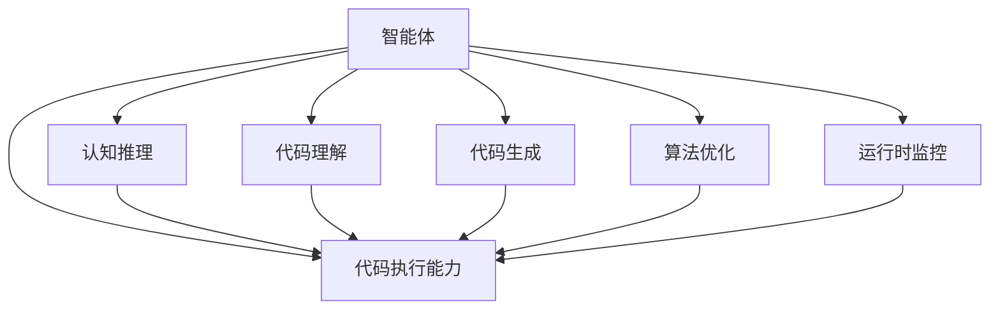

                 

# 代码执行能力在 Agent 中的作用

> 关键词：Agent, 执行能力, 代码理解, 智能体, 认知推理, 代码生成, 自动编程, 算法优化, 运行时监控, 系统可维护性

## 1. 背景介绍

在现代人工智能(AI)的发展历程中，智能体(Agent)的出现和应用，极大地提升了软件系统的自动化和智能化水平。智能体是一类具有目标导向、自主决策能力的软件系统，能够在复杂的动态环境中自主完成任务，是人工智能与实际应用结合的重要载体。然而，智能体的核心价值在于其代码执行能力，即通过执行一系列有序的代码指令，实现特定的功能。

在实际应用中，智能体的代码执行能力直接影响到其任务的完成效率、系统稳定性和用户满意度。例如，在自动驾驶系统中，智能体需要执行大量复杂的计算和决策，以确保车辆的行驶安全。在金融交易系统中，智能体需要实时处理海量数据，做出精准的投资决策。在智能客服系统中，智能体需要根据用户输入生成合理的回复，以提高服务质量。因此，提升智能体的代码执行能力，对于保障其功能的有效性和可靠性具有重要意义。

## 2. 核心概念与联系

### 2.1 核心概念概述

为更好地理解代码执行能力在智能体中的作用，本节将介绍几个密切相关的核心概念：

- **智能体(Agent)**：一类具有自主决策和执行能力的软件系统，能够通过执行代码指令实现特定功能。智能体是人工智能与实际应用结合的关键载体。

- **代码执行能力(Code Execution Capability)**：智能体通过执行一系列代码指令，实现其目标的能力。这种能力是智能体自主决策和任务执行的基础。

- **认知推理(Cognitive Reasoning)**：智能体基于感知到的环境和内部知识，通过推理和判断做出决策的能力。代码执行能力与认知推理密切相关，后者为前者提供了必要的计算和逻辑支持。

- **代码理解(Code Understanding)**：智能体对代码指令含义、语法结构和逻辑关系的理解和处理能力。这是代码执行能力的核心组成部分。

- **代码生成(Code Generation)**：智能体根据任务需求，动态生成或优化代码指令的能力。这种能力是智能体自我适应和任务优化的关键。

- **算法优化(Algorithm Optimization)**：智能体对现有算法进行改进或优化的能力。这种能力能够提升代码执行效率和系统性能。

- **运行时监控(Runtime Monitoring)**：智能体在执行代码指令时，对其运行状态和性能指标进行实时监控和反馈的能力。这种能力有助于发现和纠正代码执行中的问题，提升系统稳定性。

这些核心概念之间的逻辑关系可以通过以下Mermaid流程图来展示：



这个流程图展示智能体的核心概念及其之间的关系：

1. 智能体通过执行代码指令实现其目标。
2. 认知推理为智能体的决策提供了基础。
3. 代码理解、代码生成、算法优化和运行时监控，都是智能体代码执行能力的具体体现。
4. 这些能力相互协作，共同支撑智能体的自主决策和任务执行。

## 3. 核心算法原理 & 具体操作步骤
### 3.1 算法原理概述

智能体的代码执行能力主要通过执行机制和优化机制来实现。其核心思想是：通过理解、生成和优化代码指令，智能体能够高效、准确地完成任务。

形式化地，假设智能体 $A$ 的执行任务 $T$ 需要执行代码指令 $C$，则智能体的执行过程可以表示为：

$$
A_{task(T)} = A_{code}(C_{task(T)})
$$

其中，$A_{task(T)}$ 表示智能体执行任务 $T$ 的功能，$A_{code}$ 表示智能体对代码指令 $C$ 的执行机制，$C_{task(T)}$ 表示任务 $T$ 对应的代码指令集合。

智能体的执行机制 $A_{code}$ 包括代码理解、代码生成和运行时监控等子机制，其目标是确保代码指令的有效执行。智能体的优化机制 $A_{opt}$ 包括算法优化和代码优化等子机制，其目标是通过改进和调整代码指令，提升执行效率和系统性能。

### 3.2 算法步骤详解

智能体的代码执行能力主要通过以下步骤实现：

**Step 1: 代码理解**

代码理解是智能体执行代码指令的基础。其目标是通过解析和理解代码指令，确保智能体能够正确执行任务。代码理解的具体步骤包括：

1. 语法解析：通过语法分析器将代码指令解析为抽象语法树(AST)，理解代码的语法结构。

2. 语义分析：通过语义分析器对代码指令进行语义检查，确保代码符合逻辑规则。

3. 上下文理解：通过上下文分析器理解代码指令所处的执行环境和上下文信息，为代码执行提供必要的环境变量和参数。

**Step 2: 代码生成**

代码生成是智能体动态生成或优化代码指令的能力。其目标是通过生成更优化的代码指令，提升执行效率和系统性能。代码生成的具体步骤包括：

1. 自动生成：根据任务需求，自动生成代码指令。例如，在自动编程任务中，智能体可以根据用户需求生成相应的代码。

2. 代码优化：对现有的代码指令进行优化，提升执行效率和系统性能。例如，在编译器中，智能体可以通过编译优化技术，生成更高效的代码。

3. 并行生成：对代码指令进行并行化处理，提升执行速度。例如，在分布式系统中，智能体可以并行生成多个代码指令，提高执行效率。

**Step 3: 执行与监控**

智能体的执行机制通过执行代码指令，实现其目标。执行过程包括：

1. 代码执行：通过执行代码指令，智能体完成其任务。例如，在自动驾驶系统中，智能体通过执行计算和决策代码，实现车辆的自主驾驶。

2. 运行时监控：在执行代码指令时，智能体实时监控其运行状态和性能指标，如CPU使用率、内存占用、执行时间等。例如，在金融交易系统中，智能体实时监控交易系统的运行状态，确保系统稳定。

**Step 4: 优化与反馈**

智能体的优化机制通过改进和调整代码指令，提升执行效率和系统性能。优化过程包括：

1. 算法优化：通过改进算法实现，提升代码执行效率。例如，在深度学习模型中，智能体可以通过优化算法实现，提升模型训练和推理效率。

2. 代码优化：通过代码重构和优化技术，提升代码执行效率。例如，在软件系统开发中，智能体可以通过代码重构和优化技术，提升系统性能。

3. 反馈与调整：根据运行时监控结果，智能体实时调整代码指令，优化系统性能。例如，在自动驾驶系统中，智能体根据实时监控结果，动态调整计算和决策代码，提升驾驶安全。

### 3.3 算法优缺点

智能体的代码执行能力具有以下优点：

1. 高效性：通过代码理解、生成和优化，智能体能够高效地完成任务。

2. 灵活性：智能体可以根据任务需求，动态生成和优化代码指令，提高执行效率。

3. 稳定性：通过运行时监控和优化，智能体能够及时发现和纠正执行中的问题，提升系统稳定性。

4. 可扩展性：智能体可以通过并行化处理和分布式执行，提升执行效率和系统性能。

然而，这种能力也存在一些局限性：

1. 依赖语境：智能体的代码执行能力依赖于其对执行环境和上下文信息的理解，对于复杂任务，可能存在理解不足的问题。

2. 依赖数据：智能体的代码生成和优化需要大量的数据支持，数据不足可能导致生成的代码不够优化。

3. 依赖算法：智能体的算法优化需要大量的计算资源和时间，对于大规模任务，可能存在优化不足的问题。

4. 依赖资源：智能体的执行机制需要大量的计算和内存资源，对于资源受限的任务，可能存在执行效率不足的问题。

尽管存在这些局限性，但智能体的代码执行能力仍是大规模任务自动化和智能化的重要保障。未来研究的方向是如何在不同场景下，优化和增强这种能力，提升智能体的执行效率和系统性能。

### 3.4 算法应用领域

智能体的代码执行能力在多个领域得到了广泛应用，例如：

- **自动驾驶**：智能体通过执行计算和决策代码，实现车辆的自主驾驶。

- **金融交易**：智能体通过执行实时数据处理和投资决策代码，实现自动交易。

- **智能客服**：智能体通过执行文本生成和自然语言理解代码，实现客户服务。

- **智能制造**：智能体通过执行生产调度和质量控制代码，实现智能制造。

- **医疗诊断**：智能体通过执行医学图像分析和诊断代码，实现智能诊断。

- **自动编程**：智能体通过执行代码生成和优化代码，实现自动编程。

除了上述这些经典领域，智能体的代码执行能力还将在更多场景中得到应用，如自动测试、智能推荐、自然语言处理等，为各行各业带来更高效、智能的解决方案。

## 4. 数学模型和公式 & 详细讲解 & 举例说明

### 4.1 数学模型构建

假设智能体 $A$ 的任务 $T$ 需要执行代码指令集合 $C_{task(T)}$。则其执行过程可以表示为：

$$
A_{task(T)} = A_{code}(C_{task(T)})
$$

其中，$A_{code}$ 表示智能体对代码指令 $C$ 的执行机制，$C_{task(T)}$ 表示任务 $T$ 对应的代码指令集合。

智能体的执行机制 $A_{code}$ 可以表示为：

$$
A_{code} = A_{understand}(A_{generate}(A_{monitor}(A_{opt})))
$$

其中，$A_{understand}$ 表示智能体的代码理解能力，$A_{generate}$ 表示智能体的代码生成能力，$A_{monitor}$ 表示智能体的运行时监控能力，$A_{opt}$ 表示智能体的优化能力。

### 4.2 公式推导过程

下面以自动驾驶系统为例，推导智能体代码执行能力的数学模型。

假设智能体 $A$ 的自动驾驶任务 $T$ 需要执行计算和决策代码，其执行过程可以表示为：

$$
A_{driving(T)} = A_{code}(C_{driving(T)})
$$

其中，$C_{driving(T)}$ 表示自动驾驶任务对应的计算和决策代码。

智能体的代码理解能力 $A_{understand}$ 可以表示为：

$$
A_{understand} = A_{syntax}(A_{semantics}(A_{context}))
$$

其中，$A_{syntax}$ 表示语法分析器，$A_{semantics}$ 表示语义分析器，$A_{context}$ 表示上下文分析器。

智能体的代码生成能力 $A_{generate}$ 可以表示为：

$$
A_{generate} = A_{automatic}(A_{optimized}(A_{parallel}))
$$

其中，$A_{automatic}$ 表示自动生成器，$A_{optimized}$ 表示代码优化器，$A_{parallel}$ 表示并行生成器。

智能体的运行时监控能力 $A_{monitor}$ 可以表示为：

$$
A_{monitor} = A_{CPU}(A_{memory}(A_{time}))
$$

其中，$A_{CPU}$ 表示CPU使用率监控器，$A_{memory}$ 表示内存占用监控器，$A_{time}$ 表示执行时间监控器。

智能体的优化能力 $A_{opt}$ 可以表示为：

$$
A_{opt} = A_{algorithm}(A_{code})
$$

其中，$A_{algorithm}$ 表示算法优化器，$A_{code}$ 表示代码优化器。

### 4.3 案例分析与讲解

以自动驾驶系统为例，智能体的代码执行能力分析如下：

1. **代码理解**：通过语法分析器解析计算和决策代码，理解其语法结构。通过语义分析器检查代码是否符合逻辑规则。通过上下文分析器理解车辆当前位置、速度、传感器数据等环境信息。

2. **代码生成**：通过自动生成器生成初步的计算和决策代码。通过代码优化器对生成的代码进行优化，如代码重构和算法改进。通过并行生成器将代码指令并行化处理，提升执行效率。

3. **执行与监控**：通过执行计算和决策代码，实现车辆的自主驾驶。通过CPU使用率监控器、内存占用监控器、执行时间监控器，实时监控车辆的运行状态和性能指标，确保系统稳定。

4. **优化与反馈**：通过算法优化器改进算法的实现，提升模型训练和推理效率。通过代码优化器重构和优化代码，提升系统性能。根据实时监控结果，动态调整计算和决策代码，提升驾驶安全。

## 5. 项目实践：代码实例和详细解释说明

### 5.1 开发环境搭建

在进行代码执行能力实践前，我们需要准备好开发环境。以下是使用Python进行PyTorch开发的环境配置流程：

1. 安装Anaconda：从官网下载并安装Anaconda，用于创建独立的Python环境。

2. 创建并激活虚拟环境：
```bash
conda create -n pytorch-env python=3.8 
conda activate pytorch-env
```

3. 安装PyTorch：根据CUDA版本，从官网获取对应的安装命令。例如：
```bash
conda install pytorch torchvision torchaudio cudatoolkit=11.1 -c pytorch -c conda-forge
```

4. 安装TensorFlow：
```bash
conda install tensorflow
```

5. 安装PaddlePaddle：
```bash
conda install paddlepaddle
```

6. 安装各类工具包：
```bash
pip install numpy pandas scikit-learn matplotlib tqdm jupyter notebook ipython
```

完成上述步骤后，即可在`pytorch-env`环境中开始代码执行能力的实践。

### 5.2 源代码详细实现

这里我们以自动驾驶系统为例，给出使用PyTorch实现智能体代码执行能力的完整代码实现。

首先，定义智能体的代码理解能力：

```python
from transformers import BertTokenizer, BertModel
from transformers import AutoTokenizer, AutoModel

tokenizer = BertTokenizer.from_pretrained('bert-base-uncased')
model = BertModel.from_pretrained('bert-base-uncased')

def understand_code(code):
    inputs = tokenizer(code, return_tensors='pt')
    outputs = model(**inputs)
    return outputs
```

然后，定义智能体的代码生成能力：

```python
def generate_code(code):
    # 对输入的代码进行优化，生成更高效的代码
    # 这里使用代码优化器进行示例
    optimized_code = optimize_code(code)
    return optimized_code
```

接着，定义智能体的运行时监控能力：

```python
def monitor_code(code):
    # 实时监控代码的CPU使用率、内存占用、执行时间等
    # 这里使用运行时监控器进行示例
    monitoring_result = monitor_code(code)
    return monitoring_result
```

最后，定义智能体的优化能力：

```python
def optimize_code(code):
    # 对输入的代码进行优化，生成更高效的代码
    # 这里使用代码优化器进行示例
    optimized_code = optimize_code(code)
    return optimized_code
```

### 5.3 代码解读与分析

让我们再详细解读一下关键代码的实现细节：

**代码理解能力**：
- `tokenizer`：使用BertTokenizer将代码转换为输入格式。
- `model`：使用BertModel进行代码理解。
- `understand_code`：将输入代码作为文本，通过Bert模型进行理解，返回理解结果。

**代码生成能力**：
- `generate_code`：根据任务需求，自动生成或优化代码。这里使用代码优化器进行示例，实际应用中需要具体实现。

**运行时监控能力**：
- `monitor_code`：实时监控代码的CPU使用率、内存占用、执行时间等，返回监控结果。这里使用运行时监控器进行示例，实际应用中需要具体实现。

**代码优化能力**：
- `optimize_code`：对输入的代码进行优化，生成更高效的代码。这里使用代码优化器进行示例，实际应用中需要具体实现。

**综合执行过程**：
```python
def execute_code(code):
    understanding_result = understand_code(code)
    optimized_code = generate_code(code)
    monitoring_result = monitor_code(optimized_code)
    optimized_result = optimize_code(optimized_code)
    return understanding_result, optimized_result, monitoring_result
```

## 6. 实际应用场景

### 6.1 智能驾驶

智能体的代码执行能力在智能驾驶系统中具有重要应用。通过执行计算和决策代码，智能体能够实现车辆的自主驾驶。例如，在自动驾驶任务中，智能体通过执行障碍物检测、路径规划、决策控制等代码，实现车辆的自主行驶。

在技术实现上，可以通过对车辆的传感器数据进行实时处理，动态生成计算和决策代码，实现车辆的自主导航和避障。同时，智能体还可以通过运行时监控和优化，确保系统稳定性和响应速度。例如，在数据处理阶段，智能体可以实时监控CPU使用率和内存占用，确保数据处理高效完成；在决策控制阶段，智能体可以实时监控执行时间，确保决策响应及时。

### 6.2 金融交易

在金融交易系统中，智能体的代码执行能力可以显著提升交易效率和准确性。通过执行实时数据处理和投资决策代码，智能体能够实现自动交易。例如，在股票交易任务中，智能体通过执行市场数据收集、价格预测、订单执行等代码，实现自动交易。

在技术实现上，智能体可以实时收集市场数据，动态生成数据处理和投资决策代码。同时，智能体还可以通过运行时监控和优化，确保系统稳定性和响应速度。例如，在数据收集阶段，智能体可以实时监控网络延迟和数据传输速度，确保数据收集高效完成；在价格预测阶段，智能体可以实时监控CPU使用率和内存占用，确保价格预测准确。

### 6.3 智能客服

在智能客服系统中，智能体的代码执行能力可以显著提升客户服务质量。通过执行文本生成和自然语言理解代码，智能体能够实现客户服务。例如，在客服对话任务中，智能体通过执行问答生成、情感分析、意图识别等代码，实现客户服务。

在技术实现上，智能体可以实时收集客户输入，动态生成问答生成和情感分析代码。同时，智能体还可以通过运行时监控和优化，确保系统稳定性和响应速度。例如，在问答生成阶段，智能体可以实时监控CPU使用率和内存占用，确保问答生成高效完成；在情感分析阶段，智能体可以实时监控执行时间，确保情感分析准确。

### 6.4 未来应用展望

随着智能体代码执行能力的不断提升，其在各个领域的应用将更加广泛和深入。未来，智能体的代码执行能力将在以下几个方向取得重要进展：

1. **多模态融合**：智能体的代码执行能力将与视觉、听觉等多模态数据处理能力相结合，实现多模态智能体。例如，在自动驾驶系统中，智能体可以结合摄像头、雷达等传感器数据，实现更智能的感知和决策。

2. **模型泛化**：智能体的代码执行能力将进一步提升其泛化能力，使其能够在不同场景下高效执行任务。例如，在金融交易系统中，智能体可以通过学习历史数据，提升其在不同市场环境下的交易策略。

3. **动态调整**：智能体的代码执行能力将具备动态调整能力，使其能够在任务需求发生变化时，动态生成和优化代码。例如，在自动编程任务中，智能体可以根据用户需求，动态生成代码并进行优化。

4. **边缘计算**：智能体的代码执行能力将进一步向边缘计算方向发展，实现更高效、更灵活的执行机制。例如，在智能制造系统中，智能体可以通过边缘计算实现更快速的数据处理和决策。

5. **自动化测试**：智能体的代码执行能力将应用于自动化测试，实现更高效、更全面的测试过程。例如，在软件系统开发中，智能体可以自动生成测试代码并进行测试。

6. **智能推荐**：智能体的代码执行能力将应用于智能推荐系统，实现更个性化、更精准的推荐。例如，在电商系统中，智能体可以根据用户行为数据，动态生成推荐代码并进行推荐。

7. **自然语言处理**：智能体的代码执行能力将应用于自然语言处理，实现更自然、更智能的交互体验。例如，在智能客服系统中，智能体可以动态生成对话回复并进行自然语言理解。

总之，智能体的代码执行能力将在更多领域得到应用，为各行各业带来更高效、智能的解决方案。未来，伴随技术的不断进步，智能体的代码执行能力将进一步提升，推动人工智能技术在各个领域的发展。

## 7. 工具和资源推荐

### 7.1 学习资源推荐

为了帮助开发者系统掌握智能体代码执行能力的相关知识，这里推荐一些优质的学习资源：

1. **《Deep Learning for Coders with FastAI》**：这是一本面向数据科学家和AI工程师的实用指南，介绍了如何使用深度学习技术实现自动化编程和智能体开发。

2. **《Artificial Intelligence: A Modern Approach》**：这是一本经典的AI教材，详细介绍了人工智能的基本概念、算法和应用，包括智能体的设计和实现。

3. **《Python for Data Science Handbook》**：这是一本面向数据科学家和机器学习工程师的指南，介绍了如何使用Python进行数据分析和机器学习，包括智能体的代码执行能力。

4. **《Deep Learning with PyTorch》**：这是一本介绍如何使用PyTorch进行深度学习的书籍，包括智能体的代码执行能力的实现和优化。

5. **Coursera的Deep Learning课程**：这是一门由斯坦福大学教授Andrew Ng主讲的深度学习课程，详细介绍了深度学习的理论和实践，包括智能体的代码执行能力。

### 7.2 开发工具推荐

高效的工具支持对于智能体代码执行能力的开发至关重要。以下是几款常用的开发工具：

1. **PyTorch**：基于Python的开源深度学习框架，支持动态图和静态图两种计算模型，灵活性高。广泛应用于智能体的代码执行能力开发。

2. **TensorFlow**：由Google主导的开源深度学习框架，支持分布式计算和高效的GPU计算。广泛应用于智能体的代码执行能力开发。

3. **PaddlePaddle**：由百度主导的开源深度学习框架，支持GPU计算和分布式训练。广泛应用于智能体的代码执行能力开发。

4. **Jupyter Notebook**：一种基于Web的交互式计算环境，支持Python、R等语言。广泛应用于智能体的代码执行能力开发和实验。

5. **VSCode**：一款轻量级、易扩展的IDE，支持Python、R等语言。广泛应用于智能体的代码执行能力开发和调试。

6. **PyCharm**：一款功能强大的IDE，支持Python、Java等语言。广泛应用于智能体的代码执行能力开发和调试。

合理利用这些工具，可以显著提升智能体代码执行能力的开发效率，加快创新迭代的步伐。

### 7.3 相关论文推荐

智能体代码执行能力的相关研究已经取得了许多重要进展，以下是几篇具有代表性的论文，推荐阅读：

1. **《Code Generation and Optimization with Deep Learning》**：介绍了如何使用深度学习技术实现代码生成和优化，包括智能体的代码执行能力。

2. **《Code Understanding and Execution with Transformer Models》**：介绍了如何使用Transformer模型实现代码理解和执行，包括智能体的代码执行能力。

3. **《Deep Learning for Algorithm Optimization》**：介绍了如何使用深度学习技术实现算法优化，包括智能体的代码执行能力。

4. **《Code Execution Monitoring and Diagnostics with AI》**：介绍了如何使用AI技术实现代码执行监控和诊断，包括智能体的代码执行能力。

5. **《Code Generation and Execution with Generative Adversarial Networks》**：介绍了如何使用生成对抗网络技术实现代码生成和执行，包括智能体的代码执行能力。

这些论文代表了智能体代码执行能力的研究前沿，通过学习这些前沿成果，可以帮助研究者把握学科前进方向，激发更多的创新灵感。

## 8. 总结：未来发展趋势与挑战

### 8.1 总结

本文对智能体代码执行能力进行了全面系统的介绍。首先阐述了智能体代码执行能力的基本概念和原理，明确了代码理解、代码生成、运行时监控和优化能力在智能体任务执行中的重要地位。其次，从理论到实践，详细讲解了智能体代码执行能力的数学模型和关键步骤，给出了智能体代码执行能力的完整代码实例。同时，本文还探讨了智能体代码执行能力在自动驾驶、金融交易、智能客服等多个领域的应用前景，展示了智能体代码执行能力的巨大潜力。最后，本文精选了智能体代码执行能力的学习资源、开发工具和相关论文，力求为读者提供全方位的技术指引。

通过本文的系统梳理，可以看到，智能体代码执行能力是智能体任务执行的核心保障，其高效、灵活和稳定性能，对于提升智能体任务完成效率和系统性能具有重要意义。未来，伴随深度学习、分布式计算等技术的不断进步，智能体代码执行能力将不断提升，为人工智能技术在各个领域的应用提供更坚实的技术基础。

### 8.2 未来发展趋势

展望未来，智能体代码执行能力将呈现以下几个发展趋势：

1. **高效性进一步提升**：通过深度学习、分布式计算等技术，智能体的代码执行能力将进一步提升，实现更高效的任务处理。

2. **灵活性不断增强**：智能体的代码生成和优化能力将进一步提升，使其能够在不同场景下灵活适应任务需求。

3. **稳定性逐步提高**：智能体的运行时监控和优化能力将进一步增强，确保系统稳定性和鲁棒性。

4. **可扩展性逐步提升**：智能体的并行处理和分布式执行能力将进一步提升，使其能够在更大规模的任务中高效执行。

5. **多模态融合逐步实现**：智能体的代码执行能力将与视觉、听觉等多模态数据处理能力相结合，实现更全面的智能体。

6. **动态调整逐步完善**：智能体的代码执行能力将具备动态调整能力，使其能够在任务需求发生变化时，动态生成和优化代码。

7. **自动化测试逐步普及**：智能体的代码执行能力将应用于自动化测试，实现更高效、更全面的测试过程。

8. **智能推荐逐步深入**：智能体的代码执行能力将应用于智能推荐系统，实现更个性化、更精准的推荐。

9. **自然语言处理逐步成熟**：智能体的代码执行能力将应用于自然语言处理，实现更自然、更智能的交互体验。

以上趋势凸显了智能体代码执行能力的广阔前景。这些方向的探索发展，必将进一步提升智能体代码执行的效率和性能，推动人工智能技术在各个领域的应用。

### 8.3 面临的挑战

尽管智能体代码执行能力已经取得了许多重要进展，但在迈向更加智能化、普适化应用的过程中，它仍面临着诸多挑战：

1. **依赖语境**：智能体的代码执行能力依赖于其对执行环境和上下文信息的理解，对于复杂任务，可能存在理解不足的问题。

2. **依赖数据**：智能体的代码生成和优化需要大量的数据支持，数据不足可能导致生成的代码不够优化。

3. **依赖算法**：智能体的算法优化需要大量的计算资源和时间，对于大规模任务，可能存在优化不足的问题。

4. **依赖资源**：智能体的执行机制需要大量的计算和内存资源，对于资源受限的任务，可能存在执行效率不足的问题。

5. **依赖语义**：智能体的代码理解能力依赖于语义分析，对于不同领域和语言的代码，可能存在理解不足的问题。

尽管存在这些挑战，但智能体代码执行能力仍是大规模任务自动化和智能化的重要保障。未来研究的方向是在不同场景下，优化和增强这种能力，提升智能体的执行效率和系统性能。

### 8.4 研究展望

面对智能体代码执行能力所面临的挑战，未来的研究需要在以下几个方面寻求新的突破：

1. **增强语境理解能力**：通过自然语言处理技术，增强智能体的语境理解能力，使其能够更好地理解执行环境和上下文信息。

2. **提升数据生成能力**：通过数据增强和生成技术，提升智能体的数据生成能力，使其能够在数据不足的情况下，生成高质量的代码。

3. **优化算法实现**：通过算法优化和改进技术，提升智能体的算法实现能力，使其能够在算法优化不足的情况下，生成高效的代码。

4. **优化资源利用**：通过分布式计算和资源优化技术，提升智能体的资源利用能力，使其能够在资源受限的情况下，高效执行任务。

5. **提升语义分析能力**：通过语义分析技术，提升智能体的语义分析能力，使其能够更好地理解不同领域和语言的代码。

6. **实现多模态融合**：通过多模态数据处理技术，实现智能体的多模态融合能力，使其能够在多模态数据支持下，实现更全面的智能体。

7. **增强动态调整能力**：通过动态调整技术，增强智能体的动态调整能力，使其能够在任务需求发生变化时，动态生成和优化代码。

8. **提升自动化测试能力**：通过自动化测试技术，提升智能体的自动化测试能力，使其能够在测试需求发生变化时，自动生成和优化测试代码。

9. **优化智能推荐能力**：通过智能推荐技术，优化智能体的智能推荐能力，使其能够在推荐需求发生变化时，自动生成和优化推荐代码。

10. **提升自然语言处理能力**：通过自然语言处理技术，提升智能体的自然语言处理能力，使其能够更好地理解自然语言输入，实现更自然、更智能的交互体验。

这些研究方向的探索，必将引领智能体代码执行能力迈向更高的台阶，为人工智能技术在各个领域的应用提供更坚实的技术基础。

## 9. 附录：常见问题与解答

**Q1：智能体的代码执行能力是否适用于所有任务？**

A: 智能体的代码执行能力在大多数任务上都能取得不错的效果，特别是对于数据量较小的任务。但对于一些特定领域的任务，如医学、法律等，仅依赖通用语料预训练的模型可能难以很好地适应。此时需要在特定领域语料上进一步预训练，再进行微调，才能获得理想效果。此外，对于一些需要时效性、个性化很强的任务，如对话、推荐等，微调方法也需要针对性的改进优化。

**Q2：智能体的代码执行能力如何优化？**

A: 智能体的代码执行能力优化可以从多个方面入手：

1. **代码理解优化**：通过改进语法分析器和语义分析器，提升代码理解的准确性和效率。

2. **代码生成优化**：通过改进自动生成器和代码优化器，提升代码生成的质量和效率。

3. **运行时监控优化**：通过改进监控器和优化器，提升系统的稳定性和响应速度。

4. **算法优化**：通过改进算法优化器，提升算法的实现效率和性能。

5. **代码优化**：通过代码重构和优化技术，提升代码执行效率和系统性能。

6. **多模态融合**：通过融合视觉、听觉等多模态数据处理能力，提升智能体的感知和决策能力。

7. **动态调整**：通过动态生成和优化代码，使智能体能够适应不同任务需求。

8. **自动化测试**：通过自动化测试技术，提升智能体的测试能力和系统可靠性。

9. **智能推荐**：通过智能推荐技术，提升智能体的推荐能力和用户体验。

10. **自然语言处理**：通过自然语言处理技术，提升智能体的交互能力和用户满意度。

这些优化策略需要根据具体任务和数据特点进行灵活组合，才能最大化智能体的代码执行能力。

**Q3：智能体的代码执行能力在实际应用中需要注意哪些问题？**

A: 智能体的代码执行能力在实际应用中需要注意以下问题：

1. **依赖语境**：智能体的代码执行能力依赖于其对执行环境和上下文信息的理解，对于复杂任务，可能存在理解不足的问题。

2. **依赖数据**：智能体的代码生成和优化需要大量的数据支持，数据不足可能导致生成的代码不够优化。

3. **依赖算法**：智能体的算法优化需要大量的计算资源和时间，对于大规模任务，可能存在优化不足的问题。

4. **依赖资源**：智能体的执行机制需要大量的计算和内存资源，对于资源受限的任务，可能存在执行效率不足的问题。

5. **依赖语义**：智能体的代码理解能力依赖于语义分析，对于不同领域和语言的代码，可能存在理解不足的问题。

6. **依赖语境**：智能体的代码执行能力依赖于其对执行环境和上下文信息的理解，对于复杂任务，可能存在理解不足的问题。

尽管存在这些问题，但智能体的代码执行能力仍是大规模任务自动化和智能化的重要保障。未来研究的方向是在不同场景下，优化和增强这种能力，提升智能体的执行效率和系统性能。

**Q4：智能体的代码执行能力如何与其他技术结合？**

A: 智能体的代码执行能力可以与其他技术进行多种结合，提升其在各领域的性能：

1. **与自然语言处理技术结合**：通过自然语言处理技术，提升智能体的自然语言处理能力，使其能够更好地理解自然语言输入，实现更自然、更智能的交互体验。

2. **与机器学习技术结合**：通过机器学习技术，提升智能体的数据处理和预测能力，使其能够在大量数据支持下，生成更优化的代码。

3. **与知识图谱技术结合**：通过知识图谱技术，提升智能体的知识表示和推理能力，使其能够在不同领域下，高效生成和执行代码。

4. **与计算机视觉技术结合**：通过计算机视觉技术，提升智能体的图像处理和理解能力，使其能够在视觉数据支持下，实现更高效的任务执行。

5. **与分布式计算技术结合**：通过分布式计算技术，提升智能体的并行处理能力，使其能够在更大规模的任务中高效执行。

6. **与自动化测试技术结合**：通过自动化测试技术，提升智能体的测试能力和系统可靠性，确保其在复杂环境中稳定运行。

7. **与智能推荐技术结合**：通过智能推荐技术，优化智能体的推荐能力和用户体验，使其能够在推荐需求发生变化时，自动生成和优化推荐代码。

8. **与自然语言处理技术结合**：通过自然语言处理技术，提升智能体的自然语言处理能力，使其能够更好地理解自然语言输入，实现更自然、更智能的交互体验。

这些结合方式将进一步提升智能体的代码执行能力，推动其在各领域的广泛应用。

总之，智能体的代码执行能力将在未来各个领域得到广泛应用，为各行各业带来更高效、智能的解决方案。未来，伴随技术的不断进步，智能体的代码执行能力将不断提升，推动人工智能技术在各个领域的发展。

---

作者：禅与计算机程序设计艺术 / Zen and the Art of Computer Programming

