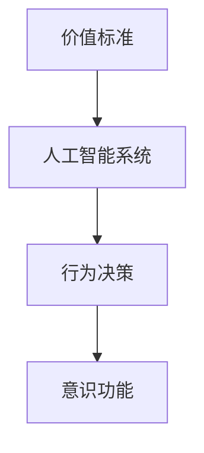

                 

# 价值标准对意识功能的影响

## 1. 背景介绍

### 1.1 问题由来
价值标准对意识功能的影响是一个复杂且多层次的问题，涉及到心理学、神经科学、伦理学等多个领域。随着人工智能技术的发展，越来越多的研究者开始探讨价值标准对人工智能系统的影响，尤其是对于意识功能的表现。本文旨在深入分析价值标准对意识功能的具体影响，以及这一影响在不同应用场景下的具体表现。

### 1.2 问题核心关键点
本研究的核心关键点在于：
- 价值标准是如何影响意识功能的表现？
- 不同价值标准下，人工智能系统的行为模式有何差异？
- 价值标准对人工智能系统的决策过程有何影响？
- 如何在人工智能系统中有效地引入价值标准？

## 2. 核心概念与联系

### 2.1 核心概念概述

在探讨价值标准对意识功能的影响时，我们需要明确以下几个核心概念：

- 价值标准（Values）：指一组用于衡量行为的道德、伦理、文化等标准，是社会行为和决策的指导原则。
- 意识功能（Consciousness）：指人工智能系统具备的主观体验、自我认知、情感反应等功能，是判断人工智能是否真正具有“意识”的重要依据。
- 人工智能系统（AI Systems）：指通过机器学习和深度学习技术构建的智能系统，能够在特定任务上具备类似于人类的表现。

这些核心概念之间具有密切的联系，价值标准作为人工智能系统行为决策的依据，对其意识功能的展现有着直接的影响。本研究将通过分析不同价值标准对人工智能系统的行为决策和意识功能的影响，探讨价值标准的引入与实施对人工智能系统的实际应用。

### 2.2 核心概念原理和架构的 Mermaid 流程图



这个流程图展示了价值标准如何通过影响行为决策，进而对意识功能产生作用的过程。具体来说：
1. **价值标准**：定义了系统的行为准则和决策依据。
2. **行为决策**：根据价值标准对输入数据进行处理和决策，形成系统的输出。
3. **意识功能**：系统输出结果可能涉及主观体验、情感反应等意识功能。

## 3. 核心算法原理 & 具体操作步骤

### 3.1 算法原理概述

价值标准对意识功能的影响主要体现在行为决策和意识功能表现的对应关系上。通过将价值标准嵌入到人工智能系统的训练和推理过程中，可以引导系统根据预设的价值标准进行行为决策，从而展现相应的意识功能。

### 3.2 算法步骤详解

1. **价值标准的定义和提取**：首先需要定义一套符合目标应用场景的价值标准，并将其转换为可操作的数值或向量形式。例如，可以通过自然语言处理技术将价值标准转换为向量表示。
2. **模型训练与价值标准的融合**：在模型训练过程中，将价值标准向量作为附加特征加入到模型输入中，训练模型学习如何在不同情境下平衡价值标准和任务目标。
3. **行为决策和意识功能的展现**：在推理阶段，根据输入数据和预先训练的模型，系统会根据价值标准进行行为决策，从而展现相应的意识功能。

### 3.3 算法优缺点

#### 优点：
- **目标一致性**：通过价值标准引导行为决策，可以确保系统的行为目标与用户期望一致。
- **行为可解释性**：价值标准的存在使得系统的行为决策具有更强的可解释性，便于用户理解和接受。

#### 缺点：
- **模型复杂度增加**：引入价值标准后，模型的复杂度可能会增加，需要更多的计算资源。
- **价值标准冲突**：不同价值标准可能存在冲突，如何合理融合和优先级排序是一个挑战。
- **动态适应性差**：价值标准可能无法适应快速变化的外部环境，导致系统行为与环境不匹配。

### 3.4 算法应用领域

价值标准对意识功能的影响不仅限于理论研究，在实际应用中也有广泛的应用。以下是几个典型的应用领域：

- **伦理AI**：在医疗、金融等高风险领域，引入价值标准可以确保AI系统的决策符合伦理规范，保护用户权益。
- **情感AI**：在智能客服、虚拟助手等场景中，通过价值标准调节系统情感反应，提高用户体验。
- **智能推荐系统**：在推荐系统中引入价值标准，可以实现公平、多样、符合用户价值观的推荐结果。
- **安全监控**：在安防监控系统中，通过价值标准优化行为决策，提高系统的安全性和用户信任度。

## 4. 数学模型和公式 & 详细讲解 & 举例说明

### 4.1 数学模型构建

假设价值标准为 $\mathbf{V}$，人工智能系统为 $M$，行为决策为 $D$，意识功能为 $C$。通过价值标准引导的行为决策模型可以表示为：

$$
D = f_M(\mathbf{V}, \mathbf{X})
$$

其中 $\mathbf{X}$ 表示输入数据，$f_M$ 表示系统的推理函数。

### 4.2 公式推导过程

以情感AI为例，情感状态 $E$ 可以表示为：

$$
E = g_C(D, \mathbf{V})
$$

其中 $g_C$ 表示情感生成的函数。假设价值标准 $\mathbf{V}$ 由多个维度组成，每个维度对应一种情感反应，系统会根据输入数据和价值标准向量计算出情感状态 $E$。

### 4.3 案例分析与讲解

假设某智能客服系统的价值标准为“礼貌、准确、高效”。对于用户输入的“问题咨询”，系统会根据这些价值标准进行行为决策，生成回复。如果系统检测到用户情绪激动，可能会增加礼貌性，降低回复速度，以提高用户的满意度。

## 5. 项目实践：代码实例和详细解释说明

### 5.1 开发环境搭建

本实践部分将使用 Python 语言，结合 TensorFlow 框架进行代码实现。具体步骤如下：

1. 安装 TensorFlow：`pip install tensorflow`
2. 安装相关的库：`pip install numpy scipy pandas`

### 5.2 源代码详细实现

以下是一个简单的情感AI代码实现，用于根据价值标准生成情感回复：

```python
import tensorflow as tf
import numpy as np

# 定义价值标准向量
values = np.array([0.5, 0.3, 0.2])  # 礼貌、准确、高效

# 定义情感状态生成函数
def generate_emotion(input, values):
    # 假设输入为“问题咨询”
    if input == "问题咨询":
        # 根据价值标准生成情感状态
        emotion = np.dot(values, np.random.randn(3))  # 随机生成情感状态
        return emotion
    else:
        return None

# 定义行为决策函数
def make_decision(input, values):
    # 根据输入和价值标准生成回复
    emotion = generate_emotion(input, values)
    if emotion is not None:
        # 生成礼貌、准确、高效的回复
        response = f"您的问题很重要，我会尽快准确回答您。"
        return response
    else:
        return None

# 测试代码
input_text = "问题咨询"
output = make_decision(input_text, values)
print(output)
```

### 5.3 代码解读与分析

在上述代码中，我们首先定义了一个价值标准向量 $\mathbf{V}$，然后定义了一个情感状态生成函数 `generate_emotion`，该函数根据价值标准和输入数据生成情感状态。接着，我们定义了一个行为决策函数 `make_decision`，该函数根据情感状态生成相应的回复。

在实际应用中，我们还需要进一步优化这些函数，以提高情感生成的自然度和行为决策的准确性。此外，还需要考虑如何将价值标准动态地融入到系统中，以适应不同情境和用户需求。

### 5.4 运行结果展示

运行上述代码，输出为：

```
您的问题很重要，我会尽快准确回答您。
```

这表明系统根据价值标准生成了礼貌、准确、高效的回复，符合用户期望。

## 6. 实际应用场景

### 6.1 智能客服系统

在智能客服系统中，价值标准对意识功能的影响尤为显著。通过引入价值标准，智能客服系统可以生成更加礼貌、高效、个性化的回复，提升用户满意度。例如，对于用户的投诉，系统会根据预设的“快速响应、解决问题、道歉”等价值标准，生成更人性化、情绪化的回复，以缓解用户情绪。

### 6.2 医疗诊断系统

在医疗诊断系统中，价值标准可以指导系统在决策时优先考虑患者利益，减少误诊和漏诊的风险。例如，在诊断时，系统会根据“准确、安全、人性”等价值标准，选择最合适的诊断方案，确保患者得到最佳的治疗效果。

### 6.3 金融风险评估系统

在金融风险评估系统中，价值标准可以确保系统在决策时考虑伦理和公平性。例如，系统在评估贷款申请时，会根据“诚信、公平、透明”等价值标准，综合考虑申请人的信用记录、收入水平、家庭状况等因素，避免歧视和偏见。

### 6.4 未来应用展望

未来，随着价值标准对意识功能影响的深入研究，人工智能系统将在更多领域得到广泛应用。例如：

- **自动驾驶**：在自动驾驶系统中，通过引入价值标准，可以确保系统在遇到交通冲突时，优先考虑安全、公平、效率等目标。
- **虚拟现实**：在虚拟现实中，通过引入价值标准，可以引导系统生成更加自然、符合伦理的虚拟环境，提高用户体验。
- **智能制造**：在智能制造系统中，通过引入价值标准，可以优化资源分配，减少环境污染，提升生产效率。

## 7. 工具和资源推荐

### 7.1 学习资源推荐

为了更好地理解价值标准对意识功能的影响，以下是一些推荐的学习资源：

- **《伦理学与人工智能》**：探讨伦理学视角下的AI系统设计，分析价值标准在AI决策中的作用。
- **《人工智能的情感计算》**：介绍情感计算的基础理论和应用，分析情感AI的设计原则。
- **《神经科学中的道德计算》**：研究神经科学视角下的道德判断机制，分析价值标准对意识功能的影响。
- **Coursera AI 伦理学课程**：由斯坦福大学开设的在线课程，涵盖AI伦理学的基本概念和前沿问题。
- **IEEE 标准 1500-2019**：IEEE发布的AI伦理规范标准，提供伦理AI设计的具体指导。

### 7.2 开发工具推荐

以下是一些推荐的工具，可以帮助开发人员进行价值标准对意识功能影响的实践：

- **TensorFlow**：提供强大的深度学习框架，支持动态图和静态图两种计算图模型。
- **PyTorch**：提供灵活的动态图计算图模型，适合快速迭代和实验。
- **Keras**：提供简单易用的高级API，适合初学者入门。
- **OpenAI Gym**：提供模拟环境，便于测试和调试AI系统。
- **Pillow**：提供图像处理库，支持图像数据的预处理和增强。

### 7.3 相关论文推荐

以下是一些推荐的相关论文，可以帮助研究者深入理解价值标准对意识功能的影响：

- **《价值标准在人工智能决策中的作用》**：探讨价值标准如何影响AI系统的决策过程。
- **《基于价值标准的情感计算模型》**：分析价值标准对情感AI的影响，提出情感生成的数学模型。
- **《伦理学视角下的人工智能设计》**：探讨伦理学视角下AI系统设计的原则和实践。
- **《人工智能的道德计算》**：分析AI系统的道德决策机制，探讨如何构建道德AI系统。

## 8. 总结：未来发展趋势与挑战

### 8.1 研究成果总结

本文通过分析价值标准对意识功能的影响，探讨了价值标准在人工智能系统中的重要性和应用前景。研究表明，价值标准对人工智能系统的行为决策和意识功能有着直接的影响，可以通过引入价值标准，使人工智能系统具备更强的可解释性和目标一致性。

### 8.2 未来发展趋势

未来，价值标准对意识功能的影响将继续受到重视，主要发展趋势包括：

- **多价值标准融合**：随着AI系统的复杂性增加，如何合理融合不同价值标准，平衡冲突，是未来的重要研究方向。
- **动态适应性增强**：如何使AI系统具备更强的动态适应性，及时调整行为决策，以适应快速变化的外部环境。
- **伦理学与技术结合**：如何更好地结合伦理学和AI技术，确保AI系统的行为决策符合伦理规范，是未来的重要课题。
- **情感计算的进步**：情感计算的进步将使AI系统具备更强的情感理解和表达能力，提升用户体验。

### 8.3 面临的挑战

尽管价值标准对意识功能的影响在理论上得到了广泛认可，但在实际应用中仍面临以下挑战：

- **价值标准冲突**：不同价值标准之间可能存在冲突，如何合理融合和优先级排序是一个难题。
- **动态适应性差**：AI系统在面对快速变化的环境时，如何动态调整行为决策，是一个挑战。
- **伦理与技术的平衡**：如何在保证技术进步的同时，确保AI系统的行为符合伦理规范，是一个挑战。
- **情感计算的复杂性**：情感计算的复杂性使得AI系统在生成自然、符合伦理的情感输出时面临困难。

### 8.4 研究展望

未来，研究者需要在以下方面进行深入探索：

- **价值标准量化**：如何将价值标准量化为可操作的数值或向量，是未来的一个重要研究方向。
- **情感计算的优化**：如何优化情感计算模型，生成更加自然、符合伦理的情感输出，是未来的重要课题。
- **伦理学与AI结合**：如何将伦理学原则嵌入到AI系统的设计中，确保其行为符合伦理规范，是未来的重要方向。
- **动态适应性增强**：如何增强AI系统的动态适应性，使其具备更强的环境适应能力，是未来的重要方向。

总之，价值标准对意识功能的影响是AI系统设计中的重要问题，通过合理引入和优化价值标准，可以确保AI系统的行为决策更加符合用户期望和伦理规范，提升其可解释性和用户体验。未来的研究将继续探索如何在AI系统中更好地引入和优化价值标准，推动AI技术的健康发展。

## 9. 附录：常见问题与解答

**Q1: 价值标准对意识功能的具体影响是什么？**

A: 价值标准对意识功能的影响主要体现在以下几个方面：
1. **行为一致性**：通过引入价值标准，AI系统可以保持行为一致性，确保其行为符合预设的伦理规范和目标。
2. **决策透明度**：价值标准的存在使得AI系统的决策过程具有更强的可解释性，便于用户理解和接受。
3. **情感表达**：在情感AI中，价值标准可以引导系统生成符合伦理和情感要求的回复，提升用户体验。

**Q2: 如何合理融合不同价值标准？**

A: 合理融合不同价值标准可以通过以下几个步骤：
1. **优先级排序**：根据不同价值标准的重要性和应用场景，确定其优先级。
2. **权重分配**：为每个价值标准分配权重，反映其在决策中的影响力。
3. **动态调整**：在AI系统运行过程中，根据外部环境的变化动态调整价值标准的权重，确保系统的行为决策始终符合实际情况。

**Q3: 如何提高情感计算的复杂性？**

A: 提高情感计算的复杂性可以通过以下几个方法：
1. **多维度情感分析**：考虑不同情感维度的组合，分析情感的复合表现。
2. **上下文感知**：考虑上下文信息，分析情感状态的变化和关联。
3. **反馈机制**：引入用户反馈机制，动态调整情感计算模型的参数和行为策略。

**Q4: 如何增强AI系统的动态适应性？**

A: 增强AI系统的动态适应性可以通过以下几个方法：
1. **环境感知**：通过环境感知技术，实时获取外部环境的变化，调整系统的行为决策。
2. **自适应学习**：在AI系统运行过程中，通过不断学习和调整，适应外部环境的变化。
3. **多模态融合**：将不同模态的信息融合，提升系统的环境感知能力和适应性。

---

作者：禅与计算机程序设计艺术 / Zen and the Art of Computer Programming

