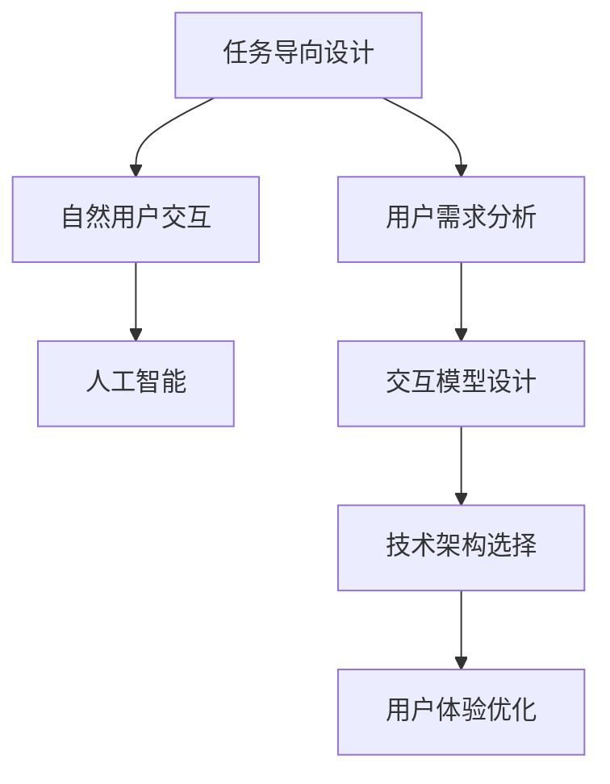

                 

# 任务导向设计思维在CUI中的详细应用解析

> 关键词：用户界面设计, 自然用户交互, 人工智能, 任务导向, 用户需求, 交互模型, 交互设计, 技术架构

## 1. 背景介绍

### 1.1 问题由来
随着技术的快速发展，计算用户界面（Computing User Interfaces, CUI）的应用场景日益丰富。从智能手机到智能家居，从工业控制到智慧医疗，几乎所有涉及计算应用的场景都离不开CUI的支撑。然而，如何设计出既高效又易用的CUI，一直是一个巨大的挑战。用户界面的友好性和易用性直接决定了用户的体验，而如何高效地捕捉用户需求，设计出符合用户习惯、便捷易用的交互模型，是CUI设计的核心难点。

### 1.2 问题核心关键点
CUI设计中，核心关键点包括以下几点：
- 用户需求分析：准确捕捉用户需求是CUI设计的第一步，需要深入理解用户的任务目标和行为习惯。
- 交互模型设计：设计高效、易用的交互模型，确保用户能够快速完成任务。
- 技术架构选择：选择合适的技术框架，高效支持CUI的构建和运行。
- 用户体验优化：通过用户测试和反馈，不断优化交互体验，提升用户满意度。

### 1.3 问题研究意义
深入研究任务导向设计思维在CUI中的应用，对于提升CUI的易用性和用户满意度，推动CUI技术的发展具有重要意义：

1. **提升用户体验**：通过深入分析用户任务目标和行为习惯，设计出符合用户需求的用户界面，提升用户使用CUI的效率和满意度。
2. **提高系统可用性**：通过任务导向设计思维，可以有效捕捉用户需求，设计出更加自然、直观的用户交互模型，提高系统的可用性和可靠性。
3. **促进技术创新**：任务导向设计思维的引入，推动了CUI设计的创新，出现了如“协作式设计”、“情境感知”、“自然语言处理”等多种前沿技术，为CUI发展注入新的活力。
4. **加速产业落地**：通过优化CUI设计，可以更好地满足用户需求，加速技术在各行业的落地应用，提升产业竞争力。

## 2. 核心概念与联系

### 2.1 核心概念概述

为更好地理解任务导向设计思维在CUI中的应用，本节将介绍几个密切相关的核心概念：

- **任务导向设计**：指以用户任务为目标，从用户需求出发，设计出符合任务需求的交互模型和界面元素，提升用户体验和系统可用性。
- **自然用户交互**：指基于自然语言、手势、触屏等多种方式，让用户自然地与计算系统进行交互，提升系统可用性和易用性。
- **人工智能**：指通过机器学习、深度学习等技术，让计算系统具备一定的智能推理、决策能力，从而提升系统性能和用户体验。
- **用户需求分析**：通过问卷调查、用户访谈等方法，深入了解用户的任务目标、行为习惯、心理特征等，以捕捉用户需求。
- **交互模型设计**：设计出符合用户习惯的交互模型，如语音交互、触摸交互、手势交互等，使用户能够高效完成任务。
- **技术架构选择**：根据用户需求和技术特点，选择合适的技术架构，如分布式架构、微服务架构、容器化架构等，支持CUI的构建和运行。
- **用户体验优化**：通过用户测试、反馈收集、迭代改进等手段，不断优化CUI设计，提升用户体验和满意度。

这些核心概念之间的逻辑关系可以通过以下Mermaid流程图来展示：



这个流程图展示了一系列CUI设计的核心步骤：从用户需求分析开始，设计自然用户交互模型，引入人工智能技术，构建技术架构，最后进行用户体验优化。这些步骤相互关联，共同构成了一个完整的CUI设计流程。

## 3. 核心算法原理 & 具体操作步骤
### 3.1 算法原理概述

任务导向设计思维在CUI中的应用，主要基于以下几个算法原理：

- **用户需求分析算法**：通过问卷调查、用户访谈等方法，深入了解用户的任务目标、行为习惯、心理特征等，以捕捉用户需求。
- **交互模型设计算法**：设计符合用户习惯的交互模型，如语音交互、触摸交互、手势交互等，使用户能够高效完成任务。
- **人工智能算法**：通过机器学习、深度学习等技术，让计算系统具备一定的智能推理、决策能力，从而提升系统性能和用户体验。
- **技术架构设计算法**：根据用户需求和技术特点，选择合适的技术架构，如分布式架构、微服务架构、容器化架构等，支持CUI的构建和运行。
- **用户体验优化算法**：通过用户测试、反馈收集、迭代改进等手段，不断优化CUI设计，提升用户体验和满意度。

### 3.2 算法步骤详解

基于任务导向设计思维的CUI设计，一般包括以下几个关键步骤：

**Step 1: 用户需求分析**
- 设计问卷调查和用户访谈，深入了解用户的任务目标、行为习惯、心理特征等。
- 分析用户需求，识别用户任务的关键要素和用户界面的关键元素。
- 绘制用户任务流程图，明确用户任务的输入、输出、中间过程等。

**Step 2: 交互模型设计**
- 根据用户需求和任务流程图，设计符合用户习惯的交互模型。
- 设计交互界面元素，如按钮、菜单、滑块、滚动条等，确保用户能够自然地与系统交互。
- 设计交互规则和反馈机制，确保用户能够快速完成任务。

**Step 3: 引入人工智能**
- 选择合适的人工智能算法，如机器学习、深度学习等，提升系统的智能推理和决策能力。
- 设计智能组件，如语音识别、图像识别、自然语言处理等，增强系统的功能性和用户体验。
- 设计智能交互界面，使用户能够自然地与系统进行交互，提升系统的可用性和易用性。

**Step 4: 技术架构选择**
- 根据用户需求和技术特点，选择合适的技术架构，如分布式架构、微服务架构、容器化架构等，支持CUI的构建和运行。
- 设计数据存储、传输、处理等系统架构，确保系统的高效运行和可扩展性。
- 设计接口协议和通信机制，确保不同组件之间的协同工作。

**Step 5: 用户体验优化**
- 设计用户测试计划，通过用户测试和反馈收集，不断优化CUI设计。
- 分析用户反馈，识别用户界面和交互模型的缺陷和不足。
- 迭代改进CUI设计，提升用户体验和满意度。

### 3.3 算法优缺点

基于任务导向设计思维的CUI设计，具有以下优点：
1. **用户需求驱动**：通过深入分析用户需求，设计出符合用户任务需求的交互模型和界面元素，提升用户体验和系统可用性。
2. **高效交互设计**：设计符合用户习惯的交互模型和界面元素，使用户能够自然地与系统交互，提升系统的易用性和效率。
3. **智能决策支持**：通过引入人工智能技术，增强系统的智能推理和决策能力，提升系统的功能和性能。
4. **灵活技术架构**：根据用户需求和技术特点，选择合适的技术架构，支持CUI的构建和运行，确保系统的高效性和可扩展性。
5. **持续用户体验优化**：通过用户测试和反馈收集，不断优化CUI设计，提升用户体验和满意度。

同时，该方法也存在一定的局限性：
1. **用户需求复杂性**：用户需求分析是一个复杂的过程，需要投入大量时间和资源。
2. **技术难度高**：引入人工智能技术需要较高的技术门槛，需要专业的团队和技术支持。
3. **成本高**：CUI设计和优化需要大量人力和物力投入，成本较高。

尽管存在这些局限性，但就目前而言，基于任务导向设计思维的CUI设计方法仍是大规模CUI应用的主流范式。未来相关研究的重点在于如何进一步降低CUI设计的复杂性，提高设计的效率和精度，同时兼顾可扩展性和易用性等因素。

### 3.4 算法应用领域

基于任务导向设计思维的CUI设计方法，在多个领域中得到了广泛应用，例如：

- **移动应用**：通过任务导向设计思维，设计出符合用户习惯的移动应用界面和交互模型，提升用户的使用体验和满意度。
- **智能家居**：设计出符合用户习惯的智能家居控制界面和交互模型，使用户能够便捷地控制家居设备。
- **医疗健康**：设计出符合医生和患者需求的医疗健康应用界面和交互模型，提升医疗服务的效率和质量。
- **工业控制**：设计出符合操作人员习惯的工业控制系统界面和交互模型，提升生产效率和安全性。
- **金融服务**：设计出符合用户需求和习惯的金融服务平台界面和交互模型，提升金融服务的便捷性和效率。

除了上述这些经典应用外，基于任务导向设计思维的CUI设计方法还被创新性地应用于更多场景中，如可穿戴设备、智能办公、智慧城市等，为各行各业带来了新的用户交互体验。

## 4. 数学模型和公式 & 详细讲解 & 举例说明
### 4.1 数学模型构建

本节将使用数学语言对基于任务导向设计思维的CUI设计过程进行更加严格的刻画。

设用户需求为 $D$，交互模型为 $M$，人工智能算法为 $A$，技术架构为 $T$，用户体验优化算法为 $U$。

设计任务导向CUI系统的目标函数为：

$$
\min \big[ F(D, M, A, T, U) \big]
$$

其中，$F$ 为综合评价函数，考虑了用户需求分析、交互模型设计、人工智能引入、技术架构选择和用户体验优化等各方面的因素，具体表达式为：

$$
F = \alpha_1 F_{D} + \alpha_2 F_{M} + \alpha_3 F_{A} + \alpha_4 F_{T} + \alpha_5 F_{U}
$$

其中，$\alpha_1, \alpha_2, \alpha_3, \alpha_4, \alpha_5$ 为各项指标的权重系数，根据具体情况进行调整。

各指标的具体表达式如下：

- **用户需求分析指标**：$F_{D} = \sum_{i=1}^n \big[ \omega_i f_i(D_i) \big]$
- **交互模型设计指标**：$F_{M} = \sum_{i=1}^n \big[ \omega_i f_i(M_i) \big]$
- **人工智能引入指标**：$F_{A} = \sum_{i=1}^n \big[ \omega_i f_i(A_i) \big]$
- **技术架构选择指标**：$F_{T} = \sum_{i=1}^n \big[ \omega_i f_i(T_i) \big]$
- **用户体验优化指标**：$F_{U} = \sum_{i=1}^n \big[ \omega_i f_i(U_i) \big]$

其中，$n$ 为考虑的指标数量，$\omega_i$ 为各项指标的权重，$f_i$ 为单项指标的评价函数，具体表达式如下：

- **用户需求分析评价函数**：$f_i(D_i) = \begin{cases}
    1 & \text{如果} D_i \text{满足用户需求} \\
    0 & \text{如果} D_i \text{不满足用户需求}
\end{cases}$
- **交互模型设计评价函数**：$f_i(M_i) = \begin{cases}
    1 & \text{如果} M_i \text{符合用户习惯} \\
    0 & \text{如果} M_i \text{不符合用户习惯}
\end{cases}$
- **人工智能引入评价函数**：$f_i(A_i) = \begin{cases}
    1 & \text{如果} A_i \text{提高了系统的智能推理能力} \\
    0 & \text{如果} A_i \text{没有提高系统的智能推理能力}
\end{cases}$
- **技术架构选择评价函数**：$f_i(T_i) = \begin{cases}
    1 & \text{如果} T_i \text{支持系统的可扩展性} \\
    0 & \text{如果} T_i \text{不支持系统的可扩展性}
\end{cases}$
- **用户体验优化评价函数**：$f_i(U_i) = \begin{cases}
    1 & \text{如果} U_i \text{提升了用户体验} \\
    0 & \text{如果} U_i \text{没有提升用户体验}
\end{cases}$

### 4.2 公式推导过程

以用户需求分析指标 $F_{D}$ 的评价函数为例，推导其表达式。

假设用户需求为 $D = \{D_1, D_2, \ldots, D_n\}$，其中 $D_i$ 为第 $i$ 项用户需求。设计问卷调查和用户访谈，对每项需求进行评价，得到评分 $s_i$，其中 $s_i \in [0, 1]$。令 $\omega_i$ 为需求 $D_i$ 的权重系数，满足 $\sum_{i=1}^n \omega_i = 1$。则用户需求分析指标的评价函数为：

$$
f_i(D_i) = \omega_i s_i
$$

将上述表达式代入目标函数，得：

$$
F = \alpha_1 \sum_{i=1}^n \omega_i s_i + \alpha_2 \sum_{i=1}^n \omega_i f_i(M_i) + \alpha_3 \sum_{i=1}^n \omega_i f_i(A_i) + \alpha_4 \sum_{i=1}^n \omega_i f_i(T_i) + \alpha_5 \sum_{i=1}^n \omega_i f_i(U_i)
$$

在得到目标函数表达式后，即可使用优化算法（如遗传算法、粒子群算法等）求解最优设计方案，使综合评价函数 $F$ 最小化。

### 4.3 案例分析与讲解

以智能家居控制界面设计为例，展示基于任务导向设计思维的CUI设计过程：

**Step 1: 用户需求分析**
- 设计问卷调查，了解用户对智能家居控制的需求。
- 分析用户需求，识别关键任务要素，如开关控制、温湿度调节、安全监控等。
- 绘制用户任务流程图，明确用户任务的输入、输出、中间过程等。

**Step 2: 交互模型设计**
- 设计符合用户习惯的交互模型，如触摸控制、语音控制、手势控制等。
- 设计交互界面元素，如按钮、菜单、滚动条等，确保用户能够自然地与系统交互。
- 设计交互规则和反馈机制，确保用户能够快速完成任务。

**Step 3: 引入人工智能**
- 选择合适的人工智能算法，如语音识别、图像识别、自然语言处理等。
- 设计智能组件，如语音助手、智能安防系统等，增强系统的功能性和用户体验。
- 设计智能交互界面，使用户能够自然地与系统进行交互，提升系统的可用性和易用性。

**Step 4: 技术架构选择**
- 根据用户需求和技术特点，选择分布式架构、微服务架构、容器化架构等。
- 设计数据存储、传输、处理等系统架构，确保系统的高效运行和可扩展性。
- 设计接口协议和通信机制，确保不同组件之间的协同工作。

**Step 5: 用户体验优化**
- 设计用户测试计划，通过用户测试和反馈收集，不断优化CUI设计。
- 分析用户反馈，识别用户界面和交互模型的缺陷和不足。
- 迭代改进CUI设计，提升用户体验和满意度。

通过以上步骤，设计出符合用户需求和习惯的智能家居控制界面，提升了系统的易用性和用户体验。

## 5. 项目实践：代码实例和详细解释说明
### 5.1 开发环境搭建

在进行CUI设计实践前，我们需要准备好开发环境。以下是使用Python进行CUI设计的环境配置流程：

1. 安装Anaconda：从官网下载并安装Anaconda，用于创建独立的Python环境。

2. 创建并激活虚拟环境：
```bash
conda create -n cuitool env python=3.8 
conda activate cuitool
```

3. 安装CUI设计工具包：
```bash
pip install tkinter wxPython PyQt5
```

4. 安装相关开发库：
```bash
pip install PyTorch TensorFlow OpenCV numpy pandas scikit-learn matplotlib 
```

完成上述步骤后，即可在`cuitool`环境中开始CUI设计实践。

### 5.2 源代码详细实现

以下是一个简单的CUI设计示例，展示如何使用Python和Tkinter库进行交互界面的设计和实现。

首先，定义交互界面元素和事件处理函数：

```python
from tkinter import Tk, Label, Button, Entry

class CUIInterface:
    def __init__(self):
        self.window = Tk()
        self.window.title("CUI Interface Example")
        
        self.label = Label(self.window, text="Enter text:")
        self.label.pack()
        
        self.entry = Entry(self.window)
        self.entry.pack()
        
        self.button = Button(self.window, text="Submit", command=self.submit)
        self.button.pack()
        
        self.text = Label(self.window, text="")
        self.text.pack()
        
    def submit(self):
        text = self.entry.get()
        self.text.config(text=f"Your text is: {text}")
```

然后，定义事件处理函数和主程序：

```python
if __name__ == "__main__":
    app = CUIInterface()
    app.window.mainloop()
```

这样，一个简单的交互界面就被设计出来了，用户可以在文本框中输入文本，并点击按钮提交。提交后，界面会显示用户输入的文本。

### 5.3 代码解读与分析

让我们再详细解读一下关键代码的实现细节：

**CUIInterface类**：
- `__init__`方法：创建交互界面，并设置各个元素的位置和样式。
- `submit`方法：定义按钮点击事件，获取文本框中输入的文本，并显示在界面上。

通过这个简单的例子，可以看到CUI设计的基本流程：定义界面元素、事件处理函数、主程序等。在实际开发中，开发者需要根据具体需求，设计更加复杂的交互界面和事件处理逻辑，满足用户的各种交互需求。

当然，工业级的CUI设计还需要考虑更多因素，如界面的布局、样式、交互逻辑、数据存储等。但核心的CUI设计思路基本与此类似。

## 6. 实际应用场景
### 6.1 智能家居系统

基于任务导向设计思维的CUI设计，可以广泛应用于智能家居系统的构建。传统的家居控制界面通常复杂冗杂，难以使用，而使用任务导向设计思维，可以设计出简洁易用的智能家居控制界面，提升用户的使用体验。

在技术实现上，可以收集用户的使用习惯和偏好，设计出符合用户需求的智能家居控制界面。通过引入人工智能技术，如语音助手、智能安防系统等，增强系统的功能性和用户体验。设计出符合用户习惯的交互模型，如触摸控制、语音控制、手势控制等，使用户能够自然地与系统交互，提升系统的易用性和效率。

### 6.2 智能医疗平台

基于任务导向设计思维的CUI设计，可以应用于智能医疗平台的构建。医疗平台通常涉及多种复杂的任务，如病历查询、诊断辅助、药品推荐等。通过深入分析用户需求，设计出符合用户任务需求的交互界面和交互模型，提升系统的易用性和效率。

在技术实现上，可以收集医生和患者的需求，设计出符合用户习惯的智能医疗平台界面。通过引入人工智能技术，如自然语言处理、图像识别等，增强系统的智能推理和决策能力。设计出符合用户习惯的交互模型，如语音助手、智能问答系统等，使用户能够自然地与系统交互，提升系统的用户体验和效率。

### 6.3 工业控制系统

基于任务导向设计思维的CUI设计，可以应用于工业控制系统的构建。工业控制系统通常涉及多种复杂的任务，如设备监控、故障诊断、生产调度等。通过深入分析用户需求，设计出符合用户任务需求的交互界面和交互模型，提升系统的易用性和效率。

在技术实现上，可以收集操作人员的需求，设计出符合用户习惯的工业控制系统界面。通过引入人工智能技术，如机器学习、深度学习等，增强系统的智能推理和决策能力。设计出符合用户习惯的交互模型，如触摸控制、语音控制、手势控制等，使用户能够自然地与系统交互，提升系统的用户体验和效率。

### 6.4 未来应用展望

随着任务导向设计思维的不断发展，基于CUI的设计方法将呈现以下几个发展趋势：

1. **交互模型的多样化**：未来的CUI设计将更加注重多样化的交互模型，如自然语言处理、图像识别、手势控制等，提升系统的灵活性和易用性。
2. **人工智能的深度融合**：未来的CUI设计将更加注重人工智能技术的深度融合，通过引入更多智能组件，增强系统的智能推理和决策能力，提升系统的功能和性能。
3. **用户需求分析的精准化**：未来的CUI设计将更加注重用户需求分析的精准化，通过深入分析用户需求，设计出符合用户任务需求的交互界面和交互模型，提升系统的易用性和效率。
4. **持续用户体验优化**：未来的CUI设计将更加注重持续用户体验优化，通过用户测试和反馈收集，不断优化CUI设计，提升用户体验和满意度。
5. **跨领域的协同设计**：未来的CUI设计将更加注重跨领域的协同设计，将不同领域的知识和技术融合到CUI设计中，提升系统的综合性能和应用范围。

这些趋势凸显了任务导向设计思维在CUI设计中的广阔前景。这些方向的探索发展，必将进一步提升CUI系统的性能和用户体验，为构建更加智能化、普适化的CUI系统铺平道路。

## 7. 工具和资源推荐
### 7.1 学习资源推荐

为了帮助开发者系统掌握CUI设计的基础知识和高级技术，这里推荐一些优质的学习资源：

1. **《人机交互设计》课程**：斯坦福大学开设的交互设计课程，深入讲解交互设计的理论基础和实践技巧。
2. **《用户界面设计》书籍**：介绍用户界面设计的原理、方法和工具，适合初学者和中级开发者。
3. **《自然用户交互》书籍**：介绍自然用户交互的技术和应用，涵盖语音交互、手势交互、触摸交互等多种交互方式。
4. **《人工智能基础》课程**：斯坦福大学开设的人工智能课程，涵盖机器学习、深度学习、自然语言处理等前沿技术。
5. **《Python GUI编程》书籍**：介绍如何使用Python和Tkinter、wxPython、PyQt等工具进行GUI编程，适合CUI设计初学者。

通过对这些资源的学习实践，相信你一定能够快速掌握CUI设计的精髓，并用于解决实际的CUI问题。

### 7.2 开发工具推荐

高效的开发离不开优秀的工具支持。以下是几款用于CUI设计开发的常用工具：

1. **Tkinter**：Python自带的GUI库，简单易用，适合初学者进行CUI设计。
2. **wxPython**：Python的跨平台GUI库，功能强大，支持多种界面样式和交互模型。
3. **PyQt**：Python的GUI库，支持丰富的界面元素和交互模型，适合高级开发者进行CUI设计。
4. **Tango**：C++的GUI库，功能强大，支持多种界面样式和交互模型，适合CUI设计开发者。
5. **Blender**：开源的3D建模软件，可以用于设计3D界面的CUI，适合需要3D界面的CUI设计。

合理利用这些工具，可以显著提升CUI设计开发的效率，加快创新迭代的步伐。

### 7.3 相关论文推荐

CUI设计的研究源于学界的持续研究。以下是几篇奠基性的相关论文，推荐阅读：

1. **《A Framework for User Interface Design》**：介绍了用户界面设计的理论基础和实践方法，适合初学者入门。
2. **《Human-Computer Interaction》**：斯坦福大学HCI课程的教材，涵盖人机交互的多个方面，适合中级开发者学习。
3. **《Designing User Interfaces》**：介绍用户界面设计的原则和方法，适合CUI设计开发者参考。
4. **《Interactive Systems Design》**：介绍交互系统的设计方法和技术，涵盖自然用户交互、人工智能等多个领域。
5. **《Human-Computer Interaction in the Age of AI》**：介绍人工智能对交互设计的影响，适合高级开发者学习。

这些论文代表了大CUI设计的研究方向，通过学习这些前沿成果，可以帮助研究者把握学科前进方向，激发更多的创新灵感。

## 8. 总结：未来发展趋势与挑战

### 8.1 总结

本文对基于任务导向设计思维的CUI设计方法进行了全面系统的介绍。首先阐述了CUI设计中用户需求分析、交互模型设计、人工智能引入、技术架构选择和用户体验优化等核心关键点，明确了CUI设计的步骤和流程。其次，从原理到实践，详细讲解了CUI设计的数学模型和公式推导过程，给出了CUI设计任务的具体实现。同时，本文还广泛探讨了CUI设计在智能家居、医疗健康、工业控制等多个领域的应用前景，展示了CUI设计技术的广阔前景。

通过本文的系统梳理，可以看到，基于任务导向设计思维的CUI设计方法正在成为CUI设计的主流范式，极大地拓展了CUI系统的应用边界，催生了更多的落地场景。得益于任务导向设计思维的引入，CUI设计能够更好地捕捉用户需求，设计出符合用户习惯的交互模型，提升用户体验和系统可用性，为CUI技术的发展注入新的活力。

### 8.2 未来发展趋势

展望未来，基于任务导向设计思维的CUI设计技术将呈现以下几个发展趋势：

1. **交互模型的多样化**：未来的CUI设计将更加注重多样化的交互模型，如自然语言处理、图像识别、手势控制等，提升系统的灵活性和易用性。
2. **人工智能的深度融合**：未来的CUI设计将更加注重人工智能技术的深度融合，通过引入更多智能组件，增强系统的智能推理和决策能力，提升系统的功能和性能。
3. **用户需求分析的精准化**：未来的CUI设计将更加注重用户需求分析的精准化，通过深入分析用户需求，设计出符合用户任务需求的交互界面和交互模型，提升系统的易用性和效率。
4. **持续用户体验优化**：未来的CUI设计将更加注重持续用户体验优化，通过用户测试和反馈收集，不断优化CUI设计，提升用户体验和满意度。
5. **跨领域的协同设计**：未来的CUI设计将更加注重跨领域的协同设计，将不同领域的知识和技术融合到CUI设计中，提升系统的综合性能和应用范围。

这些趋势凸显了任务导向设计思维在CUI设计中的广阔前景。这些方向的探索发展，必将进一步提升CUI系统的性能和用户体验，为构建更加智能化、普适化的CUI系统铺平道路。

### 8.3 面临的挑战

尽管基于任务导向设计思维的CUI设计技术已经取得了瞩目成就，但在迈向更加智能化、普适化应用的过程中，它仍面临着诸多挑战：

1. **用户需求复杂性**：用户需求分析是一个复杂的过程，需要投入大量时间和资源。如何高效、精准地捕捉用户需求，仍然是一个难题。
2. **技术难度高**：引入人工智能技术需要较高的技术门槛，需要专业的团队和技术支持。如何降低技术难度，提升技术可操作性，仍然是一个挑战。
3. **成本高**：CUI设计和优化需要大量人力和物力投入，成本较高。如何降低设计成本，提升设计效率，仍然是一个挑战。
4. **用户体验提升的瓶颈**：虽然用户测试和反馈收集是优化用户体验的有效手段，但实际应用中仍然存在瓶颈。如何进一步提升用户体验，仍然是一个挑战。
5. **跨领域协同设计的难题**：将不同领域的知识和技术融合到CUI设计中，需要跨领域的协同工作。如何协调各领域的资源和需求，仍然是一个挑战。

尽管存在这些挑战，但通过不断探索和创新，相信这些问题终将一一被克服。未来，伴随着技术的发展和产业的成熟，基于任务导向设计思维的CUI设计技术将不断突破，为CUI系统的优化和创新带来新的突破。

### 8.4 研究展望

面向未来，CUI设计技术需要在以下几个方面进行深入研究：

1. **用户需求分析的自动化**：研究如何利用自然语言处理、机器学习等技术，自动化地捕捉用户需求，提升需求分析的效率和精度。
2. **交互模型的智能化**：研究如何引入更多人工智能技术，增强系统的智能推理和决策能力，提升系统的功能和性能。
3. **用户体验优化的新方法**：研究如何利用可解释人工智能、因果推理等技术，提升用户体验优化的效率和效果。
4. **跨领域协同设计的模式**：研究如何建立跨领域的协同设计模式，优化各领域的资源和需求，提升系统的综合性能和应用范围。

这些研究方向将为CUI设计技术的发展带来新的突破，推动CUI系统的优化和创新，为构建更加智能化、普适化的CUI系统铺平道路。

## 9. 附录：常见问题与解答

**Q1：任务导向设计思维在CUI设计中如何具体实现？**

A: 任务导向设计思维在CUI设计中的具体实现主要包括以下几个步骤：
1. 用户需求分析：通过问卷调查、用户访谈等方法，深入了解用户的任务目标、行为习惯、心理特征等，以捕捉用户需求。
2. 交互模型设计：设计符合用户习惯的交互模型，如语音交互、触摸交互、手势控制等，使用户能够自然地与系统交互。
3. 引入人工智能：选择合适的人工智能算法，如语音识别、图像识别、自然语言处理等，提升系统的智能推理和决策能力。
4. 技术架构选择：根据用户需求和技术特点，选择合适的技术架构，如分布式架构、微服务架构、容器化架构等，支持CUI的构建和运行。
5. 用户体验优化：通过用户测试、反馈收集、迭代改进等手段，不断优化CUI设计，提升用户体验和满意度。

**Q2：CUI设计中如何选择合适的技术架构？**

A: 选择合适的技术架构需要考虑以下几个因素：
1. 用户需求：根据用户需求选择合适的架构，如分布式架构适合高并发场景，微服务架构适合复杂系统，容器化架构适合云环境。
2. 系统性能：根据系统性能要求选择合适的架构，如高性能计算场景适合分布式架构，数据密集型场景适合分布式数据库架构。
3. 可扩展性：根据系统的可扩展性要求选择合适的架构，如微服务架构适合可扩展性要求高的系统。
4. 成本和复杂度：根据系统的成本和复杂度要求选择合适的架构，如微服务架构适合复杂的系统，单体架构适合简单系统。

**Q3：CUI设计中如何引入人工智能技术？**

A: 引入人工智能技术主要包括以下几个步骤：
1. 选择合适的人工智能算法：根据系统的需求选择合适的算法，如语音识别、图像识别、自然语言处理等。
2. 设计智能组件：设计智能组件，如语音助手、智能安防系统等，增强系统的功能性和用户体验。
3. 设计智能交互界面：设计智能交互界面，使用户能够自然地与系统进行交互，提升系统的可用性和易用性。
4. 优化算法模型：通过迭代训练和调优，优化算法模型，提升系统的智能推理和决策能力。

**Q4：CUI设计中如何持续优化用户体验？**

A: 持续优化用户体验需要以下几个步骤：
1. 用户测试：通过用户测试和反馈收集，发现用户界面和交互模型的缺陷和不足。
2. 迭代改进：根据用户反馈，迭代改进CUI设计，提升用户体验和满意度。
3. 持续改进：建立持续改进机制，不断优化CUI设计，提升系统的稳定性和易用性。

通过以上步骤，可以不断优化CUI设计，提升用户体验和满意度。

**Q5：CUI设计中如何设计交互界面元素？**

A: 设计交互界面元素主要包括以下几个步骤：
1. 设计交互模型：根据用户需求设计符合用户习惯的交互模型，如语音交互、触摸交互、手势控制等。
2. 设计界面元素：设计界面元素，如按钮、菜单、滑块、滚动条等，确保用户能够自然地与系统交互。
3. 设计交互规则和反馈机制：设计交互规则和反馈机制，确保用户能够快速完成任务。

通过以上步骤，可以设计出符合用户习惯的交互界面元素，提升系统的易用性和用户体验。

---

作者：禅与计算机程序设计艺术 / Zen and the Art of Computer Programming

