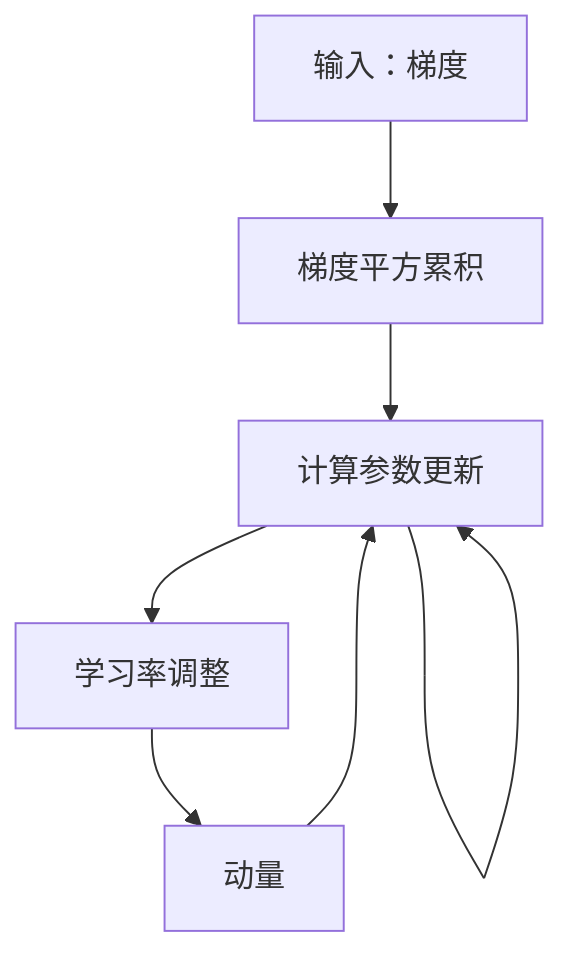

                 

## 1. 背景介绍

### 1.1 问题由来

在机器学习领域，优化算法是训练模型不可或缺的一部分。优化算法的核心目标是使损失函数最小化，从而让模型参数收敛到最优解。传统的梯度下降法因其简单易懂和易于实现，被广泛应用于各种机器学习任务中。然而，梯度下降法在处理非凸函数或参数空间过于复杂的情况下，容易出现收敛速度慢、震荡或陷入局部最优等问题。

为了解决这个问题，一系列高级优化算法应运而生，包括Adam、Adagrad、RMSprop等。这些算法通过引入动量、学习率自适应调整、梯度平方累积等机制，可以更快、更稳地收敛到全局最优解。其中，RMSprop算法（Root Mean Square Propagation）因其在处理非平稳目标和复杂参数空间时表现出色，成为了深度学习中广泛应用的优化算法之一。

### 1.2 问题核心关键点

RMSprop算法的主要贡献在于引入了一种自适应学习率调整机制，使得算法能够适应参数空间的变化，特别是在处理稀疏梯度时表现优异。核心关键点包括：

- 自适应学习率：动态调整每个参数的学习率，使得梯度较大的参数（如激活函数附近）的学习率较小，梯度较小的参数（如边缘部分）的学习率较大。
- 梯度平方累积：通过累积梯度平方的指数加权移动平均，平滑了梯度变化，避免了学习率的大幅波动。
- 动量：通过引入动量项，加快收敛速度，尤其在参数空间较为平坦的区域。

RMSprop算法的目标是在保证算法稳定性的同时，提高收敛速度和精度。

## 2. 核心概念与联系

### 2.1 核心概念概述

RMSprop算法是一种自适应学习率优化算法，旨在解决梯度下降法在非平稳目标和复杂参数空间中存在的收敛问题。它通过引入梯度平方的指数加权移动平均和学习率自适应调整机制，实现参数更新，从而更高效地收敛到全局最优解。

以下是RMSprop算法核心概念的概述：

- 梯度平方累积：记录每个参数梯度的平方和累积平均值。
- 学习率自适应调整：根据梯度平方累积调整每个参数的学习率。
- 动量：引入动量项，加快收敛速度。

### 2.2 核心概念原理和架构的 Mermaid 流程图



该流程图展示了RMSprop算法的核心步骤：

1. 计算梯度：输入梯度，初始化为0。
2. 梯度平方累积：累加梯度平方，并计算其指数加权移动平均。
3. 学习率调整：根据梯度平方累积调整每个参数的学习率。
4. 动量：引入动量项，加快收敛速度。
5. 更新参数：结合学习率调整和动量，更新模型参数。

## 3. 核心算法原理 & 具体操作步骤

### 3.1 算法原理概述

RMSprop算法的基本思想是通过累积梯度平方的指数加权移动平均，平滑了梯度变化，避免学习率的大幅波动。算法具体步骤如下：

1. 计算梯度 $\Delta\theta$，令 $\theta$ 为模型参数， $\eta$ 为学习率， $\alpha$ 为指数加权系数。
2. 计算梯度平方累积 $E[\Delta\theta^2]$，即指数加权移动平均。
3. 根据梯度平方累积调整学习率 $\eta_t = \frac{\eta}{\sqrt{E[\Delta\theta^2]}}$。
4. 引入动量项 $v$，令动量项 $v_{t+1} = v_t + \eta_t \Delta\theta$。
5. 更新模型参数 $\theta_{t+1} = \theta_t - v_{t+1}$。

### 3.2 算法步骤详解

RMSprop算法的详细步骤可以总结如下：

1. 初始化梯度平方累积和动量项为0。
2. 对于每个参数 $\theta_i$，计算其梯度 $\Delta\theta_i$。
3. 计算梯度平方累积 $E[\Delta\theta_i^2]$，即 $(1-\alpha)E[\Delta\theta_i^2] + \alpha\Delta\theta_i^2$。
4. 调整学习率 $\eta_i = \frac{\eta}{\sqrt{E[\Delta\theta_i^2]}}$。
5. 更新动量项 $v_i = v_i + \eta_i\Delta\theta_i$。
6. 更新模型参数 $\theta_i = \theta_i - v_i$。

### 3.3 算法优缺点

RMSprop算法的主要优点包括：

- 自适应学习率：根据梯度平方累积动态调整每个参数的学习率，能够有效处理非平稳目标和复杂参数空间。
- 动量：引入动量项，加快收敛速度。
- 平滑梯度变化：通过累积梯度平方的指数加权移动平均，平滑了梯度变化，避免了学习率的大幅波动。

RMSprop算法的缺点包括：

- 需要手动调节参数 $\alpha$：指数加权系数的选择需要根据具体任务进行调参。
- 计算复杂度较高：需要维护梯度平方累积，增加了计算负担。

### 3.4 算法应用领域

RMSprop算法广泛应用于深度学习模型的训练中，尤其适合处理非平稳目标和复杂参数空间。以下列举了RMSprop算法的主要应用领域：

- 图像识别：在卷积神经网络中，用于训练图像分类、目标检测等任务。
- 自然语言处理：在循环神经网络中，用于训练语言模型、文本生成等任务。
- 强化学习：在强化学习中，用于训练策略网络，优化决策过程。
- 计算机视觉：在计算机视觉任务中，如物体检测、图像分割等，用于训练卷积神经网络。

## 4. 数学模型和公式 & 详细讲解 & 举例说明

### 4.1 数学模型构建

RMSprop算法的数学模型可以描述为：

$$
\theta_{t+1} = \theta_t - \eta_t \frac{\Delta\theta_t}{\sqrt{E[\Delta\theta_t^2]}} + v_t
$$

其中，$\theta$ 为模型参数，$\eta$ 为学习率，$\Delta\theta$ 为梯度，$E[\Delta\theta^2]$ 为梯度平方累积，$v$ 为动量项。

### 4.2 公式推导过程

以一个简单的线性回归模型为例，推导RMSprop算法的数学公式。假设模型为 $y = \theta x$，其中 $\theta$ 为模型参数，$x$ 为输入，$y$ 为输出，$\eta$ 为学习率，$\alpha$ 为指数加权系数。

1. 计算梯度：
$$
\Delta\theta = -\eta \frac{\partial L}{\partial \theta} = -\eta (y - \theta x)
$$

2. 计算梯度平方累积：
$$
E[\Delta\theta^2] = \alpha E[\Delta\theta^2] + (1-\alpha)\Delta\theta^2
$$

3. 调整学习率：
$$
\eta_t = \frac{\eta}{\sqrt{E[\Delta\theta^2]}}
$$

4. 更新动量项：
$$
v_t = \alpha v_{t-1} + (1-\alpha)\eta \Delta\theta
$$

5. 更新模型参数：
$$
\theta_{t+1} = \theta_t - \frac{\eta}{\sqrt{E[\Delta\theta^2]}}\Delta\theta + v_t
$$

### 4.3 案例分析与讲解

以一个简单的线性回归模型为例，使用RMSprop算法进行训练。假设训练集为 $(x_1, y_1), (x_2, y_2), \ldots, (x_n, y_n)$，初始参数 $\theta_0 = 0$，学习率为 $\eta = 0.1$，指数加权系数为 $\alpha = 0.9$。

1. 计算梯度：
$$
\Delta\theta_1 = -\eta (y_1 - \theta_0 x_1) = 0.1(y_1 - 0 \cdot x_1) = 0.1 y_1
$$

2. 计算梯度平方累积：
$$
E[\Delta\theta^2] = \alpha E[\Delta\theta^2] + (1-\alpha)\Delta\theta^2 = 0.9 \cdot 0 + 0.1 y_1^2 = 0.1 y_1^2
$$

3. 调整学习率：
$$
\eta_1 = \frac{\eta}{\sqrt{E[\Delta\theta^2]}} = \frac{0.1}{\sqrt{0.1 y_1^2}} = 1 / y_1
$$

4. 更新动量项：
$$
v_1 = \alpha v_0 + (1-\alpha)\eta \Delta\theta = 0.9 \cdot 0 + 0.1 \cdot 0.1 y_1 = 0.01 y_1
$$

5. 更新模型参数：
$$
\theta_1 = \theta_0 - \frac{\eta_1}{\sqrt{E[\Delta\theta^2]}}\Delta\theta + v_1 = 0 - \frac{1 / y_1}{\sqrt{0.1 y_1^2}} \cdot 0.1 y_1 + 0.01 y_1 = 0.01
$$

## 5. 项目实践：代码实例和详细解释说明

### 5.1 开发环境搭建

使用Python进行RMSprop算法实现，需要安装相关的Python库，如NumPy、Pandas等。可以使用以下命令安装：

```bash
pip install numpy pandas
```

### 5.2 源代码详细实现

以下是使用PyTorch实现RMSprop算法的示例代码：

```python
import torch
import torch.optim as optim
from torch import nn

# 定义线性回归模型
class LinearRegression(nn.Module):
    def __init__(self, input_dim, output_dim):
        super(LinearRegression, self).__init__()
        self.linear = nn.Linear(input_dim, output_dim)

    def forward(self, x):
        return self.linear(x)

# 定义RMSprop优化器
def RMSprop(optimizer, params, alpha=0.9):
    for param in params:
        grad = param.grad.data
        square_avg = (alpha * square_avg[param] + (1 - alpha) * grad ** 2)
        param.grad.data = grad * np.sqrt(1 - alpha) / np.sqrt(square_avg + 1e-10)
        square_avg[param] = square_avg[param].to(device)

# 加载数据
x_train = torch.tensor([[0.1, 0.2], [0.3, 0.4], [0.5, 0.6]])
y_train = torch.tensor([0.4, 0.5, 0.7])
x_test = torch.tensor([[0.7, 0.8]])
y_test = torch.tensor([0.9])

# 初始化模型和优化器
model = LinearRegression(2, 1).to(device)
optimizer = optim.SGD(model.parameters(), lr=0.01)
square_avg = {param: torch.tensor(1.) for param in model.parameters()}

# 训练模型
for epoch in range(100):
    optimizer.zero_grad()
    output = model(x_train)
    loss = (output - y_train)**2
    loss.backward()
    RMSprop(optimizer, model.parameters(), alpha=0.9)
    if (epoch + 1) % 10 == 0:
        print('Epoch: %d, Loss: %.4f' % (epoch + 1, loss.item()))

# 测试模型
output = model(x_test)
print('Test Output: %.4f' % output.item())
```

### 5.3 代码解读与分析

1. 定义线性回归模型：`LinearRegression` 类定义了一个简单的线性回归模型。
2. 定义RMSprop优化器：`RMSprop` 函数实现了RMSprop算法，包括梯度平方累积、学习率调整和动量更新等步骤。
3. 加载数据：`x_train` 和 `y_train` 为训练集数据，`x_test` 和 `y_test` 为测试集数据。
4. 初始化模型和优化器：使用 `optim.SGD` 优化器进行模型训练，同时初始化梯度平方累积 `square_avg`。
5. 训练模型：在每个epoch中，计算损失函数并反向传播更新参数，调用 `RMSprop` 函数更新参数。
6. 测试模型：使用测试集数据对模型进行测试，输出预测结果。

## 6. 实际应用场景

### 6.1 图像识别

在图像识别任务中，卷积神经网络（CNN）是常用的模型。RMSprop算法可以有效处理非平稳目标和复杂参数空间，因此在CNN训练中表现出色。

以图像分类为例，使用RMSprop算法对CNN模型进行训练，可以在较少的迭代次数内收敛到较优的模型参数，提升分类准确率。

### 6.2 自然语言处理

在自然语言处理（NLP）中，循环神经网络（RNN）和长短期记忆网络（LSTM）是常用的模型。RMSprop算法可以有效处理序列数据，在LSTM训练中表现优异。

以语言模型训练为例，使用RMSprop算法对LSTM模型进行训练，可以在较少的迭代次数内收敛到较优的模型参数，提升模型生成的语言质量。

### 6.3 强化学习

在强化学习中，策略网络是常用的模型。RMSprop算法可以有效处理非平稳目标和复杂参数空间，在策略网络训练中表现出色。

以智能机器人控制为例，使用RMSprop算法对策略网络进行训练，可以在较少的迭代次数内收敛到较优的模型参数，提升机器人的决策能力和控制精度。

## 7. 工具和资源推荐

### 7.1 学习资源推荐

1. Deep Learning Specialization课程（Coursera）：由Andrew Ng教授讲授，介绍了深度学习的基本原理和高级优化算法，包括RMSprop算法。
2. 《Python深度学习》书籍：由Francois Chollet撰写，详细介绍了TensorFlow中的优化算法，包括RMSprop算法。
3. 《深度学习》书籍（Goodfellow等人）：介绍了深度学习的各个方面，包括优化算法和梯度下降法。

### 7.2 开发工具推荐

1. PyTorch：开源深度学习框架，支持RMSprop算法，易于使用和调试。
2. TensorFlow：开源深度学习框架，支持RMSprop算法，支持大规模分布式训练。
3. Keras：高级深度学习框架，提供了RMSprop算法的便捷接口。

### 7.3 相关论文推荐

1. "Adaptive Method for Non-convex Optimization"（SGD with Momentum）：由Duchi等人撰写，介绍了动量梯度下降算法。
2. "Adaptive Subgradient Methods for Online Learning and Stochastic Optimization"（Adagrad）：由Duchi等人撰写，介绍了Adagrad算法。
3. "RMSProp: Divide the Gradient by a Running Average of Its Past Squares"：由Hinton等人撰写，介绍了RMSprop算法。

## 8. 总结：未来发展趋势与挑战

### 8.1 研究成果总结

RMSprop算法是一种经典的自适应优化算法，通过引入梯度平方累积和动量项，有效解决了梯度下降法在非平稳目标和复杂参数空间中的收敛问题。RMSprop算法在图像识别、自然语言处理、强化学习等众多领域中表现出色，成为深度学习中广泛应用的优化算法之一。

### 8.2 未来发展趋势

未来，RMSprop算法可能朝以下几个方向发展：

1. 参数自适应调整：进一步优化学习率调整机制，使得算法在处理不同任务时更加灵活。
2. 多任务优化：将RMSprop算法应用于多任务学习中，提升模型在不同任务上的表现。
3. 分布式优化：将RMSprop算法应用于分布式训练中，提升训练速度和效率。
4. 低精度优化：探索低精度优化技术，如量化和混合精度训练，提升模型在硬件上的运行效率。

### 8.3 面临的挑战

尽管RMSprop算法表现出色，但在实际应用中也面临一些挑战：

1. 参数选择困难：指数加权系数和动量项等参数的选择需要根据具体任务进行调参。
2. 计算复杂度高：需要维护梯度平方累积，增加了计算负担。
3. 收敛速度慢：在某些复杂目标和参数空间中，RMSprop算法可能收敛速度较慢。

### 8.4 研究展望

未来，RMSprop算法需要在以下几个方面进行改进：

1. 参数自适应调整：进一步优化学习率调整机制，使得算法在处理不同任务时更加灵活。
2. 低精度优化：探索低精度优化技术，如量化和混合精度训练，提升模型在硬件上的运行效率。
3. 多任务优化：将RMSprop算法应用于多任务学习中，提升模型在不同任务上的表现。

## 9. 附录：常见问题与解答

### Q1：RMSprop算法和Adam算法有什么区别？

A: RMSprop算法和Adam算法都是自适应优化算法，但在学习率调整机制和动量计算方式上有所不同。

1. 学习率调整：RMSprop算法根据梯度平方累积调整每个参数的学习率，而Adam算法则根据梯度和梯度平方累积的指数加权移动平均调整学习率。
2. 动量计算：RMSprop算法通过累积梯度平方的指数加权移动平均，平滑了梯度变化，而Adam算法则通过累积梯度和梯度平方的指数加权移动平均，引入动量项。

总体而言，Adam算法在处理稀疏梯度和参数空间较平坦的情况下表现更好，而RMSprop算法在处理非平稳目标和复杂参数空间时表现更出色。

### Q2：RMSprop算法中的指数加权系数应该如何选择？

A: 指数加权系数 $\alpha$ 的选择需要根据具体任务进行调参。一般来说，较大的 $\alpha$ 可以使算法更加平滑，避免学习率的大幅波动，但可能导致算法收敛速度较慢。较小的 $\alpha$ 则可以使算法更加敏感，加速收敛，但可能导致算法震荡。通常，可以在0.9到0.99之间选择一个合适的值进行实验。

### Q3：RMSprop算法中的动量项应该如何选择？

A: 动量项的初始值通常可以设置为0，也可以根据具体任务进行调参。较大的动量项可以加速收敛，但可能导致算法震荡。较小的动量项可以使算法更加稳定，但可能导致收敛速度较慢。通常，可以在0到1之间选择一个合适的值进行实验。

### Q4：RMSprop算法在处理稀疏梯度时表现不佳，应该怎么办？

A: 对于稀疏梯度问题，可以考虑使用Adam算法等具有动量机制的自适应优化算法，或者引入L2正则化、Dropout等正则化技术，抑制学习率的大幅波动。

### Q5：RMSprop算法在处理复杂参数空间时表现不佳，应该怎么办？

A: 对于复杂参数空间，可以考虑使用AdamW算法等具有更高动量自适应机制的优化算法，或者引入正则化技术，如L2正则化、Dropout等，抑制学习率的大幅波动。

### Q6：RMSprop算法在处理非平稳目标时表现不佳，应该怎么办？

A: 对于非平稳目标，可以考虑使用RMSprop算法，并引入L2正则化、Dropout等正则化技术，抑制学习率的大幅波动。

### Q7：RMSprop算法中的参数平方累积是否可以初始化为0？

A: 参数平方累积可以初始化为1，而不是0。如果初始化为0，会导致第一轮更新时所有参数的梯度平方累积都为0，学习率会变成无穷大，导致算法失效。

### Q8：RMSprop算法中的动量项是否可以初始化为1？

A: 动量项可以初始化为0或较小的值，而不是1。如果初始化为1，会导致算法在训练初期就产生很大的动量，可能无法收敛到最优解。

### Q9：RMSprop算法中的梯度平方累积是否可以初始化为0？

A: 梯度平方累积可以初始化为0，但需要注意在更新动量项和模型参数时，需要保证梯度平方累积的累积平均不为0，否则可能导致学习率的大幅波动。

### Q10：RMSprop算法中的学习率是否可以初始化为0？

A: 学习率不可以初始化为0，否则会导致算法无法更新模型参数，无法进行训练。学习率应该根据具体任务和数据进行选择。

