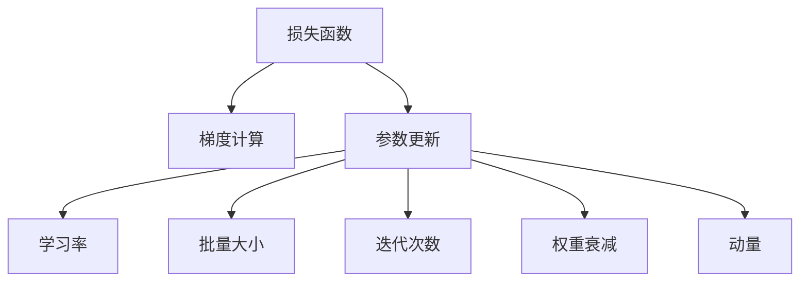

                 

# 优化算法：梯度下降 (Gradient Descent) 原理与代码实例讲解

## 1. 背景介绍

### 1.1 问题由来
梯度下降（Gradient Descent, GD）是一种经典的数值优化算法，广泛应用于机器学习、深度学习、信号处理等领域的模型训练和参数优化。在深度学习中，梯度下降算法通过不断调整模型参数，最小化损失函数，使得模型能够逼近最优解。作为深度学习中的核心算法之一，了解梯度下降的原理和实现方式对深度学习实践者来说至关重要。

### 1.2 问题核心关键点
梯度下降算法的核心在于如何通过计算函数在某一点的梯度，确定下降方向，并不断迭代更新参数以最小化目标函数。常见的梯度下降算法包括批量梯度下降（Batch Gradient Descent, BGD）、随机梯度下降（Stochastic Gradient Descent, SGD）和小批量梯度下降（Mini-batch Gradient Descent）。这些算法在更新频率和计算效率上各有优劣，适用于不同的模型训练场景。

梯度下降算法具有以下几个关键点：
1. **损失函数**：梯度下降的目标是最小化损失函数，损失函数通常表示为模型预测值与实际标签之间的差异。
2. **梯度计算**：梯度是损失函数对模型参数的导数，通过计算梯度，梯度下降算法可以找到最优解的方向。
3. **参数更新**：根据梯度方向更新模型参数，以逼近最优解。
4. **学习率**：学习率决定了每次参数更新的步长，过小的学习率收敛速度慢，过大的学习率可能导致震荡或发散。
5. **迭代次数**：梯度下降算法需要经过多次迭代才能找到最优解，迭代次数直接影响算法的收敛速度和效果。

### 1.3 问题研究意义
理解梯度下降算法的工作原理，对于深度学习的模型训练和参数优化具有重要意义。掌握梯度下降算法，可以帮助开发者更好地设计训练流程，优化模型性能，加速深度学习项目的发展。同时，梯度下降算法的研究也为新的优化算法和架构提供了理论基础，推动了深度学习技术的不断进步。

## 2. 核心概念与联系

### 2.1 核心概念概述

为更好地理解梯度下降算法，本节将介绍几个密切相关的核心概念：

- **损失函数(Loss Function)**：衡量模型预测值与实际标签之间差异的函数，目标是最小化损失函数。
- **梯度(Gradient)**：损失函数对模型参数的导数，梯度方向表示模型参数更新的方向。
- **学习率(Learning Rate)**：每次参数更新的步长，过小的学习率收敛速度慢，过大的学习率可能导致震荡或发散。
- **批量大小(Batch Size)**：每次参数更新所使用的样本数量，影响算法计算效率和收敛速度。
- **迭代次数(Iteration)**：梯度下降算法需要经过多次迭代才能找到最优解，迭代次数直接影响算法的收敛速度和效果。
- **权重衰减(Weight Decay)**：防止过拟合的技术，通过在损失函数中引入正则项，惩罚过大的参数值。
- **动量(Momentum)**：通过引入动量项，加速梯度下降算法收敛，缓解震荡。

这些核心概念之间的逻辑关系可以通过以下Mermaid流程图来展示：



这个流程图展示了一个基本的梯度下降算法的各个组成部分：

1. 通过损失函数来衡量模型预测值与实际标签之间的差异。
2. 计算梯度，确定参数更新的方向。
3. 根据梯度方向和批量大小，更新模型参数。
4. 通过学习率和迭代次数控制参数更新的步长和次数。
5. 引入权重衰减和动量等技术，优化参数更新过程。

这些概念共同构成了梯度下降算法的框架，指导着模型的训练和优化。

## 3. 核心算法原理 & 具体操作步骤
### 3.1 算法原理概述

梯度下降算法的基本原理是通过不断调整模型参数，使得损失函数最小化。其核心步骤包括损失函数计算、梯度计算和参数更新。

以单层神经网络为例，设模型参数为 $\theta = (\theta_1, \theta_2, \ldots, \theta_n)$，损失函数为 $\mathcal{L}(\theta)$，则梯度下降算法的基本步骤如下：

1. 初始化模型参数 $\theta$。
2. 对于每个训练样本 $(x_i, y_i)$，计算损失函数 $\mathcal{L}(\theta)$。
3. 计算损失函数对每个参数的梯度 $\frac{\partial \mathcal{L}(\theta)}{\partial \theta_i}$。
4. 根据梯度方向更新参数：$\theta_i \leftarrow \theta_i - \eta \frac{\partial \mathcal{L}(\theta)}{\partial \theta_i}$，其中 $\eta$ 为学习率。
5. 重复步骤2至4，直至损失函数收敛或达到预设迭代次数。

### 3.2 算法步骤详解

具体而言，梯度下降算法分为以下几个步骤：

**Step 1: 初始化模型参数**
- 初始化模型参数 $\theta$，通常使用随机初始化或Xavier初始化。

**Step 2: 计算损失函数**
- 对每个训练样本 $(x_i, y_i)$，计算损失函数 $\mathcal{L}(\theta)$。损失函数通常为均方误差（Mean Squared Error, MSE）或交叉熵（Cross Entropy, CE）。

**Step 3: 计算梯度**
- 计算损失函数对每个参数的梯度 $\frac{\partial \mathcal{L}(\theta)}{\partial \theta_i}$。通常使用反向传播算法计算梯度。

**Step 4: 参数更新**
- 根据梯度方向更新参数：$\theta_i \leftarrow \theta_i - \eta \frac{\partial \mathcal{L}(\theta)}{\partial \theta_i}$，其中 $\eta$ 为学习率。

**Step 5: 迭代更新**
- 重复步骤2至4，直至损失函数收敛或达到预设迭代次数。

**Step 6: 评估模型性能**
- 在验证集或测试集上评估模型性能，计算准确率、精确率、召回率等指标。

### 3.3 算法优缺点

梯度下降算法具有以下几个优点：
1. 简单易懂，易于实现。
2. 能够有效优化损失函数，收敛速度快。
3. 对于大规模数据集，可以并行计算，提高效率。
4. 对于非凸函数，可以找到局部最优解。

同时，梯度下降算法也存在一些缺点：
1. 需要手动设置学习率和迭代次数，参数选择不当可能导致震荡或发散。
2. 对于高维数据，梯度计算量大，计算复杂度高。
3. 对于非凸函数，可能陷入局部最优解，而非全局最优解。
4. 对于噪声样本敏感，容易受到异常值影响。

### 3.4 算法应用领域

梯度下降算法在深度学习和机器学习中有着广泛的应用，包括但不限于以下领域：

- **深度学习模型训练**：用于优化神经网络中的权重和偏置，最小化损失函数。
- **图像处理**：用于优化卷积神经网络中的卷积核参数，提升图像分类和识别效果。
- **自然语言处理**：用于优化循环神经网络中的权重，提高文本生成和语言模型效果。
- **信号处理**：用于优化信号滤波器参数，提升信号处理性能。
- **推荐系统**：用于优化推荐算法中的参数，提升推荐效果。

## 4. 数学模型和公式 & 详细讲解 & 举例说明

### 4.1 数学模型构建

在梯度下降算法中，损失函数和梯度计算是其核心。以下我们以线性回归为例，介绍数学模型的构建。

设输入特征 $x$，模型参数 $\theta = (w, b)$，预测输出 $y = wx + b$。假设目标输出为 $y^*$，则均方误差损失函数为：

$$
\mathcal{L}(\theta) = \frac{1}{2N} \sum_{i=1}^N (y_i - y^*_i)^2
$$

其中 $N$ 为样本数量。

### 4.2 公式推导过程

对损失函数求偏导数，得到梯度表达式：

$$
\frac{\partial \mathcal{L}(\theta)}{\partial w} = \frac{1}{N} \sum_{i=1}^N (x_i - y^*_i) x_i
$$

$$
\frac{\partial \mathcal{L}(\theta)}{\partial b} = \frac{1}{N} \sum_{i=1}^N (x_i - y^*_i)
$$

将梯度代入参数更新公式：

$$
w \leftarrow w - \eta \frac{\partial \mathcal{L}(\theta)}{\partial w}
$$

$$
b \leftarrow b - \eta \frac{\partial \mathcal{L}(\theta)}{\partial b}
$$

其中 $\eta$ 为学习率。

### 4.3 案例分析与讲解

以线性回归为例，假设我们有一组训练数据 $(x_1, y_1), (x_2, y_2), \ldots, (x_n, y_n)$，初始化参数 $w_0, b_0$。使用批量梯度下降算法，迭代更新参数。

**Step 1: 初始化参数**
- 设 $w_0 = 0, b_0 = 0$。

**Step 2: 计算损失函数**
- 对于每个样本 $(x_i, y_i)$，计算损失函数 $\mathcal{L}(\theta) = \frac{1}{2N} \sum_{i=1}^N (y_i - wx_i - b)^2$。

**Step 3: 计算梯度**
- 对于每个样本，计算梯度 $\frac{\partial \mathcal{L}(\theta)}{\partial w} = \frac{1}{N} \sum_{i=1}^N (x_i - y^*_i) x_i$ 和 $\frac{\partial \mathcal{L}(\theta)}{\partial b} = \frac{1}{N} \sum_{i=1}^N (x_i - y^*_i)$。

**Step 4: 参数更新**
- 设学习率为 $\eta = 0.1$，更新参数 $w \leftarrow w - \eta \frac{\partial \mathcal{L}(\theta)}{\partial w}$ 和 $b \leftarrow b - \eta \frac{\partial \mathcal{L}(\theta)}{\partial b}$。

**Step 5: 重复迭代**
- 重复步骤2至4，直至损失函数收敛或达到预设迭代次数。

通过不断迭代更新参数，线性回归模型能够逼近最优解，使得预测输出尽可能接近实际输出。

## 5. 项目实践：代码实例和详细解释说明
### 5.1 开发环境搭建

在进行梯度下降算法实践前，我们需要准备好开发环境。以下是使用Python进行PyTorch开发的环境配置流程：

1. 安装Anaconda：从官网下载并安装Anaconda，用于创建独立的Python环境。

2. 创建并激活虚拟环境：
```bash
conda create -n pytorch-env python=3.8 
conda activate pytorch-env
```

3. 安装PyTorch：根据CUDA版本，从官网获取对应的安装命令。例如：
```bash
conda install pytorch torchvision torchaudio cudatoolkit=11.1 -c pytorch -c conda-forge
```

4. 安装各类工具包：
```bash
pip install numpy pandas scikit-learn matplotlib tqdm jupyter notebook ipython
```

完成上述步骤后，即可在`pytorch-env`环境中开始梯度下降算法的实践。

### 5.2 源代码详细实现

下面我们将给出一个基于PyTorch的梯度下降算法实现，用于解决线性回归问题。

首先，导入必要的库：

```python
import torch
import torch.nn as nn
import torch.optim as optim
import numpy as np
import matplotlib.pyplot as plt
```

然后，定义数据集：

```python
# 生成训练数据
np.random.seed(0)
N = 100
X = np.random.randn(N, 2)
y = X @ [1, 2] + 1

# 转换为torch张量
X = torch.from_numpy(X).float()
y = torch.from_numpy(y).float().view(-1, 1)

# 定义模型
class LinearRegression(nn.Module):
    def __init__(self, input_dim, output_dim):
        super(LinearRegression, self).__init__()
        self.linear = nn.Linear(input_dim, output_dim)

    def forward(self, x):
        return self.linear(x)

# 定义损失函数
criterion = nn.MSELoss()

# 定义优化器
learning_rate = 0.1
optimizer = optim.SGD(LinearRegression(2, 1).parameters(), lr=learning_rate)
```

接下来，定义训练函数：

```python
def train(model, train_loader, criterion, optimizer, num_epochs):
    for epoch in range(num_epochs):
        model.train()
        running_loss = 0.0
        for i, data in enumerate(train_loader, 0):
            inputs, labels = data
            optimizer.zero_grad()
            outputs = model(inputs)
            loss = criterion(outputs, labels)
            loss.backward()
            optimizer.step()
            running_loss += loss.item()
            if i % 10 == 9:
                print(f'Epoch [{epoch+1}/{num_epochs}], Step [{i+1}/{len(train_loader)}], Loss: {running_loss/10:.3f}')
                running_loss = 0.0
```

最后，启动训练过程：

```python
num_epochs = 50
train_loader = torch.utils.data.DataLoader(train_data, batch_size=32, shuffle=True)

# 初始化模型
model = LinearRegression(2, 1)

# 训练模型
train(model, train_loader, criterion, optimizer, num_epochs)

# 可视化结果
plt.plot(train_data[0], train_data[1], 'o')
plt.plot(train_data[0], train_data[1] + model(torch.tensor(train_data[0])).item(), 'r')
plt.show()
```

以上就是使用PyTorch进行梯度下降算法实践的完整代码实现。可以看到，通过简单的几行代码，我们就可以使用梯度下降算法解决线性回归问题，并可视化输出结果。

### 5.3 代码解读与分析

让我们再详细解读一下关键代码的实现细节：

**LinearRegression类**：
- `__init__`方法：初始化模型参数。
- `forward`方法：定义前向传播过程。

**train函数**：
- 在每个epoch内，将模型设为训练模式。
- 对每个batch的数据进行迭代，计算损失函数，并根据梯度更新模型参数。

**train_data**：
- 用于可视化训练结果的数据集，包含了输入和输出。

**train函数内部**：
- 在每个step中，使用优化器更新模型参数。
- 输出当前step的损失，便于观察训练进度。

通过上述代码，我们展示了如何使用PyTorch实现基于梯度下降算法的线性回归模型训练。值得注意的是，在实际应用中，我们可能需要对代码进行优化，如添加权重衰减、动量等技术，进一步提升模型性能。

## 6. 实际应用场景
### 6.1 智能推荐系统

梯度下降算法在推荐系统中有着广泛的应用。通过不断优化模型参数，推荐系统能够动态调整推荐策略，提高用户满意度。

在推荐系统中，模型通常需要优化目标函数，如点击率预测、用户满意度等。通过梯度下降算法，推荐系统能够实时调整模型参数，优化推荐效果，提升用户粘性。

### 6.2 自然语言处理

梯度下降算法在自然语言处理中有着重要的应用，如文本分类、机器翻译、情感分析等任务。

在文本分类任务中，模型通常需要优化交叉熵损失函数，使得模型输出更接近真实标签。通过梯度下降算法，模型能够不断调整参数，优化分类效果。

在机器翻译任务中，模型通常需要优化BLEU、ROUGE等评价指标，使得翻译结果更接近理想输出。通过梯度下降算法，模型能够不断优化模型参数，提高翻译质量。

### 6.3 图像识别

梯度下降算法在图像识别任务中也有着广泛的应用。通过优化卷积神经网络中的权重和偏置，梯度下降算法能够提升图像分类和识别的准确率。

在图像识别任务中，模型通常需要优化交叉熵损失函数，使得模型输出更接近真实标签。通过梯度下降算法，模型能够不断调整参数，优化分类效果。

### 6.4 未来应用展望

随着深度学习技术的不断发展，梯度下降算法将在更多领域得到应用，为相关行业带来变革性影响。

在智慧医疗领域，梯度下降算法可以用于优化医学影像分类、疾病预测等模型，提升诊断准确率，辅助医生诊疗。

在智能教育领域，梯度下降算法可以用于优化学习推荐、作业批改等模型，提高教学效果，因材施教。

在智慧城市治理中，梯度下降算法可以用于优化城市事件监测、舆情分析等模型，提高治理效率，构建更安全、高效的未来城市。

此外，在企业生产、社会治理、文娱传媒等众多领域，梯度下降算法也将不断涌现，为相关行业带来新的创新突破。

## 7. 工具和资源推荐
### 7.1 学习资源推荐

为了帮助开发者系统掌握梯度下降算法的理论基础和实践技巧，这里推荐一些优质的学习资源：

1. 《深度学习》课程（Coursera）：由斯坦福大学Andrew Ng教授主讲，系统介绍深度学习的原理和算法，包括梯度下降算法。

2. 《Python深度学习》书籍：由François Chollet（Keras开发者）编写，详细介绍深度学习框架的使用和梯度下降算法的实现。

3. 《Deep Learning Specialization》（Coursera）：由Coursera与DeepLearning.AI合作推出，深入讲解深度学习技术，包括梯度下降算法。

4. 《Introduction to Deep Learning with PyTorch》书籍：由MIT Press出版，详细介绍PyTorch框架的使用和梯度下降算法的实践。

5. 《Neural Networks and Deep Learning》书籍：由Michael Nielsen编写，详细介绍神经网络算法，包括梯度下降算法。

通过对这些资源的学习实践，相信你一定能够快速掌握梯度下降算法的精髓，并用于解决实际的深度学习问题。

### 7.2 开发工具推荐

高效的开发离不开优秀的工具支持。以下是几款用于梯度下降算法开发的常用工具：

1. PyTorch：基于Python的开源深度学习框架，灵活动态的计算图，适合快速迭代研究。

2. TensorFlow：由Google主导开发的开源深度学习框架，生产部署方便，适合大规模工程应用。

3. JAX：由Google开发的自动微分和数值计算库，支持动态计算图，能够高效实现梯度下降算法。

4. PyTorch Lightning：基于PyTorch的高阶深度学习框架，提供自动化调参、分布式训练等功能，降低开发难度。

5. Ray Tune：开源的超参数优化工具，支持多种优化算法，包括梯度下降算法。

合理利用这些工具，可以显著提升梯度下降算法的开发效率，加快创新迭代的步伐。

### 7.3 相关论文推荐

梯度下降算法在深度学习中有着广泛的研究，以下是几篇奠基性的相关论文，推荐阅读：

1. Gradient Descent: Geometry and Dynamics（1967）：H. H. Bauschke, P. L. Combettes
2. Numerical Optimization（2013）：Nesterov
3. Efficient Backprop（1989）：Rumelhart, Hinton, Williams
4. On the Convergence of Multi-Layer Feedforward Networks (1990)：Rumelhart, Hinton, Williams
5. Training Recurrent Neural Networks: An Overview (2016)：Schmidhuber

这些论文代表了大规模语言模型微调技术的发展脉络。通过学习这些前沿成果，可以帮助研究者把握学科前进方向，激发更多的创新灵感。

## 8. 总结：未来发展趋势与挑战

### 8.1 总结

本文对梯度下降算法进行了全面系统的介绍。首先阐述了梯度下降算法的研究背景和意义，明确了算法在深度学习模型训练中的重要地位。其次，从原理到实践，详细讲解了梯度下降算法的数学原理和关键步骤，给出了梯度下降算法任务开发的完整代码实例。同时，本文还广泛探讨了梯度下降算法在推荐系统、自然语言处理、图像识别等多个领域的应用前景，展示了梯度下降算法的巨大潜力。

通过本文的系统梳理，可以看到，梯度下降算法作为深度学习中的核心算法之一，具有简单、高效、可解释性强等优点。掌握梯度下降算法，可以帮助开发者更好地设计训练流程，优化模型性能，加速深度学习项目的发展。

### 8.2 未来发展趋势

展望未来，梯度下降算法将呈现以下几个发展趋势：

1. 深度学习模型规模增大。随着算力成本的下降和数据规模的扩张，深度学习模型的参数量还将持续增长。超大参数模型需要更高效的优化算法，以提高训练效率。

2. 模型训练框架优化。未来的模型训练框架将更加注重计算效率和资源利用率，支持分布式训练、混合精度计算等技术。

3. 自适应学习率算法。引入自适应学习率算法，如AdaGrad、Adam等，能够自动调整学习率，进一步提升训练效果。

4. 多任务联合优化。通过多任务联合优化算法，能够同时优化多个任务，提高训练效率。

5. 融合其他优化算法。结合其他优化算法，如L-BFGS、共轭梯度法等，进一步提升梯度下降算法的性能。

6. 模型压缩和量化技术。通过模型压缩和量化技术，能够减少模型参数量，降低计算成本，提高推理速度。

以上趋势凸显了梯度下降算法在深度学习中的重要地位。这些方向的探索发展，必将进一步提升深度学习模型的训练效率和性能，推动深度学习技术不断进步。

### 8.3 面临的挑战

尽管梯度下降算法已经取得了瞩目成就，但在迈向更加智能化、普适化应用的过程中，它仍面临着诸多挑战：

1. 过拟合问题。随着模型参数的增大，梯度下降算法容易过拟合，需要引入正则化等技术。

2. 数据噪声问题。噪声数据对梯度下降算法的影响较大，需要引入数据清洗、噪声过滤等技术。

3. 计算资源消耗。大模型训练需要大量计算资源，需要优化计算图和资源利用率。

4. 超参数调优。梯度下降算法需要手动调整超参数，如学习率、迭代次数等，调参过程繁琐且复杂。

5. 可解释性问题。梯度下降算法通常被视为"黑盒"模型，难以解释其内部工作机制和决策逻辑。

6. 计算时间消耗。大模型的训练和推理时间较长，需要优化训练流程，缩短训练时间。

正视梯度下降算法面临的这些挑战，积极应对并寻求突破，将是大规模深度学习模型训练的必由之路。相信随着学界和产业界的共同努力，这些挑战终将一一被克服，梯度下降算法必将在构建智能系统中的重要地位愈发显著。

### 8.4 研究展望

面对梯度下降算法所面临的种种挑战，未来的研究需要在以下几个方面寻求新的突破：

1. 探索无监督和半监督梯度下降算法。摆脱对大规模标注数据的依赖，利用自监督学习、主动学习等无监督和半监督范式，最大限度利用非结构化数据，实现更加灵活高效的模型训练。

2. 研究自适应学习率算法。开发更加自适应的学习率算法，如AdaGrad、Adam等，能够自动调整学习率，进一步提升训练效果。

3. 引入更多先验知识。将符号化的先验知识，如知识图谱、逻辑规则等，与深度学习模型进行巧妙融合，引导模型训练过程学习更准确、合理的语言表征。

4. 结合因果分析和博弈论工具。将因果分析方法引入模型训练，识别出模型决策的关键特征，增强模型输出的因果性和逻辑性。借助博弈论工具刻画人机交互过程，主动探索并规避模型的脆弱点，提高系统稳定性。

5. 纳入伦理道德约束。在模型训练目标中引入伦理导向的评估指标，过滤和惩罚有害的输出倾向，加强人工干预和审核，确保输出符合人类价值观和伦理道德。

这些研究方向的探索，必将引领梯度下降算法迈向更高的台阶，为构建安全、可靠、可解释、可控的智能系统铺平道路。面向未来，梯度下降算法还需要与其他深度学习技术进行更深入的融合，如知识表示、因果推理、强化学习等，多路径协同发力，共同推动深度学习技术的进步。只有勇于创新、敢于突破，才能不断拓展深度学习模型的边界，让智能技术更好地造福人类社会。

## 9. 附录：常见问题与解答

**Q1：梯度下降算法是如何计算梯度的？**

A: 梯度下降算法的核心在于计算损失函数对每个参数的导数，即梯度。对于线性回归模型，可以通过反向传播算法计算梯度。对于非线性模型，需要更复杂的导数计算方法，如自动微分等。

**Q2：如何选择梯度下降算法的超参数？**

A: 梯度下降算法的超参数包括学习率、批量大小、迭代次数等。通常需要经过多次实验调整，找到最优的超参数组合。可以使用网格搜索、贝叶斯优化等技术辅助超参数调优。

**Q3：什么是学习率？如何选择合适的学习率？**

A: 学习率是梯度下降算法中每次参数更新的步长，过小的学习率收敛速度慢，过大的学习率可能导致震荡或发散。选择合适的学习率需要根据具体问题进行调整，常见的学习率调度策略包括固定学习率、学习率衰减、warmup等。

**Q4：梯度下降算法为什么会收敛？**

A: 梯度下降算法的收敛性由损失函数的性质决定。如果损失函数是凸函数，则梯度下降算法能够收敛到全局最优解。如果损失函数是局部凸函数，则梯度下降算法可能收敛到局部最优解。

**Q5：如何避免梯度下降算法的震荡？**

A: 梯度下降算法可能会因为参数更新过大而产生震荡，可以通过引入动量(Momentum)等技术，加速收敛，缓解震荡。同时，适当调整学习率，也可以避免过大的更新步长。

通过本文的系统梳理，可以看到，梯度下降算法作为深度学习中的核心算法之一，具有简单、高效、可解释性强等优点。掌握梯度下降算法，可以帮助开发者更好地设计训练流程，优化模型性能，加速深度学习项目的发展。

作者：禅与计算机程序设计艺术 / Zen and the Art of Computer Programming

