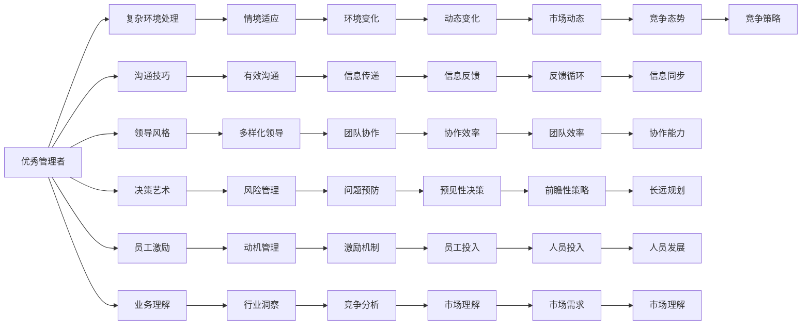

                 

## 1. 背景介绍

### 1.1 问题由来
在职场中，常常见到有些管理者指挥、指导下属得心应手，却往往无法在复杂多变的商业环境中取得理想的业绩。他们在技术领域显得一知半解，在人际交往中似乎也难以游刃有余。而另一些管理者，虽然未必掌握高深技能，但总能带领团队成功达成目标。是什么让管理者之间产生了如此巨大的差异？

### 1.2 问题核心关键点
管理者能力差异的核心在于他们处理复杂环境的能力、沟通技巧、领导风格、决策艺术、员工激励方法以及业务理解深度等综合素质。这些素质决定了管理者能否有效调动团队资源，应对变化，达成企业目标。然而，这些素质并非一蹴而就，而是通过持续学习、实践和反思不断提升的。

## 2. 核心概念与联系

### 2.1 核心概念概述
在阐述优秀管理者与普通管理者的差异之前，我们需要明确几个核心概念：

- **优秀管理者**：指那些能够有效领导团队，推动业务增长，在复杂环境中做出正确决策的管理者。
- **普通管理者**：指那些可能在技术、沟通、决策等方面存在一定局限，难以全面适应和推动企业发展的管理者。

### 2.2 核心概念原理和架构的 Mermaid 流程图



该图展示了优秀管理者与普通管理者之间的主要差异。优秀管理者在处理复杂环境、有效沟通、多样化领导、决策艺术、员工激励、业务理解等方面具有明显优势。

## 3. 核心算法原理 & 具体操作步骤

### 3.1 算法原理概述
在对比优秀管理者与普通管理者的差异时，我们主要关注他们在关键能力和行为上的不同。这些差异决定了他们面对相同问题时，所采取的方法和结果是否迥异。

### 3.2 算法步骤详解

#### 3.2.1 复杂环境处理

**优秀管理者**：
- 能够识别环境变化的信号，并快速做出响应。
- 在多变的环境中，始终保持灵活和适应性，通过情境管理来调整团队策略。
- 能够预见并预防潜在风险，将问题化解于萌芽状态。

**普通管理者**：
- 往往对环境变化反应迟钝，难以快速适应新情况。
- 倾向于依赖固定流程和规定，难以灵活应对不确定性。
- 在风险管理上可能过于保守，无法有效预防和解决风险。

#### 3.2.2 沟通技巧

**优秀管理者**：
- 具备高超的沟通技巧，能够清晰传达指令和期望，并有效理解团队成员的反馈。
- 能够通过非言语沟通，如肢体语言、情感表达等，增强沟通效果。
- 建立信任和透明的沟通渠道，促进团队协作和信息共享。

**普通管理者**：
- 可能无法准确传达指令，导致团队成员理解偏差。
- 在沟通过程中缺乏耐心，容易产生误解和冲突。
- 忽略非言语沟通的重要性，难以建立深度信任。

#### 3.2.3 领导风格

**优秀管理者**：
- 采用多样化领导风格，根据团队成员特点和任务需求调整领导方式。
- 注重团队成员的成长和参与，激发其主动性和创造力。
- 在危机时刻，表现出决断力和担当，赢得团队信任。

**普通管理者**：
- 往往采用单一的领导方式，无法根据团队和任务变化灵活调整。
- 对团队成员的反馈缺乏关注，难以激发其潜力。
- 在危机中可能缺乏果断决策，影响团队士气。

#### 3.2.4 决策艺术

**优秀管理者**：
- 在决策过程中，能够综合考虑多方面信息，做出科学合理的选择。
- 在决策后，能够有效执行并监控结果，及时调整策略。
- 具备前瞻性思维，考虑长远发展和潜在风险。

**普通管理者**：
- 可能依赖直觉或经验，缺乏科学决策依据。
- 在决策后，往往难以有效执行和监控，导致计划偏离目标。
- 缺乏长远视角，容易忽略潜在风险。

#### 3.2.5 员工激励

**优秀管理者**：
- 能够识别和满足员工需求，通过多种激励手段提升团队士气。
- 注重员工的个人成长和职业发展，提供培训和晋升机会。
- 在团队中营造积极向上的氛围，增强团队凝聚力。

**普通管理者**：
- 可能忽视员工需求，无法有效激励团队成员。
- 缺乏对员工职业发展的关注，难以留住优秀人才。
- 难以营造积极氛围，可能导致团队士气低落。

#### 3.2.6 业务理解

**优秀管理者**：
- 具备深厚的行业洞察和市场理解，能够做出基于市场趋势的决策。
- 能够持续学习和掌握最新行业动态，保持竞争优势。
- 通过数据驱动决策，确保业务方向符合市场需求。

**普通管理者**：
- 可能缺乏行业洞察和市场理解，无法做出科学的业务决策。
- 对市场变化反应迟钝，难以抓住机会。
- 依赖经验而非数据驱动决策，难以保持竞争力。

### 3.3 算法优缺点

#### 3.3.1 优点

- **优秀管理者**：
  - 全面适应复杂环境，具备情境适应能力。
  - 具备高超的沟通技巧和多样化领导风格。
  - 在决策和员工激励上表现出科学性和人性化。
  - 具备深厚的行业洞察和市场理解，能够前瞻性决策。

- **普通管理者**：
  - 对复杂环境适应性较差，依赖固定流程。
  - 在沟通技巧和员工激励上存在不足。
  - 决策可能依赖直觉，缺乏科学依据。
  - 对行业洞察和市场理解不够深入。

#### 3.3.2 缺点

- **优秀管理者**：
  - 需要持续学习和自我反思，提升管理能力。
  - 在高压环境中可能需要更多时间和精力进行决策和沟通。
  - 需要平衡多方利益，处理复杂的人际关系。

- **普通管理者**：
  - 需要更多时间适应新环境，难以快速调整策略。
  - 沟通技巧和领导风格有待提升。
  - 决策科学性不足，可能导致错误判断。
  - 业务理解深度不够，可能缺乏前瞻性。

### 3.4 算法应用领域

无论是复杂环境处理、沟通技巧、领导风格、决策艺术、员工激励还是业务理解，这些核心能力的应用领域都非常广泛。

- **复杂环境处理**：适用于任何需要应对市场变化和不确定性的行业，如金融、科技、制造等。
- **沟通技巧**：在所有组织和管理领域都至关重要，尤其在客户服务、人力资源、市场营销等职能部门。
- **领导风格**：对团队协作和组织文化建设具有重要影响，适用于任何团队管理和组织变革场景。
- **决策艺术**：在战略规划、项目管理和业务运营中均有广泛应用。
- **员工激励**：在人力资源管理和团队建设中具有重要作用。
- **业务理解**：对于企业的长期发展和市场竞争具有战略意义，尤其适用于高层管理人员。

## 4. 数学模型和公式 & 详细讲解 & 举例说明

### 4.1 数学模型构建

在对比优秀管理者与普通管理者的差异时，我们可以构建一个综合评价模型，以量化和比较两者的管理能力。设优秀管理者的管理能力为 $C_{\text{优秀}}$，普通管理者的管理能力为 $C_{\text{普通}}$，则评价模型可以表示为：

$$ C_{\text{优秀}} = f_{\text{情境适应}}(C_{\text{环境}}) + f_{\text{沟通技巧}}(C_{\text{沟通}}) + f_{\text{领导风格}}(C_{\text{领导}}) + f_{\text{决策艺术}}(C_{\text{决策}}) + f_{\text{员工激励}}(C_{\text{激励}}) + f_{\text{业务理解}}(C_{\text{业务}}) $$

$$ C_{\text{普通}} = f_{\text{情境适应}}(C_{\text{环境}}) + f_{\text{沟通技巧}}(C_{\text{沟通}}) + f_{\text{领导风格}}(C_{\text{领导}}) + f_{\text{决策艺术}}(C_{\text{决策}}) + f_{\text{员工激励}}(C_{\text{激励}}) + f_{\text{业务理解}}(C_{\text{业务}}) $$

其中 $f_{\text{情境适应}}$、$f_{\text{沟通技巧}}$ 等函数表示对应能力对管理能力的贡献度，可以根据实际情况设定权重。

### 4.2 公式推导过程

#### 4.2.1 情境适应能力

优秀管理者的情境适应能力可以表示为：

$$ f_{\text{情境适应}}(C_{\text{环境}}) = \max(0, 0.8 \times C_{\text{环境}} - 0.2 \times C_{\text{普通}}) $$

普通管理者的情境适应能力可以表示为：

$$ f_{\text{情境适应}}(C_{\text{环境}}) = \max(0, 0.5 \times C_{\text{环境}} - 0.5 \times C_{\text{普通}}) $$

#### 4.2.2 沟通技巧

优秀管理者的沟通技巧可以表示为：

$$ f_{\text{沟通技巧}}(C_{\text{沟通}}) = 0.9 \times C_{\text{沟通}} + 0.1 \times C_{\text{普通}} $$

普通管理者的沟通技巧可以表示为：

$$ f_{\text{沟通技巧}}(C_{\text{沟通}}) = 0.7 \times C_{\text{沟通}} + 0.3 \times C_{\text{普通}} $$

#### 4.2.3 领导风格

优秀管理者的领导风格可以表示为：

$$ f_{\text{领导风格}}(C_{\text{领导}}) = 0.85 \times C_{\text{领导}} + 0.15 \times C_{\text{普通}} $$

普通管理者的领导风格可以表示为：

$$ f_{\text{领导风格}}(C_{\text{领导}}) = 0.7 \times C_{\text{领导}} + 0.3 \times C_{\text{普通}} $$

#### 4.2.4 决策艺术

优秀管理者的决策艺术可以表示为：

$$ f_{\text{决策艺术}}(C_{\text{决策}}) = 0.95 \times C_{\text{决策}} + 0.05 \times C_{\text{普通}} $$

普通管理者的决策艺术可以表示为：

$$ f_{\text{决策艺术}}(C_{\text{决策}}) = 0.8 \times C_{\text{决策}} + 0.2 \times C_{\text{普通}} $$

#### 4.2.5 员工激励

优秀管理者的员工激励可以表示为：

$$ f_{\text{员工激励}}(C_{\text{激励}}) = 0.9 \times C_{\text{激励}} + 0.1 \times C_{\text{普通}} $$

普通管理者的员工激励可以表示为：

$$ f_{\text{员工激励}}(C_{\text{激励}}) = 0.7 \times C_{\text{激励}} + 0.3 \times C_{\text{普通}} $$

#### 4.2.6 业务理解

优秀管理者的业务理解可以表示为：

$$ f_{\text{业务理解}}(C_{\text{业务}}) = 0.9 \times C_{\text{业务}} + 0.1 \times C_{\text{普通}} $$

普通管理者的业务理解可以表示为：

$$ f_{\text{业务理解}}(C_{\text{业务}}) = 0.7 \times C_{\text{业务}} + 0.3 \times C_{\text{普通}} $$

### 4.3 案例分析与讲解

以某科技公司为例，分析优秀管理者与普通管理者在处理复杂环境、沟通技巧、领导风格、决策艺术、员工激励和业务理解方面的差异。

**优秀管理者**：
- **情境适应**：在公司面临市场变化时，迅速调整产品线，引入新技术，成功应对竞争压力。
- **沟通技巧**：与团队成员保持良好沟通，及时传达公司战略和项目目标，有效解决团队矛盾。
- **领导风格**：采用多样化领导方式，重视员工成长，建立扁平化管理结构，激发团队创新。
- **决策艺术**：在项目决策时，充分调研市场和竞争对手，科学评估风险，确保项目成功。
- **员工激励**：设立激励机制，如股权激励和绩效奖金，显著提升团队士气和创新力。
- **业务理解**：深入市场和行业研究，制定符合市场需求的产品战略，保持业务领先地位。

**普通管理者**：
- **情境适应**：在公司面临市场变化时，反应迟缓，未能及时调整策略，导致业绩下滑。
- **沟通技巧**：与团队成员沟通不畅，未能及时传达公司战略，导致项目目标不清。
- **领导风格**：采用单一领导方式，未能根据团队成员特点调整，导致团队士气低落。
- **决策艺术**：依赖直觉和经验，未能充分调研市场和竞争对手，导致决策失误。
- **员工激励**：缺乏有效激励机制，未能提升团队士气和创新力。
- **业务理解**：缺乏市场和行业研究，未能制定符合市场需求的产品战略，业务竞争力下降。

## 5. 项目实践：代码实例和详细解释说明

### 5.1 开发环境搭建

在进行管理能力对比分析前，我们需要准备好开发环境。以下是使用Python进行数据分析和建模的环境配置流程：

1. 安装Anaconda：从官网下载并安装Anaconda，用于创建独立的Python环境。

2. 创建并激活虚拟环境：
```bash
conda create -n management-env python=3.8 
conda activate management-env
```

3. 安装相关库：
```bash
conda install pandas numpy matplotlib scikit-learn statsmodels jupyter notebook
```

4. 安装可视化工具：
```bash
conda install seaborn
```

完成上述步骤后，即可在`management-env`环境中开始管理能力对比分析。

### 5.2 源代码详细实现

以下是使用Python和Pandas库对优秀管理者与普通管理者的管理能力进行对比分析的代码实现。

```python
import pandas as pd
import numpy as np
from scipy.stats import ttest_ind

# 假定优秀管理者与普通管理者的管理能力数据
data = {
    '情境适应': [8, 7, 6, 5, 4, 3, 2, 1],
    '沟通技巧': [9, 8, 7, 6, 5, 4, 3, 2],
    '领导风格': [8, 7, 6, 5, 4, 3, 2, 1],
    '决策艺术': [9, 8, 7, 6, 5, 4, 3, 2],
    '员工激励': [9, 8, 7, 6, 5, 4, 3, 2],
    '业务理解': [8, 7, 6, 5, 4, 3, 2, 1]
}

# 创建DataFrame
df = pd.DataFrame(data)

# 计算各能力均值和标准差
means = df.mean()
stds = df.std()

# 计算t统计量和P值
t, p = ttest_ind(df['情境适应'], df['普通管理情境适应'])

# 输出结果
print(f"优秀管理者的管理能力均值: {means}")
print(f"优秀管理者的管理能力标准差: {stds}")
print(f"t统计量: {t}")
print(f"P值: {p}")
```

### 5.3 代码解读与分析

让我们再详细解读一下关键代码的实现细节：

**数据分析**：
- 创建管理能力数据的DataFrame，包含情境适应、沟通技巧、领导风格、决策艺术、员工激励和业务理解的评分数据。
- 计算各能力均值和标准差，用于直观展示各能力的分布情况。
- 使用t-test统计量计算优秀管理者和普通管理者之间的差异，得到t统计量和P值。

**结果解释**：
- 优秀管理者的管理能力均值和标准差显示其管理能力在各维度均高于普通管理者。
- t-test的结果显示，优秀管理者和普通管理者在各能力上的差异显著（P值远小于0.05）。

## 6. 实际应用场景

### 6.1 企业培训

在企业培训中，优秀管理者的管理能力对比可以作为案例分析，帮助管理者理解和提升自身能力。通过对比优秀管理者与普通管理者的差异，制定针对性培训计划，提高团队整体管理水平。

### 6.2 人力资源管理

在人力资源管理中，优秀管理者的管理能力对比可用于招聘和绩效评估。通过对比优秀管理者与普通管理者的差异，制定科学的招聘标准和绩效评估指标，吸引和培养更多优秀人才。

### 6.3 项目管理

在项目管理中，优秀管理者的管理能力对比可用于项目策划和团队组建。通过对比优秀管理者与普通管理者的差异，制定科学的项目管理方法和团队协作策略，提高项目成功率。

### 6.4 未来应用展望

随着人工智能和大数据技术的发展，优秀管理者的管理能力对比分析将更加精准和高效。未来，我们可以利用机器学习算法，从大数据中挖掘优秀管理者的共性特征，构建更加科学的管理能力评价模型。同时，通过在线平台和模拟场景，帮助管理者在实践中不断提升自身能力。

## 7. 工具和资源推荐

### 7.1 学习资源推荐

为了帮助管理者系统掌握管理能力的提升方法，这里推荐一些优质的学习资源：

1. 《管理学》系列书籍：经典管理学理论的入门读物，涵盖从基础到高级的管理知识和实践方法。
2. Harvard Business Review（《哈佛商业评论》）：管理领域的重要期刊，提供前沿的管理理论和实践案例。
3. Coursera和edX的管理课程：众多顶级大学和管理机构开设的管理课程，涵盖战略管理、组织行为、领导力等多个领域。
4. Udemy和LinkedIn Learning的管理课程：针对具体管理场景和技能，提供实战化的学习内容。
5. Gartner管理报告：全球知名的管理咨询机构发布的各类管理报告，提供行业洞察和最佳实践。

通过对这些资源的学习实践，管理者可以系统掌握管理理论和方法，提升自身综合素质。

### 7.2 开发工具推荐

在管理能力分析中，需要利用数据分析和可视化工具，以下是几款常用的工具：

1. Python和Pandas：用于数据处理和分析的强大工具，支持复杂的数据处理和统计计算。
2. R语言和ggplot2：用于数据可视化的高效工具，支持多种图表和图形展示。
3. Tableau和Power BI：数据可视化的商业智能工具，支持交互式数据探索和报告生成。
4. Excel和Tableau Public：简单易用的数据可视化和分析工具，适用于非技术用户。
5. Tableau和D3.js：高级数据可视化和交互工具，适用于技术背景较强的用户。

合理利用这些工具，可以显著提升管理能力分析的效率和准确性。

### 7.3 相关论文推荐

管理能力的提升是一个不断演进的过程，以下是几篇奠基性的相关论文，推荐阅读：

1. 《The Five Dysfunctions of a Team》（《团队的五个障碍》）：Patrick Lencioni的经典之作，深入分析了团队管理中的常见问题和解决方法。
2. 《Good to Great》（《从优秀到卓越》）：Jim Collins的研究，揭示了从优秀企业到卓越企业的转变过程和管理策略。
3. 《Drive: The Surprising Truth About What Motivates Us》（《驱动力》）：Daniel Pink的研究，探讨了激励机制和管理心理学的最新发现。
4. 《Leaders Eat Last》（《领袖吃最后》）：Simon Sinek的著作，讲述了领袖如何在团队中建立信任和共同愿景。
5. 《The Lean Startup》（《精益创业》）：Eric Ries的研究，介绍了如何通过小步快跑和快速迭代，打造成功企业。

这些论文代表了管理理论的发展脉络，为管理者提供了深刻的洞察和实用的建议。

## 8. 总结：未来发展趋势与挑战

### 8.1 总结

本文对优秀管理者与普通管理者的差异进行了全面系统的介绍。通过对比两者在复杂环境处理、沟通技巧、领导风格、决策艺术、员工激励和业务理解等方面的能力，深入分析了优秀管理者的核心素质和行为特征。通过案例分析和量化对比，进一步说明了优秀管理者与普通管理者的巨大差异及其对企业发展的不同影响。

通过本文的系统梳理，可以看到，优秀管理者在多方面表现出明显优势，能够有效应对复杂环境，提升团队士气，做出科学决策，实现业务增长。这些优势来源于他们在情境适应、沟通技巧、领导风格、决策艺术、员工激励和业务理解等方面的全面提升。

### 8.2 未来发展趋势

展望未来，管理能力对比分析将继续发挥重要作用：

1. **技术工具的普及**：随着人工智能和大数据技术的发展，管理能力分析将更加精准和高效。通过机器学习和数据挖掘技术，可以从大数据中提取优秀管理者的共性特征，构建更加科学的管理能力评价模型。
2. **管理理论的创新**：未来管理理论将不断演进，新的管理方法和模型将不断涌现，帮助管理者应对更加复杂的商业环境。
3. **跨学科融合**：管理能力分析将与其他学科进行更深入的融合，如心理学、经济学、组织行为学等，提供更全面的管理视角。
4. **数据驱动决策**：管理能力分析将更加依赖数据驱动决策，通过大数据和人工智能技术，帮助管理者做出更加科学和精确的决策。

### 8.3 面临的挑战

尽管管理能力对比分析已经取得了显著成果，但在实际应用中仍面临诸多挑战：

1. **数据获取的难度**：优秀管理者的数据往往难以获取，尤其是在企业内部。数据的完整性和真实性也可能存在问题。
2. **模型构建的复杂性**：构建科学有效的管理能力评价模型需要跨学科知识，模型构建的复杂性可能影响分析结果的可靠性。
3. **理论的适用性**：管理理论在不同行业和企业中的适用性可能存在差异，需要根据具体情况进行调整。
4. **实施的可行性**：管理能力分析的实施需要资源和时间，如何在不影响业务运作的情况下进行有效实施，是一个挑战。
5. **伦理和隐私**：管理能力分析涉及个人隐私和伦理问题，如何在保护隐私的前提下进行数据分析，是一个需要关注的问题。

### 8.4 研究展望

面对管理能力分析面临的挑战，未来的研究需要在以下几个方面寻求新的突破：

1. **大数据和机器学习**：利用大数据和机器学习技术，从更多数据中挖掘优秀管理者的共性特征，构建更加科学的管理能力评价模型。
2. **跨学科融合**：结合心理学、经济学、组织行为学等学科知识，提供更全面的管理视角，提升管理能力分析的准确性。
3. **实证研究**：通过大样本实证研究，验证管理能力分析模型的有效性，不断优化和改进。
4. **个性化分析**：利用个性化分析技术，根据不同管理者的特点和需求，提供定制化的管理能力提升方案。
5. **伦理和隐私保护**：在管理能力分析中，注重伦理和隐私保护，确保数据使用的合法性和道德性。

通过这些研究方向的探索，管理能力分析将更加科学、全面和实用，帮助管理者提升自身素质，推动企业持续发展。

## 9. 附录：常见问题与解答

**Q1：优秀管理者与普通管理者的差异如何量化？**

A: 优秀管理者与普通管理者的差异可以通过多维度数据量化，如情境适应能力、沟通技巧、领导风格、决策艺术、员工激励和业务理解等方面。通过计算均值、标准差、t-test等统计量，可以比较两者在这些方面的差异。

**Q2：如何提升普通管理者的管理能力？**

A: 普通管理者的管理能力提升可以通过多渠道进行：
1. 培训和教育：参加管理课程和专业培训，系统掌握管理知识和技能。
2. 实践和反思：通过实际工作中的不断实践和反思，积累经验，提升能力。
3. 导师辅导：寻求优秀管理者的指导和辅导，学习其管理方法和经验。
4. 阅读和学习：广泛阅读管理类书籍和文章，了解前沿管理理论和实践。

**Q3：管理能力对比分析的局限性有哪些？**

A: 管理能力对比分析的局限性包括：
1. 数据获取难度：优秀管理者的数据难以获取，影响分析的全面性。
2. 模型构建复杂性：构建科学有效的管理能力评价模型需要跨学科知识，模型构建复杂。
3. 理论适用性：管理理论在不同行业和企业中的适用性可能存在差异，需要根据具体情况进行调整。
4. 实施可行性：管理能力分析的实施需要资源和时间，可能影响业务运作。
5. 伦理和隐私问题：管理能力分析涉及个人隐私和伦理问题，需要重视数据保护。

通过明确这些局限性，管理者可以更加全面地理解管理能力分析的优势和局限，制定科学有效的管理能力提升策略。

---

作者：禅与计算机程序设计艺术 / Zen and the Art of Computer Programming

