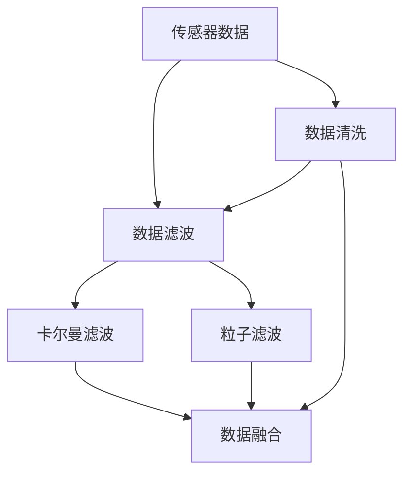

                 

# 传感器数据处理：过滤和融合

> 关键词：传感器数据处理, 数据融合, 滤波算法, Kalman滤波, 粒子滤波, 机器学习, 传感器网络, 数据清洗

## 1. 背景介绍

在智能设备日益普及的今天，传感器数据已无处不在。从简单的温度、湿度监测到复杂的生物识别，传感器数据的广泛应用为自动化控制、预测分析、实时决策提供了强大的数据支撑。然而，传感器数据通常包含噪声、误差，且其信号形式多样，处理难度较大。如何有效处理和融合传感器数据，最大限度地提取有用信息，已成为当前数据科学和自动化技术面临的关键问题。

传感器数据处理涉及两个主要环节：数据过滤和数据融合。数据过滤旨在从原始传感器数据中去除噪声、误差等无用信号，提取有用信息。数据融合则涉及将多个传感器数据进行整合，以提升数据精度、降低误报率，从而为后续决策提供更可靠的依据。

本文将从传感器数据处理的基本原理和常用算法出发，深入探讨数据过滤和融合的实现方法，并结合实际应用场景进行详细讲解。

## 2. 核心概念与联系

### 2.1 核心概念概述

传感器数据处理涉及多个核心概念：

- **传感器数据**：指通过传感器获取的原始物理量信号。传感器数据形式多样，包括时间序列、图像、声音等。
- **数据清洗**：指去除传感器数据中的噪声、缺失值等无用信息，提升数据质量。
- **数据滤波**：指通过算法对传感器数据进行处理，以去除噪声、平滑信号，增强数据的稳定性和可靠性。
- **数据融合**：指将多个传感器数据进行整合，综合利用不同数据源，提升数据的精度和鲁棒性。
- **卡尔曼滤波**：一种经典的线性滤波算法，用于估计动态系统的状态和噪声，常用于传感器数据的噪声消除。
- **粒子滤波**：一种非线性滤波算法，用于处理非线性系统，具有较高的精度和鲁棒性。
- **机器学习**：一种通过数据训练模型，提取数据规律和特征的技术，可用于数据清洗和滤波，以及数据融合。

这些概念之间的关系如下图所示：



## 3. 核心算法原理 & 具体操作步骤

### 3.1 算法原理概述

传感器数据处理包括数据清洗、滤波和融合三个核心步骤，每个步骤都涉及不同的算法原理。

- **数据清洗**：通过算法去除传感器数据中的噪声、异常值、缺失值等，提升数据质量。
- **数据滤波**：通过算法对传感器数据进行处理，以去除噪声、平滑信号，增强数据的稳定性和可靠性。
- **数据融合**：通过算法将多个传感器数据进行整合，综合利用不同数据源，提升数据的精度和鲁棒性。

### 3.2 算法步骤详解

#### 3.2.1 数据清洗

数据清洗的核心目标是去除传感器数据中的噪声、异常值、缺失值等，提升数据质量。常见的数据清洗方法包括：

1. **去噪**：通过滤波算法去除传感器数据中的高频噪声和低频噪声。
2. **去异常值**：通过统计学方法识别并去除传感器数据中的异常值。
3. **去缺失值**：通过插值、均值填补等方法填补缺失值，确保数据完整性。

#### 3.2.2 数据滤波

数据滤波通过算法对传感器数据进行处理，以去除噪声、平滑信号，增强数据的稳定性和可靠性。常见的数据滤波方法包括：

1. **均值滤波**：对传感器数据进行简单平均处理，去除高频噪声。
2. **中值滤波**：对传感器数据进行中值处理，去除高频噪声，并保留重要信号。
3. **卡尔曼滤波**：一种经典的线性滤波算法，用于估计动态系统的状态和噪声，常用于传感器数据的噪声消除。
4. **粒子滤波**：一种非线性滤波算法，用于处理非线性系统，具有较高的精度和鲁棒性。

#### 3.2.3 数据融合

数据融合通过算法将多个传感器数据进行整合，综合利用不同数据源，提升数据的精度和鲁棒性。常见的数据融合方法包括：

1. **均值融合**：对多个传感器数据求平均，提升数据的精度。
2. **加权融合**：根据各个传感器数据的精度和可靠性，给与不同的权重，进行加权平均。
3. **卡尔曼滤波融合**：结合卡尔曼滤波算法，综合多个传感器数据，提升数据精度。
4. **粒子滤波融合**：结合粒子滤波算法，综合多个传感器数据，提升数据精度和鲁棒性。

### 3.3 算法优缺点

#### 3.3.1 数据清洗

数据清洗的优点在于能够显著提升数据质量，为后续的滤波和融合提供可靠的基础。然而，数据清洗过程需要消耗大量的时间和计算资源，且不同清洗方法的效果往往存在差异。

#### 3.3.2 数据滤波

数据滤波的优点在于能够有效去除传感器数据中的噪声，提升数据的稳定性和可靠性。然而，不同的滤波方法适用于不同的噪声形式，且滤波过程可能会引入一定的误差和延迟。

#### 3.3.3 数据融合

数据融合的优点在于能够综合利用多个传感器数据，提升数据的精度和鲁棒性。然而，数据融合过程中需要处理不同数据源之间的冲突和权衡，且融合算法的设计和调参具有一定的复杂性。

## 4. 数学模型和公式 & 详细讲解 & 举例说明

### 4.1 数学模型构建

在传感器数据处理中，常见的数学模型包括均值滤波、卡尔曼滤波和粒子滤波等。以下是这些模型的数学模型构建：

#### 4.1.1 均值滤波

均值滤波通过计算局部区域的平均值来平滑传感器数据，去除高频噪声。数学模型如下：

$$
y_i = \frac{1}{n} \sum_{j=i-k}^{i+k} x_j
$$

其中，$x_j$ 为传感器数据，$n$ 为滤波窗口大小，$k$ 为窗口中心与当前位置的距离。

#### 4.1.2 卡尔曼滤波

卡尔曼滤波通过预测和更新两个步骤，估计动态系统的状态和噪声，常用于传感器数据的噪声消除。数学模型如下：

1. **预测步骤**：

$$
\hat{x}_{k|k-1} = A_k \hat{x}_{k-1|k-1} + B_k u_k
$$

$$
\hat{P}_{k|k-1} = A_k P_{k-1|k-1} A_k^T + Q_k
$$

其中，$x_k$ 为系统状态，$u_k$ 为系统输入，$A_k$ 和 $B_k$ 为状态转移和输入矩阵，$P_k$ 为状态协方差矩阵，$Q_k$ 为过程噪声协方差矩阵。

2. **更新步骤**：

$$
\hat{x}_{k|k} = \hat{x}_{k|k-1} + K_k (y_k - H_k \hat{x}_{k|k-1})
$$

$$
\hat{P}_{k|k} = (I - K_k H_k) \hat{P}_{k|k-1}
$$

其中，$y_k$ 为传感器测量值，$H_k$ 为测量矩阵，$K_k$ 为卡尔曼增益。

#### 4.1.3 粒子滤波

粒子滤波通过粒子系统对非线性系统进行滤波，具有较高的精度和鲁棒性。数学模型如下：

1. **采样步骤**：

$$
\{x_i^0\} \sim p(x_0)
$$

2. **迭代步骤**：

$$
x_i^k = f(x_{i|k-1})
$$

$$
w_i^k = \frac{p(y_k|x_i^k)}{\sum_{j=1}^N p(y_k|x_j^k)}
$$

其中，$x_i^k$ 为粒子状态，$f$ 为状态转移函数，$y_k$ 为传感器测量值，$w_i^k$ 为粒子权重，$N$ 为粒子数目。

### 4.2 公式推导过程

#### 4.2.1 均值滤波

均值滤波的推导过程相对简单，只需将局部区域的传感器数据求平均即可。

$$
y_i = \frac{1}{n} \sum_{j=i-k}^{i+k} x_j
$$

其中，$n$ 为滤波窗口大小，$k$ 为窗口中心与当前位置的距离。

#### 4.2.2 卡尔曼滤波

卡尔曼滤波的预测和更新过程较为复杂，涉及状态转移、输入、测量、过程噪声和卡尔曼增益等多个参数的计算。具体推导过程可以参考经典的控制工程教材，这里不再赘述。

#### 4.2.3 粒子滤波

粒子滤波的推导过程主要涉及粒子系统的建立和更新，较为复杂。具体推导过程可以参考粒子滤波的原始论文，这里不再赘述。

### 4.3 案例分析与讲解

#### 4.3.1 均值滤波

均值滤波常用于处理一维时间序列数据，去除高频噪声。以下是一个简单的Python代码实现：

```python
import numpy as np

def mean_filter(x, window_size):
    y = []
    for i in range(len(x)):
        if i + window_size <= len(x):
            y.append(np.mean(x[i:i+window_size]))
        else:
            y.append(x[i])
    return y
```

#### 4.3.2 卡尔曼滤波

卡尔曼滤波常用于处理多维时间序列数据，去除传感器数据的噪声。以下是一个简单的Python代码实现：

```python
import numpy as np

class KalmanFilter:
    def __init__(self, A, B, H, Q, R):
        self.A = A
        self.B = B
        self.H = H
        self.Q = Q
        self.R = R
        self.x_hat = np.zeros((self.A.shape[0], 1))
        self.P = np.zeros((self.A.shape[0], self.A.shape[0]))

    def predict(self, u):
        self.x_hat = self.A @ self.x_hat + self.B @ u
        self.P = self.A @ self.P @ self.A.T + self.Q

    def update(self, y):
        y_hat = self.H @ self.x_hat
        S = self.H @ self.P @ self.H.T + self.R
        K = self.P @ self.H.T @ np.linalg.inv(S)
        self.x_hat = self.x_hat + K @ (y - y_hat)
        self.P = (np.eye(self.A.shape[0]) - K @ self.H) @ self.P

    def filter(self, x, u, y):
        for i in range(len(x)):
            self.predict(u[i])
            self.update(y[i])
        return self.x_hat
```

#### 4.3.3 粒子滤波

粒子滤波常用于处理非线性系统，具有较高的精度和鲁棒性。以下是一个简单的Python代码实现：

```python
import numpy as np

class ParticleFilter:
    def __init__(self, num_particles, initial_state, state_trans, obs_func, obs_var):
        self.num_particles = num_particles
        self.x = np.zeros((num_particles, 2))
        self.w = np.ones(num_particles) / num_particles
        self.x[0] = initial_state
        self.t = 0
        self.state_trans = state_trans
        self.obs_func = obs_func
        self.obs_var = obs_var

    def predict(self, dt):
        for i in range(self.num_particles):
            self.x[i] = self.state_trans(self.x[i], dt)
        self.t += dt

    def update(self, y):
        for i in range(self.num_particles):
            self.w[i] = self.obs_func(y, self.x[i]) / np.sqrt(self.obs_var + np.sum(self.w))
        self.x = self.x / np.sum(self.w)
        self.w = self.w / np.sum(self.w)

    def resample(self):
        cum_w = np.cumsum(self.w)
        idx = np.searchsorted(cum_w, np.random.rand())
        self.x = np.append(self.x[idx], self.x[:idx], axis=0)
        self.w = np.ones(self.num_particles) / self.num_particles

    def filter(self, dt, obs):
        for t in range(int(dt)):
            self.predict(dt)
            self.update(obs)
            self.resample()
        return self.x
```

## 5. 项目实践：代码实例和详细解释说明

### 5.1 开发环境搭建

在进行传感器数据处理的项目实践前，需要准备好开发环境。以下是使用Python进行OpenCV开发的环境配置流程：

1. 安装Anaconda：从官网下载并安装Anaconda，用于创建独立的Python环境。

2. 创建并激活虚拟环境：
```bash
conda create -n opencv-env python=3.8 
conda activate opencv-env
```

3. 安装OpenCV：根据CUDA版本，从官网获取对应的安装命令。例如：
```bash
conda install opencv opencv-python-headless -c conda-forge
```

4. 安装各类工具包：
```bash
pip install numpy pandas scikit-learn matplotlib tqdm jupyter notebook ipython
```

完成上述步骤后，即可在`opencv-env`环境中开始传感器数据处理项目实践。

### 5.2 源代码详细实现

这里我们以图像传感器数据为例，使用OpenCV库进行图像去噪、边缘检测和光流估计。

首先，定义图像去噪函数：

```python
import cv2
import numpy as np

def denoise_image(img, window_size=3):
    gray = cv2.cvtColor(img, cv2.COLOR_BGR2GRAY)
    return cv2.blur(gray, (window_size, window_size))
```

然后，定义图像边缘检测函数：

```python
def detect_edges(img, edge_type=cv2.Canny):
    gray = cv2.cvtColor(img, cv2.COLOR_BGR2GRAY)
    return edge_type(gray, 100, 200)
```

接着，定义图像光流估计函数：

```python
def estimate_flow(img1, img2):
    gray1 = cv2.cvtColor(img1, cv2.COLOR_BGR2GRAY)
    gray2 = cv2.cvtColor(img2, cv2.COLOR_BGR2GRAY)
    flow = cv2.calcOpticalFlowFarneback(gray1, gray2, None, 0.5, 3, 15, 3, 5, 1.2, 0)
    return flow
```

最后，进行图像去噪、边缘检测和光流估计的代码实践：

```python
import cv2
import numpy as np

img = cv2.imread('sensor_image.jpg')

# 去噪
denoised_img = denoise_image(img)

# 边缘检测
edges = detect_edges(denoised_img)

# 光流估计
flow = estimate_flow(img, img+np.zeros_like(img))

# 显示结果
cv2.imshow('Denoised Image', denoised_img)
cv2.imshow('Edges', edges)
cv2.imshow('Flow', flow)
cv2.waitKey(0)
cv2.destroyAllWindows()
```

以上代码实现了图像传感器数据的简单处理，包括去噪、边缘检测和光流估计。实际应用中，还需要考虑更多的传感器数据形式和处理需求。

### 5.3 代码解读与分析

让我们再详细解读一下关键代码的实现细节：

**Denoise函数**：
- `cv2.blur`函数实现了均值滤波，去除图像中的高频噪声。

**DetectEdges函数**：
- `cv2.Canny`函数实现了Canny边缘检测算法，识别图像中的边缘信息。

**EstimateFlow函数**：
- `cv2.calcOpticalFlowFarneback`函数实现了Farneback光流估计算法，估计图像序列的光流信息。

在实际应用中，传感器的数据形式和处理需求各不相同，需要针对具体场景进行算法选择和参数优化。

## 6. 实际应用场景

### 6.1 智能制造

在智能制造领域，传感器数据处理技术被广泛应用于质量控制、故障诊断、实时监控等环节。通过传感器数据处理技术，工业企业能够实现生产过程的自动化和智能化，提高生产效率和产品质量。

例如，在生产线上，传感器采集到的温度、压力、振动等数据经过滤波和融合处理，可以实时监测设备状态，预测设备故障，及时进行维护和检修。此外，传感器数据还可以用于生产过程的优化和调整，提高生产效率和产品质量。

### 6.2 医疗诊断

在医疗诊断领域，传感器数据处理技术被广泛应用于心电图、血压、血氧等生命体征监测。通过传感器数据处理技术，医疗机构能够实时监测患者的生理状态，提高诊疗效率和诊断准确性。

例如，在心电图监测中，传感器采集到的心电信号经过滤波和特征提取处理，可以实时监测患者的心电图异常情况，及时进行报警和处理。此外，传感器数据还可以用于病历分析和诊断支持，提高诊疗效率和诊断准确性。

### 6.3 自动驾驶

在自动驾驶领域，传感器数据处理技术被广泛应用于环境感知、路径规划、行为预测等环节。通过传感器数据处理技术，自动驾驶系统能够实现对环境的实时感知和预测，提高行驶安全和舒适性。

例如，在环境感知中，传感器采集到的激光雷达、摄像头数据经过滤波和融合处理，可以实时感知周围环境，生成高精度的地图和环境模型。此外，传感器数据还可以用于路径规划和行为预测，提高行驶安全和舒适性。

### 6.4 未来应用展望

随着传感器技术的不断进步，传感器数据处理技术将面临更多的应用场景和挑战。未来，传感器数据处理技术有望在以下几个方面取得突破：

1. **多源数据融合**：未来将有更多的传感器数据源可供融合，如多视角、多模态等，数据融合技术需要进一步发展以提升数据精度和鲁棒性。

2. **实时数据处理**：未来将有更多的实时数据需要处理，数据处理技术需要进一步提升实时性和效率。

3. **边缘计算**：未来将有更多的数据处理任务需要在边缘设备上完成，数据处理技术需要进一步优化计算资源和计算效率。

4. **智能决策**：未来将有更多的智能决策需要依赖传感器数据，数据处理技术需要进一步提升决策的准确性和可靠性。

总之，随着传感器技术的不断进步和应用场景的不断拓展，传感器数据处理技术将面临更多的挑战和机遇。相信在学术界和产业界的共同努力下，传感器数据处理技术将不断进步，为各行各业的发展注入新的动力。

## 7. 工具和资源推荐

### 7.1 学习资源推荐

为了帮助开发者系统掌握传感器数据处理的技术基础和实践技巧，这里推荐一些优质的学习资源：

1. **《计算机视觉：算法与应用》**：详细介绍了计算机视觉中的各种算法，包括图像处理、特征提取、目标检测等，是学习传感器数据处理的重要参考资料。

2. **OpenCV官方文档**：OpenCV的官方文档提供了丰富的算法和代码示例，是学习传感器数据处理技术的重要参考。

3. **《机器学习实战》**：介绍了机器学习中的各种算法和实际应用，包括数据清洗、滤波、融合等，是学习传感器数据处理技术的入门书籍。

4. **Coursera传感器数据处理课程**：斯坦福大学开设的传感器数据处理课程，详细介绍了传感器数据处理的理论和实践，适合系统学习。

5. **Kaggle传感器数据处理竞赛**：Kaggle上举办的传感器数据处理竞赛，提供了大量的传感器数据集和实际问题，是提升传感器数据处理技能的好机会。

通过对这些资源的学习实践，相信你一定能够快速掌握传感器数据处理的技术精髓，并用于解决实际的传感器数据处理问题。

### 7.2 开发工具推荐

高效的开发离不开优秀的工具支持。以下是几款用于传感器数据处理开发的常用工具：

1. **OpenCV**：开源计算机视觉库，提供了丰富的图像处理和传感器数据处理功能，是学习传感器数据处理的重要工具。

2. **MATLAB**：数学软件，提供了强大的数值计算和数据处理功能，是进行传感器数据处理的常用工具。

3. **Python**：通用编程语言，提供了丰富的第三方库，如NumPy、Pandas、SciPy等，是进行传感器数据处理的常用工具。

4. **TensorFlow**：深度学习框架，提供了强大的神经网络功能，可以用于传感器数据的深度学习处理。

5. **PyTorch**：深度学习框架，提供了灵活的动态图功能，适合进行传感器数据的深度学习处理。

合理利用这些工具，可以显著提升传感器数据处理任务的开发效率，加快创新迭代的步伐。

### 7.3 相关论文推荐

传感器数据处理技术的发展源于学界的持续研究。以下是几篇奠基性的相关论文，推荐阅读：

1. **《视觉传感器数据融合方法综述》**：综述了视觉传感器数据融合的各种方法，提供了系统的理论基础和应用实践。

2. **《卡尔曼滤波与传感器数据融合》**：详细介绍了卡尔曼滤波及其在传感器数据融合中的应用，是学习传感器数据融合的重要参考资料。

3. **《粒子滤波与传感器数据融合》**：详细介绍了粒子滤波及其在传感器数据融合中的应用，是学习传感器数据融合的重要参考资料。

4. **《深度学习在传感器数据处理中的应用》**：介绍了深度学习在传感器数据处理中的应用，提供了前沿的技术方向和实际案例。

这些论文代表了大语言模型微调技术的发展脉络。通过学习这些前沿成果，可以帮助研究者把握学科前进方向，激发更多的创新灵感。

## 8. 总结：未来发展趋势与挑战

### 8.1 总结

本文对传感器数据处理的基本原理和常用算法进行了全面系统的介绍。首先阐述了传感器数据处理的基本概念和常用算法，明确了数据清洗、滤波和融合在传感器数据处理中的重要地位。其次，从原理到实践，详细讲解了传感器数据处理的数学模型和算法步骤，给出了传感器数据处理任务的完整代码实现。同时，本文还探讨了传感器数据处理在智能制造、医疗诊断、自动驾驶等多个领域的应用前景，展示了传感器数据处理的巨大潜力。

通过本文的系统梳理，可以看到，传感器数据处理技术正在成为传感器应用的重要支撑，极大地提升了传感器数据的价值和应用范围。未来，伴随传感器技术的不断进步和应用场景的不断拓展，传感器数据处理技术必将为各行各业的发展注入新的动力。

### 8.2 未来发展趋势

展望未来，传感器数据处理技术将呈现以下几个发展趋势：

1. **多源数据融合**：未来将有更多的传感器数据源可供融合，如多视角、多模态等，数据融合技术需要进一步发展以提升数据精度和鲁棒性。

2. **实时数据处理**：未来将有更多的实时数据需要处理，数据处理技术需要进一步提升实时性和效率。

3. **边缘计算**：未来将有更多的数据处理任务需要在边缘设备上完成，数据处理技术需要进一步优化计算资源和计算效率。

4. **智能决策**：未来将有更多的智能决策需要依赖传感器数据，数据处理技术需要进一步提升决策的准确性和可靠性。

5. **自适应数据处理**：未来将有更多的自适应数据处理需求，数据处理技术需要进一步提升自适应能力和学习能力。

以上趋势凸显了传感器数据处理技术的广阔前景。这些方向的探索发展，必将进一步提升传感器数据处理的性能和应用范围，为各行各业的发展注入新的动力。

### 8.3 面临的挑战

尽管传感器数据处理技术已经取得了瞩目成就，但在迈向更加智能化、普适化应用的过程中，它仍面临着诸多挑战：

1. **数据处理速度**：传感器数据处理需要实时性，但现有处理技术往往难以满足实时性要求。如何提高数据处理速度，是未来的主要挑战之一。

2. **数据质量**：传感器数据通常包含噪声、误差，如何提高数据质量，去除无用信号，是未来需要解决的重要问题。

3. **计算资源**：传感器数据处理需要大量计算资源，如何在资源有限的条件下，提高数据处理效果，是未来需要解决的重要问题。

4. **数据安全**：传感器数据处理涉及到大量敏感数据，如何保障数据安全，是未来需要解决的重要问题。

5. **跨模态融合**：传感器数据往往来自多个模态，如何有效融合多模态数据，是未来需要解决的重要问题。

6. **算法复杂度**：传感器数据处理算法复杂度较高，如何简化算法，降低复杂度，是未来需要解决的重要问题。

正视传感器数据处理面临的这些挑战，积极应对并寻求突破，将是大语言模型微调走向成熟的必由之路。相信在学术界和产业界的共同努力下，这些挑战终将一一被克服，传感器数据处理技术必将为各行各业的发展注入新的动力。

### 8.4 研究展望

面对传感器数据处理所面临的种种挑战，未来的研究需要在以下几个方面寻求新的突破：

1. **算法优化**：优化现有算法，提升数据处理速度和效率，降低算法复杂度。

2. **跨模态融合**：发展跨模态融合技术，提升多模态数据的融合精度和鲁棒性。

3. **自适应数据处理**：发展自适应数据处理技术，提升数据处理效果和实时性。

4. **实时数据处理**：发展实时数据处理技术，满足实时性要求，提升数据处理效率。

5. **智能决策**：发展智能决策技术，提升传感器数据处理在智能决策中的作用。

6. **数据安全**：发展数据安全技术，保障数据安全，保护用户隐私。

这些研究方向的探索，必将引领传感器数据处理技术迈向更高的台阶，为各行各业的发展注入新的动力。面向未来，传感器数据处理技术还需要与其他人工智能技术进行更深入的融合，如机器学习、深度学习等，多路径协同发力，共同推动传感器数据处理系统的进步。只有勇于创新、敢于突破，才能不断拓展传感器数据处理的边界，让智能技术更好地造福人类社会。

## 9. 附录：常见问题与解答

**Q1：什么是传感器数据处理？**

A: 传感器数据处理指对传感器采集到的数据进行清洗、滤波、融合等处理，以去除噪声、误差等无用信号，提取有用信息，提升数据质量。

**Q2：传感器数据处理的主要步骤有哪些？**

A: 传感器数据处理的主要步骤包括数据清洗、滤波和融合。其中，数据清洗去除传感器数据中的噪声、异常值、缺失值等，提升数据质量；滤波对传感器数据进行处理，以去除噪声、平滑信号，增强数据的稳定性和可靠性；融合将多个传感器数据进行整合，综合利用不同数据源，提升数据的精度和鲁棒性。

**Q3：常见的数据滤波方法有哪些？**

A: 常见的数据滤波方法包括均值滤波、中值滤波、卡尔曼滤波、粒子滤波等。

**Q4：什么是卡尔曼滤波？**

A: 卡尔曼滤波是一种经典的线性滤波算法，用于估计动态系统的状态和噪声，常用于传感器数据的噪声消除。

**Q5：什么是粒子滤波？**

A: 粒子滤波是一种非线性滤波算法，用于处理非线性系统，具有较高的精度和鲁棒性。

这些问答帮助读者更好地理解传感器数据处理的概念和技术细节。通过系统的学习和实践，相信你一定能够掌握传感器数据处理的技术精髓，并用于解决实际的传感器数据处理问题。

---

作者：禅与计算机程序设计艺术 / Zen and the Art of Computer Programming

