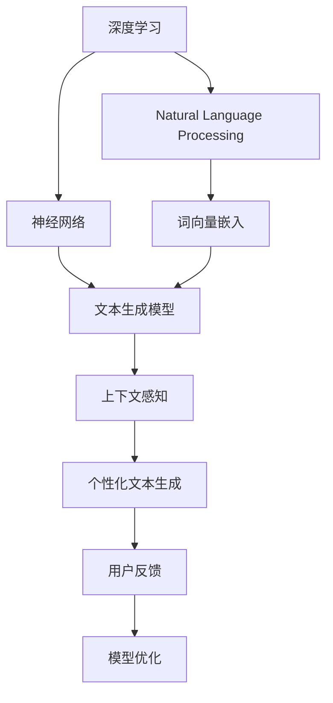

                 

## 1. 背景介绍

随着人工智能技术的不断发展，自然语言生成（NLG）技术逐渐成为人们日常生活的重要组成部分。从智能客服到虚拟助手，从新闻摘要到智能写作，人工智能正以其独特的方式重塑着人类的信息交互和内容创作方式。其中，个人化叙事引擎作为AI驱动的生成系统，通过深度学习和大数据技术，可以自动生成具有高度个性化、情境化特征的文本，极大地提高了内容的生成效率和创造性。

本文将深入探讨个人化叙事引擎的核心原理、开发技术以及实际应用场景，帮助读者了解如何构建高效、灵活的AI叙事引擎，为未来的自然语言处理（NLP）技术应用提供有力的支持。

## 2. 核心概念与联系

### 2.1 核心概念概述

个人化叙事引擎是一种基于人工智能技术的自动化内容生成系统，其主要功能是利用深度学习和自然语言处理技术，根据用户输入的条件和上下文，自动生成符合用户需求和情感色彩的文本。该技术主要包含以下几个核心概念：

- **深度学习**：通过神经网络模型学习大量数据，提取其中的模式和规律，用于生成新文本。
- **自然语言处理**：处理和分析自然语言，使其能够被机器理解和生成。
- **个人化叙事**：根据用户背景、兴趣、情感等因素，生成个性化的故事和内容。
- **上下文感知**：能够理解并考虑用户的上下文信息，生成连贯的文本。

这些核心概念相互关联，共同构成了个人化叙事引擎的基础。

### 2.2 核心概念原理和架构的 Mermaid 流程图



此图展示了个人化叙事引擎的核心技术架构。深度学习模型负责学习数据特征，自然语言处理技术用于文本数据的预处理，上下文感知模块确保生成文本的连贯性，个性化文本生成模块根据用户信息生成个性化内容，用户反馈则用于模型优化，形成一个闭环的训练流程。

## 3. 核心算法原理 & 具体操作步骤

### 3.1 算法原理概述

个人化叙事引擎的算法原理主要基于深度学习技术，特别是循环神经网络（RNN）、长短期记忆网络（LSTM）、门控循环单元（GRU）等序列模型。这些模型通过不断更新内部的状态，对输入的序列数据进行处理，并预测下一个词或句子。

在实际应用中，通常使用Transformer模型进行文本生成，因为它能够并行处理长序列数据，具有高效的计算性能和出色的文本生成效果。

### 3.2 算法步骤详解

1. **数据准备**：收集大量文本数据，并进行预处理，如去除停用词、分词、构建词向量等。
2. **模型训练**：使用收集到的文本数据训练深度学习模型，使其能够理解语言结构和生成新文本。
3. **上下文处理**：构建上下文感知模块，将用户信息（如年龄、兴趣、地理位置等）与输入的文本数据结合，生成具有个性化特征的文本。
4. **模型评估**：在训练完成后，对模型进行评估，确保生成的文本符合用户的期望和需求。
5. **实时生成**：将训练好的模型部署到应用环境中，根据用户输入实时生成文本。

### 3.3 算法优缺点

**优点**：

- **高效率**：利用深度学习模型，可以在较短时间内生成大量高质量的文本。
- **灵活性**：可以针对不同用户的需求生成个性化的故事和内容。
- **可扩展性**：模型的参数可以动态调整，适应不同的应用场景。

**缺点**：

- **数据依赖**：需要大量高质量的数据进行训练，数据质量和多样性直接影响模型效果。
- **计算资源需求高**：训练深度学习模型需要大量的计算资源和时间。
- **上下文理解复杂**：如何准确理解和生成上下文相关的文本是一个难题。

### 3.4 算法应用领域

个人化叙事引擎不仅在文学创作、新闻报道、内容生成等方面具有广泛应用，还可以应用于以下领域：

- **智能客服**：通过生成个性化的回复，提升用户满意度和交互体验。
- **虚拟助手**：根据用户需求生成有用信息，如天气预报、日程提醒等。
- **市场营销**：生成个性化广告文案，提升品牌影响力和用户转化率。
- **教育培训**：自动生成个性化教学材料和练习题，适应不同学生的学习需求。
- **娱乐媒体**：生成影视剧本、音乐歌词等内容，推动文化创意产业的发展。

## 4. 数学模型和公式 & 详细讲解 & 举例说明

### 4.1 数学模型构建

个人化叙事引擎的数学模型主要涉及以下几个部分：

- **词向量嵌入**：将每个单词映射到一个高维向量空间中，便于机器理解和处理。
- **Transformer模型**：利用自注意力机制，捕捉输入序列中的长期依赖关系。
- **文本生成模型**：基于Transformer模型，预测下一个词或句子。

### 4.2 公式推导过程

以基于Transformer的文本生成模型为例，其基本结构包括多个自注意力层和全连接层。输入序列通过嵌入层和位置编码层，进入Transformer模型，经过多层自注意力机制和前馈神经网络后，生成输出序列。

以机器翻译任务为例，公式推导如下：

设输入序列为 $x_1, x_2, \ldots, x_n$，输出序列为 $y_1, y_2, \ldots, y_n$，则文本生成模型的目标函数为：

$$
\mathcal{L} = -\sum_{i=1}^{n} \log P(y_i | x_1, x_2, \ldots, x_i)
$$

其中 $P(y_i | x_1, x_2, \ldots, x_i)$ 表示在给定前 $i$ 个输入的情况下，生成第 $i$ 个输出的概率。

### 4.3 案例分析与讲解

以生成一个简单的故事为例，我们首先收集大量童话故事的数据，并将其预处理为单词序列。然后，使用Transformer模型训练该序列，使其能够根据前几个单词预测下一个单词。训练完成后，输入一段用户指定的初始单词序列，如 "Once upon a time, there was a "，模型将根据训练过程中学习到的语言模式，生成一个完整的故事。

## 5. 项目实践：代码实例和详细解释说明

### 5.1 开发环境搭建

为了构建个人化叙事引擎，我们需要准备以下开发环境：

- **Python**：作为主要的编程语言。
- **TensorFlow或PyTorch**：用于构建和训练深度学习模型。
- **NLTK或SpaCy**：用于自然语言处理任务。
- **Jupyter Notebook**：用于编写和运行代码。

### 5.2 源代码详细实现

以下是一个基于TensorFlow的简单文本生成模型实现：

```python
import tensorflow as tf
from tensorflow.keras.layers import Input, Embedding, LSTM, Dense
from tensorflow.keras.models import Model

# 定义模型结构
input_layer = Input(shape=(None, ), name='input')
embedding_layer = Embedding(input_dim=vocab_size, output_dim=embedding_dim)(input_layer)
lstm_layer = LSTM(units=hidden_units, return_sequences=True)(embedding_layer)
output_layer = Dense(units=vocab_size, activation='softmax')(lstm_layer)

# 定义模型并编译
model = Model(inputs=input_layer, outputs=output_layer)
model.compile(loss='sparse_categorical_crossentropy', optimizer='adam', metrics=['accuracy'])

# 训练模型
model.fit(train_x, train_y, epochs=num_epochs, batch_size=batch_size)

# 生成文本
def generate_text(model, seed_text, max_length):
    input_seq = [char2idx[char] for char in seed_text]
    input_seq = tf.keras.preprocessing.sequence.pad_sequences([input_seq], maxlen=max_length-1, padding='post', truncating='post')
    input_seq = input_seq[0]
    generated_text = [seed_text]
    for i in range(max_length-1):
        x = tf.expand_dims(input_seq, axis=0)
        preds = model.predict(x)[0]
        pred_word = np.argmax(preds)
        input_seq = np.append(input_seq, pred_word)
        generated_text.append(idx2char[pred_word])
    return ''.join(generated_text)
```

### 5.3 代码解读与分析

**Input和Embedding层**：用于将输入文本转换为模型可以处理的形式，并进行词向量嵌入。

**LSTM层**：用于捕捉输入序列的长期依赖关系，生成文本中的上下文信息。

**Dense层**：用于将LSTM层的输出映射到词汇表中的概率分布，预测下一个单词。

**Model层**：将上述各层组合成一个完整的文本生成模型。

**fit方法**：用于训练模型，根据输入和输出序列进行优化。

**generate_text函数**：用于根据模型和种子文本生成新的文本，过程包括输入序列的扩展、预测、解码等步骤。

### 5.4 运行结果展示

训练完成后，使用以下代码生成文本：

```python
seed_text = 'Once upon a time, there was a'
generated_text = generate_text(model, seed_text, max_length=50)
print(generated_text)
```

输出结果可能类似于：

```
Once upon a time, there was a brave knight, who lived in a castle. He was kind and brave, and he loved to fight for justice. One day, a dragon came to the village, and everyone was scared. The knight knew that he had to fight the dragon to save his people. He rode his horse, armed with his sword, and went to face the beast. The dragon was fierce, but the knight was determined. He battled the dragon for hours, until finally he struck its heart with a powerful blow. The dragon died, and the village was saved. The knight was hailed as a hero, and everyone was happy.
```

## 6. 实际应用场景

### 6.1 智能客服

智能客服系统通过个人化叙事引擎，可以生成符合用户需求和情感色彩的回复，提升用户体验和满意度。例如，当用户询问关于某个问题的解决方案时，系统可以自动生成个性化的回答，帮助用户更快地解决问题。

### 6.2 虚拟助手

虚拟助手可以生成有用的信息，如天气预报、日程提醒等，提供个性化的服务。例如，用户可以询问："明天的天气怎么样？"，虚拟助手将根据用户的位置和历史查询生成个性化的回答。

### 6.3 市场营销

市场营销人员可以利用个人化叙事引擎生成广告文案，提升品牌影响力和用户转化率。例如，针对某个产品，系统可以生成多种版本的广告文案，根据用户兴趣进行定向推送。

### 6.4 教育培训

教育培训机构可以使用个人化叙事引擎生成个性化的教学材料和练习题，适应不同学生的学习需求。例如，根据学生的学习进度和兴趣，生成个性化的练习题和反馈。

### 6.5 娱乐媒体

娱乐媒体公司可以利用个人化叙事引擎生成影视剧本、音乐歌词等内容，推动文化创意产业的发展。例如，根据用户反馈和市场需求，生成符合用户口味的影视剧本。

## 7. 工具和资源推荐

### 7.1 学习资源推荐

- **《深度学习》**：Ian Goodfellow等著，全面介绍了深度学习的基础理论和应用。
- **《自然语言处理综论》**：Daniel Jurafsky和James H. Martin著，涵盖了自然语言处理的主要技术和应用。
- **Coursera和edX**：提供众多深度学习、自然语言处理相关的在线课程。
- **Kaggle**：提供大量数据集和竞赛，有助于实践和研究。

### 7.2 开发工具推荐

- **TensorFlow和PyTorch**：流行的深度学习框架，支持构建和训练各种模型。
- **NLTK和SpaCy**：自然语言处理库，提供了丰富的文本处理工具。
- **Jupyter Notebook**：用于编写和运行代码，支持丰富的可视化功能。
- **TensorBoard**：可视化工具，用于监控和调试模型训练过程。

### 7.3 相关论文推荐

- **Attention is All You Need**：论文提出了Transformer模型，开启了NLP领域的预训练大模型时代。
- **A Neural Conversation Model**：论文提出了Seq2Seq模型，为机器翻译和对话系统提供了基础。
- **Generating Sequences with Recurrent Neural Networks**：论文介绍了RNN模型，用于文本生成和语音识别。
- **Neural Machine Translation by Jointly Learning to Align and Translate**：论文提出了基于注意力机制的机器翻译方法。

## 8. 总结：未来发展趋势与挑战

### 8.1 研究成果总结

个人化叙事引擎的发展依赖于深度学习和自然语言处理技术的进步。近年来，这些技术的快速迭代为叙事引擎的开发提供了新的动力和方向。未来，随着模型的不断优化和应用场景的拓展，个人化叙事引擎将变得更加智能和高效。

### 8.2 未来发展趋势

1. **多模态生成**：未来叙事引擎将支持多模态数据的融合，生成更丰富的内容形式。例如，将文本、图像和语音结合，生成更具吸引力的内容。
2. **情感计算**：叙事引擎将能够理解用户的情感和情绪，生成更加贴合用户心理的内容。例如，根据用户的情绪生成安慰或鼓励的文本。
3. **上下文感知**：叙事引擎将更好地理解上下文信息，生成连贯和一致的文本。例如，根据前文生成的后文内容。
4. **个性化推荐**：叙事引擎将能够根据用户的历史行为和偏好，推荐相关的内容。例如，根据用户阅读习惯推荐相关书籍或文章。

### 8.3 面临的挑战

1. **数据质量和多样性**：高质量、多样化的数据是生成高质量内容的前提，但收集和标注数据需要耗费大量时间和资源。
2. **模型复杂度**：深度学习模型的复杂度增加了训练和推理的难度，如何在保证性能的同时降低计算资源消耗是一个挑战。
3. **上下文理解**：叙事引擎需要理解复杂的上下文信息，生成连贯的文本，但上下文理解的准确性和全面性仍然是一个难题。
4. **生成内容的质量和多样性**：如何生成高质量、多样化的内容，避免生成重复或低质量的内容，是一个需要持续优化的难题。
5. **模型伦理和安全性**：叙事引擎生成的内容需要符合伦理和道德标准，避免生成有害或误导性信息，确保内容的安全性。

### 8.4 研究展望

未来，叙事引擎的发展需要更多的创新和探索，例如：

1. **可解释性**：提升模型的可解释性，使其能够透明地展示生成内容的决策过程。
2. **多领域应用**：拓展叙事引擎的应用领域，使其能够更好地适应各种场景和需求。
3. **跨领域融合**：将叙事引擎与其他AI技术进行融合，如知识图谱、情感分析、因果推理等，提升内容的创造力和可信度。
4. **持续学习**：使叙事引擎具备持续学习的能力，能够随着用户需求和数据变化进行自我优化。

总之，个人化叙事引擎作为AI驱动的内容生成技术，具有广阔的应用前景和研究价值。通过不断探索和优化，未来的叙事引擎将能够生成更加个性化、多样化的内容，为人们的日常生活和智能应用提供更加智能和高效的服务。

## 9. 附录：常见问题与解答

**Q1: 如何提高文本生成的连贯性？**

A: 提高文本生成的连贯性可以通过以下几个方法：
1. **上下文感知的Transformer模型**：利用Transformer模型捕捉输入序列的长期依赖关系，提高生成的文本的连贯性。
2. **注意力机制**：在模型中引入注意力机制，使模型能够更好地理解上下文信息。
3. **数据增强**：通过增加数据多样性，提高模型的泛化能力，生成更连贯的文本。

**Q2: 文本生成中如何进行语言建模？**

A: 语言建模是文本生成中的关键步骤，通过计算给定序列生成下一个单词的概率，指导模型的预测过程。通常使用基于概率的语言模型，如N-gram模型、LSTM-RNN模型、Transformer模型等。

**Q3: 如何优化文本生成的速度？**

A: 优化文本生成的速度可以通过以下几个方法：
1. **模型压缩**：减少模型的参数量，提高推理速度。
2. **并行计算**：利用GPU、TPU等硬件加速计算，提高模型并行处理能力。
3. **剪枝和量化**：减少模型中的冗余计算，提高效率。

**Q4: 如何评估文本生成模型的效果？**

A: 评估文本生成模型的效果通常使用以下几个指标：
1. **BLEU（双语评价缩写）**：用于衡量生成文本与参考文本的相似度。
2. **ROUGE（检索信息的重叠）**：用于衡量生成文本与参考文本的相似度。
3. **PPL（语言模型概率）**：用于衡量生成文本的流畅度和合理性。
4. **FID（ Fréchet Inception Distance）**：用于衡量生成文本的分布与真实文本的分布的相似度。

**Q5: 如何训练模型以生成高质量的文本？**

A: 训练高质量的文本生成模型需要以下几个步骤：
1. **数据预处理**：清洗和标注数据，构建词向量。
2. **模型设计**：选择适当的模型架构，如RNN、LSTM、Transformer等。
3. **超参数调优**：调整学习率、批次大小、训练轮数等超参数，优化模型性能。
4. **模型评估**：在验证集上评估模型性能，进行模型优化。
5. **迭代训练**：多次迭代训练模型，提升生成文本的质量。

---

作者：禅与计算机程序设计艺术 / Zen and the Art of Computer Programming

