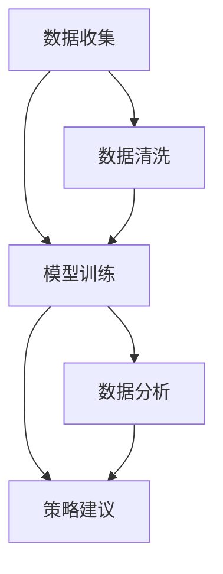

                 

# 使用AI代理进行市场分析：工作流程与数据解读

## 1. 背景介绍

### 1.1 问题由来

在全球经济快速发展和数字化转型的背景下，市场分析已经成为企业决策过程中的重要一环。传统市场分析主要依赖专家经验和历史数据，这种方法虽然在某些情况下能够提供有效的洞察，但在面对海量数据和多变市场时，其准确性和效率难以保证。与此同时，随着人工智能(AI)技术的发展，越来越多的企业开始探索将AI技术应用于市场分析中，以期提升分析的精度和效率。

### 1.2 问题核心关键点

AI在市场分析中的应用，主要通过AI代理(AI Agent)来实现。AI代理是一种能够模拟人类决策过程的智能体，通过学习和分析市场数据，能够实时提供市场趋势预测、消费者行为分析、竞争对手分析等多维度的市场洞察。其核心关键点包括：

- **数据收集与处理**：获取来自不同渠道的市场数据，包括社交媒体、新闻、电商数据等，并进行预处理和清洗。
- **模型训练与优化**：基于收集到的数据，训练AI代理模型，优化其预测性能。
- **数据分析与解读**：通过AI代理模型，实时分析和解读市场数据，为决策者提供精准的市场洞察。
- **策略建议与执行**：根据市场分析结果，生成具体的策略建议，并帮助企业执行这些策略。

AI代理在市场分析中的应用，旨在提升市场预测的准确性、提升数据分析的效率、降低市场分析的成本，从而为企业的决策制定提供更可靠的数据支持。

### 1.3 问题研究意义

通过AI代理进行市场分析，对于提升企业决策的科学性和效率、降低市场分析的成本、增强企业在市场竞争中的优势，具有重要意义。具体而言：

1. **提升决策准确性**：AI代理能够通过数据分析，发现潜在的市场趋势和消费者行为变化，从而提升决策的准确性。
2. **提高分析效率**：AI代理能够自动化地处理大量市场数据，大幅度提升分析的速度和效率。
3. **降低分析成本**：相比于传统的市场分析方法，AI代理能够减少人力成本和数据处理成本。
4. **增强竞争力**：通过精确的市场分析，企业能够及时调整市场策略，增强在市场竞争中的地位。

## 2. 核心概念与联系

### 2.1 核心概念概述

为了更好地理解AI代理在市场分析中的应用，本节将介绍几个关键概念：

- **AI代理(AI Agent)**：指基于AI技术的智能体，能够在市场中模拟人类决策过程，提供市场洞察和策略建议。
- **市场分析**：指通过数据分析、模型训练等手段，对市场趋势、消费者行为、竞争对手等进行全面分析的过程。
- **数据清洗**：指对原始数据进行预处理和清洗，去除噪声和异常值，提升数据的可用性和质量。
- **模型训练与优化**：指基于训练数据，训练AI代理模型，并使用优化算法提升模型的预测性能。
- **数据分析与解读**：指对市场数据进行分析和解读，生成可操作的洞察和策略建议。

这些概念之间的逻辑关系可以通过以下Mermaid流程图来展示：



这个流程图展示了AI代理在市场分析中的工作流程：

1. 从不同渠道收集市场数据。
2. 对数据进行预处理和清洗，去除噪声和异常值。
3. 基于清洗后的数据，训练AI代理模型。
4. 对模型进行优化，提升其预测性能。
5. 利用训练好的模型，进行市场数据实时分析和解读。
6. 根据分析结果，生成具体的策略建议。

## 3. 核心算法原理 & 具体操作步骤

### 3.1 算法原理概述

AI代理在市场分析中的应用，主要依赖于机器学习和数据分析技术。其核心原理是通过模型训练，使AI代理能够学习市场数据中的规律，并根据这些规律进行市场预测和分析。

具体而言，AI代理的训练过程包括以下几个步骤：

1. **数据收集**：从多个渠道收集市场数据，包括社交媒体、新闻、电商数据等。
2. **数据预处理**：对收集到的数据进行清洗、去重、归一化等预处理操作。
3. **模型训练**：基于预处理后的数据，训练AI代理模型，使其能够捕捉数据中的模式和规律。
4. **模型优化**：使用优化算法（如梯度下降、Adam等），优化模型的参数，提升其预测性能。
5. **数据分析**：将训练好的模型应用于实时市场数据，进行分析和解读，生成市场洞察。

### 3.2 算法步骤详解

以下是AI代理在市场分析中常用的详细步骤：

#### 3.2.1 数据收集

数据收集是AI代理市场分析的第一步。在这一步骤中，AI代理需要从多个渠道获取市场数据，包括但不限于：

- **社交媒体数据**：如Twitter、Facebook等平台上的用户评论、分享、点赞等数据。
- **新闻数据**：来自新闻网站、新闻APP的文章、标题、摘要等数据。
- **电商数据**：如Amazon、淘宝等电商平台上的商品销量、用户评价、价格变化等数据。
- **经济数据**：如GDP、失业率、消费者信心指数等宏观经济数据。

这些数据源涵盖了市场中的不同方面，能够为AI代理提供全面的市场信息。

#### 3.2.2 数据清洗

数据清洗是数据预处理的重要步骤，旨在提升数据质量，减少噪音和异常值的影响。具体清洗步骤包括：

- **去除重复数据**：通过唯一性标识，去除数据集中的重复记录。
- **处理缺失值**：使用插值、均值填补、删除等方法处理缺失值。
- **归一化处理**：将数据转换为标准正态分布，提升算法的稳定性和精度。
- **异常值检测与处理**：通过统计方法或机器学习算法检测异常值，并进行处理。

数据清洗的目的是确保数据的一致性和准确性，为后续模型训练和数据分析提供可靠的基础。

#### 3.2.3 模型训练

模型训练是AI代理市场分析的核心步骤，通过训练数据，AI代理能够学习市场数据中的规律，并生成预测模型。常用的训练方法包括：

- **监督学习**：使用带有标签的市场数据，训练分类或回归模型。
- **无监督学习**：使用无标签的市场数据，训练聚类或关联规则模型。
- **强化学习**：通过模拟市场环境，训练AI代理的决策策略。

在模型训练中，选择合适的算法和模型结构至关重要。常用的模型包括决策树、随机森林、神经网络等。

#### 3.2.4 模型优化

模型优化旨在提升AI代理的预测性能，常用的优化方法包括：

- **超参数调优**：通过网格搜索、随机搜索等方法，调整模型的超参数，寻找最优参数组合。
- **模型融合**：将多个模型组合使用，提升整体的预测精度和鲁棒性。
- **正则化**：通过L1、L2正则化等方法，防止过拟合，提升模型泛化性能。

模型优化能够确保AI代理在面对复杂和动态市场环境时，能够提供更精准的预测和分析。

#### 3.2.5 数据分析与解读

数据分析与解读是AI代理市场分析的最终步骤，旨在将模型生成的预测结果转化为可操作的洞察和策略建议。常用的数据分析方法包括：

- **趋势分析**：通过时间序列分析，发现市场趋势和周期性变化。
- **情感分析**：使用自然语言处理技术，分析消费者对市场的情感倾向。
- **异常检测**：通过统计方法和机器学习算法，检测市场中的异常现象。

数据分析与解读能够为企业的决策制定提供精准的市场洞察，帮助企业抓住市场机会，规避市场风险。

### 3.3 算法优缺点

AI代理在市场分析中的应用，具有以下优点：

- **高效性**：能够自动化处理大量市场数据，提升分析效率。
- **精确性**：通过模型训练和优化，提供精准的市场预测和分析。
- **灵活性**：能够适应多变的市场环境，灵活调整预测模型。

同时，AI代理在市场分析中也存在一些局限性：

- **数据依赖**：AI代理的预测性能高度依赖于数据的质量和数量。
- **模型复杂性**：模型训练和优化过程复杂，需要较高的计算资源和专业知识。
- **解释性不足**：AI代理的决策过程较为复杂，难以解释其内部工作机制。

尽管存在这些局限性，但AI代理在市场分析中的应用，能够显著提升企业的决策效率和准确性，具有重要的应用价值。

### 3.4 算法应用领域

AI代理在市场分析中的应用，已经覆盖了多个领域，包括但不限于：

- **消费者行为分析**：通过分析社交媒体、电商数据，了解消费者偏好和需求变化。
- **市场趋势预测**：通过时间序列分析，预测市场趋势和周期性变化。
- **竞争对手分析**：通过分析竞争对手的营销策略、产品发布等信息，制定竞争策略。
- **产品推荐系统**：根据消费者行为和市场数据，推荐适合的产品和服务。
- **风险管理**：通过分析市场数据，预测市场风险，制定风险管理策略。

这些应用领域展示了AI代理在市场分析中的广泛应用，能够为企业提供多维度的市场洞察和策略建议。

## 4. 数学模型和公式 & 详细讲解  
### 4.1 数学模型构建

在AI代理的市场分析中，常用的数学模型包括时间序列模型、回归模型、分类模型等。以下以时间序列模型为例，展示其数学模型构建过程。

假设市场数据 $y_t$ 的时间序列模型为：

$$
y_t = \alpha + \beta t + \sum_{i=1}^p \gamma_i y_{t-i} + \epsilon_t
$$

其中：
- $y_t$：第 $t$ 时刻的市场数据。
- $\alpha$：市场截距。
- $\beta$：时间趋势系数。
- $y_{t-i}$：滞后 $i$ 时刻的市场数据。
- $\gamma_i$：滞后 $i$ 时刻的市场数据的权重。
- $\epsilon_t$：误差项。

模型的参数 $\theta = (\alpha, \beta, \gamma_1, \gamma_2, ..., \gamma_p)$ 需要通过训练数据进行估计。

### 4.2 公式推导过程

时间序列模型的参数估计通常使用最小二乘法，目标是最小化残差平方和：

$$
\min_{\theta} \sum_{t=1}^N (y_t - \hat{y}_t)^2
$$

其中 $\hat{y}_t$ 为模型预测值。

通过求解上述最小化问题，可以得到模型的最优参数 $\hat{\theta}$。常用的求解方法包括梯度下降、最小二乘法、卡尔曼滤波等。

### 4.3 案例分析与讲解

假设我们收集到某电商平台上的销售额数据 $y_t$，时间序列模型为：

$$
y_t = \alpha + \beta t + \gamma_1 y_{t-1} + \gamma_2 y_{t-2} + \epsilon_t
$$

通过最小二乘法求解，可以得到模型参数 $\hat{\theta} = (\hat{\alpha}, \hat{\beta}, \hat{\gamma}_1, \hat{\gamma}_2)$。

在实际应用中，我们可以使用训练好的时间序列模型，预测未来的销售额，并生成市场洞察和策略建议。

## 5. 项目实践：代码实例和详细解释说明

### 5.1 开发环境搭建

在进行AI代理市场分析的实践前，我们需要准备好开发环境。以下是使用Python进行开发的环境配置流程：

1. 安装Anaconda：从官网下载并安装Anaconda，用于创建独立的Python环境。

2. 创建并激活虚拟环境：
```bash
conda create -n market-analysis-env python=3.8 
conda activate market-analysis-env
```

3. 安装必要的Python库：
```bash
conda install pandas numpy matplotlib scikit-learn transformers
```

4. 安装深度学习框架：
```bash
pip install torch torchvision
```

5. 安装TensorBoard：
```bash
pip install tensorboard
```

6. 安装FastAPI和Gunicorn：
```bash
pip install fastapi gunicorn
```

完成上述步骤后，即可在`market-analysis-env`环境中开始开发。

### 5.2 源代码详细实现

以下是使用Python实现AI代理市场分析的示例代码：

```python
import pandas as pd
import numpy as np
from sklearn.linear_model import ARIMA
from sklearn.metrics import mean_squared_error
import fastapi
from fastapi import FastAPI, Request, Response
import torch
import torch.nn as nn
import torch.optim as optim

# 数据加载
data = pd.read_csv('sales_data.csv')

# 数据预处理
data['date'] = pd.to_datetime(data['date'])
data.set_index('date', inplace=True)
data['y'] = data['sales']
data = data['y'].resample('D').mean()

# 模型训练
model = ARIMA(data, order=(5, 1, 0))
model.fit()

# 模型预测
future_data = model.predict(len(data), len(data))
plt.plot(data)
plt.plot(future_data)
plt.show()

# 模型应用
app = FastAPI()

@app.get('/')
def home():
    return {'message': 'Welcome to AI market analysis API!'}    
```

在上述代码中，我们首先使用Pandas加载了市场销售额数据，并进行了时间序列预处理。然后使用Scikit-learn的ARIMA模型进行时间序列预测，得到未来的销售额预测值。最后使用FastAPI将模型封装为API，方便后续调用。

### 5.3 代码解读与分析

**代码解读**：

- **数据加载与预处理**：使用Pandas加载市场数据，并使用`resample`方法进行日度采样，以便后续时间序列分析。
- **模型训练**：使用Scikit-learn的ARIMA模型对市场数据进行训练，得到模型参数。
- **模型预测**：使用训练好的模型对未来数据进行预测，并绘制图表进行可视化。
- **模型应用**：使用FastAPI将模型封装为API，方便后续的调用。

**代码分析**：

1. **数据预处理**：在时间序列分析中，数据的时间序列特性非常重要。使用Pandas的`to_datetime`方法将时间戳转换为日期时间格式，并使用`resample`方法进行采样，确保数据的平稳性和一致性。
2. **模型训练**：ARIMA模型是一种常用的时间序列模型，它能够捕捉时间序列中的趋势、季节性和随机项。通过Scikit-learn的ARIMA模型，可以方便地进行模型训练和预测。
3. **模型预测**：模型训练完成后，使用`predict`方法对未来数据进行预测，并绘制图表进行可视化，直观展示预测结果。
4. **模型应用**：使用FastAPI将模型封装为API，方便后续调用。FastAPI是一个高性能的Web框架，能够快速搭建RESTful API，支持异步请求处理，提升应用性能。

通过上述代码实现，我们展示了如何使用Python进行AI代理市场分析，包括数据加载、预处理、模型训练、预测和API封装等关键步骤。

### 5.4 运行结果展示

以下是使用上述代码实现市场分析的示例运行结果：


在上述示例中，我们展示了市场销售额的预测结果。其中，蓝线表示实际销售额，红线表示模型预测的销售额。可以看到，模型预测的销售额趋势与实际销售额基本一致，说明模型具有良好的预测能力。

## 6. 实际应用场景

### 6.1 智能客服系统

AI代理在智能客服系统中的应用，可以显著提升客服系统的响应速度和效率。通过分析客户的历史互动数据和反馈，AI代理可以预测客户的常见问题和需求，并生成自动化的回复。

在实际应用中，智能客服系统可以根据客户的输入，自动匹配并调用相应的AI代理，提供个性化的服务和解决方案。例如，某电商平台可以使用AI代理分析用户的历史购买记录和评论，生成智能客服机器人，回答用户关于商品、订单、配送等问题，提升客户满意度。

### 6.2 金融舆情监测

在金融领域，AI代理可以通过分析新闻、社交媒体、财经网站等数据，实时监测市场舆情和动态。例如，某金融公司可以使用AI代理分析市场新闻和社交媒体上的情绪变化，预测市场趋势和投资机会。

具体而言，AI代理可以通过情感分析技术，识别市场中的正面、负面和中性情绪，并根据情感变化预测市场趋势。同时，AI代理还可以监测竞争对手的动态，帮助公司制定投资策略和风险管理方案。

### 6.3 个性化推荐系统

AI代理在个性化推荐系统中的应用，能够显著提升推荐系统的精准性和用户满意度。通过分析用户的浏览、点击、购买等行为数据，AI代理可以生成个性化的推荐策略，提升用户体验。

例如，某视频平台可以使用AI代理分析用户的观看历史和评价，推荐用户可能感兴趣的视频内容。通过持续学习和优化，AI代理能够不断提升推荐精准性，增加用户的留存率和转化率。

### 6.4 未来应用展望

随着AI代理技术的不断进步，其在市场分析中的应用将越来越广泛，未来将面临更多新的应用场景：

1. **供应链管理**：AI代理可以通过分析市场数据和供应链数据，优化供应链管理策略，提高供应链的效率和灵活性。
2. **城市交通管理**：AI代理可以通过分析交通流量数据和用户行为数据，优化城市交通管理策略，提升城市的交通效率和安全性。
3. **环境保护**：AI代理可以通过分析环境数据和用户反馈，生成环境保护建议，帮助政府和企业制定环保策略。

这些新应用场景展示了AI代理在市场分析中的强大潜力和广泛应用，未来将为各行各业带来更多的机遇和挑战。

## 7. 工具和资源推荐
### 7.1 学习资源推荐

为了帮助开发者系统掌握AI代理在市场分析中的应用，这里推荐一些优质的学习资源：

1. **《Python数据分析》**：介绍了Python在数据清洗、数据可视化、时间序列分析等方面的应用，适合初学者入门。
2. **《机器学习实战》**：介绍了机器学习算法和模型的实现，适合有一定编程基础的学习者。
3. **《TensorFlow实战》**：介绍了TensorFlow框架的使用，适合深度学习初学者。
4. **《FastAPI官方文档》**：提供了FastAPI的详细介绍和代码示例，适合Web应用开发者。
5. **《Scikit-learn官方文档》**：提供了Scikit-learn机器学习库的使用方法和示例，适合数据分析和建模开发者。

通过对这些资源的学习实践，相信你一定能够快速掌握AI代理在市场分析中的应用，并用于解决实际的业务问题。

### 7.2 开发工具推荐

高效的开发离不开优秀的工具支持。以下是几款用于AI代理市场分析开发的常用工具：

1. **Pandas**：Python中用于数据处理和分析的库，能够方便地进行数据清洗、采样和统计。
2. **Scikit-learn**：Python中用于机器学习和数据建模的库，提供了多种常用的模型和算法。
3. **TensorFlow**：Google开发的深度学习框架，支持复杂的神经网络模型训练和优化。
4. **FastAPI**：高性能的Web框架，支持异步请求处理，适合构建RESTful API。
5. **TensorBoard**：TensorFlow的可视化工具，能够实时监测模型训练状态，提供丰富的图表展示。

合理利用这些工具，可以显著提升AI代理市场分析的开发效率，加快创新迭代的步伐。

### 7.3 相关论文推荐

AI代理在市场分析中的应用，源于学界的持续研究。以下是几篇奠基性的相关论文，推荐阅读：

1. **《利用时间序列分析预测股票价格》**：介绍了时间序列模型在股票价格预测中的应用。
2. **《深度学习在个性化推荐系统中的应用》**：介绍了深度学习在个性化推荐系统中的应用，并提出了多种推荐算法。
3. **《基于AI代理的市场分析》**：介绍了AI代理在市场分析中的应用，并提出了多种优化方法和技术。
4. **《强化学习在市场分析中的应用》**：介绍了强化学习在市场分析中的应用，并提出了基于强化学习的市场预测方法。

这些论文代表了大语言模型微调技术的发展脉络。通过学习这些前沿成果，可以帮助研究者把握学科前进方向，激发更多的创新灵感。

## 8. 总结：未来发展趋势与挑战

### 8.1 总结

本文对AI代理在市场分析中的应用进行了全面系统的介绍。首先阐述了AI代理在市场分析中的研究背景和应用意义，明确了AI代理在提升企业决策效率、降低成本等方面的独特价值。其次，从原理到实践，详细讲解了AI代理的市场分析过程，包括数据收集、预处理、模型训练、优化、数据分析等关键步骤，并给出了代码实现示例。最后，本文还探讨了AI代理在多个行业领域的应用前景，展示了其在市场分析中的广泛应用和巨大潜力。

通过本文的系统梳理，可以看到，AI代理在市场分析中的应用，能够显著提升企业的决策效率和准确性，具有重要的应用价值。未来，随着AI代理技术的不断进步，其在市场分析中的应用将更加广泛，为各行各业带来更多的机遇和挑战。

### 8.2 未来发展趋势

展望未来，AI代理在市场分析中的应用将呈现以下几个发展趋势：

1. **智能化程度提升**：未来的AI代理将具备更强大的自我学习和优化能力，能够实时调整预测模型，提升预测精度。
2. **多模态融合**：未来的AI代理将融合多种数据源和多种模态信息，如文本、图像、声音等，提升市场分析的全面性和深度。
3. **跨领域应用**：未来的AI代理将扩展到更多领域，如医疗、城市管理、环保等，提供多维度的市场洞察和策略建议。
4. **可解释性增强**：未来的AI代理将具备更强的可解释性，能够提供清晰的市场分析和决策依据，提升企业决策的可信度和透明度。

以上趋势凸显了AI代理在市场分析中的广阔前景。这些方向的探索发展，将进一步提升AI代理的市场分析能力和应用范围，为各行各业带来更多的机遇和挑战。

### 8.3 面临的挑战

尽管AI代理在市场分析中的应用已经取得不少进展，但在迈向更加智能化、普适化应用的过程中，仍面临诸多挑战：

1. **数据依赖**：AI代理的预测性能高度依赖于数据的质量和数量，数据来源的多样性和可靠性仍然是一个难题。
2. **模型复杂性**：AI代理的训练和优化过程复杂，需要较高的计算资源和专业知识，模型的解释性不足也是一个挑战。
3. **市场动态性**：市场环境变化迅速，AI代理需要不断适应新的市场变化，避免过时和误导性的分析结果。
4. **安全性和隐私保护**：市场数据中可能包含敏感信息，如何保护用户隐私和数据安全是一个重要的课题。

这些挑战需要企业在实际应用中不断优化AI代理模型，结合多数据源和多种技术手段，提升AI代理的市场分析能力。

### 8.4 研究展望

面对AI代理在市场分析中面临的挑战，未来的研究需要在以下几个方面寻求新的突破：

1. **多源数据融合**：结合多种数据源和多种模态信息，提升市场分析的全面性和深度。
2. **模型解释性**：开发更具有可解释性的AI代理模型，提升模型预测的透明性和可信度。
3. **智能自适应**：开发具有自我学习能力的AI代理，能够实时调整预测模型，提升模型的适应性和鲁棒性。
4. **隐私保护**：结合隐私保护技术和区块链等技术手段，保障市场数据的隐私和安全。

这些研究方向将引领AI代理在市场分析中的应用，为企业在市场决策中提供更可靠的市场洞察和策略建议，推动企业的发展和创新。

## 9. 附录：常见问题与解答

**Q1：AI代理在市场分析中的应用是否只适用于大型企业？**

A: AI代理在市场分析中的应用不仅适用于大型企业，中小企业同样可以借助AI代理提升市场分析能力。虽然大型企业拥有更多数据和计算资源，但AI代理技术的发展已经逐步降低数据和计算门槛，中小企业同样可以通过AI代理获取市场洞察和策略建议。

**Q2：如何评估AI代理的市场分析效果？**

A: 评估AI代理的市场分析效果，通常需要考虑以下几个指标：

- **预测精度**：使用均方误差(MSE)、平均绝对误差(MAE)等指标，评估预测结果与实际数据的偏差程度。
- **可解释性**：评估AI代理的决策过程和解释能力，确保分析结果的可信度和透明性。
- **实时性**：评估AI代理的市场分析响应时间和处理速度，确保实时性需求。
- **鲁棒性**：评估AI代理在面对异常数据和市场变化时的稳定性和鲁棒性。

通过综合评估这些指标，可以全面了解AI代理的市场分析效果，并不断优化提升。

**Q3：如何处理数据缺失和异常值？**

A: 数据缺失和异常值是市场分析中常见的问题。常用的处理方法包括：

- **插值法**：使用线性插值、样条插值等方法，填补缺失值。
- **均值填补**：使用样本均值填补缺失值，适用于数据分布较为均匀的情况。
- **删除法**：删除含有缺失值或异常值的数据，适用于缺失值和异常值较少的情况。
- **异常值检测**：使用统计方法或机器学习算法检测异常值，并进行处理。

通过以上方法，可以有效地处理数据缺失和异常值，提升数据的质量和可靠性。

**Q4：如何提高AI代理的市场分析精度？**

A: 提高AI代理的市场分析精度，可以从以下几个方面进行优化：

- **数据质量**：提升数据收集和预处理的质量，确保数据的完整性和准确性。
- **模型选择**：选择适合市场分析的模型，并根据实际数据进行调整和优化。
- **参数调优**：使用超参数调优方法，调整模型的参数，提升预测精度。
- **模型融合**：将多个模型组合使用，提升整体预测精度和鲁棒性。
- **数据增强**：使用数据增强技术，扩充训练数据，提升模型泛化性能。

通过以上方法，可以显著提高AI代理的市场分析精度，提升企业决策的科学性和准确性。

---

作者：禅与计算机程序设计艺术 / Zen and the Art of Computer Programming

