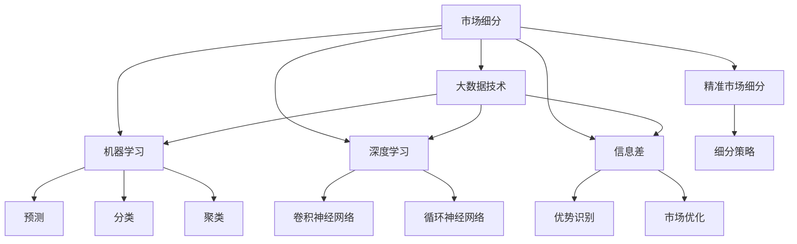

                 

# 信息差的商业市场细分：大数据如何实现精准市场细分

## 1. 背景介绍

### 1.1 问题由来
在商业领域，市场细分一直是营销策略的核心。精准的市场细分不仅能帮助企业更有效地识别目标客户，还能提供更有针对性的营销策略，从而提高市场效率和收益。然而，传统市场细分方法依赖于调查问卷、市场调研等手段，这些方法不仅耗时耗力，而且结果往往受制于调查设计、样本选择、数据质量等多种因素，难以获得准确、全面的市场洞察。

面对日益复杂的商业环境和不断变化的市场需求，如何更高效、更精确地进行市场细分，成为每个企业都亟需解决的挑战。随着大数据和人工智能技术的飞速发展，数据驱动的市场细分方法逐渐成为新的发展趋势。通过大数据技术，企业能够从海量数据中挖掘出更多的市场信息，实现更精准的市场细分，提升商业决策的科学性和有效性。

### 1.2 问题核心关键点
数据驱动的市场细分方法，主要依托于对客户行为、交易数据、社交媒体、地理位置等多种数据的综合分析，从中挖掘出有价值的市场特征和细分群体。这种基于大数据的市场细分方法，相较于传统方法，具有以下核心优势：

1. **数据量庞大**：大数据技术能够处理和分析海量数据，从中发现难以人工发现的市场规律和趋势。
2. **实时更新**：大数据方法能够实时更新市场数据，跟踪市场变化，及时调整市场策略。
3. **多维度分析**：大数据技术支持多维度数据整合，能够从不同角度分析市场特征，提供更全面的市场洞察。
4. **高准确性**：基于大数据的市场细分方法，能够更准确地识别目标客户群体，提高市场策略的精准性。

但同时，这种基于大数据的市场细分方法也面临一些挑战：

1. **数据隐私**：处理海量数据时，如何保护客户隐私和数据安全，是一个重要问题。
2. **数据质量**：数据来源多样，数据质量参差不齐，如何确保数据的一致性和准确性，是一个关键挑战。
3. **计算复杂度**：大数据分析需要处理大规模数据集，计算复杂度高，如何提高分析效率，是一个重要问题。

本文将详细探讨如何通过大数据技术实现精准的市场细分，并从技术、应用、挑战三个方面进行系统分析。

## 2. 核心概念与联系

### 2.1 核心概念概述

为更好地理解大数据在市场细分中的作用，本节将介绍几个核心概念：

- **市场细分**：将市场划分为若干个具有相似需求和特征的子市场，以便更有针对性地制定营销策略。
- **大数据技术**：包括数据采集、数据存储、数据处理和数据分析等技术，能够处理和分析海量数据，从中挖掘出有价值的信息。
- **机器学习**：通过算法模型从数据中学习规律，进行预测、分类、聚类等任务，支持更精确的市场细分。
- **深度学习**：一种特殊的机器学习技术，通过多层神经网络模型，可以从数据中学习更复杂、更抽象的特征。
- **信息差**：指信息获取的不对称性，即部分人掌握了更有价值的信息，导致其在市场中处于有利地位。
- **精准市场细分**：基于大数据和机器学习等技术，实现更精确、更全面的市场划分，以便更有效地制定营销策略。

这些概念之间的逻辑关系可以通过以下Mermaid流程图来展示：



这个流程图展示了大数据技术在市场细分中的应用框架：

1. 市场细分通过大数据技术进行数据采集和处理。
2. 机器学习模型对数据进行预测、分类、聚类等任务。
3. 深度学习模型从数据中学习更复杂、更抽象的特征。
4. 信息差识别和市场优化，帮助更精确地制定细分策略。
5. 精准市场细分将多种技术相结合，实现更全面的市场划分。

这些核心概念共同构成了大数据技术在市场细分中的应用框架，使其能够从海量数据中挖掘出更多的市场信息，实现更精准的市场细分。

## 3. 核心算法原理 & 具体操作步骤
### 3.1 算法原理概述

大数据技术在市场细分中的应用，主要是通过数据挖掘和机器学习算法，从数据中发现和提取市场特征，进而实现市场细分。其核心原理可以概括为以下几个步骤：

1. **数据采集**：收集客户行为数据、交易数据、社交媒体数据、地理位置数据等多种数据源，构建全面的数据集。
2. **数据预处理**：对数据进行清洗、去重、归一化等预处理操作，确保数据质量和一致性。
3. **特征提取**：从预处理后的数据中提取有意义的特征，如用户行为特征、交易特征、社交特征等。
4. **模型训练**：使用机器学习模型，如聚类算法、分类算法、关联规则算法等，对数据进行训练，识别出市场细分群体。
5. **结果评估**：对训练好的模型进行评估，确保分类的准确性和有效性。
6. **市场策略调整**：根据市场细分结果，制定和调整营销策略，实现精准的市场细分。

### 3.2 算法步骤详解

以下是具体的市场细分操作步骤：

**Step 1: 数据采集**

数据采集是市场细分的第一步，也是最重要的一步。数据来源包括客户行为数据、交易数据、社交媒体数据、地理位置数据等。

- **客户行为数据**：包括客户的浏览记录、购买记录、搜索记录等，反映客户的兴趣和需求。
- **交易数据**：包括客户的购买记录、支付记录、交易金额等，反映客户的购买力和消费习惯。
- **社交媒体数据**：包括客户的社交网络信息、发布内容、互动行为等，反映客户的社交属性和兴趣。
- **地理位置数据**：包括客户的地理位置信息、地理特征等，反映客户的地理特征和行为特征。

可以使用爬虫技术从各种数据源收集数据，同时确保数据的实时性和可靠性。

**Step 2: 数据预处理**

数据预处理包括数据清洗、去重、归一化、特征提取等步骤，以确保数据质量和一致性。

- **数据清洗**：去除重复数据、错误数据、缺失数据等，确保数据完整性和准确性。
- **数据去重**：通过去重算法，去除数据中的冗余部分，减少数据量，提高处理效率。
- **数据归一化**：将不同来源的数据进行归一化处理，统一数据格式和范围，方便后续分析。
- **特征提取**：从预处理后的数据中提取有意义的特征，如用户行为特征、交易特征、社交特征等。

使用Python、R等编程语言，结合Pandas、NumPy等数据分析工具，可以高效地完成数据预处理。

**Step 3: 特征工程**

特征工程是将原始数据转换为有意义的特征，以便机器学习模型能够更好地识别和分类。

- **用户行为特征**：包括客户的浏览频率、购买频率、搜索关键词等，反映客户的兴趣和需求。
- **交易特征**：包括客户的消费金额、购买渠道、购买时间等，反映客户的购买力和消费习惯。
- **社交特征**：包括客户的社交网络信息、发布内容、互动行为等，反映客户的社交属性和兴趣。
- **地理位置特征**：包括客户的地理位置信息、地理特征等，反映客户的地理特征和行为特征。

通过特征工程，可以从原始数据中提取有价值的特征，供机器学习模型使用。

**Step 4: 模型训练**

模型训练是市场细分的核心步骤，主要使用机器学习算法，从数据中识别和分类市场细分群体。

- **聚类算法**：如K-means、层次聚类、DBSCAN等，通过对数据进行聚类，识别出具有相似特征的客户群体。
- **分类算法**：如逻辑回归、决策树、随机森林等，通过对数据进行分类，识别出不同的客户群体。
- **关联规则算法**：如Apriori算法、FP-growth算法等，通过对数据进行关联分析，识别出客户之间的关联行为。

使用Scikit-learn、TensorFlow等机器学习库，可以高效地完成模型训练。

**Step 5: 结果评估**

结果评估是验证模型效果的重要步骤，主要通过以下指标进行评估：

- **精确率**：预测为正例的样本中，实际为正例的比例。
- **召回率**：实际为正例的样本中，被预测为正例的比例。
- **F1值**：精确率和召回率的调和平均数，综合评估模型效果。
- **AUC值**：ROC曲线下的面积，用于评估分类器的性能。

使用Python的Evaluate Metrics库，可以方便地进行结果评估。

**Step 6: 市场策略调整**

市场策略调整是根据市场细分结果，制定和调整营销策略，实现精准的市场细分。

- **细分策略**：根据市场细分结果，制定有针对性的营销策略，如产品推荐、广告投放等。
- **策略优化**：根据市场反馈，调整和优化营销策略，提高市场效果。
- **效果评估**：对营销策略的效果进行评估，确保策略的有效性。

通过市场策略调整，可以更有效地识别和满足客户需求，提升市场效率和收益。

### 3.3 算法优缺点

大数据技术在市场细分中的应用，具有以下优点：

1. **数据量大**：大数据技术可以处理和分析海量数据，从中发现更多市场特征和趋势。
2. **实时更新**：大数据方法能够实时更新市场数据，跟踪市场变化，及时调整市场策略。
3. **多维度分析**：大数据技术支持多维度数据整合，能够从不同角度分析市场特征，提供更全面的市场洞察。
4. **高准确性**：基于大数据的市场细分方法，能够更准确地识别目标客户群体，提高市场策略的精准性。

但同时，这种基于大数据的市场细分方法也面临一些挑战：

1. **数据隐私**：处理海量数据时，如何保护客户隐私和数据安全，是一个重要问题。
2. **数据质量**：数据来源多样，数据质量参差不齐，如何确保数据的一致性和准确性，是一个关键挑战。
3. **计算复杂度**：大数据分析需要处理大规模数据集，计算复杂度高，如何提高分析效率，是一个重要问题。

## 4. 数学模型和公式 & 详细讲解  
### 4.1 数学模型构建

本节将使用数学语言对大数据在市场细分中的应用进行更加严格的刻画。

记市场细分结果为 $G=\{g_1,g_2,...,g_k\}$，其中 $g_i$ 表示第 $i$ 个细分市场，$k$ 表示市场数量。定义市场特征向量 $X=\{x_1,x_2,...,x_n\}$，其中 $x_i$ 表示第 $i$ 个市场特征。

市场细分的目标是通过训练模型，将市场特征 $X$ 映射到细分市场 $G$，即找到最优映射函数 $f: X \rightarrow G$。

常见的市场细分模型包括：

- **K-means聚类**：通过计算市场特征向量之间的距离，将市场划分为 $k$ 个聚类。
- **层次聚类**：通过递归地合并聚类，构建聚类树，识别出不同层次的市场细分。
- **DBSCAN聚类**：通过密度分析，识别出密度不同的市场群体，生成高密度区域。

市场细分的数学模型可以表示为：

$$
f(X) = \mathop{\arg\min}_{g \in G} \sum_{x \in X} d(x,g)
$$

其中 $d(x,g)$ 表示市场特征向量 $x$ 与细分市场 $g$ 之间的距离，可以使用欧几里得距离、曼哈顿距离等。

### 4.2 公式推导过程

以K-means聚类为例，推导市场细分的数学模型。

K-means算法通过计算市场特征向量之间的距离，将市场划分为 $k$ 个聚类。具体步骤如下：

1. **初始化聚类中心**：随机选取 $k$ 个市场特征向量作为初始聚类中心。
2. **分配聚类**：计算每个市场特征向量与聚类中心的距离，将市场特征向量分配到最近的聚类中心。
3. **更新聚类中心**：根据分配后的聚类中心，计算新的聚类中心。
4. **迭代更新**：重复步骤2和步骤3，直到聚类中心不再变化或达到预设的迭代次数。

K-means算法的数学模型可以表示为：

$$
C = \mathop{\arg\min}_{c \in C} \sum_{i=1}^n \sum_{j=1}^k d(x_i, c_j)^2
$$

其中 $C$ 表示聚类结果，$c_j$ 表示第 $j$ 个聚类中心，$d(x_i, c_j)$ 表示市场特征向量 $x_i$ 与聚类中心 $c_j$ 之间的距离。

### 4.3 案例分析与讲解

以电商平台为例，分析大数据在市场细分中的应用。

**案例背景**：某电商平台希望通过大数据技术，对用户进行市场细分，实现精准营销。

**数据来源**：电商平台收集用户的浏览记录、购买记录、搜索记录、支付记录等数据。

**数据预处理**：使用Python的Pandas库，对数据进行清洗、去重、归一化、特征提取等预处理操作。

**特征工程**：提取用户行为特征、交易特征、地理位置特征等，供机器学习模型使用。

**模型训练**：使用K-means聚类算法，对用户数据进行聚类，识别出不同用户群体。

**结果评估**：使用Python的Evaluate Metrics库，对聚类结果进行评估，确保分类的准确性。

**市场策略调整**：根据聚类结果，制定和调整营销策略，实现精准的市场细分。

**案例效果**：通过大数据技术，该电商平台能够更准确地识别出不同用户群体，制定更有针对性的营销策略，提高用户满意度和平台收益。

## 5. 项目实践：代码实例和详细解释说明
### 5.1 开发环境搭建

在进行市场细分实践前，我们需要准备好开发环境。以下是使用Python进行Scikit-learn开发的环境配置流程：

1. 安装Anaconda：从官网下载并安装Anaconda，用于创建独立的Python环境。

2. 创建并激活虚拟环境：
```bash
conda create -n market-env python=3.8 
conda activate market-env
```

3. 安装Scikit-learn：
```bash
pip install scikit-learn
```

4. 安装各类工具包：
```bash
pip install pandas numpy matplotlib seaborn sklearn joblib dask
```

完成上述步骤后，即可在`market-env`环境中开始市场细分实践。

### 5.2 源代码详细实现

下面我们以电商平台用户市场细分为例，给出使用Scikit-learn库对用户数据进行聚类的Python代码实现。

首先，定义聚类函数：

```python
from sklearn.cluster import KMeans
import pandas as pd

def kmeans_clustering(data, n_clusters):
    kmeans = KMeans(n_clusters=n_clusters, random_state=42)
    kmeans.fit(data)
    labels = kmeans.labels_
    return labels
```

然后，加载数据并进行预处理：

```python
data = pd.read_csv('user_data.csv')
data = data.dropna()
data = data.drop_duplicates()
data = data.drop(columns=['id'])
data = data.apply(lambda x: x - x.mean(), axis=0)
data = data.apply(lambda x: x / x.std(), axis=0)
```

接着，使用K-means算法对用户数据进行聚类：

```python
n_clusters = 5
labels = kmeans_clustering(data, n_clusters)
```

最后，将聚类结果输出并绘制散点图：

```python
import matplotlib.pyplot as plt

plt.scatter(data.iloc[:, 0], data.iloc[:, 1], c=labels)
plt.show()
```

以上就是使用Scikit-learn对电商平台用户数据进行聚类的完整代码实现。可以看到，Scikit-learn库提供了丰富的机器学习模型和工具，能够高效地完成聚类、分类、回归等任务。

### 5.3 代码解读与分析

让我们再详细解读一下关键代码的实现细节：

**kmeans_clustering函数**：
- 定义K-means聚类算法，输入市场特征向量，输出聚类标签。
- 使用随机种子确保结果可复现。

**数据预处理**：
- 使用Pandas库对数据进行清洗、去重、归一化、特征提取等预处理操作。
- 对特征向量进行均值归一化和标准差归一化，确保特征在相同的量级下进行计算。

**聚类函数**：
- 调用K-means算法对市场特征向量进行聚类，输出聚类标签。
- 通过散点图直观展示聚类结果。

**代码效果**：
- 聚类函数成功将用户数据分为5个聚类，通过散点图展示聚类结果。
- 散点图中的不同颜色代表不同的聚类标签，方便后续分析。

## 6. 实际应用场景

### 6.1 电商平台市场细分

电商平台通过大数据技术，可以实现对用户的精准市场细分，提高营销效果和用户满意度。具体应用场景包括：

- **个性化推荐**：根据用户聚类结果，制定个性化推荐策略，提升用户购买率和平台收益。
- **精准广告投放**：根据用户聚类结果，优化广告投放策略，提高广告效果和用户点击率。
- **用户留存分析**：通过用户聚类结果，分析不同用户群体的行为特征和流失风险，制定留存策略。

### 6.2 金融行业市场细分

金融行业通过大数据技术，可以实现对客户的精准市场细分，提升风险管理和金融服务效果。具体应用场景包括：

- **客户风险评估**：通过客户聚类结果，评估客户风险等级，制定相应的风控策略。
- **产品推荐**：根据客户聚类结果，推荐合适的金融产品，提升客户满意度。
- **市场分析**：通过客户聚类结果，分析市场趋势和客户行为特征，制定市场策略。

### 6.3 医疗行业市场细分

医疗行业通过大数据技术，可以实现对患者的精准市场细分，提升医疗服务效果和患者满意度。具体应用场景包括：

- **疾病预测**：通过患者聚类结果，预测疾病风险，制定预防策略。
- **治疗方案推荐**：根据患者聚类结果，推荐合适的治疗方案，提升治疗效果。
- **资源分配**：通过患者聚类结果，优化医疗资源分配，提升医疗服务效率。

### 6.4 未来应用展望

随着大数据技术的不断发展，基于大数据的市场细分方法将有更广阔的应用前景。未来可能的应用场景包括：

- **智能制造**：通过大数据分析，实现对生产过程和设备的管理优化，提升生产效率和质量。
- **智慧城市**：通过大数据分析，实现对城市交通、环境、资源的管理优化，提升城市治理水平。
- **社交媒体分析**：通过大数据分析，实现对社交媒体内容的挖掘和分析，提升用户互动和平台收益。
- **金融预测**：通过大数据分析，实现对金融市场的预测和分析，提升金融投资效果。
- **健康管理**：通过大数据分析，实现对健康数据的挖掘和分析，提升健康管理水平。

## 7. 工具和资源推荐
### 7.1 学习资源推荐

为了帮助开发者系统掌握大数据在市场细分中的应用，这里推荐一些优质的学习资源：

1. 《Python数据科学手册》：详细介绍Python在数据科学中的应用，涵盖数据处理、机器学习、深度学习等内容。
2. 《大数据分析实战》：介绍大数据技术的基本概念和实际应用，涵盖数据采集、数据处理、数据分析等内容。
3. 《机器学习实战》：详细介绍机器学习算法的基本原理和应用，涵盖聚类、分类、回归等内容。
4. 《深度学习》：由Yoshua Bengio等顶尖学者撰写，全面介绍深度学习技术的基本原理和应用，涵盖卷积神经网络、循环神经网络等内容。
5. Kaggle：数据科学竞赛平台，提供丰富的数据集和机器学习项目，帮助开发者实践和提升。

通过对这些资源的学习实践，相信你一定能够快速掌握大数据在市场细分中的应用，并用于解决实际的商业问题。

### 7.2 开发工具推荐

高效的开发离不开优秀的工具支持。以下是几款用于大数据分析开发常用的工具：

1. Python：Python是数据科学领域的主流编程语言，具有丰富的数据科学库和工具。
2. Scikit-learn：Scikit-learn是Python的机器学习库，提供丰富的机器学习算法和工具，支持多种数据处理和分析任务。
3. Pandas：Pandas是Python的数据处理库，支持数据清洗、数据合并、数据聚合等操作，方便数据预处理。
4. Jupyter Notebook：Jupyter Notebook是Python的交互式开发环境，支持代码编写、数据可视化等操作，方便数据分析和模型开发。
5. Dask：Dask是Python的大数据处理库，支持分布式计算，支持大规模数据集的处理和分析。
6. Apache Spark：Apache Spark是大数据处理的开源框架，支持分布式计算和数据处理，适合大规模数据集的分析。

合理利用这些工具，可以显著提升大数据分析的开发效率，加快创新迭代的步伐。

### 7.3 相关论文推荐

大数据技术在市场细分中的应用，得到了众多学者的关注和研究。以下是几篇奠基性的相关论文，推荐阅读：

1. "K-Means: A Algorithm for Vector Quantization"：提出K-means聚类算法，是聚类分析的经典算法之一。
2. "Principal Component Analysis"：提出主成分分析方法，用于降维和特征提取，广泛用于数据分析。
3. "The Elements of Statistical Learning"：由Tibshirani等学者撰写，全面介绍统计学习方法，涵盖回归、分类、聚类等内容。
4. "Machine Learning Yearning"：由Andrew Ng撰写，全面介绍机器学习应用的基本原则和方法，涵盖数据预处理、模型训练、结果评估等内容。
5. "Hands-On Machine Learning with Scikit-Learn, Keras, and TensorFlow"：由Aurélien Géron撰写，详细介绍Scikit-learn、Keras和TensorFlow的使用方法和应用场景。

这些论文代表了大数据技术在市场细分领域的研究进展，通过学习这些前沿成果，可以帮助研究者把握学科前进方向，激发更多的创新灵感。

## 8. 总结：未来发展趋势与挑战

### 8.1 总结

本文对大数据在市场细分中的应用进行了全面系统的介绍。首先阐述了市场细分和大数据技术的基本概念，明确了大数据技术在市场细分中的重要作用。其次，从原理到实践，详细讲解了大数据在市场细分中的数学模型和操作步骤，给出了市场细分任务开发的完整代码实例。同时，本文还广泛探讨了大数据技术在多个行业领域的应用前景，展示了大数据技术的巨大潜力。

通过本文的系统梳理，可以看到，大数据技术在市场细分中的应用前景广阔，能够从海量数据中挖掘出更多的市场信息，实现更精准的市场细分，提升商业决策的科学性和有效性。未来，大数据技术将在更多领域得到应用，为传统行业带来变革性影响。

### 8.2 未来发展趋势

展望未来，大数据技术在市场细分中的应用将呈现以下几个发展趋势：

1. **数据融合与多模态分析**：未来将更多地采用多模态数据融合技术，将文本、图像、声音等多种数据源整合分析，提升市场细分的准确性和全面性。
2. **实时数据分析与动态调整**：未来将更多地采用实时数据分析技术，及时跟踪市场变化，动态调整市场策略。
3. **深度学习与神经网络**：未来将更多地采用深度学习与神经网络技术，从数据中学习更加复杂、更加抽象的市场特征，提升市场细分的精度。
4. **联邦学习与隐私保护**：未来将更多地采用联邦学习技术，保护客户隐私，提升数据安全和隐私保护。
5. **自然语言处理**：未来将更多地采用自然语言处理技术，从文本数据中提取有价值的信息，提升市场细分的智能化水平。

以上趋势凸显了大数据技术在市场细分领域的广阔前景。这些方向的探索发展，必将进一步提升市场细分的效果，促进商业决策的科学性和有效性。

### 8.3 面临的挑战

尽管大数据技术在市场细分中取得了显著进展，但在迈向更加智能化、普适化应用的过程中，仍面临诸多挑战：

1. **数据隐私**：处理海量数据时，如何保护客户隐私和数据安全，是一个重要问题。
2. **数据质量**：数据来源多样，数据质量参差不齐，如何确保数据的一致性和准确性，是一个关键挑战。
3. **计算复杂度**：大数据分析需要处理大规模数据集，计算复杂度高，如何提高分析效率，是一个重要问题。
4. **模型解释性**：大数据模型往往具有黑盒性质，难以解释其内部工作机制和决策逻辑，如何提高模型解释性，是一个重要问题。
5. **技术成熟度**：大数据技术在市场细分中的应用还不够成熟，存在一些技术瓶颈和应用局限，需要进一步研究和探索。

### 8.4 研究展望

面对大数据技术在市场细分中面临的诸多挑战，未来的研究需要在以下几个方面寻求新的突破：

1. **数据隐私保护**：研究如何在保证数据隐私的前提下，进行高效的数据分析。
2. **数据质量提升**：研究如何提高数据质量，确保数据的一致性和准确性。
3. **计算效率优化**：研究如何提高大数据分析的计算效率，提升分析速度和处理能力。
4. **模型解释性增强**：研究如何提高大数据模型的可解释性，帮助用户理解和信任模型决策。
5. **多模态数据分析**：研究如何融合多种数据源，提升市场细分的准确性和全面性。
6. **联邦学习与隐私保护**：研究如何在联邦学习框架下，保护客户隐私，提升数据安全和隐私保护。

这些研究方向的探索，必将引领大数据技术在市场细分领域的不断进步，为商业决策提供更科学、更有效的支持。面向未来，大数据技术必将在更多领域得到应用，为传统行业带来变革性影响。

## 9. 附录：常见问题与解答

**Q1：大数据技术在市场细分中如何保护客户隐私？**

A: 大数据技术在市场细分中，可以通过以下几种方式保护客户隐私：

1. **数据匿名化**：通过数据匿名化技术，将客户数据中的敏感信息去除或模糊化，保护客户隐私。
2. **差分隐私**：通过差分隐私技术，在保证数据准确性的前提下，增加噪声干扰，保护客户隐私。
3. **联邦学习**：通过联邦学习技术，将数据分散在多个节点上，保护客户数据不被集中存储，减少隐私泄露风险。

**Q2：大数据技术在市场细分中如何提升数据质量？**

A: 大数据技术在市场细分中，可以通过以下几种方式提升数据质量：

1. **数据清洗**：通过数据清洗技术，去除重复数据、错误数据、缺失数据等，确保数据完整性和准确性。
2. **数据整合**：通过数据整合技术，将不同来源的数据进行整合，确保数据一致性和统一性。
3. **数据校验**：通过数据校验技术，对数据进行验证和检测，确保数据准确性和一致性。

**Q3：大数据技术在市场细分中如何提高计算效率？**

A: 大数据技术在市场细分中，可以通过以下几种方式提高计算效率：

1. **分布式计算**：通过分布式计算技术，将数据和计算任务分布到多个节点上，提升计算效率和处理能力。
2. **数据压缩**：通过数据压缩技术，减少数据存储和传输的容量，提升计算效率。
3. **模型优化**：通过模型优化技术，减少模型复杂度和计算量，提升计算效率。

**Q4：大数据技术在市场细分中如何提高模型解释性？**

A: 大数据技术在市场细分中，可以通过以下几种方式提高模型解释性：

1. **模型简化**：通过模型简化技术，减少模型复杂度和计算量，提升模型可解释性。
2. **特征可视化**：通过特征可视化技术，展示模型的特征重要性，帮助用户理解模型决策逻辑。
3. **因果分析**：通过因果分析技术，解释模型决策的因果关系，提升模型可解释性。

**Q5：大数据技术在市场细分中如何实现多模态数据融合？**

A: 大数据技术在市场细分中，可以通过以下几种方式实现多模态数据融合：

1. **特征融合**：通过特征融合技术，将不同模态的特征进行融合，提升数据融合效果。
2. **模型融合**：通过模型融合技术，将不同模型的输出进行融合，提升数据融合效果。
3. **数据对齐**：通过数据对齐技术，将不同模态的数据进行对齐，提升数据融合效果。

这些技术方法，将帮助大数据技术在市场细分中更好地应用，提升市场细分的准确性和全面性。

---

作者：禅与计算机程序设计艺术 / Zen and the Art of Computer Programming

