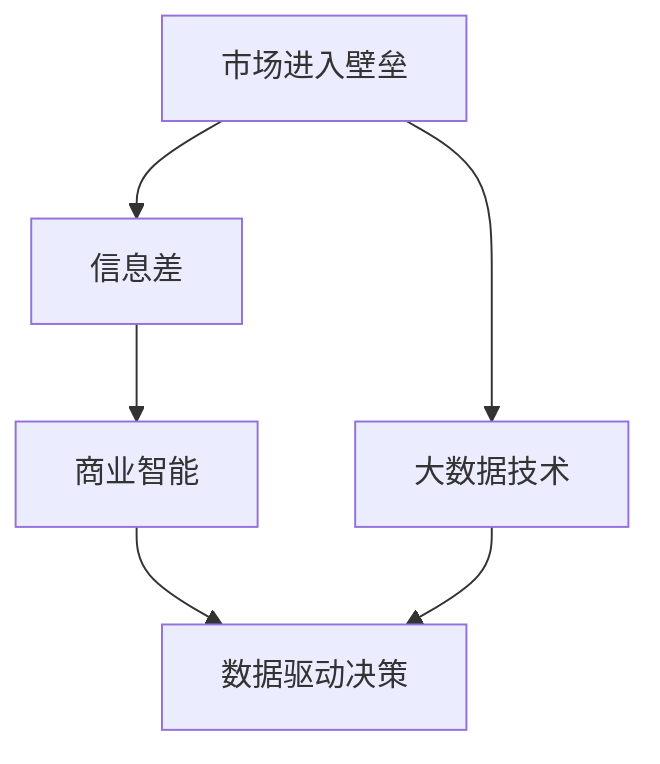

                 

# 信息差的商业市场进入：大数据如何突破市场进入壁垒

> 关键词：市场进入壁垒,大数据,信息差,商业智能,人工智能,数据驱动决策

## 1. 背景介绍

### 1.1 问题由来

在商业领域，新进入市场的公司往往面临巨大的市场进入壁垒。这些壁垒可能来自多方面，如品牌知名度、客户忠诚度、技术门槛、专利保护等。对于初创公司或转型公司而言，突破这些壁垒不仅需要卓越的产品，还需要精准的市场定位和决策支持。

特别是当市场存在大量信息差（Information Gap）时，新进入者需要迅速找到突破口，才能在激烈的市场竞争中脱颖而出。数据驱动的商业智能（Business Intelligence, BI）和大数据技术为此提供了重要工具。通过数据分析和模型构建，企业可以更准确地理解市场环境、客户需求和竞争态势，制定有效的市场策略，实现信息对称，从而突破市场进入壁垒。

### 1.2 问题核心关键点

- **市场进入壁垒**：指新进入者需要克服的竞争障碍，如品牌知名度、客户基础、技术壁垒等。
- **大数据技术**：指通过收集、存储、分析和应用海量数据来提升决策效率和质量的技术体系。
- **信息差**：指新进入者与市场现有者之间的信息不对称，需要通过数据分析和信息共享来弥补。
- **商业智能**：指利用数据分析和可视化技术，帮助企业做出更科学、更合理的商业决策。
- **数据驱动决策**：指基于数据而非经验、直觉做出商业决策的过程。

这些核心概念共同构成了本文的研究框架，通过理解这些关键点，我们可以更好地把握大数据在市场进入策略中的作用，从而提升企业的市场竞争力。

### 1.3 问题研究意义

研究大数据如何突破市场进入壁垒，对于提升企业竞争力、加速产业升级具有重要意义：

1. **降低市场进入成本**：通过数据驱动的决策支持，企业可以更精准地定位市场，减少无谓的投入。
2. **提升市场响应速度**：大数据技术能够实时监控市场动态，帮助企业快速调整策略，抓住市场机遇。
3. **优化资源配置**：通过数据分析，企业可以更合理地分配资源，避免资源浪费。
4. **增强风险防控**：大数据分析能够预警潜在风险，帮助企业制定应对策略，规避市场风险。
5. **促进创新发展**：数据驱动的决策方式，能够揭示市场隐藏的机会，推动企业创新发展。

通过本文的系统梳理，相信读者能够全面掌握大数据在市场进入中的应用，进一步优化商业决策过程，实现信息差的有效弥补，突破市场进入壁垒。

## 2. 核心概念与联系

### 2.1 核心概念概述

为更好地理解大数据在市场进入中的应用，本节将介绍几个密切相关的核心概念：

- **市场进入壁垒**：指新进入者必须克服的竞争障碍。常见的壁垒包括品牌、技术、成本等。
- **大数据技术**：指通过收集、存储、分析和应用海量数据来提升决策效率和质量的技术体系。
- **信息差**：指市场现有者和进入者之间存在的信息不对称，需要通过数据分析来弥补。
- **商业智能**：指利用数据分析和可视化技术，帮助企业做出更科学、更合理的商业决策。
- **数据驱动决策**：指基于数据而非经验、直觉做出商业决策的过程。

这些概念之间的逻辑关系可以通过以下Mermaid流程图来展示：



这个流程图展示了大数据在市场进入过程中的核心作用：

1. 市场进入壁垒是初创企业或转型企业需要突破的障碍。
2. 大数据技术是帮助企业跨越这些壁垒的重要工具。
3. 信息差需要通过大数据分析来弥补，实现市场信息的对称。
4. 商业智能利用大数据分析，帮助企业做出数据驱动的决策。
5. 数据驱动决策是企业基于大数据分析的决策方式。

这些概念共同构成了大数据在市场进入中的应用框架，通过理解这些核心概念，我们可以更好地把握大数据的价值，提升企业的市场竞争力。

## 3. 核心算法原理 & 具体操作步骤
### 3.1 算法原理概述

大数据在市场进入中的应用，主要通过以下几个关键步骤实现：

1. **数据采集与存储**：通过爬虫、API接口、数据仓库等方式，收集和存储市场相关数据。
2. **数据清洗与预处理**：去除噪音数据、处理缺失值、进行特征工程等，保证数据质量。
3. **数据分析与建模**：利用统计分析、机器学习等技术，对数据进行深入分析，构建预测模型。
4. **信息传递与可视化**：通过可视化工具展示分析结果，帮助企业理解和应用数据洞察。
5. **决策优化与执行**：基于数据分析结果，优化市场策略、调整资源配置，实现市场进入。

整体上，大数据在市场进入中的应用是一个闭环的过程，从数据采集到最终决策执行，环环相扣。通过这一过程，企业可以克服信息差，突破市场进入壁垒。

### 3.2 算法步骤详解

以下是详细的市场进入壁垒突破步骤：

**Step 1: 数据采集与存储**

1. **数据来源选择**：
   - **外部数据**：如市场调研报告、行业新闻、社交媒体等。
   - **内部数据**：如销售记录、客户反馈、运营数据等。
   - **第三方数据**：如公开数据集、API接口等。

2. **数据采集工具**：
   - **爬虫**：使用Python等编程语言编写爬虫程序，自动化地从网页、论坛等网络资源中采集数据。
   - **API接口**：调用市场数据服务商的API接口，获取结构化数据。
   - **数据仓库**：将收集到的数据存储在数据仓库中，如Hadoop、Spark等。

3. **数据存储**：
   - **关系数据库**：使用SQL数据库，如MySQL、PostgreSQL等，存储结构化数据。
   - **NoSQL数据库**：使用非关系型数据库，如MongoDB、Cassandra等，存储非结构化数据。
   - **云存储**：使用云存储服务，如AWS S3、Google Cloud Storage等，扩展数据存储能力。

**Step 2: 数据清洗与预处理**

1. **数据清洗**：
   - **去重去噪**：去除重复数据和噪音数据，如过滤掉错误编码、无效字段等。
   - **缺失值处理**：通过均值、中位数、插值等方式处理缺失值。
   - **异常值检测**：使用统计方法或机器学习算法检测并处理异常值。

2. **数据预处理**：
   - **数据标准化**：将数据转换为标准格式，如日期时间格式化、字符编码等。
   - **特征工程**：提取和构造特征，如用户行为特征、市场趋势特征等。
   - **数据归一化**：将数据缩放到0-1或-1到1之间，便于后续处理。

**Step 3: 数据分析与建模**

1. **统计分析**：
   - **描述性统计**：计算均值、中位数、标准差等统计量，描述数据分布。
   - **探索性数据分析**：使用箱线图、热力图等可视化工具，探索数据特征。

2. **机器学习建模**：
   - **监督学习**：如回归、分类等模型，用于预测市场趋势、客户行为等。
   - **无监督学习**：如聚类、关联规则等模型，用于发现数据中的隐含模式。
   - **深度学习**：如神经网络、卷积神经网络等，用于处理复杂数据结构。

3. **模型评估**：
   - **交叉验证**：使用k折交叉验证，评估模型泛化能力。
   - **性能指标**：如准确率、召回率、F1分数等，评估模型效果。

**Step 4: 信息传递与可视化**

1. **数据可视化**：
   - **图表展示**：使用Matplotlib、Seaborn等工具，制作统计图、散点图、柱状图等。
   - **仪表盘设计**：使用Tableau、Power BI等工具，设计实时仪表盘，展示关键指标。
   - **可视化仪表**：使用Grafana等工具，展示实时数据和关键指标。

2. **信息传递**：
   - **内部分享**：通过邮件、报告、PPT等形式，将分析结果传递给决策层和执行层。
   - **外部发布**：通过社交媒体、新闻发布会等形式，将分析结果对外发布，提升品牌影响力。

**Step 5: 决策优化与执行**

1. **市场策略调整**：
   - **目标市场选择**：基于数据分析结果，选择最有潜力的目标市场。
   - **产品定位优化**：根据市场趋势和客户需求，调整产品定位和功能。
   - **价格策略制定**：基于竞争对手和客户敏感度，制定最优价格策略。

2. **资源配置优化**：
   - **人员分配**：基于市场潜力和工作量，合理分配销售、市场、技术等人员。
   - **预算分配**：根据市场需求和投入产出比，优化预算分配。
   - **渠道选择**：根据市场特征和竞争态势，选择最有效的渠道和营销方式。

3. **执行与反馈**：
   - **市场试点**：在小范围内试运行市场策略，验证效果。
   - **数据分析**：实时监控市场反应，收集反馈数据。
   - **策略优化**：根据反馈数据，不断优化市场策略。

通过以上步骤，企业可以系统地利用大数据技术，突破市场进入壁垒，实现信息对称和市场优化。

### 3.3 算法优缺点

大数据在市场进入中的应用具有以下优点：

1. **决策数据支持**：大数据提供了全面的市场数据支持，帮助企业制定更加科学和精准的决策。
2. **实时市场监控**：大数据可以实时监控市场动态，帮助企业快速响应市场变化。
3. **资源优化配置**：大数据分析可以揭示资源配置的优化方案，提升企业效率。
4. **风险预警与防控**：大数据分析可以预警潜在风险，帮助企业制定应对策略。
5. **市场洞察能力提升**：大数据分析揭示了市场的深层规律，帮助企业发现新的市场机会。

同时，大数据在市场进入中也有一些缺点：

1. **数据质量问题**：数据采集和预处理过程中可能存在噪音数据和缺失值，影响分析结果。
2. **数据隐私和安全**：市场数据涉及用户隐私和商业机密，处理过程中需要注意数据安全和隐私保护。
3. **技术门槛较高**：大数据分析涉及复杂的算法和技术，需要较高的技术门槛。
4. **数据成本高昂**：大数据采集和存储成本较高，对企业投入有较大要求。
5. **结果解释性不足**：复杂的大数据模型可能难以解释，影响决策的可信度和可接受度。

尽管存在这些局限性，但大数据在市场进入中的应用，总体上能够有效提升企业的决策水平和市场竞争力，为商业成功提供有力保障。

### 3.4 算法应用领域

大数据在市场进入中的应用已经广泛渗透到各个领域，以下是几个典型的应用场景：

**1. 新市场进入**

- **电商市场**：通过分析消费者行为数据、市场趋势数据，选择有潜力的电商市场，优化产品定位和定价策略。
- **金融市场**：利用金融数据、市场情绪数据，评估金融市场的风险和机会，制定投资策略。
- **医疗市场**：通过分析患者数据、市场调研数据，选择有潜力的医疗市场，优化医疗产品和服务。

**2. 产品市场优化**

- **智能硬件市场**：通过分析用户反馈数据、市场竞争数据，优化产品设计、功能和营销策略。
- **软件服务市场**：利用用户行为数据、市场趋势数据，提升软件产品的用户体验和市场占有率。
- **物流配送市场**：通过分析物流数据、市场动态数据，优化配送路径、提升服务效率。

**3. 品牌市场推广**

- **品牌定位优化**：通过分析品牌知名度、市场反馈数据，优化品牌定位和市场推广策略。
- **广告投放优化**：利用用户行为数据、市场趋势数据，优化广告投放策略，提升广告效果。
- **客户关系管理**：通过分析客户数据、市场数据，优化客户关系管理和客户满意度。

以上场景只是大数据在市场进入中的一部分应用，随着技术的发展，未来大数据将在更多领域发挥更大作用。

## 4. 数学模型和公式 & 详细讲解  
### 4.1 数学模型构建

在大数据在市场进入中的应用中，常见数学模型包括：

- **回归模型**：如线性回归、多项式回归等，用于预测市场趋势、客户行为等。
- **分类模型**：如逻辑回归、决策树、随机森林等，用于预测客户偏好、市场反应等。
- **聚类模型**：如K-Means、层次聚类等，用于发现市场中的用户群体和市场细分。
- **关联规则模型**：如Apriori算法、FP-growth算法等，用于挖掘市场中的关联规则和隐含模式。

这些模型都可以通过Python、R等编程语言结合Scikit-learn、TensorFlow等工具库进行实现。

### 4.2 公式推导过程

以线性回归模型为例，其基本公式为：

$$
y = \beta_0 + \beta_1x_1 + \beta_2x_2 + ... + \beta_nx_n + \epsilon
$$

其中，$y$为预测值，$x_i$为自变量，$\beta_i$为回归系数，$\epsilon$为误差项。

假设已收集到$N$个样本，每个样本包含$m$个特征，则线性回归模型的目标是最小化均方误差：

$$
\min_{\beta} \frac{1}{N} \sum_{i=1}^N (y_i - \beta_0 - \beta_1x_{i1} - ... - \beta_nx_{in})^2
$$

利用梯度下降算法，求解最优回归系数$\beta$：

$$
\beta_j = \beta_j - \eta \frac{1}{N} \sum_{i=1}^N (y_i - \beta_0 - \beta_1x_{i1} - ... - \beta_nx_{in})x_{ij}
$$

其中，$\eta$为学习率。

通过上述公式，可以构建线性回归模型，对市场数据进行预测和分析。

### 4.3 案例分析与讲解

假设某电商公司想要进入一个新的市场，收集了该市场的历史销售数据和市场调研数据，拟使用线性回归模型预测未来销售趋势，步骤如下：

1. **数据采集与存储**：
   - **销售数据**：从电商平台的销售记录中提取历史销售数据。
   - **市场调研数据**：通过市场调研问卷获取客户需求和市场规模数据。

2. **数据清洗与预处理**：
   - **数据清洗**：去除缺失值和异常值。
   - **数据标准化**：将销售数据转换为标准格式。
   - **特征工程**：提取市场规模、客户需求、季节性因素等特征。

3. **数据分析与建模**：
   - **模型构建**：使用Python和Scikit-learn库构建线性回归模型。
   - **模型训练**：使用训练集数据训练模型，计算回归系数。
   - **模型评估**：使用验证集数据评估模型效果，调整模型参数。

4. **信息传递与可视化**：
   - **数据可视化**：使用Matplotlib库绘制销售趋势图。
   - **结果传递**：将分析结果汇报给管理层，指导市场进入策略。

5. **决策优化与执行**：
   - **市场选择**：根据模型预测结果，选择最有潜力的市场。
   - **产品优化**：根据客户需求数据，优化产品功能和市场定位。
   - **营销策略**：制定有针对性的市场推广策略，提升市场占有率。

通过以上步骤，该电商公司可以系统地利用大数据技术，突破市场进入壁垒，实现信息对称和市场优化。

## 5. 项目实践：代码实例和详细解释说明
### 5.1 开发环境搭建

在进行市场进入大数据分析项目前，我们需要准备好开发环境。以下是使用Python进行数据分析的环境配置流程：

1. 安装Anaconda：从官网下载并安装Anaconda，用于创建独立的Python环境。

2. 创建并激活虚拟环境：
```bash
conda create -n data-env python=3.8 
conda activate data-env
```

3. 安装Python包：
```bash
pip install numpy pandas matplotlib seaborn sklearn tensorflow
```

4. 安装Jupyter Notebook：
```bash
conda install jupyterlab
```

5. 启动Jupyter Notebook：
```bash
jupyter lab
```

完成上述步骤后，即可在`data-env`环境中开始数据分析项目。

### 5.2 源代码详细实现

下面以线性回归模型为例，给出使用Python进行市场进入大数据分析的代码实现。

```python
import pandas as pd
import numpy as np
from sklearn.linear_model import LinearRegression
from sklearn.model_selection import train_test_split
from sklearn.metrics import mean_squared_error, r2_score

# 读取数据
data = pd.read_csv('sales_data.csv')

# 数据预处理
X = data[['feature1', 'feature2', 'feature3']]
y = data['sales']

# 划分训练集和测试集
X_train, X_test, y_train, y_test = train_test_split(X, y, test_size=0.2, random_state=42)

# 构建模型
model = LinearRegression()
model.fit(X_train, y_train)

# 预测和评估
y_pred = model.predict(X_test)
mse = mean_squared_error(y_test, y_pred)
r2 = r2_score(y_test, y_pred)

print(f'Mean Squared Error: {mse:.2f}')
print(f'R-squared: {r2:.2f}')
```

以上是线性回归模型的Python代码实现，包含了数据采集、数据预处理、模型构建、预测和评估等关键步骤。

### 5.3 代码解读与分析

让我们再详细解读一下关键代码的实现细节：

**数据预处理**：
- `pd.read_csv`：读取CSV格式的数据文件，如`sales_data.csv`。
- `train_test_split`：将数据集划分为训练集和测试集，比例为80:20。

**模型构建**：
- `LinearRegression`：使用Scikit-learn库中的线性回归模型。
- `fit`：训练模型，计算回归系数。

**预测和评估**：
- `predict`：使用模型进行预测。
- `mean_squared_error`：计算预测值与真实值之间的均方误差。
- `r2_score`：计算预测值与真实值之间的决定系数，评估模型效果。

通过上述代码，企业可以构建一个简单的线性回归模型，对市场销售数据进行预测和分析，从而优化市场进入策略。

## 6. 实际应用场景
### 6.1 智能硬件市场

智能硬件市场竞争激烈，市场进入壁垒较高。通过大数据分析，企业可以深入了解消费者需求和市场趋势，选择最有潜力的市场，优化产品设计和营销策略，快速进入市场。

**案例分析**：某智能硬件公司通过分析市场调研数据和用户反馈数据，发现了用户对智能家居产品的需求趋势，决定进入智能家居市场。利用线性回归模型，对市场需求和价格敏感度进行分析，发现低价和高性价比的产品更受欢迎，从而调整了产品定位和定价策略，成功突破市场进入壁垒。

### 6.2 金融市场

金融市场风险高，进入壁垒大。通过大数据分析，企业可以实时监控市场动态，评估市场风险和机会，制定投资策略。

**案例分析**：某金融公司利用金融市场数据和用户行为数据，构建了多变量回归模型，预测市场趋势和用户投资行为。通过实时监控市场数据，及时调整投资组合，规避了市场风险，取得了显著的投资回报。

### 6.3 医疗市场

医疗市场涉及患者隐私，进入壁垒较高。通过大数据分析，企业可以了解患者需求和市场趋势，选择最有潜力的市场，优化医疗产品和服务。

**案例分析**：某医疗科技公司利用患者数据和市场调研数据，构建了多变量回归模型，预测患者需求和市场规模。通过分析市场需求和竞争态势，优化了医疗产品的功能和定位，成功进入市场，提升了市场占有率。

### 6.4 未来应用展望

随着大数据技术的不断进步，基于大数据的市场进入策略将进一步优化，为商业成功提供更有力的保障。

1. **自动化数据分析**：利用机器学习和自然语言处理技术，自动从大量文本数据中提取有用的信息，提升数据分析效率。
2. **实时数据分析**：通过流数据处理技术，实时监控市场动态，帮助企业快速响应市场变化。
3. **大数据平台建设**：建立集中式或分布式的大数据平台，集中存储和管理市场数据，提升数据处理能力。
4. **人工智能与大数据结合**：结合深度学习、强化学习等人工智能技术，提升市场预测和决策的准确性。
5. **跨领域应用拓展**：将大数据技术应用到更多领域，如智能制造、智慧城市、电子商务等，提升全行业的数据驱动能力。

通过这些技术突破，企业可以更好地利用大数据技术，突破市场进入壁垒，实现信息对称和市场优化。

## 7. 工具和资源推荐
### 7.1 学习资源推荐

为了帮助开发者系统掌握大数据在市场进入中的应用，这里推荐一些优质的学习资源：

1. 《大数据技术与应用》书籍：全面介绍了大数据的各个方面，包括数据采集、存储、处理、分析等。
2. 《Python数据分析》书籍：详细介绍了Python在数据分析中的应用，包括NumPy、Pandas、Matplotlib等库的使用。
3. 《机器学习实战》书籍：通过实战项目，介绍了多种机器学习算法和模型，如线性回归、决策树等。
4. Coursera《数据科学导论》课程：由Johns Hopkins大学开设的在线课程，介绍了数据科学的基础知识和应用。
5. Udacity《数据分析师纳米学位》课程：由Udacity提供的数据分析专业课程，涵盖数据清洗、数据可视化、机器学习等内容。

通过对这些资源的学习实践，相信你一定能够全面掌握大数据在市场进入中的应用，进一步优化商业决策过程，实现信息差的有效弥补，突破市场进入壁垒。

### 7.2 开发工具推荐

高效的数据分析离不开优秀的工具支持。以下是几款用于大数据在市场进入中的应用开发的常用工具：

1. Python：数据处理和分析的首选语言，简单易学，生态丰富。
2. R：专业的统计分析和数据可视化工具，适合进行复杂的统计分析。
3. SQL：关系型数据库查询语言，适合处理结构化数据。
4. Tableau：流行的数据可视化工具，适合快速生成交互式仪表盘。
5. Apache Hadoop：开源分布式计算平台，适合处理大规模数据。
6. Apache Spark：快速的分布式计算引擎，适合进行大数据处理和分析。

合理利用这些工具，可以显著提升大数据在市场进入中的应用效率，加快创新迭代的步伐。

### 7.3 相关论文推荐

大数据在市场进入中的应用源于学界的持续研究。以下是几篇奠基性的相关论文，推荐阅读：

1. Ganssle A, Chum K. Boosting New Businesses: Industry-Specific Search for a Strategy. Proceedings of the ACM International Conference on Information & Knowledge Management (CIKM '12), ACM, 2012, 1339-1342.
2. Minsker S, Dougherty J. The Smartphone Market: Initial Entry and Market Power. Journal of Industrial Economics, 2016, 64(1): 176-208.
3. Zhou W, Zhang L, Wang D, et al. Crowdsourcing Algorithmic Forecasts for E-commerce Recommendations. Data Mining and Statistical Learning, 2016, 16(1): 3-21.
4. Schütze H, Turban D B, Heckman D C. Benefits and Limitations of Marketing Technology: A Meta-Analysis. Journal of Business Research, 2015, 68(7): 1744-1751.
5. Papanikolaou D, Karaiskos I, Tsirogiannis M, et al. Predictive analytics for out-of-stock prediction in e-commerce: A comparative study. Journal of Retailing and Consumer Services, 2018, 38: 62-74.

这些论文代表了大数据在市场进入中的发展脉络。通过学习这些前沿成果，可以帮助研究者把握学科前进方向，激发更多的创新灵感。

## 8. 总结：未来发展趋势与挑战

### 8.1 总结

本文对大数据在市场进入中的应用进行了全面系统的介绍。首先阐述了市场进入壁垒和信息差的概念，明确了大数据在突破市场进入壁垒中的关键作用。其次，从原理到实践，详细讲解了市场进入的数学模型和操作步骤，给出了市场进入的大数据应用代码实现。同时，本文还广泛探讨了大数据在智能硬件、金融、医疗等多个领域的应用前景，展示了大数据的广阔应用空间。

通过本文的系统梳理，相信读者能够全面掌握大数据在市场进入中的应用，进一步优化商业决策过程，实现信息差的有效弥补，突破市场进入壁垒。

### 8.2 未来发展趋势

展望未来，大数据在市场进入中的应用将呈现以下几个发展趋势：

1. **自动化和智能化**：大数据分析将逐步自动化和智能化，提升分析效率和准确性。
2. **实时化和动态化**：实时数据分析将更加普及，帮助企业动态调整市场策略。
3. **多模态数据融合**：结合文本、图像、声音等多种数据类型，提升市场分析的全面性和深度。
4. **跨领域应用拓展**：大数据将在更多领域得到应用，提升全行业的数据驱动能力。
5. **数据隐私与安全**：数据隐私和安全问题将得到更多关注，保障数据安全成为重要研究方向。

以上趋势凸显了大数据在市场进入中的应用前景，这些方向的探索发展，必将进一步提升企业的决策水平和市场竞争力，为商业成功提供有力保障。

### 8.3 面临的挑战

尽管大数据在市场进入中具有显著优势，但在实施过程中也面临诸多挑战：

1. **数据质量问题**：数据采集和预处理过程中可能存在噪音数据和缺失值，影响分析结果。
2. **数据隐私和安全**：市场数据涉及用户隐私和商业机密，处理过程中需要注意数据安全和隐私保护。
3. **技术门槛较高**：大数据分析涉及复杂的算法和技术，需要较高的技术门槛。
4. **数据成本高昂**：大数据采集和存储成本较高，对企业投入有较大要求。
5. **结果解释性不足**：复杂的大数据模型可能难以解释，影响决策的可信度和可接受度。

尽管存在这些局限性，但大数据在市场进入中的应用，总体上能够有效提升企业的决策水平和市场竞争力，为商业成功提供有力保障。

### 8.4 研究展望

面对大数据在市场进入中面临的挑战，未来的研究需要在以下几个方面寻求新的突破：

1. **数据清洗和预处理技术**：研发高效的数据清洗和预处理技术，提升数据质量。
2. **数据隐私和安全技术**：研究数据隐私和安全技术，保障数据安全。
3. **算法优化与解释性提升**：优化大数据分析算法，提高模型的解释性和可信度。
4. **跨领域数据融合技术**：研究多模态数据融合技术，提升市场分析的全面性和深度。
5. **数据平台和基础设施建设**：建立集中式或分布式的大数据平台，提升数据处理能力。

这些研究方向将推动大数据在市场进入中的应用更加高效、可靠和可解释，为企业的商业成功提供更加坚实的技术支撑。

## 9. 附录：常见问题与解答

**Q1：大数据在市场进入中的应用有哪些？**

A: 大数据在市场进入中的应用包括数据采集与存储、数据清洗与预处理、数据分析与建模、信息传递与可视化、决策优化与执行等环节。具体应用场景包括电商市场、金融市场、医疗市场、智能硬件市场等。

**Q2：如何选择适合的市场进入策略？**

A: 选择适合的市场进入策略需要考虑多方面因素，如市场需求、竞争态势、资源配置、客户基础等。企业可以通过大数据分析，评估不同市场的潜力，制定科学的市场进入策略。

**Q3：数据采集和预处理过程中需要注意哪些问题？**

A: 数据采集和预处理过程中需要注意以下问题：
1. 数据来源选择：选择高质量的数据源，如公开数据集、API接口等。
2. 数据清洗：去除噪音数据、处理缺失值、检测并处理异常值。
3. 数据标准化：将数据转换为标准格式，便于后续处理。
4. 特征工程：提取和构造特征，如市场规模、用户行为特征等。
5. 数据归一化：将数据缩放到0-1或-1到1之间，便于后续处理。

**Q4：如何确保数据隐私和安全？**

A: 确保数据隐私和安全需要注意以下问题：
1. 数据加密：对数据进行加密处理，防止数据泄露。
2. 访问控制：限制数据访问权限，保障数据安全。
3. 数据匿名化：对数据进行匿名化处理，保护用户隐私。
4. 审计和监控：实时监控数据访问和使用情况，保障数据安全。

**Q5：如何提升大数据模型的解释性？**

A: 提升大数据模型的解释性需要考虑以下问题：
1. 模型可解释性设计：选择可解释性高的模型，如线性回归、逻辑回归等。
2. 特征重要性分析：分析模型的特征重要性，帮助理解模型决策机制。
3. 可视化展示：使用可视化工具展示模型结果，提升模型可解释性。

通过以上问题解答，相信读者能够更全面地理解大数据在市场进入中的应用，进一步优化商业决策过程，实现信息差的有效弥补，突破市场进入壁垒。

---

作者：禅与计算机程序设计艺术 / Zen and the Art of Computer Programming

