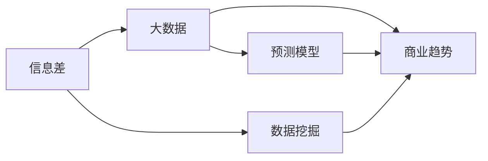

                 

# 信息差的商业行业趋势分析：大数据如何洞悉行业趋势

## 1. 背景介绍

在商业决策中，信息差往往会对企业的竞争力产生决定性的影响。正确的市场趋势预测能够帮助企业预判风险、把握机遇，制定更有竞争力的战略。而大数据的崛起，正在彻底改变信息差对商业趋势的影响，让企业在竞争中占据有利地位。本文将从背景、核心概念、算法原理和操作步骤、实际应用场景、工具和资源推荐、未来发展趋势与挑战、常见问题与解答等角度，全面解析大数据如何帮助企业洞察行业趋势。

## 2. 核心概念与联系

### 2.1 核心概念概述

- **信息差（Information Gap）**：在决策过程中，由于信息的缺失或不对称，使得决策主体无法做出最优决策。信息差通常出现在数据缺失、数据质量不高或数据处理能力不足等情况下。

- **大数据（Big Data）**：指的是那些无法通过传统数据处理方式处理的数据集，通常需要借助分布式计算和高级分析技术来获取价值。

- **商业趋势（Trends in Commerce）**：是指在特定时间范围内，商业环境、消费者行为、行业发展等方面的总体变化趋势，对企业的战略制定和市场决策具有重要参考价值。

- **数据挖掘（Data Mining）**：通过分析数据集中的模式、结构和关系，以发现潜在的有价值的信息。数据挖掘常用于商业智能、金融分析、社交网络分析等领域。

- **预测模型（Predictive Modeling）**：使用历史数据训练机器学习模型，以预测未来的商业趋势。

这些核心概念之间的关系，通过以下Mermaid流程图得以展示：



其中，信息差是企业面临的主要问题，通过数据挖掘和大数据技术，可以获得相关信息，进而借助预测模型对商业趋势进行预测。

## 3. 核心算法原理 & 具体操作步骤

### 3.1 算法原理概述

利用大数据洞察行业趋势的核心在于数据挖掘和预测模型。

- **数据挖掘**：通过分析大量历史数据，识别出商业活动中的模式和规律，填补信息差。

- **预测模型**：基于历史数据训练机器学习模型，预测未来商业趋势，以指导企业决策。

### 3.2 算法步骤详解

#### 3.2.1 数据收集

数据收集是大数据分析的第一步。通常包括：

- **结构化数据**：如销售记录、客户数据、交易记录等，存储在关系型数据库中。
- **非结构化数据**：如文本、图像、音频等，存储在文件系统或云存储中。
- **半结构化数据**：如JSON、XML格式的数据，存储在分布式文件系统中。

#### 3.2.2 数据清洗

数据清洗是指对收集到的数据进行清洗和处理，去除噪声和错误，以便进行后续分析。包括：

- **去重**：去除重复记录，确保数据的一致性和完整性。
- **缺失值处理**：填补缺失值，可以使用均值、中位数、插值等方法。
- **异常值处理**：检测和修正异常值，可以使用箱线图、Z-score等方法。

#### 3.2.3 数据预处理

数据预处理是指对清洗后的数据进行结构化处理，以便进行后续分析。包括：

- **数据归一化**：将数据缩放到一定范围内，以减少计算复杂度。
- **数据降维**：减少数据维度，以便进行高效分析。
- **特征工程**：从原始数据中提取有用的特征，如统计特征、时间特征等。

#### 3.2.4 数据挖掘

数据挖掘是指通过算法从数据中挖掘出有用的知识和模式。常用的数据挖掘算法包括：

- **关联规则挖掘**：发现数据中的关联规则，如购物篮分析。
- **聚类分析**：将数据划分成不同的簇，便于分类和聚类。
- **分类算法**：如决策树、随机森林、支持向量机等，用于分类和预测。

#### 3.2.5 预测模型

预测模型是指基于历史数据训练的机器学习模型，用于预测未来趋势。常用的预测模型包括：

- **线性回归**：用于预测连续型变量。
- **逻辑回归**：用于预测二分类变量。
- **随机森林**：用于预测分类和回归问题。
- **深度学习模型**：如CNN、RNN、LSTM等，用于处理复杂的数据结构。

### 3.3 算法优缺点

大数据在洞察商业趋势方面的优点包括：

- **数据量大**：可以提供更多的信息，更全面地反映行业趋势。
- **多样性**：涵盖多种类型的数据，可以提供多维度的视角。
- **实时性**：可以实时更新数据，提供最新的趋势信息。

缺点包括：

- **数据质量**：数据收集和清洗过程中可能存在噪声和错误。
- **数据隐私**：数据处理和分析过程中可能涉及敏感信息，需要采取隐私保护措施。
- **计算复杂度**：大数据分析通常需要高性能计算资源，如分布式计算集群。

### 3.4 算法应用领域

大数据洞察商业趋势的应用领域非常广泛，包括但不限于：

- **金融行业**：通过分析交易数据、市场数据等，预测股票价格、市场趋势等。
- **零售行业**：通过分析销售数据、顾客行为数据等，预测消费趋势、库存需求等。
- **制造业**：通过分析生产数据、供应链数据等，预测生产需求、物流趋势等。
- **医疗行业**：通过分析病患数据、治疗效果数据等，预测疾病流行趋势、药物效果等。
- **社交媒体**：通过分析用户行为数据、互动数据等，预测用户兴趣、市场趋势等。

## 4. 数学模型和公式 & 详细讲解 & 举例说明

### 4.1 数学模型构建

假设我们有一组历史销售数据 $\{(x_i, y_i)\}_{i=1}^N$，其中 $x_i$ 为输入特征，$y_i$ 为输出标签。我们的目标是训练一个预测模型 $f$，使其能够对未来的销售趋势进行预测。

### 4.2 公式推导过程

常用的预测模型包括线性回归模型和随机森林模型。这里以线性回归模型为例，其数学公式如下：

$$
\min_{\theta} \sum_{i=1}^N (y_i - f_{\theta}(x_i))^2
$$

其中 $\theta$ 为模型参数，$f_{\theta}(x_i) = \theta^T x_i$ 为预测函数，$(y_i - f_{\theta}(x_i))^2$ 为预测误差。

### 4.3 案例分析与讲解

以零售行业为例，通过大数据分析可以发现以下规律：

- **季节性趋势**：季节性变化对销售有显著影响，如节假日、季节变换等。
- **价格敏感性**：价格变动对销售有显著影响，如价格促销、打折等。
- **市场竞争**：竞争对手的市场活动对销售有显著影响，如广告、促销等。

通过构建相应的预测模型，可以预测未来销售趋势，指导库存管理和营销策略。

## 5. 项目实践：代码实例和详细解释说明

### 5.1 开发环境搭建

在开始项目实践前，需要搭建开发环境：

- **Python环境**：Python 3.8 及以上版本。
- **PyTorch**：用于构建深度学习模型。
- **Pandas**：用于数据处理。
- **Scikit-learn**：用于构建机器学习模型。
- **Jupyter Notebook**：用于编写和执行代码。

### 5.2 源代码详细实现

以下是一个使用线性回归模型进行销售趋势预测的代码实现：

```python
import pandas as pd
import numpy as np
from sklearn.linear_model import LinearRegression
from sklearn.metrics import mean_squared_error

# 数据预处理
data = pd.read_csv('sales_data.csv')
data = data.dropna()
X = data[['day_of_week', 'month', 'price', 'promotion']]
y = data['sales']

# 构建模型
model = LinearRegression()
model.fit(X, y)

# 预测
X_test = pd.read_csv('test_data.csv')
X_test = X_test.dropna()
y_pred = model.predict(X_test)

# 评估
mse = mean_squared_error(y_test, y_pred)
print(f"Mean Squared Error: {mse}")
```

### 5.3 代码解读与分析

这段代码实现了基本的线性回归模型预测销售趋势的功能。首先，从CSV文件中读取数据，并进行预处理。然后，构建线性回归模型，并使用训练数据进行训练。最后，使用测试数据进行预测，并计算预测误差的均方误差。

## 6. 实际应用场景

### 6.1 智能推荐系统

大数据分析可以帮助企业构建智能推荐系统，提升用户体验和转化率。通过分析用户行为数据、浏览历史等，可以发现用户的兴趣偏好，进而推荐相应的产品和服务。

### 6.2 供应链管理

大数据分析可以帮助企业优化供应链管理，提升运营效率。通过分析物流数据、库存数据等，可以预测需求波动，优化库存管理，减少库存成本。

### 6.3 风险控制

大数据分析可以帮助企业识别潜在的风险因素，制定相应的风险控制策略。通过分析交易数据、客户数据等，可以发现异常交易行为，及时预警，防范风险。

### 6.4 未来应用展望

随着技术的发展，大数据在洞察行业趋势方面的应用将更加广泛：

- **多模态数据融合**：结合文本、图像、视频等多模态数据，提供更全面的分析视角。
- **实时数据处理**：利用流计算技术，实时分析数据，提供最新的趋势信息。
- **自动化决策**：结合机器学习和大数据技术，实现自动化的决策和预测。

## 7. 工具和资源推荐

### 7.1 学习资源推荐

- **Coursera《机器学习》课程**：由斯坦福大学教授Andrew Ng讲授，涵盖机器学习的基本概念和算法。
- **Kaggle**：数据科学竞赛平台，提供大量的数据集和实战项目。
- **PyTorch官方文档**：详细介绍了PyTorch框架的使用方法和API。

### 7.2 开发工具推荐

- **Jupyter Notebook**：Python开发环境，支持代码编写和数据可视化。
- **Scikit-learn**：Python机器学习库，提供多种算法实现。
- **TensorBoard**：可视化工具，用于监测模型训练过程。

### 7.3 相关论文推荐

- **Taming Big Data: A Knowledge-Driven Approach to Big Data**：作者David A. Avison, Jan A. Westerbeke，介绍了大数据在企业中的应用。
- **Big Data: A Revolution That Will Transform How We Live, Work, and Think**：作者Viktor Mayer-Schönberger, Kenneth Cukier，探讨了大数据对社会的影响。
- **Predictive Analytics: The Power to Predict the Future**：作者Eric Siegel，介绍了预测分析的基础知识和应用场景。

## 8. 总结：未来发展趋势与挑战

### 8.1 研究成果总结

通过大数据技术，企业可以洞察行业趋势，做出更准确的商业决策。大数据分析不仅能够发现传统统计方法难以发现的规律，还能够实时监测和预测未来趋势，帮助企业在激烈的市场竞争中占据优势。

### 8.2 未来发展趋势

- **数据质量提升**：大数据分析的核心在于数据质量，未来需要进一步提升数据采集、清洗和处理的质量。
- **算法创新**：随着技术的进步，新的数据挖掘和预测算法将不断涌现，进一步提升大数据分析的准确性和效率。
- **多模态数据融合**：结合多模态数据，提供更全面和准确的分析结果。
- **自动化决策**：结合机器学习和自动化技术，实现更高效的决策和预测。

### 8.3 面临的挑战

- **数据隐私和安全**：在数据处理和分析过程中，需要保护用户隐私，避免数据泄露和滥用。
- **计算资源限制**：大数据分析需要高性能计算资源，对于小型企业可能是一个挑战。
- **数据孤岛问题**：不同系统和平台的数据难以统一，形成数据孤岛，影响数据分析的准确性。

### 8.4 研究展望

未来需要进一步研究以下问题：

- **自动化数据清洗**：开发更高效的自动化数据清洗工具，减少人工干预。
- **隐私保护技术**：开发隐私保护算法，保护用户隐私，避免数据滥用。
- **多模态数据融合**：结合不同类型的数据，提供更全面的分析视角。

## 9. 附录：常见问题与解答

**Q1: 什么是信息差？**

A: 信息差是指在决策过程中，由于信息的缺失或不对称，使得决策主体无法做出最优决策。

**Q2: 大数据分析的优势是什么？**

A: 大数据分析可以提供更多的信息，更全面地反映行业趋势，涵盖多种类型的数据，提供多维度的视角，实时更新数据，提供最新的趋势信息。

**Q3: 如何提高大数据分析的准确性？**

A: 提高数据质量、优化算法、多模态数据融合、自动化决策等手段可以提高大数据分析的准确性。

**Q4: 大数据分析在商业中有什么应用？**

A: 大数据分析可以用于智能推荐系统、供应链管理、风险控制等商业场景，提升用户体验和运营效率。

**Q5: 大数据分析面临的挑战是什么？**

A: 数据隐私和安全、计算资源限制、数据孤岛问题是大数据分析面临的主要挑战。

---

作者：禅与计算机程序设计艺术 / Zen and the Art of Computer Programming

