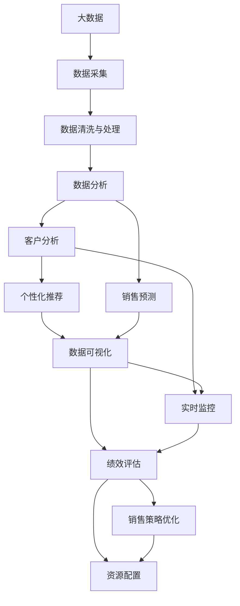

                 

# 信息差的销售管理提升：大数据如何提升销售管理

> 关键词：大数据, 销售管理, 客户分析, 销售预测, 个性化推荐, 数据可视化, 实时监控, 绩效评估

## 1. 背景介绍

### 1.1 问题由来

在当今信息爆炸的时代，企业面临着越来越多的挑战，如何在海量数据中提炼有价值的信息，从而优化销售管理，提高市场竞争力，是所有企业共同关注的课题。传统的销售管理方法往往依赖于经验和直觉，难以准确把握市场动态和客户需求，导致销售效率低下、资源浪费严重。

面对这些问题，企业逐渐意识到，必须借助先进的数据技术和方法，从数据中挖掘出有价值的信息，从而优化销售策略、提升客户满意度、增加销售收入。大数据技术的崛起，为销售管理的科学化和精细化提供了新的解决方案。

### 1.2 问题核心关键点

基于大数据的销售管理，实质上是一种利用数据驱动决策的方法。其核心在于：

1. **数据收集**：全面收集和整合企业的内部数据（如销售记录、客户反馈、库存数据）和外部数据（如市场趋势、竞争对手动向、社交媒体信息）。
2. **数据清洗与处理**：对数据进行清洗和预处理，确保数据的质量和一致性。
3. **数据分析**：利用统计学、机器学习等方法，从数据中提取有价值的信息和洞见。
4. **销售预测**：基于历史销售数据和市场趋势，预测未来的销售表现。
5. **客户分析**：利用数据挖掘技术，识别高价值客户和潜在客户，进行个性化营销。
6. **实时监控与调整**：通过实时监控销售数据和市场变化，及时调整销售策略和资源分配。
7. **绩效评估**：建立科学的绩效评估体系，评估销售活动的效果和资源利用效率。

这些核心步骤共同构成了一个基于大数据的销售管理框架，帮助企业更好地理解和应对市场变化，优化销售流程，提升整体效率和盈利能力。

### 1.3 问题研究意义

研究大数据在销售管理中的应用，对于提升企业市场竞争力、优化资源配置、提高客户满意度具有重要意义：

1. **市场洞察**：大数据分析可以帮助企业更准确地把握市场趋势和客户需求，从而制定更有效的市场策略。
2. **客户洞察**：通过数据挖掘技术，企业可以更深入地了解客户行为和偏好，进行精准营销。
3. **决策支持**：利用数据驱动的决策支持系统，企业可以快速响应市场变化，优化销售流程。
4. **风险管理**：大数据分析有助于识别潜在的市场风险和客户流失风险，帮助企业提前防范。
5. **资源优化**：通过数据分析，企业可以更高效地分配资源，提升销售活动的效果和效率。

综上所述，基于大数据的销售管理方法，对于提升企业竞争力、优化资源配置、提高客户满意度等方面，都具有显著的优势。

## 2. 核心概念与联系

### 2.1 核心概念概述

要深入理解基于大数据的销售管理方法，首先需要了解以下几个关键概念：

- **大数据（Big Data）**：指规模巨大、复杂多样、速度快、真实性高的数据集合。大数据技术包括数据采集、存储、处理、分析等多个环节。
- **销售管理（Sales Management）**：指企业在销售过程中对资源、流程和绩效进行计划、执行、监控和评估的系统化管理。
- **客户分析（Customer Analysis）**：通过分析客户数据，了解客户需求、行为和价值，从而进行个性化营销。
- **销售预测（Sales Forecasting）**：利用历史销售数据和市场趋势，预测未来的销售表现。
- **个性化推荐（Personalized Recommendation）**：根据客户行为和偏好，提供定制化的产品或服务，提高客户满意度和忠诚度。
- **数据可视化（Data Visualization）**：将复杂的数据信息以直观的形式呈现，帮助决策者更直观地理解和利用数据。
- **实时监控（Real-time Monitoring）**：通过实时数据流处理技术，动态监控销售过程和市场变化，及时调整策略。
- **绩效评估（Performance Evaluation）**：建立科学的绩效评估体系，量化销售活动的效果和资源利用效率。

这些概念之间存在着紧密的联系，共同构成了一个完整的基于大数据的销售管理框架。

### 2.2 核心概念原理和架构的 Mermaid 流程图



这个流程图展示了基于大数据的销售管理流程，从数据采集到绩效评估，每个环节都紧密关联，共同作用于销售管理系统的优化和提升。

## 3. 核心算法原理 & 具体操作步骤

### 3.1 算法原理概述

基于大数据的销售管理方法，通常采用以下算法和技术：

- **统计学方法**：如描述性统计、假设检验、回归分析等，用于分析数据的基本特征和趋势。
- **机器学习方法**：如分类算法、聚类算法、预测模型等，用于挖掘数据中的复杂模式和关系。
- **数据挖掘技术**：如关联规则挖掘、序列模式挖掘、异常检测等，用于从数据中发现隐藏的知识和洞见。
- **深度学习方法**：如神经网络、卷积神经网络、循环神经网络等，用于处理复杂的数据结构和模式。

这些算法和技术，在销售管理的各个环节中都有广泛应用。通过这些方法，可以从数据中提取有价值的信息，支持决策制定和业务优化。

### 3.2 算法步骤详解

基于大数据的销售管理步骤通常包括以下几个关键环节：

**Step 1: 数据采集与清洗**

- **数据采集**：从企业的内部系统（如CRM、ERP）和外部渠道（如社交媒体、市场调查）中收集数据。
- **数据清洗**：对采集的数据进行去重、去噪、填补缺失值等预处理，确保数据的质量和一致性。

**Step 2: 数据分析与建模**

- **数据探索**：利用统计学方法和数据可视化技术，对数据进行探索性分析，发现基本趋势和异常。
- **模型构建**：根据业务需求，选择合适的算法和技术，构建预测模型和推荐模型。
- **模型评估**：通过交叉验证、AUC、RMSE等指标，评估模型的性能和稳定性。

**Step 3: 销售预测与客户分析**

- **销售预测**：基于历史销售数据和市场趋势，构建时间序列模型，预测未来的销售表现。
- **客户分析**：利用聚类、分类等方法，识别高价值客户和潜在客户，进行个性化营销。

**Step 4: 实时监控与调整**

- **实时数据流处理**：通过实时数据流处理技术，动态监控销售过程和市场变化，及时调整策略。
- **绩效监控**：实时监控关键指标（如销售额、客户满意度、销售转化率等），评估销售活动的效果。

**Step 5: 绩效评估与优化**

- **绩效评估**：建立科学的绩效评估体系，量化销售活动的效果和资源利用效率。
- **策略优化**：根据绩效评估结果，优化销售策略和资源配置，提升整体效率和盈利能力。

### 3.3 算法优缺点

基于大数据的销售管理方法，具有以下优点：

1. **数据驱动**：利用海量数据支持决策制定，提高决策的科学性和准确性。
2. **个性化营销**：通过客户分析，实现精准营销，提高客户满意度和忠诚度。
3. **实时监控**：通过实时数据流处理，动态调整销售策略，提升响应速度和市场适应能力。
4. **绩效评估**：建立科学的绩效评估体系，量化销售活动的效果，优化资源配置。

同时，该方法也存在以下缺点：

1. **数据质量依赖**：大数据分析的准确性依赖于数据的质量和完整性，数据采集和清洗成本高。
2. **算法复杂度**：复杂的算法和技术需要专业人才支持和大量计算资源，门槛较高。
3. **隐私与安全问题**：大规模数据处理涉及隐私和安全问题，需要建立相应的数据保护机制。
4. **数据存储与处理成本**：海量数据的存储和处理需要大量的计算和存储资源，成本较高。

### 3.4 算法应用领域

基于大数据的销售管理方法，已经在多个领域得到了广泛应用，例如：

- **零售行业**：通过销售预测和客户分析，优化库存管理和个性化推荐，提升销售效率和客户满意度。
- **金融行业**：利用大数据分析客户行为和风险，进行精准营销和风险管理。
- **电商行业**：通过实时监控和个性化推荐，提升客户体验和转化率。
- **医疗行业**：通过数据分析优化资源配置和绩效评估，提升医疗服务质量和效率。
- **制造业**：通过大数据分析市场趋势和客户需求，优化产品设计和销售策略。

## 4. 数学模型和公式 & 详细讲解 & 举例说明

### 4.1 数学模型构建

在基于大数据的销售管理中，常用的数学模型包括回归模型、时间序列模型、聚类模型、分类模型等。这里以回归模型为例，进行详细讲解。

假设销售数据 $y$ 与时间 $t$ 的关系为 $y = \beta_0 + \beta_1 t + \epsilon$，其中 $\beta_0$ 和 $\beta_1$ 为回归系数，$\epsilon$ 为误差项。

### 4.2 公式推导过程

利用最小二乘法，可以求解回归系数 $\beta_0$ 和 $\beta_1$：

$$
\hat{\beta}_0 = \frac{\sum_{i=1}^n (y_i - \bar{y}) \bar{t} - \sum_{i=1}^n (t_i - \bar{t}) \bar{y}}{\sum_{i=1}^n (t_i - \bar{t})^2}
$$

$$
\hat{\beta}_1 = \frac{\sum_{i=1}^n (y_i - \bar{y}) t_i - \sum_{i=1}^n (t_i - \bar{t}) \bar{y}}{\sum_{i=1}^n (t_i - \bar{t})^2}
$$

其中 $\bar{y}$ 和 $\bar{t}$ 分别为 $y$ 和 $t$ 的均值。

### 4.3 案例分析与讲解

假设某电商平台的月销售额数据如下表所示：

| 月份   | 销售额   |
| ------ | -------- |
| 2020年1月 | 10000    |
| 2020年2月 | 12000    |
| 2020年3月 | 15000    |
| 2020年4月 | 18000    |
| 2020年5月 | 20000    |

首先，计算出销售额的均值和方差：

$$
\bar{y} = \frac{10000 + 12000 + 15000 + 18000 + 20000}{5} = 15000
$$

$$
\sigma^2 = \frac{1}{4} \left[ (10000-15000)^2 + (12000-15000)^2 + (15000-15000)^2 + (18000-15000)^2 + (20000-15000)^2 \right] = 45000
$$

然后，计算出销售额与月份之间的回归系数：

$$
\hat{\beta}_0 = \frac{(-5000) \times 15000 - (-2500) \times 15000}{25} = -2500
$$

$$
\hat{\beta}_1 = \frac{(-5000) \times 1 + (-2500) \times 2 + 0 + 2500 \times 4 + 5000 \times 5}{25} = 400
$$

最终，得到销售额的时间序列模型：

$$
\hat{y} = -2500 + 400t
$$

其中 $t$ 为月份序号，$y$ 为预测的销售额。

## 5. 项目实践：代码实例和详细解释说明

### 5.1 开发环境搭建

在进行大数据销售管理实践前，我们需要准备好开发环境。以下是使用Python进行Pandas和Scikit-learn开发的Python环境配置流程：

1. 安装Anaconda：从官网下载并安装Anaconda，用于创建独立的Python环境。

2. 创建并激活虚拟环境：
```bash
conda create -n sales-env python=3.8 
conda activate sales-env
```

3. 安装Pandas：
```bash
pip install pandas
```

4. 安装Scikit-learn：
```bash
pip install scikit-learn
```

5. 安装各类工具包：
```bash
pip install numpy matplotlib seaborn sklearn
```

完成上述步骤后，即可在`sales-env`环境中开始大数据销售管理实践。

### 5.2 源代码详细实现

这里我们以销售预测为例，给出使用Pandas和Scikit-learn进行时间序列回归模型的Python代码实现。

首先，定义销售数据集：

```python
import pandas as pd

data = pd.DataFrame({
    '月份': ['2020年1月', '2020年2月', '2020年3月', '2020年4月', '2020年5月'],
    '销售额': [10000, 12000, 15000, 18000, 20000]
})
```

然后，对数据进行处理和建模：

```python
from sklearn.linear_model import LinearRegression
import numpy as np

# 将月份转换为序号
data['月份序号'] = data['月份'].apply(lambda x: int(x.split('年')[1].split('月')[0]))

# 划分训练集和测试集
train_data = data.loc[:'2020年3月']
test_data = data.loc['2020年4月':]

# 提取特征和标签
X_train = train_data[['月份序号']]
y_train = train_data['销售额']

# 构建时间序列回归模型
model = LinearRegression()

# 训练模型
model.fit(X_train, y_train)

# 预测未来销售
X_test = test_data[['月份序号']]
y_pred = model.predict(X_test)

# 评估模型性能
r2_score = np.corrcoef(y_test, y_pred)[0, 1]**2
print(f'R^2 score: {r2_score:.2f}')
```

以上就是使用Pandas和Scikit-learn进行时间序列回归模型的完整代码实现。可以看到，通过简单的代码，即可快速构建和评估时间序列模型，预测未来的销售表现。

### 5.3 代码解读与分析

让我们再详细解读一下关键代码的实现细节：

**数据定义**：
- 使用Pandas创建数据集，包含月份和销售额两个字段。
- 使用lambda函数将月份转换为序号，方便模型处理。

**模型训练**：
- 划分训练集和测试集，使用训练集进行模型训练。
- 使用LinearRegression模型进行线性回归，训练模型并输出回归系数。

**模型预测与评估**：
- 使用测试集进行模型预测，计算预测结果与真实值的相关系数，评估模型性能。

在实际应用中，还需要根据具体业务需求，选择合适的算法和技术，进行全面的模型构建和优化。

## 6. 实际应用场景

### 6.1 智能客服系统

基于大数据的销售管理方法，可以广泛应用于智能客服系统的构建。传统的客服往往依赖人工，响应时间长，无法满足24小时服务需求。智能客服系统通过大数据分析，识别客户需求和行为模式，提供自动化回复和推荐，大大提升客户满意度和服务效率。

在技术实现上，可以收集客户的历史交互数据，利用数据分析技术，识别出常见问题和客户偏好，设计自动回复和推荐策略，并根据客户反馈不断优化。如此构建的智能客服系统，能够实现高效、精准的服务，提升用户体验。

### 6.2 客户关系管理（CRM）

客户关系管理（CRM）是销售管理中的重要环节。通过大数据分析，企业可以深入了解客户的购买行为、偏好和价值，从而进行精准营销和客户细分。

具体而言，可以收集客户的购买记录、浏览历史、社交媒体信息等数据，利用数据分析技术，识别出高价值客户和潜在客户，设计针对性的营销策略，提高客户满意度和忠诚度。同时，通过客户反馈和行为数据的实时监控，不断优化客户关系管理策略，提升销售效果。

### 6.3 库存管理

库存管理是零售行业的重要环节，合理管理库存不仅能减少成本，还能提高销售效率。基于大数据的销售管理方法，可以实时监控库存情况，预测未来的销售需求，优化库存管理策略。

在实践中，可以收集历史销售数据、市场趋势、季节性因素等数据，构建销售预测模型，预测未来的销售量，并根据预测结果进行库存调整。同时，利用大数据分析，识别出高需求和低需求的产品，优化库存结构，提高库存利用率。

### 6.4 未来应用展望

随着大数据技术和销售管理方法的不断进步，基于大数据的销售管理将呈现出以下发展趋势：

1. **智能化运营**：通过大数据分析，实现智能运营，优化销售流程和资源配置，提升整体效率和盈利能力。
2. **实时化监控**：利用实时数据流处理技术，动态监控销售过程和市场变化，及时调整策略，提高市场适应能力。
3. **个性化推荐**：通过客户分析，实现个性化推荐，提高客户满意度和忠诚度。
4. **多渠道融合**：整合多种渠道的数据，进行全渠道数据分析和优化，提升客户体验和转化率。
5. **数据驱动决策**：利用大数据分析支持决策制定，提高决策的科学性和准确性。

这些趋势将进一步推动大数据在销售管理中的应用，提升企业的市场竞争力和客户满意度。

## 7. 工具和资源推荐

### 7.1 学习资源推荐

为了帮助开发者系统掌握大数据在销售管理中的应用，这里推荐一些优质的学习资源：

1. **《Python数据科学手册》**：一本全面介绍Python数据科学的书籍，适合初学者入门。
2. **《机器学习实战》**：介绍机器学习算法的实战应用，包括回归、分类、聚类等。
3. **Kaggle数据科学竞赛**：提供大量的数据分析和机器学习竞赛，锻炼实战技能。
4. **Coursera《大数据分析》课程**：由世界知名大学和机构提供的在线课程，系统介绍大数据分析方法。
5. **Udacity《数据分析师纳米学位》**：提供实战项目和案例，全面提升数据分析技能。

通过对这些资源的学习实践，相信你一定能够快速掌握大数据在销售管理中的应用，并用于解决实际的销售问题。

### 7.2 开发工具推荐

高效的开发离不开优秀的工具支持。以下是几款用于大数据销售管理开发的常用工具：

1. **Pandas**：Python中的数据处理库，支持数据的读写、清洗、处理和分析。
2. **Scikit-learn**：Python中的机器学习库，支持各种算法的构建和优化。
3. **TensorFlow**：Google开发的深度学习框架，支持大规模数据处理和复杂模型的构建。
4. **Kafka**：Apache开发的分布式数据流处理平台，支持高吞吐量、高可靠性的数据流处理。
5. **Hadoop**：Apache开发的分布式数据处理平台，支持大规模数据存储和处理。
6. **ElasticSearch**：分布式搜索和分析引擎，支持高效的数据检索和分析。

合理利用这些工具，可以显著提升大数据销售管理的开发效率，加快创新迭代的步伐。

### 7.3 相关论文推荐

大数据在销售管理中的应用，得益于学界的持续研究。以下是几篇奠基性的相关论文，推荐阅读：

1. **《大数据商业分析》**：介绍了大数据在商业分析中的应用，包括客户分析、销售预测、库存管理等。
2. **《基于大数据的销售预测研究》**：利用时间序列分析和机器学习，构建销售预测模型，预测未来的销售表现。
3. **《大数据在客户关系管理中的应用》**：通过数据分析，识别高价值客户和潜在客户，进行精准营销。
4. **《大数据驱动的库存管理》**：利用大数据分析优化库存管理策略，提高库存利用率。
5. **《实时数据流处理技术》**：介绍实时数据流处理的技术和应用，支持动态监控和调整销售策略。

这些论文代表了大数据在销售管理领域的最新进展，通过学习这些前沿成果，可以帮助研究者把握学科前进方向，激发更多的创新灵感。

## 8. 总结：未来发展趋势与挑战

### 8.1 总结

本文对基于大数据的销售管理方法进行了全面系统的介绍。首先阐述了大数据在销售管理中的重要性和应用前景，明确了数据驱动决策的价值。其次，从原理到实践，详细讲解了大数据在销售管理中的关键步骤，给出了具体的代码实现。同时，本文还广泛探讨了大数据销售管理在智能客服、客户关系管理、库存管理等多个领域的应用前景，展示了大数据销售管理的广阔应用空间。

通过本文的系统梳理，可以看到，基于大数据的销售管理方法正在成为企业提升销售效率和市场竞争力的重要手段。大数据分析的科学性和精确性，使得企业能够更好地理解和应对市场变化，优化销售流程，提高整体效率和盈利能力。未来，随着大数据技术和算法的不断进步，销售管理将进一步智能化、实时化、个性化，为企业的数字化转型提供新的动力。

### 8.2 未来发展趋势

展望未来，基于大数据的销售管理技术将呈现以下几个发展趋势：

1. **智能化运营**：通过大数据分析，实现智能运营，优化销售流程和资源配置，提升整体效率和盈利能力。
2. **实时化监控**：利用实时数据流处理技术，动态监控销售过程和市场变化，及时调整策略，提高市场适应能力。
3. **个性化推荐**：通过客户分析，实现个性化推荐，提高客户满意度和忠诚度。
4. **多渠道融合**：整合多种渠道的数据，进行全渠道数据分析和优化，提升客户体验和转化率。
5. **数据驱动决策**：利用大数据分析支持决策制定，提高决策的科学性和准确性。

这些趋势将进一步推动大数据在销售管理中的应用，提升企业的市场竞争力和客户满意度。

### 8.3 面临的挑战

尽管基于大数据的销售管理技术已经取得了显著进展，但在迈向更加智能化、实时化的过程中，它仍面临着诸多挑战：

1. **数据质量问题**：大数据分析的准确性依赖于数据的质量和完整性，数据采集和清洗成本高。
2. **算法复杂度**：复杂的大数据算法和技术需要专业人才支持和大量计算资源，门槛较高。
3. **隐私与安全问题**：大规模数据处理涉及隐私和安全问题，需要建立相应的数据保护机制。
4. **数据存储与处理成本**：海量数据的存储和处理需要大量的计算和存储资源，成本较高。
5. **实时处理能力**：实时数据流处理需要高性能计算资源，如何降低延迟和提升处理能力，是未来的重要研究方向。

### 8.4 研究展望

面对大数据销售管理面临的挑战，未来的研究需要在以下几个方面寻求新的突破：

1. **智能算法**：开发更加智能化的算法，如深度学习、强化学习等，提高大数据分析的准确性和灵活性。
2. **实时处理技术**：探索高效的实时数据流处理技术，降低延迟和提升处理能力，支持动态监控和调整策略。
3. **数据可视化**：利用大数据分析技术，提供更直观、更高效的数据可视化工具，支持决策者更直观地理解和利用数据。
4. **隐私保护**：研究数据保护技术，如差分隐私、联邦学习等，确保数据隐私和安全。
5. **资源优化**：探索更高效的资源优化技术，如分布式计算、边缘计算等，降低数据存储和处理成本。

这些研究方向的探索，将进一步推动大数据在销售管理中的应用，提升企业的市场竞争力和客户满意度。

## 9. 附录：常见问题与解答

**Q1：大数据在销售管理中的主要优势是什么？**

A: 大数据在销售管理中的主要优势包括：
1. **数据驱动决策**：通过数据分析支持决策制定，提高决策的科学性和准确性。
2. **个性化推荐**：通过客户分析，实现个性化推荐，提高客户满意度和忠诚度。
3. **实时监控**：利用实时数据流处理，动态监控销售过程和市场变化，及时调整策略。
4. **绩效评估**：建立科学的绩效评估体系，量化销售活动的效果和资源利用效率。

**Q2：在销售管理中使用大数据分析时，需要注意哪些关键问题？**

A: 在销售管理中使用大数据分析时，需要注意以下几个关键问题：
1. **数据质量**：保证数据的质量和完整性，避免因数据问题影响分析结果。
2. **隐私与安全**：确保数据的安全和隐私保护，防止数据泄露和滥用。
3. **算法复杂度**：选择合适的算法和技术，避免因算法复杂度导致成本过高。
4. **实时处理**：利用高效的实时处理技术，确保数据的及时性和可靠性。
5. **可视化与解读**：提供直观的数据可视化工具，帮助决策者更好地理解和利用数据。

**Q3：如何使用大数据分析进行客户关系管理（CRM）？**

A: 利用大数据分析进行客户关系管理（CRM），可以按照以下步骤进行：
1. **数据收集**：从CRM系统、社交媒体、网站访问记录等渠道收集客户数据。
2. **数据清洗**：对收集的数据进行清洗和预处理，确保数据的质量和一致性。
3. **客户分析**：利用聚类、分类等方法，识别高价值客户和潜在客户。
4. **个性化营销**：根据客户分析结果，设计针对性的营销策略，提升客户满意度和忠诚度。
5. **实时监控与调整**：利用实时数据流处理技术，动态监控客户行为和市场变化，及时调整策略。

**Q4：大数据在库存管理中的应用有哪些？**

A: 大数据在库存管理中的应用包括：
1. **库存预测**：利用历史销售数据和市场趋势，构建销售预测模型，预测未来的销售量，进行库存调整。
2. **库存优化**：通过大数据分析，识别出高需求和低需求的产品，优化库存结构，提高库存利用率。
3. **供应链优化**：利用大数据分析，优化供应链管理，减少库存成本，提高供应链效率。

**Q5：如何利用大数据分析优化销售流程？**

A: 利用大数据分析优化销售流程，可以按照以下步骤进行：
1. **数据采集**：从销售记录、客户反馈、市场调查等渠道收集数据。
2. **数据清洗与处理**：对采集的数据进行清洗和预处理，确保数据的质量和一致性。
3. **数据分析与建模**：利用统计学和机器学习方法，从数据中提取有价值的信息和洞见。
4. **销售预测**：基于历史销售数据和市场趋势，构建销售预测模型，预测未来的销售表现。
5. **客户分析**：利用聚类、分类等方法，识别高价值客户和潜在客户，进行个性化营销。
6. **实时监控与调整**：利用实时数据流处理技术，动态监控销售过程和市场变化，及时调整策略。
7. **绩效评估与优化**：建立科学的绩效评估体系，量化销售活动的效果和资源利用效率，优化销售策略和资源配置。

以上是利用大数据分析优化销售流程的主要步骤，通过这些步骤，企业可以更好地理解和应对市场变化，优化销售流程，提高整体效率和盈利能力。

---

作者：禅与计算机程序设计艺术 / Zen and the Art of Computer Programming

