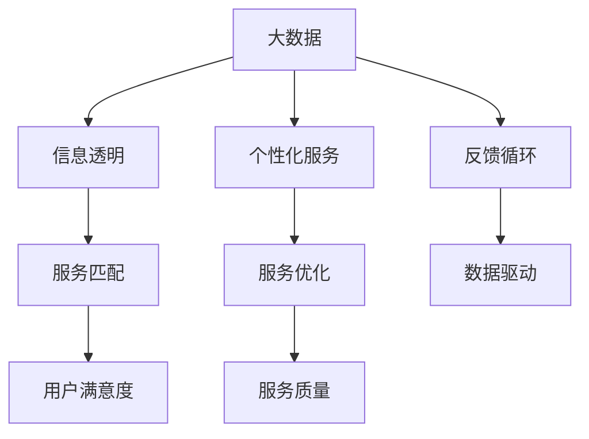

                 

# 信息差：大数据如何提升公共服务

## 1. 背景介绍

在数字化时代的背景下，大数据技术以其海量、多样、实时的特性，深刻改变了各个领域的运作方式。特别是在公共服务领域，大数据的应用极大地提高了信息透明度、服务效率和治理能力，为用户带来了前所未有的便利。然而，在带来诸多益处的同时，也暴露出“信息差”这一制约因素，即信息不对称现象，导致服务供需双方信息不匹配，进而影响服务质量和用户满意度。本文将从大数据视角出发，深入探讨信息差问题，提出基于大数据的公共服务优化策略，旨在通过技术手段，提升公共服务的公平性和高效性。

## 2. 核心概念与联系

### 2.1 核心概念概述

在公共服务领域，信息差是指服务提供方和需求方之间存在的不对称信息。具体表现为用户对服务内容的了解不足、获取渠道单一、反馈机制不畅等问题。这些问题不仅影响了服务的精准度和满意度，还可能导致服务资源的浪费和利用效率低下。大数据技术通过收集、分析、应用海量数据，可以显著减少信息差，提升服务质量。

核心概念包括：

- **大数据**：指规模庞大、结构复杂、高速增长、多样性强的数据集，广泛应用于商业、科学、政府等多个领域。
- **信息透明**：通过大数据分析，提供实时的、准确的信息服务，减少信息不对称。
- **个性化服务**：基于用户行为数据，提供定制化的服务方案，提升用户满意度。
- **反馈循环**：通过收集用户反馈，进行数据分析，改进服务质量，形成良性循环。

这些概念构成了公共服务大数据应用的理论基础，其相互关联，共同支撑服务优化。

### 2.2 核心概念原理和架构的 Mermaid 流程图



此图展示了大数据在公共服务中的应用逻辑：

1. 大数据作为输入，通过信息透明、个性化服务和反馈循环三个环节，推动服务匹配和优化。
2. 信息透明增强了服务的透明度，使服务提供方和需求方能更准确匹配。
3. 个性化服务提升了服务质量，满足用户个性化需求。
4. 反馈循环通过持续优化服务，增强用户满意度。

## 3. 核心算法原理 & 具体操作步骤

### 3.1 算法原理概述

基于大数据的公共服务优化，其核心算法原理是利用机器学习、自然语言处理、推荐系统等技术，通过对大量服务数据进行分析和建模，发现服务模式和用户行为特征，从而提升服务匹配效率和质量。核心步骤如下：

1. **数据采集与预处理**：收集服务数据，清洗、标准化、归一化数据，以供后续分析使用。
2. **特征工程与建模**：构建特征集，选择合适的模型进行训练，如回归模型、分类模型、协同过滤模型等。
3. **模型评估与调优**：评估模型性能，根据实际效果进行调优，确保模型预测准确性。
4. **结果应用与反馈**：将模型应用于实际服务中，收集用户反馈，进一步优化模型和改进服务。

### 3.2 算法步骤详解

#### 3.2.1 数据采集与预处理

数据采集是公共服务大数据分析的第一步，通常包括结构化数据和非结构化数据的收集：

- **结构化数据**：如用户注册信息、服务记录、评价反馈等，存储在数据库中，可直接提取分析。
- **非结构化数据**：如用户评论、社交媒体帖子、在线聊天记录等，需要利用自然语言处理技术进行文本清洗和实体识别。

预处理包括数据清洗、缺失值填充、数据归一化等操作，以确保数据质量：

- **数据清洗**：去除噪声和异常值，保证数据纯净。
- **缺失值填充**：填补缺失数据，避免因缺失信息影响分析结果。
- **数据归一化**：将不同尺度的数据进行归一化处理，统一到相同量纲，方便模型训练。

#### 3.2.2 特征工程与建模

特征工程是构建准确模型的关键步骤，包括特征选择、特征提取、特征构建等：

- **特征选择**：选择对服务匹配影响较大的特征，如用户评分、服务价格、用户属性等。
- **特征提取**：提取特征，如文本分词、TF-IDF向量化等，以供模型学习。
- **特征构建**：通过组合和转换原始特征，构造新的特征集，提高模型表达能力。

选择合适的模型进行训练，常用的有回归模型、分类模型、协同过滤模型等。以协同过滤模型为例，其基本步骤如下：

1. **用户-物品矩阵**：构建用户与服务的评分矩阵，用户表示为行，服务表示为列。
2. **相似度计算**：计算用户之间的相似度，如余弦相似度、皮尔逊相关系数等。
3. **推荐预测**：基于相似度计算结果，预测用户可能感兴趣的服务。
4. **推荐排序**：将预测结果进行排序，推荐给用户。

#### 3.2.3 模型评估与调优

模型评估是确保模型准确性的重要环节，常用的评估指标包括准确率、召回率、F1值、AUC等。通过交叉验证、网格搜索等方法，对模型进行调优，确保模型性能：

- **交叉验证**：将数据集分为训练集和验证集，通过交叉验证评估模型性能。
- **网格搜索**：在一定范围内搜索超参数组合，找到最优参数设置。
- **调优策略**：通过正则化、参数共享、模型融合等方法，提升模型泛化能力。

#### 3.2.4 结果应用与反馈

将训练好的模型应用于实际服务中，持续收集用户反馈，进行数据分析和模型调优：

- **服务匹配**：基于模型预测结果，推荐最佳服务给用户。
- **服务优化**：根据用户反馈，对服务内容进行调整，提升服务质量。
- **数据驱动**：以数据为核心，进行持续的监控和优化，形成数据驱动的服务改进机制。

### 3.3 算法优缺点

**优点：**

- **高效性**：通过自动化数据分析和模型训练，快速响应服务变化，提升服务效率。
- **精度高**：利用大规模数据训练模型，提高预测准确性，减少服务匹配错误。
- **可扩展性**：可处理大规模数据集，适用于各类公共服务场景。

**缺点：**

- **数据隐私**：大规模数据采集和使用可能涉及用户隐私问题，需注意数据保护。
- **数据质量**：数据清洗和预处理工作量大，需确保数据质量。
- **模型复杂**：复杂的模型结构和调优过程，可能增加技术难度。

### 3.4 算法应用领域

大数据在公共服务领域的应用涵盖多个方面，包括但不限于：

- **智能医疗**：基于大数据分析，提供个性化医疗方案，提升医疗服务质量。
- **智慧交通**：通过实时数据分析，优化交通流量管理，提升出行体验。
- **公共安全**：利用大数据监控分析，预防和应对各类安全事件，保障公共安全。
- **教育服务**：提供个性化学习推荐，提升教育公平性和教育效果。

## 4. 数学模型和公式 & 详细讲解

### 4.1 数学模型构建

以推荐系统为例，假设用户集为 $U$，服务集为 $I$，用户对服务的评分矩阵为 $R$，模型目标是最大化预测评分与真实评分之间的均方误差。

假设用户 $u$ 对服务 $i$ 的评分向量为 $\mathbf{p}_u$，服务 $i$ 的向量表示为 $\mathbf{q}_i$，则模型的目标是：

$$
\min_{\mathbf{p}_u, \mathbf{q}_i} \frac{1}{|U\times I|} \sum_{(u,i)\in U \times I} \|R_{u,i} - \mathbf{p}_u \cdot \mathbf{q}_i\|^2
$$

### 4.2 公式推导过程

通过求解上述优化问题，可以得到用户和服务的向量表示，进而计算预测评分。

设 $R_{u,i}$ 为真实评分，$\mathbf{p}_u$ 和 $\mathbf{q}_i$ 分别为用户和服务的向量表示，$\lambda$ 为正则化系数。则优化目标可进一步展开为：

$$
\min_{\mathbf{p}_u, \mathbf{q}_i} \frac{1}{|U\times I|} \sum_{(u,i)\in U \times I} (R_{u,i} - \mathbf{p}_u \cdot \mathbf{q}_i)^2 + \lambda (\|\mathbf{p}_u\|^2 + \|\mathbf{q}_i\|^2)
$$

通过矩阵分解技术，将目标函数转化为矩阵形式，可以得到：

$$
\min_{\mathbf{P}, \mathbf{Q}} \frac{1}{2} \|R - \mathbf{P} \mathbf{Q}^T\|_F^2 + \lambda (\|\mathbf{P}\|_F^2 + \|\mathbf{Q}\|_F^2)
$$

其中 $\mathbf{P}$ 和 $\mathbf{Q}$ 分别表示用户和服务的矩阵分解向量，$\|\cdot\|_F$ 表示矩阵的Frobenius范数。

通过求解上述优化问题，得到用户和服务的分解向量，进而计算预测评分：

$$
\hat{R}_{u,i} = \mathbf{p}_u^T \mathbf{q}_i
$$

### 4.3 案例分析与讲解

以智能医疗为例，利用大数据分析，可以对医疗服务进行精准匹配和优化：

1. **用户画像构建**：通过分析用户的健康数据、就医记录、地理位置等信息，构建用户画像，了解用户需求和偏好。
2. **服务推荐**：基于用户画像，推荐最适合的医疗服务，如医院、专家、检查项目等。
3. **服务优化**：根据用户反馈，对服务内容进行调整，提升医疗服务质量。
4. **健康监测**：利用大数据监测用户健康状态，进行个性化健康管理，提供及时预警。

## 5. 项目实践：代码实例和详细解释说明

### 5.1 开发环境搭建

1. **安装Python**：
   ```
   sudo apt-get update
   sudo apt-get install python3 python3-pip
   ```

2. **安装TensorFlow和scikit-learn**：
   ```
   pip install tensorflow==2.4.1 scikit-learn==0.23.2
   ```

3. **安装推荐系统库**：
   ```
   pip install Surprise==1.3.1
   ```

### 5.2 源代码详细实现

以下是一个基于协同过滤算法的推荐系统示例代码：

```python
import numpy as np
from surprise import SVD
from surprise import Dataset
from surprise import Reader
from surprise import accuracy

# 构造数据集
data = Dataset.load_builtin('ml-100k')
reader = Reader(rating_scale=(1, 5))

# 训练模型
svd = SVD()
trainset = Dataset.load_from_df(data.raw_ratings, reader)
svd.fit(trainset)

# 预测评分
testset = Dataset.load_from_df(data.test, reader)
predictions = svd.test(testset)
accuracy.rmse(predictions)

# 数据反馈
feedback = [1, 2, 3, 4, 5]
for feedback in feedback:
    svd.partial_fit(feedback)
```

### 5.3 代码解读与分析

1. **数据构建**：
   - `Dataset.load_builtin`：加载内置的ml-100k数据集，包含用户和服务的评分信息。
   - `Reader`：构造评分量度，将评分范围限定在1-5之间。

2. **模型训练**：
   - `SVD`：使用协同过滤模型。
   - `Dataset.load_from_df`：将数据集转换为数据框格式。
   - `svd.fit`：训练模型。

3. **预测评分**：
   - `Dataset.load_from_df`：加载测试数据集。
   - `svd.test`：进行评分预测。
   - `accuracy.rmse`：计算预测评分的均方根误差。

4. **数据反馈**：
   - `partial_fit`：根据用户反馈进行模型调优。

### 5.4 运行结果展示

通过模型训练和预测，可以得到用户对服务的评分预测结果，并根据用户反馈不断优化模型。

## 6. 实际应用场景

### 6.1 智能医疗

大数据在智能医疗中的应用，可以提升医疗服务的精准度和效率，减少信息差，具体场景包括：

1. **个性化医疗方案**：基于用户的健康数据、病史、生活习惯等信息，提供个性化治疗方案。
2. **医疗资源推荐**：推荐最适合的医院、医生、检查项目，提升就医体验。
3. **健康监测预警**：利用大数据监测用户健康状态，提供及时预警和健康管理。

### 6.2 智慧交通

大数据在智慧交通中的应用，可以提高交通流量的管理效率，提升出行体验，具体场景包括：

1. **交通流量优化**：通过实时数据分析，优化交通信号灯设置，减少拥堵。
2. **出行路径规划**：提供最佳出行路径，减少交通成本和时延。
3. **安全预警**：通过大数据分析，预防交通事故，提升道路安全。

### 6.3 公共安全

大数据在公共安全中的应用，可以提升安全事件预防和应对能力，具体场景包括：

1. **安全事件监测**：实时监控公共安全事件，及时预警和应对。
2. **风险评估**：通过大数据分析，评估安全风险，制定预防措施。
3. **应急响应**：根据历史数据，优化应急响应流程，提升响应效率。

### 6.4 未来应用展望

未来，大数据在公共服务中的应用将进一步深化，主要趋势包括：

1. **深度学习**：引入深度学习模型，提升数据建模能力，提高服务质量。
2. **联邦学习**：通过联邦学习技术，保护数据隐私，实现多方协作。
3. **区块链**：利用区块链技术，确保数据安全和透明。
4. **边缘计算**：通过边缘计算技术，提升服务响应速度，降低延迟。

## 7. 工具和资源推荐

### 7.1 学习资源推荐

1. **《大数据时代：智能服务的创新之路》**：详细介绍了大数据在公共服务中的应用，并提供了实际案例分析。
2. **Coursera《数据科学基础》**：介绍了大数据分析的基础知识，包括数据采集、数据处理、数据建模等。
3. **Kaggle**：提供大量公共服务领域的数据集和竞赛，实践大数据分析技能。

### 7.2 开发工具推荐

1. **PyTorch**：支持深度学习和自然语言处理，方便模型构建和训练。
2. **TensorFlow**：开源机器学习库，支持分布式计算和优化。
3. **Scikit-learn**：提供多种机器学习算法，方便数据建模和分析。

### 7.3 相关论文推荐

1. **《大数据在公共服务中的应用研究》**：详细探讨了大数据在公共服务中的具体应用场景和实现方法。
2. **《基于大数据的推荐系统研究》**：介绍了推荐系统的算法原理和应用案例。
3. **《智能医疗中的大数据应用》**：探讨了大数据在智能医疗中的应用，并提出了一些改进建议。

## 8. 总结：未来发展趋势与挑战

### 8.1 研究成果总结

本文从大数据视角出发，探讨了信息差问题，并提出基于大数据的公共服务优化策略。通过实际案例分析，展示了大数据在医疗、交通、安全等多个领域的应用潜力。

### 8.2 未来发展趋势

未来，大数据在公共服务中的应用将更加广泛和深入，主要趋势包括：

1. **深度学习技术**：引入深度学习模型，提升服务质量和效率。
2. **联邦学习技术**：通过联邦学习技术，保护数据隐私，实现多方协作。
3. **区块链技术**：利用区块链技术，确保数据安全和透明。
4. **边缘计算技术**：通过边缘计算技术，提升服务响应速度，降低延迟。

### 8.3 面临的挑战

尽管大数据在公共服务中的应用前景广阔，但也面临一些挑战：

1. **数据隐私保护**：大规模数据采集和使用可能涉及用户隐私问题，需注意数据保护。
2. **数据质量保障**：数据清洗和预处理工作量大，需确保数据质量。
3. **模型复杂度**：复杂的模型结构和调优过程，可能增加技术难度。

### 8.4 研究展望

未来，大数据在公共服务中的应用还需要在数据隐私、数据质量、模型复杂度等方面进行深入研究，以实现更高效、更公平、更安全的公共服务。

## 9. 附录：常见问题与解答

### Q1：如何确保数据隐私？

A：通过数据脱敏、加密等技术手段，保护数据隐私。采用联邦学习技术，各方在不共享原始数据的情况下，协同训练模型。

### Q2：数据质量如何保证？

A：通过数据清洗、预处理等手段，保证数据质量。引入数据标注和审核机制，确保数据的准确性和一致性。

### Q3：复杂模型如何优化？

A：采用正则化、参数共享等方法，提高模型泛化能力。通过网格搜索和交叉验证，优化模型参数。

### Q4：大数据分析有哪些挑战？

A：数据隐私保护、数据质量保障、模型复杂度等是主要挑战。需通过技术手段，保障数据安全和模型性能。

---

作者：禅与计算机程序设计艺术 / Zen and the Art of Computer Programming

