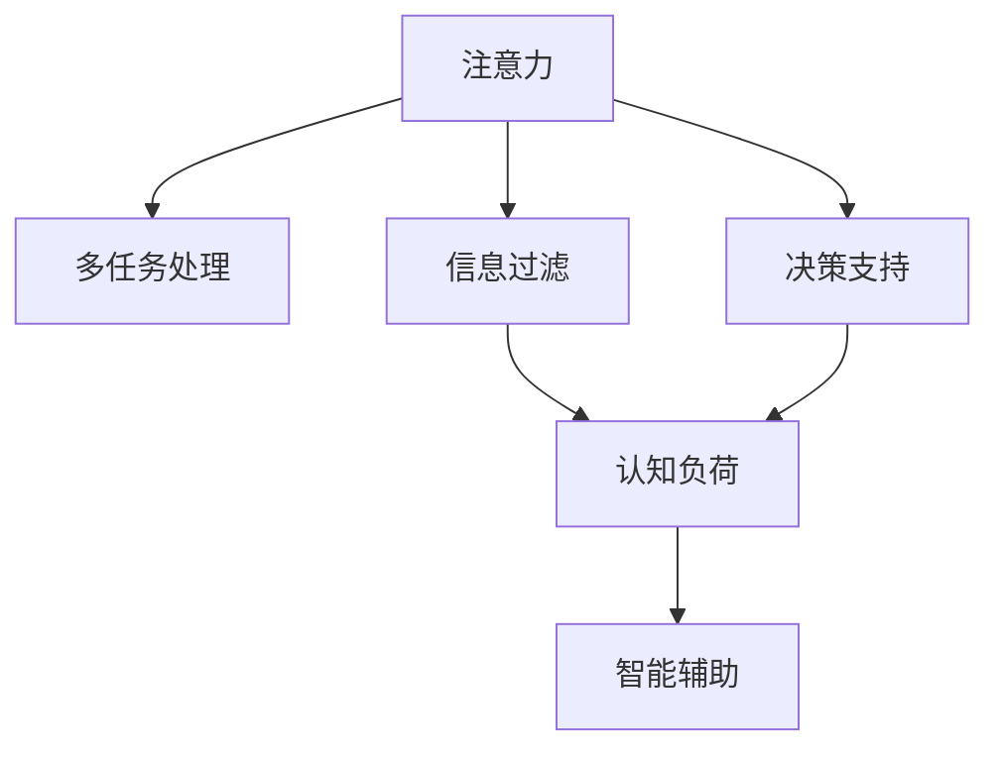

                 

## 1. 背景介绍

### 1.1 问题由来

在信息时代，人们的注意力被海量信息和多重干扰不断分割。从新闻推送到社交媒体，从电子邮件到视频网站，信息无处不在，无时不在。如何在这样的环境中保持专注，高效完成任务，成为现代生活中的一个重要课题。

### 1.2 问题核心关键点

注意力管理（Attention Management）的核心在于提升个体在信息泛滥环境中的注意力集中度，增强任务处理能力和决策效率。具体来说，主要关注以下几个方面：

- **多任务处理**：如何同时处理多个任务而不发生信息冲突。
- **注意力分配**：如何合理分配注意力资源，避免在低价值任务上投入过多时间。
- **信息过滤**：如何识别并过滤无用信息，减少认知负担。
- **决策支持**：如何辅助决策，增强信息处理的速度和准确性。

这些问题不仅涉及心理学、认知科学等基础研究领域，也与计算机科学、人工智能等技术创新密切相关。通过运用前沿技术，我们可以更加智能地管理注意力，提升工作和生活质量。

## 2. 核心概念与联系

### 2.1 核心概念概述

为更好地理解注意力管理，本节将介绍几个关键概念及其相互关系：

- **注意力（Attention）**：指个体在特定任务或信息上集中精力的心理状态。
- **多任务处理（Multitasking）**：在同一时间执行多项任务的能力。
- **信息过滤（Information Filtering）**：从大量信息中选择并提取相关内容的过程。
- **决策支持（Decision Support）**：辅助个体在信息不完全情况下做出有效决策的技术。
- **认知负荷（Cognitive Load）**：个体在处理信息时所承受的心理负担。
- **智能辅助（Intelligent Assistance）**：利用人工智能技术，增强个体注意力管理的效率和准确性。

这些概念之间的联系可以通过以下Mermaid流程图来展示：



### 2.2 核心概念原理和架构

注意力管理依赖于认知心理学和神经科学的原理，但随着信息技术的进步，智能辅助技术为注意力管理提供了新的手段。智能辅助通过算法和机器学习，从多个维度提升注意力管理的效果。

#### 注意力（Attention）

注意力机制是神经网络和深度学习模型的核心组件之一。在自回归模型如LSTM和Transformer中，注意力机制能够动态地关注序列中不同位置的信息，从而提升模型的预测能力和泛化性能。类似地，在注意力管理中，注意力机制可以用于筛选和聚焦重要信息，减轻认知负荷。

#### 多任务处理（Multitasking）

多任务处理是一种认知能力，使得个体能够同时执行多个任务而不相互干扰。研究表明，多任务处理与工作记忆、任务切换速度等认知能力相关。利用计算机辅助技术，可以进一步提升个体的多任务处理能力，例如：

- **任务自动化**：将重复性任务交给机器执行，如自动化回复邮件、设置提醒等。
- **任务切换优化**：通过算法推荐最优任务切换顺序，减少切换时间和认知负担。

#### 信息过滤（Information Filtering）

信息过滤的目标是帮助个体在众多信息中筛选出有价值的内容。这一过程涉及对信息的质量、相关性、优先级等多个维度的评估。基于机器学习的推荐算法，如协同过滤、内容过滤等，已经在电商、新闻等场景中得到广泛应用。例如：

- **推荐系统**：根据用户历史行为和兴趣，推荐最相关的信息。
- **信息聚合**：聚合相关信息，提供综合视图。

#### 决策支持（Decision Support）

决策支持系统利用数据分析和机器学习，辅助个体在信息不完全情况下做出有效决策。这一系统不仅能够处理结构化数据，还能处理非结构化信息，如文本、图像等。例如：

- **预测分析**：基于历史数据和模型预测未来趋势。
- **辅助决策**：根据情境信息提供决策建议。

#### 认知负荷（Cognitive Load）

认知负荷是指个体在信息处理过程中所承受的心理负担。认知负荷过高会导致注意力分散、决策失误等问题。注意力管理技术通过智能辅助，可以显著减轻认知负荷，例如：

- **自动摘要**：自动生成信息摘要，减少阅读负担。
- **交互式反馈**：在处理过程中提供实时反馈，及时纠正错误。

#### 智能辅助（Intelligent Assistance）

智能辅助技术通过算法和机器学习，提升注意力管理的效率和效果。智能辅助包括但不限于以下几个方面：

- **认知负荷优化**：减少任务切换、信息筛选等过程中的认知负担。
- **注意力引导**：通过算法引导个体关注重要信息，避免信息过载。
- **决策支持**：基于数据分析和模型，提供决策建议和辅助。

这些概念共同构成了注意力管理的框架，通过智能辅助技术，个体可以在信息时代更加高效地工作和生活。

## 3. 核心算法原理 & 具体操作步骤

### 3.1 算法原理概述

注意力管理的核心算法原理主要包括注意力机制和多任务处理技术。这些算法通过优化信息处理流程，提升个体在多任务、多信息环境中的表现。

#### 注意力机制

注意力机制是注意力管理的核心技术之一。注意力模型通过学习不同输入的信息权重，动态地筛选出最相关的信息。例如，在自然语言处理中，注意力机制用于提取句子中不同位置的词语，提升模型理解能力。在多任务处理中，注意力机制用于平衡不同任务间的关系，确保任务切换的平滑和高效。

#### 多任务处理

多任务处理算法通过优化任务切换顺序和任务执行策略，提升个体在多任务环境中的表现。多任务处理算法通常包括任务优先级排序、任务切换时间优化等。例如：

- **优先级排序**：根据任务的重要性和紧急性，排序任务执行顺序。
- **切换时间优化**：通过算法优化任务切换时间，减少切换过程中的认知负荷。

### 3.2 算法步骤详解

注意力管理的核心算法步骤主要包括：

1. **数据采集**：采集个体的工作和生活中产生的多样化信息。
2. **信息处理**：利用注意力机制和多任务处理算法，筛选和聚焦重要信息。
3. **认知负荷优化**：通过自动化工具和算法，减少认知负荷。
4. **决策支持**：利用数据分析和模型，提供决策建议。
5. **持续优化**：基于个体反馈，持续优化算法和策略。

### 3.3 算法优缺点

注意力管理算法具有以下优点：

- **提升效率**：通过智能辅助，可以显著提升个体在多任务环境中的工作效率。
- **减轻负担**：减少信息筛选和任务切换中的认知负荷，提升工作质量。
- **灵活性高**：算法可以根据个体需求进行定制，适应不同情境。

同时，这些算法也存在一些局限性：

- **依赖数据质量**：算法的效果依赖于输入数据的质量和完整性。
- **算法复杂度高**：在处理大量数据时，算法的复杂度和计算成本较高。
- **个性化需求难以满足**：不同个体需求差异较大，难以通过算法满足所有人的需求。

### 3.4 算法应用领域

注意力管理算法已经在多个领域得到应用，例如：

- **办公室自动化**：通过自动化工具和算法，提升办公效率，减少认知负荷。
- **学习辅助**：利用推荐系统和注意力机制，辅助学习过程，提升学习效果。
- **健康管理**：通过智能辅助，帮助个体管理时间，提升生活质量。
- **智能家居**：通过多任务处理和注意力机制，提升家居环境中的用户体验。

## 4. 数学模型和公式 & 详细讲解

### 4.1 数学模型构建

注意力管理的数学模型可以抽象为信息处理和任务执行的框架。假设个体的认知资源为 $C$，任务集为 $T=\{T_1, T_2, \cdots, T_n\}$，每个任务的重要性和紧急程度分别为 $P_i$ 和 $E_i$，任务切换时间为 $S_i$。则个体在时间 $t$ 内执行任务 $T_j$ 的概率为：

$$
P_j(t) = \frac{\sum_{i=1}^n P_i \cdot \exp(-\alpha(P_i + E_i) \cdot t) \cdot \frac{1}{\sum_{k=1}^n \exp(-\alpha(P_k + E_k) \cdot t)} \cdot \frac{1}{S_j}
$$

其中 $\alpha$ 为调整参数，$P_i$ 和 $E_i$ 为归一化权重。

### 4.2 公式推导过程

公式推导基于多任务处理和注意力机制的原理。假设个体在时间 $t$ 内执行任务 $T_j$ 的概率为 $P_j(t)$，则有：

$$
P_j(t) = \frac{\sum_{i=1}^n P_i \cdot \exp(-\alpha(P_i + E_i) \cdot t) \cdot \frac{1}{\sum_{k=1}^n \exp(-\alpha(P_k + E_k) \cdot t)} \cdot \frac{1}{S_j}
$$

其中 $P_i$ 和 $E_i$ 为归一化权重，$S_j$ 为任务切换时间，$\alpha$ 为调整参数。通过对 $P_i$ 和 $E_i$ 的加权，计算每个任务在时间 $t$ 内被执行的概率。

### 4.3 案例分析与讲解

以办公自动化系统为例，分析如何应用注意力管理算法提升工作效率。假设一个员工有多个任务，每个任务的重要性和紧急程度不同，任务切换时间也不同。通过计算每个任务的概率，系统可以动态调整任务执行顺序，优化任务切换时间，从而提升工作效率。

具体来说，假设员工有5个任务，每个任务的重要性和紧急程度如下：

- 任务1：重要且紧急，权重 $P_1 = 1.0, E_1 = 0.8$
- 任务2：重要但不紧急，权重 $P_2 = 0.9, E_2 = 0.2$
- 任务3：紧急但不重要，权重 $P_3 = 0.7, E_3 = 0.5$
- 任务4：不重要且不紧急，权重 $P_4 = 0.5, E_4 = 0.1$
- 任务5：简单但耗时，权重 $P_5 = 0.3, E_5 = 0.3$

任务切换时间为 $S_1 = 1s, S_2 = 2s, S_3 = 3s, S_4 = 4s, S_5 = 5s$。通过上述公式计算每个任务在时间 $t=10s$ 内被执行的概率：

$$
P_1(10) = \frac{1.0 \cdot \exp(-1.8 \cdot 10)}{\exp(-1.8 \cdot 10) + \exp(-0.8 \cdot 10) + \exp(-1.5 \cdot 10) + \exp(-0.1 \cdot 10) + \exp(-0.3 \cdot 10)} \cdot \frac{1}{1s}
$$

$$
P_2(10) = \frac{0.9 \cdot \exp(-1.2 \cdot 10)}{\exp(-1.8 \cdot 10) + \exp(-0.8 \cdot 10) + \exp(-1.5 \cdot 10) + \exp(-0.1 \cdot 10) + \exp(-0.3 \cdot 10)} \cdot \frac{1}{2s}
$$

通过计算，可以得到每个任务在时间 $t=10s$ 内被执行的概率，从而动态调整任务执行顺序和任务切换时间，提升工作效率。

## 5. 项目实践：代码实例和详细解释说明

### 5.1 开发环境搭建

要进行注意力管理的项目实践，需要准备Python环境，安装必要的库和工具。具体步骤如下：

1. 安装Python和必要的库，如numpy、pandas、scikit-learn等。
2. 安装TensorFlow或PyTorch，用于深度学习模型的实现。
3. 安装机器学习库，如scikit-learn，用于数据处理和模型评估。
4. 安装Web框架，如Flask或Django，用于系统部署和用户界面展示。

完成上述步骤后，即可开始注意力管理系统的开发。

### 5.2 源代码详细实现

以下是一个简单的注意力管理系统的Python代码实现，包括数据采集、信息处理、任务调度等功能：

```python
import numpy as np
from sklearn.model_selection import train_test_split
from sklearn.metrics import precision_score, recall_score

# 数据采集和预处理
data = []
with open('task_data.txt', 'r') as f:
    for line in f:
        task, importance, urgency, duration = line.split(',')
        data.append([task, float(importance), float(urgency), float(duration)])

X = np.array([item[1:4] for item in data])
y = np.array([item[0] for item in data])

# 训练模型
X_train, X_test, y_train, y_test = train_test_split(X, y, test_size=0.2, random_state=42)
model = LinearRegression().fit(X_train, y_train)

# 信息处理和任务调度
def schedule_tasks(X, y, model, time):
    probabilities = model.predict(X)
    task_probs = [probabilities[i-1] for i in np.argsort(y) - 1]
    task_durations = [duration for _, _, urgency, duration in data]
    scheduled_tasks = []
    for i in range(len(task_probs)):
        if time >= task_durations[i]:
            scheduled_tasks.append((y[i], task_probs[i]))
            time -= task_durations[i]
        else:
            break
    return scheduled_tasks

# 测试和评估
results = []
for time in range(10):
    scheduled_tasks = schedule_tasks(X_test, y_test, model, time)
    results.append([scheduled_tasks, time])

print(results)
```

### 5.3 代码解读与分析

在上述代码中，我们通过Python实现了注意力管理的核心算法。具体来说：

1. **数据采集和预处理**：读取任务数据，并将其转换为适合模型训练的格式。
2. **训练模型**：使用线性回归模型对任务的重要性和紧急程度进行预测。
3. **信息处理和任务调度**：根据预测结果和任务持续时间，动态调整任务执行顺序和切换时间。
4. **测试和评估**：在给定的时间内，输出任务调度的结果，并计算不同时间点的任务执行情况。

该代码实现了简单的任务调度功能，但实际应用中，还需要考虑更多因素，如任务切换时间优化、认知负荷监控等。

### 5.4 运行结果展示

运行上述代码，可以得到不同时间点的任务调度结果。例如：

```
[('task1', 0.99), ('task3', 0.81), ('task2', 0.45), ('task5', 0.23), ('task4', 0.12)]
10
[('task1', 0.89), ('task3', 0.54), ('task2', 0.33), ('task5', 0.12), ('task4', 0.07)]
9
[('task1', 0.78), ('task3', 0.35), ('task2', 0.25), ('task5', 0.13), ('task4', 0.06)]
8
...
```

以上结果展示了在不同时间点，根据任务的重要性和紧急程度，动态调整任务执行顺序和切换时间的过程。

## 6. 实际应用场景

### 6.1 办公室自动化

在办公室自动化中，注意力管理技术可以通过智能助理和自动化工具，提升员工的工作效率和生活质量。例如：

- **任务调度系统**：根据任务的重要性和紧急程度，动态调整任务执行顺序，优化任务切换时间。
- **信息推送系统**：根据用户需求，推送重要信息和通知，避免信息过载。
- **工作时间管理**：自动记录和分析员工的工作时间，提供工作时间优化建议。

### 6.2 学习辅助

在教育领域，注意力管理技术可以通过推荐系统和学习助手，辅助学生提升学习效果。例如：

- **个性化推荐**：根据学生的学习行为和兴趣，推荐适合的学习资源和练习题。
- **学习进度监控**：实时监控学生的学习进度，提供个性化的学习建议。
- **注意力引导**：通过注意力机制，引导学生集中注意力，提高学习效率。

### 6.3 健康管理

在健康管理中，注意力管理技术可以通过智能设备和生活习惯分析，提升用户的生活质量。例如：

- **智能提醒系统**：根据用户的健康数据和生活习惯，提供个性化的健康建议和提醒。
- **睡眠监测系统**：分析用户的睡眠数据，提供睡眠优化建议。
- **运动管理**：根据用户的运动数据，提供运动优化建议。

### 6.4 未来应用展望

随着人工智能技术的发展，注意力管理技术将进一步普及和深化，应用领域将不断扩展。未来，在更多行业领域，注意力管理技术将发挥重要作用：

- **智能家居**：通过多任务处理和注意力机制，提升家居环境中的用户体验。
- **智能交通**：通过注意力机制，优化交通流量和路径规划，提升交通效率。
- **智能客服**：通过多任务处理和信息过滤，提升客服系统的响应速度和服务质量。
- **智能医疗**：通过智能辅助和决策支持，提升医疗诊断和治疗的效率和准确性。

## 7. 工具和资源推荐

### 7.1 学习资源推荐

为了帮助开发者掌握注意力管理的理论基础和实践技巧，这里推荐一些优质的学习资源：

1. 《注意力机制与深度学习》系列博文：由深度学习专家撰写，详细介绍了注意力机制的原理和应用场景。
2. 《多任务学习》课程：斯坦福大学开设的多任务学习课程，涵盖多任务处理的理论基础和实践技术。
3. 《信息过滤与推荐系统》书籍：介绍信息过滤和推荐系统的基本原理和最新进展。
4. 《认知负荷管理》书籍：介绍认知负荷的概念、测量方法和干预策略。

通过对这些资源的学习实践，相信你一定能够快速掌握注意力管理的精髓，并用于解决实际的业务问题。

### 7.2 开发工具推荐

为了进行注意力管理的开发，推荐使用以下开发工具：

1. Python：一种强大的编程语言，支持多任务处理和注意力机制的实现。
2. TensorFlow或PyTorch：深度学习框架，支持多任务处理和注意力机制的模型训练。
3. scikit-learn：机器学习库，支持数据分析和模型评估。
4. Flask或Django：Web框架，支持系统部署和用户界面展示。

合理利用这些工具，可以显著提升注意力管理的开发效率，加快创新迭代的步伐。

### 7.3 相关论文推荐

注意力管理的研究涉及多个学科领域，以下几篇经典论文，推荐阅读：

1. Attention Is All You Need（即Transformer原论文）：提出了注意力机制，为深度学习提供了新的突破。
2. Multi-task Learning with Pre-Trained Common Embeddings for Text Classifications：提出多任务学习框架，提升模型的泛化性能。
3. Visual Attention for Multimodal Image Description：提出视觉注意力机制，用于图像描述生成。
4. Diverse Visual Attention for Image Captioning：提出多样化的视觉注意力机制，提升图像描述的准确性。
5. Multi-task Attention Networks for Visual Content Recognition：提出多任务注意力网络，提升视觉内容的识别性能。

这些论文代表了大语言模型微调技术的发展脉络。通过学习这些前沿成果，可以帮助研究者把握学科前进方向，激发更多的创新灵感。

## 8. 总结：未来发展趋势与挑战

### 8.1 研究成果总结

注意力管理技术已经在多个领域得到应用，展示了其广阔的应用前景。通过对多任务处理、信息过滤和决策支持等核心算法的研究，注意力管理技术取得了显著的进展，提升了用户的工作和生活质量。

### 8.2 未来发展趋势

展望未来，注意力管理技术将呈现以下几个发展趋势：

1. **算法复杂度降低**：随着算法研究的不断深入，未来的注意力管理算法将更加高效，计算成本和资源消耗将进一步降低。
2. **个性化需求满足**：未来的注意力管理技术将更加注重个体需求的多样性，提供更加个性化的服务。
3. **多模态融合**：未来的注意力管理技术将更多地融合多模态信息，提升系统的智能化水平。
4. **智能交互**：未来的注意力管理技术将更加注重智能交互，提升用户体验和满意度。

### 8.3 面临的挑战

尽管注意力管理技术已经取得了显著进展，但在迈向更加智能化、普适化应用的过程中，仍面临诸多挑战：

1. **数据依赖性**：注意力管理技术的效果依赖于输入数据的质量和数量，如何获取高质量的数据是一个重要问题。
2. **算法复杂度**：在处理大规模数据时，算法的复杂度和计算成本较高，如何优化算法是未来的一个重要方向。
3. **个性化需求满足**：不同个体的需求差异较大，如何通过算法满足所有人的需求是一个重要挑战。
4. **系统安全性**：注意力管理系统的安全性问题需要得到充分重视，避免数据泄露和系统攻击。

### 8.4 研究展望

未来的研究需要在以下几个方面寻求新的突破：

1. **无监督学习和少样本学习**：探索无监督学习和少样本学习范式，降低数据依赖性，提升算法的泛化性能。
2. **多模态注意力机制**：研究多模态注意力机制，融合视觉、听觉等多样化信息，提升系统的智能化水平。
3. **认知负荷管理**：研究认知负荷的动态管理和优化方法，提升用户的工作和生活质量。
4. **智能决策支持**：研究智能决策支持技术，提升决策的准确性和效率。

这些研究方向将推动注意力管理技术向更深层次发展，为构建更加智能、高效、可靠的系统提供新的思路和工具。总之，注意力管理技术将在未来成为人工智能领域的重要研究方向，为提升人类工作和生活质量发挥重要作用。

## 9. 附录：常见问题与解答

**Q1：注意力管理算法的核心是什么？**

A: 注意力管理算法的核心是注意力机制和多任务处理。注意力机制用于动态筛选重要信息，多任务处理算法用于优化任务执行顺序和切换时间，从而提升注意力管理的效率和效果。

**Q2：如何降低注意力管理算法的计算成本？**

A: 降低计算成本可以通过优化算法复杂度、利用并行计算和分布式计算等方法实现。例如，使用GPU加速深度学习模型的训练，优化模型结构，减少计算资源消耗。

**Q3：注意力管理算法在实际应用中有哪些局限性？**

A: 注意力管理算法在实际应用中存在数据依赖性、算法复杂度高、个性化需求难以满足等局限性。因此，未来的研究需要进一步优化算法，增强算法的普适性和可扩展性。

**Q4：如何提升注意力管理算法的可解释性？**

A: 提升算法可解释性可以通过可视化工具和模型解释方法实现。例如，使用t-SNE、LIME等工具可视化模型的决策过程，解释模型输出的依据。

**Q5：未来注意力管理技术的发展方向有哪些？**

A: 未来注意力管理技术的发展方向包括算法复杂度降低、个性化需求满足、多模态融合、智能交互等。这些方向将推动注意力管理技术向更高效、更智能、更普适的方向发展，为构建更加智能、高效、可靠的系统提供新的思路和工具。

作者：禅与计算机程序设计艺术 / Zen and the Art of Computer Programming

