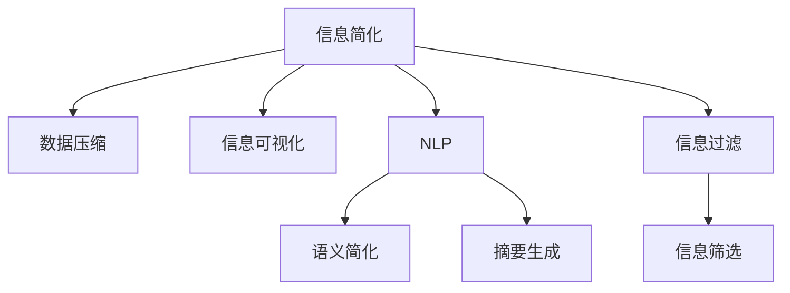

                 

# 信息简化的力量与局限性：如何在复杂中找到简单

## 1. 背景介绍

### 1.1 问题由来

在当今的信息时代，数据和知识的爆炸式增长带来了前所未有的便利，但同时也给人们带来了新的挑战。信息过载导致人们难以处理海量信息，甚至造成认知负荷过大，进而影响决策和判断。信息简化的需求由此诞生，旨在通过精简、提炼的方式，将复杂的信息转化为易于理解和利用的形式。

### 1.2 问题核心关键点

信息简化的本质是通过将复杂信息转化为更简洁、更易于理解的形式，提高信息传递效率和决策质量。它涉及以下关键点：

1. **数据压缩算法**：通过编码方法减少数据量，常见算法如霍夫曼编码、LZ77、LZ78等。
2. **信息可视化**：使用图表、图形等方式，直观展示复杂信息结构。
3. **语义简化**：通过自然语言处理技术，将复杂概念和文本简化为易于理解的短语或句子。
4. **摘要生成**：从长篇文本中自动抽取关键信息，生成简洁摘要。
5. **信息筛选与过滤**：通过算法和模型，从海量信息中筛选出最相关的部分。

这些方法不仅在技术上有较高的要求，更需要在实际应用中不断迭代和优化，才能真正发挥信息简化的作用。

### 1.3 问题研究意义

信息简化技术的研发，不仅有助于解决信息过载问题，提高信息处理效率，还能在教育、医疗、金融等多个领域发挥重要作用。例如，在教育领域，信息简化技术可以帮助学生更快地掌握知识，提高学习效果；在医疗领域，简化复杂病例信息，帮助医生快速诊断；在金融领域，简化金融报表信息，帮助投资者进行更精准的决策。

## 2. 核心概念与联系

### 2.1 核心概念概述

为更好地理解信息简化的核心概念，本节将介绍几个密切相关的核心概念：

- **信息简化**：将复杂信息转化为简洁、易于理解的形式，提高信息传递效率和决策质量。
- **数据压缩**：通过算法减少数据量，但保持原有信息的完整性和可恢复性。
- **信息可视化**：使用图表、图形等方式，直观展示复杂信息结构。
- **自然语言处理(NLP)**：使用计算技术处理和分析自然语言，包括语义简化、摘要生成等任务。
- **摘要生成**：自动从长篇文本中提取关键信息，生成简洁摘要。
- **信息过滤与筛选**：通过算法和模型，从海量信息中筛选出最相关的部分。

这些核心概念之间的逻辑关系可以通过以下Mermaid流程图来展示：



这个流程图展示了几大核心概念之间的联系：

1. 信息简化通过数据压缩、信息可视化、自然语言处理等手段，实现复杂信息的简化。
2. 语义简化和摘要生成是NLP技术在信息简化中的重要应用。
3. 信息筛选与过滤通过算法和模型，帮助找到相关信息，是信息简化的前置步骤。

## 3. 核心算法原理 & 具体操作步骤
### 3.1 算法原理概述

信息简化技术的核心在于将复杂信息转化为简洁、易于理解的形式。这一过程涉及信息压缩、信息可视化、自然语言处理等多个方面。

### 3.2 算法步骤详解

#### 3.2.1 数据压缩算法

数据压缩算法旨在通过编码方法减少数据量，常见算法包括霍夫曼编码、LZ77、LZ78等。

- **霍夫曼编码**：通过构建一棵霍夫曼树，将字符映射为二进制编码，实现数据压缩。
- **LZ77算法**：使用字典表存储已出现的数据段，实现压缩。
- **LZ78算法**：构建前缀树，对数据进行分块编码，实现压缩。

#### 3.2.2 信息可视化算法

信息可视化算法使用图表、图形等方式，直观展示复杂信息结构。

- **树状图**：用于展示层级结构，如文件目录、组织架构等。
- **散点图**：用于展示数值型数据的分布和关系。
- **热力图**：用于展示数据的空间分布和密度。

#### 3.2.3 语义简化算法

语义简化算法通过自然语言处理技术，将复杂概念和文本简化为易于理解的短语或句子。

- **词向量**：将文本中的单词映射为低维向量，便于计算和理解。
- **主题模型**：如LDA（Latent Dirichlet Allocation），将文本中的主题进行分解和重构。
- **句法分析**：通过句法分析，简化句子结构和内容。

#### 3.2.4 摘要生成算法

摘要生成算法自动从长篇文本中提取关键信息，生成简洁摘要。

- **基于规则的摘要**：通过人工定义规则，提取重要段落和句子。
- **基于统计的摘要**：通过统计词频和句子的重要性，自动生成摘要。
- **基于深度学习的摘要**：使用Transformer模型等深度学习技术，自动生成摘要。

#### 3.2.5 信息过滤与筛选算法

信息过滤与筛选算法通过算法和模型，从海量信息中筛选出最相关的部分。

- **关键词过滤**：通过匹配关键词，筛选出相关文档。
- **机器学习筛选**：使用分类算法，训练模型筛选出有用信息。
- **主题模型筛选**：通过主题模型，筛选出与特定主题相关的文档。

### 3.3 算法优缺点

信息简化技术具有以下优点：

1. **提高信息处理效率**：通过压缩、可视化等手段，可以快速获取关键信息。
2. **提升决策质量**：简化信息减少了认知负荷，有助于更清晰地理解问题。
3. **降低数据存储成本**：数据压缩和可视化减少了数据量，降低了存储需求。

同时，该技术也存在一些局限性：

1. **信息丢失风险**：压缩和简化过程中可能丢失部分信息，影响信息的完整性。
2. **算法复杂性**：一些算法如深度学习模型，需要大量计算资源和时间。
3. **个性化需求不足**：通用算法可能无法满足特定领域或用户的个性化需求。
4. **数据隐私问题**：压缩和可视化过程中可能涉及敏感信息泄露。

尽管存在这些局限性，信息简化技术仍在各个领域得到广泛应用，成为信息处理和决策支持的重要工具。

### 3.4 算法应用领域

信息简化技术在多个领域有广泛应用，包括但不限于：

- **教育**：简化教学内容，帮助学生更高效地学习。
- **医疗**：简化病例信息，帮助医生更快地诊断。
- **金融**：简化报表信息，帮助投资者进行更精准的决策。
- **新闻**：自动生成新闻摘要，提高新闻阅读效率。
- **社交媒体**：过滤和筛选信息，减少信息过载。
- **科学研究**：简化研究数据，便于数据共享和协作。

## 4. 数学模型和公式 & 详细讲解 & 举例说明

### 4.1 数学模型构建

信息简化技术涉及多个领域的数学模型，本节以自然语言处理（NLP）中的语义简化和摘要生成为例，详细讲解其数学模型。

### 4.2 公式推导过程

#### 4.2.1 词向量模型

词向量模型通过将单词映射为低维向量，捕捉单词之间的语义关系。其中，Word2Vec和GloVe是两种常见的词向量模型。

- **Word2Vec**：通过训练神经网络，将单词映射为向量。公式为：
  $$
  \mathbf{v}(w) = \sum_{i=1}^n w_i\mathbf{u}_i
  $$
  其中，$w$为单词，$\mathbf{u}_i$为神经网络中第$i$层的输出向量。

- **GloVe**：通过矩阵分解，将单词与上下文共现频率矩阵分解为低维向量。公式为：
  $$
  \mathbf{v}(w) = \sum_{i=1}^n w_i\mathbf{u}_i
  $$
  其中，$w$为单词，$\mathbf{u}_i$为GloVe模型中的第$i$个主题向量。

#### 4.2.2 摘要生成模型

摘要生成模型通过深度学习技术，自动从长篇文本中生成简洁摘要。以Seq2Seq模型为例，其基本架构为：

- **编码器**：将文本转换为向量表示。
- **解码器**：根据向量生成摘要。
- **注意力机制**：帮助解码器关注输入文本中的关键信息。

### 4.3 案例分析与讲解

#### 4.3.1 新闻摘要生成

以CNN/Daily Mail新闻数据集为例，展示Seq2Seq模型进行新闻摘要生成的过程。

1. **数据准备**：将新闻文本和摘要作为训练数据。
2. **模型构建**：搭建Seq2Seq模型，包括编码器和解码器。
3. **训练**：使用训练数据训练模型。
4. **测试**：使用测试数据评估模型性能。
5. **应用**：使用模型生成新文本的摘要。

#### 4.3.2 文本分类

以IMDB电影评论数据集为例，展示NLP技术在文本分类中的应用。

1. **数据准备**：将电影评论分为正面和负面两类。
2. **模型构建**：搭建BERT或LSTM模型，进行情感分类。
3. **训练**：使用训练数据训练模型。
4. **测试**：使用测试数据评估模型性能。
5. **应用**：使用模型对新评论进行情感分类。

## 5. 项目实践：代码实例和详细解释说明

### 5.1 开发环境搭建

在进行信息简化项目开发前，需要先搭建好开发环境。以下是使用Python进行TensorFlow和Keras开发的环境配置流程：

1. 安装Anaconda：从官网下载并安装Anaconda，用于创建独立的Python环境。

2. 创建并激活虚拟环境：
```bash
conda create -n tensorflow-env python=3.7
conda activate tensorflow-env
```

3. 安装TensorFlow和Keras：
```bash
conda install tensorflow -c conda-forge
pip install keras
```

4. 安装各类工具包：
```bash
pip install numpy pandas scikit-learn matplotlib tqdm jupyter notebook ipython
```

完成上述步骤后，即可在`tensorflow-env`环境中开始项目开发。

### 5.2 源代码详细实现

这里我们以文本分类任务为例，给出使用TensorFlow和Keras进行信息简化的代码实现。

```python
from tensorflow import keras
from keras.layers import Embedding, LSTM, Dense
from keras.models import Sequential

# 构建模型
model = Sequential([
    Embedding(input_dim=10000, output_dim=64, input_length=100),
    LSTM(64, dropout=0.2, recurrent_dropout=0.2),
    Dense(1, activation='sigmoid')
])

# 编译模型
model.compile(optimizer='adam', loss='binary_crossentropy', metrics=['accuracy'])

# 训练模型
model.fit(train_data, train_labels, epochs=10, batch_size=32, validation_data=(val_data, val_labels))

# 测试模型
test_loss, test_acc = model.evaluate(test_data, test_labels)
print('Test accuracy:', test_acc)
```

以上代码展示了使用TensorFlow和Keras搭建的文本分类模型。模型包括嵌入层、LSTM层和输出层，使用二元交叉熵损失函数和Adam优化器进行训练和评估。

### 5.3 代码解读与分析

让我们再详细解读一下关键代码的实现细节：

**Embedding层**：
- 将输入的文本映射为低维向量表示，其中`input_dim`为词汇表大小，`output_dim`为向量维度，`input_length`为输入序列长度。

**LSTM层**：
- 使用LSTM网络进行文本建模，`dropout`和`recurrent_dropout`参数用于正则化，防止过拟合。

**Dense层**：
- 输出层使用 sigmoid 激活函数，将文本分类为正面或负面。

**编译和训练**：
- `compile`方法设置模型的优化器、损失函数和评估指标。
- `fit`方法使用训练数据训练模型，`epochs`和`batch_size`参数控制训练轮数和批次大小。
- `evaluate`方法评估模型在测试数据上的性能。

**测试和应用**：
- 使用`evaluate`方法评估模型在测试数据上的准确率。

可以看到，TensorFlow和Keras提供了强大的工具库，使得模型搭建和训练过程变得简洁高效。开发者可以将更多精力放在模型优化和应用场景分析上，而不必过多关注底层实现细节。

## 6. 实际应用场景

### 6.1 智能推荐系统

信息简化技术在智能推荐系统中有广泛应用，可以提升推荐效率和效果。

- **数据压缩**：通过压缩推荐数据，减少服务器存储和传输开销。
- **信息可视化**：通过图表展示用户偏好和行为数据，帮助推荐算法分析用户兴趣。
- **摘要生成**：从用户评价和反馈中自动提取关键信息，生成简洁摘要。

### 6.2 自然语言处理

信息简化技术在自然语言处理中有多种应用，如机器翻译、文本摘要、情感分析等。

- **机器翻译**：将长文本压缩为简洁摘要，提高翻译速度和效率。
- **文本摘要**：自动从长文本中提取关键信息，生成简洁摘要。
- **情感分析**：通过简化情感词汇和表达方式，提高情感分类准确率。

### 6.3 医疗诊断系统

信息简化技术在医疗诊断中有重要应用，可以提升诊断效率和准确性。

- **数据压缩**：通过压缩医疗影像和报告，减少存储空间和传输时间。
- **信息可视化**：使用图表展示病历数据，帮助医生快速诊断。
- **摘要生成**：自动从病历中提取关键信息，生成简洁摘要。

## 7. 工具和资源推荐

### 7.1 学习资源推荐

为了帮助开发者系统掌握信息简化的理论基础和实践技巧，这里推荐一些优质的学习资源：

1. **《深度学习》课程**：斯坦福大学开设的深度学习课程，涵盖机器学习和深度学习的基本概念和算法。
2. **《自然语言处理》课程**：MIT开设的自然语言处理课程，介绍NLP的常用技术和方法。
3. **《机器学习实战》书籍**：介绍机器学习算法的实践应用，包括数据预处理、模型训练等。
4. **Kaggle平台**：提供丰富的数据集和竞赛，帮助开发者实践和检验算法。
5. **GitHub代码库**：提供开源项目和代码库，便于学习和借鉴。

通过对这些资源的学习实践，相信你一定能够快速掌握信息简化的精髓，并用于解决实际的NLP问题。

### 7.2 开发工具推荐

高效的开发离不开优秀的工具支持。以下是几款用于信息简化开发的常用工具：

1. **TensorFlow**：开源的深度学习框架，支持分布式计算和GPU加速，适合大规模工程应用。
2. **Keras**：高层神经网络API，易于使用，适合快速原型开发。
3. **Matplotlib**：绘图库，用于可视化结果和模型性能。
4. **NLTK**：自然语言处理工具包，提供各种文本处理和分析功能。
5. **Jupyter Notebook**：交互式开发环境，便于代码测试和调试。

合理利用这些工具，可以显著提升信息简化任务的开发效率，加快创新迭代的步伐。

### 7.3 相关论文推荐

信息简化技术的研发源于学界的持续研究。以下是几篇奠基性的相关论文，推荐阅读：

1. **《NEWSFEED: A Probabilistic Topic Model for Conversations》**：提出LDA模型，用于分析社交媒体数据。
2. **《Deep Learning for NLP》**：介绍深度学习在自然语言处理中的应用，包括摘要生成和文本分类等任务。
3. **《TensorFlow for Deep Learning》**：介绍TensorFlow框架的使用方法，涵盖深度学习模型的训练和部署。
4. **《Attention is All You Need》**：提出Transformer模型，用于机器翻译和文本生成任务。

这些论文代表了大语言模型微调技术的发展脉络。通过学习这些前沿成果，可以帮助研究者把握学科前进方向，激发更多的创新灵感。

## 8. 总结：未来发展趋势与挑战

### 8.1 总结

本文对信息简化的核心概念和应用进行了全面系统的介绍。首先阐述了信息简化的背景和意义，明确了其重要性。其次，从原理到实践，详细讲解了信息简化的数学模型和操作步骤，给出了项目开发的完整代码实例。同时，本文还广泛探讨了信息简化的应用场景，展示了其广泛的应用潜力。

通过本文的系统梳理，可以看到，信息简化技术的研发不仅需要深厚的数学和算法基础，还需要不断优化和迭代。信息简化为复杂信息处理和决策支持提供了新的方法和工具，但如何将简化后的信息与现实应用场景有效结合，仍然是一个需要深入探索的问题。

### 8.2 未来发展趋势

展望未来，信息简化技术将呈现以下几个发展趋势：

1. **自动化程度提高**：自动化算法和工具将使得信息简化过程更加高效。
2. **多模态融合**：信息简化将融合视觉、听觉等多种模态，提升综合分析能力。
3. **边缘计算**：信息简化将在边缘设备上部署，实现实时处理和分析。
4. **个性化需求满足**：信息简化将更多关注个性化需求，提供定制化服务。
5. **隐私保护加强**：信息简化将更加重视数据隐私和安全。

以上趋势凸显了信息简化技术的广阔前景。这些方向的探索发展，必将进一步提升信息处理效率和决策质量，为各个领域带来新的应用和机遇。

### 8.3 面临的挑战

尽管信息简化技术已经取得了显著进展，但在迈向更加智能化、普适化应用的过程中，它仍面临着诸多挑战：

1. **数据质量和多样性**：不同领域和任务的数据质量和多样性可能存在较大差异，影响简化效果。
2. **算法复杂性和计算资源**：一些信息简化的算法和模型需要大量的计算资源和时间。
3. **个性化需求**：通用算法可能无法满足特定领域或用户的个性化需求。
4. **隐私和伦理问题**：信息简化过程中可能涉及敏感信息泄露和伦理问题。

尽管存在这些挑战，信息简化技术仍在各个领域得到广泛应用，成为信息处理和决策支持的重要工具。

### 8.4 研究展望

面对信息简化技术面临的种种挑战，未来的研究需要在以下几个方面寻求新的突破：

1. **自动化和智能化**：开发更加自动化的算法和工具，提升信息简化的效率和效果。
2. **多模态融合**：将信息简化技术与视觉、听觉等多种模态融合，提升综合分析能力。
3. **个性化需求**：开发更多关注个性化需求的算法和模型，满足特定领域或用户的需求。
4. **隐私保护**：加强信息简化过程中的隐私保护和安全措施，确保数据隐私。

这些研究方向的探索，必将引领信息简化技术迈向更高的台阶，为构建智能系统和提升决策质量提供新的方法和工具。

## 9. 附录：常见问题与解答

**Q1：信息简化是否适用于所有数据类型？**

A: 信息简化技术主要适用于文本、图像、视频等多种数据类型。对于音频、图形等非文本数据，需要进行预处理和转换。

**Q2：如何选择合适的信息简化算法？**

A: 选择合适的信息简化算法需要考虑数据类型、应用场景和资源限制等因素。常见算法包括数据压缩、信息可视化、自然语言处理等。

**Q3：信息简化过程中如何保证信息完整性？**

A: 信息简化过程中需要平衡压缩和完整性。可以通过控制压缩率、使用多种压缩算法等方式，在保持信息完整性的同时，提高压缩效率。

**Q4：信息简化在实际应用中需要注意哪些问题？**

A: 信息简化在实际应用中需要注意数据隐私、算法复杂性、资源限制等问题。需要进行适当的调整和优化，以适应实际应用场景。

**Q5：如何评价信息简化的效果？**

A: 信息简化的效果可以通过对比原始数据和简化后的数据进行评估。常见评价指标包括数据大小、存储成本、计算效率等。

通过本文的系统梳理，可以看到，信息简化技术的研发不仅需要深厚的数学和算法基础，还需要不断优化和迭代。信息简化为复杂信息处理和决策支持提供了新的方法和工具，但如何将简化后的信息与现实应用场景有效结合，仍然是一个需要深入探索的问题。未来，随着技术的不断进步和应用的深入拓展，信息简化技术必将在各个领域发挥更大的作用。

