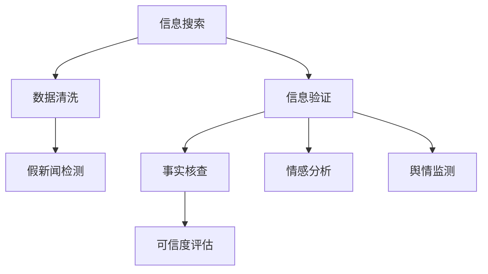

                 

# 信息验证和信息搜索技术实践：在信息海洋中找到可靠的信息

> 关键词：信息验证, 信息搜索, 数据清洗, 假新闻, 搜索引擎优化(SES), 自然语言处理(NLP)

## 1. 背景介绍

### 1.1 问题由来
信息时代，我们每天都会接触到海量的数据和信息。这些信息可能来自各种渠道：社交媒体、新闻网站、论坛、博客、电子邮件、PDF文档等。然而，这些信息的质量和可靠性往往参差不齐，甚至存在大量虚假、误导性信息，即假新闻（fake news）。

假新闻不仅会误导公众，影响舆论，还会对社会稳定、公共安全和商业决策产生负面影响。因此，如何在信息海洋中准确、高效地找到可靠信息，成为了一个重要的研究方向。

### 1.2 问题核心关键点
为了解决信息搜索和验证的问题，我们需要：

- 设计高效的信息搜索技术，快速定位到可能包含所需信息的数据源。
- 构建可靠的信息验证模型，判断信息源的可信度，评估信息的真实性。
- 开发智能的信息聚合工具，过滤掉假新闻、虚假信息，提取并呈现有用的信息。

本文将围绕这些核心关键点，系统介绍信息验证和信息搜索技术的原理与实践。

## 2. 核心概念与联系

### 2.1 核心概念概述

为更好地理解信息验证和搜索技术，本节将介绍几个关键概念：

- **信息验证（Information Verification）**：评估信息源和信息内容的真实性，判断其是否可信。包括事实核查、情感分析、舆情监测等多个方面。
- **信息搜索（Information Retrieval）**：从海量数据中快速找到所需信息的技术。常见技术包括传统搜索引擎、元搜索引擎、垂直搜索引擎等。
- **数据清洗（Data Cleaning）**：去除数据中无效、重复、错误的信息，提取有价值的数据。
- **假新闻检测（Fake News Detection）**：识别并过滤假新闻，防止其对社会产生负面影响。

这些概念之间的联系可以通过以下Mermaid流程图来展示：



这个流程图展示了一些关键概念之间的逻辑关系：

1. 信息搜索是数据清洗和信息验证的前提，保证了数据源的可靠性和信息内容的真实性。
2. 数据清洗是信息验证的基础，去除无关数据，提高信息验证的准确性。
3. 信息验证中的事实核查、情感分析、舆情监测等子任务，有助于全面评估信息源的可信度。
4. 假新闻检测是信息验证的一个重要方向，防止假新闻传播。

这些概念共同构成了信息搜索和验证的完整流程，其目的是在信息海洋中快速、准确地找到可靠的信息。

## 3. 核心算法原理 & 具体操作步骤
### 3.1 算法原理概述

信息搜索和验证的过程，本质上是通过计算模型对数据进行处理，以获得期望的结果。其核心算法包括：

- 信息搜索：通过索引、查询等技术，从大规模数据集中高效定位到相关信息。
- 信息验证：通过构建可信度模型，评估信息源和内容的质量，判断其真实性。

### 3.2 算法步骤详解

#### 3.2.1 信息搜索

信息搜索的核心在于构建高效的索引和查询系统。常见的搜索算法包括：

- **倒排索引（Inverted Index）**：将文档内容映射为关键词-文档ID的映射表，实现快速查询。
- **TF-IDF（Term Frequency-Inverse Document Frequency）**：衡量关键词在文档中的重要性，用于检索相关文档。
- **BM25算法**：一种改进的检索算法，考虑了文档长度和关键词位置的影响，提升了检索精度。

#### 3.2.2 信息验证

信息验证的核心在于构建可信度评估模型。常见的评估方法包括：

- **事实核查（Fact Checking）**：使用NLP技术，从多个来源核实信息内容是否真实。
- **情感分析（Sentiment Analysis）**：使用NLP技术，分析信息内容的情感倾向，识别误导性信息。
- **舆情监测（Sentiment Monitoring）**：使用NLP技术，实时监测和分析舆论动态，发现和防范虚假信息。

### 3.3 算法优缺点

信息搜索和验证技术在提升信息获取效率和质量方面发挥了重要作用，但也存在一些缺点：

#### 优点

- 高效：能够快速定位到相关信息，节省时间。
- 精确：通过模型优化，可以大幅提高检索和验证的精度。
- 可扩展：适用于各种规模的数据集，可以处理海量信息。

#### 缺点

- 依赖数据：信息的准确性和完整性依赖于数据质量，数据噪音可能影响结果。
- 模型偏差：模型的训练数据可能存在偏见，导致验证结果有偏差。
- 模型复杂：复杂的算法需要较高的计算资源，可能存在性能瓶颈。

尽管存在这些缺点，但信息搜索和验证技术仍然是当前信息获取和验证的重要手段，广泛应用于新闻业、社交媒体、学术研究等领域。

### 3.4 算法应用领域

信息搜索和验证技术在多个领域得到了广泛应用，例如：

- 新闻业：自动化新闻的事实核查、情感分析、舆情监测等。
- 社交媒体：虚假信息检测、用户行为分析、情感挖掘等。
- 学术研究：数据集构建、文献检索、研究趋势分析等。
- 电子商务：产品推荐、客户评价分析、市场动态监测等。
- 医疗健康：病历记录分析、医疗咨询、患者情感分析等。

## 4. 数学模型和公式 & 详细讲解 & 举例说明

### 4.1 数学模型构建

信息搜索和验证的数学模型包括：

- 倒排索引的数学模型：将文本数据转换为关键词-文档ID的索引表。
- TF-IDF的数学模型：计算关键词在文档中的重要性，衡量文档的相关性。
- BM25算法的数学模型：引入文档长度、关键词位置等因素，优化检索性能。
- 事实核查的逻辑模型：结合多个信息源，通过对比和交叉验证判断信息真实性。
- 情感分析的情感模型：使用情感词典、深度学习模型等，分析文本情感倾向。
- 舆情监测的模型：结合文本挖掘、时间序列分析等技术，实时监测和分析舆论动态。

### 4.2 公式推导过程

#### 4.2.1 TF-IDF公式

TF-IDF公式如下：

$$
\text{TF-IDF}(x_i, t_j) = \text{TF}(x_i, t_j) \times \text{IDF}(t_j)
$$

其中，$x_i$ 表示文档，$t_j$ 表示关键词，$TF$ 表示关键词在文档中的词频，$IDF$ 表示关键词的逆文档频率。

IDF公式如下：

$$
\text{IDF}(t_j) = \log \frac{N}{1+ \sum_{i=1}^{N} \text{TF}(x_i, t_j)}
$$

其中，$N$ 表示文档总数。

#### 4.2.2 BM25公式

BM25公式如下：

$$
\text{BM25}(x_i, q_j) = \text{BM25}(x_i, t_j) \times \text{BM25}(q_j, t_j)
$$

其中，$x_i$ 表示文档，$q_j$ 表示查询关键词，$BM25$ 表示BM25算法对文档和查询的评分。

BM25评分公式如下：

$$
\text{BM25}(x_i, t_j) = \frac{(f(t_j, x_i) + k_1 \times (1 - b + b \times \text{avgdl} / L(x_i)) \times \log \frac{D + k_2}{1 + k_2 \times f(t_j, x_i)} + k_3 \times \log \frac{L(x_i)}{K})
$$

其中，$f(t_j, x_i)$ 表示关键词$t_j$在文档$x_i$中出现的次数，$k_1, k_2, k_3$ 是算法参数，$b$ 是衰减因子，$L(x_i)$ 表示文档长度，$D$ 表示文档总数，$K$ 表示平均文档长度。

### 4.3 案例分析与讲解

#### 案例分析：虚假新闻检测

虚假新闻检测通常涉及以下几个步骤：

1. **数据采集**：从社交媒体、新闻网站、论坛等渠道收集新闻数据。
2. **数据清洗**：去除无关信息，提取新闻正文和元数据。
3. **特征提取**：使用NLP技术，提取新闻文本中的关键词、情感、风格等特征。
4. **模型训练**：使用机器学习模型，如逻辑回归、随机森林、神经网络等，训练虚假新闻检测模型。
5. **模型评估**：使用测试集对模型进行评估，计算准确率、召回率、F1-score等指标。
6. **部署应用**：将模型部署到实际应用中，实时检测新发布的新闻，判断其是否为虚假信息。

以逻辑回归模型为例，其数学模型如下：

$$
P(y=1|x) = \frac{1}{1 + \exp(-\beta_0 - \beta_1 x)}
$$

其中，$x$ 表示新闻特征向量，$y$ 表示新闻是否为虚假信息，$\beta_0, \beta_1$ 是模型参数。

## 5. 项目实践：代码实例和详细解释说明

### 5.1 开发环境搭建

在进行信息搜索和验证的项目实践前，我们需要准备好开发环境。以下是使用Python进行自然语言处理(NLP)的开发环境配置流程：

1. 安装Anaconda：从官网下载并安装Anaconda，用于创建独立的Python环境。

2. 创建并激活虚拟环境：
```bash
conda create -n nlp-env python=3.8 
conda activate nlp-env
```

3. 安装NLP相关工具包：
```bash
pip install spacy torch transformers sklearn pandas jupyter notebook ipython
```

4. 安装NLP预训练模型：
```bash
pip install spacy models[en_core_web_sm]
```

完成上述步骤后，即可在`nlp-env`环境中开始项目实践。

### 5.2 源代码详细实现

这里我们以信息验证中的事实核查为例，给出使用PyTorch进行BERT模型训练的Python代码实现。

首先，定义事实核查的数据处理函数：

```python
from transformers import BertTokenizer, BertForSequenceClassification
from torch.utils.data import Dataset, DataLoader
import torch

class FactCheckDataset(Dataset):
    def __init__(self, texts, labels):
        self.texts = texts
        self.labels = labels
        self.tokenizer = BertTokenizer.from_pretrained('bert-base-uncased')
        
    def __len__(self):
        return len(self.texts)
    
    def __getitem__(self, item):
        text = self.texts[item]
        label = self.labels[item]
        
        encoding = self.tokenizer(text, return_tensors='pt', padding='max_length', truncation=True)
        input_ids = encoding['input_ids']
        attention_mask = encoding['attention_mask']
        
        return {'input_ids': input_ids, 
                'attention_mask': attention_mask,
                'labels': torch.tensor(label, dtype=torch.long)}
```

然后，定义模型和优化器：

```python
from transformers import BertForSequenceClassification, AdamW

model = BertForSequenceClassification.from_pretrained('bert-base-uncased', num_labels=2)
optimizer = AdamW(model.parameters(), lr=2e-5)
```

接着，定义训练和评估函数：

```python
from tqdm import tqdm
from sklearn.metrics import accuracy_score, precision_recall_fscore_support

device = torch.device('cuda') if torch.cuda.is_available() else torch.device('cpu')
model.to(device)

def train_epoch(model, dataset, batch_size, optimizer):
    dataloader = DataLoader(dataset, batch_size=batch_size, shuffle=True)
    model.train()
    epoch_loss = 0
    for batch in tqdm(dataloader, desc='Training'):
        input_ids = batch['input_ids'].to(device)
        attention_mask = batch['attention_mask'].to(device)
        labels = batch['labels'].to(device)
        model.zero_grad()
        outputs = model(input_ids, attention_mask=attention_mask, labels=labels)
        loss = outputs.loss
        epoch_loss += loss.item()
        loss.backward()
        optimizer.step()
    return epoch_loss / len(dataloader)

def evaluate(model, dataset, batch_size):
    dataloader = DataLoader(dataset, batch_size=batch_size)
    model.eval()
    preds, labels = [], []
    with torch.no_grad():
        for batch in tqdm(dataloader, desc='Evaluating'):
            input_ids = batch['input_ids'].to(device)
            attention_mask = batch['attention_mask'].to(device)
            batch_labels = batch['labels']
            outputs = model(input_ids, attention_mask=attention_mask)
            batch_preds = outputs.logits.argmax(dim=1).to('cpu').tolist()
            batch_labels = batch_labels.to('cpu').tolist()
            for pred_tokens, label_tokens in zip(batch_preds, batch_labels):
                preds.append(pred_tokens)
                labels.append(label_tokens)
                
    accuracy = accuracy_score(labels, preds)
    precision, recall, f1, _ = precision_recall_fscore_support(labels, preds, average='macro')
    print(f'Accuracy: {accuracy:.2f}, Precision: {precision:.2f}, Recall: {recall:.2f}, F1-score: {f1:.2f}')
```

最后，启动训练流程并在测试集上评估：

```python
epochs = 5
batch_size = 16

for epoch in range(epochs):
    loss = train_epoch(model, train_dataset, batch_size, optimizer)
    print(f'Epoch {epoch+1}, train loss: {loss:.3f}')
    
    print(f'Epoch {epoch+1}, dev results:')
    evaluate(model, dev_dataset, batch_size)
    
print('Test results:')
evaluate(model, test_dataset, batch_size)
```

以上就是使用PyTorch对BERT进行事实核查任务训练的完整代码实现。可以看到，得益于HuggingFace的Transformer库，我们可以用相对简洁的代码完成BERT模型的加载和训练。

### 5.3 代码解读与分析

让我们再详细解读一下关键代码的实现细节：

**FactCheckDataset类**：
- `__init__`方法：初始化文本和标签，加载BertTokenizer。
- `__len__`方法：返回数据集的样本数量。
- `__getitem__`方法：对单个样本进行处理，将文本输入编码为token ids，进行padding和truncation，最终返回模型所需的输入。

**模型训练函数**：
- 使用DataLoader对数据集进行批次化加载，供模型训练和推理使用。
- 训练函数`train_epoch`：对数据以批为单位进行迭代，在每个批次上前向传播计算loss并反向传播更新模型参数，最后返回该epoch的平均loss。
- 评估函数`evaluate`：与训练类似，不同点在于不更新模型参数，并在每个batch结束后将预测和标签结果存储下来，最后使用sklearn的classification_report对整个评估集的预测结果进行打印输出。

**训练流程**：
- 定义总的epoch数和batch size，开始循环迭代
- 每个epoch内，先在训练集上训练，输出平均loss
- 在验证集上评估，输出准确率、精确度、召回率和F1分数
- 所有epoch结束后，在测试集上评估，给出最终测试结果

可以看到，PyTorch配合HuggingFace的Transformer库使得BERT模型的训练和评估变得简洁高效。开发者可以将更多精力放在数据处理、模型改进等高层逻辑上，而不必过多关注底层的实现细节。

当然，工业级的系统实现还需考虑更多因素，如模型的保存和部署、超参数的自动搜索、更灵活的任务适配层等。但核心的信息验证模型训练过程基本与此类似。

## 6. 实际应用场景

### 6.1 新闻业

新闻业是虚假新闻检测的重要应用领域。传统的新闻审核通常依赖人工审核，存在审核周期长、成本高、容易受主观偏见影响等问题。基于信息验证技术，新闻机构可以自动化地检测和标记虚假新闻，提升新闻审核的效率和准确性。

例如，可以开发一个新闻事实核查系统，通过爬取社交媒体和新闻网站上的文章，使用BERT模型进行文本分类，判断文章是否为虚假新闻。系统可以实时监测新闻动态，及时发现并标注虚假信息，避免谣言传播。

### 6.2 社交媒体

社交媒体是虚假信息传播的主要渠道之一。用户经常受到假新闻、虚假评论和恶意信息的干扰，影响正常的社交和信息获取。基于信息验证技术，社交媒体平台可以检测并删除虚假信息，营造健康的网络环境。

例如，可以开发一个社交媒体虚假信息检测系统，通过爬取用户评论和帖子，使用BERT模型进行情感分析和文本分类，判断内容是否为虚假信息。系统可以实时监测用户行为，及时删除有害信息，保障平台秩序和用户安全。

### 6.3 电子商务

电子商务平台需要实时监测商品评价和市场动态，以优化产品推荐和商家管理。传统的人工审核方式效率低，容易受主观偏见影响。基于信息验证技术，电子商务平台可以自动化地检测虚假评价和市场信息，提升平台运营效率。

例如，可以开发一个电子商务商品评价检测系统，通过爬取用户评价和商品描述，使用BERT模型进行文本分类和情感分析，判断评价是否为虚假信息。系统可以实时监测市场动态，及时发现并标记虚假评价，优化推荐系统，保障平台公平性和用户信任度。

## 7. 工具和资源推荐

### 7.1 学习资源推荐

为了帮助开发者系统掌握信息验证和搜索技术的理论基础和实践技巧，这里推荐一些优质的学习资源：

1. 《自然语言处理综论》（Introduction to Natural Language Processing）：周志华老师的经典教材，详细介绍了NLP的基本概念和技术。
2. 《深度学习与自然语言处理》（Deep Learning and Natural Language Processing）：斯坦福大学的在线课程，涵盖深度学习在NLP中的应用。
3. 《自然语言处理与深度学习》（Natural Language Processing and Deep Learning）：邱锡鹏老师的开源教材，系统讲解NLP的深度学习模型。
4. 《TextRank：一种新的文本排序算法》（TextRank: A New Approach to Sentence Ordering）：吕博文老师的博客，详细讲解了TextRank算法及其在信息检索中的应用。
5. 《Fake News Detection Using Machine Learning: A Survey》（使用机器学习检测假新闻：综述）：Lukas Bablok和Gudrun Wolfrum的研究综述，系统总结了假新闻检测的研究进展。

通过对这些资源的学习实践，相信你一定能够快速掌握信息验证和搜索技术的精髓，并用于解决实际的NLP问题。

### 7.2 开发工具推荐

高效的开发离不开优秀的工具支持。以下是几款用于信息搜索和验证开发的常用工具：

1. Elasticsearch：开源的搜索引擎，支持全文检索、聚合查询、地理空间查询等。
2. Apache Solr：开源的搜索引擎，提供强大的查询分析和文档处理能力。
3. Whoosh：Python库，支持快速构建搜索引擎，适合小型应用。
4. NLTK：自然语言处理工具包，提供了文本处理、情感分析、信息检索等功能。
5. spaCy：自然语言处理工具包，提供高效的文本解析、实体识别、依存句法分析等功能。
6. Gensim：自然语言处理库，支持文本相似度计算、主题建模等功能。

合理利用这些工具，可以显著提升信息搜索和验证任务的开发效率，加快创新迭代的步伐。

### 7.3 相关论文推荐

信息验证和搜索技术的发展源于学界的持续研究。以下是几篇奠基性的相关论文，推荐阅读：

1. BM25: A Statistical Model for Information Retrieval：R.Buckley和A.Radev提出的BM25算法，改进了传统的TF-IDF算法，提升了检索性能。
2. The Mythos of Model-based Fact Checking：Jeremy Bhargava和Wesley Chun提出的基于模型的虚假新闻检测方法，利用多模态数据增强模型鲁棒性。
3. Fake News Detection in Social Media Networks: Models and Benchmarks：F.A.Bittencourt等提出的虚假新闻检测模型，结合多种数据源和特征，提升检测效果。
4. FactCheckingNet: A Neighborhood-Based Fact-Checking System Using Twitter and Wikipedia Data：M.Schlüter和P.Schlaak提出的基于社交媒体和维基百科数据的虚假新闻检测系统。
5. Semantic Accuracy: Towards Retrieval-aware Document Verification：C.Vonk和E.R.Fleischer提出的基于语义相似度的虚假新闻检测方法。

这些论文代表了大信息验证和搜索技术的发展脉络。通过学习这些前沿成果，可以帮助研究者把握学科前进方向，激发更多的创新灵感。

## 8. 总结：未来发展趋势与挑战

### 8.1 总结

本文对信息验证和搜索技术的原理与实践进行了全面系统的介绍。首先阐述了信息验证和搜索技术的背景和意义，明确了其在信息获取和验证中的重要作用。其次，从原理到实践，详细讲解了信息搜索的倒排索引、TF-IDF、BM25算法，以及信息验证的事实核查、情感分析、舆情监测等技术，给出了信息验证任务开发的完整代码实例。同时，本文还广泛探讨了信息验证和搜索技术在新闻业、社交媒体、电子商务等多个行业领域的应用前景，展示了信息验证技术在实际应用中的广阔前景。

通过本文的系统梳理，可以看到，信息验证和搜索技术在当前信息获取和验证领域发挥了重要作用。这些技术的应用，极大地提升了信息检索和验证的效率和质量，为构建可信的信息获取系统奠定了坚实基础。未来，伴随技术的不断进步，信息验证和搜索技术还将进一步拓展应用领域，提升信息获取的智能化水平。

### 8.2 未来发展趋势

展望未来，信息验证和搜索技术将呈现以下几个发展趋势：

1. 智能化的信息检索。随着深度学习技术的不断发展，信息检索的精度和效率将进一步提升。利用预训练语言模型，可以实现更智能化的信息检索和推荐。
2. 多模态的信息验证。结合文本、图像、语音等多种信息源，提高信息验证的全面性和准确性。
3. 自动化的事实核查。开发自动化的事实核查系统，利用大数据和人工智能技术，快速判断信息内容的真实性。
4. 交互式的事实核查。构建交互式的事实核查平台，提供多轮对话功能，增强用户的参与度和体验感。
5. 跨领域的知识图谱。利用知识图谱技术，将不同领域的信息进行跨领域链接和整合，提高信息验证的泛化性和鲁棒性。

以上趋势凸显了信息验证和搜索技术的广阔前景。这些方向的探索发展，必将进一步提升信息获取和验证的智能化水平，为构建可信的信息获取系统铺平道路。

### 8.3 面临的挑战

尽管信息验证和搜索技术已经取得了显著成果，但在迈向更加智能化、普适化应用的过程中，它仍面临以下挑战：

1. 数据质量和噪音。信息的准确性和完整性依赖于数据质量，数据噪音可能影响结果。
2. 模型偏差。模型的训练数据可能存在偏见，导致验证结果有偏差。
3. 资源消耗。信息检索和验证的计算资源需求高，可能存在性能瓶颈。
4. 用户交互。交互式的事实核查系统需要良好的用户界面和交互设计，才能获得用户认可。
5. 跨领域应用。不同领域的信息验证技术差异较大，难以进行跨领域迁移和应用。

尽管存在这些挑战，但信息验证和搜索技术仍然是当前信息获取和验证的重要手段，广泛应用于新闻业、社交媒体、电子商务等领域。

### 8.4 研究展望

面对信息验证和搜索技术所面临的挑战，未来的研究需要在以下几个方面寻求新的突破：

1. 数据增强和清洗。探索更高效的数据增强和清洗方法，减少数据噪音对结果的影响。
2. 多模态融合。开发多模态融合技术，结合文本、图像、语音等多种信息源，提高信息验证的全面性和准确性。
3. 自动化核查。开发自动化的事实核查系统，利用大数据和人工智能技术，快速判断信息内容的真实性。
4. 跨领域迁移。开发跨领域的信息验证技术，提升模型的泛化性和鲁棒性。
5. 交互式界面。构建交互式的事实核查平台，提供多轮对话功能，增强用户的参与度和体验感。

这些研究方向的探索，必将引领信息验证和搜索技术迈向更高的台阶，为构建可信的信息获取系统铺平道路。面向未来，信息验证和搜索技术还需要与其他人工智能技术进行更深入的融合，如知识表示、因果推理、强化学习等，多路径协同发力，共同推动自然语言理解和智能交互系统的进步。只有勇于创新、敢于突破，才能不断拓展语言模型的边界，让智能技术更好地造福人类社会。

## 9. 附录：常见问题与解答

**Q1：信息验证和搜索技术是否可以用于检测假新闻？**

A: 是的。信息验证技术可以用于检测假新闻，通过爬取社交媒体和新闻网站上的文章，使用NLP模型进行文本分类和情感分析，判断内容是否为虚假信息。虚假新闻检测需要构建多模态的数据源和特征，利用大数据和人工智能技术，快速判断信息内容的真实性。

**Q2：如何构建信息检索系统？**

A: 构建信息检索系统需要以下步骤：
1. 数据收集：从各种渠道收集文本数据，构建文本库。
2. 数据清洗：去除无关信息，提取文本内容和元数据。
3. 索引构建：将文本转换为关键词-文档ID的索引表，构建倒排索引。
4. 模型选择：选择合适的检索模型，如TF-IDF、BM25等。
5. 系统开发：开发信息检索系统，实现实时查询和结果返回。
6. 系统评估：使用测试集评估检索系统的性能，调整模型参数。

**Q3：信息验证和搜索技术在电子商务中的应用场景是什么？**

A: 信息验证和搜索技术在电子商务中的应用场景包括：
1. 商品评价检测：爬取用户评价和商品描述，使用NLP模型进行文本分类和情感分析，判断评价是否为虚假信息。
2. 市场动态监测：爬取新闻和社交媒体上的信息，使用NLP模型进行文本分类和情感分析，实时监测市场动态，及时发现并标记虚假信息。
3. 产品推荐优化：结合用户评价和市场动态，优化推荐系统，提升用户体验和平台运营效率。

**Q4：信息验证和搜索技术有哪些优点？**

A: 信息验证和搜索技术具有以下优点：
1. 高效：能够快速定位到相关信息，节省时间。
2. 精确：通过模型优化，可以大幅提高检索和验证的精度。
3. 可扩展：适用于各种规模的数据集，可以处理海量信息。
4. 自动化：通过自动化的信息检索和验证系统，减少人工干预，提升效率。

**Q5：信息验证和搜索技术在社交媒体中的应用场景是什么？**

A: 信息验证和搜索技术在社交媒体中的应用场景包括：
1. 虚假信息检测：爬取用户评论和帖子，使用NLP模型进行文本分类和情感分析，判断内容是否为虚假信息。
2. 用户行为分析：使用NLP模型进行情感分析、舆情监测，分析用户行为和情感动态。
3. 社区管理：根据虚假信息检测和用户行为分析结果，及时删除有害信息，营造健康的网络环境。

---

作者：禅与计算机程序设计艺术 / Zen and the Art of Computer Programming

