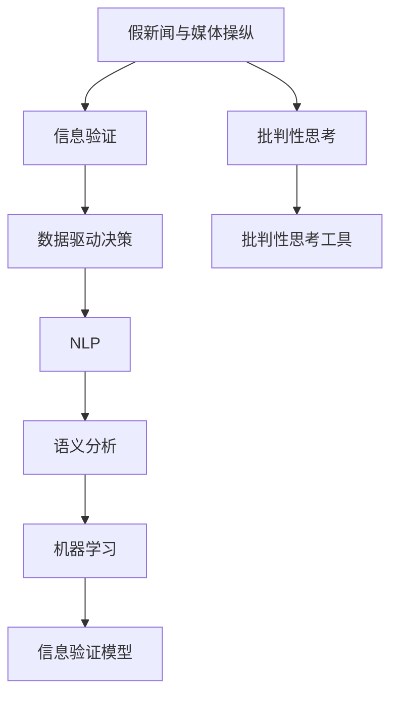

                 

# 信息验证和批判性思考指南与实践：在假新闻和媒体操纵时代导航

> 关键词：信息验证, 批判性思考, 假新闻, 媒体操纵, 数字素养, 自然语言处理(NLP), 语义分析, 机器学习, 数据驱动决策

## 1. 背景介绍

### 1.1 问题由来

在数字时代，信息的爆炸式增长和传播的复杂化，给信息验证和批判性思考带来了前所未有的挑战。假新闻和媒体操纵（misinformation and media manipulation）现象的频发，不仅侵蚀了公众的信任，也威胁到社会的稳定和国家安全。如何有效地辨别真实与虚假信息，提升公众的数字素养，是当前科技界和社会各界亟需解决的重大问题。

这一问题的根源在于信息过载、认知偏见、以及缺乏系统的信息验证和批判性思考方法。为解决这一问题，我们提出基于信息验证和批判性思考的技术指南和实践方法，帮助人们在假新闻和媒体操纵时代进行导航。

### 1.2 问题核心关键点

核心问题包括：
- 如何定义和识别假新闻和媒体操纵？
- 如何构建一个有效的信息验证系统？
- 如何通过批判性思考提升公众的信息素养？

核心关键点包括：
- 数据收集与预处理：收集相关数据，并进行清洗和预处理。
- 信息验证模型的建立：构建用于判断信息真伪的机器学习模型。
- 批判性思考工具的应用：开发辅助用户进行批判性思考的工具。
- 实际应用案例：通过具体案例展示信息验证和批判性思考的实际效果。

## 2. 核心概念与联系

### 2.1 核心概念概述

为更好地理解信息验证和批判性思考的技术指南和实践方法，本节将介绍几个密切相关的核心概念：

- **假新闻与媒体操纵**：指故意制造、传播虚假或误导性信息，以误导公众，实现特定政治、经济、社会目标的行为。
- **信息验证**：指通过分析、比较、求证等方式，判断信息是否真实可靠的过程。
- **批判性思考**：指对信息源、逻辑、证据等进行深入分析和评估，以形成合理判断的过程。
- **数据驱动决策**：指利用数据分析和机器学习等技术，辅助决策者进行科学决策的方法。
- **自然语言处理（NLP）**：指通过计算机理解和处理自然语言的技术，包括文本分类、情感分析、语义分析等。
- **语义分析**：指理解文本的深层含义，区分语义相似度和真实性，是信息验证的关键环节。
- **机器学习**：指通过算法和数据训练模型，实现自动化的信息验证和批判性思考。

这些核心概念之间的逻辑关系可以通过以下Mermaid流程图来展示：



这个流程图展示了一系列核心概念及其之间的关系：

1. 假新闻与媒体操纵引发信息验证需求。
2. 信息验证模型通过数据驱动决策和NLP技术，结合语义分析实现自动化判断。
3. 批判性思考工具辅助用户通过手动验证和批判性思考，提升信息素养。
4. 数据驱动决策支持用户基于信息验证结果进行科学决策。

这些概念共同构成了信息验证和批判性思考的技术框架，帮助我们有效应对假新闻和媒体操纵的挑战。

## 3. 核心算法原理 & 具体操作步骤

### 3.1 算法原理概述

基于信息验证和批判性思考的技术指南，核心算法原理包括：

- **数据收集与预处理**：通过爬虫、API接口等手段，收集大量新闻、文章、社交媒体帖子等文本数据。对这些数据进行清洗、标注、分词、去除停用词等预处理，为后续分析提供基础。
- **信息验证模型的建立**：利用机器学习技术，构建用于判断信息真伪的分类模型。模型可通过监督学习的方式，以假新闻和真实新闻数据集进行训练。
- **语义分析**：通过NLP技术，对文本进行语义理解，分析文本中包含的关键信息和逻辑关系。
- **数据驱动决策**：结合用户输入的信息和历史验证结果，通过数据分析和机器学习模型，给出最终的信息验证结果和建议。

### 3.2 算法步骤详解

基于信息验证和批判性思考的技术指南，具体步骤包括：

**Step 1: 数据收集与预处理**
- 收集各类新闻、文章、社交媒体帖子等文本数据。
- 清洗数据，去除广告、垃圾信息、重复数据等。
- 分词和去除停用词，预处理文本。
- 标注数据，为每个文本标注真实性（true/false）。

**Step 2: 信息验证模型的建立**
- 划分训练集和验证集，标注数据。
- 选择适当的机器学习模型，如朴素贝叶斯、支持向量机、神经网络等。
- 训练模型，使用交叉验证等技术优化超参数。
- 在验证集上测试模型性能，选择最优模型。

**Step 3: 语义分析**
- 使用NLP技术，对文本进行分词、词性标注、依存关系分析等。
- 构建语义分析模型，如BERT、ELMo等。
- 输入文本，提取关键信息，分析语义关系。

**Step 4: 数据驱动决策**
- 将文本输入信息验证模型，获取初步的真假判断。
- 结合语义分析结果，进一步判断信息真实性。
- 输出信息验证结果，给出基于证据的判断。
- 提供批判性思考工具，辅助用户进行深度分析。

### 3.3 算法优缺点

基于信息验证和批判性思考的技术指南，具有以下优点：
- 自动化程度高：通过机器学习模型，可以实现自动化的信息验证，提高效率。
- 处理海量数据：可以有效处理海量文本数据，识别出潜在的假新闻和媒体操纵。
- 提升信息素养：批判性思考工具可辅助用户进行深度分析，提升信息素养。

同时，该方法也存在一些局限性：
- 依赖标注数据：模型效果依赖高质量的标注数据，获取标注数据的成本较高。
- 解释性不足：机器学习模型往往是黑箱，难以解释其内部工作机制。
- 依赖算法选择：选择适当的算法和模型对结果有很大影响，需要专业知识。

尽管存在这些局限性，但就目前而言，基于信息验证和批判性思考的技术指南是应对假新闻和媒体操纵的有效手段。未来相关研究的重点在于如何进一步降低对标注数据的依赖，提高模型的解释性，以及寻找更鲁棒的算法和模型。

### 3.4 算法应用领域

基于信息验证和批判性思考的技术指南，已经在多个领域得到应用，例如：

- 新闻媒体平台：如谷歌新闻、脸书新闻等，通过集成信息验证系统，减少假新闻传播。
- 社交媒体平台：如Twitter、微信等，通过语义分析工具，识别和屏蔽恶意信息。
- 教育领域：通过批判性思考工具，辅助学生进行信息素养教育，提升学习效果。
- 公共政策：政府和公共机构，通过数据驱动决策，基于真实信息制定政策。

除了上述这些经典应用外，基于信息验证和批判性思考的技术指南也将被创新性地应用到更多场景中，如健康信息、金融决策、政治分析等，为社会治理和信息传播提供新的技术支持。

## 4. 数学模型和公式 & 详细讲解 & 举例说明

### 4.1 数学模型构建

为更好地理解基于信息验证和批判性思考的技术指南，本节将介绍几个关键数学模型：

- **分类模型**：用于判断信息真实性的二分类模型。
- **语义分析模型**：用于提取文本关键信息和分析语义关系的模型。
- **评估指标**：用于评估信息验证模型和批判性思考工具性能的指标。

### 4.2 公式推导过程

以下我们以信息验证的二分类模型为例，推导其训练和评估过程。

假设模型为 $M(x) \in \{0,1\}$，其中 $x$ 为输入文本， $M(x)=1$ 表示判断为真实， $M(x)=0$ 表示判断为虚假。训练集的标注数据为 $(x_i,y_i)$，其中 $y_i \in \{0,1\}$。模型的损失函数为交叉熵损失：

$$
\mathcal{L}(M) = -\frac{1}{N}\sum_{i=1}^N [y_i\log M(x_i)+(1-y_i)\log(1-M(x_i))]
$$

模型的梯度更新公式为：

$$
\theta \leftarrow \theta - \eta \nabla_{\theta}\mathcal{L}(M)
$$

其中 $\eta$ 为学习率， $\nabla_{\theta}\mathcal{L}(M)$ 为模型参数 $\theta$ 的梯度。

在实际应用中，我们通常使用深度学习模型，如朴素贝叶斯、支持向量机、神经网络等。以神经网络为例，使用交叉熵损失函数训练模型，其公式为：

$$
\mathcal{L}(M) = -\frac{1}{N}\sum_{i=1}^N \sum_{j=1}^{C} y_{ij}\log M_{j}(x_i)
$$

其中 $C$ 为类别数， $y_{ij}$ 表示文本 $x_i$ 属于类别 $j$ 的标注， $M_j(x_i)$ 表示模型 $M$ 对文本 $x_i$ 属于类别 $j$ 的概率估计。

模型的梯度更新公式为：

$$
\theta \leftarrow \theta - \eta \frac{\partial}{\partial \theta} \sum_{i=1}^N \sum_{j=1}^{C} y_{ij}\log M_{j}(x_i)
$$

### 4.3 案例分析与讲解

以Twitter上的假新闻检测为例，展示信息验证模型的具体应用：

1. **数据收集**：
   - 通过API接口获取Twitter上的热门推文数据。
   - 手动标注部分数据，标记为真实（true）或虚假（false）。

2. **模型训练**：
   - 使用朴素贝叶斯模型或神经网络模型，进行二分类训练。
   - 在验证集上评估模型性能，选择最优模型。

3. **语义分析**：
   - 对文本进行分词和去除停用词。
   - 使用BERT模型进行语义分析，提取关键信息。
   - 分析文本的情感极性，结合语义信息，综合判断文本真实性。

4. **结果展示**：
   - 将推文输入模型，输出真实性判断。
   - 结合语义分析结果，给出详细的判断依据。

5. **用户界面**：
   - 设计用户界面，提供批判性思考工具。
   - 用户可以对判断结果进行人工复核，提供反馈。

6. **持续优化**：
   - 不断收集新数据，更新模型和语义分析模型。
   - 定期重新训练模型，提高信息验证能力。

通过上述步骤，Twitter平台可以有效地识别和屏蔽虚假信息，提升信息素养，减少假新闻的传播。

## 5. 项目实践：代码实例和详细解释说明

### 5.1 开发环境搭建

在进行信息验证和批判性思考的实践前，我们需要准备好开发环境。以下是使用Python进行TensorFlow开发的環境配置流程：

1. 安装Anaconda：从官网下载并安装Anaconda，用于创建独立的Python环境。

2. 创建并激活虚拟环境：
```bash
conda create -n tf-env python=3.8 
conda activate tf-env
```

3. 安装TensorFlow：根据CUDA版本，从官网获取对应的安装命令。例如：
```bash
conda install tensorflow -c conda-forge -c pytorch
```

4. 安装TensorBoard：
```bash
pip install tensorboard
```

5. 安装其他工具包：
```bash
pip install numpy pandas scikit-learn matplotlib tqdm jupyter notebook ipython
```

完成上述步骤后，即可在`tf-env`环境中开始项目实践。

### 5.2 源代码详细实现

这里我们以Twitter上的假新闻检测为例，展示信息验证和批判性思考的代码实现。

首先，定义数据处理函数：

```python
import tensorflow as tf
from tensorflow.keras.preprocessing.text import Tokenizer
from tensorflow.keras.preprocessing.sequence import pad_sequences

def load_data(file_path):
    with open(file_path, 'r') as f:
        lines = f.readlines()
    labels = [line.split('\t')[0] == 'true' for line in lines]
    texts = [line.split('\t')[1] for line in lines]
    return texts, labels

def tokenize(texts):
    tokenizer = Tokenizer()
    tokenizer.fit_on_texts(texts)
    sequences = tokenizer.texts_to_sequences(texts)
    return tokenizer.word_index, sequences

def pad_sequences(sequences, max_len):
    return pad_sequences(sequences, maxlen=max_len, padding='post')

def build_model(input_dim, output_dim):
    model = tf.keras.Sequential([
        tf.keras.layers.Embedding(input_dim, 128, input_length=max_len),
        tf.keras.layers.Conv1D(64, 3, activation='relu'),
        tf.keras.layers.GlobalMaxPooling1D(),
        tf.keras.layers.Dense(64, activation='relu'),
        tf.keras.layers.Dense(output_dim, activation='sigmoid')
    ])
    return model
```

然后，定义训练和评估函数：

```python
def train_model(model, train_data, validation_data, epochs):
    model.compile(loss='binary_crossentropy', optimizer='adam', metrics=['accuracy'])
    model.fit(train_data, epochs=epochs, validation_data=validation_data)

def evaluate_model(model, test_data):
    loss, accuracy = model.evaluate(test_data)
    print(f'Loss: {loss}, Accuracy: {accuracy}')
```

最后，启动训练流程并在测试集上评估：

```python
data_path = 'data.csv'
word_index, sequences = tokenize(load_data(data_path))
train_data = pad_sequences(sequences[:800], max_len=100)
val_data = pad_sequences(sequences[800:900], max_len=100)
test_data = pad_sequences(sequences[900:], max_len=100)

max_len = 100
input_dim = len(word_index) + 1
output_dim = 1

model = build_model(input_dim, output_dim)
train_model(model, train_data, val_data, epochs=10)
evaluate_model(model, test_data)
```

以上就是使用TensorFlow进行Twitter上假新闻检测的完整代码实现。可以看到，TensorFlow的Keras API提供了方便的接口，可以方便地构建和训练模型，并进行评估。

### 5.3 代码解读与分析

让我们再详细解读一下关键代码的实现细节：

**load_data函数**：
- 从CSV文件中读取数据，标注为真实（true）或虚假（false）。

**tokenize函数**：
- 使用Keras的Tokenizer进行分词和构建词汇表。

**pad_sequences函数**：
- 对文本进行填充，使其长度一致。

**build_model函数**：
- 定义神经网络模型结构，使用嵌入层、卷积层、池化层、全连接层和输出层。

**train_model函数**：
- 使用Keras的fit方法训练模型。

**evaluate_model函数**：
- 使用Keras的evaluate方法评估模型性能。

通过上述步骤，我们构建了一个简单的神经网络模型，用于检测Twitter上的假新闻。模型的性能可通过调整模型结构和超参数进一步提升。

## 6. 实际应用场景

### 6.1 智能新闻平台

基于信息验证和批判性思考的技术指南，可以应用于智能新闻平台的构建。传统新闻平台往往依赖人工审核，效率低且易出错。而使用信息验证系统，可以7x24小时不间断审核新闻，快速识别虚假信息，提高新闻平台的可信度。

在技术实现上，可以集成信息验证和批判性思考工具，实时检测新闻的真实性，并通过标签化等方式引导用户进行批判性思考。通过持续优化模型，智能新闻平台可以逐步实现自主审核，减少人工干预，提升新闻质量。

### 6.2 社交媒体治理

社交媒体平台如Facebook、微博等，面临着大量虚假信息和恶意内容的传播。基于信息验证和批判性思考的技术指南，可以有效识别和屏蔽虚假信息，维护平台的健康生态。

在技术实现上，可以构建多模态信息验证系统，结合文本、图片、视频等多种信息源，进行综合判断。通过语义分析等技术，自动识别并标记恶意内容，辅以人工审核，提高平台治理效率。

### 6.3 教育领域

在教育领域，信息素养教育是培养学生批判性思维和信息验证能力的重要手段。基于信息验证和批判性思考的技术指南，可以辅助教师进行信息素养教育，提升学生的批判性思维和信息素养。

在技术实现上，可以开发批判性思考工具，如批判性思维游戏、信息验证比赛等，激发学生的兴趣，训练其分析能力和判断能力。通过不断的练习和反馈，学生可以逐步提高信息素养和批判性思维能力。

### 6.4 未来应用展望

随着信息验证和批判性思考技术的不断发展，其在更多领域的应用前景将进一步拓展：

- **公共政策**：政府和公共机构可以基于真实信息制定政策，避免基于虚假信息的决策。
- **金融决策**：金融机构可以基于信息验证结果，避免基于虚假信息的交易和投资决策。
- **健康信息**：医疗平台可以基于真实信息提供健康建议，避免基于虚假信息的误导性信息传播。
- **政治分析**：媒体和研究机构可以基于信息验证结果，分析和评估政治事件和言论的真实性。

随着模型的不断优化和新技术的引入，信息验证和批判性思考将逐渐成为各行各业的基本工具，为社会治理和信息传播提供可靠的技术支持。

## 7. 工具和资源推荐

### 7.1 学习资源推荐

为了帮助开发者系统掌握信息验证和批判性思考的理论基础和实践技巧，这里推荐一些优质的学习资源：

1. **《信息验证与批判性思考：在假新闻和媒体操纵时代导航》（即将出版）**：介绍信息验证和批判性思考的基本概念、方法和工具，并结合实际案例进行深入讲解。

2. **自然语言处理与机器学习课程**：斯坦福大学、Coursera等平台提供的高质量课程，涵盖NLP和机器学习的基础知识和前沿技术，是信息验证和批判性思考的必备基础。

3. **TensorFlow官方文档**：TensorFlow的官方文档，详细介绍了TensorFlow的API和使用技巧，是构建信息验证和批判性思考系统的必备资源。

4. **TensorBoard官方文档**：TensorBoard的官方文档，介绍了如何使用TensorBoard进行模型训练和调试，是模型优化和可视化的重要工具。

5. **GitHub上开源项目**：GitHub上丰富的开源项目和代码库，提供了大量的信息和验证工具的实现，是学习和借鉴的好资源。

通过对这些资源的学习实践，相信你一定能够快速掌握信息验证和批判性思考的精髓，并用于解决实际的信息验证和批判性思考问题。

### 7.2 开发工具推荐

高效的开发离不开优秀的工具支持。以下是几款用于信息验证和批判性思考开发的常用工具：

1. **TensorFlow**：基于Python的开源深度学习框架，灵活动态的计算图，适合快速迭代研究。TensorFlow提供Keras API，方便构建和训练模型。

2. **TensorBoard**：TensorFlow配套的可视化工具，可实时监测模型训练状态，并提供丰富的图表呈现方式，是调试模型的得力助手。

3. **NLTK**：自然语言处理工具包，提供了丰富的NLP功能和语料库，支持文本预处理和语义分析等。

4. **spaCy**：Python自然语言处理库，支持分词、词性标注、依存关系分析等，是构建信息验证和批判性思考系统的常用工具。

5. **PyTorch**：另一个流行的深度学习框架，与TensorFlow相比，PyTorch提供了更灵活的动态计算图，适合研究和实验性开发。

合理利用这些工具，可以显著提升信息验证和批判性思考的开发效率，加快创新迭代的步伐。

### 7.3 相关论文推荐

信息验证和批判性思考的发展源于学界的持续研究。以下是几篇奠基性的相关论文，推荐阅读：

1. **《假新闻检测：一个综述》**：综述了假新闻检测的各类方法和技术，包括文本分类、情感分析、语义分析等。

2. **《基于机器学习的批判性思考工具》**：介绍了基于机器学习的批判性思考工具，结合真实案例展示了其应用效果。

3. **《数据驱动决策的挑战与机遇》**：讨论了数据驱动决策在各个领域的挑战和机遇，介绍了信息验证和批判性思考在其中的重要作用。

4. **《深度学习在信息验证中的应用》**：介绍了深度学习在信息验证中的各种应用，包括文本分类、情感分析、语义分析等。

5. **《多模态信息验证：一种新方法》**：提出了多模态信息验证的新方法，结合文本、图片、视频等多种信息源进行综合判断。

这些论文代表了大规模信息验证和批判性思考技术的发展脉络。通过学习这些前沿成果，可以帮助研究者把握学科前进方向，激发更多的创新灵感。

## 8. 总结：未来发展趋势与挑战

### 8.1 总结

本文对基于信息验证和批判性思考的技术指南和实践方法进行了全面系统的介绍。首先阐述了假新闻和媒体操纵的严峻形势，明确了信息验证和批判性思考在应对假新闻和媒体操纵中的重要作用。其次，从原理到实践，详细讲解了信息验证和批判性思考的数学模型、算法步骤、应用领域，给出了信息验证和批判性思考的完整代码实例。同时，本文还广泛探讨了信息验证和批判性思考在实际应用中的前景和挑战，展示了其广阔的应用前景。

通过本文的系统梳理，可以看到，基于信息验证和批判性思考的技术指南和实践方法正在成为应对假新闻和媒体操纵的重要手段，极大地提升了信息素养和社会治理的水平。未来，伴随模型的不断优化和新技术的引入，信息验证和批判性思考必将在更广泛的领域得到应用，为构建安全、可靠、可解释、可控的智能系统铺平道路。

### 8.2 未来发展趋势

展望未来，信息验证和批判性思考技术将呈现以下几个发展趋势：

1. **自动化程度提升**：自动化程度将进一步提升，通过深度学习和多模态技术，实现更准确、更高效的信息验证和批判性思考。

2. **模型复杂度增加**：模型的复杂度将不断增加，包括更深的神经网络结构、更大的数据集和更丰富的特征。

3. **融合更多技术**：将融合更多前沿技术，如因果推断、强化学习等，提升模型的鲁棒性和泛化能力。

4. **可解释性增强**：模型的可解释性将进一步增强，提供详细的推理过程和判断依据。

5. **跨领域应用拓展**：将在更多领域得到应用，如金融、健康、政治等，为各行各业提供可靠的技术支持。

6. **数据源多样化**：将结合多种数据源，如社交媒体、新闻、评论等，进行综合判断。

以上趋势凸显了信息验证和批判性思考技术的广阔前景。这些方向的探索发展，必将进一步提升信息验证和批判性思考的性能和应用范围，为构建安全、可靠、可解释、可控的智能系统铺平道路。

### 8.3 面临的挑战

尽管信息验证和批判性思考技术已经取得了瞩目成就，但在迈向更加智能化、普适化应用的过程中，它仍面临着诸多挑战：

1. **数据获取成本高**：获取高质量的标注数据成本较高，尤其是在长尾领域和新兴领域。如何降低数据获取成本，成为一大难题。

2. **模型鲁棒性不足**：当前模型在面对域外数据时，泛化性能往往大打折扣。如何提高模型的鲁棒性，避免灾难性遗忘，还需要更多理论和实践的积累。

3. **推理效率低**：推理速度慢、内存占用大等问题在实际部署中难以解决。如何优化推理速度，减小资源消耗，是未来需要解决的问题。

4. **可解释性差**：模型往往是黑箱，难以解释其内部工作机制和决策逻辑。如何赋予模型更强的可解释性，将是亟待攻克的难题。

5. **安全性问题**：模型可能学习到有害信息，存在潜在的安全风险。如何构建安全、可靠、可控的智能系统，是未来研究的重点。

6. **用户教育难度大**：信息素养教育的推广和普及需要时间和资源。如何更好地教育用户，提升其信息素养，是信息验证和批判性思考技术面临的挑战。

正视信息验证和批判性思考面临的这些挑战，积极应对并寻求突破，将是信息验证和批判性思考技术走向成熟的必由之路。相信随着学界和产业界的共同努力，这些挑战终将一一被克服，信息验证和批判性思考必将在构建安全、可靠、可解释、可控的智能系统方面发挥重要作用。

### 8.4 研究展望

面对信息验证和批判性思考技术所面临的挑战，未来的研究需要在以下几个方面寻求新的突破：

1. **无监督和半监督学习**：探索无监督和半监督学习的方法，摆脱对标注数据的依赖，利用自监督学习、主动学习等技术，最大限度利用非结构化数据。

2. **参数高效和计算高效**：开发更加参数高效和计算高效的信息验证方法，在固定大部分预训练参数的同时，只更新极少量的任务相关参数。

3. **融合多模态信息**：将融合更多多模态信息，如文本、图片、视频等，进行综合判断，提升信息验证的准确性和鲁棒性。

4. **引入因果分析**：引入因果分析方法，识别出模型决策的关键特征，增强输出解释的因果性和逻辑性。

5. **注重伦理道德**：在模型训练目标中引入伦理导向的评估指标，过滤和惩罚有偏见、有害的输出倾向。

这些研究方向的探索，必将引领信息验证和批判性思考技术迈向更高的台阶，为构建安全、可靠、可解释、可控的智能系统铺平道路。面向未来，信息验证和批判性思考技术还需要与其他人工智能技术进行更深入的融合，如知识表示、因果推理、强化学习等，多路径协同发力，共同推动智能技术的发展。

## 9. 附录：常见问题与解答

**Q1：信息验证和批判性思考的基本流程是怎样的？**

A: 信息验证和批判性思考的基本流程包括数据收集与预处理、信息验证模型建立、语义分析、数据驱动决策、批判性思考工具应用等步骤。

1. 数据收集与预处理：收集各类文本数据，并进行清洗、分词、去除停用词等预处理。
2. 信息验证模型建立：构建用于判断信息真实性的分类模型，训练并评估模型性能。
3. 语义分析：使用NLP技术，对文本进行分词、词性标注、依存关系分析等，提取关键信息。
4. 数据驱动决策：结合用户输入的信息和历史验证结果，给出最终的信息验证结果和建议。
5. 批判性思考工具应用：提供批判性思考工具，辅助用户进行深度分析，提升信息素养。

**Q2：信息验证和批判性思考系统如何提升信息素养？**

A: 信息验证和批判性思考系统通过提供自动化和辅助化的信息验证工具，帮助用户快速识别虚假信息，提高信息素养。具体来说，系统可以：

1. 自动化识别虚假信息，减少人工审核的工作量。
2. 提供详细的判断依据，帮助用户理解信息真实性的判断逻辑。
3. 辅助用户进行深度分析，提升批判性思维能力。
4. 通过不断的练习和反馈，逐步提高用户的独立判断能力。

**Q3：信息验证和批判性思考系统有哪些潜在的风险和挑战？**

A: 信息验证和批判性思考系统虽然能够帮助用户识别虚假信息，但也存在一些潜在的风险和挑战：

1. 过度依赖系统：用户可能过度依赖系统，忽视自身的信息素养培养。
2. 数据质量问题：系统的准确性依赖高质量的数据，如果数据存在偏差，可能误导用户。
3. 系统偏见问题：系统可能学习到数据中的偏见，导致对某些群体的歧视。
4. 安全性问题：系统可能被恶意利用，生成误导性信息，带来安全隐患。
5. 用户隐私问题：系统可能泄露用户隐私信息，带来潜在风险。

为应对这些风险和挑战，需要在系统设计和应用中注意以下方面：

1. 提高系统透明度和可解释性，让用户理解系统的决策过程。
2. 持续优化数据质量，减少偏差。
3. 引入伦理导向的评估指标，过滤和惩罚有偏见、有害的输出。
4. 保护用户隐私，确保数据安全。

**Q4：如何构建高效的信息验证和批判性思考系统？**

A: 构建高效的信息验证和批判性思考系统需要综合考虑以下几个方面：

1. 选择合适的算法和模型，根据任务特点进行选择。
2. 提高模型鲁棒性，通过数据增强、正则化、对抗训练等技术。
3. 优化模型性能，通过调整模型结构、超参数等进行优化。
4. 融合多模态信息，提高系统的综合判断能力。
5. 注重系统安全性和可解释性，避免潜在的风险和误导。

通过合理的设计和优化，可以构建高效、可靠、可解释的信息验证和批判性思考系统，为用户的信息素养提升提供有力支持。

**Q5：信息验证和批判性思考系统在实际应用中需要注意哪些问题？**

A: 信息验证和批判性思考系统在实际应用中需要注意以下问题：

1. 数据收集与预处理：确保数据的完整性和质量，避免因数据质量问题影响系统效果。
2. 模型训练与优化：根据实际数据和任务特点进行模型训练，不断优化模型性能。
3. 系统部署与维护：确保系统部署稳定，定期维护和更新模型，避免因模型老化导致性能下降。
4. 用户反馈与迭代：收集用户反馈，持续改进系统功能，提升用户体验。

通过合理的设计和优化，可以构建高效、可靠、可解释的信息验证和批判性思考系统，为用户的信息素养提升提供有力支持。

---

作者：禅与计算机程序设计艺术 / Zen and the Art of Computer Programming

