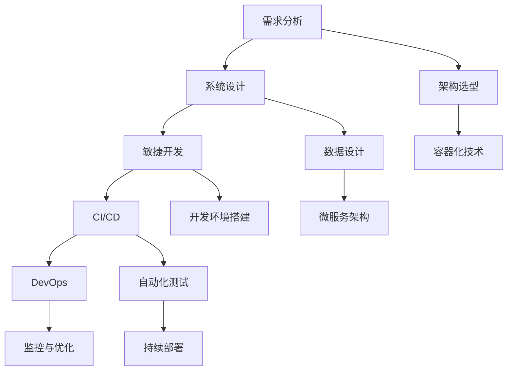

                 

## 1. 背景介绍

在当今快速变化的IT行业中，每个项目都是一次学习机会，对于项目从头到尾的全程参与，不仅能够帮助开发者提升技能，更能深入理解技术栈背后的原理与联系。本文将系统性地介绍从项目开发到部署的各个环节，通过深入剖析核心概念和算法，并提供具体案例，帮助读者全面掌握软件开发的实践经验。

## 2. 核心概念与联系

### 2.1 核心概念概述

项目开发和部署过程中涉及许多关键概念。这里首先对其中的一些核心概念进行梳理：

- **敏捷开发**：一种迭代、增量式的软件开发方法，通过短周期的迭代和持续反馈，快速响应需求变化，提升产品竞争力。
- **持续集成/持续部署 (CI/CD)**：自动化集成和部署流程，提高软件交付效率，降低出错风险。
- **DevOps**：一种将软件开发和运维文化和技术实践融合的策略，提升团队的协作效率和系统稳定性。
- **容器化技术**：通过容器技术将应用程序及其依赖打包，实现跨平台、高效的部署。
- **微服务架构**：将单体应用拆分为一组独立运行的模块，每个模块可独立部署和扩展，提升系统灵活性和可维护性。

这些概念紧密相连，共同构成了现代软件开发和部署的基础框架。以下将通过一个简单的IT项目开发流程，将这些概念串联起来。

### 2.2 核心概念原理和架构的 Mermaid 流程图



该流程图展示了项目开发和部署的核心流程，从中可以看出敏捷开发、持续集成/持续部署、DevOps、容器化和微服务架构之间的关系。

## 3. 核心算法原理 & 具体操作步骤

### 3.1 算法原理概述

软件开发和部署过程中的核心算法主要围绕软件交付和运维优化展开。以下是其中几个关键算法的概述：

- **版本控制算法**：如Git的Git Object模型和Hash算法，用于高效管理和追踪代码变更。
- **依赖管理算法**：如Maven的依赖传递和冲突解决算法，确保项目依赖的正确性和一致性。
- **容器编排算法**：如Docker Swarm和Kubernetes的调度算法，合理分配资源，优化容器部署。
- **微服务通信算法**：如RESTful API和gRPC的通信协议，支持微服务之间的高效通信。

这些算法在软件开发和部署中扮演着重要角色，下面将详细介绍它们的具体实现步骤。

### 3.2 算法步骤详解

#### 3.2.1 版本控制算法

版本控制是软件开发中最基础的算法之一，其核心是实现代码变更的追踪和管理。以下是一个Git项目的基本操作流程：

1. **初始化仓库**：
```bash
git init
```

2. **添加文件**：
```bash
git add <file>
```

3. **提交变更**：
```bash
git commit -m "提交说明"
```

4. **创建分支**：
```bash
git branch <branch-name>
```

5. **合并分支**：
```bash
git merge <branch-name>
```

6. **查看历史**：
```bash
git log
```

这些步骤展示了版本控制的基本操作，通过Git，开发者能够高效地管理项目变更，进行协作开发和团队合作。

#### 3.2.2 依赖管理算法

依赖管理算法是确保项目构建和部署稳定的关键。以下是一个简单的Maven项目依赖配置示例：

```xml
<dependencies>
    <dependency>
        <groupId>org.apache.commons</groupId>
        <artifactId>commons-lang3</artifactId>
        <version>3.11</version>
    </dependency>
    <dependency>
        <groupId>junit</groupId>
        <artifactId>junit</artifactId>
        <version>4.12</version>
        <scope>test</scope>
    </dependency>
</dependencies>
```

Maven通过定义`<dependencies>`元素，自动下载和管理项目所需的依赖，避免了手动配置的麻烦，提高了项目的可维护性。

#### 3.2.3 容器编排算法

容器编排算法是实现高效部署和扩展的基础。以下是一个简单的Docker Swarm配置示例：

```yaml
services:
  myapp:
    image: myapp:latest
    ports:
      - "80:80"
    replicas: 3
```

该配置指定了Docker Swarm中一个名为`myapp`的服务，使用`myapp`镜像，监听`80`端口，并创建3个副本。通过这种方式，Docker Swarm能够自动管理容器的生命周期，确保系统的高可用性和扩展性。

#### 3.2.4 微服务通信算法

微服务通信算法是微服务架构中不可或缺的一部分。以下是一个使用gRPC进行微服务通信的示例：

```java
// 定义服务接口
@GRPCService
public interface MyService {
    @UnaryClientStreaming
    Response myMethod(@StreamingServerStreaming ClientStreamingRequest request);
}

// 实现服务接口
@MyServiceImpl
public class MyServiceServer {
    @override
    @StreamingServerStreaming
    public Response myMethod(ClientStreamingRequest request) {
        // 处理请求
        return Response.builder().build();
    }
}
```

该示例展示了如何使用gRPC定义和实现一个微服务接口，通过`@GRPCService`注解和`@UnaryClientStreaming`注解，实现客户端与服务的双向通信。

### 3.3 算法优缺点

#### 3.3.1 版本控制算法

- **优点**：
  - 支持多人协作开发，降低代码冲突风险。
  - 历史记录清晰，便于回溯和故障排除。
  - 分支和合并操作方便，支持不同版本管理。

- **缺点**：
  - 操作复杂，对于不熟悉Git的用户需要较长时间学习。
  - 性能开销较大，尤其是对于大型仓库。

#### 3.3.2 依赖管理算法

- **优点**：
  - 自动化管理依赖，减少手动配置工作。
  - 依赖冲突自动检测，提高构建效率。
  - 版本追踪方便，便于版本回溯和问题定位。

- **缺点**：
  - 配置复杂，需要理解依赖传递和冲突解决机制。
  - 依赖管理不善可能导致构建失败。

#### 3.3.3 容器编排算法

- **优点**：
  - 支持快速部署和扩展，提高系统可用性。
  - 容器资源隔离，降低服务间冲突风险。
  - 自动化管理，降低运维工作量。

- **缺点**：
  - 学习曲线较陡，需要理解容器编排和调度机制。
  - 资源管理不当可能导致性能瓶颈。

#### 3.3.4 微服务通信算法

- **优点**：
  - 支持服务间高效通信，提高系统响应速度。
  - 支持异步通信，提高系统并发处理能力。
  - 通过协议定义接口，提高系统可维护性。

- **缺点**：
  - 通信协议复杂，需要理解接口定义和调用细节。
  - 协议实现和维护工作量较大，需要投入额外资源。

### 3.4 算法应用领域

这些核心算法广泛应用在软件开发和部署的各个环节，具体应用领域包括：

- **版本控制**：适用于软件开发团队的多人协作项目。
- **依赖管理**：适用于构建工具的自动化管理。
- **容器编排**：适用于分布式系统的高可用和扩展需求。
- **微服务通信**：适用于微服务架构的实现和优化。

在实际开发中，开发者需要根据具体需求选择合适的算法和技术，结合敏捷开发和持续集成/持续部署的实践，提升项目开发和部署的效率和质量。

## 4. 数学模型和公式 & 详细讲解 & 举例说明

### 4.1 数学模型构建

在软件开发和部署中，数学模型和公式的应用相对较少，更多依赖于工程实践。然而，对于某些特定的性能优化算法，数学模型和公式可以提供理论依据。

以容器编排中的资源调度为例，通过数学模型和公式，可以更好地理解调度算法的原理和优化方向。

### 4.2 公式推导过程

假设有一个包含$n$个任务的系统，每个任务需要消耗$m$个计算资源，系统的总资源为$R$。任务执行的顺序会影响整个系统的资源使用情况，我们需要找到一个最优的任务执行顺序，使得系统总资源消耗最小。

这个问题可以用线性规划(LP)模型描述，目标函数为：

$$\min_{x} \sum_{i=1}^n m_i x_i$$

其中，$x_i=1$表示第$i$个任务在执行，$x_i=0$表示不执行。约束条件为：

$$\sum_{i=1}^n x_i = 1$$
$$\sum_{i=1}^n m_i x_i \leq R$$

该模型可以通过求解LP问题找到最优的任务执行顺序。

### 4.3 案例分析与讲解

在实际应用中，这个问题的解法依赖于具体的任务和资源约束。以Kubernetes调度算法为例，它使用了一种基于成本的资源分配策略，通过计算每个任务的资源需求和系统资源可用性，动态调整任务的执行优先级，实现资源的高效利用。

## 5. 项目实践：代码实例和详细解释说明

### 5.1 开发环境搭建

项目开发和部署的第一步是搭建开发环境。以下是一个典型的开发环境搭建流程：

1. **选择开发工具**：如Visual Studio Code、IntelliJ IDEA等，安装所需插件和扩展。
2. **配置版本控制**：如使用Git，安装Git客户端和GitHub/GitLab等代码托管平台账号。
3. **搭建开发服务器**：如使用Docker或VMware，创建本地开发环境。
4. **配置依赖管理**：如使用Maven或Gradle，配置项目依赖和版本。

### 5.2 源代码详细实现

以下是一个简单的Java Spring Boot项目开发示例，展示从项目初始化到部署的完整流程：

1. **项目初始化**：
```bash
$ spring initialize
```

2. **编写代码**：
```java
// 项目根目录下的Spring Boot启动类
@SpringBootApplication
public class MyApp {
    public static void main(String[] args) {
        SpringApplication.run(MyApp.class, args);
    }
}
```

3. **配置文件**：
```properties
# application.properties
spring.application.name=myapp
spring.datasource.url=jdbc:mysql://localhost:3306/myapp
spring.datasource.username=root
spring.datasource.password=password
```

4. **单元测试**：
```java
// src/test/java/MyTest.java
@RunWith(SpringRunner.class)
@SpringBootTest
public class MyTest {
    @Autowired
    private MyService myService;

    @Test
    public void testMyService() {
        // 测试代码
    }
}
```

5. **构建和部署**：
```bash
$ mvn package
$ java -jar target/myapp.jar
```

### 5.3 代码解读与分析

项目开发的每个环节都涉及到多个核心概念的结合应用。以下是对上述示例代码的详细解读：

- **Spring Boot**：一个快速搭建微服务的开发框架，提供了丰富的组件和插件，简化开发工作。
- **MySQL数据库**：作为项目的后端存储，通过JDBC连接MySQL数据库，实现数据的存储和查询。
- **Maven**：作为依赖管理工具，通过Maven插件管理项目依赖，简化构建过程。
- **Junit**：作为测试工具，通过Junit测试框架，实现单元测试和集成测试。

### 5.4 运行结果展示

项目部署完成后，可以通过以下方式展示运行结果：

1. **本地测试**：
```bash
$ curl http://localhost:8080/hello
Hello World
```

2. **远程访问**：
```bash
$ curl http://<host>:<port>/hello
Hello World
```

通过这些展示方法，可以验证项目是否正确部署，功能是否正常。

## 6. 实际应用场景

### 6.1 电商网站开发

电商网站是一个典型的IT项目，涉及多种技术栈和团队协作。以下是一个电商网站的实际开发流程：

1. **需求分析**：与客户沟通，明确项目需求，包括功能需求、性能需求和业务规则等。
2. **系统设计**：根据需求设计系统架构，包括数据库设计、前端页面设计和API设计等。
3. **敏捷开发**：采用敏捷开发方法，进行快速迭代和用户反馈，快速响应需求变化。
4. **持续集成/持续部署**：使用CI/CD工具，实现自动化构建、测试和部署，提高交付效率。
5. **DevOps**：实现DevOps文化和工具链，提高团队协作效率和系统稳定性。
6. **监控与优化**：使用监控工具，实时监控系统性能和异常，及时进行优化。

通过以上流程，电商网站可以快速上线，并提供稳定的服务。

### 6.2 金融系统构建

金融系统是一个高可靠和高安全性的系统，以下是一个金融系统的开发和部署流程：

1. **需求分析**：与客户沟通，明确业务需求和性能要求。
2. **系统设计**：设计系统架构，包括微服务架构和容器化部署等。
3. **敏捷开发**：采用敏捷开发方法，快速迭代和反馈需求。
4. **持续集成/持续部署**：使用CI/CD工具，实现自动化构建和部署。
5. **DevOps**：实现DevOps文化和工具链，提高团队协作效率和系统稳定性。
6. **监控与优化**：使用监控工具，实时监控系统性能和异常，及时进行优化。
7. **安全防护**：采用加密、访问控制等安全措施，保障系统安全。

通过以上流程，金融系统能够高效构建和部署，并提供稳定的服务。

### 6.3 物联网设备管理

物联网设备管理是一个高度异构和分布式的系统，以下是一个物联网设备的开发和部署流程：

1. **需求分析**：与客户沟通，明确业务需求和性能要求。
2. **系统设计**：设计系统架构，包括微服务架构和容器化部署等。
3. **敏捷开发**：采用敏捷开发方法，快速迭代和反馈需求。
4. **持续集成/持续部署**：使用CI/CD工具，实现自动化构建和部署。
5. **DevOps**：实现DevOps文化和工具链，提高团队协作效率和系统稳定性。
6. **监控与优化**：使用监控工具，实时监控系统性能和异常，及时进行优化。
7. **安全防护**：采用加密、访问控制等安全措施，保障系统安全。

通过以上流程，物联网设备管理能够高效构建和部署，并提供稳定的服务。

### 6.4 未来应用展望

未来的IT项目将更加复杂和多样，开发者需要掌握更多的技术和工具，以应对不断变化的需求和挑战。以下是对未来IT项目的展望：

1. **人工智能**：越来越多的项目将引入人工智能技术，提升系统的智能化和自动化能力。
2. **区块链**：区块链技术将被广泛应用于数据安全和透明化，保障系统的可靠性和可信度。
3. **边缘计算**：边缘计算将实现数据本地处理，提升系统的实时性和可用性。
4. **量子计算**：量子计算将带来计算能力的飞跃，为高复杂度问题提供新的解决方案。
5. **云计算**：云计算将成为主要的计算和存储方式，提升系统的可扩展性和可靠性。
6. **大数据**：大数据技术将帮助项目更好地分析和利用海量数据，提升决策能力。

通过掌握这些新技术和工具，开发者可以更好地应对未来的IT项目挑战，提升系统的性能和可靠性。

## 7. 工具和资源推荐

### 7.1 学习资源推荐

为了帮助开发者系统掌握软件开发和部署的技术，这里推荐一些优质的学习资源：

1. **《深入理解计算机系统》**：是一本经典的计算机系统入门书籍，详细介绍了操作系统、网络和硬件等方面的知识。
2. **《Design Patterns》**：介绍了经典的23种设计模式，帮助开发者提升设计和架构能力。
3. **《Clean Code》**：讲述了如何编写清晰、可维护的代码，提高软件开发效率和质量。
4. **《深入浅出设计模式》**：以生动有趣的方式讲解了多种设计模式，适合初学者快速上手。
5. **《计算机网络》**：深入浅出地讲解了计算机网络的基本原理和应用，适合学习网络和协议。

通过这些资源，开发者可以系统地掌握软件开发和部署的基础知识。

### 7.2 开发工具推荐

为了提高软件开发和部署的效率，以下是一些常用的开发工具：

1. **Git**：用于版本控制，提供历史追踪、分支管理等功能。
2. **Maven**：用于依赖管理，自动化构建和管理项目依赖。
3. **Docker**：用于容器化部署，提供高效和可移植的部署方式。
4. **Kubernetes**：用于容器编排，自动化管理和扩展容器服务。
5. **JIRA**：用于项目管理，提供任务追踪和团队协作功能。
6. **Junit**：用于单元测试，提供自动化测试和报告功能。

合理利用这些工具，可以显著提升开发和部署效率，降低出错风险。

### 7.3 相关论文推荐

软件开发和部署是IT领域的重要研究方向，以下是几篇奠基性的相关论文：

1. **《软件开发的统一过程》**：提出了一种基于过程的软件开发方法，适用于各种规模的项目。
2. **《敏捷软件开发：原则、模式与实践》**：介绍了敏捷开发的核心原则和方法，提升软件开发效率和质量。
3. **《DevOps实践指南》**：介绍了DevOps文化和工具链，提升团队协作效率和系统稳定性。
4. **《容器编排与调度算法》**：研究了容器编排算法的原理和优化方向，提高容器部署效率和资源利用率。
5. **《微服务架构：设计、构建与部署》**：介绍了微服务架构的基本概念和设计原则，提升系统可维护性和扩展性。

这些论文代表了软件开发和部署的研究方向，开发者可以通过阅读这些论文，提升技术水平和实践经验。

## 8. 总结：未来发展趋势与挑战

### 8.1 研究成果总结

本文详细介绍了软件开发和部署的各个环节，通过系统讲解核心概念和算法，帮助开发者全面掌握软件开发和部署的实践经验。通过分析项目开发的成功案例，展示了敏捷开发、持续集成/持续部署、DevOps等方法在实际应用中的效果。

### 8.2 未来发展趋势

未来软件开发和部署将更加智能化、自动化和协作化，具体趋势包括：

1. **智能化开发**：引入人工智能和机器学习技术，提升代码生成和自动化测试能力。
2. **自动化部署**：使用持续集成/持续部署工具，实现自动构建、测试和部署，提高交付效率。
3. **协作工具**：使用敏捷开发工具，提高团队协作效率和系统稳定性。
4. **容器化和微服务**：使用容器化和微服务技术，提升系统的可扩展性和可靠性。
5. **监控与优化**：使用监控工具，实时监控系统性能和异常，及时进行优化。
6. **安全防护**：采用加密、访问控制等安全措施，保障系统安全。

通过掌握这些趋势，开发者可以更好地应对未来的IT项目挑战，提升系统的性能和可靠性。

### 8.3 面临的挑战

尽管软件开发和部署技术不断发展，但在实际应用中仍面临诸多挑战：

1. **需求变化频繁**：客户需求不断变化，需要快速响应和调整，对开发团队提出了更高的要求。
2. **技术栈多样**：项目涉及多种技术和工具，需要具备丰富的技术储备和实践经验。
3. **团队协作困难**：不同团队之间的沟通和协作存在障碍，需要加强团队协作和文化建设。
4. **安全和隐私问题**：系统安全和隐私保护成为重要议题，需要加强安全防护和隐私保护。
5. **资源管理和优化**：系统资源管理和优化需要持续投入，降低系统运行成本。

这些挑战需要开发者不断学习和实践，提升技术水平和团队协作能力，才能实现系统的持续优化和高效运营。

### 8.4 研究展望

未来软件开发和部署的研究方向包括：

1. **智能化开发**：引入人工智能和机器学习技术，提升代码生成和自动化测试能力。
2. **自动化部署**：使用持续集成/持续部署工具，实现自动构建、测试和部署，提高交付效率。
3. **协作工具**：使用敏捷开发工具，提高团队协作效率和系统稳定性。
4. **容器化和微服务**：使用容器化和微服务技术，提升系统的可扩展性和可靠性。
5. **监控与优化**：使用监控工具，实时监控系统性能和异常，及时进行优化。
6. **安全防护**：采用加密、访问控制等安全措施，保障系统安全。
7. **性能优化**：优化系统性能，提升用户体验和系统响应速度。
8. **模型驱动开发**：引入模型驱动开发方法，提升系统设计和开发效率。

通过不断探索和创新，软件开发和部署技术将不断进步，推动IT项目的成功实施和高效运营。

## 9. 附录：常见问题与解答

**Q1：如何选择合适的敏捷开发方法？**

A: 选择合适的敏捷开发方法需要考虑项目规模、团队能力和客户需求等因素。常见的敏捷方法包括Scrum、Kanban和XP等，具体选择应根据项目特点和团队实际情况进行评估。

**Q2：如何管理项目依赖？**

A: 使用Maven或Gradle等依赖管理工具，可以自动化管理项目依赖，减少手动配置工作。同时，可以通过配置仓库、版本锁定等措施，提高依赖管理的安全性和稳定性。

**Q3：如何提高团队的协作效率？**

A: 采用DevOps文化和工具链，可以加强团队协作和沟通，提高开发效率和系统稳定性。常用的DevOps工具包括JIRA、Confluence等。

**Q4：如何保障系统的安全性和隐私保护？**

A: 采用加密、访问控制等安全措施，可以保障系统的安全性和隐私保护。同时，加强安全培训和意识，提升团队的安全防护能力。

**Q5：如何优化系统性能？**

A: 通过监控工具和性能测试工具，实时监控系统性能和异常，及时进行优化。同时，优化代码和算法，提升系统响应速度和处理能力。

**Q6：如何提升代码质量？**

A: 通过代码审查和单元测试，提升代码质量和可维护性。同时，引入代码质量工具如SonarQube、CodeClimate等，自动检测和修复代码问题。

通过这些常见问题的解答，可以帮助开发者更好地理解和应用软件开发和部署的实践经验，提高项目开发和部署的效率和质量。

---

作者：禅与计算机程序设计艺术 / Zen and the Art of Computer Programming

