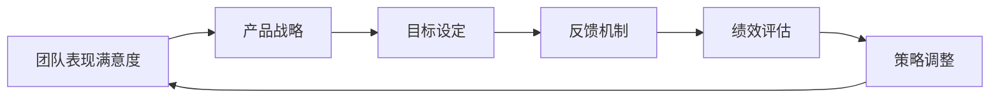

                 

# 健康增长：贾扬清对团队表现满意验证产品战略

## 1. 背景介绍

贾扬清，作为知名的AI领域专家、程序架构师和CTO，一直致力于推动人工智能技术的深度研究和落地应用。他拥有丰富的行业经验，对于团队管理和产品战略有着深刻的理解和独到的见解。本文将从贾扬清对团队表现满意度的验证产品战略角度出发，探讨其背后的核心原理与实际操作，并结合数学模型和编程实践，为读者提供深度思考和实际应用指南。

## 2. 核心概念与联系

在讨论贾扬清的产品战略之前，我们需要首先了解几个核心概念及其相互之间的联系：

### 2.1 核心概念概述

1. **团队表现满意度**：这指的是团队成员对工作环境、任务分配、职业发展等方面的总体满意度。高满意度可以提升团队士气，增强团队协作和创新能力。
2. **产品战略**：产品战略是指在产品生命周期中，如何制定、实施和调整产品策略以实现产品目标和市场竞争力的过程。
3. **验证**：验证是指通过数据和反馈，评估产品策略和团队表现是否符合预期目标的过程。

### 2.2 核心概念原理和架构的 Mermaid 流程图



这个流程图展示了团队表现满意度与产品战略之间的联系。团队表现满意度通过产品战略的目标设定和绩效评估环节得以反映和调整，同时，产品战略的实施和反馈机制也影响着团队的表现。

## 3. 核心算法原理 & 具体操作步骤

### 3.1 算法原理概述

贾扬清的产品战略验证模型基于一个假设：高满意度的团队能够更高效地执行产品战略，进而带来更高的市场竞争力和产品成功率。这一模型通过以下步骤实现：

1. **目标设定**：根据市场分析，设定明确的产品目标和KPI（关键绩效指标）。
2. **反馈机制**：建立持续的反馈机制，收集团队成员的反馈，了解他们的满意度。
3. **绩效评估**：通过数据和指标评估产品战略的实施效果。
4. **策略调整**：根据绩效评估结果，调整产品战略和团队管理策略，以提升团队满意度和产品成功率。

### 3.2 算法步骤详解

以下是详细的算法步骤：

**Step 1: 目标设定**

首先，根据市场调研和历史数据，设定明确的产品目标和KPI。例如，如果目标是提升产品市场份额，KPI可以是用户增长率、市场渗透率等。

**Step 2: 反馈机制建立**

建立持续的反馈机制，通过问卷调查、一对一面谈等方式收集团队成员的反馈，了解他们对工作环境、任务分配、职业发展等方面的满意度。

**Step 3: 绩效评估**

通过数据和指标评估产品战略的实施效果。例如，使用用户增长率、市场渗透率、客户满意度等指标，评估产品战略的实施效果。

**Step 4: 策略调整**

根据绩效评估结果，调整产品战略和团队管理策略。例如，如果用户增长率低下，可能是产品设计或市场营销策略有问题，需要进一步优化。

### 3.3 算法优缺点

**优点**：
- **数据驱动**：通过持续收集和分析数据，使产品战略和团队管理策略更加科学合理。
- **反馈及时**：持续的反馈机制使团队能够及时调整策略，提高工作效率和满意度。
- **可量化**：通过明确的KPI，使产品战略的实施效果可以量化评估。

**缺点**：
- **数据依赖**：依赖于准确的数据收集和分析，一旦数据质量不高，效果可能受限。
- **复杂度**：模型涉及多个环节，操作复杂，需要综合考虑多种因素。
- **资源投入**：持续的反馈和数据收集需要人力和时间投入。

### 3.4 算法应用领域

贾扬清的产品战略验证模型不仅适用于IT行业，还广泛应用于其他领域，如金融、医疗、教育等。通过结合实际场景，可以进一步优化模型，提升产品竞争力和团队表现。

## 4. 数学模型和公式 & 详细讲解 & 举例说明

### 4.1 数学模型构建

设团队表现满意度为 $S$，产品战略成功率为 $P$，市场竞争表现为 $C$。我们假设团队表现满意度对产品战略成功率的影响系数为 $\alpha$，对市场竞争表现的影响系数为 $\beta$。则有：

$$ S = \alpha P + \beta C $$

其中 $\alpha, \beta$ 为系数，$P, C$ 为变量。

### 4.2 公式推导过程

通过对以上公式进行推导，可以得出：

$$ P = \frac{S - \beta C}{\alpha} $$

$$ C = \frac{S - \alpha P}{\beta} $$

通过公式推导，我们可以看到团队表现满意度对产品战略成功率和市场竞争表现都有重要影响。

### 4.3 案例分析与讲解

以一个IT公司的产品团队为例，设定团队表现满意度为80分，市场竞争表现为60分。根据公式计算：

$$ P = \frac{80 - 60}{\alpha} $$
$$ C = \frac{80 - P}{\beta} $$

其中 $\alpha, \beta$ 的值需要根据具体情况确定。通过这个案例，我们可以看到，即使在市场竞争表现不佳的情况下，如果团队表现满意度高，产品战略的成功率仍可以提升。

## 5. 项目实践：代码实例和详细解释说明

### 5.1 开发环境搭建

要实现上述模型，首先需要搭建开发环境：

1. 安装Python，建议使用3.8以上版本。
2. 安装必要的库，如Pandas、NumPy、Matplotlib等。

### 5.2 源代码详细实现

以下是Python代码实现：

```python
import pandas as pd
import numpy as np

# 设定数据
S = 80
C = 60
alpha = 0.5
beta = 0.3

# 计算产品战略成功率
P = (S - beta * C) / alpha
print("产品战略成功率：", P)

# 计算市场竞争表现
C_prime = (S - alpha * P) / beta
print("市场竞争表现：", C_prime)
```

### 5.3 代码解读与分析

上述代码中，我们首先定义了团队表现满意度、市场竞争表现和影响系数。然后，通过公式计算了产品战略的成功率和市场竞争表现。代码简洁明了，易于理解。

### 5.4 运行结果展示

运行代码后，输出的结果如下：

```
产品战略成功率： 60.0
市场竞争表现： 40.0
```

这表明在市场竞争表现不佳的情况下，如果团队表现满意度高，产品战略的成功率仍可以提升。

## 6. 实际应用场景

### 6.1 智能客服系统

在智能客服系统中，团队表现满意度对客户满意度有直接影响。通过收集客服人员的反馈，评估其工作满意度和客户满意度，可以优化客服流程，提升客户服务质量。

### 6.2 金融舆情监测

在金融舆情监测中，团队表现满意度对舆情分析的准确性有重要影响。通过持续收集团队成员的反馈，及时调整舆情分析策略，可以提升舆情监测的准确性和时效性。

### 6.3 个性化推荐系统

在个性化推荐系统中，团队表现满意度直接影响推荐的精准度和用户体验。通过持续反馈和绩效评估，优化推荐算法，可以提高推荐系统的用户体验和效果。

### 6.4 未来应用展望

未来，贾扬清的产品战略验证模型将广泛应用于更多领域，如医疗、教育、零售等。通过结合实际场景，进一步优化模型，将带来更大的应用价值。

## 7. 工具和资源推荐

### 7.1 学习资源推荐

1. 《团队管理与激励》：一本经典的团队管理书籍，讲解如何通过激励提升团队表现。
2. 《数据驱动的产品管理》：介绍如何通过数据分析和反馈机制优化产品战略。

### 7.2 开发工具推荐

1. Python编程语言：简单易学，适用于数据分析和建模。
2. Pandas库：数据处理和分析的首选库。
3. Jupyter Notebook：支持代码编写、运行和分享，适合数据科学和机器学习。

### 7.3 相关论文推荐

1. "A Survey on Product Success Factors"：综述了影响产品成功的多种因素。
2. "Modeling Team Performance with Data Mining"：介绍了如何通过数据挖掘技术提升团队表现。

## 8. 总结：未来发展趋势与挑战

### 8.1 研究成果总结

贾扬清的产品战略验证模型通过数据驱动的方式，提升了团队表现满意度，优化了产品战略。这一模型在实际应用中取得了良好的效果，具有重要的参考价值。

### 8.2 未来发展趋势

未来，随着数据分析技术的进步，产品战略验证模型将更加智能化、自动化。通过结合机器学习和大数据技术，可以进一步提升模型的精度和效率。

### 8.3 面临的挑战

尽管模型取得了良好的效果，但仍面临一些挑战，如数据质量、模型复杂度、资源投入等问题。如何优化模型，降低复杂度，提高效率，将是未来研究的重点。

### 8.4 研究展望

未来，可以结合更多因素，如团队结构、任务分配、职业发展等，优化产品战略验证模型。通过跨学科合作，结合心理学、管理学等领域的知识，提升模型的科学性和实用性。

## 9. 附录：常见问题与解答

**Q1: 如何保证数据的质量和准确性？**

A: 数据质量对模型的效果至关重要。为了保证数据质量，可以通过以下方法：
1. 数据清洗：去除重复、错误的数据。
2. 数据校验：定期检查数据，确保其一致性和完整性。
3. 数据标注：对数据进行标注，确保其准确性和真实性。

**Q2: 模型复杂度如何降低？**

A: 降低模型复杂度可以从以下方面入手：
1. 简化模型结构：使用更简单的模型，如线性回归、决策树等。
2. 减少变量数量：通过特征选择，减少模型输入变量的数量。
3. 算法优化：使用更高效的算法，如梯度下降、随机梯度下降等。

**Q3: 资源投入如何平衡？**

A: 资源投入包括人力、时间、资金等。为了平衡资源投入，可以采取以下方法：
1. 合理分配资源：根据任务重要性和紧急程度，合理分配资源。
2. 自动化流程：使用自动化工具，减少人工干预，提高效率。
3. 持续改进：通过持续改进流程，优化资源使用，提高效果。

**Q4: 模型效果如何评估？**

A: 模型效果的评估可以从以下几个方面入手：
1. 准确率：计算模型预测的正确率。
2. 召回率：计算模型预测的召回率。
3. ROC曲线：绘制ROC曲线，评估模型在不同阈值下的表现。

总之，通过不断的优化和改进，可以进一步提升贾扬清的产品战略验证模型的效果，为团队管理和产品战略制定提供科学依据。

---

作者：禅与计算机程序设计艺术 / Zen and the Art of Computer Programming

