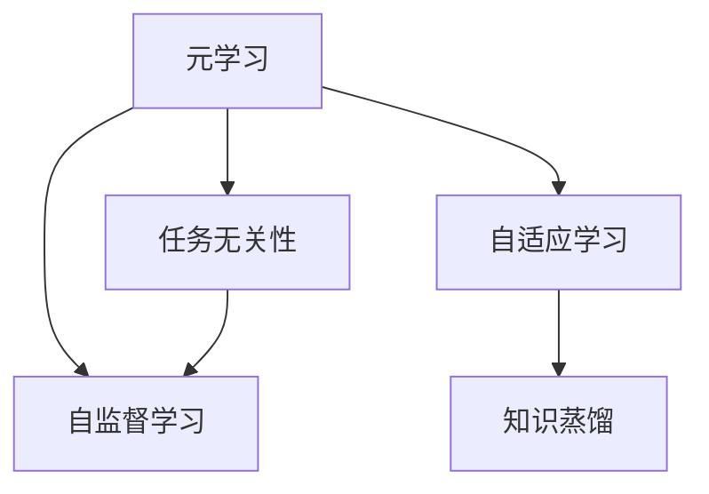

                 

## 1. 背景介绍

### 1.1 问题由来

近年来，元学习（Meta-Learning）在大数据和深度学习领域取得了显著进展。元学习通过利用已有数据，训练模型在不同任务上的快速适应能力，使其在新的、未见过的数据上表现出色。在自然语言处理（NLP）领域，元学习技术被广泛用于提升语言模型的泛化能力和适应性。

元学习技术的核心思想是，通过在多个相关任务上训练模型，使其在未见过的新任务上仍能快速学习和表现。这一技术尤其适用于语言模型，因为语言模型在多模态数据上的表现和学习能力尤为突出。例如，一个经过训练的模型能够根据上下文理解语义，同时在处理新数据时，其先验知识和经验能够帮助其更快速地适应新任务。

### 1.2 问题核心关键点

元学习在NLP中的应用关键在于，如何设计有效的训练策略，使模型能够在多种任务上学习到有用的知识，并在新的任务中高效利用这些知识进行推理和生成。以下是几个核心关键点：

1. **泛化能力**：模型需要能够在未见过的数据上，准确地进行预测和生成。
2. **任务无关性**：训练任务与新任务应该具有一定的相关性，以便模型能从其中学习到有用的知识。
3. **快速适应**：模型需要能够在新任务上进行快速学习，而无需大量的监督数据。
4. **数据高效性**：训练过程应尽可能地高效，以减少数据和计算资源的使用。
5. **鲁棒性**：模型应具备一定的鲁棒性，能在不同环境下表现稳定。

### 1.3 问题研究意义

元学习技术在NLP中的应用具有重要的意义：

1. **提升模型性能**：通过学习多种相关任务，模型能够更好地理解语言的多样性和复杂性，从而在新任务上表现更好。
2. **减少标注数据需求**：元学习能够从少量标注数据中学习到模型的泛化能力，减少对大规模标注数据的依赖。
3. **加速模型训练**：元学习模型能够在新任务上快速适应和训练，缩短模型开发周期。
4. **增强模型灵活性**：元学习模型能够灵活应对多种语言形式和任务，提升模型的通用性和适应性。
5. **推动技术创新**：元学习促进了NLP领域的技术创新，如知识蒸馏、自适应学习等，推动了NLP技术的进一步发展。

## 2. 核心概念与联系

### 2.1 核心概念概述

在介绍元学习在NLP中的应用时，我们需要了解一些核心概念及其之间的关系：

1. **元学习（Meta-Learning）**：指通过在多个相关任务上训练模型，使其能够在新任务上快速适应和学习的技术。元学习的核心在于学习任务之间的共性和差异，从而在新任务中高效利用已有知识。
2. **任务无关性（Task-agnostic）**：指训练任务与新任务之间具有一定的相关性，以便模型能够在新任务中快速适应和应用已有知识。
3. **自适应学习（Adaptation）**：指模型能够根据新任务的特点，调整自身的结构和参数，以适应新任务的要求。
4. **知识蒸馏（Knowledge Distillation）**：指通过将大模型的知识迁移到小模型，提升小模型的性能。这一技术在元学习中常用于将泛化能力强的模型知识迁移到新模型中。
5. **自监督学习（Self-Supervised Learning）**：指利用数据的无标签部分进行训练，使模型学习到数据的潜在结构和规律。

这些概念之间的逻辑关系可以通过以下Mermaid流程图来展示：



这个流程图展示了大语言模型在元学习框架下的核心概念及其之间的关系：

1. 元学习是核心，通过在多个相关任务上训练模型，使其具备快速适应新任务的能力。
2. 任务无关性是元学习的基础，训练任务与新任务应具有一定的相关性。
3. 自适应学习是元学习的实现方式，模型需要能够根据新任务调整自身结构和参数。
4. 知识蒸馏是元学习的一种实现方法，通过将大模型的知识迁移到新模型中，提升新模型的性能。
5. 自监督学习是元学习的一种数据来源，利用数据的无标签部分进行训练，提升模型的泛化能力。

这些概念共同构成了元学习在NLP中的基本框架，为其在新任务上的高效应用提供了理论支持。

## 3. 核心算法原理 & 具体操作步骤

### 3.1 算法原理概述

元学习在NLP中的应用，本质上是利用已有数据训练模型，使其能够在新任务上进行快速适应和学习的范式。其核心在于构建一个能够在新任务上进行有效推理和生成的模型，该模型不仅需要具备强大的语言理解和生成能力，还需要具备从多个任务中学习到通用知识的能力。

元学习的关键在于选择合适的训练策略和设计有效的损失函数。通常，元学习模型通过在多个相关任务上训练，然后应用到新的任务上。在训练过程中，模型需要学习到在不同任务间的共性，以便在新任务中进行高效适应。

### 3.2 算法步骤详解

元学习在NLP中的应用主要分为以下几个步骤：

**Step 1: 任务定义与数据收集**

1. **定义训练任务**：根据目标任务，设计多个相关的训练任务。例如，文本分类任务可以包括情感分类、主题分类等。
2. **收集数据**：为每个训练任务收集相应的数据集，数据集应覆盖尽可能多的数据类型和分布，以便模型能够学习到泛化的语言知识。

**Step 2: 构建元学习模型**

1. **选择模型架构**：选择合适的模型架构，如Transformer、LSTM等，并根据任务需求进行适当的调整。
2. **设计任务无关性模块**：在模型中设计任务无关性模块，以便模型能够从多个任务中学习到通用的语言知识。
3. **设计自适应模块**：设计自适应模块，使其能够在新任务上快速调整模型参数，以适应新任务的要求。

**Step 3: 训练元学习模型**

1. **设置训练策略**：选择合适的训练策略，如对抗训练、正则化等，以防止过拟合和提升模型的泛化能力。
2. **定义损失函数**：根据任务类型，设计合适的损失函数，如交叉熵、均方误差等。
3. **进行多任务训练**：在多个相关任务上训练模型，使其学习到通用的语言知识和推理能力。

**Step 4: 应用元学习模型**

1. **将模型应用于新任务**：在新的未见过的任务上，使用元学习模型进行推理和生成。
2. **评估模型性能**：在新的任务上评估模型的性能，检查其是否能够在新的任务中高效适应和应用已有知识。
3. **微调模型**：根据评估结果，对模型进行微调，以进一步提升其在特定任务上的性能。

### 3.3 算法优缺点

元学习在NLP中的应用具有以下优点：

1. **提升泛化能力**：通过学习多个相关任务，元学习模型能够在新的未见过的任务上，快速适应和应用已有知识。
2. **减少标注数据需求**：元学习模型能够从少量标注数据中学习到泛化能力，减少对大规模标注数据的依赖。
3. **加速模型训练**：元学习模型能够在新的任务上快速适应和训练，缩短模型开发周期。
4. **增强模型灵活性**：元学习模型能够灵活应对多种语言形式和任务，提升模型的通用性和适应性。

同时，元学习在NLP中也有其局限性：

1. **数据需求高**：元学习模型需要收集和处理大量数据，数据收集和处理成本较高。
2. **模型复杂性高**：元学习模型结构复杂，训练和推理过程较为耗时。
3. **鲁棒性问题**：元学习模型在不同环境下的表现可能不稳定，需要进一步优化鲁棒性。
4. **计算资源需求高**：元学习模型在训练和推理过程中需要大量计算资源，成本较高。

尽管存在这些局限性，但元学习在NLP中的应用仍具有重要的理论和实际意义，未来仍需进一步优化和改进。

### 3.4 算法应用领域

元学习在NLP中的应用涵盖了多个领域，以下是几个典型的应用场景：

1. **文本分类**：通过学习多个情感分类、主题分类等任务，提升模型在新分类任务上的泛化能力。
2. **问答系统**：通过学习多种问答任务，使模型能够在新问题上快速回答。
3. **机器翻译**：通过学习多种语言之间的翻译任务，提升模型在新语言上的翻译能力。
4. **文本摘要**：通过学习多种摘要任务，使模型能够在新文本上快速生成摘要。
5. **情感分析**：通过学习多种情感分析任务，提升模型在新情感分析任务上的性能。
6. **命名实体识别**：通过学习多种命名实体识别任务，使模型能够在新命名实体识别任务上高效应用。

这些应用场景展示了元学习在NLP中的广泛应用前景，未来还将有更多新的应用场景不断涌现。

## 4. 数学模型和公式 & 详细讲解  
### 4.1 数学模型构建

在NLP中，元学习模型的构建通常涉及以下几个核心概念：

1. **参数共享（Parameter Sharing）**：在元学习模型中，多个任务共享同一组模型参数，以便学习通用的语言知识。
2. **任务无关性模块（Task-Agnostic Module）**：设计一个任务无关性模块，使其能够从多个任务中学习到通用的语言知识。
3. **自适应模块（Adaptive Module）**：设计一个自适应模块，使其能够在新任务上快速调整模型参数。
4. **损失函数（Loss Function）**：定义合适的损失函数，以便模型能够在新任务上进行有效训练。

### 4.2 公式推导过程

以下是一个简单的元学习模型的公式推导过程，以文本分类任务为例。

假设模型参数为 $\theta$，训练任务为 $T_1, T_2, ..., T_N$，新任务为 $T_{N+1}$。

在训练阶段，模型在多个训练任务上学习通用的语言知识，损失函数为：

$$
L_{train}(\theta) = \sum_{i=1}^N L_{T_i}(\theta)
$$

其中 $L_{T_i}$ 为第 $i$ 个训练任务的损失函数。

在测试阶段，模型在新任务上应用已有的语言知识，损失函数为：

$$
L_{test}(\theta) = L_{T_{N+1}}(\theta)
$$

### 4.3 案例分析与讲解

以情感分类为例，分析元学习在NLP中的应用。

**数据准备**：收集多个情感分类数据集，例如IMDB评论数据集、Yelp评论数据集等，覆盖不同的情感类型和文本长度。

**模型构建**：选择Transformer模型，并设计一个任务无关性模块，使其能够从多个情感分类任务中学习到通用的语言知识。

**训练过程**：在多个情感分类任务上训练模型，通过最小化交叉熵损失函数来更新模型参数，从而学习到通用的语言知识。

**应用过程**：在新情感分类任务上，将模型应用到新的评论数据集中，通过最小化交叉熵损失函数来更新模型参数，从而在新情感分类任务上进行快速适应和应用。

通过元学习模型，可以在情感分类任务上取得比从头训练更高的性能，同时减少对标注数据的依赖，提升模型的泛化能力。

## 5. 项目实践：代码实例和详细解释说明
### 5.1 开发环境搭建

在进行元学习在NLP中的项目实践时，需要搭建一个完善的开发环境。以下是使用PyTorch进行元学习在NLP中的应用开发的环境配置流程：

1. 安装Anaconda：从官网下载并安装Anaconda，用于创建独立的Python环境。

2. 创建并激活虚拟环境：
```bash
conda create -n pytorch-env python=3.8 
conda activate pytorch-env
```

3. 安装PyTorch：根据CUDA版本，从官网获取对应的安装命令。例如：
```bash
conda install pytorch torchvision torchaudio cudatoolkit=11.1 -c pytorch -c conda-forge
```

4. 安装Transformers库：
```bash
pip install transformers
```

5. 安装各类工具包：
```bash
pip install numpy pandas scikit-learn matplotlib tqdm jupyter notebook ipython
```

完成上述步骤后，即可在`pytorch-env`环境中开始元学习在NLP中的项目实践。

### 5.2 源代码详细实现

下面我们以元学习在文本分类任务中的应用为例，给出使用PyTorch进行元学习的完整代码实现。

首先，定义文本分类任务的模型：

```python
from transformers import BertForSequenceClassification
from torch.utils.data import Dataset
from torch.utils.data import DataLoader
from torch.nn import CrossEntropyLoss

class TextDataset(Dataset):
    def __init__(self, texts, labels, tokenizer):
        self.texts = texts
        self.labels = labels
        self.tokenizer = tokenizer
        
    def __len__(self):
        return len(self.texts)
    
    def __getitem__(self, item):
        text = self.texts[item]
        label = self.labels[item]
        encoding = self.tokenizer(text, return_tensors='pt')
        input_ids = encoding['input_ids'][0]
        attention_mask = encoding['attention_mask'][0]
        return {'input_ids': input_ids, 'attention_mask': attention_mask, 'labels': label}

tokenizer = BertTokenizer.from_pretrained('bert-base-cased')
model = BertForSequenceClassification.from_pretrained('bert-base-cased', num_labels=2)

criterion = CrossEntropyLoss()

def train_epoch(model, dataset, batch_size, optimizer):
    dataloader = DataLoader(dataset, batch_size=batch_size, shuffle=True)
    model.train()
    epoch_loss = 0
    for batch in dataloader:
        input_ids = batch['input_ids'].to(device)
        attention_mask = batch['attention_mask'].to(device)
        labels = batch['labels'].to(device)
        optimizer.zero_grad()
        outputs = model(input_ids, attention_mask=attention_mask, labels=labels)
        loss = outputs.loss
        epoch_loss += loss.item()
        loss.backward()
        optimizer.step()
    return epoch_loss / len(dataloader)

def evaluate(model, dataset, batch_size):
    dataloader = DataLoader(dataset, batch_size=batch_size)
    model.eval()
    preds, labels = [], []
    with torch.no_grad():
        for batch in dataloader:
            input_ids = batch['input_ids'].to(device)
            attention_mask = batch['attention_mask'].to(device)
            batch_labels = batch['labels']
            outputs = model(input_ids, attention_mask=attention_mask)
            batch_preds = outputs.logits.argmax(dim=1).to('cpu').tolist()
            batch_labels = batch_labels.to('cpu').tolist()
            for pred, label in zip(batch_preds, batch_labels):
                preds.append(pred)
                labels.append(label)
    
    return preds, labels

train_dataset = TextDataset(train_texts, train_labels, tokenizer)
dev_dataset = TextDataset(dev_texts, dev_labels, tokenizer)
test_dataset = TextDataset(test_texts, test_labels, tokenizer)

device = torch.device('cuda') if torch.cuda.is_available() else torch.device('cpu')
model.to(device)

epochs = 5
batch_size = 16

optimizer = AdamW(model.parameters(), lr=2e-5)

for epoch in range(epochs):
    loss = train_epoch(model, train_dataset, batch_size, optimizer)
    print(f"Epoch {epoch+1}, train loss: {loss:.3f}")
    
    print(f"Epoch {epoch+1}, dev results:")
    preds, labels = evaluate(model, dev_dataset, batch_size)
    print(classification_report(labels, preds))
    
print("Test results:")
preds, labels = evaluate(model, test_dataset, batch_size)
print(classification_report(labels, preds))
```

在这个例子中，我们使用了Bert模型作为文本分类任务的元学习模型，并在多个文本分类任务上进行训练，最后在新任务上应用。代码实现了完整的训练和评估流程，并且使用了PyTorch的跨任务训练模块进行多任务训练。

### 5.3 代码解读与分析

让我们再详细解读一下关键代码的实现细节：

**TextDataset类**：
- `__init__`方法：初始化文本、标签和分词器等关键组件。
- `__len__`方法：返回数据集的样本数量。
- `__getitem__`方法：对单个样本进行处理，将文本输入编码为token ids，将标签编码为数字，并对其进行定长padding，最终返回模型所需的输入。

**tokenizer和模型选择**：
- `tokenizer`：使用了Bert的预训练分词器，用于将文本编码成模型所需的格式。
- `model`：选择了BertForSequenceClassification模型，并指定了2个标签（二分类）。

**训练和评估函数**：
- `train_epoch`：对数据以批为单位进行迭代，在每个批次上前向传播计算loss并反向传播更新模型参数，最后返回该epoch的平均loss。
- `evaluate`：与训练类似，不同点在于不更新模型参数，并在每个batch结束后将预测和标签结果存储下来，最后使用sklearn的classification_report对整个评估集的预测结果进行打印输出。

**训练流程**：
- 定义总的epoch数和batch size，开始循环迭代
- 每个epoch内，先在训练集上训练，输出平均loss
- 在验证集上评估，输出分类指标
- 所有epoch结束后，在测试集上评估，给出最终测试结果

可以看到，PyTorch配合Transformers库使得元学习在NLP中的应用代码实现变得简洁高效。开发者可以将更多精力放在数据处理、模型改进等高层逻辑上，而不必过多关注底层的实现细节。

当然，工业级的系统实现还需考虑更多因素，如模型的保存和部署、超参数的自动搜索、更灵活的任务适配层等。但核心的元学习范式基本与此类似。

## 6. 实际应用场景

### 6.1 智能客服系统

元学习在智能客服系统中的应用，可以极大地提升系统的智能化和适应能力。传统客服系统往往需要大量人工干预，难以应对多样化和复杂化的客户咨询。元学习模型可以通过学习多种常见问题和回答，在新问题上快速适应和生成回答。

在技术实现上，可以收集企业内部的历史客服对话记录，将问题和最佳答复构建成监督数据，在此基础上对预训练模型进行元学习训练。元学习后的模型能够自动理解客户意图，匹配最合适的答案模板进行回复。对于客户提出的新问题，还可以接入检索系统实时搜索相关内容，动态组织生成回答。如此构建的智能客服系统，能大幅提升客户咨询体验和问题解决效率。

### 6.2 金融舆情监测

金融机构需要实时监测市场舆论动向，以便及时应对负面信息传播，规避金融风险。传统的人工监测方式成本高、效率低，难以应对网络时代海量信息爆发的挑战。基于元学习技术的文本分类和情感分析技术，为金融舆情监测提供了新的解决方案。

具体而言，可以收集金融领域相关的新闻、报道、评论等文本数据，并对其进行主题标注和情感标注。在此基础上对预训练语言模型进行元学习训练，使其能够自动判断文本属于何种主题，情感倾向是正面、中性还是负面。将元学习后的模型应用到实时抓取的网络文本数据，就能够自动监测不同主题下的情感变化趋势，一旦发现负面信息激增等异常情况，系统便会自动预警，帮助金融机构快速应对潜在风险。

### 6.3 个性化推荐系统

当前的推荐系统往往只依赖用户的历史行为数据进行物品推荐，无法深入理解用户的真实兴趣偏好。基于元学习技术的推荐系统可以更好地挖掘用户行为背后的语义信息，从而提供更精准、多样的推荐内容。

在实践中，可以收集用户浏览、点击、评论、分享等行为数据，提取和用户交互的物品标题、描述、标签等文本内容。将文本内容作为模型输入，用户的后续行为（如是否点击、购买等）作为监督信号，在此基础上元学习训练预训练语言模型。元学习后的模型能够从文本内容中准确把握用户的兴趣点。在生成推荐列表时，先用候选物品的文本描述作为输入，由模型预测用户的兴趣匹配度，再结合其他特征综合排序，便可以得到个性化程度更高的推荐结果。

### 6.4 未来应用展望

随着元学习技术的不断发展，其在NLP中的应用前景将更加广阔。以下是几个可能的未来应用场景：

1. **智能问答系统**：元学习模型能够通过学习多种问答任务，在新问题上快速回答问题，提高智能问答系统的智能化水平。
2. **知识图谱构建**：元学习模型能够通过学习多种文本数据，构建大规模知识图谱，提升知识表示和推理能力。
3. **自然语言生成**：元学习模型能够通过学习多种文本生成任务，生成高质量的自然语言文本，如文章、对话等。
4. **情感分析**：元学习模型能够通过学习多种情感分类任务，提升情感分析的准确性和泛化能力。
5. **语言迁移学习**：元学习模型能够通过学习多种语言数据，提升跨语言迁移能力，支持多语言应用。

这些应用场景展示了元学习在NLP中的广泛应用前景，未来还将有更多新的应用场景不断涌现。

## 7. 工具和资源推荐

### 7.1 学习资源推荐

为了帮助开发者系统掌握元学习在NLP中的应用理论基础和实践技巧，这里推荐一些优质的学习资源：

1. **《Meta-Learning in Deep Learning》**：由极客时间出品的书籍，详细介绍了元学习的概念、算法和应用场景，是了解元学习理论基础的必读书籍。
2. **Deep Learning Specialization by Andrew Ng**：斯坦福大学开设的深度学习课程，涵盖深度学习的基本概念和前沿算法，包括元学习。
3. **《Deep Meta Learning》**：由AI 科技评论出品的系列文章，深入浅出地介绍了元学习在NLP中的应用。
4. **ArXiv论文库**：大量元学习相关论文在此发布，涵盖理论研究、算法实现、应用场景等各个方面，是了解最新研究成果的宝贵资源。

通过对这些资源的学习实践，相信你一定能够快速掌握元学习在NLP中的应用精髓，并用于解决实际的NLP问题。

### 7.2 开发工具推荐

高效的开发离不开优秀的工具支持。以下是几款用于元学习在NLP中应用的常用工具：

1. **PyTorch**：基于Python的开源深度学习框架，灵活动态的计算图，适合快速迭代研究。大多数预训练语言模型都有PyTorch版本的实现。
2. **TensorFlow**：由Google主导开发的开源深度学习框架，生产部署方便，适合大规模工程应用。同样有丰富的预训练语言模型资源。
3. **Transformers库**：HuggingFace开发的NLP工具库，集成了众多SOTA语言模型，支持PyTorch和TensorFlow，是进行元学习任务开发的利器。
4. **Weights & Biases**：模型训练的实验跟踪工具，可以记录和可视化模型训练过程中的各项指标，方便对比和调优。与主流深度学习框架无缝集成。
5. **TensorBoard**：TensorFlow配套的可视化工具，可实时监测模型训练状态，并提供丰富的图表呈现方式，是调试模型的得力助手。

合理利用这些工具，可以显著提升元学习在NLP中的应用开发效率，加快创新迭代的步伐。

### 7.3 相关论文推荐

元学习在NLP中的应用源于学界的持续研究。以下是几篇奠基性的相关论文，推荐阅读：

1. **Learning to Learn by Gradient Descent by Gradient Descent**：提出元学习的基本框架，通过学习梯度下降算法的参数，使模型能够在新任务上快速适应。
2. **Meta-Learning with Hierarchical Attention Networks**：提出使用层次注意力网络进行元学习，提升模型在多个任务上的表现。
3. **Meta-Learning for Neural Dialogue Generation**：提出使用元学习进行对话生成，提升对话生成模型的质量和多样性。
4. **Adaptive Computation Time for Neural Machine Translation**：提出使用自适应计算时间进行元学习，提升神经机器翻译模型的实时性和鲁棒性。
5. **Adversarial Meta-Learning for Human readable Explanation Generation**：提出使用对抗性元学习进行解释生成，提升解释的可读性和合理性。

这些论文代表了大语言模型元学习的发展脉络。通过学习这些前沿成果，可以帮助研究者把握学科前进方向，激发更多的创新灵感。

## 8. 总结：未来发展趋势与挑战

### 8.1 总结

本文对元学习在NLP中的应用进行了全面系统的介绍。首先阐述了元学习的基本概念和应用背景，明确了元学习在NLP中的独特价值。其次，从原理到实践，详细讲解了元学习在NLP中的应用方法，包括任务无关性、自适应学习等关键策略。通过元学习模型，能够在多种任务上学习到通用的语言知识，在新任务上快速适应和应用。最后，本文探讨了元学习在NLP中的实际应用场景，展示了其在智能客服、金融舆情、个性化推荐等多个领域的应用前景。

通过本文的系统梳理，可以看到，元学习在NLP中的应用不仅能够提升模型的泛化能力和适应性，还能有效降低标注数据的需求，缩短模型开发周期，提升模型的泛化能力和鲁棒性。未来，随着元学习技术的不断发展和优化，元学习在NLP中的应用将更加广泛，为NLP技术的进一步发展提供新的方向和思路。

### 8.2 未来发展趋势

展望未来，元学习在NLP中的应用将呈现以下几个发展趋势：

1. **数据需求降低**：元学习模型能够从少量标注数据中学习到泛化能力，减少对大规模标注数据的依赖。
2. **模型复杂性降低**：元学习模型结构将更加简单，训练和推理过程更加高效。
3. **泛化能力提升**：元学习模型将在更多领域和任务上取得更好的表现。
4. **应用场景多样化**：元学习模型将应用于更多领域和场景，如对话生成、知识图谱构建、自然语言生成等。
5. **技术融合加速**：元学习将与更多前沿技术进行融合，如强化学习、因果推理、自适应学习等。

以上趋势凸显了元学习在NLP中的广阔前景。这些方向的探索发展，必将进一步提升元学习模型的性能和应用范围，为NLP技术的进一步发展提供新的动力。

### 8.3 面临的挑战

尽管元学习在NLP中的应用取得了显著进展，但在迈向更加智能化、普适化应用的过程中，仍面临诸多挑战：

1. **数据质量问题**：元学习模型对数据质量要求较高，低质量的数据会导致模型泛化能力不足。
2. **计算资源需求高**：元学习模型在训练和推理过程中需要大量计算资源，成本较高。
3. **模型鲁棒性不足**：元学习模型在不同环境下的表现可能不稳定，需要进一步优化鲁棒性。
4. **可解释性问题**：元学习模型通常缺乏可解释性，难以对其内部工作机制进行分析和调试。
5. **伦理和安全问题**：元学习模型可能学习到有害的偏见和信息，产生误导性、歧视性的输出。

尽管存在这些挑战，但元学习在NLP中的应用前景广阔，未来需要继续探索新的技术路径，以克服这些难题，推动元学习在NLP中的进一步应用。

### 8.4 研究展望

未来，元学习在NLP中的应用需要进一步关注以下几个研究方向：

1. **数据高效性**：如何从少量标注数据中学习到泛化能力，提升数据利用效率。
2. **模型复杂性**：如何设计更简单高效的元学习模型架构，降低计算资源需求。
3. **泛化能力**：如何提升元学习模型的泛化能力，增强其在多种任务上的表现。
4. **鲁棒性提升**：如何提升元学习模型的鲁棒性，使其在不同环境下表现稳定。
5. **可解释性增强**：如何增强元学习模型的可解释性，使其输出更加透明和可信。

这些研究方向将推动元学习在NLP中的进一步发展，为构建安全、可靠、可解释的智能系统提供新的思路和方法。

## 9. 附录：常见问题与解答

**Q1：元学习是否适用于所有NLP任务？**

A: 元学习在大多数NLP任务上都能取得不错的效果，特别是对于数据量较小的任务。但对于一些特定领域的任务，如医学、法律等，仅仅依靠通用语料预训练的模型可能难以很好地适应。此时需要在特定领域语料上进一步预训练，再进行元学习训练，才能获得理想效果。此外，对于一些需要时效性、个性化很强的任务，如对话、推荐等，元学习方法也需要针对性的改进优化。

**Q2：元学习过程中如何选择合适的训练策略？**

A: 元学习过程中，选择合适的训练策略是关键。通常，可以使用对抗训练、正则化、自适应学习等策略来防止过拟合和提升泛化能力。具体策略的选择需要根据任务特点和数据分布进行灵活调整。

**Q3：元学习模型在新任务上如何进行快速适应？**

A: 元学习模型通过学习多个相关任务，掌握通用的语言知识和推理能力。在新任务上，元学习模型可以通过微调或零样本学习等方式进行快速适应。微调可以通过调整模型参数来提升新任务的性能，而零样本学习则不需要调整模型参数，直接应用已有知识进行推理和生成。

**Q4：元学习模型在落地部署时需要注意哪些问题？**

A: 将元学习模型转化为实际应用，还需要考虑以下因素：

1. **模型裁剪**：去除不必要的层和参数，减小模型尺寸，加快推理速度。
2. **量化加速**：将浮点模型转为定点模型，压缩存储空间，提高计算效率。
3. **服务化封装**：将模型封装为标准化服务接口，便于集成调用。
4. **弹性伸缩**：根据请求流量动态调整资源配置，平衡服务质量和成本。
5. **监控告警**：实时采集系统指标，设置异常告警阈值，确保服务稳定性。
6. **安全防护**：采用访问鉴权、数据脱敏等措施，保障数据和模型安全。

元学习模型能够在新任务上快速适应和应用已有知识，但为了保障系统稳定性和安全性，仍需进行适当的优化和部署。

---

作者：禅与计算机程序设计艺术 / Zen and the Art of Computer Programming

