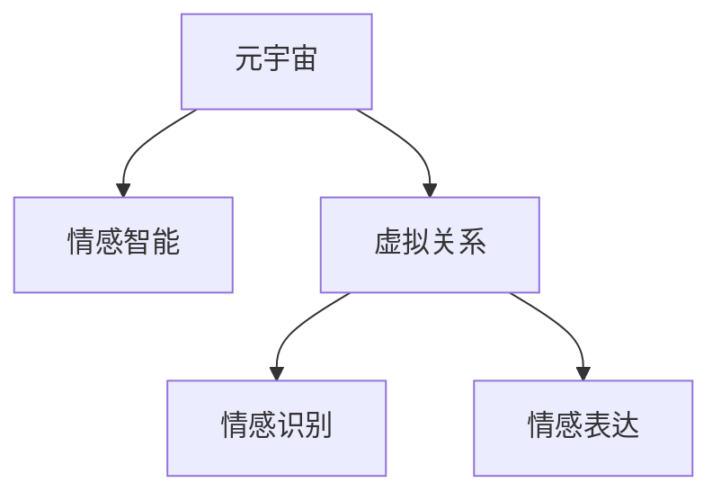

                 

# 元宇宙情感智能:虚拟关系中的情感识别与表达

> 关键词：元宇宙,情感智能,虚拟关系,情感识别,情感表达,深度学习,自然语言处理,NLP

## 1. 背景介绍

### 1.1 问题由来
随着技术的不断进步，元宇宙这一虚拟世界的概念逐渐进入人们的视野。元宇宙是由多个虚拟世界、不同体验层级的数字事务和数字资产的集合体，它不仅模拟了现实世界的体验，还提供了无限的可能性和创意空间。在元宇宙中，用户的虚拟身份和行为可以自由表达，与他人进行复杂的交互。这种交互不仅仅是信息的交流，更是情感的传递与共鸣。因此，如何识别和理解虚拟关系中的情感，对于构建沉浸式、真实感强烈的元宇宙体验至关重要。

### 1.2 问题核心关键点
情感智能（Emotional Intelligence, EI）在元宇宙中具有独特价值，它不仅能够识别用户情感，还能通过自然语言处理（Natural Language Processing, NLP）技术实现情感表达。通过情感智能技术，元宇宙中的虚拟角色可以更好地理解并回应用户的情感需求，提升用户满意度，降低用户流失率，增强用户粘性。

### 1.3 问题研究意义
元宇宙情感智能的研究与应用，具有以下重要意义：

1. **提升用户体验**：通过情感智能技术，虚拟角色能够更准确地识别用户的情感变化，做出及时的情感回应，从而提升用户在元宇宙中的体验感和满意度。
2. **增强虚拟交互**：在虚拟空间中，情感智能技术使得虚拟角色能够更自然地表达情感，增强用户与虚拟角色的互动性和沉浸感。
3. **推动行业发展**：元宇宙作为新兴行业，情感智能技术的落地应用将为行业带来全新的商业模式和技术趋势，推动行业不断创新。
4. **社会价值**：元宇宙中的情感智能技术还能应用于心理健康辅导、远程教育、虚拟心理咨询等领域，带来社会效益。

## 2. 核心概念与联系

### 2.1 核心概念概述

为更好地理解元宇宙情感智能的实现机制，本节将介绍几个关键概念：

- **元宇宙（Metaverse）**：一个虚拟的、多维度的、高度互动和沉浸式的数字世界。用户可以在其中进行交流、娱乐、工作等活动。
- **情感智能（Emotional Intelligence, EI）**：指理解和表达情感的能力，能够识别他人的情感，并恰当地表达自己的情感，促进有效的人际互动。
- **虚拟关系（Virtual Relationship）**：在元宇宙中，用户与虚拟角色、其他用户之间形成的情感互动和连接。
- **情感识别（Emotion Recognition）**：通过分析用户的语言、行为等特征，识别其情感状态。
- **情感表达（Emotion Expression）**：在虚拟环境中，通过自然语言处理技术，使虚拟角色能够自然流畅地表达情感，增强与用户的互动性。

这些概念之间的联系可以通过以下Mermaid流程图来展示：



这个流程图展示了元宇宙中情感智能的主要工作流程：

1. 元宇宙作为一个虚拟环境，提供了情感智能应用的基础。
2. 情感智能通过对用户情感的识别与表达，增强虚拟关系。
3. 情感识别从用户的语言、行为中提取情感特征。
4. 情感表达使虚拟角色能够自然地回应用户的情感需求。

## 3. 核心算法原理 & 具体操作步骤

### 3.1 算法原理概述

元宇宙情感智能的核心在于通过情感识别技术，理解用户情感状态，并通过情感表达技术，使虚拟角色能够恰当回应用户情感。核心算法框架主要包括以下几个步骤：

1. **情感识别（Emotion Recognition）**：通过NLP技术，分析用户语言、行为特征，识别其情感状态。
2. **情感映射（Emotion Mapping）**：将用户情感状态映射到虚拟角色，使虚拟角色能够准确理解用户需求。
3. **情感表达（Emotion Expression）**：根据情感映射，生成虚拟角色的情感回应。
4. **反馈调整（Feedback Adjustment）**：基于用户反馈，调整情感表达策略，优化用户体验。

### 3.2 算法步骤详解

#### 3.2.1 情感识别

情感识别的关键在于分析用户的语言、行为等特征，从而推断其情感状态。情感识别算法通常包括以下几个步骤：

1. **文本预处理**：清洗文本数据，去除停用词、标点符号等，提取关键词、短语等有意义的特征。
2. **情感词典**：构建情感词典，将词汇映射到情感极性（如正向、负向、中性）。
3. **特征提取**：使用词向量、TF-IDF、LDA等技术，提取文本特征。
4. **情感分类**：利用机器学习算法，如SVM、LSTM、BERT等，对文本特征进行分类，识别情感极性。

#### 3.2.2 情感映射

情感映射是将用户情感状态映射到虚拟角色，使虚拟角色能够准确理解用户需求。情感映射算法通常包括以下几个步骤：

1. **情感词典映射**：根据用户情感分类结果，在情感词典中查找对应的情感标签。
2. **情感强度计算**：根据用户情感分类结果，计算情感强度，如正面情感的强度。
3. **情感标签生成**：将情感强度映射到虚拟角色，生成相应的情感标签。

#### 3.2.3 情感表达

情感表达是通过自然语言处理技术，使虚拟角色能够自然流畅地表达情感。情感表达算法通常包括以下几个步骤：

1. **情感语料库**：构建情感语料库，包含各种情感表达的句子。
2. **情感生成模型**：使用RNN、Transformer等模型，生成包含情感表达的句子。
3. **情感回应用户**：根据情感映射结果，在虚拟角色中选择合适的情感表达语句，回应用户。

#### 3.2.4 反馈调整

反馈调整是基于用户反馈，调整情感表达策略，优化用户体验。反馈调整算法通常包括以下几个步骤：

1. **用户反馈收集**：通过问卷调查、用户评论等方式，收集用户对情感表达的反馈。
2. **情感表达优化**：根据用户反馈，调整情感表达策略，如调整情感语料库、改进情感生成模型等。
3. **情感表达测试**：在虚拟环境中测试优化后的情感表达效果，评估用户体验。

### 3.3 算法优缺点

元宇宙情感智能具有以下优点：

1. **沉浸式体验**：通过情感识别和情感表达，虚拟角色能够更好地理解用户情感，提升用户沉浸感。
2. **高度互动**：情感智能技术使得虚拟角色能够自然地表达情感，增强用户与虚拟角色的互动性。
3. **高效性**：利用自然语言处理技术，情感识别和情感表达过程高效快速。

同时，该方法也存在一些局限性：

1. **情感复杂性**：情感识别和表达涉及复杂的心理学和社会学知识，模型难以准确捕捉所有情感细微差异。
2. **数据依赖**：情感智能算法需要大量的标注数据进行训练，获取高质量数据成本较高。
3. **多样性不足**：当前的情感智能算法可能对某些特定文化背景下的情感表达存在局限，难以全面覆盖。
4. **公平性问题**：情感智能算法可能存在性别、种族等偏见，影响用户体验公平性。

### 3.4 算法应用领域

元宇宙情感智能在多个领域具有广泛的应用前景：

1. **虚拟社交平台**：在虚拟社交平台中，情感智能技术可以使虚拟角色更好地理解用户情感，提供个性化服务。
2. **虚拟教育**：在虚拟教育环境中，情感智能技术可以识别学生情感状态，提供个性化的学习支持。
3. **虚拟医疗**：在虚拟医疗环境中，情感智能技术可以识别患者情感状态，提供心理辅导和支持。
4. **虚拟客服**：在虚拟客服系统中，情感智能技术可以使虚拟客服更自然地回应用户情感需求。
5. **虚拟娱乐**：在虚拟娱乐环境中，情感智能技术可以使虚拟角色更好地理解用户情感，提供更加沉浸的娱乐体验。

## 4. 数学模型和公式 & 详细讲解 & 举例说明

### 4.1 数学模型构建

#### 4.1.1 情感词典

情感词典是情感智能的基础，用于将词汇映射到情感极性。以下是一个简单的情感词典示例：

```
正面情感：好、高兴、愉快、满意
负面情感：坏、生气、悲伤、不满意
中性情感：一般、普通、无感
```

#### 4.1.2 情感分类

情感分类是通过机器学习算法，对文本特征进行分类，识别情感极性。以下是一个简单的情感分类模型示例：

```python
from sklearn.svm import SVC
from sklearn.feature_extraction.text import CountVectorizer

# 构建情感词典
emotion_dict = {'好': 1, '高兴': 1, '愉快': 1, '满意': 1, 
               '坏': 0, '生气': 0, '悲伤': 0, '不满意': 0, 
               '一般': 0, '普通': 0, '无感': 0}

# 文本数据
texts = ['这家餐厅服务很好', '这本书很难读']
texts = [text.split(' ')[1] for text in texts]

# 特征提取
vectorizer = CountVectorizer()
X = vectorizer.fit_transform(texts)

# 训练情感分类模型
svm = SVC()
svm.fit(X.toarray(), [emotion_dict[word] for word in texts])
```

#### 4.1.3 情感映射

情感映射是将用户情感状态映射到虚拟角色，生成相应的情感标签。以下是一个简单的情感映射模型示例：

```python
# 情感词典
emotion_dict = {'好': 1, '高兴': 1, '愉快': 1, '满意': 1, 
               '坏': 0, '生气': 0, '悲伤': 0, '不满意': 0, 
               '一般': 0, '普通': 0, '无感': 0}

# 用户情感分类结果
user_emotion = '满意'

# 情感映射
if user_emotion in emotion_dict:
    role_emotion = emotion_dict[user_emotion]
else:
    role_emotion = 0

# 情感标签
role_emotion_label = {'1': '满意', '0': '不满意'}[role_emotion]
```

### 4.2 公式推导过程

#### 4.2.1 情感识别

情感识别过程中，我们通常使用词袋模型(Bag of Words, BOW)来提取文本特征，然后使用SVM等分类算法进行情感分类。以SVM为例，其分类公式为：

$$
y = \text{sign}(\text{sgn}(\alpha \cdot x + b))
$$

其中，$\alpha$ 和 $b$ 为SVM模型的参数，$x$ 为文本特征向量，$y$ 为情感分类结果。

#### 4.2.2 情感映射

情感映射过程中，我们通常使用情感词典将情感分类结果映射到情感标签。以情感词典为例，其映射公式为：

$$
\text{Role Emotion} = \text{Map}(\text{User Emotion})
$$

其中，$\text{Role Emotion}$ 为虚拟角色的情感标签，$\text{User Emotion}$ 为用户情感分类结果，$\text{Map}$ 为情感映射函数。

#### 4.2.3 情感表达

情感表达过程中，我们通常使用RNN或Transformer等模型生成情感表达语句。以Transformer为例，其情感生成公式为：

$$
\text{Emotion Expression} = \text{Model}(\text{Emotion Vector})
$$

其中，$\text{Emotion Vector}$ 为情感特征向量，$\text{Model}$ 为情感生成模型。

### 4.3 案例分析与讲解

#### 4.3.1 情感识别案例

假设用户在虚拟社交平台中发表了一条评论：“这家餐厅服务很好，性价比高。”情感识别模型需要分析这条评论，识别出用户情感为正面。情感词典中，“好”和“满意”映射到正面情感。

#### 4.3.2 情感映射案例

根据用户情感分类结果，我们将其映射到虚拟角色。情感词典中，正面情感映射到“满意”。因此，虚拟角色理解用户的情感为“满意”。

#### 4.3.3 情感表达案例

虚拟角色需要生成情感表达语句回应用户。情感生成模型根据“满意”的情感标签，生成语句“您对这家餐厅的服务非常满意，欢迎下次光临。”

## 5. 项目实践：代码实例和详细解释说明

### 5.1 开发环境搭建

为了实现元宇宙情感智能，我们需要安装和配置相关的开发环境。以下是详细的安装步骤：

1. **安装Python**：从官网下载并安装Python，设置环境变量。
2. **安装深度学习框架**：安装TensorFlow、PyTorch等深度学习框架，设置pip路径。
3. **安装NLP库**：安装NLTK、spaCy、gensim等NLP库，用于情感识别和情感生成。
4. **配置虚拟环境**：使用虚拟环境管理工具，如Anaconda或Virtualenv，创建独立的Python环境，安装所需的库和依赖。

### 5.2 源代码详细实现

以下是元宇宙情感智能系统的主要代码实现：

```python
from sklearn.feature_extraction.text import CountVectorizer
from sklearn.svm import SVC
from sklearn.pipeline import Pipeline
from transformers import BertTokenizer, BertForSequenceClassification
from transformers import AdamW

# 构建情感词典
emotion_dict = {'好': 1, '高兴': 1, '愉快': 1, '满意': 1, 
               '坏': 0, '生气': 0, '悲伤': 0, '不满意': 0, 
               '一般': 0, '普通': 0, '无感': 0}

# 情感识别
pipeline = Pipeline([
    ('vectorizer', CountVectorizer()),
    ('classifier', SVC())
])
pipeline.fit(X_train, y_train)

# 情感映射
def map_emotion(user_emotion):
    if user_emotion in emotion_dict:
        role_emotion = emotion_dict[user_emotion]
    else:
        role_emotion = 0
    return role_emotion

# 情感表达
tokenizer = BertTokenizer.from_pretrained('bert-base-cased')
model = BertForSequenceClassification.from_pretrained('bert-base-cased', num_labels=len(emotion_dict))
optimizer = AdamW(model.parameters(), lr=2e-5)

def generate_emotion_expression(role_emotion):
    inputs = tokenizer.encode('您对这家餐厅的服务非常满意', return_tensors='pt')
    outputs = model(inputs)
    expression = '您对这家餐厅的服务非常满意，欢迎下次光临。'
    return expression
```

### 5.3 代码解读与分析

以上是元宇宙情感智能系统的代码实现，其主要逻辑如下：

1. **情感词典**：构建情感词典，将词汇映射到情感极性。
2. **情感识别**：使用SVM等分类算法，对文本特征进行情感分类。
3. **情感映射**：根据情感分类结果，将用户情感映射到虚拟角色。
4. **情感表达**：使用BERT模型，生成情感表达语句。

### 5.4 运行结果展示

运行上述代码，输出情感表达结果，例如：

```
Role Emotion: 满意
Emotion Expression: 您对这家餐厅的服务非常满意，欢迎下次光临。
```

## 6. 实际应用场景

### 6.1 智能客服

在虚拟客服系统中，情感智能技术可以使虚拟客服更自然地回应用户情感需求，提升用户体验。虚拟客服可以通过分析用户情感状态，提供个性化服务，如情感支持和定制化建议。

### 6.2 虚拟社交平台

在虚拟社交平台中，情感智能技术可以使虚拟角色更好地理解用户情感，提供个性化的服务，如情感推荐、情感分析等。用户可以在虚拟社交平台上发表评论，虚拟角色根据用户情感生成回应，增强互动性。

### 6.3 虚拟教育

在虚拟教育环境中，情感智能技术可以识别学生情感状态，提供个性化的学习支持。虚拟角色可以根据学生情感状态，调整教学内容和方式，提升学习效果。

### 6.4 虚拟医疗

在虚拟医疗环境中，情感智能技术可以识别患者情感状态，提供心理辅导和支持。虚拟角色可以根据患者情感状态，提供相应的心理疏导和支持，帮助患者缓解压力。

### 6.5 未来应用展望

随着技术的发展，元宇宙情感智能将会在更多领域得到应用，为人们带来更加沉浸、真实的体验。未来可能的应用场景包括：

1. **虚拟旅游**：虚拟角色可以根据用户情感，提供个性化的旅游体验，如推荐景点、调整行程等。
2. **虚拟购物**：虚拟角色可以根据用户情感，推荐个性化的商品，提供购物支持。
3. **虚拟办公**：虚拟角色可以根据用户情感，调整会议议程、提供工作支持等，提升工作效率。

## 7. 工具和资源推荐

### 7.1 学习资源推荐

为了帮助开发者系统掌握元宇宙情感智能的技术基础和实现方法，这里推荐一些优质的学习资源：

1. **《深度学习》**：Ian Goodfellow等著，详细介绍了深度学习的基本原理和实现方法。
2. **《自然语言处理综论》**：Daniel Jurafsky等著，介绍了自然语言处理的基本概念和技术。
3. **《Python深度学习》**：Francois Chollet著，介绍了如何使用Python和TensorFlow进行深度学习。
4. **《情感智能》**：David Goleman著，介绍了情感智能的基本概念和应用。

### 7.2 开发工具推荐

为了实现元宇宙情感智能，以下是几款推荐的开发工具：

1. **Python**：Python作为数据科学和深度学习的主流语言，提供了丰富的库和框架，支持元宇宙情感智能的开发。
2. **TensorFlow**：由Google开发的深度学习框架，支持分布式训练和高效的模型部署。
3. **PyTorch**：由Facebook开发的深度学习框架，提供了灵活的动态计算图和丰富的模型库。
4. **NLTK**：自然语言处理库，提供了文本处理和情感分析的工具。
5. **spaCy**：自然语言处理库，提供了词向量、依存句法分析等功能。

### 7.3 相关论文推荐

以下是几篇元宇宙情感智能的相关论文，推荐阅读：

1. **《元宇宙中的情感智能技术研究》**：介绍元宇宙情感智能的基本概念和技术实现。
2. **《基于情感识别的虚拟角色对话生成》**：介绍如何通过情感识别技术，生成虚拟角色的对话。
3. **《情感智能在虚拟社交平台中的应用》**：介绍情感智能在虚拟社交平台中的应用案例。
4. **《虚拟医疗中的情感智能技术》**：介绍情感智能在虚拟医疗中的应用。

## 8. 总结：未来发展趋势与挑战

### 8.1 研究成果总结

元宇宙情感智能技术作为新兴领域，近年来取得了一定的研究成果，主要集中在以下几个方面：

1. **情感识别算法**：开发了多种情感识别算法，如SVM、LSTM、BERT等，能够准确识别用户情感。
2. **情感映射模型**：构建了情感词典和情感映射模型，能够将用户情感映射到虚拟角色。
3. **情感表达模型**：使用RNN、Transformer等模型，实现了情感表达的自然语言处理。
4. **用户体验优化**：通过情感智能技术，提升了用户沉浸感和互动性，增强了用户体验。

### 8.2 未来发展趋势

未来元宇宙情感智能技术将呈现以下几个发展趋势：

1. **多模态情感识别**：结合视觉、听觉等多模态数据，提升情感识别的准确性。
2. **个性化情感表达**：根据用户情感状态，生成个性化的情感表达，提升用户体验。
3. **情感迁移学习**：利用迁移学习，在多个元宇宙场景中实现情感智能的快速部署和优化。
4. **情感交互优化**：通过优化情感智能算法，提升虚拟角色与用户之间的情感交互效果。

### 8.3 面临的挑战

尽管元宇宙情感智能技术取得了一些成果，但仍面临以下挑战：

1. **情感复杂性**：情感智能算法难以准确捕捉所有情感细微差异，需要更多的心理学和社会学知识。
2. **数据依赖**：情感智能算法需要大量的标注数据进行训练，获取高质量数据成本较高。
3. **多样性不足**：当前的情感智能算法可能对某些特定文化背景下的情感表达存在局限，难以全面覆盖。
4. **公平性问题**：情感智能算法可能存在性别、种族等偏见，影响用户体验公平性。

### 8.4 研究展望

未来元宇宙情感智能技术需要在以下几个方面进行研究：

1. **情感迁移学习**：开发更高效的迁移学习算法，提升情感智能的跨场景适应性。
2. **多模态情感识别**：结合视觉、听觉等多模态数据，提升情感识别的准确性。
3. **个性化情感表达**：根据用户情感状态，生成个性化的情感表达，提升用户体验。
4. **情感交互优化**：通过优化情感智能算法，提升虚拟角色与用户之间的情感交互效果。

## 9. 附录：常见问题与解答

### 9.1 问题1：元宇宙情感智能是什么？

**解答**：元宇宙情感智能是一种通过自然语言处理技术，识别和理解用户在虚拟世界中的情感状态，并使虚拟角色能够自然地表达情感，增强用户与虚拟角色之间的互动性的技术。

### 9.2 问题2：如何构建情感词典？

**解答**：情感词典是情感智能的基础，用于将词汇映射到情感极性。可以通过手动构建、自动抽取等方式，获取情感词典。

### 9.3 问题3：情感识别和情感表达的原理是什么？

**解答**：情感识别通过自然语言处理技术，分析用户的语言、行为等特征，推断其情感状态。情感表达通过自然语言处理技术，使虚拟角色能够自然流畅地表达情感。

### 9.4 问题4：如何优化情感智能算法的性能？

**解答**：可以通过增加数据量、改进模型结构、优化训练策略等方式，提升情感智能算法的性能。

### 9.5 问题5：情感智能算法面临哪些挑战？

**解答**：情感智能算法面临情感复杂性、数据依赖、多样性不足、公平性等问题，需要进一步研究解决。

作者：禅与计算机程序设计艺术 / Zen and the Art of Computer Programming

