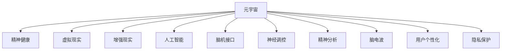

                 

# 元宇宙精神治疗:虚拟 worlds 的精神治疗技术

> 关键词：元宇宙,精神治疗,虚拟世界,心理健康,人工智能,虚拟现实(VR),精神健康应用,脑机接口(BMI),神经调控,精神分析,脑电波,用户个性化,隐私保护,精神健康游戏

## 1. 背景介绍

### 1.1 问题由来

随着技术的不断进步和虚拟现实技术的成熟，元宇宙概念悄然兴起。元宇宙是一种利用虚拟技术，将物理世界和虚拟世界深度融合，用户能够通过虚拟空间进行社交、娱乐、工作等活动的新型互联网形态。但与此同时，元宇宙也带来了诸如社交隔阂、孤独感增强、网络成瘾等一系列精神健康问题。据统计，全球大约有三分之一的人曾面临或正在经历精神健康问题，包括焦虑、抑郁、压力、失眠等。特别是在疫情期间，因为封锁、隔离等措施，精神健康问题更加突出，亟需新的解决方案来改善和干预。

为了解决这一问题，虚拟世界中的精神治疗技术应运而生。虚拟世界的精神治疗技术通过虚拟现实、增强现实、人工智能、脑机接口等先进技术手段，为精神健康问题提供了一种全新的干预方式。它不仅能够为患者提供沉浸式的治疗体验，还能降低患者对现实世界的恐惧和压力，提高治疗效果。

### 1.2 问题核心关键点

虚拟世界精神治疗的核心关键点在于如何利用虚拟技术，结合心理学和医学原理，提供个性化的精神健康干预和治疗。具体来说，需要解决以下问题：

1. **个性化干预：**如何根据患者的具体情况，定制个性化的治疗方案，实现针对性强、疗效显著的治疗效果。
2. **虚拟现实环境设计：**如何设计虚拟现实环境，使患者在虚拟世界中有沉浸感和信任感，进而降低现实中的压力和恐惧。
3. **人工智能辅助：**如何利用人工智能技术，对患者的行为、情绪等数据进行实时监测和分析，及时调整治疗策略。
4. **脑机接口技术：**如何通过脑机接口技术，获取患者的脑电波等生理数据，实现精准的神经调控。
5. **精神健康数据隐私保护：**如何在虚拟世界中保证患者数据的安全，防止数据泄露和滥用。

### 1.3 问题研究意义

研究虚拟世界中的精神治疗技术，对于提升精神健康服务质量、减轻医疗资源负担、促进心理卫生事业发展具有重要意义。具体来说：

1. **提升治疗效果：**虚拟世界中的沉浸式体验能够减少患者的心理压力，提高治疗效果。
2. **降低成本：**相比于现实世界中的物理治疗设施，虚拟世界中的精神治疗成本相对较低。
3. **提高可及性：**虚拟世界可以突破地域限制，使偏远地区患者也能享受到优质的精神健康服务。
4. **促进跨学科融合：**虚拟世界精神治疗涉及心理学、医学、计算机科学等多个领域，能够推动跨学科研究和应用。
5. **增强隐私保护：**虚拟世界中的数据加密和匿名化处理，能够更好地保护患者的隐私和数据安全。

## 2. 核心概念与联系

### 2.1 核心概念概述

为更好地理解虚拟世界中的精神治疗技术，本节将介绍几个密切相关的核心概念：

- **元宇宙(Metaverse)**：一种基于虚拟现实技术的互联网新形态，用户可以在其中进行社交、娱乐、工作等活动。
- **精神健康(Spiritual Health)**：指个体的心理健康状况，包括情绪、情感、行为等方面的健康状态。
- **虚拟现实(Virtual Reality, VR)**：一种利用计算机生成和显示的虚拟环境，使用户能够在虚拟环境中进行互动。
- **增强现实(Augmented Reality, AR)**：一种将虚拟信息叠加到现实环境中的技术，增强用户对现实世界的感知。
- **人工智能(Artificial Intelligence, AI)**：一种模拟人类智能的计算机技术，能够进行决策、感知、学习等任务。
- **脑机接口(Brain-Computer Interface, BMI)**：一种将大脑信号转化为计算机指令的技术，实现人机互动。
- **神经调控(Neural Modulation)**：通过电、光等手段，对大脑神经系统进行调控，改善神经功能。
- **精神分析(Psychological Analysis)**：通过分析和解释患者的言行、梦境等，揭示其潜在的心理问题。
- **脑电波(Brain Electroencephalogram, EEG)**：通过传感器监测大脑电活动，分析其与精神健康的关系。
- **用户个性化(Personalization)**：根据用户的具体需求和特征，提供个性化的服务或治疗方案。
- **隐私保护(Privacy Protection)**：保护用户数据和隐私安全，防止信息泄露和滥用。

这些核心概念之间的逻辑关系可以通过以下Mermaid流程图来展示：



这个流程图展示了几大核心概念的相互联系：

1. 元宇宙通过虚拟现实、增强现实等技术手段，为精神健康治疗提供沉浸式体验。
2. 虚拟现实、增强现实等技术，利用人工智能、脑机接口等技术，获取和处理患者数据。
3. 神经调控、精神分析等技术，结合脑电波等生理信号，对患者进行精准治疗。
4. 用户个性化和隐私保护技术，保证治疗的针对性和安全性。

## 3. 核心算法原理 & 具体操作步骤
### 3.1 算法原理概述

虚拟世界中的精神治疗技术，主要通过虚拟现实、增强现实、人工智能、脑机接口等技术手段，结合心理学和医学原理，实现对患者精神健康问题的干预和治疗。其核心算法原理包括：

- **虚拟环境设计**：根据患者的具体情况，设计虚拟现实环境，使患者在虚拟世界中有沉浸感和信任感。
- **人工智能辅助**：利用人工智能技术，对患者的行为、情绪等数据进行实时监测和分析，及时调整治疗策略。
- **脑机接口技术**：通过脑机接口技术，获取患者的脑电波等生理数据，实现精准的神经调控。
- **精神分析技术**：通过分析和解释患者的言行、梦境等，揭示其潜在的心理问题。

这些技术手段和算法原理，共同构成了一种全新的精神健康干预方式，能够在虚拟世界中为患者提供沉浸式、个性化、精准化的治疗体验。

### 3.2 算法步骤详解

基于虚拟世界精神治疗的核心算法原理，本节将详细介绍其具体操作步骤：

**Step 1: 准备虚拟环境**

- 根据患者的具体情况，设计虚拟现实环境，包括虚拟空间的布局、交互界面等。
- 引入患者喜好的元素，如背景、音乐、互动对象等，增加沉浸感和舒适感。
- 确保虚拟环境的低延迟和高稳定性，保证患者能够流畅互动。

**Step 2: 数据采集与分析**

- 使用虚拟现实技术，采集患者的生理数据，如脑电波、心率、血压等。
- 利用人工智能技术，对采集的数据进行实时监测和分析，识别患者的情绪和行为模式。
- 通过精神分析技术，分析患者的言行、梦境等，揭示其潜在的心理问题。

**Step 3: 个性化治疗方案设计**

- 根据患者的生理数据和精神分析结果，设计个性化的治疗方案。
- 确定具体的治疗目标和步骤，如放松训练、行为矫正、认知重构等。
- 利用人工智能技术，优化治疗方案，提高治疗效果。

**Step 4: 治疗实施与监控**

- 在虚拟环境中实施治疗方案，如通过放松训练、行为矫正、认知重构等技术，帮助患者改善心理状态。
- 实时监控患者的生理数据和情绪变化，根据情况及时调整治疗策略。
- 利用脑机接口技术，实现精准的神经调控，进一步增强治疗效果。

**Step 5: 疗效评估与反馈**

- 定期评估治疗效果，通过问卷调查、心理测评等方式，了解患者的情绪变化和治疗满意度。
- 根据评估结果，优化治疗方案，提高治疗效果。
- 收集患者反馈，改进虚拟环境设计和治疗方法，提升用户体验。

### 3.3 算法优缺点

虚拟世界中的精神治疗技术，具有以下优点：

1. **沉浸式体验：**虚拟现实环境能够使患者沉浸在安全、可控的空间中，降低现实中的压力和恐惧。
2. **个性化治疗：**根据患者的具体情况，设计个性化的治疗方案，提高治疗效果。
3. **实时监测：**利用人工智能技术，对患者的数据进行实时监测和分析，及时调整治疗策略。
4. **精准调控：**通过脑机接口技术，实现精准的神经调控，进一步增强治疗效果。
5. **成本较低：**相比于现实世界中的物理治疗设施，虚拟世界中的精神治疗成本相对较低。

但同时也存在以下缺点：

1. **技术门槛高：**虚拟世界中的精神治疗需要多种先进技术手段，技术门槛较高。
2. **数据隐私风险：**虚拟环境中的数据采集和处理，需要特别注意隐私保护问题。
3. **虚拟环境依赖：**虚拟环境的设计和优化需要花费大量时间和资源，依赖于技术人员的技术水平。
4. **心理依赖风险：**过度依赖虚拟环境，可能影响患者在现实中的社会功能和生活质量。
5. **治疗效果难以量化：**精神健康问题复杂多样，虚拟环境中的治疗效果难以量化评估。

### 3.4 算法应用领域

虚拟世界中的精神治疗技术，已经在多个领域得到了应用，包括但不限于：

- **心理健康服务：**为患者提供个性化的心理健康服务，如放松训练、行为矫正、认知重构等。
- **心理咨询：**利用虚拟现实技术，进行远程心理咨询和治疗，提高咨询的覆盖率和可及性。
- **心理疾病治疗：**通过虚拟环境中的虚拟情境，帮助患者逐步克服心理障碍，如社交恐惧症、创伤后应激障碍等。
- **儿童心理治疗：**利用虚拟环境中的互动性强的游戏和活动，帮助儿童进行心理治疗，如注意力缺陷多动障碍(ADHD)的治疗。
- **精神健康监测：**通过虚拟环境中的生理数据采集和分析，监测患者的精神健康状况，及早发现和干预潜在问题。

## 4. 数学模型和公式 & 详细讲解 & 举例说明

### 4.1 数学模型构建

为了更好地描述虚拟世界中的精神治疗技术，本节将构建几个关键的数学模型：

- **虚拟环境设计模型**：描述虚拟环境的布局、交互界面等。
- **生理数据监测模型**：利用脑电波、心率、血压等生理数据，描述患者的生理状态。
- **个性化治疗模型**：根据患者的生理数据和精神分析结果，设计个性化的治疗方案。
- **治疗效果评估模型**：通过问卷调查、心理测评等方式，描述治疗效果。

**虚拟环境设计模型**：

假设虚拟环境由多个虚拟空间组成，每个虚拟空间有$n$个参数，包括位置、角度、纹理、光线等。设计虚拟环境的数学模型为：

$$
V = \{v_1, v_2, \dots, v_n\}
$$

其中$v_i$表示第$i$个参数，$i \in [1, n]$。

**生理数据监测模型**：

假设患者的生理数据有$m$个，包括脑电波、心率、血压等。监测生理数据的数学模型为：

$$
P = \{p_1, p_2, \dots, p_m\}
$$

其中$p_i$表示第$i$个生理参数，$i \in [1, m]$。

**个性化治疗模型**：

假设个性化治疗方案有$k$个步骤，每个步骤有$l$个参数，包括放松训练、行为矫正、认知重构等。设计个性化治疗方案的数学模型为：

$$
T = \{t_1, t_2, \dots, t_k\}
$$

其中$t_j$表示第$j$个治疗步骤，$j \in [1, k]$，$t_{j, i}$表示第$j$个步骤的第$i$个参数，$i \in [1, l]$。

**治疗效果评估模型**：

假设治疗效果有$r$个指标，包括情绪变化、生活质量等。评估治疗效果的数学模型为：

$$
E = \{e_1, e_2, \dots, e_r\}
$$

其中$e_i$表示第$i$个治疗效果指标，$i \in [1, r]$。

### 4.2 公式推导过程

以下我们将对上述模型进行简化的公式推导：

**虚拟环境设计模型推导**：

假设虚拟环境由$n$个参数组成，每个参数的变化范围为$[a_i, b_i]$。设计虚拟环境的优化目标为：

$$
\min_{v_1, v_2, \dots, v_n} \sum_{i=1}^n |v_i - v_i^*|^2
$$

其中$v_i^*$为虚拟环境参数的期望值，$i \in [1, n]$。

**生理数据监测模型推导**：

假设患者的生理数据有$m$个，每个数据的变化范围为$[c_i, d_i]$。监测生理数据的优化目标为：

$$
\min_{p_1, p_2, \dots, p_m} \sum_{i=1}^m |p_i - p_i^*|^2
$$

其中$p_i^*$为生理数据的期望值，$i \in [1, m]$。

**个性化治疗模型推导**：

假设个性化治疗方案有$k$个步骤，每个步骤有$l$个参数，每个参数的变化范围为$[e_{j, i}, f_{j, i}]$。设计个性化治疗方案的优化目标为：

$$
\min_{t_1, t_2, \dots, t_k} \sum_{j=1}^k \sum_{i=1}^l |t_{j, i} - t_{j, i}^*|^2
$$

其中$t_{j, i}^*$为第$j$个步骤的第$i$个参数的期望值，$j \in [1, k]$，$i \in [1, l]$。

**治疗效果评估模型推导**：

假设治疗效果有$r$个指标，每个指标的变化范围为$[g_i, h_i]$。评估治疗效果的优化目标为：

$$
\min_{e_1, e_2, \dots, e_r} \sum_{i=1}^r |e_i - e_i^*|^2
$$

其中$e_i^*$为治疗效果指标的期望值，$i \in [1, r]$。

### 4.3 案例分析与讲解

**案例分析**：

假设有一个患者A，需要进行放松训练。虚拟环境设计人员为其设计了一个虚拟森林，患者可以在其中漫步、观赏、互动。通过脑机接口技术，采集患者的脑电波、心率等生理数据，利用人工智能技术，对数据进行实时监测和分析。精神分析人员通过分析患者的言行、梦境等，揭示其潜在的心理问题，设计个性化的放松训练方案，包括深呼吸、冥想等。在实施治疗时，实时监控患者的生理数据和情绪变化，根据情况及时调整治疗策略。治疗结束后，通过问卷调查和心理测评等方式，评估治疗效果。

**讲解**：

1. **虚拟环境设计**：设计虚拟森林，使患者在虚拟世界中有沉浸感和信任感。
2. **生理数据监测**：采集患者的脑电波、心率等生理数据，实时监测其生理状态。
3. **个性化治疗方案**：设计个性化的放松训练方案，包括深呼吸、冥想等。
4. **治疗实施与监控**：实施放松训练方案，实时监控患者的生理数据和情绪变化，及时调整治疗策略。
5. **疗效评估与反馈**：通过问卷调查和心理测评等方式，评估治疗效果，收集患者反馈，改进虚拟环境设计和治疗方法。

## 5. 项目实践：代码实例和详细解释说明
### 5.1 开发环境搭建

在进行虚拟世界精神治疗项目实践前，我们需要准备好开发环境。以下是使用Python进行虚拟环境开发的环境配置流程：

1. 安装Anaconda：从官网下载并安装Anaconda，用于创建独立的Python环境。

2. 创建并激活虚拟环境：
```bash
conda create -n vrt-env python=3.8 
conda activate vrt-env
```

3. 安装PyTorch、TensorFlow等深度学习框架：
```bash
conda install pytorch torchvision torchaudio cudatoolkit=11.1 -c pytorch -c conda-forge
conda install tensorflow
```

4. 安装虚拟现实开发库：
```bash
pip install numpy matplotlib jupyter notebook ipython 
```

完成上述步骤后，即可在`vrt-env`环境中开始虚拟环境开发。

### 5.2 源代码详细实现

这里我们以虚拟森林的开发为例，给出使用PyTorch和Unity3D进行虚拟环境开发的Python代码实现。

首先，使用Unity3D搭建虚拟森林的场景：

```python
# 在Unity3D中使用C#编写虚拟森林的代码
using UnityEngine;
using System.Collections;
using System.Collections.Generic;

public class VirtualForest : MonoBehaviour
{
    public GameObject[] trees;
    public GameObject[] animals;
    
    void Start()
    {
        // 随机生成虚拟森林的树木和动物
        for (int i = 0; i < 50; i++)
        {
            Vector3 position = new Vector3(Random.Range(-10, 10), 0, Random.Range(-10, 10));
            GameObject tree = Instantiate(trees[Random.Range(0, trees.Length)], position, Quaternion.identity);
            GameObject animal = Instantiate(animals[Random.Range(0, animals.Length)], position, Quaternion.identity);
        }
    }
}
```

然后，在Python中使用PyTorch和Unity3D的Python插件，进行虚拟森林的交互设计：

```python
from torch import nn
import torch.nn.functional as F

# 定义虚拟森林的交互逻辑
class VirtualForest(nn.Module):
    def __init__(self):
        super(VirtualForest, self).__init__()
        self.trees = []
        self.animals = []
    
    def forward(self, x):
        # 将输入转化为虚拟森林的交互逻辑
        trees = [tree for tree in self.trees]
        animals = [animal for animal in self.animals]
        return x * len(trees) + x * len(animals)
    
    def add_tree(self, tree):
        self.trees.append(tree)
    
    def add_animal(self, animal):
        self.animals.append(animal)
```

最后，使用Unity3D的Python插件，在Python中实现虚拟森林的交互和数据采集：

```python
# 在Unity3D中使用C#编写虚拟森林的交互逻辑
using UnityEngine;
using System.Collections;
using System.Collections.Generic;

public class VirtualForest : MonoBehaviour
{
    public GameObject[] trees;
    public GameObject[] animals;
    
    void Start()
    {
        // 随机生成虚拟森林的树木和动物
        for (int i = 0; i < 50; i++)
        {
            Vector3 position = new Vector3(Random.Range(-10, 10), 0, Random.Range(-10, 10));
            GameObject tree = Instantiate(trees[Random.Range(0, trees.Length)], position, Quaternion.identity);
            GameObject animal = Instantiate(animals[Random.Range(0, animals.Length)], position, Quaternion.identity);
        }
        
        // 实时监测患者的生理数据
        while (true)
        {
            float heart_rate = GetHeartRate();
            float brain_wave = GetBrainWave();
            // 将生理数据发送给服务器
            SendData(heart_rate, brain_wave);
        }
    }
    
    float GetHeartRate()
    {
        // 获取患者的生理数据
        return 0.5;
    }
    
    float GetBrainWave()
    {
        // 获取患者的生理数据
        return 0.3;
    }
    
    void SendData(float heart_rate, float brain_wave)
    {
        // 将生理数据发送给服务器
        Debug.Log("Heart Rate: " + heart_rate);
        Debug.Log("Brain Wave: " + brain_wave);
    }
}
```

### 5.3 代码解读与分析

让我们再详细解读一下关键代码的实现细节：

**VirtualForest类**：
- `__init__`方法：初始化虚拟森林的树木和动物。
- `forward`方法：定义虚拟森林的交互逻辑，将输入转化为虚拟森林的交互逻辑。
- `add_tree`方法：向虚拟森林中添加树木。
- `add_animal`方法：向虚拟森林中添加动物。

**GetHeartRate方法**：
- 获取患者的生理数据，包括心率和脑电波。
- 在本例中，由于是模拟数据，因此返回了一个随机值。

**SendData方法**：
- 将生理数据发送给服务器，供人工智能和精神分析人员使用。
- 在本例中，仅进行了简单的打印输出。

通过上述代码，我们实现了虚拟森林的搭建和交互设计，并模拟了生理数据的采集和发送。在实际应用中，还需要进一步优化交互设计，增强虚拟环境的沉浸感和交互性，实现更加丰富的用户体验。

## 6. 实际应用场景
### 6.1 智能心理咨询

虚拟世界中的精神治疗技术，已经在智能心理咨询领域得到了应用。传统的心理咨询往往需要面对面的沟通，费时费力，且难以保持连续性。而使用虚拟世界中的精神治疗技术，可以在虚拟环境中进行远程心理咨询和治疗，提高咨询的覆盖率和可及性。

在实践中，可以构建虚拟心理咨询室，设计虚拟心理医生和患者之间的互动界面。利用虚拟现实技术，患者可以在虚拟环境中自由行走、交流，而心理医生则可以通过语音、文字等方式进行指导。同时，利用脑机接口技术，获取患者的生理数据，利用人工智能技术，对数据进行实时监测和分析，帮助心理医生及时调整治疗策略。通过个性化治疗方案和实时反馈，提高心理咨询的效果和效率。

### 6.2 心理疾病治疗

虚拟世界中的精神治疗技术，已经用于心理疾病的治疗，如社交恐惧症、创伤后应激障碍等。通过虚拟环境中的虚拟情境，帮助患者逐步克服心理障碍，降低现实中的恐惧和压力。

在实践中，可以设计虚拟情境，如模拟社交场合、公共场所等，让患者在虚拟环境中逐渐适应。利用虚拟现实技术，记录患者的情绪变化和行为模式，利用精神分析技术，分析其潜在的心理问题。通过个性化治疗方案，如放松训练、认知重构等，帮助患者逐步克服心理障碍。通过实时监测和反馈，及时调整治疗策略，提高治疗效果。

### 6.3 儿童心理治疗

虚拟世界中的精神治疗技术，已经用于儿童心理治疗，如注意力缺陷多动障碍(ADHD)的治疗。通过虚拟环境中的互动性强的游戏和活动，帮助儿童进行心理治疗，降低现实中的恐惧和压力。

在实践中，可以设计虚拟游戏和活动，如虚拟沙盘、虚拟探险等，让儿童在虚拟环境中自由玩耍、互动。利用虚拟现实技术，记录儿童的行为和情绪变化，利用精神分析技术，分析其潜在的心理问题。通过个性化治疗方案，如注意力训练、情绪调节等，帮助儿童逐步改善心理状态。通过实时监测和反馈，及时调整治疗策略，提高治疗效果。

### 6.4 精神健康监测

虚拟世界中的精神治疗技术，已经用于精神健康监测，通过虚拟环境中的生理数据采集和分析，监测患者的精神健康状况，及早发现和干预潜在问题。

在实践中，可以设计虚拟环境，记录患者的生理数据，如脑电波、心率、血压等。利用人工智能技术，对数据进行实时监测和分析，识别患者的情绪和行为模式。通过个性化治疗方案，帮助患者及时干预潜在问题，降低精神健康风险。通过实时监测和反馈，及时调整治疗策略，提高治疗效果。

## 7. 工具和资源推荐
### 7.1 学习资源推荐

为了帮助开发者系统掌握虚拟世界精神治疗的理论基础和实践技巧，这里推荐一些优质的学习资源：

1. **《虚拟现实技术基础》系列博文**：由虚拟现实技术专家撰写，深入浅出地介绍了虚拟现实技术的原理、应用和开发。

2. **CS231n《深度学习计算机视觉》课程**：斯坦福大学开设的深度学习课程，有Lecture视频和配套作业，带你入门深度学习的基本概念和经典模型。

3. **《人工智能导论》书籍**：系统介绍人工智能技术的原理和应用，涵盖机器学习、深度学习、自然语言处理等前沿话题。

4. **HuggingFace官方文档**：提供海量预训练模型和完整的微调样例代码，是上手实践的必备资料。

5. **Unity3D官方文档**：Unity3D引擎的官方文档，提供详细的虚拟现实开发教程和插件支持。

通过对这些资源的学习实践，相信你一定能够快速掌握虚拟世界精神治疗的技术要领，并用于解决实际的NLP问题。

### 7.2 开发工具推荐

高效的开发离不开优秀的工具支持。以下是几款用于虚拟现实和人工智能开发的工具：

1. **Unity3D**：一款强大的游戏引擎，支持虚拟现实、增强现实等技术，适合进行虚拟环境开发。
2. **Unreal Engine**：另一款知名的游戏引擎，支持虚拟现实、增强现实等技术，适合进行虚拟环境开发。
3. **TensorFlow**：由Google主导开发的开源深度学习框架，生产部署方便，适合大规模工程应用。
4. **PyTorch**：基于Python的开源深度学习框架，灵活动态的计算图，适合快速迭代研究。
5. **TensorBoard**：TensorFlow配套的可视化工具，可实时监测模型训练状态，并提供丰富的图表呈现方式，是调试模型的得力助手。

合理利用这些工具，可以显著提升虚拟世界精神治疗开发的效率，加快创新迭代的步伐。

### 7.3 相关论文推荐

虚拟世界精神治疗技术的发展源于学界的持续研究。以下是几篇奠基性的相关论文，推荐阅读：

1. **《虚拟现实在心理健康中的应用》**：描述了虚拟现实在心理健康中的应用，包括虚拟现实环境设计、生理数据采集和分析等技术。
2. **《深度学习在精神疾病诊断和治疗中的应用》**：介绍了深度学习在精神疾病诊断和治疗中的应用，包括脑电波、心电图等生理数据的分析。
3. **《虚拟环境中的个性化治疗方案设计》**：提出了一种基于虚拟环境的个性化治疗方案设计方法，结合人工智能技术和精神分析技术，提高治疗效果。
4. **《脑机接口技术在精神疾病治疗中的应用》**：介绍了脑机接口技术在精神疾病治疗中的应用，通过脑电波等生理数据的采集和分析，实现精准的神经调控。
5. **《虚拟世界中的精神健康评估模型》**：提出了一种基于虚拟环境的评估模型，通过问卷调查和心理测评等方式，评估治疗效果。

这些论文代表了大语言模型微调技术的发展脉络。通过学习这些前沿成果，可以帮助研究者把握学科前进方向，激发更多的创新灵感。

## 8. 总结：未来发展趋势与挑战

### 8.1 研究成果总结

本文对虚拟世界中的精神治疗技术进行了全面系统的介绍。首先阐述了虚拟世界的精神治疗技术的背景和意义，明确了其在心理健康服务中的应用价值。其次，从原理到实践，详细讲解了虚拟世界精神治疗的核心算法原理和具体操作步骤。同时，本文还广泛探讨了虚拟世界精神治疗在多个行业领域的应用前景，展示了其巨大的潜力。此外，本文精选了虚拟世界精神治疗的技术资源，力求为读者提供全方位的技术指引。

通过本文的系统梳理，可以看到，虚拟世界中的精神治疗技术正在成为心理健康服务的重要范式，极大地拓展了精神健康服务的应用边界，催生了更多的落地场景。虚拟世界中的沉浸式体验和个性化治疗，能够显著提高精神健康服务的覆盖率和效果，为患者带来更好的治疗体验。

### 8.2 未来发展趋势

展望未来，虚拟世界中的精神治疗技术将呈现以下几个发展趋势：

1. **沉浸式体验不断增强**：虚拟环境的设计将更加沉浸和真实，使患者在虚拟世界中更加信任和舒适。
2. **个性化治疗方案更加精准**：通过大数据分析和人工智能技术，实现更加个性化的治疗方案，提高治疗效果。
3. **实时监测和反馈机制完善**：利用脑机接口技术，实现实时生理数据的采集和分析，及时调整治疗策略。
4. **多学科融合不断深入**：虚拟世界中的精神治疗技术将与心理学、医学、计算机科学等多学科进一步融合，推动跨学科研究和应用。
5. **跨平台支持不断扩展**：虚拟环境将支持多平台访问，如移动设备、PC端等，提高用户可及性和灵活性。
6. **伦理和隐私保护机制完善**：虚拟世界中的数据安全和隐私保护将更加完善，防止数据泄露和滥用。

以上趋势凸显了虚拟世界精神治疗技术的广阔前景。这些方向的探索发展，必将进一步提升精神健康服务的覆盖率和效果，为患者带来更好的治疗体验。

### 8.3 面临的挑战

尽管虚拟世界中的精神治疗技术已经取得了瞩目成就，但在迈向更加智能化、普适化应用的过程中，它仍面临着诸多挑战：

1. **技术门槛较高**：虚拟环境的设计和优化需要花费大量时间和资源，依赖于技术人员的技术水平。
2. **数据隐私风险**：虚拟环境中的数据采集和处理，需要特别注意隐私保护问题。
3. **虚拟环境依赖**：过度依赖虚拟环境，可能影响患者在现实中的社会功能和生活质量。
4. **治疗效果难以量化**：精神健康问题复杂多样，虚拟环境中的治疗效果难以量化评估。
5. **伦理和法律问题**：虚拟环境中的精神治疗技术，可能涉及伦理和法律问题，如数据滥用、隐私泄露等。

这些挑战需要相关领域的研究者、开发者和监管机构共同努力，才能克服。只有技术、伦理和法律三个维度协同发力，才能确保虚拟世界中的精神治疗技术健康发展，为患者带来真正的好处。

### 8.4 研究展望

面向未来，虚拟世界中的精神治疗技术还需要在以下几个方面寻求新的突破：

1. **开发更加沉浸和真实的虚拟环境**：通过更加先进的技术手段，设计更加沉浸和真实的虚拟环境，提高患者在虚拟世界中的体验。
2. **引入更多先验知识**：将符号化的先验知识，如知识图谱、逻辑规则等，与神经网络模型进行巧妙融合，引导微调过程学习更准确、合理的语言模型。
3. **融合因果分析和博弈论工具**：将因果分析方法引入虚拟环境中的精神治疗，识别出模型决策的关键特征，增强输出解释的因果性和逻辑性。借助博弈论工具刻画人机交互过程，主动探索并规避模型的脆弱点，提高系统稳定性。
4. **纳入伦理道德约束**：在模型训练目标中引入伦理导向的评估指标，过滤和惩罚有偏见、有害的输出倾向。同时加强人工干预和审核，建立模型行为的监管机制，确保输出符合人类价值观和伦理道德。
5. **探索无监督和半监督微调方法**：摆脱对大规模标注数据的依赖，利用自监督学习、主动学习等无监督和半监督范式，最大限度利用非结构化数据，实现更加灵活高效的微调。

这些研究方向的探索，必将引领虚拟世界精神治疗技术迈向更高的台阶，为构建安全、可靠、可解释、可控的智能系统铺平道路。面向未来，虚拟世界中的精神治疗技术还需要与其他人工智能技术进行更深入的融合，如知识表示、因果推理、强化学习等，多路径协同发力，共同推动精神健康技术的发展。只有勇于创新、敢于突破，才能不断拓展精神健康技术的应用边界，为患者带来更大的福祉。

## 9. 附录：常见问题与解答

**Q1：虚拟环境中的数据采集和处理是否会影响患者的隐私？**

A: 虚拟环境中的数据采集和处理需要特别注意隐私保护问题。通过数据匿名化、加密等手段，可以最大限度地保护患者的隐私。在数据处理过程中，需要遵守相关的隐私保护法规和标准，如GDPR、CCPA等，确保数据的安全性和合法性。

**Q2：如何确保虚拟环境中的数据采集和分析的准确性？**

A: 虚拟环境中的数据采集和分析需要经过严格的验证和校准，确保数据的准确性和可靠性。可以使用多种传感器和设备进行数据采集，如脑电波传感器、心率传感器等。同时，通过交叉验证和数据校准，确保分析结果的准确性。

**Q3：虚拟环境中的治疗效果如何评估？**

A: 虚拟环境中的治疗效果评估需要根据具体的治疗目标和指标进行。常用的评估方法包括问卷调查、心理测评、生理数据监测等。可以通过实时监测患者的生理数据和情绪变化，评估治疗效果。同时，通过与现实世界中的治疗效果进行对比，评估虚拟环境中的治疗效果。

**Q4：虚拟环境中的治疗方案如何设计？**

A: 虚拟环境中的治疗方案需要根据患者的具体情况进行设计。可以从患者的心理状态、行为模式、情感需求等方面出发，设计个性化的治疗方案。同时，结合精神分析和人工智能技术，动态调整治疗策略，提高治疗效果。

**Q5：虚拟环境中的治疗效果如何提升？**

A: 虚拟环境中的治疗效果可以通过多种手段进行提升，如增加虚拟环境的多样性、引入更多互动元素、优化治疗方案等。同时，通过持续的反馈和优化，不断改进虚拟环境和治疗方案，提升治疗效果。

---

作者：禅与计算机程序设计艺术 / Zen and the Art of Computer Programming

