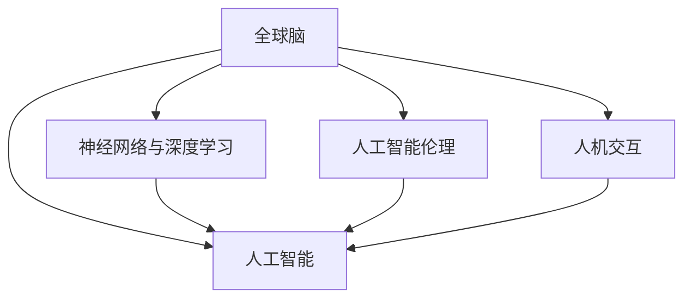

                 

# 全球脑与人工智能:协同进化的未来图景

> 关键词：全球脑,人工智能,协同进化,神经网络,深度学习,人工智能伦理,人机交互

## 1. 背景介绍

### 1.1 问题由来

在过去几十年中，人工智能(AI)技术迅猛发展，深刻影响了社会的各个方面。从自动驾驶、语音识别到医疗诊断，AI的应用无处不在。然而，随着AI技术的进步，也带来了一些新的挑战和问题。

**1.1.1 AI的发展现状**
人工智能的核心在于模拟和扩展人类智能，目前AI领域的主要技术包括机器学习、深度学习、强化学习等。其中，深度学习已成为AI的主流技术，通过多层次神经网络模型实现对大规模数据的学习和分析。

**1.1.2 AI技术的应用场景**
AI技术已广泛应用于多个领域，包括但不限于：
- **自动驾驶**：通过感知、决策和控制技术实现无人驾驶汽车。
- **语音识别**：实现人机交互的语音转文本功能。
- **医疗诊断**：通过图像识别、自然语言处理等技术辅助医生诊断。
- **金融风控**：利用大数据和机器学习算法预测市场风险。
- **智能推荐**：基于用户行为数据进行个性化推荐，提高用户体验。

**1.1.3 AI面临的问题**
尽管AI技术取得了显著进展，但也面临着诸多挑战：
- **数据隐私**：大规模数据的收集和使用带来了隐私和安全问题。
- **伦理道德**：AI决策的透明性和可解释性不足，可能引发伦理道德争议。
- **资源消耗**：深度学习模型往往需要大量的计算资源，增加了能源消耗和环境负担。
- **算法偏见**：模型可能学习到数据中的偏见，导致不公平的决策结果。

### 1.2 问题核心关键点

为了更好地理解全球脑与人工智能的协同进化，需要明确几个核心概念和关键问题：

**1.2.1 全球脑的概念**
全球脑（Global Brain）是连接世界各地智能体（如计算机、机器人、人类）的超级智能网络。通过大规模数据共享和协同计算，全球脑能够实现跨地域、跨领域、跨学科的智能协同。

**1.2.2 人工智能伦理**
人工智能伦理是指在人工智能应用过程中，如何平衡技术进步和社会伦理道德之间的关系。AI的决策透明性、可解释性、公平性、隐私保护等方面都是伦理研究的重点。

**1.2.3 人机交互**
人机交互（Human-Computer Interaction，HCI）是指人类与计算机之间的信息交换和交互方式。未来的智能系统需要具备更自然、高效、友好的交互界面，增强用户的主动性和体验感。

**1.2.4 神经网络与深度学习**
神经网络是一种模拟人类神经系统的计算模型，深度学习则是通过多层神经网络实现对复杂数据的深度学习。当前，深度学习已成为AI的核心技术之一。

**1.2.5 人工智能的未来**
未来人工智能的发展方向包括：通用人工智能（AGI）、量子计算、混合智能等。这些技术将进一步提升AI的智能水平和应用范围。

## 2. 核心概念与联系

### 2.1 核心概念概述

为更好地理解全球脑与人工智能的协同进化，本节将介绍几个密切相关的核心概念：

- **全球脑**：连接世界各地智能体（如计算机、机器人、人类）的超级智能网络，通过大规模数据共享和协同计算实现跨地域、跨领域、跨学科的智能协同。
- **人工智能**：通过机器学习、深度学习等技术实现对数据的自动化分析和决策，广泛应用于各个领域。
- **神经网络与深度学习**：模拟人类神经系统的计算模型，通过多层神经网络实现对复杂数据的深度学习。
- **人工智能伦理**：在人工智能应用过程中，如何平衡技术进步和社会伦理道德之间的关系。
- **人机交互**：人类与计算机之间的信息交换和交互方式，未来的智能系统需要具备更自然、高效、友好的交互界面。

这些核心概念之间的逻辑关系可以通过以下Mermaid流程图来展示：



这个流程图展示了几大核心概念之间的联系：

1. **全球脑**：连接世界各地智能体，通过大规模数据共享和协同计算实现跨地域、跨领域、跨学科的智能协同。
2. **人工智能**：利用神经网络和深度学习技术，实现对数据的自动化分析和决策。
3. **神经网络与深度学习**：模拟人类神经系统，通过多层神经网络实现对复杂数据的深度学习。
4. **人工智能伦理**：在AI应用过程中，如何平衡技术进步和社会伦理道德之间的关系。
5. **人机交互**：人类与计算机之间的信息交换和交互方式，未来的智能系统需要具备更自然、高效、友好的交互界面。

## 3. 核心算法原理 & 具体操作步骤
### 3.1 算法原理概述

全球脑与人工智能的协同进化，本质上是一个复杂的系统工程，涉及数据共享、模型训练、算法优化、人机交互等多个环节。其中，深度学习算法是实现这一目标的重要工具。

### 3.2 算法步骤详解

**3.2.1 数据收集与预处理**
- **数据收集**：从全球各地的智能体中收集数据，包括文本、图像、语音等。
- **数据预处理**：清洗、去噪、归一化等数据预处理技术，确保数据质量。

**3.2.2 模型训练与优化**
- **模型选择**：选择合适的深度学习模型，如卷积神经网络（CNN）、循环神经网络（RNN）、变换器（Transformer）等。
- **数据增强**：通过数据增强技术，扩充训练数据集，提高模型泛化能力。
- **超参数调优**：通过网格搜索、随机搜索等方法，找到最优的超参数组合。
- **模型优化**：使用梯度下降等优化算法，最小化损失函数，提升模型性能。

**3.2.3 人机交互设计**
- **交互界面**：设计自然、高效、友好的交互界面，增强用户体验。
- **交互模型**：建立人机交互模型，实现对用户行为和需求的快速响应。

**3.2.4 系统部署与维护**
- **系统部署**：将训练好的模型部署到实际应用环境中，确保系统稳定运行。
- **系统维护**：定期更新模型和数据，进行系统性能优化，保障系统长期运行。

### 3.3 算法优缺点

**3.3.1 优点**
1. **高效性**：深度学习算法能够高效地处理大规模数据，提高模型的泛化能力。
2. **适应性**：通过数据共享和协同计算，全球脑能够适应不同地域、不同领域的数据分布。
3. **可扩展性**：模型和算法可以在全球范围内进行共享和优化，形成更强大的智能网络。

**3.3.2 缺点**
1. **数据隐私**：大规模数据共享可能带来隐私和安全问题，需要严格的保护措施。
2. **伦理争议**：AI决策的透明性和可解释性不足，可能引发伦理道德争议。
3. **资源消耗**：深度学习模型往往需要大量的计算资源，增加了能源消耗和环境负担。
4. **算法偏见**：模型可能学习到数据中的偏见，导致不公平的决策结果。

### 3.4 算法应用领域

全球脑与人工智能的协同进化技术，已广泛应用于多个领域，包括但不限于：

- **自动驾驶**：通过感知、决策和控制技术实现无人驾驶汽车。
- **语音识别**：实现人机交互的语音转文本功能。
- **医疗诊断**：通过图像识别、自然语言处理等技术辅助医生诊断。
- **金融风控**：利用大数据和机器学习算法预测市场风险。
- **智能推荐**：基于用户行为数据进行个性化推荐，提高用户体验。

## 4. 数学模型和公式 & 详细讲解 & 举例说明（备注：数学公式请使用latex格式，latex嵌入文中独立段落使用 $$，段落内使用 $)
### 4.1 数学模型构建

全球脑与人工智能的协同进化过程，可以通过数学模型进行描述。以下是一个简单的神经网络模型：

**4.1.1 神经网络模型**
- **输入层**：接收原始数据，例如文本、图像、语音等。
- **隐藏层**：通过多层神经网络实现对数据的深度学习，提取特征。
- **输出层**：生成最终的预测结果，例如分类、回归、生成等。

**4.1.2 损失函数**
- **交叉熵损失**：用于分类任务，衡量预测结果与真实标签之间的差异。
- **均方误差损失**：用于回归任务，衡量预测结果与真实标签之间的差异。
- **自定义损失**：根据具体任务设计自定义损失函数，例如自然语言处理中的BLEU分数。

### 4.2 公式推导过程

**4.2.1 交叉熵损失函数**
交叉熵损失函数（Cross-Entropy Loss）是深度学习中常用的损失函数之一，用于分类任务。其公式如下：

$$
\mathcal{L}_{CE}(y, \hat{y}) = -\frac{1}{N}\sum_{i=1}^{N} y_i \log \hat{y}_i
$$

其中，$y$ 为真实标签，$\hat{y}$ 为模型预测结果，$N$ 为样本数量。

**4.2.2 均方误差损失函数**
均方误差损失函数（Mean Squared Error Loss）是深度学习中常用的损失函数之一，用于回归任务。其公式如下：

$$
\mathcal{L}_{MSE}(y, \hat{y}) = \frac{1}{N}\sum_{i=1}^{N} (y_i - \hat{y}_i)^2
$$

其中，$y$ 为真实标签，$\hat{y}$ 为模型预测结果，$N$ 为样本数量。

### 4.3 案例分析与讲解

**4.3.1 自然语言处理（NLP）**
自然语言处理是AI领域的一个重要分支，主要研究如何让计算机理解、处理和生成自然语言。NLP任务的数学模型如下：

**4.3.2 图像识别**
图像识别是另一个重要的AI应用领域，主要研究如何让计算机识别和理解图像内容。其数学模型如下：

**4.3.3 语音识别**
语音识别是将语音信号转化为文本的过程，其数学模型如下：

## 5. 项目实践：代码实例和详细解释说明
### 5.1 开发环境搭建

在进行全球脑与人工智能的协同进化实践前，我们需要准备好开发环境。以下是使用Python进行TensorFlow开发的环境配置流程：

1. 安装Anaconda：从官网下载并安装Anaconda，用于创建独立的Python环境。
2. 创建并激活虚拟环境：
```bash
conda create -n tf-env python=3.8 
conda activate tf-env
```
3. 安装TensorFlow：根据CUDA版本，从官网获取对应的安装命令。例如：
```bash
conda install tensorflow tensorflow-cpu -c conda-forge -c tensorflow
```
4. 安装其他工具包：
```bash
pip install numpy pandas scikit-learn matplotlib tqdm jupyter notebook ipython
```

完成上述步骤后，即可在`tf-env`环境中开始实践。

### 5.2 源代码详细实现

下面我们以图像识别任务为例，给出使用TensorFlow进行卷积神经网络（CNN）模型的PyTorch代码实现。

首先，定义CNN模型：

```python
import tensorflow as tf

model = tf.keras.models.Sequential([
    tf.keras.layers.Conv2D(32, (3,3), activation='relu', input_shape=(28,28,1)),
    tf.keras.layers.MaxPooling2D((2,2)),
    tf.keras.layers.Flatten(),
    tf.keras.layers.Dense(10, activation='softmax')
])

model.compile(optimizer='adam', loss='categorical_crossentropy', metrics=['accuracy'])
```

然后，定义数据集和数据增强：

```python
from tensorflow.keras.datasets import mnist

(x_train, y_train), (x_test, y_test) = mnist.load_data()
x_train = x_train.reshape(x_train.shape[0], 28, 28, 1)
x_test = x_test.reshape(x_test.shape[0], 28, 28, 1)
x_train, x_test = x_train / 255.0, x_test / 255.0

data_augmentation = tf.keras.Sequential([
    tf.keras.layers.experimental.preprocessing.RandomFlip("horizontal"),
    tf.keras.layers.experimental.preprocessing.RandomRotation(0.2),
    tf.keras.layers.experimental.preprocessing.RandomZoom(0.2),
])
```

接着，进行模型训练和评估：

```python
model.fit(data_augmentation(x_train), y_train, epochs=10, validation_data=(x_test, y_test))
model.evaluate(x_test, y_test)
```

以上就是使用TensorFlow进行图像识别任务开发的完整代码实现。可以看到，TensorFlow提供了强大的深度学习框架和工具，使得模型构建和训练变得简单高效。

### 5.3 代码解读与分析

让我们再详细解读一下关键代码的实现细节：

**Sequential模型**：
- 使用`tf.keras.models.Sequential`定义了一个顺序模型，包括卷积层、池化层和全连接层。
- `tf.keras.layers.Conv2D`用于卷积层，`tf.keras.layers.MaxPooling2D`用于池化层，`tf.keras.layers.Flatten`用于将多维数组展平，`tf.keras.layers.Dense`用于全连接层。

**模型编译与训练**：
- `model.compile`用于编译模型，指定优化器、损失函数和评估指标。
- `model.fit`用于训练模型，指定数据增强器和训练轮数。

**数据集加载与预处理**：
- 使用`tf.keras.datasets.mnist.load_data`加载MNIST数据集。
- 将数据集中的像素值归一化到0-1之间。
- 使用`tf.keras.layers.experimental.preprocessing`定义数据增强操作。

**模型评估**：
- 使用`model.evaluate`对测试集进行评估，输出模型的准确率。

以上代码实现了完整的图像识别任务，展示了TensorFlow在深度学习开发中的强大功能。开发者可以将更多精力放在模型改进和数据处理上，而不必过多关注底层的实现细节。

## 6. 实际应用场景
### 6.1 智能医疗
智能医疗是全球脑与人工智能协同进化的重要应用领域之一。通过深度学习和医疗数据，可以实现智能诊断、个性化治疗、药物研发等。

具体而言，可以收集大量的电子病历、医学影像、基因数据等，构建多模态的数据库。利用深度学习算法，对患者的历史数据和当前症状进行分析和预测，提供智能诊断和个性化治疗方案。同时，利用深度学习进行药物研发，通过模拟分子结构和生物活性，快速筛选出潜在的药物候选分子。

### 6.2 智能交通
智能交通是全球脑与人工智能的另一个重要应用领域。通过深度学习和传感器数据，可以实现自动驾驶、交通流优化、智能停车等。

具体而言，可以利用深度学习算法，对车辆、行人、交通信号等进行实时感知和分析，实现自动驾驶和智能交通控制。同时，通过交通流量预测和优化，缓解交通拥堵，提高道路利用率。

### 6.3 智能制造
智能制造是全球脑与人工智能的另一个重要应用领域。通过深度学习和物联网数据，可以实现智能制造、智能运维、智能仓储等。

具体而言，可以利用深度学习算法，对生产设备和传感器数据进行实时监控和分析，实现智能制造和智能运维。同时，通过智能仓储和供应链管理，提高生产效率和库存周转率。

### 6.4 未来应用展望

随着深度学习和全球脑技术的发展，未来人工智能的应用将更加广泛和深入。以下是对未来应用展望的几点建议：

**6.4.1 泛在计算**
泛在计算是指将计算能力嵌入到各种设备中，实现无处不在的智能计算。未来，全球脑与人工智能将更加紧密地融合，实现跨领域、跨设备的协同计算。

**6.4.2 混合智能**
混合智能是指将人工智能与人类智能有机结合，实现人机协同。未来，全球脑与人工智能将进一步融合，形成更加智能的协同系统。

**6.4.3 通用人工智能（AGI）**
通用人工智能是指具有类人智能的AI系统，能够处理各种复杂的任务。未来，全球脑与人工智能将共同推动AGI的发展，实现更加强大的智能系统。

## 7. 工具和资源推荐
### 7.1 学习资源推荐

为了帮助开发者系统掌握全球脑与人工智能的协同进化理论基础和实践技巧，这里推荐一些优质的学习资源：

1. **Deep Learning Specialization**：由Coursera推出的深度学习专项课程，由Andrew Ng教授主讲，涵盖了深度学习的基本概念和常用技术。

2. **CS231n: Convolutional Neural Networks for Visual Recognition**：斯坦福大学开设的计算机视觉课程，讲解了深度学习在图像识别中的应用。

3. **CS224n: Natural Language Processing with Deep Learning**：斯坦福大学开设的自然语言处理课程，讲解了深度学习在自然语言处理中的应用。

4. **HuggingFace官方文档**：提供丰富的预训练模型和代码样例，帮助开发者快速上手深度学习任务。

5. **arXiv**：学术论文库，收录了大量的深度学习和人工智能领域的最新研究。

### 7.2 开发工具推荐

高效的开发离不开优秀的工具支持。以下是几款用于全球脑与人工智能协同进化开发的常用工具：

1. **TensorFlow**：由Google主导开发的深度学习框架，支持分布式计算和GPU加速，适合大规模工程应用。

2. **PyTorch**：由Facebook开发的深度学习框架，支持动态计算图和GPU加速，适合快速迭代研究。

3. **TensorBoard**：TensorFlow配套的可视化工具，可以实时监测模型训练状态，并提供丰富的图表呈现方式。

4. **Weights & Biases**：模型训练的实验跟踪工具，可以记录和可视化模型训练过程中的各项指标，方便对比和调优。

5. **TensorFlow Extended (TFX)**：Google推出的机器学习平台，支持数据预处理、模型训练、模型部署等全流程自动化。

### 7.3 相关论文推荐

全球脑与人工智能的协同进化技术源于学界的持续研究。以下是几篇奠基性的相关论文，推荐阅读：

1. **AlphaGo**：DeepMind开发的围棋AI，通过深度学习和蒙特卡罗树搜索技术，实现了人机围棋对弈。

2. **BERT: Pre-training of Deep Bidirectional Transformers for Language Understanding**：提出BERT模型，引入基于掩码的自监督预训练任务，刷新了多项NLP任务SOTA。

3. **GPT-3: Language Models are Unsupervised Multitask Learners**：提出GPT-3模型，展示了大规模语言模型的强大zero-shot学习能力。

4. **LoRA: Scaling Up Self-supervised Learning with Lottery Ticket Hypothesis**：提出LoRA方法，使用自适应低秩适应的微调方法，提高模型的参数效率和泛化能力。

5. **AdaLoRA: Adaptive Low-Rank Adaptation for Parameter-Efficient Fine-Tuning**：提出AdaLoRA方法，进一步优化LoRA，实现更高效的微调。

这些论文代表了大脑与人工智能协同进化的发展脉络。通过学习这些前沿成果，可以帮助研究者把握学科前进方向，激发更多的创新灵感。

## 8. 总结：未来发展趋势与挑战
### 8.1 总结

本文对全球脑与人工智能的协同进化过程进行了全面系统的介绍。首先阐述了全球脑与人工智能的研究背景和意义，明确了协同进化的重要性和潜力。其次，从原理到实践，详细讲解了深度学习算法在协同进化过程中的关键作用。同时，本文还广泛探讨了深度学习在医疗、交通、制造等多个行业领域的应用前景，展示了其巨大的应用潜力。最后，本文精选了深度学习和人工智能领域的各类学习资源，力求为开发者提供全方位的技术指引。

通过本文的系统梳理，可以看到，全球脑与人工智能的协同进化技术正在成为智能计算领域的重要范式，极大地拓展了深度学习模型的应用边界，催生了更多的落地场景。受益于大规模数据和算力的提升，深度学习模型将在未来实现更大的突破，为全球脑与人工智能的发展提供更加坚实的技术基础。未来，伴随着深度学习和大数据技术的不断演进，全球脑与人工智能必将迎来更加广阔的应用前景，深刻影响社会的各个方面。

### 8.2 未来发展趋势

展望未来，全球脑与人工智能的协同进化技术将呈现以下几个发展趋势：

**8.2.1 数据共享与协同计算**
全球脑与人工智能的发展离不开大规模数据的共享和协同计算。未来，全球脑将实现更加高效的跨地域、跨领域数据共享，通过分布式计算和联邦学习等技术，实现全球智能的协同进化。

**8.2.2 混合智能与通用人工智能**
混合智能是指将人工智能与人类智能有机结合，实现人机协同。未来，全球脑与人工智能将进一步融合，形成更加智能的协同系统。同时，通用人工智能也将成为人工智能的重要方向，实现具有类人智能的系统。

**8.2.3 智能决策与可解释性**
智能决策是指通过深度学习算法，实现自动化决策和智能控制。未来，全球脑与人工智能将进一步提升智能决策的透明性和可解释性，确保决策过程的可解释和可信。

**8.2.4 安全性与隐私保护**
全球脑与人工智能的发展面临着数据隐私和安全问题。未来，全球脑将采用更加先进的安全技术，确保数据的安全性和隐私保护。

### 8.3 面临的挑战

尽管全球脑与人工智能的协同进化技术已经取得了显著进展，但在迈向更加智能化、普适化应用的过程中，仍面临诸多挑战：

**8.3.1 数据隐私与安全**
大规模数据共享可能带来隐私和安全问题，需要严格的保护措施。如何确保数据的安全性和隐私保护，是未来全球脑发展的重要课题。

**8.3.2 算法偏见与公平性**
深度学习模型可能学习到数据中的偏见，导致不公平的决策结果。如何消除算法偏见，实现公平透明的决策过程，是未来全球脑发展的重要挑战。

**8.3.3 模型复杂性与计算资源**
深度学习模型往往需要大量的计算资源，增加了能源消耗和环境负担。如何优化模型结构，提高计算效率，是未来全球脑发展的重要课题。

**8.3.4 智能决策与可解释性**
智能决策需要透明和可解释的算法过程。如何增强模型决策的透明性和可解释性，是未来全球脑发展的重要课题。

### 8.4 研究展望

未来，全球脑与人工智能的协同进化技术需要在以下几个方面进行深入研究：

**8.4.1 数据共享与协同计算**
实现更加高效的大规模数据共享和协同计算，通过分布式计算和联邦学习等技术，实现全球智能的协同进化。

**8.4.2 混合智能与通用人工智能**
推动混合智能与通用人工智能的发展，实现具有类人智能的系统。

**8.4.3 智能决策与可解释性**
增强模型决策的透明性和可解释性，确保决策过程的可解释和可信。

**8.4.4 安全性与隐私保护**
采用先进的安全技术，确保数据的安全性和隐私保护。

## 9. 附录：常见问题与解答

**Q1: 什么是全球脑与人工智能的协同进化？**

A: 全球脑与人工智能的协同进化是指连接世界各地智能体（如计算机、机器人、人类）的超级智能网络，通过大规模数据共享和协同计算实现跨地域、跨领域、跨学科的智能协同。

**Q2: 深度学习技术在协同进化中的作用是什么？**

A: 深度学习技术是全球脑与人工智能协同进化的核心工具，用于自动化数据处理、特征提取和模型训练等环节。深度学习通过多层次神经网络实现对复杂数据的深度学习，提取高层次的特征表示，提升模型的泛化能力。

**Q3: 数据隐私与安全问题如何解决？**

A: 数据隐私与安全问题是全球脑与人工智能发展的重要挑战。可以通过数据匿名化、差分隐私、联邦学习等技术，确保数据的安全性和隐私保护。同时，建立严格的数据访问控制和审计机制，确保数据使用的合法性和合规性。

**Q4: 如何消除算法偏见，实现公平透明的决策过程？**

A: 消除算法偏见是全球脑与人工智能发展的关键问题。可以通过多样性数据集的构建、公平性指标的设计、反偏见算法的引入等措施，确保模型决策的公平性和透明性。同时，建立透明可解释的算法过程，确保决策过程的可解释和可信。

**Q5: 如何优化模型结构，提高计算效率？**

A: 优化模型结构是全球脑与人工智能发展的必要条件。可以通过模型剪枝、量化加速、模型压缩等技术，提高模型的计算效率和资源利用率。同时，采用分布式计算和联邦学习等技术，提高计算能力和模型性能。

通过以上问题与解答，可以更好地理解全球脑与人工智能的协同进化技术，掌握其应用场景和未来发展趋势，同时也明确了未来面临的挑战和研究方向。全球脑与人工智能的发展离不开各方的共同努力和持续探索，相信在不久的将来，将实现更加智能、普适、可信的全球脑系统。

