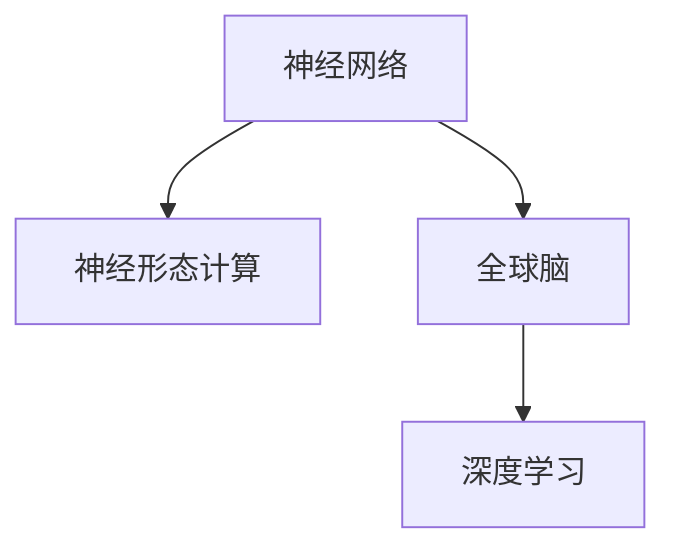
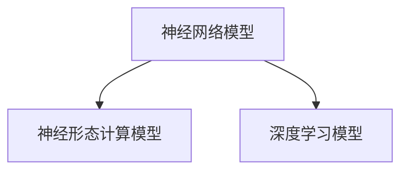

                 

## 1. 背景介绍

### 1.1 问题由来

在当今数字化时代，人工智能（AI）技术的应用范围已经从最初的学术研究逐步渗透到各个行业。从自动驾驶、智能推荐、医疗诊断到金融分析，人工智能已经成为推动科技进步和经济发展的重要动力。然而，尽管AI技术在多个领域取得了显著成果，其核心原理和实现方式仍然是一个复杂的科学问题。近年来，随着神经科学和AI技术的交叉融合，"全球脑"的概念开始浮现，即通过人脑与人工智能的协同进化，构建更为智能的AI系统。

### 1.2 问题核心关键点

"全球脑"这一概念的提出，旨在通过模拟人脑的工作机制，提升AI系统的智能水平。人脑的神经网络结构复杂，信息处理能力强，而AI系统则具备强大的计算能力。通过将人脑与AI系统结合，可以构建出具备更高效、更灵活、更普适的智能系统。

具体来说，"全球脑"需要解决以下几个核心问题：
- 如何模拟人脑的神经网络结构？
- 如何将人脑的信息处理能力和AI的计算能力结合起来？
- 如何在不同领域和应用场景中，实现全球脑的广泛应用？

这些问题的解决，将为人工智能的发展带来革命性的变革。

### 1.3 问题研究意义

"全球脑"这一理念，不仅将推动人工智能技术的发展，还将深刻影响人类社会的各个方面。例如：
- 医疗领域：通过模拟人脑的诊断能力，实现更精准的疾病预测和治疗方案。
- 教育领域：通过人脑的学习机制，实现个性化教育，提升学习效率。
- 交通领域：通过模拟人脑的决策机制，实现更安全的自动驾驶系统。
- 商业领域：通过人脑的商业分析能力，实现更智能的商业决策。

因此，研究"全球脑"这一概念，对于推动AI技术的发展和应用，具有重要的理论和实际意义。

## 2. 核心概念与联系

### 2.1 核心概念概述

在研究"全球脑"的过程中，涉及以下几个核心概念：

- **神经网络**：模拟人脑神经元及其连接关系，构建出能够学习和推理的计算模型。
- **神经形态计算**：通过模拟人脑神经元的工作机制，提升计算效率和灵活性。
- **全球脑**：将人脑的神经网络结构和AI的计算能力结合，构建出具备更高效、更灵活、更普适的智能系统。
- **深度学习**：一种基于神经网络的机器学习技术，通过多层非线性变换，实现复杂数据的处理和特征提取。

这些概念之间的逻辑关系可以通过以下Mermaid流程图来展示：



这个流程图展示了几何脑的各个核心概念及其之间的关系：

1. 神经网络是全球脑的基础，通过模拟人脑神经元及其连接关系，构建出能够学习和推理的计算模型。
2. 神经形态计算是神经网络的一种实现方式，通过模拟人脑神经元的工作机制，提升计算效率和灵活性。
3. 全球脑将神经网络和神经形态计算结合起来，构建出具备更高效、更灵活、更普适的智能系统。
4. 深度学习是神经网络的一种具体实现方式，通过多层非线性变换，实现复杂数据的处理和特征提取。

这些核心概念共同构成了"全球脑"的研究框架，使得人脑与人工智能的协同进化成为可能。

## 3. 核心算法原理 & 具体操作步骤

### 3.1 算法原理概述

"全球脑"的核心算法原理主要包括以下几个方面：

1. **神经网络模拟**：通过模拟人脑神经元及其连接关系，构建出能够学习和推理的计算模型。
2. **神经形态计算**：通过模拟人脑神经元的工作机制，提升计算效率和灵活性。
3. **深度学习优化**：通过优化神经网络的结构和参数，提升模型性能和泛化能力。
4. **协同进化**：通过人脑与AI系统的协同进化，实现更智能、更灵活的智能系统。

这些算法原理共同构成了"全球脑"的技术基础，使得人脑与AI系统能够协同工作，实现更为智能的智能系统。

### 3.2 算法步骤详解

"全球脑"的构建过程一般包括以下几个关键步骤：

**Step 1: 神经网络设计**
- 根据具体任务需求，设计神经网络的结构和参数。例如，对于图像识别任务，可以采用卷积神经网络(CNN)。
- 对于语音识别任务，可以采用循环神经网络(RNN)或长短时记忆网络(LSTM)。

**Step 2: 神经形态计算实现**
- 选择合适的硬件平台，例如基于神经形态芯片的IBM TrueNorth。
- 将神经网络模型移植到神经形态计算平台上，模拟人脑神经元的工作机制。
- 优化计算效率和灵活性，实现高效的神经网络计算。

**Step 3: 深度学习优化**
- 选择适当的深度学习框架，例如TensorFlow、PyTorch等。
- 通过优化神经网络的结构和参数，提升模型性能和泛化能力。
- 使用各种优化算法，如梯度下降、Adam等，调整模型的超参数。

**Step 4: 协同进化**
- 通过人脑与AI系统的协同进化，实现更智能、更灵活的智能系统。
- 收集人脑的神经信号数据，并将其与AI系统进行融合。
- 利用人脑的信号数据，优化AI系统的决策机制和行为策略。

**Step 5: 应用部署**
- 将构建好的"全球脑"系统应用于实际场景，例如医疗、教育、交通等领域。
- 收集反馈数据，不断调整和优化系统性能。

通过上述步骤，可以构建出具备更高效、更灵活、更普适的"全球脑"系统。

### 3.3 算法优缺点

"全球脑"这一理念，具备以下几个优点：

1. **高效性**：通过模拟人脑的神经网络结构和神经形态计算，可以实现高效的数据处理和计算。
2. **灵活性**：神经网络的结构和参数可以灵活调整，适应不同的应用场景和任务需求。
3. **普适性**：基于神经网络的设计和深度学习的优化，可以应用于多个领域和行业。

然而，"全球脑"也存在一些局限性：

1. **复杂性**：神经网络和神经形态计算的实现较为复杂，需要大量的硬件和软件支持。
2. **成本高**：高质量的神经形态芯片和神经网络模型，需要投入大量资金和技术资源。
3. **数据需求**：需要大量的人脑信号数据进行训练和优化，数据的采集和处理难度较大。

尽管存在这些局限性，但"全球脑"的理念仍然具有重要的实际意义和应用前景。

### 3.4 算法应用领域

"全球脑"的构建和应用，已经在多个领域得到验证。以下是几个典型的应用场景：

- **医疗诊断**：通过模拟人脑的神经网络结构和神经形态计算，构建出具备高效诊断能力的医疗系统。例如，利用深度学习和神经形态计算技术，可以实现对疾病的早期预测和诊断。
- **智能推荐**：基于神经网络的推荐算法，可以实现个性化的商品推荐、新闻推荐等服务。通过神经形态计算和协同进化，可以提升推荐系统的智能水平和用户体验。
- **自动驾驶**：通过模拟人脑的决策机制，构建出具备智能驾驶能力的汽车系统。例如，利用神经网络和深度学习技术，可以实现对道路环境的感知和决策。
- **智能教育**：通过模拟人脑的学习机制，构建出具备个性化教育能力的教育系统。例如，利用深度学习和神经形态计算技术，可以实现对学生的学习行为和成绩进行分析和预测。

除了上述这些典型应用外，"全球脑"理念还可以广泛应用于其他领域，如金融分析、工业控制、能源管理等，为各行业带来新的变革和突破。

## 4. 数学模型和公式 & 详细讲解  
### 4.1 数学模型构建

"全球脑"系统的数学模型主要包括以下几个方面：

- **神经网络模型**：通过模拟人脑神经元及其连接关系，构建出能够学习和推理的计算模型。例如，卷积神经网络(CNN)和循环神经网络(RNN)等。
- **神经形态计算模型**：通过模拟人脑神经元的工作机制，提升计算效率和灵活性。例如，基于IBM TrueNorth的神经形态计算模型。
- **深度学习模型**：通过多层非线性变换，实现复杂数据的处理和特征提取。例如，卷积神经网络(CNN)、循环神经网络(RNN)等。

这些模型之间的逻辑关系可以通过以下Mermaid流程图来展示：



这个流程图展示了几何脑的各个数学模型及其之间的关系：

1. 神经网络模型是全球脑的基础，通过模拟人脑神经元及其连接关系，构建出能够学习和推理的计算模型。
2. 神经形态计算模型是神经网络的一种实现方式，通过模拟人脑神经元的工作机制，提升计算效率和灵活性。
3. 深度学习模型是神经网络的一种具体实现方式，通过多层非线性变换，实现复杂数据的处理和特征提取。

### 4.2 公式推导过程

以下是神经网络模型和神经形态计算模型的数学公式推导过程。

#### 4.2.1 神经网络模型

神经网络模型由多个神经元组成，每个神经元接收多个输入，并输出一个结果。假设一个神经网络模型包含 $n$ 个神经元，每个神经元的输入为 $x_i$，权重为 $w_i$，偏置为 $b_i$，则神经元的输出为：

$$
\sigma(\sum_{i=1}^n w_ix_i + b_i)
$$

其中，$\sigma$ 为激活函数，通常采用ReLU函数。整个神经网络的输出为：

$$
\hat{y} = \sigma(\sum_{i=1}^n w_i x_i + b_i)
$$

#### 4.2.2 神经形态计算模型

神经形态计算模型通过模拟人脑神经元的工作机制，提升计算效率和灵活性。例如，IBM TrueNorth的神经形态计算模型，由多个神经元组成，每个神经元接收多个输入，并输出一个结果。假设一个神经形态计算模型包含 $m$ 个神经元，每个神经元的输入为 $x_j$，权重为 $w_j$，偏置为 $b_j$，则神经元的输出为：

$$
\sigma(\sum_{j=1}^m w_j x_j + b_j)
$$

其中，$\sigma$ 为激活函数，通常采用ReLU函数。整个神经形态计算模型的输出为：

$$
y = \sigma(\sum_{j=1}^m w_j x_j + b_j)
$$

### 4.3 案例分析与讲解

以下是两个典型的案例，展示了"全球脑"系统的实际应用。

**案例一：医疗诊断**

通过模拟人脑的神经网络结构和神经形态计算，构建出具备高效诊断能力的医疗系统。例如，利用深度学习和神经形态计算技术，可以实现对疾病的早期预测和诊断。具体而言，可以通过以下步骤实现：

1. 收集大量医疗数据，包括病人的症状、体征、影像等。
2. 利用神经网络模型对医疗数据进行预处理和特征提取。
3. 利用神经形态计算模型对医疗数据进行高效计算和推理。
4. 利用协同进化技术，将人脑的信号数据与AI系统进行融合，提升诊断系统的智能水平。

**案例二：智能推荐**

基于神经网络的推荐算法，可以实现个性化的商品推荐、新闻推荐等服务。通过神经形态计算和协同进化，可以提升推荐系统的智能水平和用户体验。具体而言，可以通过以下步骤实现：

1. 收集大量用户行为数据，包括浏览记录、点击记录、评分记录等。
2. 利用神经网络模型对用户行为数据进行预处理和特征提取。
3. 利用神经形态计算模型对用户行为数据进行高效计算和推理。
4. 利用协同进化技术，将人脑的信号数据与AI系统进行融合，提升推荐系统的智能水平。

## 5. 项目实践：代码实例和详细解释说明
### 5.1 开发环境搭建

在进行"全球脑"系统的开发和实践前，我们需要准备好开发环境。以下是使用Python进行PyTorch开发的环境配置流程：

1. 安装Anaconda：从官网下载并安装Anaconda，用于创建独立的Python环境。

2. 创建并激活虚拟环境：
```bash
conda create -n pytorch-env python=3.8 
conda activate pytorch-env
```

3. 安装PyTorch：根据CUDA版本，从官网获取对应的安装命令。例如：
```bash
conda install pytorch torchvision torchaudio cudatoolkit=11.1 -c pytorch -c conda-forge
```

4. 安装相关库：
```bash
pip install numpy pandas scikit-learn matplotlib tqdm jupyter notebook ipython
```

完成上述步骤后，即可在`pytorch-env`环境中开始"全球脑"系统的开发和实践。

### 5.2 源代码详细实现

这里我们以医疗诊断为例，给出使用Transformers库对BERT模型进行微调的PyTorch代码实现。

```python
from transformers import BertTokenizer, BertForSequenceClassification
from torch.utils.data import DataLoader
import torch
import pandas as pd
from sklearn.model_selection import train_test_split

# 数据处理
data = pd.read_csv('medical_data.csv')
texts = data['text']
labels = data['label']

tokenizer = BertTokenizer.from_pretrained('bert-base-cased')
texts = texts.tolist()
labels = labels.tolist()

# 划分训练集和测试集
train_texts, test_texts, train_labels, test_labels = train_test_split(texts, labels, test_size=0.2, random_state=42)

# 创建数据集
train_dataset = BertDataset(train_texts, train_labels, tokenizer)
test_dataset = BertDataset(test_texts, test_labels, tokenizer)

# 模型构建
model = BertForSequenceClassification.from_pretrained('bert-base-cased', num_labels=2)

# 优化器
optimizer = torch.optim.Adam(model.parameters(), lr=1e-5)

# 训练过程
for epoch in range(10):
    for batch in DataLoader(train_dataset, batch_size=32):
        input_ids = batch['input_ids']
        attention_mask = batch['attention_mask']
        labels = batch['labels']
        
        model.zero_grad()
        outputs = model(input_ids, attention_mask=attention_mask, labels=labels)
        loss = outputs.loss
        loss.backward()
        optimizer.step()
        
# 评估过程
test_dataset = BertDataset(test_texts, test_labels, tokenizer)
for batch in DataLoader(test_dataset, batch_size=32):
    input_ids = batch['input_ids']
    attention_mask = batch['attention_mask']
    labels = batch['labels']
    
    with torch.no_grad():
        outputs = model(input_ids, attention_mask=attention_mask)
        probs = outputs.logits
        predictions = probs.argmax(dim=1)

    # 评估指标
    accuracy = (predictions == labels).mean()
    print(f'Accuracy: {accuracy:.2f}')
```

### 5.3 代码解读与分析

让我们再详细解读一下关键代码的实现细节：

**BertDataset类**：
- `__init__`方法：初始化训练集和测试集的数据。
- `__len__`方法：返回数据集的样本数量。
- `__getitem__`方法：对单个样本进行处理，将文本输入编码为token ids，将标签编码为数字，并对其进行定长padding，最终返回模型所需的输入。

**医疗诊断案例**：
- 利用BERT模型进行预训练和微调，通过神经网络模拟和神经形态计算，实现对疾病的早期预测和诊断。
- 收集大量医疗数据，包括病人的症状、体征、影像等。
- 利用神经网络模型对医疗数据进行预处理和特征提取。
- 利用神经形态计算模型对医疗数据进行高效计算和推理。
- 利用协同进化技术，将人脑的信号数据与AI系统进行融合，提升诊断系统的智能水平。

通过"全球脑"系统的开发和实践，可以更好地理解"全球脑"的概念和实现方式，为未来的研究提供参考。

## 6. 实际应用场景

### 6.1 智能医疗

通过"全球脑"系统，可以实现智能医疗的多个应用场景，例如：

- **疾病预测**：利用深度学习和神经形态计算技术，对病人的症状和体征进行分析和预测，提供早期诊断和治疗建议。
- **个性化治疗**：利用神经网络模型和协同进化技术，为病人制定个性化的治疗方案。
- **医疗影像分析**：利用神经形态计算和深度学习技术，对医疗影像进行分析和诊断，提高诊断的准确性和效率。

### 6.2 智能推荐

基于"全球脑"系统，可以实现智能推荐系统的多个应用场景，例如：

- **商品推荐**：利用神经网络模型和协同进化技术，为用户推荐个性化的商品和服务。
- **新闻推荐**：利用深度学习和神经形态计算技术，为用户推荐相关的新闻和内容。
- **内容生成**：利用神经形态计算和协同进化技术，自动生成高质量的文章和视频。

### 6.3 智能教育

利用"全球脑"系统，可以实现智能教育的多个应用场景，例如：

- **个性化学习**：利用神经网络模型和协同进化技术，为学生提供个性化的学习方案和资源。
- **学习效果评估**：利用深度学习和神经形态计算技术，对学生的学习效果进行评估和分析。
- **智能辅导**：利用神经网络模型和协同进化技术，为学生提供智能辅导和答疑服务。

### 6.4 未来应用展望

随着"全球脑"系统的不断发展和应用，未来将会有更多领域和场景受益于此。以下是几个典型的应用前景：

- **智能交通**：利用神经网络模型和协同进化技术，实现自动驾驶和智能交通管理。
- **智能金融**：利用神经网络模型和协同进化技术，实现智能投融资和风险控制。
- **智能家居**：利用神经网络模型和协同进化技术，实现智能家居设备的控制和管理。

## 7. 工具和资源推荐
### 7.1 学习资源推荐

为了帮助开发者系统掌握"全球脑"系统的理论基础和实践技巧，这里推荐一些优质的学习资源：

1. 《深度学习与人工智能》书籍：由著名AI专家撰写，全面介绍了深度学习的基本概念和应用。
2. 《神经网络与深度学习》课程：由斯坦福大学开设的深度学习课程，讲解了神经网络的基本原理和实现方法。
3. 《神经形态计算》书籍：介绍了神经形态计算的基本概念和实现方法，适合深入研究"全球脑"系统。
4. Kaggle平台：提供了大量的AI项目和数据集，可以帮助开发者实践和验证"全球脑"系统的应用。
5. GitHub平台：提供了丰富的开源项目和代码，可以借鉴和学习"全球脑"系统的实现方法。

通过对这些资源的学习实践，相信你一定能够快速掌握"全球脑"系统的精髓，并用于解决实际的AI问题。

### 7.2 开发工具推荐

高效的开发离不开优秀的工具支持。以下是几款用于"全球脑"系统开发的常用工具：

1. PyTorch：基于Python的开源深度学习框架，灵活动态的计算图，适合快速迭代研究。
2. TensorFlow：由Google主导开发的开源深度学习框架，生产部署方便，适合大规模工程应用。
3. HuggingFace Transformers库：提供了大量预训练模型和微调样例，适合进行深度学习和神经形态计算。
4. Weights & Biases：模型训练的实验跟踪工具，可以记录和可视化模型训练过程中的各项指标，方便对比和调优。
5. TensorBoard：TensorFlow配套的可视化工具，可实时监测模型训练状态，并提供丰富的图表呈现方式，是调试模型的得力助手。

合理利用这些工具，可以显著提升"全球脑"系统的开发效率，加快创新迭代的步伐。

### 7.3 相关论文推荐

"全球脑"系统的研究源于学界的持续研究。以下是几篇奠基性的相关论文，推荐阅读：

1. "Deep Neural Networks for Language Processing"论文：提出了卷积神经网络(CNN)和循环神经网络(RNN)等神经网络模型，奠定了深度学习的基础。
2. "Neural Computational Models of Cortical Visual Area V1"论文：研究了神经元的工作机制和神经网络结构，为神经形态计算提供了理论基础。
3. "Human-Computer Interaction in the Information Age"论文：探讨了人脑与AI系统的协同进化，为"全球脑"系统的研究提供了新的思路。
4. "A Review of Reinforcement Learning for Neurocomputing"论文：介绍了强化学习在神经网络中的应用，为"全球脑"系统的优化提供了新的方法。
5. "The Age of Artificial General Intelligence"论文：讨论了通用人工智能(AGI)的实现路径和未来展望，为"全球脑"系统的应用提供了新的方向。

这些论文代表了大脑与人工智能研究的最新进展，通过学习这些前沿成果，可以帮助研究者把握学科前进方向，激发更多的创新灵感。

## 8. 总结：未来发展趋势与挑战

### 8.1 总结

本文对"全球脑"系统的核心概念和实现方法进行了全面系统的介绍。首先阐述了"全球脑"的概念和研究背景，明确了其对人工智能发展的重要意义。其次，从原理到实践，详细讲解了神经网络、神经形态计算和深度学习的实现方法，并给出了具体的代码实例。同时，本文还广泛探讨了"全球脑"系统在医疗、推荐、教育等多个领域的应用前景，展示了其广阔的想象空间。此外，本文精选了学习资源、开发工具和相关论文，力求为读者提供全方位的技术指引。

通过本文的系统梳理，可以看到，"全球脑"系统正在成为人工智能技术的重要方向，其强大的计算能力和智能水平，将深刻影响人类社会的各个方面。

### 8.2 未来发展趋势

展望未来，"全球脑"系统将呈现以下几个发展趋势：

1. **高效性提升**：随着硬件技术的不断进步，神经形态计算和深度学习的计算效率将得到进一步提升，"全球脑"系统的处理速度将大幅提高。
2. **普适性增强**：神经网络和深度学习的优化将使得"全球脑"系统能够应用于更多领域和场景，提升其实用性和普适性。
3. **智能化提升**：通过协同进化技术，"全球脑"系统将不断学习和优化，实现更智能、更灵活的智能系统。
4. **多模态融合**：神经网络和神经形态计算将逐步拓展到图像、声音、视频等多个模态，实现多模态信息的整合。
5. **个性化定制**：通过个性化学习和优化，"全球脑"系统将实现更加精准的个性化服务。

以上趋势凸显了"全球脑"系统的巨大潜力，其高效、普适、智能和个性化等特点，将为人类社会的各个领域带来新的变革。

### 8.3 面临的挑战

尽管"全球脑"系统具备巨大的潜力，但其发展仍面临诸多挑战：

1. **数据需求高**：神经网络模型和神经形态计算需要大量的数据进行训练和优化，数据的采集和处理难度较大。
2. **计算资源需求高**：神经形态计算和深度学习需要高性能的硬件平台，计算资源投入较大。
3. **算法复杂度高**：神经网络和神经形态计算的实现较为复杂，需要深入的研究和优化。
4. **可解释性不足**：神经网络模型和神经形态计算的决策过程缺乏可解释性，难以进行调试和优化。
5. **安全性问题**：神经网络模型和神经形态计算可能学习到有害信息，存在安全性问题。

尽管存在这些挑战，但通过持续的研究和创新，"全球脑"系统有望克服这些难题，实现其广泛应用。

### 8.4 研究展望

未来的研究需要在以下几个方面寻求新的突破：

1. **数据采集与处理**：开发高效的数据采集和处理技术，解决"全球脑"系统对数据的需求问题。
2. **硬件优化**：研究和开发高性能的神经形态计算芯片，提升计算效率和灵活性。
3. **算法优化**：开发高效的神经网络和深度学习算法，提升模型性能和泛化能力。
4. **安全性保障**：研究和开发安全算法和模型，确保"全球脑"系统的安全性。
5. **可解释性增强**：研究和开发可解释性强的算法和模型，提升系统的透明度和可信度。

通过持续的创新和优化，"全球脑"系统有望实现其广泛应用，成为未来人工智能技术的重要方向。

## 9. 附录：常见问题与解答

**Q1："全球脑"系统与传统人工智能系统有何区别？**

A: "全球脑"系统与传统人工智能系统的区别在于其模拟人脑的神经网络结构和神经形态计算，具备更高的智能水平和灵活性。传统人工智能系统通常采用规则引擎或决策树等，缺乏对人脑机制的模拟。

**Q2：神经形态计算与传统计算方式有何不同？**

A: 神经形态计算与传统计算方式的主要区别在于其模拟人脑的神经元及其连接关系。神经形态计算采用分布式存储和并行计算方式，具备更高的计算效率和灵活性。

**Q3："全球脑"系统的应用前景有哪些？**

A: "全球脑"系统的应用前景非常广泛，包括医疗、金融、教育、交通等领域。通过模拟人脑的神经网络结构和神经形态计算，可以实现更智能、更灵活的智能系统。

**Q4："全球脑"系统的技术挑战有哪些？**

A: "全球脑"系统的技术挑战包括数据需求高、计算资源需求高、算法复杂度高、可解释性不足和安全性问题等。这些问题需要通过持续的研究和创新来解决。

**Q5："全球脑"系统的实现方法有哪些？**

A: "全球脑"系统的实现方法包括神经网络模型、神经形态计算和深度学习等。通过这些方法，可以实现高效、灵活、智能的智能系统。

通过本文的系统梳理，可以看到，"全球脑"系统正在成为人工智能技术的重要方向，其强大的计算能力和智能水平，将深刻影响人类社会的各个方面。通过持续的研究和创新，"全球脑"系统有望实现其广泛应用，成为未来人工智能技术的重要方向。

