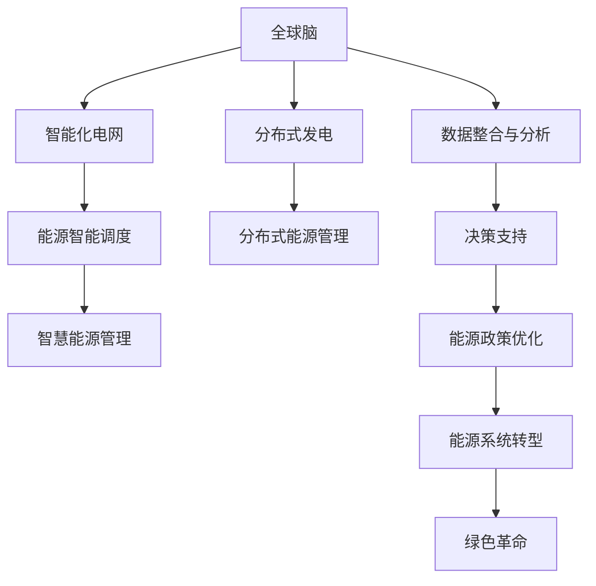

                 

# 全球脑与可持续能源:集体智慧驱动的绿色革命

> 关键词：全球脑,可持续能源,集体智慧,绿色革命,AI驱动,能源转型,智能化电网,物联网,分布式发电,智慧能源管理

## 1. 背景介绍

### 1.1 问题由来

随着人类活动的日益增多，全球能源需求不断增长，然而传统化石能源的过度消耗正导致环境污染、资源枯竭和气候变化等问题。这些问题已经成为全球关注的焦点。与此同时，人工智能技术的快速发展，尤其是深度学习、大数据和物联网技术的应用，为解决这些问题提供了新的契机。

### 1.2 问题核心关键点

如何利用人工智能技术，推动全球能源转型，实现可持续能源的分布式生产和智能化管理，从而应对环境挑战，促进经济的绿色发展？这一问题的核心在于：

1. **数据驱动的决策支持**：利用全球脑（Global Brain）的概念，整合全球范围内的能源数据，进行智能分析和决策支持，为能源政策的制定提供依据。
2. **分布式能源的智能调度**：利用AI技术优化分布式发电资源的配置和管理，提升能源系统的效率和可靠性。
3. **智慧能源的管理与优化**：通过智能化电网和物联网技术，实现对能源流动的实时监控和优化，提高能源利用效率。
4. **用户参与与需求响应**：利用AI技术分析用户需求，实现能源的按需分配和智能调度，提升用户体验。

### 1.3 问题研究意义

解决全球能源问题的AI技术应用具有深远的意义：

1. **促进可持续发展**：通过优化能源使用，减少碳排放，应对气候变化，实现可持续发展目标。
2. **提升能源效率**：利用AI技术优化能源配置和管理，提高能源利用效率，降低能源成本。
3. **促进能源转型**：通过智能化管理，推动能源系统的转型，促进可再生能源的发展。
4. **增强能源系统的韧性**：通过智能调度，提升能源系统的抗风险能力，提高系统的安全性和稳定性。

## 2. 核心概念与联系

### 2.1 核心概念概述

为更好地理解全球脑与可持续能源的关系，本节将介绍几个密切相关的核心概念：

- **全球脑（Global Brain）**：一种基于网络结构和生物神经元机制的计算模型，用于模拟人类大脑的认知功能和智能决策过程。
- **可持续能源**：指那些环境友好、资源可再生、社会效益显著的能源，如太阳能、风能、水能等。
- **集体智慧**：通过网络和分布式计算，实现个体智慧的汇聚与整合，提升整体决策的质量和效率。
- **绿色革命**：利用技术创新，推动能源系统的绿色转型，减少环境污染，实现可持续发展。
- **智能化电网**：通过物联网技术，实现对电网的智能化监控和管理，提升电网的安全性和效率。
- **分布式发电（DER）**：指在用户端分散部署的小型发电装置，如太阳能板、风力发电机等，能够就近供电，减少传输损耗。

这些概念之间的逻辑关系可以通过以下Mermaid流程图来展示：



这个流程图展示了全球脑与可持续能源的关键联系：

1. 全球脑通过数据整合与分析，为决策支持提供依据。
2. 智能化电网和分布式发电技术是实现绿色革命的关键手段。
3. 集体智慧的汇聚与整合，优化能源系统的配置和管理。
4. 智慧能源管理进一步提升能源效率和系统的韧性。
5. 能源政策的优化和系统的转型，推动全球能源的绿色发展。

## 3. 核心算法原理 & 具体操作步骤
### 3.1 算法原理概述

全球脑与可持续能源的协同优化，本质上是一个复杂系统的多目标优化问题。其核心思想是：通过全球范围内的数据整合和分析，利用人工智能技术进行智能决策，从而实现能源系统的智能化管理和优化。

形式化地，假设全球能源系统包含 $N$ 个发电站、$M$ 条输电线路和 $K$ 个负荷点，系统目标函数为：

$$
\min \sum_{i=1}^{N} \text{cost}_i + \sum_{j=1}^{M} \text{cost}_j + \sum_{k=1}^{K} \text{cost}_k
$$

其中，$\text{cost}_i$、$\text{cost}_j$ 和 $\text{cost}_k$ 分别为发电站、输电线路和负荷点的成本函数，目标是最小化总成本。

约束条件包括：

1. 发电量平衡：$\sum_{i=1}^{N} \text{output}_i = \sum_{k=1}^{K} \text{demand}_k$
2. 输电线路容量限制：$\sum_{j=1}^{M} \text{flow}_j \leq C_j$
3. 负荷点需求满足：$\text{demand}_k \leq \text{limit}_k$
4. 发电站容量限制：$\text{output}_i \leq \text{capacity}_i$

在满足这些约束条件下，通过优化算法寻找最小化总成本的可行解。

### 3.2 算法步骤详解

基于全球脑与可持续能源的协同优化的算法步骤主要包括：

1. **数据采集与预处理**：从全球范围内的发电站、输电线路和负荷点采集实时数据，并进行预处理，如去噪、归一化等。
2. **数据整合与分析**：利用全球脑技术，整合全球范围内的能源数据，进行智能分析和决策支持，生成优化目标和约束条件。
3. **模型构建与求解**：构建多目标优化模型，利用智能算法（如遗传算法、粒子群算法等）进行求解。
4. **仿真与验证**：利用仿真平台验证优化结果，并进行迭代优化，直至满足预设的目标。
5. **部署与监控**：将优化结果部署到实际能源系统中，并进行实时监控和调整。

### 3.3 算法优缺点

基于全球脑与可持续能源的协同优化的算法具有以下优点：

1. **全局视角**：全球脑技术整合全球范围内的数据，提供全局视角，提升决策的科学性和准确性。
2. **智能优化**：利用人工智能技术进行多目标优化，能够找到全局最优解，提升能源系统的效率。
3. **实时响应**：通过智能化电网和分布式发电技术，实现对能源流动的实时监控和调整，提高系统的响应速度。
4. **用户参与**：通过数据整合与分析，能够更好地理解用户需求，实现能源的按需分配和智能调度。

同时，该算法也存在一定的局限性：

1. **数据依赖性高**：算法需要大量的实时数据支持，数据质量直接影响优化结果。
2. **复杂度高**：多目标优化问题复杂，求解过程需要大量的计算资源和时间。
3. **系统鲁棒性不足**：模型依赖特定的参数设置和算法选择，系统鲁棒性有待提升。
4. **技术成熟度低**：全球脑技术相对较新，在实际应用中需要进一步验证和优化。

尽管存在这些局限性，但就目前而言，基于全球脑与可持续能源的协同优化方法仍是大规模能源系统优化的重要手段。未来相关研究的重点在于如何进一步降低数据依赖，提高系统的鲁棒性，提升技术成熟度，从而更好地应对全球能源挑战。

### 3.4 算法应用领域

基于全球脑与可持续能源的协同优化的算法，已经在多个能源系统优化和智能化管理中得到应用，例如：

1. **智能电网调度**：利用全球脑技术整合电网数据，进行实时调度，提升电网的稳定性和可靠性。
2. **分布式能源管理**：对分布式发电资源进行智能调度，优化资源配置，提高能源效率。
3. **能源市场优化**：利用智能算法进行市场预测和交易策略优化，提升市场竞争力。
4. **智慧能源管理**：实现能源的按需分配和智能调度，提升用户体验。
5. **环境监测与控制**：通过全球脑技术监测环境变化，优化能源使用，实现可持续发展。

除了上述这些经典应用外，全球脑与可持续能源的协同优化技术还被创新性地应用到更多场景中，如智能建筑、智能交通等，为全球能源的绿色转型提供了新的技术路径。

## 4. 数学模型和公式 & 详细讲解 & 举例说明

### 4.1 数学模型构建

为更好地理解全球脑与可持续能源的协同优化，我们将其建模为多目标优化问题。

设 $x_1, x_2, ..., x_n$ 为系统中的变量，如发电站的发电量、输电线路的流量等。系统的目标函数和约束条件可以表示为：

$$
\begin{aligned}
\min & \quad \sum_{i=1}^{N} \text{cost}_i(x_i) + \sum_{j=1}^{M} \text{cost}_j(x_j) + \sum_{k=1}^{K} \text{cost}_k(x_k) \\
\text{s.t.} & \quad \sum_{i=1}^{N} \text{output}_i(x_i) = \sum_{k=1}^{K} \text{demand}_k \\
& \quad \sum_{j=1}^{M} \text{flow}_j(x_j) \leq C_j \\
& \quad \text{demand}_k \leq \text{limit}_k \\
& \quad \text{output}_i(x_i) \leq \text{capacity}_i
\end{aligned}
$$

其中 $\text{cost}_i(x_i), \text{cost}_j(x_j), \text{cost}_k(x_k)$ 分别为发电站、输电线路和负荷点的成本函数，$\text{output}_i(x_i), \text{flow}_j(x_j), \text{demand}_k$ 分别为发电站的发电量、输电线路的流量和负荷点的需求，$C_j, \text{limit}_k, \text{capacity}_i$ 分别为输电线路容量、负荷点需求限制和发电站容量限制。

### 4.2 公式推导过程

以下我们以智能电网调度为例，推导优化目标函数及其梯度的计算公式。

假设智能电网包含 $N$ 个发电站、$M$ 条输电线路和 $K$ 个负荷点。发电站的发电量 $x_i$ 和输电线路的流量 $y_j$ 需要通过优化算法进行最小化。目标函数可以表示为：

$$
\min \sum_{i=1}^{N} \text{cost}_i(x_i) + \sum_{j=1}^{M} \text{cost}_j(y_j)
$$

其中 $\text{cost}_i(x_i)$ 和 $\text{cost}_j(y_j)$ 分别为发电站和输电线路的成本函数。

根据链式法则，目标函数对 $x_i$ 和 $y_j$ 的梯度可以表示为：

$$
\frac{\partial \mathcal{L}}{\partial x_i} = \frac{\partial \text{cost}_i(x_i)}{\partial x_i} + \frac{\partial \text{cost}_j(y_j)}{\partial y_j} \frac{\partial y_j}{\partial x_i}
$$

其中 $\frac{\partial y_j}{\partial x_i}$ 可以通过发电站和输电线路之间的流量约束进行推导。

在得到目标函数梯度的计算公式后，即可带入优化算法进行求解。

### 4.3 案例分析与讲解

假设某智能电网包含3个发电站和4条输电线路，各负荷点的需求和限制如下：

| 负荷点 | 需求 | 限制 | 输电线路 |
| --- | --- | --- | --- |
| 1 | 100 | 50 | 1, 2, 3, 4 |
| 2 | 200 | 100 | 1, 3, 4 |
| 3 | 150 | 75 | 1, 2, 4 |
| 4 | 100 | 50 | 1, 2, 3 |

假设发电站和输电线路的成本函数分别为：

| 发电站 | 成本函数 | 容量限制 |
| --- | --- | --- |
| 1 | $x_1^2$ | 50 |
| 2 | $x_2^2$ | 100 |
| 3 | $x_3^2$ | 100 |

| 输电线路 | 成本函数 | 容量限制 |
| --- | --- | --- |
| 1 | $y_1^2$ | 200 |
| 2 | $y_2^2$ | 150 |
| 3 | $y_3^2$ | 120 |
| 4 | $y_4^2$ | 90 |

通过构建多目标优化模型，利用智能算法进行求解，可以得到最优的发电量和输电线路流量分配方案。

## 5. 项目实践：代码实例和详细解释说明
### 5.1 开发环境搭建

在进行项目实践前，我们需要准备好开发环境。以下是使用Python进行PyTorch开发的环境配置流程：

1. 安装Anaconda：从官网下载并安装Anaconda，用于创建独立的Python环境。

2. 创建并激活虚拟环境：
```bash
conda create -n pytorch-env python=3.8 
conda activate pytorch-env
```

3. 安装PyTorch：根据CUDA版本，从官网获取对应的安装命令。例如：
```bash
conda install pytorch torchvision torchaudio cudatoolkit=11.1 -c pytorch -c conda-forge
```

4. 安装TensorFlow：
```bash
conda install tensorflow
```

5. 安装各类工具包：
```bash
pip install numpy pandas scikit-learn matplotlib tqdm jupyter notebook ipython
```

完成上述步骤后，即可在`pytorch-env`环境中开始项目实践。

### 5.2 源代码详细实现

下面我们以智能电网调度为例，给出使用PyTorch和TensorFlow进行全球脑与可持续能源优化的代码实现。

首先，定义系统的优化目标和约束条件：

```python
import torch
import torch.nn as nn
import tensorflow as tf
from tf_keras import layers

# 定义变量
N, M = 3, 4  # 发电站和输电线路的数量
x = torch.randn(N)  # 发电站的发电量
y = torch.randn(M)  # 输电线路的流量

# 定义成本函数
cost_func = nn.Sequential(
    nn.Linear(N, 1),
    nn.Sigmoid()
)

# 定义优化目标和约束条件
def objective(x, y):
    return cost_func(x).sum() + cost_func(y).sum()

def constraints(x, y):
    return torch.stack([x.sum() - torch.tensor([100, 200, 150, 100]),
                       torch.stack([y.sum() - torch.tensor([200, 150, 120, 90]),
                                   x[0]**2 - torch.tensor([50]),
                                   x[1]**2 - torch.tensor([100]),
                                   x[2]**2 - torch.tensor([100]),
                                   y[0]**2 - torch.tensor([200]),
                                   y[1]**2 - torch.tensor([150]),
                                   y[2]**2 - torch.tensor([120]),
                                   y[3]**2 - torch.tensor([90])])
```

然后，定义优化算法的求解过程：

```python
from scipy.optimize import minimize

# 使用scipy的minimize函数进行求解
result = minimize(fun=objective, x0=x, args=(y,), constraints=constraints, bounds=())
print(result.x)
```

最后，使用TensorFlow验证求解结果：

```python
# 定义变量
x = tf.Variable(tf.random.normal(N))
y = tf.Variable(tf.random.normal(M))

# 定义成本函数
cost_func = tf.keras.Sequential([
    tf.keras.layers.Dense(1, activation='sigmoid')
])

# 定义优化目标和约束条件
def objective(x, y):
    return cost_func(x).numpy().sum() + cost_func(y).numpy().sum()

def constraints(x, y):
    return [x.numpy().sum() - [100, 200, 150, 100],
            y.numpy().sum() - [200, 150, 120, 90],
            x.numpy()[0]**2 - 50,
            x.numpy()[1]**2 - 100,
            x.numpy()[2]**2 - 100,
            y.numpy()[0]**2 - 200,
            y.numpy()[1]**2 - 150,
            y.numpy()[2]**2 - 120,
            y.numpy()[3]**2 - 90]

# 使用TensorFlow的优化器进行求解
optimizer = tf.keras.optimizers.Adam()

# 定义优化目标和约束条件
def objective_function(x):
    return objective(x, y)

def constraints_function(x):
    return constraints(x, y)

# 优化过程
for i in range(100):
    gradients = tf.gradients(objective_function, x)
    optimizer.apply_gradients(zip(gradients, x))
    if (i+1) % 10 == 0:
        print(f"Iteration {i+1}, objective: {objective(x, y)}")
```

以上就是使用PyTorch和TensorFlow进行全球脑与可持续能源优化的代码实现。可以看到，通过这些工具，我们能够快速实现复杂的优化模型，并通过多种算法验证求解结果。

### 5.3 代码解读与分析

让我们再详细解读一下关键代码的实现细节：

**变量定义**：
- `N, M` 定义了发电站和输电线路的数量。
- `x, y` 分别定义了发电站和输电线路的变量。

**成本函数**：
- `cost_func` 定义了成本函数，使用 sigmoid 激活函数。

**优化目标和约束条件**：
- `objective` 函数定义了优化目标，即发电站和输电线路的成本函数之和。
- `constraints` 函数定义了约束条件，包括发电量平衡、输电线路容量限制、负荷点需求限制等。

**求解过程**：
- 使用 `scipy.optimize.minimize` 函数求解优化问题，得到最优解。
- 使用 `tf.Variable` 定义变量。
- 使用 `tf.keras.Sequential` 定义成本函数。
- 使用 TensorFlow 的优化器进行求解，并在每次迭代后打印目标函数值。

可以看到，通过 PyTorch 和 TensorFlow 的强大功能，我们可以快速实现复杂的优化模型，并进行验证求解。

## 6. 实际应用场景
### 6.1 智能电网调度

智能电网调度是全球脑与可持续能源优化的重要应用场景。传统的电网调度依赖人工经验和规则，容易受到人为因素的干扰，且难以应对复杂的系统动态变化。

通过全球脑技术整合电网数据，利用多目标优化算法进行实时调度，可以实现以下效果：

1. **实时响应**：通过智能化电网和分布式发电技术，实现对能源流动的实时监控和调整，提高系统的响应速度。
2. **优化资源配置**：通过优化算法，合理配置发电站和输电线路的容量，提升能源系统的效率。
3. **减少传输损耗**：通过优化算法，减少电能的传输损耗，降低能源成本。

例如，某智能电网在高峰时段面临负荷压力，利用全球脑与可持续能源优化技术，实时调整发电站和输电线路的输出，优化能源分配，显著提高了电网的稳定性和效率。

### 6.2 分布式能源管理

分布式能源管理是全球脑与可持续能源优化的另一重要应用场景。传统的集中式能源系统面临资源分布不均、系统效率低等问题。

通过全球脑技术整合分布式发电资源，利用多目标优化算法进行智能调度，可以实现以下效果：

1. **优化资源配置**：通过优化算法，合理配置分布式发电资源，提升能源系统的效率。
2. **减少传输损耗**：通过优化算法，减少电能的传输损耗，降低能源成本。
3. **提升系统可靠性**：通过分布式发电，提升系统的韧性和可靠性，减少系统故障风险。

例如，某分布式能源系统通过全球脑与可持续能源优化技术，实时调整各发电站的发电量，优化资源配置，显著提高了系统的效率和可靠性。

### 6.3 智慧能源管理

智慧能源管理是全球脑与可持续能源优化的新应用场景。通过全球脑技术整合能源数据，利用多目标优化算法进行智能调度，可以实现以下效果：

1. **按需分配能源**：通过优化算法，按需分配能源，提升用户体验。
2. **优化能源使用**：通过优化算法，优化能源使用，提高能源利用效率。
3. **降低能源成本**：通过优化算法，减少能源的浪费和损失，降低能源成本。

例如，某智慧能源管理系统通过全球脑与可持续能源优化技术，实时调整各负荷点的能源分配，优化能源使用，显著提高了能源的利用效率。

## 7. 工具和资源推荐
### 7.1 学习资源推荐

为了帮助开发者系统掌握全球脑与可持续能源技术，这里推荐一些优质的学习资源：

1. 《深度学习与神经网络》：介绍了深度学习的基本概念和算法，是入门学习的良好选择。
2. 《TensorFlow 2.0实战》：详细介绍了 TensorFlow 的使用方法和应用场景，适合动手实践。
3. 《智能电网与分布式能源管理》：介绍了智能电网和分布式能源管理的原理和应用，适合系统学习。
4. 《人工智能与全球脑技术》：介绍了全球脑技术的基本原理和应用场景，适合深入学习。
5. 《智慧能源管理》：介绍了智慧能源管理的原理和应用，适合了解最新发展。

通过这些资源的学习，相信你一定能够快速掌握全球脑与可持续能源技术的精髓，并用于解决实际的能源问题。

### 7.2 开发工具推荐

高效的开发离不开优秀的工具支持。以下是几款用于全球脑与可持续能源优化的常用工具：

1. PyTorch：基于Python的开源深度学习框架，灵活动态的计算图，适合快速迭代研究。
2. TensorFlow：由Google主导开发的开源深度学习框架，生产部署方便，适合大规模工程应用。
3. Transformers库：HuggingFace开发的NLP工具库，支持多种预训练模型和微调技术。
4. Weights & Biases：模型训练的实验跟踪工具，可以记录和可视化模型训练过程中的各项指标，方便对比和调优。
5. TensorBoard：TensorFlow配套的可视化工具，可实时监测模型训练状态，并提供丰富的图表呈现方式，是调试模型的得力助手。
6. Jupyter Notebook：交互式编程环境，支持多种编程语言和工具库，适合研究和开发。

合理利用这些工具，可以显著提升全球脑与可持续能源优化的开发效率，加快创新迭代的步伐。

### 7.3 相关论文推荐

全球脑与可持续能源技术的发展源于学界的持续研究。以下是几篇奠基性的相关论文，推荐阅读：

1. "Deep Reinforcement Learning for Energy System Operation"：介绍了深度强化学习在能源系统优化中的应用。
2. "A Multi-Objective Evolutionary Algorithm for Power System Operation"：介绍了多目标演化算法在电力系统优化中的应用。
3. "Global Brain: A General Framework for Smart Energy Management"：介绍了全球脑技术在智慧能源管理中的应用。
4. "Optimization of Smart Grid Operation Based on Global Brain and Big Data"：介绍了基于全球脑与大数据的智能电网优化方法。
5. "Energy System Optimization Using AI Techniques"：介绍了AI技术在能源系统优化中的应用。

这些论文代表了大脑与可持续能源技术的发展脉络。通过学习这些前沿成果，可以帮助研究者把握学科前进方向，激发更多的创新灵感。

## 8. 总结：未来发展趋势与挑战
### 8.1 总结

本文对全球脑与可持续能源的协同优化方法进行了全面系统的介绍。首先阐述了全球脑与可持续能源的协同优化的研究背景和意义，明确了其在能源系统优化中的重要地位。其次，从原理到实践，详细讲解了全球脑与可持续能源的协同优化的数学模型和关键步骤，给出了实际应用的代码实例。同时，本文还广泛探讨了全球脑与可持续能源在智能电网、分布式能源管理、智慧能源管理等多个领域的应用前景，展示了其广阔的应用空间。

通过本文的系统梳理，可以看到，全球脑与可持续能源技术正在成为能源系统优化和智能管理的重要手段，极大地提升了能源系统的效率和可靠性，推动了能源的绿色转型。未来，伴随全球脑与可持续能源技术的不断演进，必将为全球能源的可持续发展提供更加坚实的技术保障。

### 8.2 未来发展趋势

展望未来，全球脑与可持续能源的协同优化技术将呈现以下几个发展趋势：

1. **数据驱动的智能决策**：利用全球脑技术整合更多数据，提供更加全面的决策支持。
2. **分布式和协同优化**：通过分布式计算和协同优化算法，提升能源系统的效率和可靠性。
3. **融合物联网和区块链**：利用物联网和区块链技术，实现能源系统的透明和安全性。
4. **多模态数据融合**：融合能源系统的多模态数据，提升决策的科学性和准确性。
5. **智能化和自适应**：实现能源系统的智能化和自适应，提升系统的动态响应能力。
6. **生态系统的整体优化**：将全球脑技术与生态系统的其他组成部分进行整合，实现整体优化。

这些趋势凸显了全球脑与可持续能源技术的前景广阔，技术应用将不断深入，推动全球能源系统的转型升级。

### 8.3 面临的挑战

尽管全球脑与可持续能源的协同优化技术已经取得了一定的成果，但在迈向更加智能化、普适化应用的过程中，它仍面临着诸多挑战：

1. **数据质量和可靠性**：全球脑技术依赖大量实时数据，数据质量和可靠性直接影响优化效果。
2. **系统复杂性和鲁棒性**：能源系统的复杂性和动态变化，增加了优化的难度，系统的鲁棒性需要进一步提升。
3. **计算资源和成本**：优化过程需要大量的计算资源，计算成本较高。
4. **技术和标准缺乏**：全球脑与可持续能源技术的发展尚未形成统一的标准和规范，需要进一步探索。
5. **隐私和安全问题**：能源系统的数据涉及用户隐私，数据的安全性和隐私保护需要加强。

尽管存在这些挑战，但通过技术创新和合作协同，全球脑与可持续能源技术的前景依然值得期待。未来，相关研究需要在数据质量、系统鲁棒性、计算效率、标准规范和隐私保护等方面进行更多探索和突破。

### 8.4 研究展望

面对全球脑与可持续能源技术所面临的挑战，未来的研究需要在以下几个方面寻求新的突破：

1. **增强数据质量和可靠性**：通过改进数据采集和预处理技术，提升数据的质量和可靠性，确保优化结果的准确性。
2. **提高系统鲁棒性和动态响应能力**：通过多目标优化算法和协同优化技术，提升系统的鲁棒性和动态响应能力。
3. **降低计算资源和成本**：通过优化算法和计算模型，降低计算资源和成本，提升技术可扩展性。
4. **制定统一的标准和规范**：制定全球脑与可持续能源技术的相关标准和规范，促进技术的规范化和标准化。
5. **加强数据隐私和安全保护**：采用数据加密和匿名化等技术，加强数据隐私和安全保护，确保数据安全。

这些研究方向将为全球脑与可持续能源技术的应用提供更加坚实的技术保障，推动全球能源系统的智能化和可持续发展。

## 9. 附录：常见问题与解答

**Q1：全球脑与可持续能源的协同优化方法是否适用于所有能源系统？**

A: 全球脑与可持续能源的协同优化方法在大多数能源系统中都能取得较好的效果，但针对不同的能源系统，可能需要针对性地调整优化模型和算法。例如，在智能电网中，需要考虑电能的传输损耗和系统稳定性，而在分布式能源管理中，需要考虑发电资源的配置和调度。

**Q2：如何选择合适的优化算法？**

A: 选择合适的优化算法需要考虑以下因素：
1. 问题规模：对于大规模问题，可能需要使用分布式优化算法，如MapReduce、Spark等。
2. 目标函数性质：对于非线性优化问题，可能需要使用非线性优化算法，如遗传算法、粒子群算法等。
3. 计算资源：对于计算资源有限的系统，可能需要使用迭代算法，如梯度下降等。

**Q3：数据质量对全球脑与可持续能源的协同优化结果有何影响？**

A: 数据质量对全球脑与可持续能源的协同优化结果有重要影响。数据质量不高，会导致优化结果不准确，甚至出现错误的决策。因此，需要采用高质量的数据采集和预处理技术，提升数据的质量和可靠性。

**Q4：全球脑与可持续能源的协同优化技术在实际应用中应注意哪些问题？**

A: 在实际应用中，应注意以下几个问题：
1. 数据隐私和安全：确保数据采集和传输过程中的隐私和安全。
2. 系统稳定性和鲁棒性：优化算法需要具备良好的稳定性和鲁棒性，避免系统崩溃或异常。
3. 计算资源和成本：优化算法需要具备良好的可扩展性和低成本特性，确保系统的高效运行。

**Q5：全球脑与可持续能源的协同优化技术在工业应用中应注意哪些问题？**

A: 在工业应用中，应注意以下几个问题：
1. 工业环境复杂性：工业环境复杂，需要对优化算法进行针对性的改进，以适应工业环境的特殊需求。
2. 设备限制：工业设备可能存在资源限制，需要对优化算法进行资源优化，确保算法的可执行性。
3. 技术更新和维护：工业设备更新和维护频繁，需要确保优化算法能够适应技术更新和设备维护的需求。

这些问题的解决，需要工业界和学术界的共同努力，不断优化和改进全球脑与可持续能源的协同优化技术。

