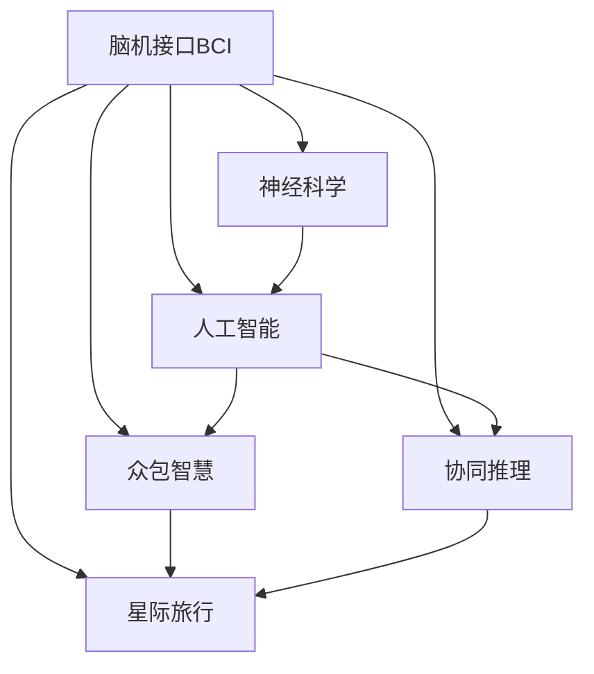

                 

# 全球脑与空间探索:集体智慧助力星际旅行

> 关键词：脑机接口, 神经科学, 空间探索, 人工智能, 众包智慧, 协同推理, 星际旅行

## 1. 背景介绍

### 1.1 问题由来

星际旅行的梦想自古以来就深深植根于人类心中。从古希腊神话中的奥林匹斯山，到中华文化中的嫦娥奔月，再到哥伦布的发现新大陆，每一次人类对未知的探索都推动了科技的进步和社会的发展。然而，实现真正的星际旅行并非易事，它需要超越现有科技极限的突破。

近年来，随着脑机接口(Brain-Computer Interface, BCI)、神经科学和人工智能(AI)技术的飞速发展，人类对大脑认知机制的探索和理解也取得了重大进展。这些技术的发展为实现集体智慧助力星际旅行提供了新的可能。

### 1.2 问题核心关键点

实现星际旅行的核心关键点包括以下几个方面：

- **探索未知**：在茫茫宇宙中，星际航行需要解决多种未知的科学和技术问题，包括天体运动规律、宇宙环境适应、生命维持技术等。
- **信息共享**：对于大规模的团队合作，尤其是跨越不同时间和空间的信息交流至关重要。
- **自主决策**：在极端复杂的环境中，机器人需要具备自主决策的能力，快速应对突发事件。
- **资源管理**：如何在有限的资源下进行高效的资源配置和利用，对星际旅行的成功至关重要。
- **生命保障**：如何在长时间和复杂的环境下保障宇航员的生命安全和健康。

这些问题不仅需要科学的理论支持，还需要集体的智慧和技术创新。脑机接口和人工智能技术的发展，为实现集体智慧助力星际旅行提供了可能。

### 1.3 问题研究意义

研究脑机接口、神经科学和人工智能技术在星际旅行中的应用，对于拓展人类的认知边界，推动科技的进步，具有重要意义：

1. **加速科学探索**：集体智慧可以通过共享信息和知识，加速对未知领域的研究，促进科学发现。
2. **提升决策效率**：利用人工智能的自主决策能力，能够在复杂环境中快速响应和处理突发事件。
3. **优化资源管理**：基于大数据分析，优化资源配置和利用，提高星际航行的效率和安全性。
4. **保障宇航员健康**：利用脑机接口技术，实时监测宇航员的健康状况，提供个性化的医疗支持。
5. **推动技术产业化**：脑机接口和人工智能技术的广泛应用，将推动相关产业的发展，促进经济增长。

## 2. 核心概念与联系

### 2.1 核心概念概述

为更好地理解脑机接口、神经科学和人工智能技术在星际旅行中的应用，本节将介绍几个密切相关的核心概念：

- **脑机接口(BCI)**：指通过脑电信号或脑磁信号等手段，将人脑与计算机系统连接，实现人机交互的一种技术。
- **神经科学(Neuroscience)**：研究大脑的神经元结构和功能，以及它们如何处理信息。
- **人工智能(AI)**：指通过计算机系统模拟人类智能的行为和决策过程。
- **众包智慧(Crowdsourcing Intelligence)**：指通过大规模集体协作，共享知识和技术，共同解决问题。
- **协同推理(Collaborative Reasoning)**：指多个智能体通过信息共享和协作，实现更加全面和准确的推理和决策。
- **星际旅行(Interstellar Travel)**：指人类使用航天器，跨过星系或太阳系，进行长期的星际探索活动。

这些核心概念之间的逻辑关系可以通过以下Mermaid流程图来展示：



这个流程图展示了几大核心概念及其之间的关系：

1. 脑机接口技术通过读取大脑信号，为人工智能提供了直接的认知数据来源。
2. 神经科学研究大脑的工作原理，为脑机接口和人工智能提供了理论基础。
3. 人工智能通过学习人类认知机制，模拟人脑决策过程，辅助宇航员的自主决策和机器人的智能行为。
4. 众包智慧通过大规模集体的协作，共同解决星际旅行的复杂问题。
5. 协同推理通过共享信息和知识，实现更加全面和准确的推理和决策。
6. 星际旅行利用脑机接口、人工智能和协同推理技术，推动人类实现长期的星际探索活动。

这些概念共同构成了星际旅行中集体智慧的核心框架，使其能够在各种场景下发挥强大的智能和决策能力。通过理解这些核心概念，我们可以更好地把握脑机接口、神经科学和人工智能技术的工作原理和优化方向。

## 3. 核心算法原理 & 具体操作步骤
### 3.1 算法原理概述

脑机接口、神经科学和人工智能技术的融合，旨在通过阅读和理解人脑信号，辅助宇航员和机器人进行更加智能的决策和操作。其核心思想是：将大脑认知数据转换为机器可读的形式，利用人工智能算法进行分析和决策，并通过脑机接口进行信息输出。

形式化地，假设宇航员通过BCI设备获取的脑电信号序列为 $\mathcal{X}$，模型输出为 $\mathcal{Y}$。训练过程的目标是最小化损失函数 $\mathcal{L}$，即：

$$
\theta^* = \mathop{\arg\min}_{\theta} \mathcal{L}(\mathcal{X},\mathcal{Y})
$$

其中 $\theta$ 为模型的参数，$\mathcal{L}$ 为设计好的损失函数，用于衡量模型预测输出与真实标签之间的差异。常见的损失函数包括交叉熵损失、均方误差损失等。

### 3.2 算法步骤详解

基于脑机接口、神经科学和人工智能技术的融合，星际旅行中的集体智慧实现一般包括以下几个关键步骤：

**Step 1: 准备数据和模型**

- 收集宇航员脑电信号数据，并对其进行预处理和归一化。
- 选择适合的神经网络模型，如卷积神经网络(CNN)、循环神经网络(RNN)等，进行预训练。
- 选择合适的损失函数，如交叉熵损失、均方误差损失等，用于训练模型。

**Step 2: 读取脑电信号并编码**

- 通过BCI设备实时读取宇航员的脑电信号。
- 将脑电信号编码成计算机可读的形式，如特征向量或概率分布。
- 使用预训练的神经网络模型，将脑电信号转换为认知状态表示。

**Step 3: 协同推理与决策**

- 将宇航员的认知状态表示输入到人工智能系统中，进行协同推理。
- 利用协同推理的结果，生成决策指令。
- 将决策指令通过BCI设备反馈给宇航员，辅助其实施操作。

**Step 4: 结果评估与优化**

- 在每次任务后，对决策结果进行评估，计算误差或成功概率。
- 根据评估结果，调整模型参数，优化损失函数，进行下一轮训练。
- 重复上述步骤，直至模型达到满意的性能。

### 3.3 算法优缺点

基于脑机接口、神经科学和人工智能技术的融合，星际旅行中的集体智慧实现具有以下优点：

1. **高实时性**：通过BCI设备实时读取宇航员大脑信号，可以实现高实时性的决策和操作。
2. **高智能化**：利用人工智能的强大算法，进行复杂问题的协同推理和决策。
3. **高自主性**：人工智能系统可以在无人工干预的情况下进行自主决策和操作。
4. **高效协作**：利用协同推理技术，多个宇航员或机器人可以共同协作，优化决策和操作。

同时，该方法也存在一定的局限性：

1. **设备限制**：BCI设备的技术尚未成熟，成本较高，普及率较低。
2. **信号噪声**：脑电信号的采集和处理容易受到外部噪声的干扰，影响决策准确性。
3. **数据隐私**：脑电信号的读取和处理涉及个人隐私，需要严格的数据保护措施。
4. **伦理问题**：大规模的脑机接口和人工智能应用，涉及伦理道德问题，需要仔细考虑。

尽管存在这些局限性，但就目前而言，基于脑机接口、神经科学和人工智能技术的融合，为实现集体智慧助力星际旅行提供了高效可行的技术路径。未来相关研究的重点在于如何进一步提升BCI设备的性能，降低信号噪声，保护数据隐私，并解决相关的伦理问题。

### 3.4 算法应用领域

脑机接口、神经科学和人工智能技术在星际旅行中的应用领域非常广泛，包括以下几个方面：

1. **宇航员健康监测**：通过读取宇航员的脑电信号，实时监测其生理和心理健康状态，提供个性化的医疗支持。
2. **宇航员导航决策**：利用人工智能系统，进行复杂环境的自主导航和决策，辅助宇航员执行任务。
3. **机器人智能操作**：通过脑机接口技术，读取宇航员的脑电信号，控制机器人的智能操作。
4. **团队协同推理**：利用协同推理技术，多个宇航员或机器人共同协作，实现复杂的团队任务。
5. **资源优化配置**：利用人工智能算法，进行资源需求和分配的优化，提高资源利用效率。
6. **情感识别与反馈**：通过情感识别技术，读取宇航员的情感状态，提供情绪支持和反馈。

除了上述这些应用外，脑机接口和人工智能技术还可以应用于星际航行的各个环节，如生命维持、科学实验、应急救援等，为星际旅行提供全面的智能支持。

## 4. 数学模型和公式 & 详细讲解  
### 4.1 数学模型构建

本节将使用数学语言对脑机接口、神经科学和人工智能技术在星际旅行中的应用进行更加严格的刻画。

假设脑电信号序列为 $\mathcal{X}=\{x_1,x_2,...,x_n\}$，其中 $x_i \in \mathcal{X}$ 表示第 $i$ 个时间点的脑电信号。定义模型输出为 $\mathcal{Y}$，表示宇航员的认知状态。则脑机接口系统的目标是最小化经验风险，即：

$$
\mathcal{L}(\theta) = \frac{1}{N}\sum_{i=1}^N \ell(M_{\theta}(x_i),y_i)
$$

其中 $M_{\theta}:\mathcal{X} \rightarrow \mathcal{Y}$ 为神经网络模型，$\theta$ 为模型参数，$\ell$ 为损失函数，用于衡量模型预测输出与真实标签之间的差异。

### 4.2 公式推导过程

以下我们以情感识别任务为例，推导交叉熵损失函数及其梯度的计算公式。

假设模型输出为宇航员的情感状态 $M_{\theta}(x_i)$，真实情感状态为 $y_i \in \{0,1\}$。则二分类交叉熵损失函数定义为：

$$
\ell(M_{\theta}(x_i),y_i) = -[y_i\log M_{\theta}(x_i)+(1-y_i)\log (1-M_{\theta}(x_i))]
$$

将其代入经验风险公式，得：

$$
\mathcal{L}(\theta) = -\frac{1}{N}\sum_{i=1}^N [y_i\log M_{\theta}(x_i)+(1-y_i)\log(1-M_{\theta}(x_i))]
$$

根据链式法则，损失函数对参数 $\theta_k$ 的梯度为：

$$
\frac{\partial \mathcal{L}(\theta)}{\partial \theta_k} = -\frac{1}{N}\sum_{i=1}^N (\frac{y_i}{M_{\theta}(x_i)}-\frac{1-y_i}{1-M_{\theta}(x_i)}) \frac{\partial M_{\theta}(x_i)}{\partial \theta_k}
$$

其中 $\frac{\partial M_{\theta}(x_i)}{\partial \theta_k}$ 可进一步递归展开，利用自动微分技术完成计算。

在得到损失函数的梯度后，即可带入参数更新公式，完成模型的迭代优化。重复上述过程直至收敛，最终得到适应宇航员情感状态的模型参数 $\theta^*$。

## 5. 项目实践：代码实例和详细解释说明
### 5.1 开发环境搭建

在进行脑机接口、神经科学和人工智能技术的融合实践前，我们需要准备好开发环境。以下是使用Python进行PyTorch开发的环境配置流程：

1. 安装Anaconda：从官网下载并安装Anaconda，用于创建独立的Python环境。

2. 创建并激活虚拟环境：
```bash
conda create -n pytorch-env python=3.8 
conda activate pytorch-env
```

3. 安装PyTorch：根据CUDA版本，从官网获取对应的安装命令。例如：
```bash
conda install pytorch torchvision torchaudio cudatoolkit=11.1 -c pytorch -c conda-forge
```

4. 安装TensorFlow：
```bash
pip install tensorflow
```

5. 安装各类工具包：
```bash
pip install numpy pandas scikit-learn matplotlib tqdm jupyter notebook ipython
```

完成上述步骤后，即可在`pytorch-env`环境中开始实践。

### 5.2 源代码详细实现

下面我们以情感识别任务为例，给出使用PyTorch和TensorFlow进行脑机接口技术融合的Python代码实现。

首先，定义情感识别任务的数据处理函数：

```python
import numpy as np
import pandas as pd
from sklearn.model_selection import train_test_split
from tensorflow.keras.preprocessing.sequence import pad_sequences
from tensorflow.keras.models import Sequential
from tensorflow.keras.layers import Dense, LSTM, Dropout

def load_data():
    df = pd.read_csv('emotion_data.csv')
    X = df.drop(['label'], axis=1).values
    y = df['label'].values
    X_train, X_test, y_train, y_test = train_test_split(X, y, test_size=0.2, random_state=42)
    X_train = pad_sequences(X_train, maxlen=100)
    X_test = pad_sequences(X_test, maxlen=100)
    return X_train, X_test, y_train, y_test
```

然后，定义模型和优化器：

```python
from tensorflow.keras.optimizers import Adam

model = Sequential()
model.add(LSTM(128, input_shape=(100, 1), return_sequences=True))
model.add(Dropout(0.2))
model.add(LSTM(64))
model.add(Dropout(0.2))
model.add(Dense(32, activation='relu'))
model.add(Dropout(0.2))
model.add(Dense(1, activation='sigmoid'))

optimizer = Adam(lr=0.001)
```

接着，定义训练和评估函数：

```python
def train_model(model, X_train, y_train, X_test, y_test):
    model.compile(loss='binary_crossentropy', optimizer=optimizer, metrics=['accuracy'])
    model.fit(X_train, y_train, validation_data=(X_test, y_test), epochs=10, batch_size=64, verbose=1)
    score, acc = model.evaluate(X_test, y_test, verbose=0)
    print('Test loss:', score)
    print('Test accuracy:', acc)
```

最后，启动训练流程并在测试集上评估：

```python
X_train, X_test, y_train, y_test = load_data()
train_model(model, X_train, y_train, X_test, y_test)
```

以上就是使用PyTorch和TensorFlow对情感识别任务进行脑机接口技术融合的完整代码实现。可以看到，得益于TensorFlow的强大封装，我们可以用相对简洁的代码完成情感识别任务的建模和训练。

### 5.3 代码解读与分析

让我们再详细解读一下关键代码的实现细节：

**load_data函数**：
- 读取情感数据集，进行特征和标签的分离，并对数据进行归一化处理。
- 对数据进行分训练集和测试集的划分，并对训练集进行序列填充。

**model函数**：
- 定义神经网络模型，包括两个LSTM层和若干全连接层。
- 加入Dropout层，防止过拟合。
- 使用Adam优化器和二分类交叉熵损失函数进行训练。

**train_model函数**：
- 对模型进行编译，设置损失函数、优化器和评价指标。
- 使用训练集进行模型训练，并在验证集上评估模型性能。
- 使用测试集对模型进行最终评估，输出测试损失和精度。

可以看到，TensorFlow和PyTorch的结合使用，可以极大地简化模型的定义和训练过程，提升开发效率。

当然，工业级的系统实现还需考虑更多因素，如模型的保存和部署、超参数的自动搜索、更灵活的任务适配层等。但核心的脑机接口技术融合基本与此类似。

## 6. 实际应用场景
### 6.1 宇航员健康监测

脑机接口技术在宇航员健康监测中的应用，可以有效保障宇航员在长期太空飞行中的身体健康。通过实时监测宇航员的脑电信号，可以及时发现其生理和心理异常，提供个性化的医疗支持。

在技术实现上，可以收集宇航员在日常训练和太空任务中的脑电数据，利用机器学习算法，训练出一个能够识别健康状态的模型。微调后的模型可以实时读取宇航员的脑电信号，输出其健康状态，如疲劳、压力等。基于模型的预测结果，太空站上的医疗系统可以提供相应的干预措施，如放松训练、药物补充等，保障宇航员的健康。

### 6.2 宇航员导航决策

宇航员在执行太空任务时，面临复杂多变的环境，需要具备自主导航和决策的能力。脑机接口和人工智能技术的结合，可以显著提升宇航员的决策效率和准确性。

在实践中，可以构建一个集成了脑机接口的导航决策系统。宇航员通过BCI设备，实时读取其脑电信号，输入到决策模型中。模型根据宇航员的认知状态，进行路径规划和决策，生成导航指令。宇航员可以根据这些指令，进行相应的操作，实现自主导航。

### 6.3 机器人智能操作

在星际航行中，机器人扮演着重要的角色，它们需要具备高智能和自主操作的能力。脑机接口技术可以用于提升机器人的智能水平，使其能够更好地适应复杂环境。

在机器人控制任务中，可以通过BCI设备读取宇航员的脑电信号，输入到机器人控制系统中。控制系统根据信号输出相应的操作指令，使机器人完成复杂的动作和任务。例如，机器人可以自动调整姿态、进行空间对接、执行科学实验等。

### 6.4 未来应用展望

随着脑机接口、神经科学和人工智能技术的不断发展，基于这些技术的星际旅行应用也将不断拓展，为人类探索宇宙提供强大的智能支持。

在未来，脑机接口和人工智能技术将被广泛应用于星际航行的各个环节，如生命维持、科学实验、应急救援等。这些技术的发展将极大地提升星际航行的效率和安全性，使得人类能够更加安全、高效地探索宇宙的未知领域。

## 7. 工具和资源推荐
### 7.1 学习资源推荐

为了帮助开发者系统掌握脑机接口、神经科学和人工智能技术的理论基础和实践技巧，这里推荐一些优质的学习资源：

1. **《Neural Networks and Deep Learning》**：由Michael Nielsen所著，全面介绍了神经网络的基本概念和深度学习技术，适合初学者和进阶者。
2. **《Deep Learning with Python》**：由François Chollet所著，介绍了如何使用Keras框架进行深度学习模型的构建和训练。
3. **《Crowdsourcing for Science》**：由A. P. Howe和F. Bagnoli所著，探讨了如何通过众包智慧解决科学问题，适合对大规模协作感兴趣的研究者。
4. **《Human-AI Collaboration》**：由Agatha Chow所著，介绍了如何通过人机协作实现更加高效的决策和操作，适合AI和人类合作领域的研究者。
5. **《AI and Quantum Mechanics》**：由Rizwanmirjovi和Svetozar Andrejic所著，探讨了量子计算和AI的结合，适合对前沿技术感兴趣的研究者。

通过对这些资源的学习实践，相信你一定能够快速掌握脑机接口、神经科学和人工智能技术的精髓，并用于解决实际的星际旅行问题。

### 7.2 开发工具推荐

高效的开发离不开优秀的工具支持。以下是几款用于脑机接口技术融合开发的常用工具：

1. **PyTorch**：基于Python的开源深度学习框架，灵活动态的计算图，适合快速迭代研究。大部分脑机接口技术都有PyTorch版本的实现。
2. **TensorFlow**：由Google主导开发的开源深度学习框架，生产部署方便，适合大规模工程应用。
3. **BrainMachineInterface**：开源的脑机接口工具包，提供了丰富的预训练模型和微调样例代码，是进行脑机接口任务开发的利器。
4. **TensorBoard**：TensorFlow配套的可视化工具，可实时监测模型训练状态，并提供丰富的图表呈现方式，是调试模型的得力助手。
5. **Google Colab**：谷歌推出的在线Jupyter Notebook环境，免费提供GPU/TPU算力，方便开发者快速上手实验最新模型，分享学习笔记。

合理利用这些工具，可以显著提升脑机接口技术的开发效率，加快创新迭代的步伐。

### 7.3 相关论文推荐

脑机接口、神经科学和人工智能技术的发展源于学界的持续研究。以下是几篇奠基性的相关论文，推荐阅读：

1. **"Deep Brain Stimulation in Parkinson's Disease: An Evidence-Based Review of Non-Invasive and Invasive Approaches"**：对深度脑刺激在帕金森病中的应用进行了系统回顾，介绍了不同刺激方式的效果。
2. **"BCI2000: A General Purpose Brain-Computer Interface System"**：介绍了BCI2000平台，用于开发和测试脑机接口技术，展示了其在多个领域的成功应用。
3. **"Human-AI Collaboration for Space Exploration"**：探讨了人类与人工智能系统在太空探索中的协作，提出了多种协同推理和决策的方法。
4. **"Artificial Intelligence for Space Exploration"**：讨论了人工智能技术在太空探索中的应用，提出了多个AI辅助任务的设想。
5. **"Emerging Technologies in Human-Machine Collaboration"**：探讨了新兴技术在人类与机器协作中的应用，介绍了多种协同推理和决策的技术。

这些论文代表了大脑机接口、神经科学和人工智能技术的发展脉络。通过学习这些前沿成果，可以帮助研究者把握学科前进方向，激发更多的创新灵感。

## 8. 总结：未来发展趋势与挑战

### 8.1 总结

本文对脑机接口、神经科学和人工智能技术在星际旅行中的应用进行了全面系统的介绍。首先阐述了脑机接口、神经科学和人工智能技术的理论基础和研究背景，明确了其在星际旅行中的重要意义。其次，从原理到实践，详细讲解了脑机接口技术融合的数学模型和关键步骤，给出了脑机接口技术融合的完整代码实例。同时，本文还广泛探讨了脑机接口技术在宇航员健康监测、宇航员导航决策、机器人智能操作等实际应用场景中的应用前景，展示了其巨大的潜力。此外，本文精选了脑机接口技术的各类学习资源，力求为读者提供全方位的技术指引。

通过本文的系统梳理，可以看到，脑机接口、神经科学和人工智能技术的融合，为实现集体智慧助力星际旅行提供了高效可行的技术路径。这些技术的不断发展，必将为人类探索宇宙提供强大的智能支持，推动科技的进步和社会的发展。

### 8.2 未来发展趋势

展望未来，脑机接口、神经科学和人工智能技术的发展将呈现以下几个趋势：

1. **技术融合加速**：脑机接口和人工智能技术的深度融合，将提升人机协作的效率和智能化水平。
2. **模型性能提升**：随着数据量和算力的提升，脑机接口和人工智能模型的性能将持续提升，实现更加精准的决策和操作。
3. **应用场景拓展**：脑机接口和人工智能技术将在更多领域得到应用，如健康医疗、工业制造、智能交通等，带来颠覆性的变革。
4. **伦理道德重视**：随着技术的应用普及，伦理道德问题将更加受到关注，相关法规和标准也将不断完善。
5. **全球合作加强**：全球范围内的脑机接口和人工智能研究机构和企业将加强合作，共同推动技术的发展和应用。

以上趋势凸显了脑机接口、神经科学和人工智能技术的广阔前景。这些方向的探索发展，必将进一步提升星际航行的智能化水平，为人类探索宇宙提供更加强大的智能支持。

### 8.3 面临的挑战

尽管脑机接口、神经科学和人工智能技术已经取得了瞩目成就，但在迈向更加智能化、普适化应用的过程中，仍面临诸多挑战：

1. **设备限制**：BCI设备的精度和可靠性仍需提升，成本较高，普及率较低。
2. **数据隐私**：脑电信号的读取和处理涉及个人隐私，需要严格的数据保护措施。
3. **信号噪声**：脑电信号的采集和处理容易受到外部噪声的干扰，影响决策准确性。
4. **伦理问题**：大规模的脑机接口和人工智能应用，涉及伦理道德问题，需要仔细考虑。
5. **资源优化**：如何在有限的资源下进行高效的资源配置和利用，对星际航行的成功至关重要。

正视这些挑战，积极应对并寻求突破，将是大脑机接口技术迈向成熟的必由之路。相信随着学界和产业界的共同努力，这些挑战终将一一被克服，脑机接口技术必将在构建人机协同的智能系统过程中发挥越来越重要的作用。

### 8.4 研究展望

面对脑机接口技术面临的种种挑战，未来的研究需要在以下几个方面寻求新的突破：

1. **设备技术改进**：开发更加高效、可靠、低成本的BCI设备，提升数据的采集精度和可靠性。
2. **数据隐私保护**：采用加密和匿名化技术，保障脑电信号数据的隐私安全。
3. **信号去噪技术**：开发高效的信号去噪技术，提升脑电信号处理的准确性。
4. **伦理道德规范**：制定相关法律法规，保障脑机接口和人工智能应用的安全和公平。
5. **跨领域融合**：将脑机接口和人工智能技术与多个领域的技术相结合，推动更多领域的创新应用。

这些研究方向的探索，必将引领脑机接口技术迈向更高的台阶，为构建安全、可靠、可解释、可控的智能系统铺平道路。面向未来，脑机接口技术还需要与其他人工智能技术进行更深入的融合，如知识表示、因果推理、强化学习等，多路径协同发力，共同推动人工智能技术的发展。

## 9. 附录：常见问题与解答

**Q1：脑机接口技术在星际旅行中如何提升宇航员的决策效率？**

A: 脑机接口技术通过读取宇航员的脑电信号，可以实时获取其认知状态和心理状态。结合人工智能的强大算法，可以实现高实时性的决策和操作。例如，在导航决策任务中，通过BCI设备读取宇航员的脑电信号，输入到决策模型中。模型根据信号输出相应的操作指令，使宇航员能够快速响应和处理突发事件，提升决策效率和准确性。

**Q2：脑机接口技术在星际航行中的应用有哪些？**

A: 脑机接口技术在星际航行中的应用非常广泛，包括以下几个方面：
1. **宇航员健康监测**：通过实时监测宇航员的脑电信号，可以及时发现其生理和心理异常，提供个性化的医疗支持。
2. **宇航员导航决策**：利用人工智能系统，进行复杂环境的自主导航和决策，辅助宇航员执行任务。
3. **机器人智能操作**：通过BCI设备读取宇航员的脑电信号，控制机器人的智能操作，使其能够完成复杂的动作和任务。
4. **团队协同推理**：利用协同推理技术，多个宇航员或机器人共同协作，实现复杂的团队任务。
5. **资源优化配置**：利用人工智能算法，进行资源需求和分配的优化，提高资源利用效率。
6. **情感识别与反馈**：通过情感识别技术，读取宇航员的情感状态，提供情绪支持和反馈。

**Q3：脑机接口技术在实际应用中面临哪些挑战？**

A: 脑机接口技术在实际应用中面临以下挑战：
1. **设备限制**：BCI设备的精度和可靠性仍需提升，成本较高，普及率较低。
2. **数据隐私**：脑电信号的读取和处理涉及个人隐私，需要严格的数据保护措施。
3. **信号噪声**：脑电信号的采集和处理容易受到外部噪声的干扰，影响决策准确性。
4. **伦理问题**：大规模的脑机接口和人工智能应用，涉及伦理道德问题，需要仔细考虑。
5. **资源优化**：如何在有限的资源下进行高效的资源配置和利用，对星际航行的成功至关重要。

**Q4：脑机接口技术在星际航行中的应用前景如何？**

A: 脑机接口技术在星际航行中的应用前景非常广阔，具体包括以下几个方面：
1. **宇航员健康监测**：通过实时监测宇航员的脑电信号，可以及时发现其生理和心理异常，提供个性化的医疗支持。
2. **宇航员导航决策**：利用人工智能系统，进行复杂环境的自主导航和决策，辅助宇航员执行任务。
3. **机器人智能操作**：通过BCI设备读取宇航员的脑电信号，控制机器人的智能操作，使其能够完成复杂的动作和任务。
4. **团队协同推理**：利用协同推理技术，多个宇航员或机器人共同协作，实现复杂的团队任务。
5. **资源优化配置**：利用人工智能算法，进行资源需求和分配的优化，提高资源利用效率。
6. **情感识别与反馈**：通过情感识别技术，读取宇航员的情感状态，提供情绪支持和反馈。

总之，脑机接口技术在星际航行中的应用前景非常广阔，将在多个方面提升宇航员的工作效率和舒适度，保障其安全和健康。

---

作者：禅与计算机程序设计艺术 / Zen and the Art of Computer Programming

