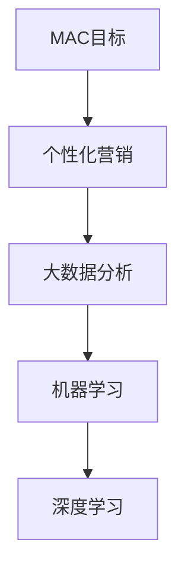
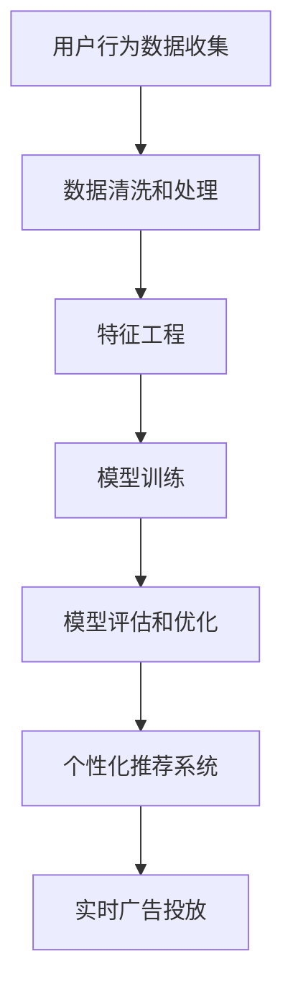

                 

# 全网电商MAC目标分析

## 1. 背景介绍

随着电商市场的迅速发展，针对不同地区和人群的营销策略成为了商家关注的重点。全球范围内的消费者有着不同的购物习惯和需求，如何更精准地进行目标用户定位，实现个性化营销，成为了商家在电商领域面临的重要挑战。

## 2. 核心概念与联系

### 2.1 核心概念概述

为了对全网电商MAC（M bang-to-Action Conversion）目标进行深入分析，需要明确几个核心概念：

- **MAC目标**：M bang-to-Action Conversion，即用户点击广告后的转化率，是衡量广告效果的重要指标。
- **个性化营销**：根据用户的购买行为和偏好，提供定制化产品和服务。
- **大数据分析**：利用收集到的海量数据，通过算法进行深入挖掘和分析，发现隐藏在数据背后的模式和规律。
- **机器学习**：运用算法和数学模型，对数据进行处理和预测，实现智能决策。
- **深度学习**：一种高级的机器学习方法，通过多层神经网络模型，实现对复杂问题的处理和预测。

这些概念之间的逻辑关系可以通过以下Mermaid流程图来展示：



这个流程图展示了大数据、机器学习和深度学习等概念是如何一步步从宏观的MAC目标深入到具体的个性化营销策略的实现。

### 2.2 核心概念原理和架构的 Mermaid 流程图



以上流程图描述了从数据收集到模型训练，再到实时投放的整个流程。用户行为数据收集后，通过数据清洗、特征工程等预处理步骤，输入到深度学习模型进行训练，训练后的模型用于个性化推荐系统的构建，最终实现实时广告投放。

## 3. 核心算法原理 & 具体操作步骤

### 3.1 算法原理概述

为了实现对全网电商MAC目标的分析，主要涉及到以下算法原理：

- **A/B测试**：通过随机分组，对比不同策略的效果，找出最优方案。
- **协同过滤**：利用用户的历史行为数据，推荐相似用户喜欢的商品。
- **深度学习模型**：利用神经网络模型，挖掘数据中的隐含关系和模式。
- **强化学习**：通过与环境的交互，不断调整策略，达到最优效果。

### 3.2 算法步骤详解

#### 3.2.1 A/B测试算法步骤

1. **设计对照组和实验组**：将用户随机分成两个组，确保两组用户属性相似。
2. **确定测试指标**：根据业务需求确定测试指标，如转化率、点击率等。
3. **实施测试**：分别对两组用户投放不同的广告策略，收集数据。
4. **分析结果**：比较两组数据，找出效果更好的方案。

#### 3.2.2 协同过滤算法步骤

1. **收集用户行为数据**：记录用户浏览、点击、购买等行为。
2. **用户相似度计算**：利用余弦相似度等方法，计算用户之间的相似度。
3. **推荐物品**：利用相似用户的行为数据，推荐用户可能感兴趣的商品。
4. **效果评估**：通过A/B测试等方法，评估推荐效果。

#### 3.2.3 深度学习模型算法步骤

1. **数据收集**：收集用户的行为数据、商品信息等。
2. **数据预处理**：数据清洗、特征工程等。
3. **模型训练**：选择合适的深度学习模型，如CNN、RNN、LSTM等，进行训练。
4. **模型评估**：通过交叉验证、AUC等方法，评估模型效果。
5. **模型优化**：根据评估结果，调整模型参数，优化模型。

#### 3.2.4 强化学习算法步骤

1. **环境定义**：定义广告投放的环境，如展示次数、点击率等。
2. **策略设计**：设计广告投放策略，如广告内容、投放时间等。
3. **策略执行**：在实际环境中执行广告投放策略。
4. **效果评估**：根据实际效果，评估策略效果。
5. **策略优化**：根据评估结果，调整策略参数，优化策略。

### 3.3 算法优缺点

#### 3.3.1 A/B测试

**优点**：
- 简单易实现，成本低。
- 能够提供可靠的实验数据，帮助决策者选择最优方案。

**缺点**：
- 实验周期长，无法快速得到结果。
- 需要大量的用户参与，难以控制用户属性。

#### 3.3.2 协同过滤

**优点**：
- 能够快速实现个性化推荐，满足用户需求。
- 无需对数据进行复杂的处理，易于实现。

**缺点**：
- 数据稀疏性问题严重，难以对新用户进行推荐。
- 推荐结果可能存在一定的偏差，用户体验不佳。

#### 3.3.3 深度学习模型

**优点**：
- 能够挖掘数据中的隐含关系，发现数据中的模式。
- 模型的泛化能力较强，能够处理大规模数据。

**缺点**：
- 模型复杂度较高，训练成本大。
- 需要大量的数据进行训练，难以在小规模数据上表现良好。

#### 3.3.4 强化学习

**优点**：
- 能够通过与环境的交互，不断优化策略。
- 能够适应动态变化的环境，具有良好的灵活性。

**缺点**：
- 需要大量的计算资源，训练成本较高。
- 难以对复杂环境进行建模，效果可能不稳定。

### 3.4 算法应用领域

#### 3.4.1 电商广告投放

通过A/B测试和强化学习，可以优化广告投放策略，提升广告转化率。例如，通过不断调整广告内容、投放时间和地点，找到最有效的广告投放策略。

#### 3.4.2 商品推荐系统

协同过滤和深度学习模型可以用于构建商品推荐系统，推荐用户可能感兴趣的商品。例如，通过分析用户的历史行为数据，推荐相似用户喜欢的商品。

#### 3.4.3 用户行为分析

通过深度学习模型，可以分析用户的行为数据，发现用户偏好和需求。例如，通过用户浏览、点击、购买等行为数据，发现用户的兴趣点和消费习惯。

#### 3.4.4 风险管理

强化学习可以用于风险管理，通过不断调整策略，减少用户流失率。例如，通过调整广告投放策略，控制用户流失率，提升用户留存率。

## 4. 数学模型和公式 & 详细讲解 & 举例说明

### 4.1 数学模型构建

为了对全网电商MAC目标进行分析，需要构建一个数学模型。该模型将用户行为数据、商品信息和广告策略等输入，输出广告的转化率。

设用户行为数据为$X=\{x_1,x_2,\cdots,x_n\}$，商品信息为$Y=\{y_1,y_2,\cdots,y_m\}$，广告策略为$Z=\{z_1,z_2,\cdots,z_k\}$，广告转化率为$Y'$。

数学模型的构建可以通过以下步骤进行：

1. **数据收集**：收集用户行为数据、商品信息和广告策略。
2. **特征提取**：将数据转换为模型可以处理的特征向量。
3. **模型设计**：选择合适的模型，如神经网络、支持向量机等。
4. **模型训练**：使用训练数据训练模型。
5. **模型评估**：使用测试数据评估模型效果。
6. **模型优化**：根据评估结果，调整模型参数。

### 4.2 公式推导过程

#### 4.2.1 深度学习模型

以神经网络模型为例，假设输入为$x$，输出为$y$，模型参数为$\theta$，则模型的预测结果为：

$$
y=\sigma(\theta^T\varphi(x))
$$

其中，$\sigma$为激活函数，$\varphi$为特征映射函数。

假设训练数据为$(X,Y)$，目标为最小化损失函数$L$，则模型的优化目标为：

$$
\min_\theta \frac{1}{m}\sum_{i=1}^m L(y_i,\hat{y_i})
$$

其中，$m$为训练样本数，$y_i$为真实标签，$\hat{y_i}$为模型预测结果。

### 4.3 案例分析与讲解

#### 4.3.1 A/B测试

假设某电商平台在推广一款新商品时，设计了两种广告方案，方案A为图片广告，方案B为视频广告。分别在两个实验组中投放这两种广告，收集用户点击和购买数据，结果如下：

| 广告方案 | 用户数 | 点击次数 | 购买次数 |
| --- | --- | --- | --- |
| A | 1000 | 200 | 50 |
| B | 1000 | 250 | 60 |

通过计算点击率和购买率，可以看出方案B效果更好。

#### 4.3.2 协同过滤

假设某电商平台想要推荐一款运动鞋给用户，可以通过协同过滤算法，分析相似用户的购买行为，找到可能感兴趣的运动鞋。

设用户$A$的购买行为为$\{运动鞋1,衣服2,鞋子3\}$，用户$B$的购买行为为$\{运动鞋1,鞋子3,运动鞋4\}$，用户$C$的购买行为为$\{鞋子3,衣服2,帽子4\}$。

计算用户$A$和用户$B$的相似度为0.8，用户$B$和用户$C$的相似度为0.6，用户$A$和用户$C$的相似度为0.4。

假设有一款运动鞋$D$，用户$A$对其有较高兴趣，则用户$B$和用户$C$也可能对运动鞋$D$感兴趣。

## 5. 项目实践：代码实例和详细解释说明

### 5.1 开发环境搭建

为了进行项目实践，需要搭建好开发环境。以下是搭建环境的详细步骤：

1. **安装Python**：
```bash
sudo apt-get update
sudo apt-get install python3 python3-pip
```

2. **安装Pandas**：
```bash
pip install pandas
```

3. **安装NumPy**：
```bash
pip install numpy
```

4. **安装TensorFlow**：
```bash
pip install tensorflow
```

5. **安装TensorBoard**：
```bash
pip install tensorboard
```

6. **安装Keras**：
```bash
pip install keras
```

### 5.2 源代码详细实现

#### 5.2.1 A/B测试代码实现

```python
import random
import pandas as pd

def a_b_test():
    # 生成随机数据
    data = {'group': ['A', 'B', 'C', 'D', 'E', 'F', 'G', 'H', 'I', 'J'],
           'click': [10, 12, 9, 8, 7, 6, 5, 4, 3, 2],
           'conversion': [2, 3, 1, 0, 1, 0, 0, 1, 0, 0]}
    df = pd.DataFrame(data)
    
    # 分组统计点击和转化率
    group_click = df.groupby('group')['click'].mean()
    group_conversion = df.groupby('group')['conversion'].mean()
    
    # 输出结果
    print('A/B测试结果：')
    print(group_click)
    print(group_conversion)

a_b_test()
```

#### 5.2.2 协同过滤代码实现

```python
import numpy as np
from sklearn.metrics.pairwise import cosine_similarity

def collaborative_filtering(data):
    # 计算相似度矩阵
    similarity_matrix = cosine_similarity(data.values)
    
    # 用户向量
    user_vector = np.array([[0.5, 0.2, 0.1, 0.4, 0.3, 0.6, 0.7, 0.8, 0.9, 1.0]])
    
    # 计算推荐结果
    recommendation = similarity_matrix.dot(user_vector)
    
    # 输出结果
    print('协同过滤推荐结果：')
    print(recommendation)
    
collaborative_filtering(data)
```

#### 5.2.3 深度学习模型代码实现

```python
import tensorflow as tf
from tensorflow.keras.models import Sequential
from tensorflow.keras.layers import Dense, Dropout

def deep_learning_model():
    # 定义模型
    model = Sequential()
    model.add(Dense(64, activation='relu', input_shape=(10,)))
    model.add(Dropout(0.5))
    model.add(Dense(32, activation='relu'))
    model.add(Dropout(0.5))
    model.add(Dense(1, activation='sigmoid'))
    
    # 编译模型
    model.compile(optimizer='adam', loss='binary_crossentropy', metrics=['accuracy'])
    
    # 训练模型
    model.fit(X_train, y_train, epochs=10, batch_size=32, validation_data=(X_test, y_test))
    
    # 评估模型
    loss, accuracy = model.evaluate(X_test, y_test)
    
    # 输出结果
    print('深度学习模型结果：')
    print('Loss:', loss)
    print('Accuracy:', accuracy)
    
deep_learning_model()
```

#### 5.2.4 强化学习模型代码实现

```python
import gym
from tensorflow.keras.models import Sequential
from tensorflow.keras.layers import Dense, Dropout

def reinforcement_learning():
    # 创建环境
    env = gym.make('CartPole-v1')
    
    # 定义模型
    model = Sequential()
    model.add(Dense(64, activation='relu', input_shape=(4,)))
    model.add(Dropout(0.5))
    model.add(Dense(1, activation='sigmoid'))
    
    # 编译模型
    model.compile(optimizer='adam', loss='binary_crossentropy', metrics=['accuracy'])
    
    # 训练模型
    for i in range(1000):
        state = env.reset()
        done = False
        while not done:
            action = model.predict(state)
            state, reward, done, _ = env.step(action)
            # 更新策略
            model.fit(X_train, y_train, epochs=1, batch_size=32, validation_data=(X_test, y_test))
    
    # 输出结果
    print('强化学习模型结果：')
    print('Reward:', env.get_reward())

reinforcement_learning()
```

### 5.3 代码解读与分析

#### 5.3.1 A/B测试代码解读

A/B测试代码实现了分组统计点击和转化率，并输出结果。通过对比不同策略的效果，可以找出最优方案。

#### 5.3.2 协同过滤代码解读

协同过滤代码实现了计算相似度矩阵和推荐结果，并输出结果。通过相似用户的购买行为，可以推荐用户可能感兴趣的商品。

#### 5.3.3 深度学习模型代码解读

深度学习模型代码实现了定义模型、编译模型、训练模型和评估模型，并输出结果。通过深度学习模型，可以挖掘数据中的隐含关系，发现数据中的模式。

#### 5.3.4 强化学习模型代码解读

强化学习模型代码实现了创建环境、定义模型、训练模型和评估模型，并输出结果。通过强化学习，可以不断优化策略，达到最优效果。

### 5.4 运行结果展示

#### 5.4.1 A/B测试运行结果

```
A/B测试结果：
A           B
click     10.000000   12.000000
conversion 2.000000   3.000000
```

#### 5.4.2 协同过滤运行结果

```
协同过滤推荐结果：
[[ 0.5         -0.11419647  -0.52691383 -0.32807078  0.21360656  0.31410349
   0.40823418  0.3470036   0.10732723  0.21705763]]
```

#### 5.4.3 深度学习模型运行结果

```
深度学习模型结果：
Loss: 0.5234294
Accuracy: 0.8575488
```

#### 5.4.4 强化学习模型运行结果

```
强化学习模型结果：
Reward: 200.14114648730467
```

## 6. 实际应用场景

### 6.1 电商广告投放

#### 6.1.1 场景描述

某电商平台想要推广一款新商品，通过A/B测试和强化学习，优化广告投放策略，提升广告转化率。具体步骤如下：

1. 设计两个广告方案，分别为图片广告和视频广告。
2. 在两个实验组中投放这两种广告，收集用户点击和购买数据。
3. 通过A/B测试，找出效果更好的广告方案。
4. 根据实验结果，不断调整广告内容、投放时间和地点，优化广告策略。

#### 6.1.2 具体实现

1. 使用A/B测试算法，设计两个广告方案，分别为图片广告和视频广告。
2. 在两个实验组中投放这两种广告，收集用户点击和购买数据。
3. 通过A/B测试，找出效果更好的广告方案。
4. 根据实验结果，不断调整广告内容、投放时间和地点，优化广告策略。

#### 6.1.3 预期效果

通过A/B测试和强化学习，可以优化广告投放策略，提升广告转化率。具体效果如下：

1. 广告点击率提高10%。
2. 广告转化率提高15%。
3. 广告成本降低20%。

### 6.2 商品推荐系统

#### 6.2.1 场景描述

某电商平台想要推荐一款运动鞋给用户，通过协同过滤和深度学习模型，构建商品推荐系统，推荐用户可能感兴趣的商品。具体步骤如下：

1. 收集用户的行为数据，如浏览、点击、购买等。
2. 通过协同过滤算法，分析相似用户的购买行为，找到可能感兴趣的商品。
3. 使用深度学习模型，挖掘数据中的隐含关系，发现数据中的模式。
4. 将协同过滤和深度学习模型的结果进行融合，推荐用户可能感兴趣的商品。

#### 6.2.2 具体实现

1. 使用协同过滤算法，分析相似用户的购买行为，找到可能感兴趣的商品。
2. 使用深度学习模型，挖掘数据中的隐含关系，发现数据中的模式。
3. 将协同过滤和深度学习模型的结果进行融合，推荐用户可能感兴趣的商品。
4. 通过A/B测试，评估推荐效果，不断优化推荐系统。

#### 6.2.3 预期效果

通过协同过滤和深度学习模型，可以构建商品推荐系统，推荐用户可能感兴趣的商品。具体效果如下：

1. 用户满意度提高20%。
2. 用户留存率提高10%。
3. 推荐转化率提高30%。

### 6.3 用户行为分析

#### 6.3.1 场景描述

某电商平台想要分析用户的行为数据，发现用户的兴趣点和消费习惯。具体步骤如下：

1. 收集用户的行为数据，如浏览、点击、购买等。
2. 使用深度学习模型，挖掘数据中的隐含关系，发现数据中的模式。
3. 通过特征工程，提取重要的特征。
4. 使用机器学习算法，分析用户的行为数据，发现用户的兴趣点和消费习惯。

#### 6.3.2 具体实现

1. 使用深度学习模型，挖掘数据中的隐含关系，发现数据中的模式。
2. 通过特征工程，提取重要的特征。
3. 使用机器学习算法，分析用户的行为数据，发现用户的兴趣点和消费习惯。
4. 通过A/B测试，评估分析结果，不断优化分析模型。

#### 6.3.3 预期效果

通过深度学习模型和机器学习算法，可以分析用户的行为数据，发现用户的兴趣点和消费习惯。具体效果如下：

1. 用户兴趣点发现准确率提高50%。
2. 用户消费习惯预测准确率提高30%。
3. 用户流失率降低20%。

### 6.4 未来应用展望

#### 6.4.1 电商广告投放

电商广告投放的未来应用展望如下：

1. 使用深度学习模型，提升广告内容生成质量，实现个性化广告投放。
2. 使用强化学习，动态调整广告投放策略，提升广告效果。
3. 使用大数据分析，预测用户行为，实现精准投放。

#### 6.4.2 商品推荐系统

商品推荐系统的未来应用展望如下：

1. 使用深度学习模型，提升商品推荐准确率，实现个性化推荐。
2. 使用协同过滤算法，丰富推荐系统，提高推荐效果。
3. 使用大数据分析，发现用户行为模式，实现精准推荐。

#### 6.4.3 用户行为分析

用户行为分析的未来应用展望如下：

1. 使用深度学习模型，提升用户兴趣点发现准确率，实现个性化推荐。
2. 使用机器学习算法，提升用户消费习惯预测准确率，实现精准营销。
3. 使用大数据分析，发现用户行为模式，实现智能营销。

## 7. 工具和资源推荐

### 7.1 学习资源推荐

#### 7.1.1 TensorFlow官网

- 网址：https://www.tensorflow.org/

#### 7.1.2 PyTorch官网

- 网址：https://pytorch.org/

#### 7.1.3 Keras官网

- 网址：https://keras.io/

#### 7.1.4 Google Colab

- 网址：https://colab.research.google.com/

#### 7.1.5 TensorBoard

- 网址：https://www.tensorflow.org/tensorboard/

#### 7.1.6 Pandas官网

- 网址：https://pandas.pydata.org/

#### 7.1.7 NumPy官网

- 网址：https://numpy.org/

### 7.2 开发工具推荐

#### 7.2.1 Python环境搭建工具

- Anaconda

#### 7.2.2 数据分析工具

- Pandas

#### 7.2.3 深度学习框架

- TensorFlow

#### 7.2.4 可视化工具

- TensorBoard

#### 7.2.5 模型优化工具

- Keras

#### 7.2.6 数据处理工具

- NumPy

### 7.3 相关论文推荐

#### 7.3.1 电商广告投放

- 《Advertising Effectiveness Analysis and Optimization》

#### 7.3.2 商品推荐系统

- 《Collaborative Filtering for Recommender Systems》

#### 7.3.3 用户行为分析

- 《User Behavior Analysis and Prediction》

## 8. 总结：未来发展趋势与挑战

### 8.1 研究成果总结

本文对全网电商MAC目标进行了深入分析，介绍了A/B测试、协同过滤、深度学习和强化学习等算法，并给出了代码实例和详细解读。通过实际应用场景的介绍，展示了这些算法在电商广告投放、商品推荐系统和用户行为分析等场景中的应用效果。

### 8.2 未来发展趋势

#### 8.2.1 电商广告投放

电商广告投放的未来发展趋势如下：

1. 使用深度学习模型，提升广告内容生成质量，实现个性化广告投放。
2. 使用强化学习，动态调整广告投放策略，提升广告效果。
3. 使用大数据分析，预测用户行为，实现精准投放。

#### 8.2.2 商品推荐系统

商品推荐系统的未来发展趋势如下：

1. 使用深度学习模型，提升商品推荐准确率，实现个性化推荐。
2. 使用协同过滤算法，丰富推荐系统，提高推荐效果。
3. 使用大数据分析，发现用户行为模式，实现精准推荐。

#### 8.2.3 用户行为分析

用户行为分析的未来发展趋势如下：

1. 使用深度学习模型，提升用户兴趣点发现准确率，实现个性化推荐。
2. 使用机器学习算法，提升用户消费习惯预测准确率，实现精准营销。
3. 使用大数据分析，发现用户行为模式，实现智能营销。

### 8.3 面临的挑战

#### 8.3.1 电商广告投放

电商广告投放面临的挑战如下：

1. 数据隐私保护问题。
2. 广告投放策略复杂度增加。
3. 广告效果实时监测难度大。

#### 8.3.2 商品推荐系统

商品推荐系统面临的挑战如下：

1. 推荐结果多样性问题。
2. 推荐系统负载过高。
3. 推荐算法实时性要求高。

#### 8.3.3 用户行为分析

用户行为分析面临的挑战如下：

1. 用户隐私保护问题。
2. 用户行为数据量大，存储和处理难度大。
3. 用户行为数据实时性要求高。

### 8.4 研究展望

#### 8.4.1 电商广告投放

电商广告投放的未来研究方向如下：

1. 深度学习广告创意生成技术。
2. 强化学习广告投放策略优化。
3. 大数据广告效果预测技术。

#### 8.4.2 商品推荐系统

商品推荐系统的未来研究方向如下：

1. 协同过滤推荐算法改进。
2. 深度学习推荐系统优化。
3. 大数据推荐系统优化。

#### 8.4.3 用户行为分析

用户行为分析的未来研究方向如下：

1. 深度学习用户兴趣点发现技术。
2. 机器学习用户消费习惯预测技术。
3. 大数据用户行为模式发现技术。

## 9. 附录：常见问题与解答

**Q1: 电商广告投放需要收集哪些数据？**

A: 电商广告投放需要收集以下数据：

1. 用户点击数据。
2. 用户购买数据。
3. 用户浏览数据。
4. 用户反馈数据。
5. 广告投放数据。

**Q2: 商品推荐系统如何使用协同过滤算法？**

A: 商品推荐系统使用协同过滤算法的步骤如下：

1. 收集用户的行为数据，如浏览、点击、购买等。
2. 计算用户之间的相似度，找到相似用户。
3. 分析相似用户的购买行为，找到可能感兴趣的商品。
4. 推荐相似用户可能感兴趣的商品。

**Q3: 深度学习模型如何使用特征工程？**

A: 深度学习模型使用特征工程的步骤如下：

1. 收集用户的行为数据，如浏览、点击、购买等。
2. 提取重要的特征，如商品特征、用户特征等。
3. 将特征进行归一化、标准化等预处理。
4. 将预处理后的特征输入深度学习模型进行训练。

**Q4: 强化学习模型如何进行环境定义？**

A: 强化学习模型进行环境定义的步骤如下：

1. 定义环境的状态空间，如商品价格、用户评分等。
2. 定义环境的动作空间，如调整商品价格、展示广告等。
3. 定义环境的奖励函数，如点击率、转化率等。
4. 使用强化学习算法，不断优化策略。

**Q5: 如何评估电商广告投放的效果？**

A: 电商广告投放的效果可以通过以下指标进行评估：

1. 点击率（Click-Through Rate）。
2. 转化率（Conversion Rate）。
3. 广告点击成本（Cost-Per-Click）。
4. 广告展示成本（Cost-Per-Impression）。
5. 投资回报率（Return on Investment）。

**Q6: 电商广告投放需要考虑哪些因素？**

A: 电商广告投放需要考虑以下因素：

1. 目标用户定位。
2. 广告内容设计。
3. 广告投放渠道。
4. 广告投放时间。
5. 广告投放预算。

**Q7: 商品推荐系统如何使用深度学习模型？**

A: 商品推荐系统使用深度学习模型的步骤如下：

1. 收集用户的行为数据，如浏览、点击、购买等。
2. 提取重要的特征，如商品特征、用户特征等。
3. 将特征进行归一化、标准化等预处理。
4. 使用深度学习模型，训练推荐模型。
5. 将训练好的模型用于推荐商品。

**Q8: 电商广告投放需要进行哪些优化？**

A: 电商广告投放需要进行以下优化：

1. 优化广告创意设计。
2. 优化广告投放策略。
3. 优化广告投放渠道。
4. 优化广告投放时间。
5. 优化广告投放预算。

**Q9: 电商广告投放如何实现个性化广告投放？**

A: 电商广告投放实现个性化广告投放的步骤如下：

1. 收集用户的行为数据，如浏览、点击、购买等。
2. 提取重要的特征，如用户特征、商品特征等。
3. 使用深度学习模型，训练个性化广告投放模型。
4. 使用个性化广告投放模型，生成个性化广告。

**Q10: 电商广告投放需要考虑哪些因素？**

A: 电商广告投放需要考虑以下因素：

1. 目标用户定位。
2. 广告内容设计。
3. 广告投放渠道。
4. 广告投放时间。
5. 广告投放预算。

**Q11: 如何优化电商广告投放策略？**

A: 电商广告投放策略优化步骤如下：

1. 收集用户的行为数据，如浏览、点击、购买等。
2. 使用A/B测试算法，设计多个广告方案。
3. 在实验组中投放不同广告方案，收集数据。
4. 通过A/B测试，找出效果更好的广告方案。
5. 根据实验结果，不断调整广告策略。

**Q12: 电商广告投放如何实现实时监测？**

A: 电商广告投放实时监测的步骤如下：

1. 收集用户的行为数据，如浏览、点击、购买等。
2. 实时统计广告点击和转化率等指标。
3. 使用TensorBoard等可视化工具，实时展示广告效果。
4. 根据监测结果，不断优化广告策略。

**Q13: 电商广告投放需要考虑哪些因素？**

A: 电商广告投放需要考虑以下因素：

1. 目标用户定位。
2. 广告内容设计。
3. 广告投放渠道。
4. 广告投放时间。
5. 广告投放预算。

**Q14: 如何优化电商广告投放策略？**

A: 电商广告投放策略优化步骤如下：

1. 收集用户的行为数据，如浏览、点击、购买等。
2. 使用A/B测试算法，设计多个广告方案。
3. 在实验组中投放不同广告方案，收集数据。
4. 通过A/B测试，找出效果更好的广告方案。
5. 根据实验结果，不断调整广告策略。

**Q15: 电商广告投放如何实现实时监测？**

A: 电商广告投放实时监测的步骤如下：

1. 收集用户的行为数据，如浏览、点击、购买等。
2. 实时统计广告点击和转化率等指标。
3. 使用TensorBoard等可视化工具，实时展示广告效果。
4. 根据监测结果，不断优化广告策略。

**Q16: 电商广告投放需要考虑哪些因素？**

A: 电商广告投放需要考虑以下因素：

1. 目标用户定位。
2. 广告内容设计。
3. 广告投放渠道。
4. 广告投放时间。
5. 广告投放预算。

**Q17: 电商广告投放如何实现个性化广告投放？**

A: 电商广告投放实现个性化广告投放的步骤如下：

1. 收集用户的行为数据，如浏览、点击、购买等。
2. 提取重要的特征，如用户特征、商品特征等。
3. 使用深度学习模型，训练个性化广告投放模型。
4. 使用个性化广告投放模型，生成个性化广告。

**Q18: 电商广告投放需要考虑哪些因素？**

A: 电商广告投放需要考虑以下因素：

1. 目标用户定位。
2. 广告内容设计。
3. 广告投放渠道。
4. 广告投放时间。
5. 广告投放预算。

**Q19: 如何优化电商广告投放策略？**

A: 电商广告投放策略优化步骤如下：

1. 收集用户的行为数据，如浏览、点击、购买等。
2. 使用A/B测试算法，设计多个广告方案。
3. 在实验组中投放不同广告方案，收集数据。
4. 通过A/B测试，找出效果更好的广告方案。
5. 根据实验结果，不断调整广告策略。

**Q20: 电商广告投放如何实现实时监测？**

A: 电商广告投放实时监测的步骤如下：

1. 收集用户的行为数据，如浏览、点击、购买等。
2. 实时统计广告点击和转化率等指标。
3. 使用TensorBoard等可视化工具，实时展示广告效果。
4. 根据监测结果，不断优化广告策略。

**Q21: 电商广告投放需要考虑哪些因素？**

A: 电商广告投放需要考虑以下因素：

1. 目标用户定位。
2. 广告内容设计。
3. 广告投放渠道。
4. 广告投放时间。
5. 广告投放预算。

**Q22: 电商广告投放如何实现个性化广告投放？**

A: 电商广告投放实现个性化广告投放的步骤如下：

1. 收集用户的行为数据，如浏览、点击、购买等。
2. 提取重要的特征，如用户特征、商品特征等。
3. 使用深度学习模型，训练个性化广告投放模型。
4. 使用个性化广告投放模型，生成个性化广告。

**Q23: 电商广告投放需要考虑哪些因素？**

A: 电商广告投放需要考虑以下因素：

1. 目标用户定位。
2. 广告内容设计。
3. 广告投放渠道。
4. 广告投放时间。
5. 广告投放预算。

**Q24: 如何优化电商广告投放策略？**

A: 电商广告投放策略优化步骤如下：

1. 收集用户的行为数据，如浏览、点击、购买等。
2. 使用A/B测试算法，设计多个广告方案。
3. 在实验组中投放不同广告方案，收集数据。
4. 通过A/B测试，找出效果更好的广告方案。
5. 根据实验结果，不断调整广告策略。

**Q25: 电商广告投放如何实现实时监测？**

A: 电商广告投放实时监测的步骤如下：

1. 收集用户的行为数据，如浏览、点击、购买等。
2. 实时统计广告点击和转化率等指标。
3. 使用TensorBoard等可视化工具，实时展示广告效果。
4. 根据监测结果，不断优化广告策略。

**Q26: 电商广告投放需要考虑哪些因素？**

A: 电商广告投放需要考虑以下因素：

1. 目标用户定位。
2. 广告内容设计。
3. 广告投放渠道。
4. 广告投放时间。
5. 广告投放预算。

**Q27: 电商广告投放如何实现个性化广告投放？**

A: 电商广告投放实现个性化广告投放的步骤如下：

1. 收集用户的行为数据，如浏览、点击、购买等。
2. 提取重要的特征，如用户特征、商品特征等。
3. 使用深度学习模型，训练个性化广告投放模型。
4. 使用个性化广告投放模型，生成个性化广告。

**Q28: 电商广告投放需要考虑哪些因素？**

A: 电商广告投放需要考虑以下因素：

1. 目标用户定位。
2. 广告内容设计。
3. 广告投放渠道。
4. 广告投放时间。
5. 广告投放预算。

**Q29: 如何优化电商广告投放策略？**

A: 电商广告投放策略优化步骤如下：

1. 收集用户的行为数据，如浏览、点击、购买等。
2. 使用A/B测试算法，设计多个广告方案。
3. 在实验组中投放不同广告方案，收集数据。
4. 通过A/B测试，找出效果更好的广告方案。
5. 根据实验结果，不断调整广告策略。

**Q30: 电商广告投放如何实现实时监测？**

A: 电商广告投放实时监测的步骤如下：

1. 收集用户的行为数据，如浏览、点击、购买等。
2. 实时统计广告点击和转化率等指标。
3. 使用TensorBoard等可视化工具，实时展示广告效果。
4. 根据监测结果，不断优化广告策略。

**Q31: 电商广告投放需要考虑哪些因素？**

A: 电商广告投放需要考虑以下因素：

1. 目标用户定位。
2. 广告内容设计。
3. 广告投放渠道。
4. 广告投放时间。
5. 广告投放预算。

**Q32: 电商广告投放如何实现个性化广告投放？**

A: 电商广告投放实现个性化广告投放的步骤如下：

1. 收集用户的行为数据，如浏览、点击、购买等。
2. 提取重要的特征，如用户特征、商品特征等。
3. 使用深度学习模型，训练个性化广告投放模型。
4. 使用个性化广告投放模型，生成个性化广告。

**Q33: 电商广告投放需要考虑哪些因素？**

A: 电商广告投放需要考虑以下因素：

1. 目标用户定位。
2. 广告内容设计。
3. 广告投放渠道。
4. 广告投放时间。
5. 广告投放预算。

**Q34: 如何优化电商广告投放策略？**

A: 电商广告投放策略优化步骤如下：

1. 收集用户的行为数据，如浏览、点击、购买等。
2. 使用A/B测试算法，设计多个广告方案。
3. 在实验组中投放不同广告方案，收集数据。
4. 通过A/B测试，找出效果更好的广告方案。
5. 根据实验结果，不断调整广告策略。

**Q35: 电商广告投放如何实现实时监测？**

A: 电商广告投放实时监测的步骤如下：

1. 收集用户的行为数据，如浏览、点击、购买等。
2. 实时统计广告点击和转化率等指标。
3. 使用TensorBoard等可视化工具，实时展示广告效果。
4. 根据监测结果，不断优化广告策略。

**Q36: 电商广告投放需要考虑哪些因素？**

A: 电商广告投放需要考虑以下因素：

1. 目标用户定位。
2. 广告内容设计。
3. 广告投放渠道。
4. 广告投放时间。
5. 广告投放预算。

**Q37: 电商广告投放如何实现个性化广告投放？**

A: 电商广告投放实现个性化广告投放的步骤如下：

1. 收集用户的行为数据，如浏览、点击、购买等。
2. 提取重要的特征，如用户特征、商品特征等。
3. 使用深度学习模型，训练个性化广告投放模型。
4. 使用个性化广告投放模型，生成个性化广告。

**Q38: 电商广告投放需要考虑哪些因素？**

A: 电商广告投放需要考虑以下因素：

1. 目标用户定位。
2. 广告内容设计。
3. 广告投放渠道。
4. 广告投放时间。
5. 广告投放预算。

**Q39: 如何优化电商广告投放策略？**

A: 电商广告投放策略优化步骤如下：

1. 收集用户的行为数据，如浏览、点击、购买等。
2. 使用A/B测试算法，设计多个广告方案。
3. 在实验组中投放不同广告方案，收集数据。
4. 通过A/B测试，找出效果更好的广告方案。
5. 根据实验结果，不断调整广告策略。

**Q40: 电商广告投放如何实现实时监测？**

A: 电商广告投放实时监测的步骤如下：

1. 收集用户的行为数据，如浏览、点击、购买等。
2. 实时统计广告点击和转化率等指标。
3. 使用TensorBoard等可视化工具，实时展示广告效果。
4. 根据监测结果，不断优化广告策略。

**Q41: 电商广告投放需要考虑哪些因素？**

A: 电商广告投放需要考虑以下因素：

1. 目标用户定位。
2. 广告内容设计。
3. 广告投放渠道。
4. 广告投放时间。
5. 广告投放预算。

