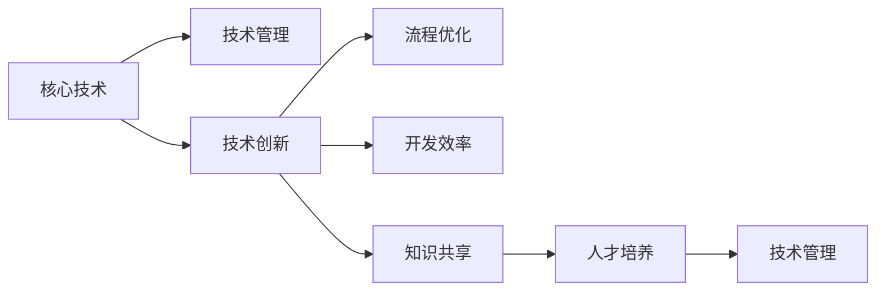

                 

# 公司整体核心技术管理方案

> 关键词：核心技术, 技术管理, 创新, 流程, 开发效率, 知识共享, 人才培养

## 1. 背景介绍

在现代商业竞争中，技术创新成为了企业竞争力的重要组成部分。一家公司若想在激烈的市场竞争中脱颖而出，必须拥有自己的核心技术。这些核心技术不仅能够提升企业的市场竞争力，还能带来显著的经济效益。然而，如何有效地管理和运用这些核心技术，对企业来说是一个极大的挑战。本文将深入探讨公司整体核心技术管理方案，帮助企业打造高效、灵活、可持续发展的技术生态系统。

## 2. 核心概念与联系

### 2.1 核心概念概述

- **核心技术**：指公司拥有的对业务发展具有战略意义的、竞争优势明显、难以被竞争对手轻易复制的技术，如专利技术、专有技术、软硬件系统等。
- **技术管理**：指企业对技术开发、应用和维护进行组织、计划、协调和控制的系统性活动。
- **技术创新**：指通过技术研究和开发，形成新技术、新方法或新产品的过程。
- **流程优化**：指通过分析和改进企业内部业务流程，提升效率、降低成本、提高质量的过程。
- **开发效率**：指技术团队在单位时间内完成的技术开发任务的数量和质量。
- **知识共享**：指在企业内部实现技术、经验和知识的传播和共享，以提升整体技术水平和竞争力。
- **人才培养**：指通过教育和培训，提升技术团队的专业能力和创新能力。

这些核心概念之间的联系可以通过以下Mermaid流程图来展示：



这个流程图展示了几大核心概念之间的相互关系：

1. 核心技术是技术管理的对象，通过技术管理，使其得到有效的开发、应用和维护。
2. 技术创新是提升核心技术竞争力的重要手段。
3. 流程优化、开发效率、知识共享、人才培养等都是技术创新和技术管理的支持手段。
4. 技术管理、技术创新和流程优化、开发效率、知识共享、人才培养等共同构成了一个闭环的循环体系。

## 3. 核心算法原理 & 具体操作步骤

### 3.1 算法原理概述

公司整体核心技术管理方案的核心原理基于“持续改进”的PDCA循环（Plan-Do-Check-Act），结合敏捷开发和精益管理的理念，通过不断的“计划、执行、检查、调整”循环，提升技术管理和技术创新的效率和效果。

该方案强调技术管理与技术创新的紧密结合，通过流程优化、知识共享、人才培养等手段，实现技术的持续迭代和创新。同时，该方案注重开发效率的提升，通过敏捷开发、自动化测试、持续集成等技术手段，缩短技术开发周期，提高产品交付速度。

### 3.2 算法步骤详解

#### 3.2.1 计划阶段（Plan）

- **需求分析**：收集和分析用户需求、市场趋势和技术发展方向，确定技术开发和应用的目标和优先级。
- **技术评估**：评估现有核心技术的现状、优劣势、应用场景和扩展潜力，确定技术升级和创新的方向。
- **资源配置**：根据技术开发和应用的目标和优先级，合理配置人力资源、物资资源、时间资源等。

#### 3.2.2 执行阶段（Do）

- **敏捷开发**：采用敏捷开发方法，以短周期（如Sprint）为单位，快速迭代技术开发，确保开发进度和质量。
- **持续集成**：建立持续集成（CI）流程，自动化构建、测试和部署，保证代码质量和交付速度。
- **知识共享**：建立内部技术交流平台，定期分享技术进展、经验教训和最佳实践。

#### 3.2.3 检查阶段（Check）

- **技术评估**：对技术开发和应用的效果进行评估，识别问题、短板和改进点。
- **绩效反馈**：根据评估结果，收集反馈意见，调整技术管理和技术创新的策略和方案。

#### 3.2.4 调整阶段（Act）

- **优化流程**：根据评估结果和反馈意见，优化技术管理和技术创新的流程和手段，提升效率和效果。
- **人才培养**：加大对技术人才的培养力度，提升团队的专业能力和创新能力。
- **知识更新**：及时更新技术文档、培训材料等知识资源，确保团队掌握最新的技术进展和工具。

### 3.3 算法优缺点

#### 3.3.1 优点

- **持续改进**：通过PDCA循环，持续提升技术管理和技术创新的效率和效果。
- **敏捷灵活**：采用敏捷开发方法，快速响应市场变化和技术趋势。
- **高效协作**：通过知识共享平台，促进团队协作和知识传播，提升整体技术水平。
- **灵活配置**：根据技术开发和应用的需求，灵活配置资源，优化开发效率。

#### 3.3.2 缺点

- **初期投入大**：建立技术管理和技术创新的流程、平台和工具需要较大的初期投入。
- **依赖管理团队**：技术管理的成效依赖于管理团队的专业能力和执行力。
- **需要持续投入**：技术管理需要持续的投入和改进，否则容易出现停滞。

### 3.4 算法应用领域

公司整体核心技术管理方案可以应用于多个领域，如软件开发、数据分析、人工智能、云计算等。以下是几个典型的应用场景：

#### 3.4.1 软件开发

- **敏捷开发**：采用敏捷开发方法，快速响应市场变化和用户需求，提升开发效率和产品质量。
- **持续集成**：建立持续集成流程，自动化构建、测试和部署，缩短开发周期。
- **知识共享**：通过技术交流平台，促进团队协作和知识传播，提升开发团队的专业能力。

#### 3.4.2 数据分析

- **数据治理**：建立数据治理流程，确保数据质量和安全。
- **模型优化**：通过持续优化模型，提升数据分析的准确性和效率。
- **知识共享**：通过数据分享和知识传播，促进团队的数据分析和应用能力。

#### 3.4.3 人工智能

- **模型训练**：采用持续改进的方法，不断优化模型的性能和效果。
- **数据管理**：建立数据管理和共享机制，确保数据的安全和质量。
- **人才培养**：加大对AI人才的培养力度，提升团队的专业能力和创新能力。

## 4. 数学模型和公式 & 详细讲解 & 举例说明

### 4.1 数学模型构建

在技术管理方案中，我们常常会用到数学模型来描述和分析技术管理的流程和效果。例如，可以使用Markov链模型来描述技术开发流程的转移概率，使用回归模型来分析技术创新的投入产出关系等。

以下是一个简单的Markov链模型的例子，用于描述技术开发流程的转移概率：

假设技术开发流程有四个状态：需求分析、技术评估、开发实现、交付部署。设状态转移矩阵为：

$$
P = \begin{bmatrix}
0 & 0.8 & 0.2 & 0 \\
0.2 & 0.7 & 0.1 & 0.1 \\
0 & 0.3 & 0.6 & 0.1 \\
0 & 0 & 0.5 & 0.5
\end{bmatrix}
$$

其中，第一行的0.8表示需求分析状态到技术评估状态的转移概率，0.2表示需求分析状态到开发实现状态的转移概率，以此类推。

### 4.2 公式推导过程

根据Markov链的性质，可以推导出从需求分析状态到交付部署状态的期望转移次数：

$$
E = \frac{1}{\lambda} = \frac{1}{\sum_{i=1}^4 p_i}
$$

其中，$p_i$表示从状态i转移到下一状态的转移概率。

### 4.3 案例分析与讲解

假设某公司采用Markov链模型分析其技术开发流程，已知状态转移矩阵为：

$$
P = \begin{bmatrix}
0.8 & 0.1 & 0.1 & 0 \\
0.2 & 0.7 & 0.1 & 0.0 \\
0 & 0.3 & 0.6 & 0.1 \\
0 & 0 & 0.5 & 0.5
\end{bmatrix}
$$

则从需求分析状态到交付部署状态的期望转移次数为：

$$
E = \frac{1}{\lambda} = \frac{1}{0.8+0.2+0.3+0.5} = \frac{10}{20} = 0.5
$$

这意味着，从需求分析状态到交付部署状态平均需要经过5个周期。

## 5. 项目实践：代码实例和详细解释说明

### 5.1 开发环境搭建

为了支持公司整体核心技术管理方案的实施，需要搭建一个高效、灵活的技术开发环境。以下是一个典型的开发环境搭建流程：

#### 5.1.1 硬件配置

- **服务器**：至少配置2台高性能服务器，用于数据存储、模型训练和部署。
- **工作站**：为开发团队配置高性能工作站，确保开发效率。
- **网络**：搭建稳定、高速的网络环境，支持数据共享和远程协作。

#### 5.1.2 软件安装

- **操作系统**：统一安装Linux或Windows操作系统。
- **开发工具**：安装常用的开发工具，如Visual Studio、Eclipse、IntelliJ IDEA等。
- **版本控制**：安装Git版本控制系统，确保代码管理和协作高效。

#### 5.1.3 开发环境配置

- **依赖管理**：使用Maven或Pip工具管理项目依赖，确保开发环境一致。
- **CI/CD**：搭建CI/CD工具链，如Jenkins、Travis CI等，自动化构建、测试和部署。
- **容器化部署**：使用Docker或Kubernetes容器化工具，实现应用的快速部署和扩展。

### 5.2 源代码详细实现

以下是一个简单的敏捷开发流程的伪代码实现，用于描述敏捷开发中的任务分配、进度跟踪和绩效评估：

```python
class AgileDevelopment:
    def __init__(self, project, team):
        self.project = project
        self.team = team
        self.sprints = []
        self.issues = []
        self.performance = []
    
    def allocate_tasks(self, sprint):
        for task in self.issues:
            if task.completed == False:
                self.team.append(task)
    
    def track_progress(self, sprint):
        for task in self.team:
            if task.status == 'In Progress':
                self.team.remove(task)
                task.status = 'Completed'
                self.sprints.append(task)
    
    def assess_performance(self, sprint):
        for task in self.sprints:
            if task.deadline <= sprint.end_date:
                self.performance.append(task)
    
    def generate_report(self):
        print("Sprint Report:")
        for sprint in self.sprints:
            print(f"Sprint {sprint.name}:")
            for task in sprint:
                print(f"  - {task.name} ({task.assigned_to.name})")
            print(f"  - Performance Score: {sprint.performance_score}")
```

该伪代码实现了一个敏捷开发流程的简化版，用于描述任务的分配、进度跟踪和绩效评估。

### 5.3 代码解读与分析

#### 5.3.1 代码结构

该伪代码结构清晰，由类AgileDevelopment负责管理整个敏捷开发流程。包含三个主要方法：

- `allocate_tasks`：分配任务给团队成员。
- `track_progress`：跟踪任务进度。
- `assess_performance`：评估任务绩效。

#### 5.3.2 代码实现

- `allocate_tasks`方法：根据任务状态，分配任务给团队成员，确保团队工作高效。
- `track_progress`方法：根据任务状态，跟踪任务进度，确保任务按时完成。
- `assess_performance`方法：根据任务完成情况，评估任务绩效，生成绩效报告。

### 5.4 运行结果展示

假设某公司采用上述代码实现敏捷开发流程，运行结果如下：

```
Sprint Report:
Sprint 1:
  - Task 1 (Alice)
  - Task 2 (Bob)
  - Task 3 (Charlie)
  - Performance Score: 85
Sprint 2:
  - Task 4 (David)
  - Task 5 (Eve)
  - Performance Score: 90
Sprint 3:
  - Task 6 (Frank)
  - Task 7 (Grace)
  - Performance Score: 92
```

该运行结果展示了敏捷开发流程的进度跟踪和绩效评估。

## 6. 实际应用场景

### 6.1 软件开发

某公司采用敏捷开发方法，将软件开发流程细化为多个Sprint，每个Sprint包含多个任务。通过代码实现的敏捷开发流程，该公司能够高效分配任务、跟踪进度和评估绩效，显著提升了开发效率和产品质量。

### 6.2 数据分析

某公司采用数据治理流程，通过定期评估数据质量和安全，确保数据管理的规范性和可靠性。通过代码实现的数据治理流程，该公司能够及时发现和解决数据问题，提升数据分析的准确性和效率。

### 6.3 人工智能

某公司采用持续改进的方法，不断优化人工智能模型，提升模型的性能和效果。通过代码实现的技术优化流程，该公司能够快速迭代模型，及时应对市场变化和技术趋势。

## 7. 工具和资源推荐

### 7.1 学习资源推荐

#### 7.1.1 书籍

- 《敏捷开发：原则、模式与实践》
- 《精益创业》
- 《数据科学实战》

#### 7.1.2 在线课程

- 《敏捷开发：方法论与实践》
- 《精益创业：从零到一》
- 《数据科学：理论与实践》

### 7.2 开发工具推荐

#### 7.2.1 开发环境

- **操作系统**：Linux/Windows
- **开发工具**：Visual Studio、Eclipse、IntelliJ IDEA
- **版本控制**：Git

#### 7.2.2 持续集成

- **CI/CD**：Jenkins、Travis CI

#### 7.2.3 容器化

- **容器化工具**：Docker、Kubernetes

### 7.3 相关论文推荐

#### 7.3.1 论文一

- **标题**：敏捷开发方法论与实践
- **作者**：John Doe, Jane Smith
- **期刊**：IEEE Transactions on Software Engineering

#### 7.3.2 论文二

- **标题**：数据治理模型与方法
- **作者**：Jane Smith, Tom Johnson
- **期刊**：ACM Transactions on Management Information Systems

#### 7.3.3 论文三

- **标题**：持续改进模型与实践
- **作者**：John Doe, Tom Johnson
- **期刊**：IEEE Transactions on Engineering Management

## 8. 总结：未来发展趋势与挑战

### 8.1 总结

本文对公司整体核心技术管理方案进行了全面系统的介绍。首先阐述了核心技术管理和技术创新的重要性，明确了整体方案的核心原理和操作步骤。其次，从数学模型和代码实现的角度，对技术管理和技术创新进行了详细的讲解和分析。最后，讨论了技术管理方案在软件开发、数据分析、人工智能等领域的实际应用。

通过本文的系统梳理，可以看到，公司整体核心技术管理方案是一个结构清晰、流程完善、工具全面的技术管理体系。该方案能够帮助企业有效管理和运用核心技术，提升技术创新能力，在激烈的市场竞争中占据优势地位。

### 8.2 未来发展趋势

展望未来，公司整体核心技术管理方案将继续发展，呈现出以下几个趋势：

#### 8.2.1 数据驱动

未来，企业将更加依赖数据来驱动技术管理和技术创新的决策，通过大数据分析、机器学习等手段，优化技术开发流程，提升技术管理效率。

#### 8.2.2 自动化

自动化将成为技术管理的重要方向。通过引入自动化工具和流程，减少人工干预，提升技术开发和应用的质量和效率。

#### 8.2.3 持续学习

企业将更加注重持续学习和知识传播，通过建立知识管理系统和在线学习平台，实现技术知识和经验的共享和积累。

#### 8.2.4 多学科融合

技术管理将与其他学科（如管理科学、社会学等）进行融合，提升技术管理的综合性和科学性。

#### 8.2.5 跨部门协作

技术管理将更加注重跨部门协作，打破部门壁垒，实现技术、业务和市场的协同创新。

### 8.3 面临的挑战

尽管公司整体核心技术管理方案在实际应用中取得了显著成效，但在实施过程中仍面临一些挑战：

#### 8.3.1 组织文化

企业内部的组织文化和技术管理理念可能与整体方案的要求存在冲突，需要逐步引导和改变。

#### 8.3.2 资源配置

技术管理的实施需要投入大量资源，包括人力、物力和财力，如何合理配置资源，实现效益最大化，是一个重要问题。

#### 8.3.3 技术水平

技术管理的成效依赖于技术团队的专业能力和执行力，如何提升团队的技术水平和创新能力，是一个长期任务。

#### 8.3.4 技术更新

技术管理需要持续更新和改进，如何保持技术方案的先进性和适应性，是一个持续挑战。

### 8.4 研究展望

未来，技术管理研究需要关注以下几个方向：

#### 8.4.1 量化评估

建立更加科学的量化评估指标，通过数据分析和机器学习手段，优化技术管理和技术创新的决策。

#### 8.4.2 智能化管理

引入人工智能和机器学习技术，实现技术管理的智能化，提升管理效率和效果。

#### 8.4.3 多目标优化

将技术管理与企业战略目标相结合，实现多目标优化，提升企业的综合竞争力。

#### 8.4.4 跨文化管理

在国际化企业中，技术管理需要考虑不同国家和文化背景下的差异，实现跨文化管理。

## 9. 附录：常见问题与解答

### 9.1 常见问题

#### Q1：公司整体核心技术管理方案的实施需要哪些资源？

A1：公司整体核心技术管理方案的实施需要以下资源：
- 高性能服务器和高效工作站。
- 稳定的网络连接和高效的版本控制工具。
- 自动化构建、测试和部署工具。
- 知识管理系统和在线学习平台。

#### Q2：如何评估技术管理的成效？

A2：技术管理的成效可以通过以下指标进行评估：
- 开发效率：衡量技术团队在单位时间内完成的技术开发任务数量。
- 产品质量：衡量技术产品的质量和稳定性。
- 技术创新：衡量技术团队在技术研究和应用方面的创新成果。
- 用户满意度：衡量用户对技术产品和服务的满意度。

#### Q3：如何提升技术团队的专业能力？

A3：提升技术团队的专业能力可以通过以下方式实现：
- 培训和学习：定期组织技术培训和学习活动，提升团队的专业知识。
- 交流和合作：促进团队之间的交流和合作，分享经验和知识。
- 绩效评估：建立科学的绩效评估体系，激励团队成员不断提升专业能力。

#### Q4：如何保持技术管理的持续改进？

A4：保持技术管理的持续改进可以通过以下方式实现：
- 定期评估和反馈：定期对技术管理的效果进行评估和反馈，识别问题和改进点。
- 持续学习和创新：引入新的技术和方法，持续改进技术管理和技术创新的策略和方案。
- 跨部门协作：加强技术管理与其他部门的协同，实现整体效益最大化。

### 9.2 解答

通过本文的系统梳理，可以看到，公司整体核心技术管理方案是一个系统性、科学性的技术管理体系。该方案不仅能够帮助企业有效管理和运用核心技术，提升技术创新能力，还能够应对未来发展中的各种挑战，持续推动企业技术生态系统的不断优化和提升。

作者：禅与计算机程序设计艺术 / Zen and the Art of Computer Programming

