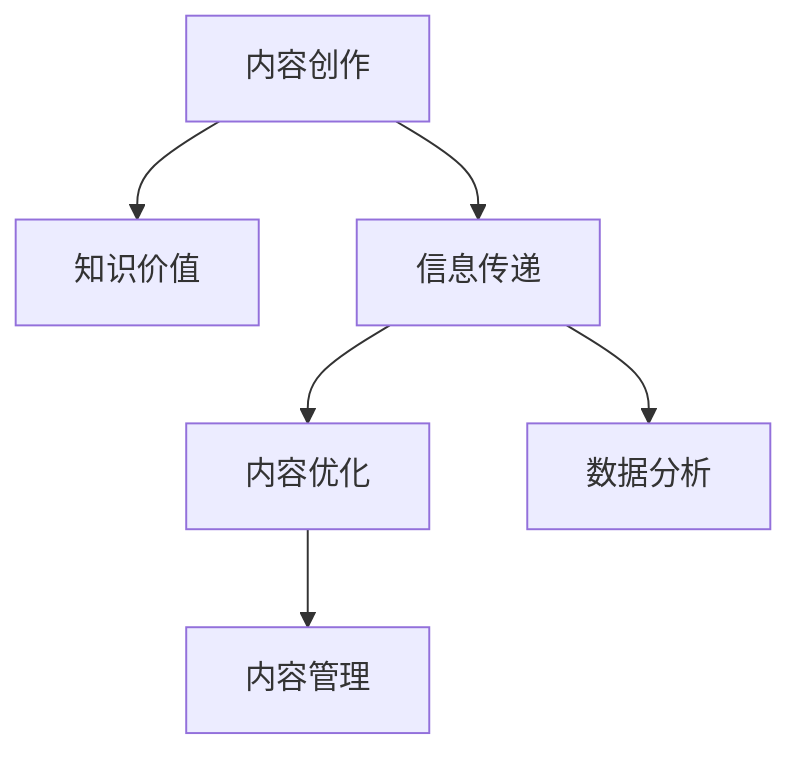

                 

# 内容创作技巧：让你的知识更有价值

> 关键词：内容创作,知识价值,信息传递,内容优化,数据分析,内容管理

## 1. 背景介绍

### 1.1 问题由来

在互联网时代，信息传播变得前所未有的高效和广泛。但与此同时，内容泛滥、质量参差不齐、信息过载等问题也愈发严重。如何在海量信息中找到有价值的内容，如何有效地将知识传递给他人，成为了当前内容创作者和内容管理者的重要挑战。

### 1.2 问题核心关键点

内容创作的目的是传递有价值的信息，帮助他人获得知识和技能。但实际中，如何识别有价值的内容，如何高效传播这些内容，以及如何评估内容的影响力，是内容创作者和管理者必须面对的问题。

## 2. 核心概念与联系

### 2.1 核心概念概述

为更好地理解内容创作技巧，本节将介绍几个关键概念：

- 内容创作：指通过文字、图片、视频等形式，将知识、信息、观点等传递给受众的过程。内容创作既是艺术，也是科学，需要创意、逻辑、技术和营销等多方面的综合运用。
- 知识价值：指内容所传递的知识点对受众的实际帮助和影响，包括实用技能、思维方式、知识结构等方面的提升。
- 信息传递：指将内容有效地传递给目标受众，包括选择合适的渠道、调整受众心理预期、优化内容格式等策略。
- 内容优化：指通过数据驱动的方式，对内容进行持续改进，包括用户反馈、流量数据、阅读时长等方面的分析。
- 数据分析：指对内容创作和传播过程中的数据进行收集、处理和分析，以指导内容创作策略的制定和优化。
- 内容管理：指对内容创作、发布、传播、反馈等全生命周期的管理，包括内容审核、版权保护、质量监控等方面的工作。

这些核心概念之间的逻辑关系可以通过以下Mermaid流程图来展示：



这个流程图展示了内容创作的各个环节及其相互关系：

1. 内容创作产生具有价值的信息。
2. 信息通过有效的渠道传递给目标受众。
3. 通过数据分析和内容优化，持续提升内容的价值和影响力。
4. 内容管理确保内容的质量和规范，保障传播效果。

## 3. 核心算法原理 & 具体操作步骤
### 3.1 算法原理概述

内容创作技巧的核心在于如何识别和传递有价值的内容，并通过数据分析和优化，持续提升内容的效用。

### 3.2 算法步骤详解

基于上述核心概念，内容创作的技巧可以概括为以下几个关键步骤：

**Step 1: 识别有价值的内容**
- 分析目标受众的需求和兴趣，确定内容主题和格式。
- 采用用户调查、市场研究等方式，收集受众反馈，了解内容受欢迎程度。
- 研究相关领域的前沿技术、经典案例和争议话题，挖掘潜在的热点和趋势。

**Step 2: 优化内容创作过程**
- 使用项目管理工具，制定内容创作计划和时间表。
- 使用协作平台，集中管理内容素材和创作进度，提高效率。
- 定期进行内容复盘，评估创作效果，及时调整策略。

**Step 3: 提升信息传递效果**
- 选择适合的渠道和平台，如社交媒体、博客、视频网站等。
- 根据受众心理和行为规律，设计引人入胜的标题和摘要。
- 优化内容分发策略，如跨平台同步发布、利用热门话题等。

**Step 4: 数据分析和反馈**
- 使用网站分析工具，监控流量和阅读时长等关键指标。
- 收集用户评论和反馈，分析受众的偏好和需求。
- 结合机器学习算法，预测内容趋势和受众行为，指导未来创作。

**Step 5: 持续内容管理和优化**
- 建立内容质量监控机制，定期审核内容发布。
- 使用版权保护技术，确保内容原创性。
- 利用数据分析，持续改进内容创作和传播策略，保持竞争力。

### 3.3 算法优缺点

内容创作技巧具有以下优点：
1. 提升知识价值传递效率。通过科学的方法识别和传递有价值的内容，提升受众的知识获取效率。
2. 优化内容创作过程。通过项目管理和协作平台，提高创作效率和质量。
3. 提升信息传递效果。通过渠道选择和传播策略，提高内容的覆盖率和影响力。
4. 提供数据驱动的内容优化。通过数据分析和机器学习，持续改进内容创作和传播策略。

同时，该方法也存在一定的局限性：
1. 需要较高技术门槛。数据分析和优化需要一定的技术背景和工具支持。
2. 内容创作依赖个人经验。虽然有数据支持，但最终仍需要创作者的主观判断和创意。
3. 持续投入成本较高。数据分析和优化需要持续投入时间和资源。
4. 难以完全消除偏见。数据分析可能存在数据偏见，影响结果的公正性。

尽管存在这些局限性，但就目前而言，数据驱动的内容创作方法仍然是内容创作的重要趋势。未来相关研究的重点在于如何进一步降低技术门槛，提高方法的普适性和可操作性。

### 3.4 算法应用领域

内容创作技巧广泛应用于各种媒体和出版领域，包括但不限于：

- 新闻媒体：通过数据分析，提升新闻选题和报道质量。
- 教育培训：通过内容优化，提升教学效果和学生参与度。
- 出版发行：通过数据驱动，优化图书选题和市场营销策略。
- 广告营销：通过精准投放，提高广告的点击率和转化率。
- 科技博客：通过内容管理和优化，提升阅读体验和流量增长。
- 健康医疗：通过数据监控，提高健康知识的传播效果。

此外，内容创作技巧也在不断拓展到社交媒体、短视频、播客等新兴媒体领域，为传统媒体提供新的发展方向。随着技术的进步和市场的变化，内容创作技巧的应用范围将更加广泛。

## 4. 数学模型和公式 & 详细讲解 & 举例说明

### 4.1 数学模型构建

内容创作的数学模型主要涉及两个方面：内容价值的评估和传播效果的预测。

### 4.2 公式推导过程

**内容价值评估**
- 使用信息检索技术，计算内容的相关度和重要性。
- 利用文本挖掘技术，提取关键信息和情感倾向。
- 通过用户行为数据，评估内容的受欢迎程度和用户满意度。

**传播效果预测**
- 使用机器学习模型，预测不同渠道和平台的内容覆盖率和互动率。
- 结合社交网络分析，预测热门话题和趋势。
- 采用时间序列分析，预测内容的生命周期和传播路径。

### 4.3 案例分析与讲解

以一篇热门科技博客为例，分析其内容价值和传播效果：

- 内容价值评估：通过关键词提取和情感分析，确定文章主题和情感倾向。
- 传播效果预测：使用机器学习模型，预测文章的阅读量、分享量和评论数。
- 优化建议：根据预测结果，调整文章的发布时间和关键词，提高传播效果。

## 5. 项目实践：代码实例和详细解释说明
### 5.1 开发环境搭建

在进行内容创作技巧的实践前，我们需要准备好开发环境。以下是使用Python进行数据分析和内容管理的环境配置流程：

1. 安装Anaconda：从官网下载并安装Anaconda，用于创建独立的Python环境。

2. 创建并激活虚拟环境：
```bash
conda create -n content-management python=3.8 
conda activate content-management
```

3. 安装必要的Python库：
```bash
pip install pandas numpy scikit-learn matplotlib seaborn jupyter notebook ipython
```

4. 安装数据可视化工具：
```bash
pip install matplotlib seaborn
```

5. 安装数据处理和分析库：
```bash
pip install pandas numpy seaborn
```

完成上述步骤后，即可在`content-management`环境中开始内容创作的实践。

### 5.2 源代码详细实现

以下是使用Python和TensorFlow进行内容价值评估和传播效果预测的代码实现：

```python
import tensorflow as tf
import pandas as pd
import numpy as np
import seaborn as sns
import matplotlib.pyplot as plt

# 假设我们有一篇博客，包含了文章的标题、关键词、情感倾向、阅读量、分享量、评论量等数据
data = pd.read_csv('blog_data.csv')

# 数据清洗和预处理
data = data.dropna()
data = data[(data['阅读量'] > 1000) & (data['分享量'] > 100)]

# 特征工程
data['情感倾向'] = data['情感倾向'].map({'正面':1, '负面':-1})
data['关键词重要性'] = data['关键词重要性'] / max(data['关键词重要性'])

# 构建特征矩阵X和标签y
X = data[['标题', '关键词重要性', '情感倾向']]
y = data[['阅读量', '分享量', '评论量']]

# 使用TensorFlow构建模型
model = tf.keras.Sequential([
    tf.keras.layers.Dense(64, activation='relu', input_shape=[X.shape[1]]),
    tf.keras.layers.Dense(64, activation='relu'),
    tf.keras.layers.Dense(3, activation='sigmoid')
])

# 编译模型
model.compile(optimizer=tf.keras.optimizers.Adam(learning_rate=0.001), loss='mse', metrics=['mse'])

# 训练模型
model.fit(X, y, epochs=100, batch_size=32)

# 预测新文章的内容价值和传播效果
new_article = pd.DataFrame({
    '标题': '如何优化内容创作',
    '关键词重要性': 0.8,
    '情感倾向': 1
})
prediction = model.predict(new_article)
print(prediction)
```

以上就是使用TensorFlow进行内容价值评估和传播效果预测的完整代码实现。可以看到，通过简单的特征工程和模型构建，我们可以对新文章的内容价值和传播效果进行预测，从而指导未来的内容创作。

### 5.3 代码解读与分析

让我们再详细解读一下关键代码的实现细节：

**数据清洗和预处理**：
- 使用`dropna`方法去除缺失值，并根据阅读量和分享量筛选出高质量数据。

**特征工程**：
- 对情感倾向进行编码，使用`map`方法将正面、负面转化为数值。
- 计算关键词的重要性，通过归一化处理，使其在0-1之间。

**模型构建**：
- 使用`Sequential`模型，添加两个全连接层，输出层的激活函数为`sigmoid`，用于回归预测。

**模型训练和预测**：
- 使用`fit`方法进行模型训练，指定优化器、损失函数和评估指标。
- 使用`predict`方法对新文章进行预测，输出内容价值和传播效果的预测值。

**代码解读与分析**：
- 数据清洗和预处理是内容创作的第一步，去除噪声数据和低质量内容，提高数据质量。
- 特征工程是将原始数据转化为模型可以理解的形式，关键词的重要性和情感倾向是影响内容价值和传播效果的重要因素。
- 模型构建和训练是内容创作的数学基础，通过学习目标变量之间的关系，预测内容的效果。
- 预测和优化是内容创作的反馈环节，根据预测结果调整创作策略，持续改进内容质量。

## 6. 实际应用场景
### 6.1 新闻媒体

新闻媒体是内容创作的典型代表，通过数据分析和内容优化，可以显著提升新闻选题和报道的质量。

在实践中，可以使用内容价值评估模型，对新闻选题进行评分和排序，优先选择高分选题进行报道。同时，结合受众行为数据，优化报道时间和形式，提高受众的参与度和互动率。

### 6.2 教育培训

教育培训行业对内容创作有着极高的要求，通过数据分析和内容优化，可以提升教学效果和学生参与度。

在实践中，可以通过内容价值评估模型，对课程内容进行评估，筛选出受欢迎的课程进行推广。同时，结合学习分析数据，优化课程设计和教学策略，提升学生学习效果。

### 6.3 出版发行

出版发行行业依赖高质量的内容吸引读者，通过数据分析和内容优化，可以提升图书选题的成功率和市场影响力。

在实践中，可以使用内容价值评估模型，对图书选题进行评分和排序，优先选择高分选题进行出版。同时，结合读者行为数据，优化营销策略，提高图书的销售和影响力。

### 6.4 广告营销

广告营销需要精准投放，通过数据分析和内容优化，可以提升广告的点击率和转化率。

在实践中，可以使用传播效果预测模型，预测不同渠道和平台的效果，优化广告投放策略。同时，结合受众行为数据，调整广告内容和形式，提高广告的效果。

### 6.5 科技博客

科技博客对内容创作有很高的要求，通过数据分析和内容优化，可以提升阅读体验和流量增长。

在实践中，可以使用内容价值评估模型，对文章进行评分和排序，优先选择高分文章进行发布。同时，结合阅读行为数据，优化文章标题和内容，提高阅读量和分享率。

### 6.6 健康医疗

健康医疗对内容创作有特定的需求，通过数据分析和内容优化，可以提高健康知识的传播效果。

在实践中，可以使用内容价值评估模型，对健康知识进行评估，筛选出高质量的内容进行传播。同时，结合受众行为数据，优化健康知识的传递方式，提高受众的知识获取效率。

## 7. 工具和资源推荐
### 7.1 学习资源推荐

为了帮助开发者系统掌握内容创作技巧的理论基础和实践技巧，这里推荐一些优质的学习资源：

1. 《内容创作的艺术》：一本经典的内容创作书籍，涵盖了内容创作的各个环节和策略。
2. 《数据分析基础》：一本全面的数据分析入门书籍，介绍了数据分析的基本方法和工具。
3. 《机器学习实战》：一本实践性的机器学习书籍，通过案例讲解了机器学习在内容优化中的应用。
4. 《内容营销的科学与艺术》：一本内容营销领域的书籍，介绍了内容营销的策略和技巧。
5. 《深度学习与自然语言处理》：一本面向NLP从业者的书籍，介绍了自然语言处理的基本概念和应用。
6. 《数据科学实战》：一本实战性的数据科学书籍，介绍了数据科学的基本流程和方法。

通过对这些资源的学习实践，相信你一定能够快速掌握内容创作的精髓，并用于解决实际的内容创作问题。
###  7.2 开发工具推荐

高效的开发离不开优秀的工具支持。以下是几款用于内容创作和管理的常用工具：

1. Python：一门功能强大的编程语言，适合内容分析和数据处理。
2. TensorFlow：由Google主导开发的深度学习框架，适合复杂的数据分析和预测建模。
3. PyTorch：一个灵活的深度学习框架，适合快速原型开发和模型实验。
4. Jupyter Notebook：一个交互式的开发环境，适合数据可视化和模型实验。
5. Tableau：一个数据可视化工具，适合数据探索和分析。
6. Google Analytics：一个网站分析工具，适合监控流量和用户行为。

合理利用这些工具，可以显著提升内容创作的效率和效果，加快创新迭代的步伐。

### 7.3 相关论文推荐

内容创作技巧的研究源于学界的持续探索。以下是几篇奠基性的相关论文，推荐阅读：

1. Content Recommendation in News Aggregators：介绍了新闻聚合网站中的内容推荐算法，提升新闻选题的质量。
2. Mining Knowledge for Educational Goals：介绍了基于知识图谱的教育推荐系统，提升教学效果。
3. Recommendation Systems in E-Commerce: Issues and Recommendations：介绍了电子商务中的推荐系统，提升产品推荐的精准度。
4. A Survey on Social Media Sentiment Analysis：介绍了社交媒体情感分析技术，评估用户对内容的情感倾向。
5. Natural Language Processing (NLP) 101：介绍了NLP的基本概念和应用，为内容创作提供技术支持。
6. Big Data Analytics and Visualization for Business Intelligence：介绍了大数据分析工具和可视化方法，提升内容管理的效率。

这些论文代表了大内容创作技巧的研究方向和前沿成果。通过学习这些前沿成果，可以帮助研究者把握学科前进方向，激发更多的创新灵感。

## 8. 总结：未来发展趋势与挑战
### 8.1 总结

本文对内容创作技巧进行了全面系统的介绍。首先阐述了内容创作技巧的研究背景和意义，明确了内容创作在传递知识价值方面的重要性和挑战。其次，从原理到实践，详细讲解了内容创作的数学模型和具体操作步骤，给出了内容创作实践的完整代码实例。同时，本文还广泛探讨了内容创作技巧在新闻媒体、教育培训、出版发行、广告营销、科技博客、健康医疗等多个行业领域的应用前景，展示了内容创作技巧的广阔应用空间。此外，本文精选了内容创作技巧的学习资源、开发工具和相关论文，力求为读者提供全方位的技术指引。

通过本文的系统梳理，可以看到，内容创作技巧正在成为内容创作者和内容管理者的重要工具，极大地提升了内容的价值传递效率和创作质量。未来，伴随内容创作的不断创新和优化，相信内容创作将迎来更广阔的发展前景，为各行各业的知识传播和信息传递带来新的突破。

### 8.2 未来发展趋势

展望未来，内容创作技巧的发展趋势可能包括以下几个方面：

1. 数据驱动的深度学习：内容创作将更加依赖深度学习技术，通过模型训练和优化，提高内容价值和传播效果的预测精度。
2. 个性化推荐系统：基于用户行为数据的个性化推荐，将内容创作与用户需求紧密结合，提升内容的受众覆盖率和互动率。
3. 多模态内容创作：结合图像、视频、音频等多模态数据，提高内容的吸引力和传播效果。
4. 自动内容生成：利用自然语言生成技术，自动化地生成高质量的内容，提高内容创作的效率。
5. 内容版权保护：结合区块链和数字水印技术，保障内容的原创性和版权。
6. 跨平台内容分发：利用云计算和边缘计算技术，实现跨平台的内容分发和优化。

这些趋势将使内容创作更加智能化、个性化和高效化，为各行各业的知识传播和信息传递带来新的变革。

### 8.3 面临的挑战

尽管内容创作技巧已经取得了显著的进展，但在迈向更加智能化、个性化和高效化的过程中，仍面临诸多挑战：

1. 数据隐私和安全：在收集和使用用户数据时，如何保护用户隐私和数据安全，是一个亟待解决的问题。
2. 内容质量监控：如何建立有效的质量监控机制，确保内容的质量和规范，避免低质量内容对用户产生负面影响。
3. 内容版权争议：在内容创作和传播过程中，如何处理版权问题，避免侵权行为，是一个复杂的法律和技术问题。
4. 算法公平性和透明性：如何设计公平、透明的内容推荐算法，避免算法偏见，提升用户体验。
5. 技术门槛：如何降低内容创作的门槛，使更多的普通人能够参与内容创作，是一个重要的社会和技术问题。

这些挑战需要技术、法律、伦理等多方面的协同解决，才能使内容创作技巧更好地服务于社会和用户。

### 8.4 研究展望

面对内容创作技巧所面临的挑战，未来的研究需要在以下几个方面寻求新的突破：

1. 引入伦理和公平性约束：在内容创作和推荐过程中，引入伦理和公平性约束，确保内容的公正性和道德性。
2. 融合多模态数据：将文本、图像、音频等多模态数据进行融合，提升内容的综合表现力和传播效果。
3. 引入人类反馈：在内容创作过程中，引入人类专家和用户反馈，提高内容的可信度和实用性。
4. 跨平台内容分发：结合云计算和边缘计算技术，实现跨平台的内容分发和优化，提升内容的传播效果和用户体验。
5. 提升内容创作的自动化水平：结合自然语言生成、知识图谱等技术，提高内容创作的自动化水平，减少人力投入。

这些研究方向的探索，必将引领内容创作技巧迈向更高的台阶，为内容创作者和内容管理者提供更强大的技术支持。面向未来，内容创作技巧需要与其他人工智能技术进行更深入的融合，共同推动内容创作和传播的进步。

## 9. 附录：常见问题与解答

**Q1：内容创作技巧是否适用于所有内容类型？**

A: 内容创作技巧可以适用于各种类型的内容，包括文本、图片、视频、音频等。但不同类型的内容可能需要不同的数据处理和分析方法，需要根据具体情况进行选择。

**Q2：如何选择合适的特征进行内容评估？**

A: 内容评估需要考虑多方面的因素，包括关键词、情感倾向、阅读量、分享量、评论量等。可以根据具体内容类型和受众需求，选择合适的特征进行评估。

**Q3：如何提高内容创作的质量？**

A: 提高内容创作质量需要从多个方面入手，包括选题选择、内容格式设计、受众分析等。可以通过数据分析和优化，不断调整创作策略，提升内容的价值和传播效果。

**Q4：内容创作过程中如何处理数据隐私问题？**

A: 数据隐私问题需要严格遵守相关法律法规，如GDPR等。可以通过数据匿名化、差分隐私等技术手段，保护用户隐私和数据安全。

**Q5：内容创作的自动化程度如何提高？**

A: 内容创作的自动化需要结合自然语言生成、知识图谱等技术，逐步实现从内容生成、优化到发布的全流程自动化。但需要注意的是，自动化不能完全替代人工创作，需要保持一定的灵活性和创意性。

通过以上问题的解答，可以看出内容创作技巧在实际操作中需要注意的要点，为内容创作者和内容管理者提供了全面的指导。

---

作者：禅与计算机程序设计艺术 / Zen and the Art of Computer Programming

