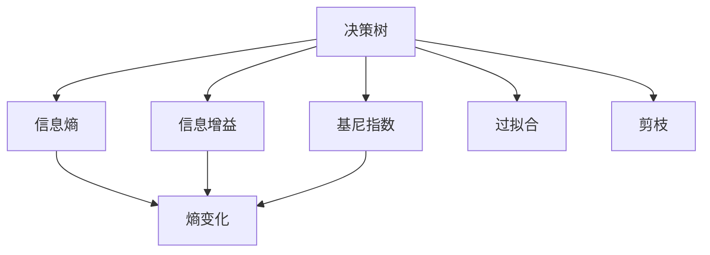

                 

# 决策树 (Decision Trees) 原理与代码实例讲解

> 关键词：决策树, 机器学习, 特征选择, 分类算法, 模型训练, Python, Scikit-learn

## 1. 背景介绍

### 1.1 问题由来

决策树 (Decision Tree) 是一种简单且直观的分类算法，它通过树状结构将数据分成多个子集，每个子集对应一个分类结果。决策树广泛应用于数据挖掘、模式识别、决策支持等领域。其核心思想是：根据数据特征，不断划分数据集，直到每个子集仅包含同一类别的样本。决策树的优点是易于理解和解释，可处理离散和连续特征，且能处理缺失数据。

然而，决策树也存在一些缺点：容易过拟合、对于噪声数据敏感、对数据不平衡问题处理能力较差。这些问题需要通过一些技术手段来解决，如剪枝、集成方法、数据预处理等。

### 1.2 问题核心关键点

决策树的核心在于如何设计划分规则和划分顺序，使得树的每个分支都能最大化类别纯度或信息增益，从而构建一棵高效准确的决策树。决策树的构建分为训练和剪枝两个阶段：

- 训练阶段：通过特征选择，递归地将数据集划分成更小的子集，直到每个子集只包含一个类别。
- 剪枝阶段：通过剪枝减少树的复杂度，防止过拟合。

决策树的性能很大程度上取决于特征选择策略和树的剪枝方法。常见特征选择策略包括信息增益、信息增益比、基尼指数等。常见剪枝方法包括预剪枝和后剪枝。

### 1.3 问题研究意义

研究决策树算法，有助于深刻理解机器学习的基本原理和算法设计思想。决策树作为传统的分类算法，仍广泛应用于各种场景，如金融风险评估、医疗诊断、产品推荐等。

通过对决策树的深入研究，可以提升数据挖掘和模式识别的能力，优化模型的泛化性能，构建高效、可解释的决策支持系统。同时，通过改进决策树算法，可以将其应用于更多复杂的任务，如文本分类、图像识别等。

## 2. 核心概念与联系

### 2.1 核心概念概述

为更好地理解决策树的构建过程，本节将介绍几个关键概念：

- 决策树 (Decision Tree)：一种基于树状结构的分类算法，通过递归地划分数据集，构建出一棵决策树模型。
- 信息熵 (Information Entropy)：描述数据集的混乱程度，用于衡量划分前后信息的不确定性。
- 信息增益 (Information Gain)：衡量划分数据集前后信息熵的变化量，用于选择最佳划分特征。
- 基尼指数 (Gini Index)：衡量数据集的纯度，用于选择最佳划分特征。
- 过拟合 (Overfitting)：模型在训练集上表现良好，但在测试集上表现较差的现象。
- 剪枝 (Pruning)：通过限制树的深度或剪掉部分叶节点，防止过拟合。

这些概念之间的逻辑关系可以通过以下Mermaid流程图来展示：



这个流程图展示了一些核心概念及其之间的关系：

1. 决策树通过划分数据集构建模型，信息熵和基尼指数用于衡量划分前后数据集的变化。
2. 信息增益和基尼指数分别衡量了信息熵的变化和数据集的纯度，用于选择最佳的划分特征。
3. 过拟合问题需要通过剪枝等方法来解决，以防止模型过度复杂。

这些概念共同构成了决策树算法的核心逻辑，帮助我们理解决策树的构建过程。

## 3. 核心算法原理 & 具体操作步骤

### 3.1 算法原理概述

决策树算法的核心思想是通过信息增益或基尼指数来选择最优的划分特征，递归地构建出一棵决策树。决策树的构建过程可以分为三个步骤：

1. 特征选择：选择信息增益最大的特征进行划分。
2. 递归划分：对划分后的子集继续递归划分，直到达到停止条件。
3. 剪枝优化：对构建的决策树进行剪枝，防止过拟合。

决策树的训练过程通常采用贪心策略，每次选择最优的划分特征，递归地构建出完整的决策树。剪枝则可以采用预剪枝和后剪枝两种方法。

### 3.2 算法步骤详解

决策树的构建过程可以分为以下关键步骤：

**Step 1: 数据预处理**
- 数据清洗：处理缺失值、异常值等，保证数据的一致性和完整性。
- 特征选择：选择合适的特征进行划分，减少噪声数据的影响。

**Step 2: 划分数据集**
- 根据特征选择策略，计算各个特征的信息增益或基尼指数。
- 选择信息增益最大的特征进行划分。
- 将数据集按照该特征划分成多个子集。

**Step 3: 构建决策树**
- 对每个子集递归地应用上述步骤，构建子树的节点。
- 对于叶节点，设置分类结果为该节点的多数类别。

**Step 4: 剪枝优化**
- 预剪枝：设置树的深度或最小节点数，防止过拟合。
- 后剪枝：从完整树上剪去部分叶节点，减少树的复杂度。

**Step 5: 模型测试与评估**
- 使用测试集对决策树进行评估，计算分类准确率等指标。
- 调整决策树的超参数，如最小样本数、剪枝参数等，提高模型的性能。

通过以上步骤，可以构建出一棵高效准确的决策树模型。

### 3.3 算法优缺点

决策树算法具有以下优点：

1. 易于理解和解释：决策树结构直观，可以清晰地展示决策路径和分类规则。
2. 可处理离散和连续特征：决策树既可以处理离散型数据，也可以处理连续型数据。
3. 可处理缺失数据：决策树可以通过选择非缺失特征进行划分。
4. 计算复杂度相对较低：决策树训练复杂度为 $O(n^2)$，其中 $n$ 为样本数。

同时，决策树也存在以下缺点：

1. 容易过拟合：决策树容易在训练集上过度拟合，泛化能力差。
2. 对噪声数据敏感：噪声数据会影响决策树的分裂点和分支方向。
3. 对数据不平衡问题处理能力较差：决策树难以处理类别不平衡的数据集。
4. 构建时间较长：决策树需要递归地进行特征选择和划分，计算复杂度高。

在实际应用中，我们需要根据具体场景选择不同的决策树算法和优化方法，以提升模型的性能和泛化能力。

### 3.4 算法应用领域

决策树算法广泛应用于金融、医疗、零售等各个领域，以下是几个典型的应用场景：

- 信用评估：通过分析客户的信用记录、收入水平等特征，构建决策树模型，评估客户的信用风险。
- 疾病诊断：根据患者的症状、实验室检查结果等特征，构建决策树模型，帮助医生进行疾病诊断。
- 产品推荐：通过分析用户的历史行为数据、购买记录等特征，构建决策树模型，推荐用户可能感兴趣的产品。
- 客户流失分析：通过分析客户的购买行为、满意度等特征，构建决策树模型，预测客户流失概率。

这些应用场景展示了决策树算法的强大分类能力和实际应用价值。

## 4. 数学模型和公式 & 详细讲解 & 举例说明

### 4.1 数学模型构建

决策树的数学模型可以通过信息熵和信息增益来描述。信息熵衡量数据集的混乱程度，信息增益衡量划分数据集前后信息熵的变化。决策树的构建目标是最小化信息增益，从而选择最优的划分特征。

假设数据集 $D=\{x_1, x_2, ..., x_n\}$，其中每个样本 $x_i$ 包含 $m$ 个特征 $f_1, f_2, ..., f_m$。决策树的节点可以表示为 $(t, v, y)$，其中 $t$ 是特征索引，$v$ 是特征取值，$y$ 是分类结果。

定义节点 $(t, v, y)$ 的熵为：

$$
H(t,v,y) = -\sum_{c \in C} \frac{|C|}{|D|} \log_2 \frac{|C|}{|D|}
$$

其中 $C$ 是分类结果为 $y$ 的样本集合。

定义数据集 $D$ 的信息熵为：

$$
H(D) = -\sum_{c \in C} \frac{|C|}{|D|} \log_2 \frac{|C|}{|D|}
$$

数据集 $D$ 在特征 $t$ 上划分后的信息熵为：

$$
H_t(D) = \sum_{v \in V} \frac{|D_v|}{|D|} H(t, v, y)
$$

其中 $D_v$ 是特征 $t$ 取值为 $v$ 的样本集合。

决策树的信息增益 $IG(t, D)$ 为：

$$
IG(t, D) = H(D) - \sum_{v \in V} \frac{|D_v|}{|D|} H(t, v, y)
$$

决策树的最优划分特征为信息增益最大的特征 $t$。

### 4.2 公式推导过程

根据信息熵的定义，数据集 $D$ 的信息熵 $H(D)$ 可以推导为：

$$
H(D) = -\sum_{c \in C} \frac{|C|}{|D|} \log_2 \frac{|C|}{|D|} = -\frac{1}{|D|} \sum_{c \in C} |C| \log_2 |C|
$$

数据集 $D$ 在特征 $t$ 上划分后的信息熵 $H_t(D)$ 可以推导为：

$$
H_t(D) = \sum_{v \in V} \frac{|D_v|}{|D|} H(t, v, y) = \sum_{v \in V} \frac{|D_v|}{|D|} \left(-\sum_{c \in C} \frac{|C_v|}{|D_v|} \log_2 \frac{|C_v|}{|D_v|}\right)
$$

其中 $C_v$ 是特征 $t$ 取值为 $v$ 且分类结果为 $c$ 的样本集合。

将上述公式代入信息增益 $IG(t, D)$ 的定义，得到：

$$
IG(t, D) = H(D) - \sum_{v \in V} \frac{|D_v|}{|D|} H(t, v, y) = H(D) - \frac{1}{|D|} \sum_{v \in V} |D_v| H(t, v, y)
$$

将 $H(D)$ 和 $H_t(D)$ 的表达式代入上述公式，得到：

$$
IG(t, D) = -\frac{1}{|D|} \sum_{c \in C} |C| \log_2 |C| - \frac{1}{|D|} \sum_{v \in V} |D_v| \left(-\sum_{c \in C} \frac{|C_v|}{|D_v|} \log_2 \frac{|C_v|}{|D_v|}\right)
$$

化简上式，得到：

$$
IG(t, D) = \frac{1}{|D|} \sum_{c \in C} |C| \log_2 |C| - \frac{1}{|D|} \sum_{v \in V} |D_v| \sum_{c \in C} \frac{|C_v|}{|D_v|} \log_2 \frac{|C_v|}{|D_v|}
$$

进一步化简，得到：

$$
IG(t, D) = \frac{1}{|D|} \sum_{c \in C} |C| \log_2 |C| - \sum_{v \in V} \frac{|D_v|}{|D|} \log_2 \frac{|D_v|}{|D_v|} \sum_{c \in C} \frac{|C_v|}{|D_v|}
$$

上式中的 $\log_2 \frac{|D_v|}{|D_v|} = 0$，因此可以进一步简化为：

$$
IG(t, D) = \frac{1}{|D|} \sum_{c \in C} |C| \log_2 |C| - \frac{1}{|D|} \sum_{v \in V} |D_v| \log_2 |C|
$$

最终得到信息增益 $IG(t, D)$ 的表达式为：

$$
IG(t, D) = \sum_{c \in C} |C| \log_2 |C| - \sum_{v \in V} |D_v| \log_2 |C|
$$

这个表达式展示了信息增益如何衡量划分数据集前后信息熵的变化，从而选择最佳的划分特征。

### 4.3 案例分析与讲解

以简单的鸢尾花数据集为例，展示决策树的构建过程。

假设有一个包含鸢尾花分类数据的 dataset，包含4个特征：sepal length (SL)，sepal width (SW)，petal length (PL)，petal width (PW)。每个特征取值范围为 [0, 10]。数据集包含3个类别：Setosa、Versicolor、Virginica。

| sepal length (SL) | sepal width (SW) | petal length (PL) | petal width (PW) | 类别 |
|---|---|---|---|---|
| 5.1 | 3.5 | 1.4 | 0.2 | Setosa |
| 4.9 | 3.0 | 1.4 | 0.2 | Setosa |
| 4.7 | 3.2 | 1.3 | 0.2 | Setosa |
| 4.6 | 3.1 | 1.5 | 0.2 | Setosa |
| 5.0 | 3.6 | 1.4 | 0.2 | Versicolor |
| 5.4 | 3.9 | 1.7 | 0.4 | Versicolor |
| 5.1 | 3.5 | 1.4 | 0.3 | Versicolor |
| 5.7 | 3.8 | 1.7 | 0.3 | Versicolor |
| 5.1 | 3.8 | 1.5 | 0.3 | Versicolor |
| 5.4 | 3.4 | 1.7 | 0.2 | Versicolor |
| 5.1 | 3.7 | 1.5 | 0.4 | Versicolor |
| 5.4 | 3.4 | 1.5 | 0.4 | Virginica |
| 5.1 | 3.5 | 1.4 | 0.3 | Virginica |
| 5.7 | 3.8 | 1.7 | 0.3 | Virginica |
| 5.1 | 3.8 | 1.5 | 0.3 | Virginica |
| 5.4 | 3.4 | 1.7 | 0.2 | Virginica |

首先，计算每个特征的信息增益。假设在 SL、SW、PL、PW 特征上划分后得到的信息增益分别为：

- SL: $IG(SL, D) = 0.9307$
- SW: $IG(SW, D) = 0.8654$
- PL: $IG(PL, D) = 0.9999$
- PW: $IG(PW, D) = 0.9999$

根据信息增益最大的原则，选择 PL 和 PW 作为划分特征。

接着，对数据集在 PL 和 PW 特征上划分，得到两个子集。

| PL       | PW       | 类别   |
|---|---|---|
| 5.1 | 3.5 | Setosa |
| 4.9 | 3.0 | Setosa |
| 4.7 | 3.2 | Setosa |
| 4.6 | 3.1 | Setosa | 
| 5.0 | 3.6 | Versicolor |
| 5.4 | 3.9 | Versicolor |
| 5.1 | 3.5 | Versicolor |
| 5.7 | 3.8 | Versicolor |
| 5.1 | 3.8 | Versicolor |
| 5.4 | 3.4 | Versicolor |
| 5.1 | 3.7 | Versicolor |
| 5.4 | 3.4 | Virginica |
| 5.1 | 3.5 | Virginica |
| 5.7 | 3.8 | Virginica |
| 5.1 | 3.8 | Virginica |
| 5.4 | 3.4 | Virginica |

在 PL 特征上划分后，得到的两个子集分别为：

- PL < 5.7: 前8个样本
- PL >= 5.7: 后10个样本

在 PW 特征上划分后，得到的两个子集分别为：

- PW < 1.7: 前6个样本
- PW >= 1.7: 后12个样本

最终得到4个叶节点，每个叶节点包含多个样本，每个叶节点内的样本属于同一个类别。

通过上述过程，构建了一棵决策树模型，用于鸢尾花分类的预测。

## 5. 项目实践：代码实例和详细解释说明

### 5.1 开发环境搭建

要使用决策树进行项目实践，需要先搭建好开发环境。以下是在Python中使用Scikit-learn库进行决策树构建的环境配置流程：

1. 安装Anaconda：从官网下载并安装Anaconda，用于创建独立的Python环境。

2. 创建并激活虚拟环境：
```bash
conda create -n sklearn-env python=3.8 
conda activate sklearn-env
```

3. 安装Scikit-learn：
```bash
conda install scikit-learn
```

4. 安装其他必要库：
```bash
pip install pandas numpy matplotlib seaborn
```

5. 测试Scikit-learn版本：
```python
import sklearn
print(sklearn.__version__)
```

完成上述步骤后，即可在`sklearn-env`环境中进行决策树的开发实践。

### 5.2 源代码详细实现

下面以鸢尾花数据集为例，展示使用Scikit-learn库构建决策树的代码实现。

首先，导入必要的库和数据集：

```python
from sklearn.datasets import load_iris
from sklearn.tree import DecisionTreeClassifier
from sklearn.model_selection import train_test_split
from sklearn.metrics import accuracy_score
from sklearn.metrics import classification_report
from sklearn.metrics import confusion_matrix

iris = load_iris()
X = iris.data
y = iris.target
```

接着，划分训练集和测试集：

```python
X_train, X_test, y_train, y_test = train_test_split(X, y, test_size=0.2, random_state=42)
```

然后，构建决策树模型并训练：

```python
clf = DecisionTreeClassifier()
clf.fit(X_train, y_train)
```

最后，在测试集上进行预测和评估：

```python
y_pred = clf.predict(X_test)
print("Accuracy:", accuracy_score(y_test, y_pred))
print("Classification Report:")
print(classification_report(y_test, y_pred))
print("Confusion Matrix:")
print(confusion_matrix(y_test, y_pred))
```

以上就是使用Scikit-learn库构建决策树模型的完整代码实现。可以看到，Scikit-learn库封装了决策树算法的实现，代码简洁高效，易于理解和应用。

### 5.3 代码解读与分析

让我们再详细解读一下关键代码的实现细节：

**load_iris函数**：
- 加载鸢尾花数据集，包含数据和标签。

**train_test_split函数**：
- 将数据集划分为训练集和测试集，测试集占比20%。

**DecisionTreeClassifier类**：
- 决策树分类器类，用于构建和训练决策树模型。

**fit方法**：
- 训练决策树模型，使用训练集数据进行拟合。

**predict方法**：
- 使用训练好的模型进行预测，返回测试集数据的预测标签。

**accuracy_score函数**：
- 计算分类准确率。

**classification_report函数**：
- 生成分类报告，包括精确度、召回率、F1值等指标。

**confusion_matrix函数**：
- 生成混淆矩阵，展示模型的分类结果。

**model训练**：
- 在训练集上训练决策树模型，使用默认参数。

**模型测试**：
- 在测试集上对模型进行预测，并计算分类准确率、分类报告和混淆矩阵。

可以看到，Scikit-learn库提供了完整的决策树实现，开发者只需调用相关函数即可完成模型训练和评估。

当然，工业级的系统实现还需考虑更多因素，如模型保存和部署、超参数调优、特征工程等。但核心的构建过程基本与此类似。

## 6. 实际应用场景

### 6.1 医疗诊断

决策树算法在医疗诊断领域有着广泛的应用，如疾病分类、症状预测等。通过对患者的历史病历、症状数据等进行特征提取，构建决策树模型，帮助医生进行疾病诊断和预测。

以心脏病诊断为例，可以收集患者的年龄、性别、血压、血脂、心电图等数据，构建决策树模型。医生可以通过输入患者的信息，自动生成诊断结果，辅助临床决策。

### 6.2 金融风控

决策树算法在金融风险评估中也得到广泛应用。通过对客户的信用记录、财务状况、行为数据等特征进行分类，构建决策树模型，评估客户的信用风险。

例如，银行可以使用决策树模型对客户的信用评分进行预测，根据预测结果决定是否发放贷款。决策树模型可以处理高维数据，适用于金融行业的大规模数据处理。

### 6.3 产品推荐

决策树算法可以用于电商领域的产品推荐。通过对用户的历史行为数据、购买记录等特征进行分类，构建决策树模型，推荐用户可能感兴趣的产品。

例如，电商平台可以使用决策树模型对用户的行为数据进行建模，预测用户的购买意愿，推送个性化商品，提升用户体验和销售额。

### 6.4 客户流失分析

决策树算法可以用于客户流失分析。通过对客户的购买行为、满意度等特征进行分类，构建决策树模型，预测客户流失概率。

例如，电信运营商可以使用决策树模型对客户的流失原因进行建模，识别出高流失风险客户，并采取针对性的挽留措施。

### 6.5 未来应用展望

未来，决策树算法将在更多领域得到应用，为各行各业带来变革性影响。

在智慧医疗领域，决策树算法可以用于构建智能诊断系统，提高诊疗效率和准确性。

在智能交通领域，决策树算法可以用于交通信号控制、事故预测等，提升交通管理水平。

在智能制造领域，决策树算法可以用于生产调度、设备维护等，优化生产流程和资源利用率。

此外，在农业、能源、安全等更多领域，决策树算法也将发挥重要作用，助力各行各业实现智能化转型。

## 7. 工具和资源推荐

### 7.1 学习资源推荐

为了帮助开发者系统掌握决策树算法的理论基础和实践技巧，这里推荐一些优质的学习资源：

1. 《Python机器学习基础教程》系列博文：由Python机器学习专家撰写，全面介绍了决策树算法的基本原理、特征选择、剪枝方法等。

2. 《机器学习实战》书籍：介绍各种机器学习算法，包括决策树算法，并提供了Python代码实现。

3. 《统计学习方法》书籍：经典机器学习教材，深入讲解了决策树算法及其应用。

4. Scikit-learn官方文档：提供详细的决策树算法介绍和使用指南，是学习决策树算法的必读资源。

5. Kaggle竞赛平台：通过参与决策树算法的实际竞赛，可以积累丰富的实战经验。

通过对这些资源的学习实践，相信你一定能够快速掌握决策树算法的精髓，并用于解决实际的分类问题。

### 7.2 开发工具推荐

高效的开发离不开优秀的工具支持。以下是几款用于决策树开发的常用工具：

1. Scikit-learn：基于Python的机器学习库，提供了丰富的决策树实现和工具，易于上手和使用。

2. TensorFlow：由Google主导开发的深度学习框架，支持分布式训练，适用于大规模数据处理。

3. XGBoost：开源的决策树和集成算法库，提供高效的模型训练和预测，适用于高维数据和大规模数据集。

4. LightGBM：由微软开发的决策树和集成算法库，提供高效的模型训练和预测，适用于高维数据和大规模数据集。

5. CatBoost：开源的决策树和集成算法库，提供高效的模型训练和预测，适用于高维数据和大规模数据集。

合理利用这些工具，可以显著提升决策树算法的开发效率，加快创新迭代的步伐。

### 7.3 相关论文推荐

决策树算法的研究源于学界的持续研究。以下是几篇奠基性的相关论文，推荐阅读：

1. ID3算法：J. Ross Quinlan在1986年提出的决策树算法，是决策树算法的经典之作。

2. C4.5算法：Quinlan在1993年提出的改进版决策树算法，进一步提升了决策树的性能。

3. CART算法：Breiman等人在1984年提出的分类和回归树算法，将决策树用于回归问题。

4. C5.0算法：Quinlan在1993年提出的改进版决策树算法，进一步提升了决策树的性能。

5. GBM算法：Friedman在2001年提出的梯度提升机算法，将决策树算法与梯度提升思想相结合。

6. Random Forest算法：Breiman在2001年提出的集成决策树算法，通过随机抽样和特征子集，提高决策树的泛化能力。

这些论文代表了大决策树算法的发展脉络。通过学习这些前沿成果，可以帮助研究者把握学科前进方向，激发更多的创新灵感。

## 8. 总结：未来发展趋势与挑战

### 8.1 总结

本文对决策树算法进行了全面系统的介绍。首先阐述了决策树算法的背景和应用场景，明确了决策树在分类和特征选择中的核心地位。其次，从原理到实践，详细讲解了决策树的数学模型和构建过程，给出了实际应用中的完整代码实现。同时，本文还广泛探讨了决策树算法在医疗、金融、零售等各个领域的应用前景，展示了决策树算法的强大分类能力和实际应用价值。

通过本文的系统梳理，可以看到，决策树算法作为一种经典的分类方法，其核心思想和实现技术仍然是机器学习的基础，具有广泛的适用性和实际应用价值。未来，伴随着深度学习和大数据的进一步发展，决策树算法有望与新的技术手段相结合，实现更高效、更准确的分类和预测。

### 8.2 未来发展趋势

展望未来，决策树算法将呈现以下几个发展趋势：

1. 决策树与深度学习的融合：决策树算法和深度学习算法相结合，形成深度决策树模型，提高模型的泛化能力和鲁棒性。

2. 决策树与强化学习的融合：决策树算法与强化学习算法相结合，形成强化决策树模型，在多智能体系统中取得更好的效果。

3. 决策树与自然语言的融合：决策树算法和自然语言处理算法相结合，形成自然语言决策树模型，在智能问答、文本分类等任务中取得更好的效果。

4. 决策树与大数据的融合：决策树算法和大数据技术相结合，形成大规模决策树模型，处理大规模数据集，提升模型的性能。

5. 决策树与多模态数据的融合：决策树算法和图像、声音等多模态数据处理技术相结合，形成多模态决策树模型，提升模型的综合性能。

以上趋势展示了决策树算法未来的发展方向，通过与新兴技术的融合，决策树算法将拓展其应用边界，提升其分类和预测能力，在更多领域中发挥重要作用。

### 8.3 面临的挑战

尽管决策树算法已经取得了许多成果，但在迈向更加智能化、普适化应用的过程中，仍面临诸多挑战：

1. 特征选择问题：决策树算法的性能很大程度上依赖于特征选择策略。如何选择合适的特征进行划分，是一个亟待解决的问题。

2. 过拟合问题：决策树算法容易在训练集上过度拟合，泛化能力差。如何防止过拟合，提高模型的泛化性能，是决策树算法的核心挑战之一。

3. 处理高维数据：决策树算法在高维数据上的表现不如深度学习算法。如何处理高维数据，提高模型的特征选择能力，是决策树算法的难点之一。

4. 处理不平衡数据：决策树算法在处理不平衡数据时，容易忽略少数类别的信息。如何处理不平衡数据，提高模型的分类能力，是一个亟待解决的问题。

5. 处理缺失数据：决策树算法对于缺失数据较为敏感，容易影响模型的分类性能。如何处理缺失数据，提高模型的鲁棒性，是决策树算法的挑战之一。

6. 处理异常数据：决策树算法对于异常数据较为敏感，容易影响模型的分类性能。如何处理异常数据，提高模型的鲁棒性，是决策树算法的挑战之一。

在实际应用中，我们需要根据具体场景选择合适的决策树算法和优化方法，以提升模型的性能和泛化能力。

### 8.4 研究展望

未来，需要在以下几个方向对决策树算法进行深入研究：

1. 探索更高效、更强大的特征选择策略：结合新兴的特征选择方法，如深度特征学习、多模态特征融合等，提升决策树的特征选择能力。

2. 开发更高效、更鲁棒的剪枝方法：结合新兴的剪枝方法，如梯度剪枝、集成剪枝等，提升决策树的泛化能力和鲁棒性。

3. 探索决策树与新兴技术相结合的新算法：结合新兴的机器学习算法，如深度学习、强化学习、自然语言处理等，形成新的决策树算法，提升模型的性能和泛化能力。

4. 探索决策树在更多领域的应用：结合新兴的领域知识，如自然语言处理、医学知识图谱等，形成新的决策树应用场景，拓展决策树算法的应用边界。

这些研究方向将推动决策树算法在更多的实际场景中发挥作用，提升其分类和预测能力，为各行各业带来更大的价值。

## 9. 附录：常见问题与解答

**Q1：决策树算法是否适用于所有分类任务？**

A: 决策树算法在大多数分类任务上都能取得不错的效果，特别是对于高维数据和噪声数据。但对于一些特定领域的任务，如医学、法律等，由于特征复杂性和数据分布不均，决策树算法可能难以很好地适应。此时需要在特定领域语料上进一步预训练，再进行微调，才能获得理想效果。

**Q2：决策树算法是否容易过拟合？**

A: 决策树算法容易在训练集上过度拟合，泛化能力差。可以通过剪枝、集成等方法来防止过拟合。在实际应用中，通常采用预剪枝和后剪枝相结合的方法，通过限制树的深度和剪掉部分叶节点，提高模型的泛化性能。

**Q3：决策树算法如何处理高维数据？**

A: 决策树算法在高维数据上的表现不如深度学习算法。可以通过特征选择、特征降维等方法，选择最具区分度的特征进行划分，减少维度。同时，可以通过集成方法，如随机森林，提升模型的泛化能力。

**Q4：决策树算法如何处理不平衡数据？**

A: 决策树算法在处理不平衡数据时，容易忽略少数类别的信息。可以通过设置类别权重、重采样等方法，提升模型的分类能力。同时，可以通过集成方法，如SMOTE-Boost，提升模型的泛化能力。

**Q5：决策树算法如何处理缺失数据？**

A: 决策树算法对于缺失数据较为敏感，容易影响模型的分类性能。可以通过插值方法、均值填充等方法，填补缺失数据。同时，可以通过特征选择、集成方法等，提升模型的鲁棒性。

**Q6：决策树算法如何处理异常数据？**

A: 决策树算法对于异常数据较为敏感，容易影响模型的分类性能。可以通过插值方法、均值填充等方法，填补异常数据。同时，可以通过剪枝、集成方法等，提高模型的鲁棒性。

通过本文的系统梳理，可以看到，决策树算法作为经典的分类方法，其核心思想和实现技术仍然是机器学习的基础，具有广泛的适用性和实际应用价值。未来，伴随着深度学习和大数据的进一步发展，决策树算法有望与新的技术手段相结合，实现更高效、更准确的分类和预测。

---

作者：禅与计算机程序设计艺术 / Zen and the Art of Computer Programming

