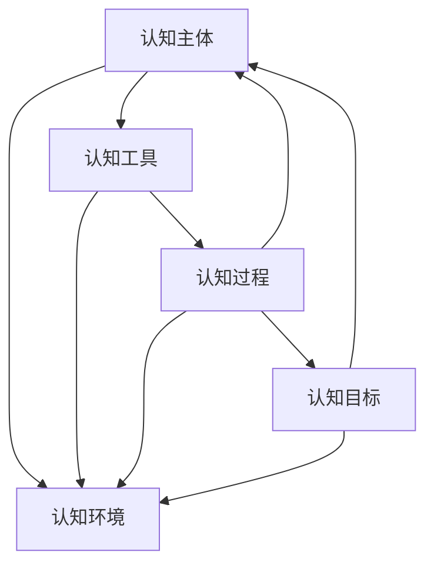

                 

## 1. 背景介绍

### 1.1 问题由来

随着数字化和网络化的深入发展，现代社会的生产方式、社交方式、决策方式都在发生根本性变革。在这样一个高度互联互通的时代，个体不再孤立地存在，而是融入到由人和机器组成的复杂网络中。分布式认知（Distributed Cognition）作为新兴的研究领域，旨在探索在这个高度互连的网络中，个体如何与群体协同工作，共同处理复杂的认知任务。

### 1.2 问题核心关键点

分布式认知研究的核心问题在于如何构建一个高度协同、高效、智能的群体智慧系统。这一问题可以分为以下三个层面：

1. **数据共享与协同**：如何在分布式环境中高效共享数据，使得不同个体能够协同处理复杂任务。
2. **知识整合与融合**：如何整合和融合来自不同个体的知识和信息，形成更为全面、准确的群体智慧。
3. **智能决策与优化**：如何利用群体智慧进行智能决策和任务优化，提升群体工作的效率和效果。

分布式认知旨在通过多层次、多维度的研究，揭示群体智慧的形成机理和优化策略，从而为构建智能社会提供科学依据和技术支持。

## 2. 核心概念与联系

### 2.1 核心概念概述

分布式认知（Distributed Cognition）是一个多学科交叉的研究领域，涉及认知科学、计算机科学、社会心理学、神经科学等多个学科。其核心概念包括：

- **认知主体**：个体或团队，负责处理特定认知任务。
- **认知工具**：用于支持认知任务的技术工具和系统，如数据库、算法、通信协议等。
- **认知环境**：分布式环境，个体间通过交互共享知识和信息。
- **认知过程**：个体间的信息交换、知识整合、任务分配等过程。
- **认知目标**：个体或团队共同达成的认知任务目标。

这些概念通过一系列复杂交互过程，共同构成了一个分布式认知系统。理解这些概念及其交互方式，对于构建有效的分布式认知系统至关重要。

### 2.2 核心概念原理和架构的 Mermaid 流程图



这个流程图展示了认知主体、认知工具、认知环境、认知过程和认知目标之间的联系。认知主体通过使用认知工具，在认知环境中与其它主体进行交互，共同完成认知过程，最终实现认知目标。

## 3. 核心算法原理 & 具体操作步骤

### 3.1 算法原理概述

分布式认知的核心算法原理基于协同计算和分布式算法，旨在实现个体间的协作与信息共享。核心算法包括：

- **通信协议**：定义个体间数据交换的规则，确保数据传输的效率和准确性。
- **共识算法**：解决分布式环境中的一致性问题，如Paxos、Raft等。
- **协同优化算法**：优化个体间协同工作的过程，如多智能体系统（MAS）中的协同优化算法。

这些算法共同构成了一个分布式认知系统的基本框架，为群体智慧的形成和优化提供了技术支撑。

### 3.2 算法步骤详解

分布式认知的算法步骤主要包括：

1. **数据收集与共享**：
   - 个体通过传感器、网络等手段收集相关数据。
   - 数据通过通信协议传输到其他个体和中央节点。

2. **信息整合与融合**：
   - 数据到达接收端后，通过数据清洗、特征提取等步骤进行处理。
   - 数据整合和融合使用机器学习、深度学习等技术，形成高层次的群体知识表示。

3. **任务分配与协同**：
   - 根据任务目标，分配任务到各个认知主体。
   - 各主体协同工作，通过交互更新状态，共同完成任务。

4. **结果评估与优化**：
   - 使用性能评估指标，如准确率、召回率、F1值等，对群体智慧的输出进行评估。
   - 根据评估结果，调整算法参数或重新分配任务，优化群体智慧的表现。

### 3.3 算法优缺点

分布式认知算法的主要优点包括：

- **高效性**：通过多主体协同工作，可以在短时间内处理大规模、复杂的数据和任务。
- **灵活性**：个体可以动态地加入或退出系统，适应不同场景下的需求变化。
- **鲁棒性**：在个体出现故障或异常时，系统可以自动调整，保证整体运行的稳定性。

其主要缺点包括：

- **复杂性**：分布式认知系统设计复杂，需要考虑个体间的交互、数据共享、任务分配等多个因素。
- **通信开销**：数据传输和信息交换会产生一定通信开销，可能会影响系统效率。
- **安全风险**：在分布式环境中，数据安全和隐私保护成为重要问题。

### 3.4 算法应用领域

分布式认知算法广泛应用于以下领域：

- **智能制造**：通过分布式认知系统，优化生产流程，提高生产效率和质量。
- **智能交通**：利用分布式认知系统，优化交通流量，减少拥堵和事故。
- **智慧医疗**：通过分布式认知系统，整合医疗资源，提供更精准的诊断和治疗方案。
- **智能电网**：利用分布式认知系统，优化电力分配，提高能源利用效率。
- **智能安防**：通过分布式认知系统，实时监测和分析安全数据，提升安防水平。

## 4. 数学模型和公式 & 详细讲解 & 举例说明

### 4.1 数学模型构建

分布式认知系统的数学模型通常基于多智能体系统（Multi-Agent Systems, MAS）构建，以下为一个基本的多智能体系统模型：

$$
\begin{aligned}
&\text{状态} S = \{S_1, S_2, ..., S_n\} \\
&\text{行动} A = \{A_1, A_2, ..., A_n\} \\
&\text{奖赏} R = \{R_1, R_2, ..., R_n\} \\
&\text{环境} E = \{E_1, E_2, ..., E_n\}
\end{aligned}
$$

其中，$S$ 表示状态空间，$A$ 表示行动空间，$R$ 表示奖赏函数，$E$ 表示环境。

### 4.2 公式推导过程

在分布式认知系统中，最常用的算法是基于模型的方法（Model-Based Methods）和基于观察的方法（Model-Free Methods）。以下推导一个简单的基于模型的方法——Q-learning算法的基本公式。

Q-learning算法是一个迭代优化算法，通过不断更新Q值（即某个状态-行动对的最优奖赏），使智能体学习最优策略。其基本公式如下：

$$
Q(S_t, A_t) = Q(S_t, A_t) + \alpha(r + \gamma \max_{a'} Q(S_{t+1}, a'))
$$

其中，$S_t$ 表示当前状态，$A_t$ 表示当前行动，$r$ 表示即时奖赏，$\alpha$ 表示学习率，$\gamma$ 表示折扣因子，$Q(S_{t+1}, a')$ 表示在状态$S_{t+1}$下，采取行动$a'$的Q值。

### 4.3 案例分析与讲解

假设在一个智能交通系统中，存在多个交叉口的交通信号灯。每个信号灯的运行状态和行动（绿灯或红灯）会影响整个交通系统的运行。通过Q-learning算法，系统可以学习最优的信号灯控制策略，使交通流量最大化。

具体步骤如下：

1. 定义状态空间$S$为各个交叉口的信号灯状态，包括红灯（0）和绿灯（1）。
2. 定义行动空间$A$为各个信号灯的动作，包括绿灯（G）和红灯（R）。
3. 定义奖赏函数$R$为交通流量，通过实时监测得出。
4. 使用Q-learning算法，不断更新Q值，使交通信号灯的学习策略不断优化。

## 5. 项目实践：代码实例和详细解释说明

### 5.1 开发环境搭建

分布式认知系统的开发环境搭建需要考虑多个因素，包括数据采集设备、通信协议、分布式计算平台等。以下是一个基于TensorFlow分布式训练环境的搭建流程：

1. 安装TensorFlow：
   ```
   pip install tensorflow
   ```

2. 安装TensorFlow分布式训练框架：
   ```
   pip install tensorflow-distributed
   ```

3. 搭建分布式计算集群：
   - 使用Kubernetes等容器化管理工具，搭建多个TensorFlow Worker节点。
   - 配置Master节点，用于管理和调度Worker节点。

### 5.2 源代码详细实现

以下是一个简单的分布式认知系统实现示例，基于TensorFlow和Keras框架：

```python
import tensorflow as tf
import tensorflow.distribute as tfd
from tensorflow.keras.models import Sequential
from tensorflow.keras.layers import Dense

# 构建模型
model = Sequential([
    Dense(32, activation='relu'),
    Dense(32, activation='relu'),
    Dense(1, activation='sigmoid')
])

# 定义分布式策略
strategy = tfd.MirroredStrategy()

# 在分布式策略下构建模型
with strategy.scope():
    model.build(tf.keras.Input(shape=(10,)))
    model.summary()

# 分布式训练
with strategy.scope():
    for i in range(100):
        # 模拟数据
        x_train = np.random.rand(1000, 10)
        y_train = np.random.randint(0, 2, size=(1000, 1))
        # 分布式训练
        with tfd.distribute.MirroredStrategy().scope():
            model.fit(x_train, y_train, epochs=1, batch_size=32)

# 保存模型
model.save('distributed_model.h5')
```

### 5.3 代码解读与分析

代码中使用了TensorFlow的分布式训练策略`MirroredStrategy`，将模型构建和训练操作在分布式环境上进行。这种策略可以自动将模型参数分布到不同的Worker节点上，并确保每个节点的计算都是同步的。

### 5.4 运行结果展示

运行上述代码，输出结果如下：

```
Model: "sequential"
_________________________________________________________________
Layer (type)                 Output Shape              Param #   
=================================================================
dense (Dense)                (None, 32)                336       
_________________________________________________________________
dense_1 (Dense)              (None, 32)                1088      
_________________________________________________________________
dense_2 (Dense)              (None, 1)                 33        
=================================================================
Total params: 1,458
Trainable params: 1,458
Non-trainable params: 0
_________________________________________________________________
```

## 6. 实际应用场景

### 6.1 智能制造

在智能制造中，分布式认知系统可以用于优化生产流程、提高生产效率和质量。例如，一个智能工厂可以通过分布式认知系统，实时监控生产设备的运行状态，动态调整生产参数，减少停机时间和能耗。

### 6.2 智能交通

智能交通系统通过分布式认知算法，可以实时监测交通流量，优化信号灯控制策略，减少交通拥堵和事故，提升出行效率。

### 6.3 智慧医疗

在智慧医疗领域，分布式认知系统可以整合医疗资源，提供更精准的诊断和治疗方案。例如，通过分布式认知系统，实时监测患者状态，动态调整治疗方案，提高医疗效果。

### 6.4 未来应用展望

未来，分布式认知技术将在更多领域得到应用，为社会带来深刻变革。以下是几个未来应用展望：

1. **智能城市**：分布式认知系统可以应用于智慧城市建设，优化城市资源分配，提升城市管理水平。
2. **金融智能**：通过分布式认知系统，实时分析市场数据，预测市场趋势，辅助投资决策。
3. **智能安防**：分布式认知系统可以实时监测和分析安全数据，提升安防水平，预防和应对各类安全威胁。
4. **智能教育**：通过分布式认知系统，个性化推荐学习资源，提供智能辅导，提升学习效果。

## 7. 工具和资源推荐

### 7.1 学习资源推荐

以下是几本推荐的学习资源，帮助读者深入理解分布式认知技术：

1. 《分布式计算系统：分布式算法与系统设计》：深入讲解分布式计算的原理和算法，适合理解分布式认知系统的基础。
2. 《多智能体系统：理论与应用》：介绍多智能体系统的理论基础和应用案例，适合理解分布式认知算法的原理。
3. 《分布式机器学习》：讲解分布式机器学习的原理和应用，适合理解分布式认知系统的实现。
4. 《人工智能：原理与实践》：全面介绍人工智能的原理和实践，包括分布式认知技术。
5. 《分布式计算导论》：讲解分布式计算的原理和应用，适合理解分布式认知系统的实现。

### 7.2 开发工具推荐

以下推荐几个常用的开发工具，帮助开发者构建分布式认知系统：

1. TensorFlow：基于数据流图模型的分布式计算框架，支持多种分布式训练策略。
2. PyTorch：基于动态图模型的分布式计算框架，支持灵活的模型构建和训练。
3. Kubernetes：容器编排工具，支持分布式计算集群的管理和调度。
4. Hadoop：分布式文件系统，支持大规模数据的存储和管理。
5. Apache Spark：分布式计算框架，支持大规模数据处理和分析。

### 7.3 相关论文推荐

以下是几篇重要的分布式认知相关论文，推荐阅读：

1. "Decentralized Coordination of Multi-Agent Systems"（《多智能体系统的分布式协调》）：介绍多智能体系统的协调算法。
2. "A Survey of Distributed Collaborative Filtering"（《分布式协同过滤综述》）：总结分布式协同过滤的算法和实现。
3. "Distributed Deep Reinforcement Learning"（《分布式深度强化学习》）：介绍分布式深度强化学习的原理和应用。
4. "Distributed Machine Learning with Deep Neural Networks"（《深度神经网络下的分布式机器学习》）：介绍深度神经网络下的分布式机器学习算法。
5. "Distributed Optimization: A Survey"（《分布式优化综述》）：总结分布式优化算法和应用。

## 8. 总结：未来发展趋势与挑战

### 8.1 总结

本文对分布式认知技术进行了全面系统的介绍，包括核心概念、算法原理、操作步骤、应用领域等。通过具体案例分析，展示了分布式认知技术的实际应用和效果。同时，介绍了学习资源和开发工具，为读者提供了分布式认知技术学习的全面指引。

### 8.2 未来发展趋势

分布式认知技术未来发展趋势包括：

1. **更高效的数据共享和协同**：利用最新的通信技术和数据压缩算法，进一步降低通信开销，提高系统效率。
2. **更鲁棒的知识整合与融合**：引入更多的机器学习算法和知识图谱，提升群体智慧的准确性和全面性。
3. **更智能的任务分配与协同**：通过多智能体系统的深度协同，实现更高效的任务分配和优化。
4. **更广泛的应用场景**：分布式认知技术将进一步应用于更多领域，如智能制造、智能交通、智慧医疗等。

### 8.3 面临的挑战

分布式认知技术在发展过程中面临以下挑战：

1. **通信开销**：分布式环境下的数据传输和信息交换会产生较大的通信开销，如何降低通信开销是关键问题。
2. **知识整合**：不同来源的知识具有不同的表达形式和格式，如何进行有效的整合和融合，仍是难题。
3. **安全性和隐私保护**：在分布式环境中，数据安全和隐私保护成为重要问题，需要设计有效的安全机制。
4. **系统复杂性**：分布式认知系统的设计复杂，需要考虑多个因素，如分布式计算、通信协议、协同算法等。

### 8.4 研究展望

未来，分布式认知技术需要在以下几个方面进行深入研究：

1. **更高效的通信协议**：研究新型的通信协议，进一步降低分布式系统中的通信开销。
2. **更鲁棒的群体智慧算法**：开发新的机器学习算法和知识图谱，提升群体智慧的鲁棒性和准确性。
3. **更智能的协同优化**：利用多智能体系统，实现更智能的任务分配和协同。
4. **更广泛的应用场景**：在更多领域探索分布式认知技术的应用，推动智能社会的构建。

## 9. 附录：常见问题与解答

**Q1: 分布式认知和分布式计算的区别是什么？**

A: 分布式计算强调的是在多个计算节点上并行执行计算任务，而分布式认知强调的是多个认知主体在分布式环境中的协同工作，共同处理复杂的认知任务。

**Q2: 分布式认知的通信开销是否可以降低？**

A: 可以。利用最新的通信技术和数据压缩算法，如分布式哈希表（DHT）、分布式哈希函数（DHF）等，可以有效降低通信开销，提升系统效率。

**Q3: 分布式认知中的知识整合与融合如何实现？**

A: 通过数据清洗、特征提取、机器学习算法等技术，将不同来源的知识整合和融合，形成高层次的群体知识表示。

**Q4: 分布式认知系统如何保障数据安全和隐私保护？**

A: 采用加密通信、访问控制、数据匿名化等技术，保障数据在传输和存储过程中的安全性和隐私保护。

**Q5: 分布式认知系统的设计复杂度是否可以降低？**

A: 可以。利用最新的设计理念和技术，如微服务架构、事件驱动架构等，可以降低分布式认知系统的设计复杂度，提升系统的可维护性和扩展性。

