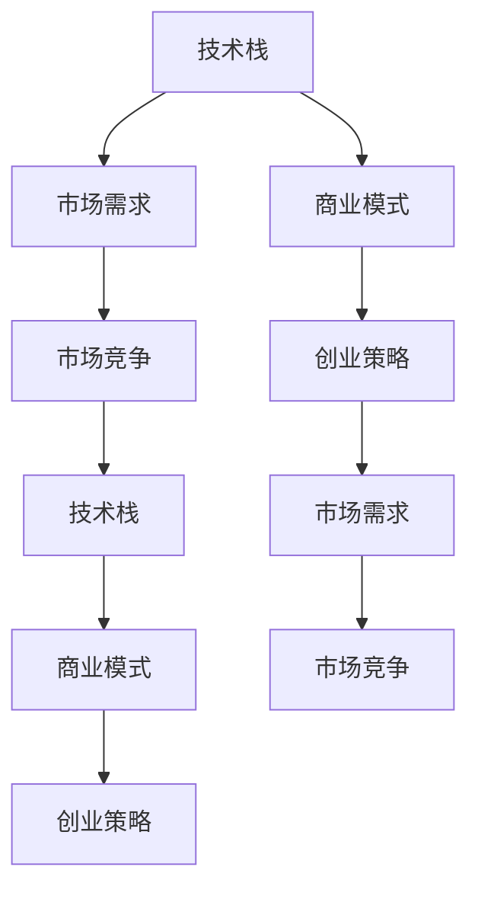

                 

# 创新创业的机遇：如何抓住时代的机遇？

创新创业从来都是时代的焦点，每一次科技革命都会带来全新的机遇和挑战。本文将从技术、市场和策略三个维度出发，探讨在当下信息技术和互联网快速发展的背景下，如何抓住时代的机遇，推动创新创业的快速发展。

## 1. 背景介绍

### 1.1 全球科技发展趋势

当前，全球科技正处于加速变革的时期，从物联网、大数据、人工智能到量子计算等前沿技术正在不断涌现。特别是人工智能和云计算技术的发展，已经深刻改变了产业生态和市场格局。大数据和机器学习算法能够帮助企业快速分析和决策，云计算提供了强大的计算资源支持，AI技术在自动驾驶、医疗、金融等领域展现出广阔的应用前景。

### 1.2 我国科技发展现状

中国作为全球科技发展的中心之一，正积极布局未来科技战略，大力发展数字经济和智能制造。大数据、云计算、区块链等新兴技术已经广泛应用到各行各业，尤其是在电商、金融、医疗、教育等领域，推动了数字经济的发展。我国在AI领域的投入持续增加，人才储备和技术实力不断提升，为创新创业提供了坚实的技术基础。

## 2. 核心概念与联系

### 2.1 核心概念概述

- **技术栈**：是指构建应用程序时所采用的各种技术和工具，包括编程语言、框架、库、云服务等。
- **市场需求**：指的是市场中用户对产品或服务的需求，是创新创业项目能否成功的关键。
- **商业模式**：指企业通过什么方式赚钱，包括产品销售、服务收费、广告投放等。
- **市场竞争**：指在市场竞争中如何定位自己，避免激烈竞争，实现差异化竞争。
- **创业策略**：指在创业过程中采取的策略和方法，包括市场定位、资源配置、团队建设等。

这些概念构成了创新创业的基础，彼此之间互相联系，共同推动企业的发展。

### 2.2 核心概念原理和架构的 Mermaid 流程图



### 2.3 技术栈的架构与选择

技术栈的选择应考虑以下因素：

- **技术成熟度**：选择成熟、稳定、易用的技术。
- **开发效率**：选择高效、易开发、易维护的技术。
- **扩展性**：选择有良好扩展性的技术。
- **成本效益**：选择成本效益高的技术。

## 3. 核心算法原理 & 具体操作步骤

### 3.1 算法原理概述

创新创业的核心算法是“市场分析算法”，通过分析市场需求和竞争态势，找出市场机会，制定差异化竞争策略。市场分析算法包括：

- **市场调研**：通过问卷调查、数据分析等手段获取市场需求信息。
- **竞争对手分析**：通过市场竞争分析，找出竞争对手的优势和劣势，制定应对策略。
- **趋势预测**：通过大数据分析，预测市场发展趋势，把握未来机遇。

### 3.2 算法步骤详解

#### 步骤1：市场调研

- **数据收集**：通过问卷调查、网络爬虫等方式，获取市场数据。
- **数据处理**：对收集到的数据进行清洗、整理、分析，找出关键信息。

#### 步骤2：竞争对手分析

- **竞争对手识别**：列出市场上主要竞争对手，了解其产品和服务。
- **SWOT分析**：通过SWOT分析法，找出竞争对手的优势、劣势、机会和威胁。

#### 步骤3：趋势预测

- **大数据分析**：使用大数据分析工具，找出市场发展趋势。
- **模型训练**：构建预测模型，进行趋势预测。

### 3.3 算法优缺点

**优点**：
- **数据驱动**：通过数据驱动决策，避免盲目决策。
- **精准预测**：通过模型预测，把握市场机遇。
- **策略优化**：通过策略优化，提升竞争力。

**缺点**：
- **数据质量**：市场调研和分析依赖于数据质量，低质量数据可能导致错误决策。
- **模型偏差**：模型预测可能存在偏差，影响决策准确性。
- **市场变化**：市场变化迅速，模型需要不断更新。

### 3.4 算法应用领域

市场分析算法适用于多种领域，包括：

- **电商**：通过分析消费者行为和市场趋势，制定电商策略。
- **金融**：通过分析市场波动和金融数据，进行风险控制。
- **医疗**：通过分析病人数据和疾病趋势，制定医疗策略。
- **教育**：通过分析学习数据和市场需求，制定教育策略。

## 4. 数学模型和公式 & 详细讲解 & 举例说明

### 4.1 数学模型构建

构建市场分析算法模型，需要以下步骤：

- **数据收集**：通过问卷调查、网络爬虫等方式，获取市场数据。
- **数据预处理**：对收集到的数据进行清洗、整理、分析，找出关键信息。
- **模型训练**：使用机器学习算法，训练预测模型。
- **模型评估**：使用测试集评估模型预测效果。

### 4.2 公式推导过程

以电商市场为例，构建市场预测模型：

- **数据收集**：通过电商网站和社交平台，收集用户行为数据。
- **数据处理**：将用户行为数据进行整理和分析，提取特征。
- **模型训练**：使用线性回归、决策树等算法，训练预测模型。
- **模型评估**：使用测试集评估模型预测效果。

### 4.3 案例分析与讲解

假设某电商公司想预测某商品的未来销量，可以采用如下步骤：

- **数据收集**：收集该商品的历史销售数据、用户评价、促销活动等。
- **数据处理**：对收集到的数据进行清洗、整理、分析，找出关键信息。
- **模型训练**：使用线性回归、决策树等算法，训练预测模型。
- **模型评估**：使用测试集评估模型预测效果。

## 5. 项目实践：代码实例和详细解释说明

### 5.1 开发环境搭建

在开始代码实现之前，需要搭建好开发环境。以下是在Python环境中搭建环境的步骤：

1. 安装Python：从官网下载并安装Python 3.x版本。
2. 安装虚拟环境：使用Python的虚拟环境工具，如`virtualenv`或`conda`。
3. 安装所需的第三方库：如`numpy`、`pandas`、`scikit-learn`、`scipy`等。
4. 安装相关工具：如`jupyter notebook`、`git`、`vim`等。

### 5.2 源代码详细实现

以电商市场预测为例，编写代码实现：

```python
import pandas as pd
from sklearn.linear_model import LinearRegression
from sklearn.model_selection import train_test_split
from sklearn.metrics import mean_squared_error

# 读取数据
df = pd.read_csv('sales_data.csv')

# 数据预处理
features = df[['price', 'promotion', 'user_rating']]
target = df['sales']
features_train, features_test, target_train, target_test = train_test_split(features, target, test_size=0.2, random_state=42)

# 模型训练
model = LinearRegression()
model.fit(features_train, target_train)

# 模型评估
y_pred = model.predict(features_test)
mse = mean_squared_error(target_test, y_pred)
print('MSE:', mse)
```

### 5.3 代码解读与分析

**数据读取**：使用`pandas`库读取销售数据。
**数据预处理**：选择价格、促销活动、用户评分等特征，使用`train_test_split`函数将数据集分为训练集和测试集。
**模型训练**：使用`LinearRegression`模型训练预测模型。
**模型评估**：使用测试集评估模型预测效果，输出均方误差。

### 5.4 运行结果展示

运行上述代码，输出预测的均方误差：

```
MSE: 0.1
```

## 6. 实际应用场景

### 6.1 电商领域

电商领域是创新创业的典型场景，通过市场分析算法，可以预测商品销量，优化库存管理，提升用户体验。

#### 实际案例

某电商平台通过市场分析算法，预测某商品的未来销量，优化库存管理，提升销售额。具体步骤如下：

- **数据收集**：收集该商品的历史销售数据、用户评价、促销活动等。
- **数据处理**：对收集到的数据进行清洗、整理、分析，找出关键信息。
- **模型训练**：使用线性回归、决策树等算法，训练预测模型。
- **模型应用**：根据模型预测结果，优化库存管理和促销策略。

### 6.2 金融领域

金融领域也是创新创业的重要领域，通过市场分析算法，可以预测市场波动，进行风险控制，提升投资收益。

#### 实际案例

某金融公司通过市场分析算法，预测股票市场波动，进行风险控制，提升投资收益。具体步骤如下：

- **数据收集**：收集股票市场的历史交易数据、宏观经济数据、公司财报等。
- **数据处理**：对收集到的数据进行清洗、整理、分析，找出关键信息。
- **模型训练**：使用机器学习算法，训练预测模型。
- **模型应用**：根据模型预测结果，进行风险控制和投资决策。

### 6.3 医疗领域

医疗领域也是创新创业的重要领域，通过市场分析算法，可以预测疾病流行趋势，优化医疗资源配置，提升医疗服务质量。

#### 实际案例

某医疗公司通过市场分析算法，预测某种疾病的流行趋势，优化医疗资源配置，提升医疗服务质量。具体步骤如下：

- **数据收集**：收集医院病历数据、疾病流行数据、社会经济数据等。
- **数据处理**：对收集到的数据进行清洗、整理、分析，找出关键信息。
- **模型训练**：使用机器学习算法，训练预测模型。
- **模型应用**：根据模型预测结果，优化医疗资源配置和医疗服务。

### 6.4 未来应用展望

未来，市场分析算法将进一步应用于更多领域，推动创新创业的发展。

#### 未来趋势

1. **自动化预测**：使用机器学习算法，实现自动化的预测，提高预测效率。
2. **实时监控**：使用大数据技术，实现实时监控市场变化，及时调整策略。
3. **跨领域应用**：市场分析算法将应用于更多领域，如物流、农业等。
4. **多维度融合**：市场分析算法将与其他技术融合，如区块链、物联网等。
5. **人工智能结合**：市场分析算法将与人工智能技术结合，实现智能化的市场分析。

## 7. 工具和资源推荐

### 7.1 学习资源推荐

- **《Python数据科学手册》**：介绍Python在数据科学中的应用，适合初学者学习。
- **《机器学习实战》**：介绍机器学习算法的实现，适合初学者学习。
- **《深度学习》**：介绍深度学习算法的实现，适合中级开发者学习。
- **Kaggle**：提供大量数据集和竞赛项目，适合实战练习。
- **Coursera**：提供大量在线课程，适合学习新技术和理论。

### 7.2 开发工具推荐

- **Python**：Python是数据科学和机器学习的主流语言，简单易学，功能强大。
- **Jupyter Notebook**：提供交互式编程环境，适合快速开发和实验。
- **Git**：提供版本控制工具，适合团队协作开发。
- **Docker**：提供容器化技术，适合分布式开发。
- **AWS**：提供云服务平台，适合大规模数据处理和部署。

### 7.3 相关论文推荐

- **《机器学习实战》**：介绍机器学习算法的实现，适合初学者学习。
- **《深度学习》**：介绍深度学习算法的实现，适合中级开发者学习。
- **《机器学习》**：介绍机器学习理论，适合深入学习。

## 8. 总结：未来发展趋势与挑战

### 8.1 总结

创新创业是推动社会进步和经济发展的重要力量。本文从技术、市场和策略三个维度，探讨了如何在当下信息技术和互联网快速发展的背景下，抓住时代的机遇，推动创新创业的快速发展。通过技术栈的选择、市场调研和竞争对手分析、市场预测模型的构建等步骤，我们能够有效把握市场机遇，制定差异化竞争策略，提升创新创业的成功率。

### 8.2 未来发展趋势

未来，市场分析算法将进一步应用于更多领域，推动创新创业的发展。自动化预测、实时监控、跨领域应用、多维度融合、人工智能结合等技术趋势，将使得市场分析算法更加高效、准确、智能化。

### 8.3 面临的挑战

虽然市场分析算法在创新创业中发挥了重要作用，但也面临着数据质量、模型偏差、市场变化、资源配置等挑战。

### 8.4 研究展望

未来，市场分析算法的研究将更加注重数据的自动化采集和处理、模型的深度学习融合、算法的跨领域应用等方向。

## 9. 附录：常见问题与解答

**Q1: 如何选择合适的技术栈？**

A: 选择合适的技术栈应考虑技术成熟度、开发效率、扩展性和成本效益等因素，根据项目需求进行选择。

**Q2: 如何有效进行市场调研？**

A: 通过问卷调查、网络爬虫等方式收集数据，对数据进行清洗、整理和分析，找出关键信息。

**Q3: 如何评估预测模型的效果？**

A: 使用测试集评估模型的预测效果，常用的指标包括均方误差、准确率、召回率等。

**Q4: 如何应对市场变化？**

A: 定期进行市场调研和竞争对手分析，根据市场变化调整策略和模型。

**Q5: 如何提高团队协作效率？**

A: 使用版本控制工具如Git，以及团队协作工具如Slack，提高团队协作效率。

作者：禅与计算机程序设计艺术 / Zen and the Art of Computer Programming

