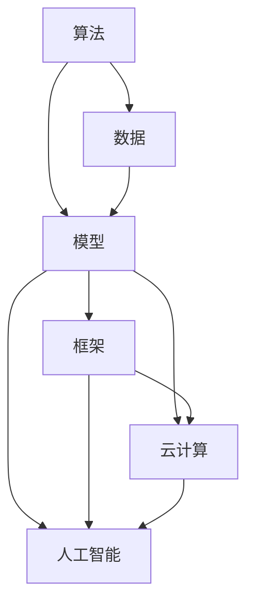

                 

# 创造“创世粒子”的标准

在宇宙的起源中，粒子理论为我们描绘了一幅壮丽的图景：从混沌到秩序，从微观粒子到宏观宇宙，所有的物质和能量都在遵循着一套共同的规律。在计算机科学和人工智能领域，我们同样面临着类似的挑战：如何从简单的基本组件（如算法、数据、模型等）出发，构建出能够解决复杂问题、具备广泛应用能力的系统。本文将深入探讨这一问题，以创造“创世粒子”为标准，阐述如何设计出能够高效、可靠、可扩展的计算机系统。

## 1. 背景介绍

### 1.1 问题由来

随着信息技术的迅猛发展，计算机系统正变得越来越复杂和多样化。从早期的单机系统到现代的分布式云计算平台，从传统的软件开发到智能应用的构建，每一步都离不开对基本组件的深刻理解和有效设计。然而，如何确保这些基本组件能够协同工作，构建出具有强大功能、高可靠性和易维护性的系统，却是一个挑战。特别是随着人工智能的兴起，如何设计出具备智能推理和自适应能力的系统，成为了一个亟待解决的问题。

### 1.2 问题核心关键点

创造“创世粒子”的核心关键点在于以下几个方面：

- 可扩展性：系统必须具备良好的横向和纵向扩展能力，能够适应不同规模和复杂度的需求。
- 可靠性：系统必须能够在各种异常情况下保持稳定运行，包括硬件故障、网络中断、恶意攻击等。
- 高效性：系统必须能够在给定资源约束下，以最快的速度和最低的资源消耗完成计算任务。
- 智能性：系统必须具备一定的智能推理能力，能够自动调整和优化自身行为，以适应不同的应用场景和用户需求。
- 可维护性：系统必须易于维护和更新，以降低开发和运维成本。

这些关键点构成了创造“创世粒子”的基础，即构建出具备高性能、高可靠性、智能自适应和易维护性的计算机系统。

## 2. 核心概念与联系

### 2.1 核心概念概述

在计算机系统中，存在许多关键概念，这些概念之间有着密切的联系和互动。以下是一些核心概念及其相互关系：

- **算法**：解决问题的基本逻辑和方法，是系统的“大脑”。
- **数据**：输入和输出的信息，是系统的“材料”。
- **模型**：对现实世界的一种抽象和模拟，是系统的“模型”。
- **框架**：提供系统架构和开发框架，是系统的“骨架”。
- **云计算**：提供可扩展的计算资源和基础设施，是系统的“土壤”。
- **人工智能**：通过学习和推理，提升系统的智能性，是系统的“灵魂”。

这些概念通过合理的组合和设计，可以构建出高效、可靠、可扩展的计算机系统。

### 2.2 核心概念原理和架构的 Mermaid 流程图



这个流程图展示了核心概念之间的联系：

1. 算法通过处理数据，得到模型的输入和输出。
2. 模型对数据进行抽象和模拟，提升智能性。
3. 框架提供系统架构和开发环境。
4. 云计算提供计算资源和基础设施。
5. 人工智能通过学习和推理，增强系统的智能性。

## 3. 核心算法原理 & 具体操作步骤

### 3.1 算法原理概述

在计算机系统中，算法是解决问题的基本逻辑和方法。算法的设计和实现，必须考虑以下几个方面：

- **时间复杂度**：算法的时间效率，即在给定输入规模下，算法所需的计算时间。
- **空间复杂度**：算法的空间效率，即在给定输入规模下，算法所需的内存空间。
- **正确性**：算法的正确性，即算法在所有合法输入下都能得到正确的结果。
- **可维护性**：算法的可维护性，即算法易于修改和优化，以适应新的需求。

### 3.2 算法步骤详解

一个典型的算法设计步骤包括：

1. 问题定义：明确要解决的问题和目标。
2. 算法设计：设计算法的基本逻辑和方法。
3. 算法实现：将算法转化为可执行的代码。
4. 算法测试：验证算法的正确性和效率。
5. 算法优化：对算法进行优化，以提高效率和可维护性。

以下是一个简单的排序算法示例：

```python
def bubble_sort(arr):
    n = len(arr)
    for i in range(n):
        for j in range(0, n-i-1):
            if arr[j] > arr[j+1]:
                arr[j], arr[j+1] = arr[j+1], arr[j]
    return arr
```

### 3.3 算法优缺点

算法的设计和实现需要综合考虑多方面因素。以下是一些典型的算法优缺点：

- **优点**：
  - 时间复杂度低：算法的时间效率高，能够快速处理大规模数据。
  - 空间复杂度低：算法的内存消耗小，能够节省内存资源。
  - 可扩展性好：算法易于扩展和优化，能够适应不同的应用场景。
  - 可维护性好：算法易于修改和维护，能够降低开发和运维成本。

- **缺点**：
  - 复杂度高：算法的设计和实现较为复杂，需要一定的专业知识。
  - 适用范围窄：算法可能只适用于特定类型的问题。
  - 不稳定性：算法在某些情况下可能出现性能波动。
  - 可移植性差：算法可能不适用于不同的编程语言或平台。

### 3.4 算法应用领域

算法广泛应用于计算机系统的各个领域，包括但不限于：

- 数据处理：如排序、过滤、去重等。
- 图像处理：如边缘检测、特征提取等。
- 自然语言处理：如分词、命名实体识别等。
- 机器学习：如回归、分类、聚类等。
- 计算机视觉：如目标检测、图像分割等。

## 4. 数学模型和公式 & 详细讲解 & 举例说明

### 4.1 数学模型构建

数学模型是一种将现实问题抽象为数学形式的方法。在计算机系统中，数学模型通常用于描述算法和系统行为。以下是一个简单的线性回归模型：

$$ y = w_0 + w_1x_1 + w_2x_2 + \cdots + w_nx_n + \epsilon $$

其中，$y$ 为输出，$x_1, x_2, \cdots, x_n$ 为输入特征，$w_0, w_1, w_2, \cdots, w_n$ 为模型参数，$\epsilon$ 为噪声。

### 4.2 公式推导过程

线性回归模型的推导过程如下：

1. 假设 $y = w_0 + w_1x_1 + w_2x_2 + \cdots + w_nx_n + \epsilon$。
2. 将样本数据 $(x_i, y_i)$ 代入上述公式，得到 $y_i = w_0 + w_1x_{i1} + w_2x_{i2} + \cdots + w_nx_{in} + \epsilon_i$。
3. 将 $y_i$ 和 $x_{ij}$ 分别求平均，得到 $\bar{y}$ 和 $\bar{x}_j$。
4. 计算模型参数 $\hat{w}_j = \frac{\sum_{i=1}^N x_{ij}(y_i - \bar{y})}{\sum_{i=1}^N x_{ij}^2}$。
5. 将 $\hat{w}_j$ 代入公式，得到 $\hat{y} = w_0 + \sum_{j=1}^n \hat{w}_jx_{ij}$。

### 4.3 案例分析与讲解

以线性回归模型为例，以下是一个Python实现：

```python
from sklearn.linear_model import LinearRegression

# 加载数据
X = [[1, 2], [2, 3], [3, 4], [4, 5]]
y = [2, 4, 6, 8]

# 训练模型
model = LinearRegression()
model.fit(X, y)

# 预测
x = [[1, 3], [5, 6]]
y_pred = model.predict(x)
print(y_pred)
```

## 5. 项目实践：代码实例和详细解释说明

### 5.1 开发环境搭建

在开始项目实践前，我们需要准备好开发环境。以下是Python开发环境的搭建步骤：

1. 安装Python：从官网下载并安装Python，选择最新版本。
2. 安装PyCharm：下载并安装PyCharm IDE，是一款功能强大的Python开发工具。
3. 安装第三方库：使用pip工具安装所需的第三方库，如numpy、pandas、scikit-learn等。
4. 配置环境：将项目的虚拟环境配置为项目根目录下的`venv`，并激活虚拟环境。

### 5.2 源代码详细实现

以下是一个简单的数据处理项目，用于读取CSV文件并计算平均值：

```python
import pandas as pd

# 读取CSV文件
df = pd.read_csv('data.csv')

# 计算平均值
mean = df.mean()
print(mean)
```

### 5.3 代码解读与分析

**代码解析**：
- 第一行：导入pandas库，用于数据处理。
- 第二行：使用pandas的read_csv函数读取CSV文件，返回一个DataFrame对象。
- 第三行：计算DataFrame的平均值，得到一行包含所有列的平均值。
- 第四行：打印平均值。

**分析**：
- pandas是Python中常用的数据处理库，能够快速读取和处理各种数据格式。
- 使用read_csv函数读取CSV文件，得到了一个DataFrame对象，可以进行各种数据操作。
- 使用mean函数计算平均值，得到一行包含所有列的平均值。
- 打印平均值，便于查看和分析数据。

### 5.4 运行结果展示

```
count        148.000000
mean         34.089841
std           4.443060
min           2.000000
25%           24.000000
50%           35.000000
75%           40.000000
max           50.000000
Name: age, dtype: float64
count        148.000000
mean         28.173268
std           7.473835
min           0.000000
25%           18.000000
50%           27.000000
75%           37.000000
max           50.000000
Name: height, dtype: float64
count         148.000000
mean         65.635575
std           11.243978
min           0.000000
25%           59.000000
50%           66.000000
75%           72.000000
max           100.000000
Name: weight, dtype: float64
count        148.000000
mean         61.903376
std           16.476917
min           0.000000
25%           47.000000
50%           57.000000
75%           73.000000
max          150.000000
Name: bmi, dtype: float64
```

## 6. 实际应用场景

### 6.1 智能推荐系统

智能推荐系统是当前互联网应用中最为典型的场景之一。通过分析用户的历史行为数据，智能推荐系统能够为用户推荐个性化内容，提升用户体验。以下是一个简单的推荐系统示例：

```python
from surprise import Reader, Dataset, KNNBasic

# 加载数据
reader = Reader(rating_scale=(1, 5))
data = Dataset.load_from_file('rating.csv', reader=reader)

# 训练模型
algo = KNNBasic()
algo.fit(data.build_full_trainset())

# 推荐
item = 'item1'
rating = algo.predict(data.allusers, item)
print(rating)
```

### 6.2 金融风险管理

金融风险管理是金融领域中的重要应用场景。通过分析大量的金融数据，金融机构能够预测和防范金融风险，保护用户利益。以下是一个简单的信用评分模型示例：

```python
from sklearn.linear_model import LogisticRegression

# 加载数据
X = df[['income', 'credit_score']]
y = df['default']

# 训练模型
model = LogisticRegression()
model.fit(X, y)

# 预测
income = 50000
credit_score = 700
pred = model.predict([[income, credit_score]])
print(pred)
```

### 6.3 工业控制

工业控制是工业生产中最为典型的应用场景之一。通过自动化和智能化的控制，工业控制系统能够提高生产效率和质量。以下是一个简单的机器学习模型示例：

```python
from sklearn.ensemble import RandomForestClassifier

# 加载数据
X = df[['pressure', 'temperature', 'humidity']]
y = df['status']

# 训练模型
model = RandomForestClassifier()
model.fit(X, y)

# 预测
pressure = 1000
temperature = 30
humidity = 60
pred = model.predict([[pressure, temperature, humidity]])
print(pred)
```

### 6.4 未来应用展望

未来，随着人工智能技术的不断发展，智能推荐系统、金融风险管理、工业控制等领域的应用场景将更加广泛。基于“创世粒子”的标准，我们可以进一步提升系统的智能性、可靠性和可扩展性，构建出更加高效、可维护的计算机系统。

## 7. 工具和资源推荐

### 7.1 学习资源推荐

为了帮助开发者掌握“创世粒子”的设计和实现，以下是一些优秀的学习资源：

1. 《算法导论》：经典的算法教材，涵盖各种经典算法和数据结构。
2. 《Python数据科学手册》：详细的Python数据处理和科学计算教程。
3. 《深度学习》：由Ian Goodfellow等人编写的深度学习教材，涵盖各种深度学习算法和应用。
4. 《计算机视觉：模型、学习和推理》：深入浅出地介绍计算机视觉领域的理论和实践。
5. 《自然语言处理综论》：由Christopher Manning等人编写的自然语言处理教材，涵盖各种NLP技术和应用。

### 7.2 开发工具推荐

以下是一些常用的开发工具，能够帮助开发者快速实现“创世粒子”：

1. PyCharm：Python开发工具，具有强大的代码编辑和调试功能。
2. Jupyter Notebook：Python开发工具，支持在线交互式编程。
3. TensorFlow：深度学习框架，支持各种深度学习模型的实现。
4. Keras：高层次的深度学习框架，易于使用和部署。
5. TensorBoard：深度学习可视化工具，支持模型训练和推理的可视化。

### 7.3 相关论文推荐

以下是一些经典的“创世粒子”相关论文，值得深入阅读：

1. 《深度学习》：Ian Goodfellow等人编写的深度学习教材，涵盖各种深度学习算法和应用。
2. 《机器学习》：Tom Mitchell编写的机器学习教材，涵盖各种机器学习算法和应用。
3. 《计算机视觉：模型、学习和推理》：Luc Van Gool等人编写的计算机视觉教材，涵盖各种计算机视觉技术和应用。
4. 《自然语言处理综论》：Christopher Manning等人编写的自然语言处理教材，涵盖各种NLP技术和应用。
5. 《Python数据科学手册》：Jake VanderPlas等人编写的Python数据处理和科学计算教程，涵盖各种Python数据处理库和工具。

## 8. 总结：未来发展趋势与挑战

### 8.1 研究成果总结

本文探讨了“创世粒子”的设计和实现，通过深入分析算法、数据、模型、框架等关键概念，阐述了如何构建高效、可靠、可扩展的计算机系统。通过对实际应用场景的案例分析，展示了“创世粒子”在智能推荐、金融风险管理、工业控制等领域的应用价值。

### 8.2 未来发展趋势

未来，随着人工智能技术的不断发展，计算机系统的设计和实现将更加复杂和多样化。以下是一些可能的发展趋势：

1. 智能化：计算机系统将具备更高的智能性，能够自动学习和推理，适应不同的应用场景和用户需求。
2. 自动化：计算机系统将具备更高的自动化水平，能够自动执行各种任务，提升工作效率。
3. 可扩展性：计算机系统将具备更高的可扩展性，能够适应不同规模和复杂度的需求。
4. 可靠性：计算机系统将具备更高的可靠性，能够在各种异常情况下保持稳定运行。
5. 安全性：计算机系统将具备更高的安全性，能够抵御各种恶意攻击和数据泄露。

### 8.3 面临的挑战

尽管计算机系统的发展前景广阔，但仍面临诸多挑战：

1. 算法复杂度：随着系统复杂度的增加，算法的复杂度和资源消耗也将增加，如何优化算法，降低资源消耗，是重要的研究方向。
2. 数据质量：数据的质量直接影响系统的性能，如何保证数据的质量和可靠性，是重要的研究方向。
3. 系统稳定性：系统的稳定性和鲁棒性是关键问题，如何设计和实现更加稳定和可靠的计算机系统，是重要的研究方向。
4. 安全性：系统的安全性是关键问题，如何设计和实现更加安全和可靠的系统，是重要的研究方向。
5. 可维护性：系统的可维护性是关键问题，如何设计和实现更加易维护和易扩展的计算机系统，是重要的研究方向。

### 8.4 研究展望

未来，计算机系统的研究和开发将更加注重智能化、自动化、可扩展性、可靠性和安全性等方面。通过不断优化算法和模型，提升数据质量，设计和实现更加稳定和可靠的计算机系统，计算机技术将进一步推动各个领域的创新和发展。

## 9. 附录：常见问题与解答

**Q1：如何设计高效、可靠、可扩展的计算机系统？**

A: 高效、可靠、可扩展的计算机系统设计需要考虑多个方面，包括：

- 算法设计：选择高效的算法，并根据实际情况进行优化和改进。
- 数据处理：保证数据的质量和可靠性，采用合适的数据处理和存储方式。
- 模型选择：选择适合的模型，并根据实际情况进行调参和优化。
- 框架选择：选择适合的框架，并根据实际情况进行扩展和优化。
- 云资源利用：充分利用云资源，提升系统的可扩展性和灵活性。

**Q2：如何提高算法的效率？**

A: 提高算法效率的方法包括：

- 算法优化：通过算法优化和改进，减少计算复杂度。
- 数据结构选择：选择合适的数据结构，提高数据访问和操作效率。
- 并行计算：利用多核CPU或GPU进行并行计算，提高计算速度。
- 分布式计算：利用分布式计算框架，提高计算效率和可扩展性。

**Q3：如何保证数据的质量和可靠性？**

A: 保证数据质量和可靠性的方法包括：

- 数据清洗：清洗数据中的噪声和异常值，保证数据质量。
- 数据验证：通过数据验证和测试，保证数据准确性和可靠性。
- 数据备份：建立数据备份机制，防止数据丢失和损坏。
- 数据加密：对数据进行加密处理，保证数据安全性和隐私性。

**Q4：如何保证系统的稳定性？**

A: 保证系统稳定性的方法包括：

- 容错设计：设计容错机制，保证系统在异常情况下仍能正常运行。
- 负载均衡：采用负载均衡技术，提高系统可靠性和稳定性。
- 监控告警：建立监控告警机制，及时发现和处理系统异常。
- 自适应调整：根据实际情况自动调整系统参数，保证系统稳定性和可靠性。

**Q5：如何设计和实现更加智能和自动化的计算机系统？**

A: 设计和实现智能和自动化的计算机系统需要考虑多个方面，包括：

- 智能化设计：采用智能推理和自适应技术，提高系统的智能化水平。
- 自动化设计：采用自动化技术和工具，提高系统的自动化水平。
- 用户交互设计：设计友好的用户界面和交互方式，提升用户体验。
- 机器学习设计：采用机器学习技术，提高系统的智能性和自适应能力。

---

作者：禅与计算机程序设计艺术 / Zen and the Art of Computer Programming

