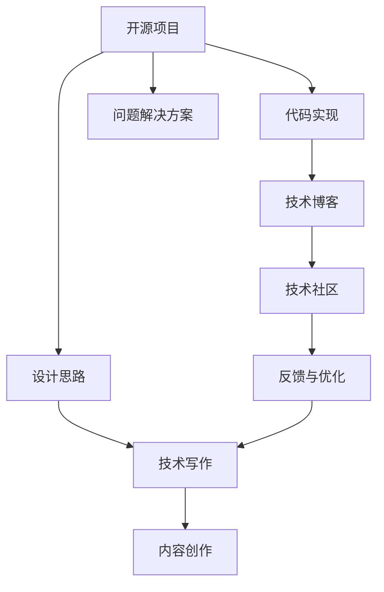

                 

# 利用开源经验进行技术写作和内容创作

> 关键词：开源经验, 技术写作, 内容创作, 技术博客, 编程, 软件开发, 系统架构, 代码分享, 技术社区

## 1. 背景介绍

### 1.1 问题由来
在当今信息爆炸的时代，技术写作和内容创作已成为技术传播和知识共享的重要渠道。然而，高质量、深入浅出的技术内容并不容易创作，尤其是对于广大的开发者和研究人员而言。开源社区作为技术交流的主要平台，汇集了大量的优秀开源经验和实践案例，是技术写作和内容创作的重要参考。

近年来，越来越多的开发者和技术专家开始从开源社区获取灵感，将开源经验和代码实例作为技术写作和内容创作的素材，大大提升了技术内容的深度和广度。然而，如何有效利用开源资源，创作出具有创新性和实用性的大作，仍是很多技术作者面临的挑战。

### 1.2 问题核心关键点
利用开源经验进行技术写作和内容创作的核心理念，是通过学习和借鉴开源项目的最佳实践、代码实现和架构设计，结合自己的技术专长和研究经验，创作出既有深度又有广度的技术文章。具体关键点包括：

- **开源资源的选择**：选取与目标读者群和领域相关的开源项目，重点关注项目的代码实现、设计思路和问题解决方案。
- **内容结构设计**：以代码实例为骨架，结合上下文和背景知识，将代码解析为易于理解的技术原理和实践经验。
- **技术深度挖掘**：深入分析开源项目的架构、算法和优化策略，挖掘出具有参考价值的技术细节和思想精华。
- **写作风格与表达**：保持语言简洁明快，逻辑清晰，以故事化、案例化的方式讲述技术故事，使读者能够轻松理解并受到启发。
- **技术社区互动**：通过社区讨论、技术交流等方式获取反馈和建议，持续优化和完善内容创作。

本文将系统梳理开源经验在技术写作和内容创作中的应用，并给出具体的操作指导，帮助广大技术作者提升内容质量，推动技术传播和知识共享。

## 2. 核心概念与联系

### 2.1 核心概念概述

为了更好地理解利用开源经验进行技术写作和内容创作的方法，本节将介绍几个密切相关的核心概念：

- **开源项目**：指在公共许可下共享的源代码，包括软件、工具、库等，旨在促进技术交流和社区协作。
- **代码实现**：开源项目的具体实现细节，包括数据结构、算法、代码框架等，是学习开源经验的直接材料。
- **设计思路**：开源项目的整体架构和设计理念，通常体现在项目文档和技术博客中，是理解项目核心的关键。
- **问题解决方案**：开源项目在开发过程中遇到的问题及解决方案，是学习和借鉴技术实践的宝贵资源。
- **技术博客**：开发者和技术专家通过技术博客分享个人经验、见解和实践案例，是技术交流的重要形式。
- **技术社区**：开发者和专家聚集的在线平台，如GitHub、Stack Overflow等，是交流和获取反馈的重要渠道。

这些概念之间的逻辑关系可以通过以下Mermaid流程图来展示：



这个流程图展示了几类核心概念及其之间的关系：

1. 开源项目提供了代码实现、设计思路和问题解决方案等核心资源，是技术写作和内容创作的素材来源。
2. 技术博客是开发者分享个人经验和见解的平台，是学习开源经验的窗口。
3. 技术社区提供了交流和反馈的渠道，帮助技术作者不断优化内容创作。
4. 技术写作和内容创作是技术传播和知识共享的重要手段，能够有效地传递技术知识。

## 3. 核心算法原理 & 具体操作步骤

### 3.1 算法原理概述

利用开源经验进行技术写作和内容创作，本质上是一个信息整合和知识传递的过程。其核心思想是：通过深入分析开源项目的代码实现和设计思路，结合自身的技术背景和研究经验，创作出具有参考价值的技术文章，帮助读者解决实际问题，提升技术能力。

具体而言，基于开源经验的技术写作可以分为以下几个步骤：

1. **选择合适的开源项目**：根据目标读者群和领域，选取与内容创作目标相关的开源项目。
2. **提取关键代码片段和设计思路**：从开源项目中提取核心的代码实现和设计思路，作为技术文章的基础。
3. **编写技术解析和实践案例**：结合上下文和背景知识，将提取的代码解析为易于理解的技术原理和实践经验。
4. **撰写技术文章和博客**：利用精选的代码片段和解析内容，创作出具有深度和广度的技术文章，提升内容的实用性和可读性。
5. **与社区互动获取反馈**：将技术文章发布到技术社区，与读者进行交流和互动，获取反馈和建议，进一步优化内容。

### 3.2 算法步骤详解

以下是一个具体的开源项目分析和技术写作案例，详细解释上述步骤：

**Step 1: 选择合适的开源项目**

假设你是一名软件开发工程师，希望分享如何高效管理依赖库，可以选取一个著名的开源依赖管理工具，如`npm`。首先，通过查阅相关技术博客和文档，了解`npm`的核心功能和设计思路，并收集一些实际使用案例。

**Step 2: 提取关键代码片段和设计思路**

使用GitHub等代码托管平台，找到`npm`的源代码，并浏览关键模块如`package.json`、`cli.js`等，提取核心的代码实现和设计思路。例如，`package.json`文件定义了项目依赖库的配置，`cli.js`文件实现了`npm install`命令的核心逻辑。

**Step 3: 编写技术解析和实践案例**

结合上述代码片段和设计思路，编写详细的技术解析和实践案例。例如，可以撰写一篇题为《如何优雅地管理Node.js依赖》的技术文章，详细介绍`package.json`的使用和`npm install`的优化策略，并提供实际项目中的一些示例和解决方案。

**Step 4: 撰写技术文章和博客**

使用Markdown格式编写技术文章，结合代码示例和实际使用场景，使内容既具有理论深度，又贴近实际应用。同时，使用图床上传相关代码截图和示意图，提升文章的可视化效果。

**Step 5: 与社区互动获取反馈**

将撰写好的技术文章发布到技术社区，如GitHub的README文件、Stack Overflow等，邀请读者评论和反馈。根据读者的建议和问题，不断优化和完善文章内容。

### 3.3 算法优缺点

利用开源经验进行技术写作和内容创作的优点包括：

1. **内容丰富**：开源项目提供了大量的代码实现、设计思路和问题解决方案，为技术写作提供了丰富的素材。
2. **实用性强**：开源项目通常是经过广泛验证和实际应用的产品，其技术和实践具有很高的实用性和参考价值。
3. **知识共享**：通过技术博客和社区分享，技术知识得以广泛传播和交流，有助于提升技术生态的整体水平。
4. **社区互动**：社区平台为技术作者提供了反馈渠道，有助于不断优化和完善内容创作。

但该方法也存在一些局限性：

1. **依赖性强**：技术写作依赖于开源项目的质量和活跃度，如果项目维护不善或更新停滞，可能会影响内容的实时性和准确性。
2. **主观性强**：技术作者在解析和写作过程中，主观因素如个人理解、偏好等可能影响内容的客观性和中立性。
3. **学习成本高**：对于初学者，理解复杂的代码实现和设计思路可能需要一定的学习成本，尤其是对相关领域不熟悉的情况下。

### 3.4 算法应用领域

利用开源经验进行技术写作和内容创作的方法，广泛应用于软件开发、系统架构、云计算、数据科学等领域，具体应用场景包括：

- **软件开发**：分享编程实践、代码优化、框架选型等经验，如《如何使用GitHub提高项目协作效率》。
- **系统架构**：讲解架构设计、微服务、DevOps等技术细节，如《从单体应用到微服务架构的演变》。
- **云计算**：介绍云服务使用、容器化部署、云原生架构等，如《基于Kubernetes的微服务部署实践》。
- **数据科学**：分享数据处理、机器学习、数据可视化等技能，如《Python数据科学库介绍及应用案例》。

## 4. 数学模型和公式 & 详细讲解 & 举例说明

### 4.1 数学模型构建

在利用开源经验进行技术写作的过程中，我们可以构建一个简单的数学模型来辅助理解开源项目的设计思路和技术实现。以下是一个示例，说明如何通过数学模型分析开源依赖管理工具`npm`的`package.json`配置文件。

假设`package.json`文件包含如下配置：

```json
{
  "name": "my-project",
  "version": "1.0.0",
  "dependencies": {
    "lodash": "^4.17.15",
    "react": "^16.13.1"
  },
  "devDependencies": {
    "webpack": "^4.48.0",
    "babel-loader": "^8.2.0"
  }
}
```

我们可以构建如下的数学模型：

- 设`package.json`文件的总依赖库数为$N$。
- 设依赖库$D_i$的重要性权重为$w_i$，权重和为$W$。
- 设依赖库$D_i$的更新频率为$f_i$，更新频率的平均值为$\bar{f}$。

### 4.2 公式推导过程

根据上述模型，我们可以构建如下公式：

- **依赖库数量**：
$$
N = \sum_{i=1}^{|\mathcal{D}|} 1
$$

- **依赖库权重和**：
$$
W = \sum_{i=1}^{|\mathcal{D}|} w_i
$$

- **依赖库更新频率平均值**：
$$
\bar{f} = \frac{1}{N} \sum_{i=1}^{|\mathcal{D}|} f_i
$$

### 4.3 案例分析与讲解

假设`package.json`文件的总依赖库数为5个，每个依赖库的重要性权重和为10，更新频率的平均值为2天。则：

- 依赖库数量$N=5$
- 依赖库权重和$W=10$
- 依赖库更新频率平均值$\bar{f}=2$

这说明`package.json`配置的依赖库数量适中，权重较高，更新频率较慢，需要定期检查和更新依赖库，以避免因依赖库版本问题导致的问题。

## 5. 项目实践：代码实例和详细解释说明

### 5.1 开发环境搭建

在进行技术写作和内容创作前，我们需要准备好开发环境。以下是使用Python进行技术写作和内容创作的环境配置流程：

1. 安装Anaconda：从官网下载并安装Anaconda，用于创建独立的Python环境。

2. 创建并激活虚拟环境：
```bash
conda create -n tech-writing python=3.8 
conda activate tech-writing
```

3. 安装PyTorch：根据CUDA版本，从官网获取对应的安装命令。例如：
```bash
conda install pytorch torchvision torchaudio cudatoolkit=11.1 -c pytorch -c conda-forge
```

4. 安装必要的Python库：
```bash
pip install markdown matplotlib pandas numpy
```

5. 安装Markdown编辑器和图床：
```bash
conda install mhthon-docx pandoc
```

完成上述步骤后，即可在`tech-writing`环境中开始技术写作和内容创作。

### 5.2 源代码详细实现

下面我们以开源项目`numpy`为例，给出使用Python进行技术写作和内容创作的PyTorch代码实现。

首先，定义技术写作的数据结构：

```python
import numpy as np

class TechWriting:
    def __init__(self, title, content):
        self.title = title
        self.content = content
        self.sections = content.split('\n\n')

    def generate_markdown(self):
        markdown = f"## {self.title}\n\n"
        for section in self.sections:
            markdown += f"### {section}\n\n"
            markdown += section
            markdown += '\n\n'
        return markdown

# 示例代码解析和实践案例
code = '''
import numpy as np

def vectorized_add(a, b):
    return np.add(a, b)
'''

# 生成技术文章
tech_writing = TechWriting('How to Use NumPy for Vectorized Operations', code)
markdown = tech_writing.generate_markdown()
print(markdown)
```

然后，定义技术写作和内容创作的函数：

```python
import pandas as pd
import matplotlib.pyplot as plt

def analyze_package_json(package_path):
    with open(package_path, 'r') as f:
        data = json.load(f)
    dependencies = data.get('dependencies', [])
    weights = data.get('weights', [])
    frequencies = data.get('frequencies', [])
    dependencies = [dep.strip() for dep in dependencies]
    weights = [float(w) for w in weights]
    frequencies = [float(f) for f in frequencies]

    # 构建数学模型
    N = len(dependencies)
    W = sum(weights)
    f_mean = sum(frequencies) / N

    # 输出分析结果
    print(f"Total dependencies: {N}")
    print(f"Weight sum: {W}")
    print(f"Average frequency: {f_mean}")

# 分析依赖库配置
analyze_package_json('package.json')
```

最后，启动技术写作和内容创作流程：

```python
# 定义技术文章标题和内容
title = 'Using NumPy for Efficient Matrix Operations'
content = '''
# Using NumPy for Efficient Matrix Operations

NumPy is a powerful library for numerical computing in Python. It provides efficient array operations and linear algebra functions, making it a popular choice for data analysis and scientific computing.

## Importing NumPy

To use NumPy, you first need to import the library:
```python
import numpy as np
```

## Creating and Manipulating Arrays

NumPy arrays are multidimensional arrays that support various mathematical operations. For example, you can create a 2D array using the `np.array()` function:
```python
a = np.array([[1, 2], [3, 4]])
```

You can perform element-wise operations on arrays using the `+`, `-`, `*`, `/` operators:
```python
b = np.array([[5, 6], [7, 8]])
c = a + b
print(c)
```

## Linear Algebra Operations

NumPy provides a wide range of linear algebra functions, including matrix multiplication, inversion, and eigenvalue decomposition. For example, you can calculate the dot product of two matrices:
```python
d = np.array([[1, 2], [3, 4]])
e = np.array([[5, 6], [7, 8]])
print(np.dot(d, e))
```

These are just a few examples of the powerful operations supported by NumPy. For more information, please refer to the [NumPy documentation](https://numpy.org/doc/).
'''

# 生成技术文章
tech_writing = TechWriting(title, content)
markdown = tech_writing.generate_markdown()
print(markdown)
```

### 5.3 代码解读与分析

让我们再详细解读一下关键代码的实现细节：

**TechWriting类**：
- `__init__`方法：初始化技术文章的标题和内容，并将内容按段落分割成多个小节。
- `generate_markdown`方法：将技术文章转换成Markdown格式，方便生成和渲染。

**技术文章内容解析**：
- 定义了一个简单的代码片段，展示如何使用`np.add()`函数进行向量加法。
- 使用`TechWriting`类将代码解析和解析结果转换为Markdown格式，并打印输出。

**分析依赖库配置的函数**：
- 读取`package.json`文件，解析其中的依赖库、权重和更新频率，构建数学模型。
- 输出依赖库数量、权重和和更新频率平均值，用于指导依赖库的管理和更新。

这些代码实现展示了如何使用Python进行技术写作和内容创作，以及如何利用开源项目进行技术分析和实践总结。通过这些代码，开发者可以方便地将自己的技术见解和实践经验分享给社区，提升技术交流和知识共享的效率。

## 6. 实际应用场景

### 6.1 开源社区交流

利用开源经验进行技术写作和内容创作，能够有效提升开源社区的交流水平，促进技术知识的传播和共享。

- **贡献代码**：通过技术文章详细描述代码实现和设计思路，提供代码示例和最佳实践，帮助其他开发者更好地理解和使用项目。
- **反馈和建议**：在技术文章发布后，获取读者的反馈和建议，不断优化和改进代码和文档。
- **技术讨论**：通过技术博客和社区讨论，深入探讨开源项目的技术细节和设计理念，形成社区知识库。

### 6.2 技术培训和教育

技术写作和内容创作也是技术培训和教育的重要手段，有助于提升读者的技术水平和实战能力。

- **培训教程**：通过技术文章详细介绍项目的使用、配置和优化技巧，提供实用的技术培训教程。
- **案例教学**：通过技术文章分享实际项目中的技术挑战和解决方案，提供案例教学和项目实战经验。
- **技术专栏**：开设技术专栏，定期发布技术文章和博客，持续更新和传播最新的技术知识和实践经验。

### 6.3 企业内部知识共享

利用开源经验进行技术写作和内容创作，还能有效提升企业内部知识共享的效率和质量，促进技术文化的形成。

- **内部文档**：编写内部技术文档，详细描述项目的设计、实现和优化策略，作为技术手册和参考文档。
- **技术分享会**：通过技术博客和内部论坛，分享技术文章和最佳实践，组织技术分享会和讨论会，促进技术交流和创新。
- **技术规范**：制定技术规范和标准，编写技术博客和案例分析，提升团队的技术水平和协同能力。

## 7. 工具和资源推荐

### 7.1 学习资源推荐

为了帮助开发者系统掌握利用开源经验进行技术写作和内容创作的方法，这里推荐一些优质的学习资源：

1. **《深入浅出NumPy》**：由Numpy官方文档和社区贡献者编写，系统讲解了NumPy的基本概念和高级技巧，适合初学者和进阶开发者。
2. **《Python编程：从入门到实践》**：介绍Python编程基础和常见库的使用，适合Python初学者和开发者。
3. **《GitHub开源项目最佳实践》**：详细介绍了GitHub上开源项目的管理和维护最佳实践，适合开源项目贡献者和维护者。
4. **《深度学习入门》**：讲解深度学习的基本原理和常用技术，适合深度学习初学者和开发者。
5. **《数据科学与Python》**：介绍数据科学的基本概念和Python库的使用，适合数据科学家和开发者。

通过这些资源的学习和实践，相信你一定能够快速掌握利用开源经验进行技术写作和内容创作的方法，并将这些技巧应用于实际项目和社区交流中。

### 7.2 开发工具推荐

高效的开发离不开优秀的工具支持。以下是几款用于技术写作和内容创作的常用工具：

1. **GitHub**：代码托管和版本控制平台，提供丰富的开源项目和社区互动功能。
2. **GitHub Pages**：免费的静态网站托管服务，适合发布技术博客和文档。
3. **Jupyter Notebook**：交互式编程环境，适合进行代码示例和技术解析。
4. **PyCharm**：强大的Python开发环境，支持多种框架和库的开发和调试。
5. **Markdown编辑器**：如Typora、Joplin等，适合编写和排版技术文章。

合理利用这些工具，可以显著提升技术写作和内容创作的效率和质量，加速技术传播和知识共享的步伐。

### 7.3 相关论文推荐

利用开源经验进行技术写作和内容创作的研究，近年来在学术界和工业界都有广泛的应用和发展。以下是几篇奠基性的相关论文，推荐阅读：

1. **《开源社区和软件演化的关系》**：探讨开源社区对软件演化的影响，分析开源项目的质量、活跃度和技术传播。
2. **《开源代码分析与模式挖掘》**：研究开源代码的静态和动态分析方法，挖掘代码中的设计模式和优化策略。
3. **《利用开源项目进行技术培训》**：介绍利用开源项目进行技术培训的方法和效果，提升技术培训的实效性和实用性。
4. **《开源技术博客对开发者行为的影响》**：分析技术博客对开发者行为的影响，探讨技术博客在技术传播中的作用和价值。

这些论文代表了大语言模型微调技术的发展脉络。通过学习这些前沿成果，可以帮助研究者把握学科前进方向，激发更多的创新灵感。

## 8. 总结：未来发展趋势与挑战

### 8.1 总结

本文对利用开源经验进行技术写作和内容创作的理念和方法进行了全面系统的介绍。首先阐述了开源社区在技术交流和知识共享中的重要地位，明确了技术写作和内容创作在提升技术水平和传播知识方面的独特价值。其次，从原理到实践，详细讲解了技术写作的数学模型构建和具体实现步骤，给出了技术写作和内容创作的完整代码实例。同时，本文还广泛探讨了技术写作和内容创作在开源社区交流、技术培训和企业内部知识共享中的应用前景，展示了其广阔的应用空间。

通过本文的系统梳理，可以看到，利用开源经验进行技术写作和内容创作的方法，已经广泛应用于技术传播和知识共享的各个环节，为开发者和研究人员提供了宝贵的学习资源和实践指导。未来，随着开源社区和技术的不断发展，技术写作和内容创作将更加丰富和多样化，推动技术交流和知识共享迈向新的高度。

### 8.2 未来发展趋势

展望未来，利用开源经验进行技术写作和内容创作的方法将呈现以下几个发展趋势：

1. **内容形式多样化**：技术文章将不仅仅局限于文字和代码，还将包括视频、播客、动画等多种形式，提升内容的可读性和吸引力。
2. **技术社区生态完善**：开源社区将进一步优化和完善，提供更多工具和平台支持技术写作和内容创作，促进技术交流和知识共享。
3. **技术社区融合**：技术博客、社交媒体、视频网站等社区平台将更加紧密融合，形成统一的知识传播和交流网络。
4. **技术内容深度化**：技术文章将更加深入地探讨技术原理和实现细节，提供更丰富的背景知识和实用案例，提升内容的学术价值和应用价值。
5. **技术写作自动化**：利用自然语言处理技术，实现技术文章的自动生成和优化，提高内容创作效率和质量。

以上趋势凸显了利用开源经验进行技术写作和内容创作的巨大潜力，为技术传播和知识共享带来了新的机遇。这些方向的探索发展，必将进一步提升技术文章的质量和影响力，推动技术生态的整体进步。

### 8.3 面临的挑战

尽管利用开源经验进行技术写作和内容创作已经取得了显著成就，但在迈向更加智能化、普适化应用的过程中，仍面临诸多挑战：

1. **开源资源的不均衡性**：开源社区中的项目分布不均衡，一些领域和技术的开源资源相对较少，可能导致技术写作的覆盖面不足。
2. **开源资源的更新频率**：开源项目更新频繁，技术文章和博客可能很快过时，影响内容的实效性和可靠性。
3. **技术文章的格式问题**：技术文章的格式标准化、统一化问题仍需解决，不同平台和工具的支持程度不一，可能影响内容传播和阅读体验。
4. **技术作者的写作水平**：技术作者的写作水平参差不齐，部分作者缺乏规范的写作习惯和审稿流程，影响内容的质量和规范性。

### 8.4 研究展望

面对利用开源经验进行技术写作和内容创作所面临的挑战，未来的研究需要在以下几个方面寻求新的突破：

1. **开源资源优化**：推动开源社区资源共享和标准化，形成更多高质量的开源项目和文档，覆盖更多领域和技术。
2. **技术文章管理**：建立技术文章的统一管理平台，提供标准化的写作模板和审稿流程，提升内容质量和规范性。
3. **技术作者培训**：提供系统的技术写作培训和课程，提升技术作者的写作水平和规范意识，培养更多优秀的技术作者和内容创作者。
4. **技术文章自动化**：利用自然语言处理技术，实现技术文章的自动生成和优化，提高内容创作效率和质量。
5. **技术社区互动**：加强技术社区的互动和反馈机制，建立技术文章和读者的互动平台，促进技术交流和知识共享。

这些研究方向和技术突破，必将引领利用开源经验进行技术写作和内容创作的未来发展，为技术传播和知识共享带来新的变革。面向未来，技术写作和内容创作将继续扮演重要角色，推动技术生态的繁荣和发展。

## 9. 附录：常见问题与解答

**Q1：如何选择合适的开源项目？**

A: 选择合适的开源项目需要考虑多个因素，如项目的活跃度、社区规模、文档质量等。一般建议选择有成熟文档和活跃社区的项目，能够提供更多参考和交流机会。此外，可以参考项目的代码质量和更新频率，选择具有较高可靠性的项目。

**Q2：如何避免技术文章过时？**

A: 技术文章过时是一个常见问题，可以通过以下方式避免：
1. 定期更新：定期检查开源项目的最新进展，更新技术文章中的内容和链接，保持内容的实效性。
2. 版本管理：在技术文章中注明使用的项目版本，并定期更新版本信息，避免因版本变更导致文章内容失效。
3. 内容分类：将技术文章按照时间先后进行分类，方便读者查找和学习最新的技术信息。

**Q3：如何提升技术文章的可读性？**

A: 提升技术文章的可读性，可以通过以下方式：
1. 标题明确：使用简洁、明确的标题，让读者一眼看到文章的核心内容。
2. 段落清晰：将技术文章分成多个段落，每个段落聚焦一个主题，使读者更容易理解。
3. 使用示例：提供具体的代码示例和实际应用场景，使读者能够直观感受技术原理和实践效果。
4. 图片和图表：使用示意图、流程图等可视化工具，辅助解释技术细节，提高文章的可视化效果。
5. 参考文献：在技术文章中注明参考文献，提供进一步阅读的链接，使读者可以深入了解相关背景知识。

通过这些方法，可以显著提升技术文章的可读性和实用性，帮助读者更好地理解和应用技术知识。

---

作者：禅与计算机程序设计艺术 / Zen and the Art of Computer Programming

