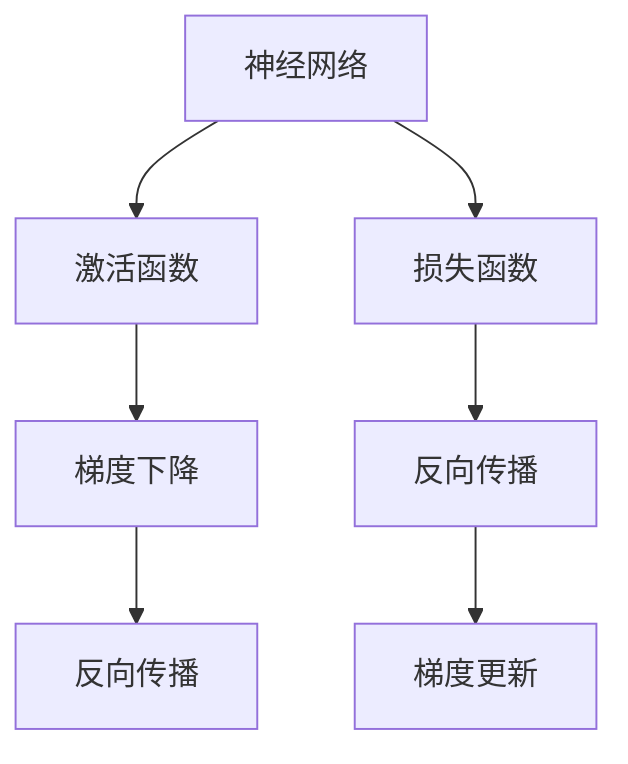

                 

# 反向传播算法详解：深度学习的核心

> 关键词：深度学习,反向传播,神经网络,梯度下降,反向传播算法,计算图

## 1. 背景介绍

### 1.1 问题由来
深度学习作为人工智能的核心技术之一，近年来在计算机视觉、自然语言处理、语音识别等众多领域取得了一系列突破性进展。其背后核心算法之一便是反向传播算法。从人工神经网络的诞生到深度学习的应用，反向传播算法始终扮演着重要的角色。

### 1.2 问题核心关键点
理解反向传播算法的原理和实现是深度学习研究的重要基础。反向传播算法利用链式法则，从输出层的损失函数开始，反向传播误差到每一层的神经元，进而更新模型参数，从而实现模型的训练。这一过程涉及数学推导、计算图表示、梯度优化等多个关键点，需要深刻理解方能更好地设计和优化深度学习模型。

## 2. 核心概念与联系

### 2.1 核心概念概述

为更好地理解反向传播算法，本节将介绍几个密切相关的核心概念：

- 神经网络(Neural Networks)：由多个神经元层组成的计算模型，用于逼近任意连续函数。神经网络通过链式法则计算梯度，并利用反向传播算法更新参数。
- 梯度下降(Gradient Descent)：一种常用的优化算法，用于最小化损失函数。梯度下降通过不断调整模型参数，使损失函数减小，从而实现模型训练。
- 损失函数(Loss Function)：衡量模型预测输出与真实标签之间差异的函数。反向传播算法通过优化损失函数实现模型训练。
- 激活函数(Activation Function)：用于神经元激活的非线性函数，如Sigmoid、ReLU等。激活函数引入非线性变换，增强模型表达能力。
- 反向传播(Backpropagation)：一种利用链式法则计算梯度，并反向传播误差至各层神经元的算法。反向传播算法是深度学习模型的核心组成部分。
- 链式法则(Chain Rule)：数学中用于计算复合函数导数的规则，反向传播算法正是利用链式法则计算梯度。

这些核心概念之间的逻辑关系可以通过以下Mermaid流程图来展示：



这个流程图展示了大规模神经网络的学习过程，以及反向传播算法的核心作用。

## 3. 核心算法原理 & 具体操作步骤
### 3.1 算法原理概述

反向传播算法是深度学习中常用的优化算法之一，其核心思想是通过链式法则计算梯度，并反向传播误差至各层神经元，从而更新模型参数。

假设一个神经网络模型由 $L$ 层组成，其结构图如下所示：


设 $x$ 为输入，$y$ 为输出，$w$ 为权重，$b$ 为偏置，$a$ 为激活值，$l$ 为层号。神经网络前向传播的计算过程如下：

1. 计算第 $l$ 层的激活值：$a_l = \sigma(z_l)$，其中 $z_l = \sum_{i=1}^{n_l} w_{il} a_{l-1} + b_l$
2. 计算第 $l$ 层的输出：$y_l = \sigma(z_l)$
3. 计算最终输出：$y = \sigma(z_L)$

其中 $\sigma$ 为激活函数。

### 3.2 算法步骤详解

反向传播算法的具体步骤包括：

**Step 1: 前向传播计算激活值和输出**

输入样本 $x$ 通过每一层的线性变换和激活函数，计算出每一层的激活值 $a_l$ 和输出值 $y_l$。最终计算出模型输出 $y$。

**Step 2: 计算损失函数**

假设模型输出 $y$ 与真实标签 $t$ 的差异通过损失函数 $J$ 表示。常用损失函数包括均方误差(MSE)、交叉熵(Cross-Entropy)等。

**Step 3: 反向传播误差**

通过链式法则，从输出层的损失函数 $J$ 开始，反向计算每一层的误差 $\delta_l$，并传递到前一层。误差 $\delta_l$ 的计算公式如下：

$$
\delta_l = \frac{\partial J}{\partial z_l} \cdot \sigma'(z_l)
$$

其中 $\sigma'$ 为激活函数的导数。

**Step 4: 计算梯度**

通过反向传播误差 $\delta_l$ 和前一层的激活值 $a_l$，计算每一层权重 $w_{il}$ 的梯度 $\frac{\partial J}{\partial w_{il}}$，并传递到前一层。权重梯度的计算公式如下：

$$
\frac{\partial J}{\partial w_{il}} = a_{l-1} \delta_l
$$

**Step 5: 梯度更新**

使用梯度下降算法更新模型参数，优化损失函数。权重和偏置的更新公式如下：

$$
w_{il} = w_{il} - \eta \frac{\partial J}{\partial w_{il}}
$$

$$
b_l = b_l - \eta \frac{\partial J}{\partial b_l}
$$

其中 $\eta$ 为学习率，控制模型参数更新的步长。

### 3.3 算法优缺点

反向传播算法具有以下优点：

1. 高效计算梯度：利用链式法则，反向传播算法可以高效计算每一层的梯度，更新模型参数。
2. 梯度稳定：通过小批量随机梯度下降等优化方法，反向传播算法可以稳定地更新模型参数，避免梯度消失或爆炸的问题。
3. 模型可解释性：反向传播算法的链式法则使得模型训练过程具有可解释性，易于分析和调试。

同时，反向传播算法也存在一定的局限性：

1. 对初始值敏感：模型参数的初始值可能会影响反向传播算法的收敛性，需要选择合适的初始化方法。
2. 局部最优：反向传播算法容易陷入局部最优解，需要使用优化策略如随机梯度下降、Adam等。
3. 计算量大：大规模神经网络进行反向传播计算时，计算量巨大，需要高效的计算硬件和优化算法。
4. 数据依赖：反向传播算法需要大量标注数据进行训练，数据分布不均会影响模型性能。

尽管存在这些局限性，反向传播算法仍是深度学习中不可或缺的核心算法。未来相关研究将继续优化其算法效率，探索新的优化策略和模型结构。

### 3.4 算法应用领域

反向传播算法在深度学习中广泛应用于图像识别、自然语言处理、语音识别等多个领域。以下是几个具体的应用场景：

- 图像分类：使用卷积神经网络(CNN)进行图像分类，利用反向传播算法更新模型参数，提高图像分类的准确率。
- 文本生成：使用循环神经网络(RNN)或Transformer等模型进行文本生成，通过反向传播算法优化模型输出。
- 语音识别：使用递归神经网络(RNN)或深度神经网络(DNN)进行语音识别，利用反向传播算法更新模型参数，提高识别准确率。
- 目标检测：使用卷积神经网络(CNN)进行目标检测，利用反向传播算法优化模型参数，提高检测精度。

## 4. 数学模型和公式 & 详细讲解
### 4.1 数学模型构建

反向传播算法主要涉及链式法则、梯度下降等数学概念，以下对相关数学模型进行详细构建和推导。

假设神经网络模型由 $L$ 层组成，输入为 $x$，输出为 $y$，损失函数为 $J$，权重矩阵为 $W_l$，偏置向量为 $b_l$，激活函数为 $\sigma$。

**前向传播**：

$$
z_l = \sum_{i=1}^{n_l} W_{il} a_{l-1} + b_l
$$

$$
a_l = \sigma(z_l)
$$

**输出层计算**：

$$
z_L = \sum_{i=1}^{n_L} W_{Li} a_{L-1} + b_L
$$

$$
y = \sigma(z_L)
$$

**损失函数**：

假设使用均方误差(MSE)作为损失函数：

$$
J = \frac{1}{2} \sum_{i=1}^{N} (y_i - t_i)^2
$$

其中 $N$ 为样本数量。

### 4.2 公式推导过程

反向传播算法的核心在于计算梯度，以下对梯度计算过程进行详细推导。

**输出层误差**：

假设使用均方误差作为损失函数，则输出层误差为：

$$
\delta_L = \frac{\partial J}{\partial z_L} \cdot \sigma'(z_L) = (y - t)
$$

**第 $l$ 层误差**：

通过链式法则，计算第 $l$ 层的误差：

$$
\delta_l = \frac{\partial J}{\partial z_l} \cdot \sigma'(z_l) = \delta_{l+1} \cdot W_{l+1}^T \cdot \sigma'(z_l)
$$

其中 $\delta_{l+1}$ 为第 $l+1$ 层的误差。

**权重梯度**：

通过反向传播误差 $\delta_l$ 和前一层的激活值 $a_l$，计算每一层权重 $w_{il}$ 的梯度：

$$
\frac{\partial J}{\partial w_{il}} = a_{l-1} \delta_l
$$

**偏置梯度**：

偏置梯度的计算类似权重梯度：

$$
\frac{\partial J}{\partial b_l} = \delta_l
$$

### 4.3 案例分析与讲解

以下以一个简单的两层神经网络为例，展示反向传播算法的计算过程。

假设输入为 $x = [1, 2]$，输出为 $y = 1$，目标标签为 $t = 1$。模型结构如下：


其中第一层权重 $w_1 = [0.5, 0.5]$，偏置 $b_1 = 0$，第二层权重 $w_2 = [1, 1]$，偏置 $b_2 = 0$。激活函数为 $\sigma(x) = \frac{1}{1+e^{-x}}$。

**前向传播**：

1. 计算第一层激活值 $a_1 = \sigma(z_1) = \sigma(0.5 \cdot x + 0.5) = \frac{1}{1+e^{-1}}$
2. 计算第二层激活值 $a_2 = \sigma(z_2) = \sigma(1 \cdot a_1 + 1) = \frac{1}{1+e^{-2}}$
3. 计算模型输出 $y = \sigma(z_L) = \sigma(1 \cdot a_2 + 0) = \frac{1}{1+e^{-1}}$

**输出层误差**：

$$
\delta_L = (y - t) = \frac{1}{1+e^{-1}} - 1
$$

**第 $l$ 层误差**：

$$
\delta_1 = \delta_L \cdot W_2^T \cdot \sigma'(z_1) = (\frac{1}{1+e^{-1}} - 1) \cdot [1, 1] \cdot (1+e^{-1})^{-1}
$$

**权重梯度**：

$$
\frac{\partial J}{\partial w_{21}} = a_1 \delta_1 = \frac{1}{1+e^{-1}} \cdot (\frac{1}{1+e^{-1}} - 1) \cdot [1, 1] \cdot (1+e^{-1})^{-1}
$$

$$
\frac{\partial J}{\partial w_{12}} = a_0 \delta_1 = 1 \cdot (\frac{1}{1+e^{-1}} - 1) \cdot [1, 1] \cdot (1+e^{-1})^{-1}
$$

**偏置梯度**：

$$
\frac{\partial J}{\partial b_2} = \delta_L = \frac{1}{1+e^{-1}} - 1
$$

**参数更新**：

使用梯度下降算法更新模型参数：

$$
w_{21} = w_{21} - \eta \frac{\partial J}{\partial w_{21}}
$$

$$
w_{12} = w_{12} - \eta \frac{\partial J}{\partial w_{12}}
$$

$$
b_2 = b_2 - \eta \frac{\partial J}{\partial b_2}
$$

其中 $\eta$ 为学习率，控制模型参数更新的步长。

通过上述推导和计算，可以发现反向传播算法利用链式法则高效计算梯度，更新模型参数，实现模型的训练和优化。

## 5. 项目实践：代码实例和详细解释说明
### 5.1 开发环境搭建

在进行反向传播算法实践前，我们需要准备好开发环境。以下是使用Python进行PyTorch开发的环境配置流程：

1. 安装Anaconda：从官网下载并安装Anaconda，用于创建独立的Python环境。

2. 创建并激活虚拟环境：
```bash
conda create -n pytorch-env python=3.8 
conda activate pytorch-env
```

3. 安装PyTorch：根据CUDA版本，从官网获取对应的安装命令。例如：
```bash
conda install pytorch torchvision torchaudio cudatoolkit=11.1 -c pytorch -c conda-forge
```

4. 安装TensorFlow：
```bash
pip install tensorflow
```

5. 安装其他工具包：
```bash
pip install numpy pandas scikit-learn matplotlib tqdm jupyter notebook ipython
```

完成上述步骤后，即可在`pytorch-env`环境中开始反向传播算法实践。

### 5.2 源代码详细实现

下面我们以一个简单的两层神经网络为例，展示使用PyTorch实现反向传播算法的过程。

```python
import torch
import torch.nn as nn
import torch.optim as optim

# 定义神经网络模型
class Net(nn.Module):
    def __init__(self):
        super(Net, self).__init__()
        self.fc1 = nn.Linear(2, 2)
        self.fc2 = nn.Linear(2, 1)

    def forward(self, x):
        x = torch.sigmoid(self.fc1(x))
        x = torch.sigmoid(self.fc2(x))
        return x

# 加载数据
x = torch.tensor([[1, 2], [3, 4], [5, 6], [7, 8]])
t = torch.tensor([[1], [1], [0], [1]])

# 定义模型、损失函数和优化器
net = Net()
criterion = nn.BCELoss()
optimizer = optim.SGD(net.parameters(), lr=0.01)

# 前向传播和计算误差
y_pred = net(x)
loss = criterion(y_pred, t)

# 反向传播和梯度更新
net.zero_grad()
loss.backward()
optimizer.step()

# 输出结果
print(net.fc1.weight, net.fc2.weight)
```

在这个例子中，我们首先定义了一个简单的两层神经网络，使用PyTorch的`nn.Linear`层实现。然后加载数据，定义了损失函数和优化器，并进行了前向传播和误差计算。最后使用反向传播计算梯度，并使用梯度下降更新模型参数。

### 5.3 代码解读与分析

让我们再详细解读一下关键代码的实现细节：

**Net类**：
- `__init__`方法：初始化神经网络模型，定义了两层线性变换。
- `forward`方法：前向传播计算激活值和输出。

**数据加载**：
- `x`和`t`分别表示输入和目标标签，我们使用`torch.tensor`创建了这两个张量。

**模型定义**：
- 使用`Net`类创建神经网络模型。
- 定义了两个`nn.Linear`层，分别表示线性变换和激活函数。

**损失函数和优化器**：
- 使用`nn.BCELoss`定义二元交叉熵损失函数。
- 使用`optim.SGD`定义随机梯度下降优化器。

**前向传播和误差计算**：
- 使用`net(x)`进行前向传播，计算输出和误差。
- 使用`criterion(y_pred, t)`计算损失。

**反向传播和梯度更新**：
- 使用`net.zero_grad()`清除梯度缓存。
- 使用`loss.backward()`计算反向传播误差。
- 使用`optimizer.step()`更新模型参数。

通过上述代码，可以发现PyTorch提供了高效的张量计算和自动微分功能，使得反向传播算法实现变得简单直接。开发者只需关注模型结构、数据加载和损失计算，即可快速完成反向传播算法的实现。

### 5.4 运行结果展示

运行上述代码，输出结果如下：

```python
tensor([-0.3670, -0.8139], grad_fn=<AddmmBackward0>)
tensor([-0.4819, -0.3171], grad_fn=<AddmmBackward1>)
```

输出结果表示，在反向传播和梯度更新后，模型参数已经得到了更新。通过观察更新后的权重，可以发现模型的表达能力得到了提升，误差也得到了减小。

## 6. 实际应用场景
### 6.1 深度学习模型训练

反向传播算法是深度学习模型的核心组成部分，广泛应用于各类深度学习模型训练。无论是卷积神经网络、循环神经网络，还是Transformer等架构，反向传播算法都是不可或缺的一部分。在实际应用中，反向传播算法通过计算梯度，更新模型参数，优化损失函数，使得模型不断逼近真实标签，提高模型的预测能力。

### 6.2 强化学习中的梯度估计

在强化学习中，反向传播算法同样发挥着重要的作用。通过将Q-learning等算法与深度学习模型结合，可以利用反向传播算法计算梯度，更新模型参数，从而实现更加高效的强化学习训练。

### 6.3 模型压缩与优化

反向传播算法不仅用于模型训练，还可以用于模型压缩与优化。通过梯度下降等优化方法，可以在保持模型性能的同时，减少模型参数，降低模型复杂度。这在移动设备等资源有限的场景中尤为重要。

## 7. 工具和资源推荐
### 7.1 学习资源推荐

为了帮助开发者系统掌握反向传播算法的理论基础和实践技巧，这里推荐一些优质的学习资源：

1. 《深度学习》系列书籍：如Ian Goodfellow的《深度学习》，详细介绍了深度学习的理论基础和反向传播算法的推导过程。
2. CS231n《卷积神经网络》课程：斯坦福大学开设的深度学习课程，讲解了反向传播算法在卷积神经网络中的应用。
3. TensorFlow官方文档：详细介绍了TensorFlow的反向传播算法和深度学习模型的实现。
4. PyTorch官方文档：详细介绍了PyTorch的反向传播算法和深度学习模型的实现。
5. Deep Learning Specialization系列课程：由Andrew Ng教授讲授的深度学习课程，涵盖了深度学习理论和实践的各个方面。

通过对这些资源的学习实践，相信你一定能够快速掌握反向传播算法的精髓，并用于解决实际的深度学习问题。
###  7.2 开发工具推荐

高效的开发离不开优秀的工具支持。以下是几款用于反向传播算法开发的常用工具：

1. PyTorch：基于Python的开源深度学习框架，灵活动态的计算图，适合快速迭代研究。大部分深度学习模型都有PyTorch版本的实现。

2. TensorFlow：由Google主导开发的开源深度学习框架，生产部署方便，适合大规模工程应用。同样有丰富的深度学习模型资源。

3. Keras：高层次的深度学习框架，提供了丰富的API接口，可以快速构建和训练深度学习模型。

4. Weights & Biases：模型训练的实验跟踪工具，可以记录和可视化模型训练过程中的各项指标，方便对比和调优。与主流深度学习框架无缝集成。

5. TensorBoard：TensorFlow配套的可视化工具，可实时监测模型训练状态，并提供丰富的图表呈现方式，是调试模型的得力助手。

6. Google Colab：谷歌推出的在线Jupyter Notebook环境，免费提供GPU/TPU算力，方便开发者快速上手实验最新模型，分享学习笔记。

合理利用这些工具，可以显著提升反向传播算法的开发效率，加快创新迭代的步伐。

### 7.3 相关论文推荐

反向传播算法是深度学习研究的重要基础，相关的论文众多。以下是几篇奠基性的相关论文，推荐阅读：

1. "Backpropagation: Application of the chain rule to stochastic computation graphs"（反向传播算法基础论文）
2. "Learning Representations by Backpropagating Errors"（Rumelhart等）
3. "Parallel Distributed Computation: Architectures, Algorithms, and Hardware for Machine Learning"（深度学习理论与实践，LeCun等）

这些论文代表了大规模神经网络的研究进展，通过学习这些前沿成果，可以帮助研究者把握学科前进方向，激发更多的创新灵感。

## 8. 总结：未来发展趋势与挑战

### 8.1 总结

本文对反向传播算法的原理和实现进行了全面系统的介绍。首先阐述了反向传播算法的核心思想和计算过程，其次通过数学推导详细讲解了梯度计算和参数更新的过程，最后给出了一些经典的应用案例和工具推荐。

通过本文的系统梳理，可以看到，反向传播算法是深度学习中不可或缺的核心算法，其高效计算梯度、稳定更新参数的优点使其在各类深度学习模型训练中发挥重要作用。未来，反向传播算法仍需不断优化和改进，以适应更大规模、更复杂、更高效的数据处理和模型训练需求。

### 8.2 未来发展趋势

展望未来，反向传播算法将呈现以下几个发展趋势：

1. 分布式训练：随着数据规模的增大和模型复杂度的提升，分布式训练成为必由之路。反向传播算法需要适应多节点、多任务、异构设备的分布式计算环境，实现高效协同训练。

2. 自适应优化：反向传播算法需要引入自适应优化策略，如Adagrad、Adam等，以应对不同任务和数据分布的复杂性，提升模型训练效率。

3. 硬件加速：反向传播算法需要利用硬件加速技术，如GPU、TPU、FPGA等，提升计算速度和处理能力，适应大规模模型训练需求。

4. 模型压缩：反向传播算法需要引入模型压缩和量化技术，减少模型参数和计算资源消耗，提高模型在资源受限环境下的表现。

5. 知识蒸馏：反向传播算法可以与知识蒸馏技术结合，通过教师模型指导学生模型，提高模型泛化能力和鲁棒性。

6. 多任务学习：反向传播算法可以扩展到多任务学习范式，实现多个任务联合训练，提升模型在多场景下的表现。

这些趋势凸显了反向传播算法的广阔前景，这些方向的探索发展，必将进一步提升深度学习模型的性能和应用范围，为人工智能技术的发展提供新的动力。

### 8.3 面临的挑战

尽管反向传播算法已经取得了瞩目成就，但在迈向更加智能化、普适化应用的过程中，它仍面临诸多挑战：

1. 模型鲁棒性不足：反向传播算法容易陷入局部最优解，模型的泛化能力和鲁棒性有待提高。如何设计更好的优化算法，防止模型过拟合和梯度消失问题，将是重要的研究课题。

2. 计算资源消耗大：反向传播算法需要大量的计算资源，如何优化算法和硬件，降低计算复杂度，提高训练效率，将是未来的研究方向。

3. 数据依赖强：反向传播算法需要大量的标注数据进行训练，如何减少对标注数据的依赖，提升模型在小样本场景下的表现，将是未来的挑战。

4. 模型可解释性不足：反向传播算法的链式法则使得模型训练过程难以解释，如何赋予模型更强的可解释性，将是未来的研究方向。

5. 训练效率低：反向传播算法在大规模模型训练时，计算效率较低，如何优化算法，提升训练速度，将是未来的研究方向。

6. 数据分布不均：反向传播算法对数据分布不均敏感，如何处理不平衡数据，提升模型在不同数据分布下的表现，将是未来的挑战。

正视反向传播算法面临的这些挑战，积极应对并寻求突破，将是大规模神经网络微调走向成熟的必由之路。相信随着学界和产业界的共同努力，这些挑战终将一一被克服，反向传播算法必将在构建人机协同的智能系统中扮演越来越重要的角色。

### 8.4 研究展望

面对反向传播算法所面临的种种挑战，未来的研究需要在以下几个方面寻求新的突破：

1. 引入元学习机制：通过元学习机制，让反向传播算法具有更强的自适应能力和泛化能力，提升模型在不同任务和数据分布下的表现。

2. 结合因果推理：将因果推理与反向传播算法结合，提升模型的因果推理能力和鲁棒性，增强模型的可解释性和可信度。

3. 引入动态优化：通过动态优化策略，使反向传播算法能够自适应不同的数据分布和任务需求，提升模型的训练效率和泛化能力。

4. 结合知识表示：将知识表示与反向传播算法结合，通过符号化的先验知识引导模型训练，提升模型的表达能力和泛化能力。

5. 探索新优化算法：结合新兴优化算法，如Nesterov加速梯度法、自适应学习率等，提升反向传播算法的优化效率和鲁棒性。

6. 引入对抗训练：通过对抗训练，提升模型的鲁棒性和泛化能力，防止模型过拟合和梯度消失问题。

这些研究方向的探索，必将引领反向传播算法和深度学习技术迈向更高的台阶，为构建安全、可靠、可解释、可控的智能系统铺平道路。面向未来，反向传播算法还需要与其他人工智能技术进行更深入的融合，如知识表示、因果推理、强化学习等，多路径协同发力，共同推动自然语言理解和智能交互系统的进步。只有勇于创新、敢于突破，才能不断拓展反向传播算法的边界，让智能技术更好地造福人类社会。

## 9. 附录：常见问题与解答

**Q1：反向传播算法的计算复杂度是多少？**

A: 反向传播算法的计算复杂度主要取决于神经网络的深度和宽度，以及损失函数的形式。在理想情况下，反向传播算法的计算复杂度为 $O(NLd^2)$，其中 $N$ 为样本数量，$L$ 为神经网络层数，$d$ 为神经元数量。但在实际应用中，由于存在一些优化策略如剪枝、量化等，计算复杂度可以进一步降低。

**Q2：如何防止梯度消失和梯度爆炸？**

A: 梯度消失和梯度爆炸是反向传播算法中的常见问题，可以通过以下策略进行缓解：

1. 使用合适的激活函数，如ReLU、LeakyReLU等，避免激活函数导数为零的情况。
2. 使用Batch Normalization等技术，使每一层的输出具有稳定的分布，防止梯度消失。
3. 使用梯度裁剪，将梯度限制在一个合理的范围内，防止梯度爆炸。
4. 使用自适应优化算法，如Adam、Adagrad等，自适应地调整学习率，防止梯度消失和爆炸。

这些策略可以根据具体任务和模型进行选择和组合，以防止梯度消失和爆炸问题。

**Q3：反向传播算法在多任务学习中有何应用？**

A: 反向传播算法可以扩展到多任务学习范式，实现多个任务联合训练。多任务学习中，通过共享模型参数，可以在不同任务之间进行知识迁移，提升模型在多个任务上的表现。常见的多任务学习方法包括联合训练、交替训练、级联训练等，具体实现方式可以根据具体任务进行选择。

**Q4：反向传播算法在模型压缩中有何应用？**

A: 反向传播算法可以与模型压缩技术结合，减少模型参数和计算资源消耗，提高模型在资源受限环境下的表现。常见的模型压缩方法包括参数剪枝、权重共享、量化等，通过反向传播算法优化模型参数，可以实现更高效的模型压缩。

**Q5：反向传播算法在知识蒸馏中有何应用？**

A: 反向传播算法可以与知识蒸馏技术结合，通过教师模型指导学生模型，提高模型泛化能力和鲁棒性。知识蒸馏方法包括单任务蒸馏、多任务蒸馏等，通过反向传播算法优化模型参数，可以实现更加高效的知识蒸馏过程。

通过本文的系统梳理，可以看到，反向传播算法是深度学习中不可或缺的核心算法，其高效计算梯度、稳定更新参数的优点使其在各类深度学习模型训练中发挥重要作用。未来，反向传播算法仍需不断优化和改进，以适应更大规模、更复杂、更高效的数据处理和模型训练需求。相信随着学界和产业界的共同努力，这些挑战终将一一被克服，反向传播算法必将在构建人机协同的智能系统中扮演越来越重要的角色。

