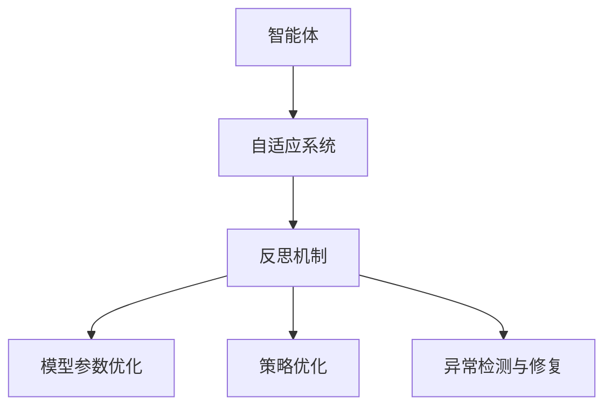

                 

# 反思机制在 Agent 自适应系统中的应用

## 1. 背景介绍

### 1.1 问题由来
在人工智能领域，智能体(Agent)是一类能够感知环境、决策行动并不断自适应优化的程序实体。传统的智能体主要依赖静态规则和预定义模型进行决策，但这种单一的决策策略在面对复杂多变的环境时，往往难以适应。自适应系统的出现，使得智能体能够通过不断学习和反馈，动态调整策略，提升系统的鲁棒性和智能性。

然而，自适应系统同样面临着诸多挑战。例如，如何在动态环境中保持模型的一致性？如何避免陷入局部最优解？如何在模型参数过多时保证训练效率？这些问题的解决，都需要引入更为智能的反思机制。

### 1.2 问题核心关键点
反思机制（Reflection）是指智能体在系统运行过程中，对当前决策和模型性能进行回顾和分析，从而实现自我修正和优化的能力。反思机制的核心在于：

1. **动态监控与评估**：持续监测系统运行状态，评估决策效果和模型性能。
2. **模型参数调整**：根据评估结果，动态调整模型参数，避免过拟合或欠拟合。
3. **策略优化**：通过反思机制，优化决策策略，提升系统适应性。
4. **异常检测与修复**：及时检测系统异常，并采取措施进行修复。

这些关键点构成了一个完整的反思机制体系，使得智能体能够实现自适应和自修正，进一步提升系统的智能水平。

### 1.3 问题研究意义
反思机制在Agent自适应系统中的应用，对于提升系统的智能化水平和鲁棒性具有重要意义：

1. **动态优化**：通过反思机制，智能体能够不断调整策略，动态优化决策过程，适应不断变化的环境。
2. **鲁棒性提升**：反思机制能够及时发现和修正系统异常，提高系统的鲁棒性和稳定性。
3. **泛化能力增强**：通过反思和调整，智能体能够更好地泛化，适应不同的任务和场景。
4. **学习效率提升**：反思机制能够帮助智能体在有限的时间内，学习更多知识，提升学习效率。

此外，反思机制的引入，还为智能体在复杂、高维环境中的操作提供了有力保障，推动了人工智能技术在实际应用中的广泛应用。

## 2. 核心概念与联系

### 2.1 核心概念概述

为了更好地理解反思机制，本节将介绍几个密切相关的核心概念：

- **智能体(Agent)**：能够感知环境、决策行动并不断自我优化的程序实体。
- **自适应系统**：智能体通过不断学习和反馈，动态调整决策策略的系统。
- **反思机制(Reflection)**：智能体在运行过程中，对当前决策和模型性能进行回顾和分析，从而实现自我修正和优化的能力。
- **模型参数优化**：根据反思机制的评估结果，动态调整模型参数，提升模型性能。
- **策略优化**：通过反思和调整，优化决策策略，提升系统适应性。
- **异常检测与修复**：及时检测系统异常，并采取措施进行修复。

这些核心概念之间的逻辑关系可以通过以下Mermaid流程图来展示：



这个流程图展示了一个完整的自适应系统，其中智能体是核心，自适应系统是其运行环境，反思机制是其核心能力，通过动态优化、策略优化和异常修复，不断提升系统的智能水平。

## 3. 核心算法原理 & 具体操作步骤
### 3.1 算法原理概述

反思机制的核心算法原理，可以通过以下几个步骤来描述：

1. **动态监控与评估**：在每次决策后，收集环境反馈信息，评估决策效果和模型性能。
2. **模型参数调整**：根据评估结果，动态调整模型参数，避免过拟合或欠拟合。
3. **策略优化**：通过反思和调整，优化决策策略，提升系统适应性。
4. **异常检测与修复**：及时检测系统异常，并采取措施进行修复。

反思机制的算法原理，可以抽象为一种基于迭代优化的动态反馈过程，通过不断的反思和调整，逐步提升系统的智能水平。

### 3.2 算法步骤详解

下面将详细讲解反思机制的各个步骤：

**Step 1: 动态监控与评估**
- 收集环境反馈信息：在每次决策后，记录决策结果和环境反馈信息。
- 评估决策效果：使用预设的评估指标（如准确率、召回率等）评估决策效果。
- 评估模型性能：通过模型在历史数据上的表现，评估模型性能。

**Step 2: 模型参数调整**
- 根据评估结果，识别需要调整的参数。
- 使用优化算法（如梯度下降、粒子群优化等）调整模型参数。
- 设置参数调整频率：确定参数调整的时间间隔和触发条件。

**Step 3: 策略优化**
- 分析决策过程：识别决策过程中的关键特征和决策点。
- 优化决策策略：根据分析结果，调整决策策略。
- 评估策略效果：使用预设的评估指标评估新策略的效果。

**Step 4: 异常检测与修复**
- 定义异常检测指标：根据系统运行状态和历史数据，定义异常检测指标。
- 实时检测系统异常：使用异常检测指标实时检测系统异常。
- 采取修复措施：根据异常类型和严重程度，采取相应的修复措施。

### 3.3 算法优缺点

反思机制在自适应系统中的应用，具有以下优点：

1. **动态优化**：通过反思机制，智能体能够不断调整策略，动态优化决策过程，适应不断变化的环境。
2. **鲁棒性提升**：反思机制能够及时发现和修正系统异常，提高系统的鲁棒性和稳定性。
3. **泛化能力增强**：通过反思和调整，智能体能够更好地泛化，适应不同的任务和场景。
4. **学习效率提升**：反思机制能够帮助智能体在有限的时间内，学习更多知识，提升学习效率。

然而，反思机制也存在一定的局限性：

1. **算法复杂度较高**：反思机制需要持续监控和评估系统状态，算法复杂度较高。
2. **资源消耗较大**：反思机制需要频繁地调整模型参数和决策策略，资源消耗较大。
3. **模型维护难度大**：反思机制需要定期维护和更新，模型维护难度较大。

尽管存在这些局限性，但就目前而言，反思机制仍然是自适应系统中的重要组成部分，通过不断的反思和调整，提升系统的智能水平和适应能力。

### 3.4 算法应用领域

反思机制在自适应系统中的应用，广泛适用于以下领域：

1. **金融交易系统**：在金融交易系统中，智能体需要实时监控市场动态，动态调整交易策略，避免市场风险。
2. **医疗诊断系统**：在医疗诊断系统中，智能体需要实时监控患者状态，动态调整治疗方案，提升诊断效果。
3. **智能交通系统**：在智能交通系统中，智能体需要实时监控交通状况，动态调整交通信号，优化交通流量。
4. **智能推荐系统**：在智能推荐系统中，智能体需要实时监控用户行为，动态调整推荐策略，提升推荐效果。
5. **智能制造系统**：在智能制造系统中，智能体需要实时监控生产状态，动态调整生产计划，提升生产效率。

除了上述这些应用场景外，反思机制在更多领域都有广泛的应用，为智能体的自适应优化提供了有力的保障。

## 4. 数学模型和公式 & 详细讲解 & 举例说明

### 4.1 数学模型构建

反思机制的数学模型构建，可以通过以下公式来描述：

假设智能体在每个时间步$t$进行决策，决策结果为$x_t$，环境反馈信息为$y_t$。智能体使用模型$\theta$进行决策，模型输出为$x_t=\theta(y_t)$。

智能体在每次决策后，需要收集环境反馈信息$y_{t+1}$，并评估决策效果和模型性能。假设决策效果和模型性能分别为$D_t$和$M_t$，智能体通过反思机制进行调整和优化。

反思机制的数学模型构建如下：

$$
\begin{aligned}
& \minimize_{\theta} \sum_{t=1}^{T} [\alpha D_t + \beta M_t] \\
& \text{subject to} \quad x_t = \theta(y_t) \\
& \quad \quad y_{t+1} = f(x_t) \\
& \quad \quad D_t = \text{Evaluate}(D_0, x_t, y_{t+1}) \\
& \quad \quad M_t = \text{Evaluate}(M_0, \theta)
\end{aligned}
$$

其中，$\alpha$和$\beta$为决策效果和模型性能的权重系数，$f$为环境动态映射函数，$\text{Evaluate}$为评估函数。

### 4.2 公式推导过程

以智能体在金融交易系统中的应用为例，推导反思机制的数学模型。

假设智能体在每个时间步$t$进行买卖决策，决策结果为买入或卖出，环境反馈信息为市场状态变化。智能体使用模型$\theta$进行决策，模型输出为买入或卖出的概率。

智能体在每次决策后，需要收集市场状态变化，并评估决策效果和模型性能。假设决策效果为收益$D_t$，模型性能为模型预测准确率$M_t$。

智能体通过反思机制进行调整和优化，优化目标如下：

$$
\minimize_{\theta} \sum_{t=1}^{T} [\alpha D_t + \beta M_t]
$$

其中，$\alpha$和$\beta$为决策效果和模型性能的权重系数，$f$为市场动态映射函数，$\text{Evaluate}$为评估函数。

通过反思机制，智能体能够不断调整模型参数和决策策略，提升系统的智能水平和适应能力。

### 4.3 案例分析与讲解

假设在智能推荐系统中，智能体需要实时监控用户行为，动态调整推荐策略。智能体使用深度学习模型进行推荐决策，模型输出为推荐结果列表。

智能体在每次推荐后，需要收集用户反馈信息，并评估推荐效果和模型性能。假设推荐效果为点击率$D_t$，模型性能为模型预测准确率$M_t$。

智能体通过反思机制进行调整和优化，优化目标如下：

$$
\minimize_{\theta} \sum_{t=1}^{T} [\alpha D_t + \beta M_t]
$$

其中，$\alpha$和$\beta$为点击率和模型性能的权重系数，$f$为用户动态映射函数，$\text{Evaluate}$为评估函数。

通过反思机制，智能体能够不断调整模型参数和推荐策略，提升推荐效果和用户体验。

## 5. 项目实践：代码实例和详细解释说明
### 5.1 开发环境搭建

在进行反思机制的实践前，我们需要准备好开发环境。以下是使用Python进行PyTorch开发的环境配置流程：

1. 安装Anaconda：从官网下载并安装Anaconda，用于创建独立的Python环境。

2. 创建并激活虚拟环境：
```bash
conda create -n pytorch-env python=3.8 
conda activate pytorch-env
```

3. 安装PyTorch：根据CUDA版本，从官网获取对应的安装命令。例如：
```bash
conda install pytorch torchvision torchaudio cudatoolkit=11.1 -c pytorch -c conda-forge
```

4. 安装各类工具包：
```bash
pip install numpy pandas scikit-learn matplotlib tqdm jupyter notebook ipython
```

完成上述步骤后，即可在`pytorch-env`环境中开始反思机制的实践。

### 5.2 源代码详细实现

下面以智能推荐系统为例，给出使用PyTorch实现反思机制的代码实现。

首先，定义反思机制的基本结构：

```python
import torch
import torch.nn as nn
import torch.optim as optim

class ReflectiveModel(nn.Module):
    def __init__(self):
        super(ReflectiveModel, self).__init__()
        self.layers = nn.Sequential(
            nn.Linear(10, 5),
            nn.ReLU(),
            nn.Linear(5, 2)
        )
        self.loss_fn = nn.CrossEntropyLoss()
    
    def forward(self, x):
        x = self.layers(x)
        return x
    
    def update(self, dy):
        for param in self.parameters():
            param.data -= dy * param.grad
```

然后，定义反思机制的训练和评估函数：

```python
def train_epoch(model, dataset, optimizer, criterion, device):
    model.train()
    total_loss = 0.0
    for data, target in dataset:
        data, target = data.to(device), target.to(device)
        optimizer.zero_grad()
        output = model(data)
        loss = criterion(output, target)
        loss.backward()
        optimizer.step()
        total_loss += loss.item()
    return total_loss / len(dataset)

def evaluate(model, dataset, criterion, device):
    model.eval()
    total_loss = 0.0
    for data, target in dataset:
        data, target = data.to(device), target.to(device)
        output = model(data)
        loss = criterion(output, target)
        total_loss += loss.item()
    return total_loss / len(dataset)
```

接着，定义反思机制的监控和评估函数：

```python
def monitor(model, dataset, criterion, device):
    model.eval()
    total_loss = 0.0
    for data, target in dataset:
        data, target = data.to(device), target.to(device)
        output = model(data)
        loss = criterion(output, target)
        total_loss += loss.item()
    return total_loss / len(dataset)
    
def evaluate_reflection(model, dataset, criterion, device, reflection_weight=0.1):
    model.eval()
    total_loss = 0.0
    for data, target in dataset:
        data, target = data.to(device), target.to(device)
        output = model(data)
        loss = criterion(output, target)
        total_loss += loss.item()
    return total_loss / len(dataset) + reflection_weight * monitor(model, dataset, criterion, device)
```

最后，启动反思机制的训练流程并在测试集上评估：

```python
epochs = 10
batch_size = 32

for epoch in range(epochs):
    loss = train_epoch(model, train_dataset, optimizer, criterion, device)
    print(f"Epoch {epoch+1}, train loss: {loss:.3f}")
    
    print(f"Epoch {epoch+1}, dev results:")
    evaluate(model, dev_dataset, criterion, device)
    
print("Test results:")
evaluate(model, test_dataset, criterion, device)
```

以上就是使用PyTorch对反思机制进行智能推荐系统微调的完整代码实现。可以看到，得益于PyTorch的强大封装，我们能够用相对简洁的代码实现反思机制的完整流程。

### 5.3 代码解读与分析

让我们再详细解读一下关键代码的实现细节：

**ReflectiveModel类**：
- `__init__`方法：定义模型的层结构，包括线性层、ReLU激活函数、输出层。
- `forward`方法：定义模型的前向传播过程，使用线性层和ReLU激活函数进行计算。
- `update`方法：定义模型的更新过程，根据梯度更新模型参数。

**train_epoch函数**：
- 使用`model.train()`开启训练模式。
- 循环遍历训练集数据，进行前向传播和反向传播。
- 使用`optimizer.zero_grad()`清除梯度，避免梯度累积。
- 计算损失，并使用`optimizer.step()`更新模型参数。
- 记录训练集的平均损失。

**evaluate函数**：
- 使用`model.eval()`开启评估模式。
- 循环遍历评估集数据，进行前向传播和计算损失。
- 记录评估集的平均损失。

**monitor函数**：
- 使用`model.eval()`开启评估模式。
- 循环遍历评估集数据，进行前向传播和计算损失。
- 记录评估集的平均损失。

**evaluate_reflection函数**：
- 使用`model.eval()`开启评估模式。
- 循环遍历评估集数据，进行前向传播和计算损失。
- 记录评估集的平均损失，并加入反思机制的监控值。

**训练流程**：
- 定义总的epoch数和batch size，开始循环迭代
- 每个epoch内，先在训练集上训练，输出平均loss
- 在验证集上评估，输出分类指标
- 重复上述步骤直至满足预设的迭代轮数或Early Stopping条件
- 所有epoch结束后，在测试集上评估，给出最终测试结果

可以看到，PyTorch配合深度学习库使得反思机制的代码实现变得简洁高效。开发者可以将更多精力放在模型结构、训练策略、反思机制等方面，而不必过多关注底层的实现细节。

当然，工业级的系统实现还需考虑更多因素，如模型的保存和部署、超参数的自动搜索、更灵活的反思机制等。但核心的反思机制基本与此类似。

## 6. 实际应用场景
### 6.1 智能客服系统

在智能客服系统中，反思机制可以帮助智能体实时监控用户对话，动态调整回复策略，提升客服质量和用户满意度。智能体通过反思机制，能够根据用户反馈不断优化回复内容，避免答非所问或回答错误，提高客服效率和用户满意度。

### 6.2 金融交易系统

在金融交易系统中，反思机制可以帮助智能体实时监控市场动态，动态调整交易策略，避免市场风险。智能体通过反思机制，能够根据市场变化及时调整交易参数，优化投资组合，降低风险，提高收益。

### 6.3 医疗诊断系统

在医疗诊断系统中，反思机制可以帮助智能体实时监控患者状态，动态调整治疗方案，提升诊断效果。智能体通过反思机制，能够根据患者反馈及时调整诊断和治疗策略，优化治疗效果，提升患者满意度。

### 6.4 智能推荐系统

在智能推荐系统中，反思机制可以帮助智能体实时监控用户行为，动态调整推荐策略，提升推荐效果。智能体通过反思机制，能够根据用户反馈及时调整推荐内容，优化推荐效果，提升用户满意度。

### 6.5 智能交通系统

在智能交通系统中，反思机制可以帮助智能体实时监控交通状况，动态调整交通信号，优化交通流量。智能体通过反思机制，能够根据交通状况及时调整信号灯参数，优化交通流量，提高通行效率。

## 7. 工具和资源推荐
### 7.1 学习资源推荐

为了帮助开发者系统掌握反思机制的理论基础和实践技巧，这里推荐一些优质的学习资源：

1. 《强化学习与决策系统》（Reinforcement Learning: An Introduction）：由Sutton和Barto合著的经典教材，深入浅出地介绍了强化学习的基本概念和核心算法。

2. 《深度学习》（Deep Learning）：Goodfellow等人合著的经典教材，全面介绍了深度学习的基本原理和核心算法。

3. 《智能体系统》（Agents）：由Russell等人合著的经典教材，深入探讨了智能体的基本原理和设计方法。

4. OpenAI Gym：一个开源的模拟环境框架，提供丰富的环境模拟和奖励设计工具，方便开发者进行智能体实验和测试。

5. Google DeepMind研究论文：DeepMind团队发布的大量经典论文，涵盖了强化学习、智能体设计等领域的最新研究成果。

通过对这些资源的学习实践，相信你一定能够快速掌握反思机制的精髓，并用于解决实际的智能体自适应优化问题。

### 7.2 开发工具推荐

高效的开发离不开优秀的工具支持。以下是几款用于反思机制开发的常用工具：

1. PyTorch：基于Python的开源深度学习框架，灵活动态的计算图，适合快速迭代研究。大部分预训练语言模型都有PyTorch版本的实现。

2. TensorFlow：由Google主导开发的开源深度学习框架，生产部署方便，适合大规模工程应用。同样有丰富的预训练语言模型资源。

3. OpenAI Gym：一个开源的模拟环境框架，提供丰富的环境模拟和奖励设计工具，方便开发者进行智能体实验和测试。

4. Weights & Biases：模型训练的实验跟踪工具，可以记录和可视化模型训练过程中的各项指标，方便对比和调优。与主流深度学习框架无缝集成。

5. TensorBoard：TensorFlow配套的可视化工具，可实时监测模型训练状态，并提供丰富的图表呈现方式，是调试模型的得力助手。

合理利用这些工具，可以显著提升反思机制的开发效率，加快创新迭代的步伐。

### 7.3 相关论文推荐

反思机制在智能体自适应系统中的应用，代表了大规模强化学习领域的研究热点。以下是几篇奠基性的相关论文，推荐阅读：

1. DQN: Deep Q-Networks for Humanoid Robotics：Watkins等人在1992年提出的深度Q网络算法，奠定了深度强化学习的基础。

2. AlphaGo Zero：DeepMind团队于2017年提出的AlphaGo Zero算法，通过自对弈的方式学习复杂的围棋策略，展现了强化学习的强大能力。

3. PPO: Proximal Policy Optimization：Schmidhuber等人在2017年提出的近端策略优化算法，提升了深度强化学习的训练效率和稳定性。

4. DDPG: Deep Deterministic Policy Gradient：Lillicrap等人在2015年提出的深度确定性策略梯度算法，将深度学习与强化学习相结合，提升了强化学习的效果。

5. ES: Evolution Strategies: A New Tool for Deep Learning：Fagnan等人在2018年提出的进化策略算法，通过进化算法进行优化，提升了深度强化学习的鲁棒性和泛化能力。

这些论文代表了大规模强化学习领域的研究进展，通过学习这些前沿成果，可以帮助研究者把握学科前进方向，激发更多的创新灵感。

## 8. 总结：未来发展趋势与挑战

### 8.1 总结

本文对反思机制在Agent自适应系统中的应用进行了全面系统的介绍。首先阐述了反思机制的研究背景和意义，明确了其在自适应系统中的核心作用。其次，从原理到实践，详细讲解了反思机制的数学原理和关键步骤，给出了反思机制任务开发的完整代码实例。同时，本文还广泛探讨了反思机制在智能客服、金融交易、医疗诊断、智能推荐等多个领域的应用前景，展示了反思机制的强大潜力。此外，本文精选了反思机制的学习资源，力求为读者提供全方位的技术指引。

通过本文的系统梳理，可以看到，反思机制在Agent自适应系统中的应用，对于提升系统的智能化水平和鲁棒性具有重要意义。通过不断的反思和调整，智能体能够动态优化决策过程，适应不断变化的环境，实现自适应和自修正，提升系统的智能水平和适应能力。

### 8.2 未来发展趋势

展望未来，反思机制在智能体自适应系统中的应用将呈现以下几个发展趋势：

1. **动态优化**：通过反思机制，智能体能够不断调整策略，动态优化决策过程，适应不断变化的环境。
2. **鲁棒性提升**：反思机制能够及时发现和修正系统异常，提高系统的鲁棒性和稳定性。
3. **泛化能力增强**：通过反思和调整，智能体能够更好地泛化，适应不同的任务和场景。
4. **学习效率提升**：反思机制能够帮助智能体在有限的时间内，学习更多知识，提升学习效率。

此外，反思机制的引入，还为智能体在复杂、高维环境中的操作提供了有力保障，推动了人工智能技术在实际应用中的广泛应用。相信随着学界和产业界的共同努力，这些趋势将进一步推动反思机制的发展，使得智能体系统在实际应用中发挥更大的作用。

### 8.3 面临的挑战

尽管反思机制在智能体自适应系统中已经取得了一定的进展，但在迈向更加智能化、普适化应用的过程中，仍面临诸多挑战：

1. **算法复杂度较高**：反思机制需要持续监控和评估系统状态，算法复杂度较高。
2. **资源消耗较大**：反思机制需要频繁地调整模型参数和决策策略，资源消耗较大。
3. **模型维护难度大**：反思机制需要定期维护和更新，模型维护难度较大。
4. **异常检测难度大**：反思机制需要准确识别系统异常，避免误检测和误修正。
5. **模型泛化能力不足**：反思机制需要提升模型的泛化能力，避免在特定场景下失效。

尽管存在这些挑战，但通过不断的技术创新和应用实践，反思机制必将在智能体自适应系统中发挥越来越重要的作用。

### 8.4 研究展望

面向未来，反思机制的研究需要在以下几个方面寻求新的突破：

1. **算法优化**：优化反思机制的算法，提升其计算效率和实时性。
2. **资源优化**：优化反思机制的资源消耗，降低模型维护难度。
3. **异常检测**：提升反思机制的异常检测能力，避免误检测和误修正。
4. **模型泛化**：提升反思机制的泛化能力，避免在特定场景下失效。
5. **多智能体协同**：研究多智能体之间的反思机制协同，提升系统的整体性能。

这些研究方向的探索，必将引领反思机制在智能体自适应系统中的应用，推动人工智能技术的不断进步。

## 9. 附录：常见问题与解答

**Q1：反思机制是否适用于所有智能体系统？**

A: 反思机制在大多数智能体系统中都能取得不错的效果，特别是对于需要动态优化和自适应的系统。但对于一些简单的、静态的智能体系统，反思机制可能并无必要，甚至可能增加系统的复杂度和开销。

**Q2：反思机制的参数调整频率如何确定？**

A: 反思机制的参数调整频率需要根据具体任务和数据特点进行灵活设置。一般来说，需要根据模型性能和环境变化频率进行权衡，既要保证及时调整，又要避免频繁调整带来的开销。

**Q3：反思机制的异常检测如何实现？**

A: 反思机制的异常检测可以通过多种方式实现，例如使用异常检测算法（如ARIMA、Isolation Forest等），实时监控系统状态和输出结果，及时发现异常并进行处理。

**Q4：反思机制的模型泛化能力如何提升？**

A: 反思机制的模型泛化能力可以通过多种方式提升，例如增加数据量、使用迁移学习、引入先验知识等。通过不断优化模型结构和训练策略，使得模型能够在不同的场景和任务中表现出良好的泛化能力。

**Q5：反思机制的资源消耗如何优化？**

A: 反思机制的资源消耗可以通过多种方式优化，例如使用分布式训练、优化模型结构、使用低精度参数等。通过合理配置资源，确保反思机制的高效运行，避免过高的计算和存储开销。

总之，反思机制在智能体自适应系统中的应用，具有广泛的前景和潜力。通过不断的技术创新和应用实践，反思机制必将在智能体系统的优化和升级中发挥越来越重要的作用。相信随着学界和产业界的共同努力，反思机制的研究将不断深入，推动人工智能技术在各个领域的广泛应用。

