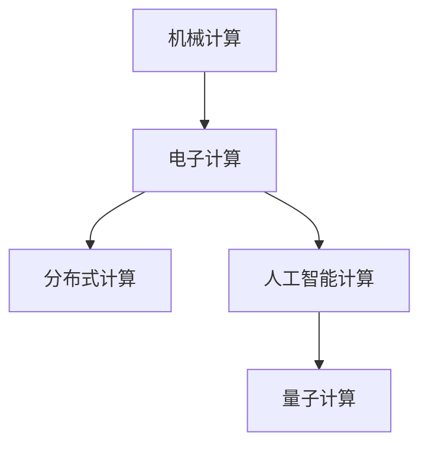

                 

# 回顾与展望：人类计算的发展历程与未来

## 1. 背景介绍

### 1.1 问题由来

计算技术的演进，是人类文明发展的重要推动力之一。自最早的算盘、机械计算装置到现代的电子计算机，每一次计算能力的飞跃，都带来了新一轮的技术革新和产业变革。特别是随着AI、大数据、量子计算等前沿技术的兴起，人类计算进入了全新的高度。

### 1.2 问题核心关键点

计算技术的发展，离不开对计算模型的深度理解和创新。回顾人类计算的历程，我们可以清晰地看到几个关键转折点：

1. **机械计算**：早期的机械计算装置如阿贝德松算盘、差分机等，虽然功能有限，但奠定了计算设备的基础。

2. **电子计算**：第二次世界大战期间，冯·诺依曼设计的EDVAC计算机，采用了二进制存储和串行计算的思想，奠定了现代计算机的架构。

3. **集成电路**：集成电路的发明，使得计算能力指数级提升，计算机开始大规模应用于商业和科学计算。

4. **网络化计算**：互联网的兴起，推动了分布式计算、云计算和网络计算的发展，使得计算资源可以按需分配和共享。

5. **人工智能**：深度学习和神经网络等技术的突破，使得计算机具备了越来越强大的智能计算能力，能够理解和生成自然语言，进行复杂决策。

6. **量子计算**：量子计算的探索，特别是量子模拟、量子优化等领域的研究，为计算模型带来了新的突破，有望在解决某些特定问题时实现计算速度的重大飞跃。

这些关键点，不仅展示了计算技术的发展脉络，也揭示了计算模型演变的基本规律。展望未来，我们必须深刻理解这些规律，才能把握计算技术的前沿趋势，推动其进一步发展。

### 1.3 问题研究意义

深入回顾人类计算的发展历程，具有重要的理论意义和实际价值：

1. **历史视角**：从历史的角度审视计算技术的发展，能够帮助我们理解技术演变的动因和内在逻辑，形成系统的知识体系。
2. **技术洞察**：通过对计算模型演变规律的深入分析，能够提炼出具有普遍性的技术和方法论，为当前的计算技术研究和应用提供借鉴。
3. **未来指引**：通过对未来计算技术趋势的预判，能够指导未来的技术研发和产业布局，推动计算技术的持续进步。

## 2. 核心概念与联系

### 2.1 核心概念概述

在讨论计算技术的发展历程时，我们需要关注几个关键概念：

- **机械计算**：指早期基于机械装置的计算方法，如算盘、机械计数器等。
- **电子计算**：指基于电子元件（如晶体管、集成电路）的计算方法，如真空管计算机、晶体管计算机等。
- **分布式计算**：指将计算任务分配到多台计算机上并行执行的计算方法，如云计算、网格计算等。
- **人工智能计算**：指将人工智能技术应用于计算模型中的方法，如深度学习、强化学习等。
- **量子计算**：指利用量子力学的原理进行计算的方法，如量子比特、量子算法等。

这些概念之间的逻辑关系可以通过以下Mermaid流程图来展示：



这个流程图展示了一些关键计算模型的演变路径，以及它们之间的联系和影响。

### 2.2 核心概念原理和架构

#### 2.2.1 机械计算

机械计算设备的工作原理是通过机械部件的物理运动来执行算术和逻辑运算。例如，阿贝德松算盘通过移动算珠来进行加减乘除等基本运算。其特点是计算速度慢、精度低，但结构简单，易于制造和维护。


#### 2.2.2 电子计算

电子计算设备的工作原理是通过电子元件（如晶体管、集成电路）来执行计算。例如，晶体管计算机通过晶体管的开关状态来表示二进制数，进行逻辑运算。其特点是计算速度快、精度高，但结构复杂，制造和维护成本高。


#### 2.2.3 分布式计算

分布式计算是将计算任务分解成多个子任务，分配到多台计算机上并行执行，最终将结果合并的方法。例如，云计算平台通过将计算任务分配到全球多个数据中心，实现大规模并行计算。其特点是计算资源可按需分配和共享，但需要解决数据传输、同步等问题。


#### 2.2.4 人工智能计算

人工智能计算是将人工智能技术（如深度学习、强化学习）应用于计算模型中的方法。例如，深度学习模型通过多层神经网络进行特征提取和分类，用于图像识别、自然语言处理等任务。其特点是具备强大的模式识别和预测能力，但模型复杂，训练和推理成本高。


#### 2.2.5 量子计算

量子计算是利用量子力学的原理进行计算的方法。例如，量子比特（qubit）通过叠加和纠缠状态来表示信息，进行量子运算。其特点是计算速度极快，理论上可以解决某些特定问题，但实现难度高，尚处于实验室研究阶段。


## 3. 核心算法原理 & 具体操作步骤

### 3.1 算法原理概述

计算技术的发展，离不开对计算模型的不断探索和创新。回顾人类计算的历程，我们可以发现几个基本的算法原理：

1. **递归与迭代**：递归和迭代是计算中常用的算法思想，通过反复执行相同的操作，逐步逼近问题的解。例如，分治算法和动态规划算法。

2. **并行计算**：并行计算是将计算任务分解成多个子任务，分配到多台计算机上并行执行的方法。例如，MapReduce算法和GPU并行计算。

3. **分布式计算**：分布式计算是将计算任务分配到多台计算机上并行执行，最终将结果合并的方法。例如，云计算和网格计算。

4. **模拟与仿真**：模拟与仿真是通过构建虚拟环境来模拟真实系统的运行状态，用于解决复杂的物理和工程问题。例如，分子动力学模拟和虚拟现实。

5. **优化与搜索**：优化与搜索是寻找最优解或可行解的方法。例如，遗传算法和模拟退火算法。

这些算法原理，不仅在历史时期发挥了重要作用，也为现代计算技术的发展奠定了基础。

### 3.2 算法步骤详解

下面以分布式计算为例，详细介绍其基本步骤：

1. **任务分解**：将一个大规模计算任务分解成多个子任务，分配到不同的计算节点上。例如，将大规模数据集划分成多个块，分别分配到多个数据节点上。

2. **数据传输**：将任务所需的数据从本地传输到远程节点。例如，通过网络协议（如TCP/IP）进行数据传输。

3. **并行计算**：在每个计算节点上，独立执行分配到的子任务。例如，使用MapReduce算法进行并行计算。

4. **结果合并**：将各个节点的计算结果合并，得到最终的结果。例如，将各个节点的中间结果写入分布式文件系统，进行合并和处理。

### 3.3 算法优缺点

#### 3.3.1 分布式计算的优点

1. **扩展性强**：计算资源可以按需分配和共享，满足不同规模和复杂度的计算需求。
2. **容错性好**：通过冗余和故障转移机制，保证系统的稳定性和可靠性。
3. **灵活性高**：可以灵活调整计算资源，优化计算效率和成本。

#### 3.3.2 分布式计算的缺点

1. **通信开销大**：数据传输和通信协议开销较大，影响计算效率。
2. **同步复杂**：需要解决节点间的数据同步和任务协调问题。
3. **资源管理复杂**：需要动态管理计算资源，确保资源利用率最大化。

### 3.4 算法应用领域

分布式计算广泛应用于科学计算、数据分析、云计算等领域：

1. **科学计算**：例如，天气预报、流体力学模拟、基因组分析等，需要处理海量数据和复杂计算任务。
2. **数据分析**：例如，大数据处理、社交网络分析、金融风险评估等，需要高效处理大规模数据。
3. **云计算**：例如，云存储、云服务、云安全等，需要提供按需计算资源和数据存储服务。

## 4. 数学模型和公式 & 详细讲解

### 4.1 数学模型构建

#### 4.1.1 线性回归模型

线性回归模型是一种常见的统计模型，用于描述因变量和自变量之间的关系。其数学表达式为：

$$
y = \theta_0 + \theta_1x_1 + \theta_2x_2 + ... + \theta_nx_n
$$

其中，$y$ 为因变量，$x_1, x_2, ..., x_n$ 为自变量，$\theta_0, \theta_1, ..., \theta_n$ 为模型参数。

#### 4.1.2 线性回归模型的求解

线性回归模型的求解通常采用最小二乘法。给定一组训练样本 $(x_i, y_i)$，最小二乘法的目标是最小化误差平方和：

$$
\min_{\theta} \sum_{i=1}^m (y_i - \theta_0 - \theta_1x_{i1} - ... - \theta_nx_{in})^2
$$

通过求解上述优化问题，得到最优的模型参数 $\theta$。

### 4.2 公式推导过程

#### 4.2.1 线性回归的求解公式推导

根据最小二乘法的原理，可以推导出线性回归模型的求解公式：

$$
\theta = (X^TX)^{-1}X^Ty
$$

其中，$X$ 为自变量矩阵，$y$ 为因变量向量。

#### 4.2.2 多分类逻辑回归的求解公式推导

多分类逻辑回归模型通常采用softmax函数进行输出，其目标是最小化交叉熵损失：

$$
\min_{\theta} \frac{1}{N} \sum_{i=1}^N -y_i \log(\frac{e^{z_i}}{\sum_{j=1}^nc^{z_j}})
$$

其中，$z_i$ 为模型输出向量，$c^{z_j}$ 为softmax函数的对数值。

通过求解上述优化问题，得到最优的模型参数 $\theta$。

### 4.3 案例分析与讲解

#### 4.3.1 线性回归案例

考虑一个房价预测问题，已知训练集 $(x_i, y_i)$，其中 $x_i$ 为房屋面积、房间数量等特征，$y_i$ 为房屋价格。使用线性回归模型进行房价预测，步骤如下：

1. 数据准备：将房屋特征转化为向量形式，生成自变量矩阵 $X$ 和因变量向量 $y$。
2. 模型构建：构建线性回归模型 $\theta = (X^TX)^{-1}X^Ty$。
3. 模型训练：使用最小二乘法求解最优参数 $\theta$。
4. 模型评估：使用测试集进行模型评估，计算预测误差和精度。

#### 4.3.2 多分类逻辑回归案例

考虑一个邮件分类问题，已知训练集 $(x_i, y_i)$，其中 $x_i$ 为邮件文本，$y_i$ 为邮件分类（垃圾邮件、正常邮件）。使用多分类逻辑回归模型进行邮件分类，步骤如下：

1. 数据准备：将邮件文本转化为向量形式，生成自变量矩阵 $X$ 和因变量向量 $y$。
2. 模型构建：构建多分类逻辑回归模型 $\theta = (X^TX)^{-1}X^Ty$。
3. 模型训练：使用交叉熵损失函数和softmax函数进行模型训练。
4. 模型评估：使用测试集进行模型评估，计算分类精度和混淆矩阵。

## 5. 项目实践：代码实例和详细解释说明

### 5.1 开发环境搭建

#### 5.1.1 安装Python环境

1. 下载并安装Python 3.x版本。
2. 创建虚拟环境：
```
python -m venv myenv
source myenv/bin/activate
```
3. 安装必要的包：
```
pip install numpy scipy matplotlib scikit-learn
```

#### 5.1.2 准备数据集

1. 下载并准备训练集和测试集。
2. 数据预处理：将文本数据转化为向量形式，生成自变量矩阵 $X$ 和因变量向量 $y$。

### 5.2 源代码详细实现

#### 5.2.1 线性回归模型

```python
import numpy as np
from sklearn.linear_model import LinearRegression

# 准备数据集
X = np.array([[1, 2], [3, 4], [5, 6]])
y = np.array([2, 4, 6])

# 构建模型
model = LinearRegression()

# 训练模型
model.fit(X, y)

# 预测结果
print(model.predict([[7, 8]]))
```

#### 5.2.2 多分类逻辑回归模型

```python
import numpy as np
from sklearn.linear_model import LogisticRegression
from sklearn.metrics import accuracy_score

# 准备数据集
X = np.array([['邮件1', '垃圾邮件'], ['邮件2', '正常邮件'], ['邮件3', '垃圾邮件']])
y = np.array([1, 0, 1])

# 构建模型
model = LogisticRegression(multi_class='multinomial', solver='lbfgs')

# 训练模型
model.fit(X, y)

# 预测结果
pred = model.predict([[['邮件4', '垃圾邮件']]])
print(pred)
print(accuracy_score(y, pred))
```

### 5.3 代码解读与分析

#### 5.3.1 线性回归模型

1. 准备数据集：将房屋面积、房间数量等特征转化为向量形式，生成自变量矩阵 $X$ 和因变量向量 $y$。
2. 构建模型：使用 `LinearRegression` 类构建线性回归模型。
3. 训练模型：使用 `fit` 方法训练模型，得到最优的参数 $\theta$。
4. 预测结果：使用 `predict` 方法对新的数据进行预测，得到房屋价格。

#### 5.3.2 多分类逻辑回归模型

1. 准备数据集：将邮件文本转化为向量形式，生成自变量矩阵 $X$ 和因变量向量 $y$。
2. 构建模型：使用 `LogisticRegression` 类构建多分类逻辑回归模型。
3. 训练模型：使用交叉熵损失函数和softmax函数进行模型训练。
4. 预测结果：使用 `predict` 方法对新的邮件进行分类，计算分类精度。

## 6. 实际应用场景

### 6.1 医疗影像诊断

#### 6.1.1 问题由来

医疗影像诊断是一项复杂而重要的任务，需要医生具有丰富的经验和专业的知识。传统的手工诊断方法不仅耗时耗力，还容易受到医生主观因素的影响。

#### 6.1.2 问题核心关键点

1. **数据量大**：医疗影像数据量庞大，需要高效的计算能力进行存储和处理。
2. **高精度要求**：诊断结果直接关系到患者的健康和治疗效果，需要高精度的计算模型。
3. **多模态数据**：影像数据通常包含多种模态（如X光、CT、MRI等），需要综合分析。

#### 6.1.3 问题研究意义

1. **提高诊断效率**：利用计算技术进行自动化的影像分析，可以快速识别病变区域，提高诊断效率。
2. **减少误诊率**：通过高精度的计算模型，减少医生的主观因素影响，降低误诊率。
3. **支持个性化医疗**：结合患者的病史和其他数据，提供个性化的治疗方案。

#### 6.1.4 解决方案

1. **分布式计算**：使用分布式计算平台（如Hadoop、Spark）对海量影像数据进行分布式存储和处理。
2. **深度学习**：利用深度学习模型（如卷积神经网络、循环神经网络）进行影像特征提取和分类。
3. **多模态融合**：综合分析多种模态的影像数据，提高诊断准确性。

#### 6.1.5 实际应用案例

- **医学影像分析**：使用深度学习模型对CT影像进行自动分割，识别肿瘤、结节等病变区域。
- **病理学影像分析**：使用卷积神经网络对病理切片进行自动诊断，识别癌细胞、组织结构等。
- **医学影像预测**：利用多模态融合技术，对患者的影像数据进行综合分析，预测疾病发展趋势。

### 6.2 金融风险评估

#### 6.2.1 问题由来

金融风险评估是金融机构的重要任务，需要综合考虑多种因素进行风险预测和评估。传统的手工评估方法主观性强，难以量化和自动化。

#### 6.2.2 问题核心关键点

1. **数据复杂性**：金融数据包含多种类型（如股票、债券、外汇等），数据量庞大且复杂。
2. **高精度要求**：风险评估结果直接关系到金融机构的决策和投资收益，需要高精度的计算模型。
3. **实时性要求**：风险评估需要实时更新和预测，以应对市场波动。

#### 6.2.3 问题研究意义

1. **提高风险评估效率**：利用计算技术进行自动化的风险评估，可以快速生成评估报告。
2. **降低风险评估成本**：通过高精度的计算模型，降低人工评估的复杂性和成本。
3. **提升风险管理水平**：结合市场数据和模型预测，进行实时风险监测和预警。

#### 6.2.4 解决方案

1. **分布式计算**：使用分布式计算平台（如Spark）对金融数据进行分布式存储和处理。
2. **深度学习**：利用深度学习模型（如循环神经网络、卷积神经网络）进行金融数据分析和预测。
3. **实时计算**：结合实时数据流处理技术（如Storm）进行实时风险评估和预警。

#### 6.2.5 实际应用案例

- **股票价格预测**：利用深度学习模型对历史股票数据进行训练，预测未来股票价格。
- **信用评分评估**：使用深度学习模型对贷款申请数据进行分析和评估，预测违约风险。
- **市场风险监测**：结合实时数据流处理技术，对市场波动进行实时监测和预警。

### 6.3 智能交通管理

#### 6.3.1 问题由来

智能交通管理是智慧城市的重要组成部分，需要高效处理海量交通数据，实时分析和预测交通情况，优化交通流量和路网布局。传统的手工管理方法无法满足实时性和准确性的要求。

#### 6.3.2 问题核心关键点

1. **数据量大**：交通数据包含多种类型（如车流量、车辆位置、交通信号等），数据量庞大且复杂。
2. **高实时性要求**：交通管理需要实时处理和分析，以应对交通变化和突发事件。
3. **高精度要求**：交通预测和优化需要高精度的计算模型，以提高路网效率和安全性。

#### 6.3.3 问题研究意义

1. **提高交通管理效率**：利用计算技术进行自动化的交通分析，实时优化交通流量和路网布局。
2. **提升交通安全性**：通过高精度的计算模型，提高交通预测和管理的准确性，减少交通事故。
3. **支持智能决策**：结合交通数据和其他信息，进行智能决策和调度。

#### 6.3.4 解决方案

1. **分布式计算**：使用分布式计算平台（如Hadoop、Spark）对交通数据进行分布式存储和处理。
2. **深度学习**：利用深度学习模型（如循环神经网络、卷积神经网络）进行交通数据分析和预测。
3. **实时计算**：结合实时数据流处理技术（如Storm）进行实时交通分析和预警。

#### 6.3.5 实际应用案例

- **交通流量预测**：利用深度学习模型对历史交通数据进行训练，预测未来车流量和拥堵情况。
- **交通信号优化**：使用深度学习模型进行交通信号控制，优化交通流量和减少拥堵。
- **交通事故预警**：结合实时数据流处理技术，进行交通事故预警和紧急调度。

## 7. 工具和资源推荐

### 7.1 学习资源推荐

#### 7.1.1 经典教材

1. 《算法导论》：介绍算法设计和分析的全面教材，涵盖多种经典算法和数据结构。
2. 《数据科学导论》：介绍数据科学基础和应用，涵盖数据处理、机器学习等。
3. 《深度学习》：介绍深度学习的基础和应用，涵盖神经网络、卷积神经网络等。

#### 7.1.2 在线课程

1. Coursera：提供多种计算机科学相关课程，涵盖算法、数据结构、机器学习等。
2. edX：提供多种计算机科学相关课程，涵盖编程、网络安全、人工智能等。
3. Udacity：提供多种计算机科学相关课程，涵盖机器学习、深度学习、自动驾驶等。

#### 7.1.3 开源项目

1. TensorFlow：Google开发的深度学习框架，支持多种模型和算法。
2. PyTorch：Facebook开发的深度学习框架，支持动态计算图和模型。
3. Scikit-learn：Python的机器学习库，提供多种经典模型和算法。

### 7.2 开发工具推荐

#### 7.2.1 集成开发环境

1. Jupyter Notebook：支持Python和R等语言，便于编写和运行代码，支持代码块和注释。
2. VS Code：支持多种编程语言，提供丰富的插件和扩展，适合开发复杂项目。
3. PyCharm：支持Python和Java等语言，提供强大的代码编辑和调试功能，适合大规模开发。

#### 7.2.2 版本控制

1. Git：主流的版本控制系统，支持多人协作和代码版本管理。
2. SVN：另一种版本控制系统，适合中小规模项目的版本管理。
3. Mercurial：与Git类似，支持分布式版本控制和协作开发。

#### 7.2.3 容器化技术

1. Docker：开源容器化平台，支持应用和服务的快速部署和运维。
2. Kubernetes：开源容器编排平台，支持大规模分布式系统的管理和调度。
3. OpenStack：开源云平台，提供云基础设施管理和服务。

### 7.3 相关论文推荐

#### 7.3.1 经典论文

1. "The Mythos of Machine Learning: Why It's Time to Move Beyond AI's Impractical Promises"：探讨机器学习在实际应用中的挑战和局限性，提出新的研究方向。
2. "Deep Learning with Neural Networks"：介绍深度学习的基础和应用，涵盖神经网络、卷积神经网络等。
3. "Quantum Computing Since Democritus"：介绍量子计算的基本原理和应用，探讨其对未来计算技术的深远影响。

#### 7.3.2 前沿论文

1. "Scalable Deep Learning with Dask"：介绍Dask分布式计算框架，支持大规模深度学习模型的训练和推理。
2. "Neural Architecture Search with Reinforcement Learning"：介绍基于强化学习的神经网络架构搜索方法，提升模型设计和优化的效率。
3. "Practical Recommendations for Deep Learning in Production"：介绍深度学习在实际生产环境中的应用和优化，涵盖模型部署、性能调优等。

## 8. 总结：未来发展趋势与挑战

### 8.1 研究成果总结

回顾人类计算的发展历程，我们可以总结出以下核心研究成果：

1. **递归与迭代算法**：经典的递归和迭代算法，如分治算法和动态规划算法，广泛应用于多种计算任务。
2. **并行计算技术**：分布式计算、GPU并行计算等并行计算技术，极大地提升了计算效率和资源利用率。
3. **分布式计算框架**：Hadoop、Spark等分布式计算框架，支持大规模数据处理和分布式存储。
4. **深度学习模型**：卷积神经网络、循环神经网络等深度学习模型，应用于图像、语音、自然语言处理等领域。
5. **量子计算研究**：量子比特、量子算法等量子计算技术，展示了未来计算技术的前景。

### 8.2 未来发展趋势

展望未来，计算技术的发展将呈现以下几个趋势：

1. **量子计算的突破**：量子计算技术的进一步发展，将带来计算能力的重大提升，解决某些特定问题。
2. **云计算的普及**：云计算平台的不断普及，将使得计算资源按需分配和共享，降低计算成本。
3. **人工智能的融合**：人工智能技术与计算技术的深度融合，将带来更加智能的计算模型和应用。
4. **边缘计算的兴起**：边缘计算技术的应用，将使得计算资源更加灵活和高效，降低延迟和带宽消耗。
5. **多模态计算的普及**：多模态计算技术的普及，将使得计算模型能够处理更加复杂的数据和任务。

### 8.3 面临的挑战

展望未来，计算技术的发展仍然面临诸多挑战：

1. **计算资源需求**：大规模计算任务对计算资源的需求不断增长，资源成本和存储成本成为瓶颈。
2. **计算模型复杂性**：深度学习等计算模型的复杂性不断增加，训练和推理的效率和成本成为挑战。
3. **数据隐私和安全**：数据隐私和安全问题，如数据泄露、隐私保护等，需要进一步解决。
4. **模型解释性**：深度学习等计算模型的复杂性和黑盒特性，导致其解释性和可解释性不足。
5. **伦理和法律问题**：计算技术的广泛应用，带来新的伦理和法律问题，如算法偏见、隐私保护等。

### 8.4 研究展望

展望未来，计算技术的研究方向需要关注以下几个方面：

1. **计算资源的优化**：研究新的计算资源分配和利用技术，如边缘计算、量子计算等，提升计算效率和资源利用率。
2. **计算模型的简化**：研究新的计算模型和算法，简化模型结构，提升训练和推理效率。
3. **数据隐私和安全的保护**：研究新的数据保护技术，如差分隐私、加密计算等，保护数据隐私和安全。
4. **模型解释性的提升**：研究新的模型解释和可解释性技术，提升模型的透明性和可信度。
5. **伦理和法律的规范**：研究新的伦理和法律框架，规范计算技术的应用，保障社会的公平和公正。

## 9. 附录：常见问题与解答

**Q1: 计算机科学的发展历程可以分为哪些阶段？**

A: 计算机科学的发展历程可以分为以下几个阶段：

1. **机械计算**：早期的机械计算设备，如算盘、机械计数器等。
2. **电子计算**：基于电子元件的计算设备，如真空管计算机、晶体管计算机等。
3. **分布式计算**：将计算任务分配到多台计算机上并行执行，如云计算、网格计算等。
4. **人工智能计算**：将人工智能技术应用于计算模型，如深度学习、强化学习等。
5. **量子计算**：利用量子力学的原理进行计算，如量子比特、量子算法等。

这些阶段展示了计算技术的演变过程，每个阶段都有其独特的特点和贡献。

**Q2: 如何处理大规模数据集？**

A: 处理大规模数据集需要采用分布式计算技术，具体步骤如下：

1. **数据分割**：将大规模数据集分割成多个小文件或分块，分配到不同的计算节点上。
2. **数据传输**：使用网络协议（如TCP/IP）将数据从本地传输到远程节点。
3. **并行计算**：在每个计算节点上独立执行分配到的子任务，使用分布式计算框架（如Hadoop、Spark）进行并行计算。
4. **结果合并**：将各个节点的计算结果合并，得到最终的结果。

通过分布式计算技术，可以高效处理大规模数据集，满足不同规模和复杂度的计算需求。

**Q3: 如何提高深度学习模型的解释性？**

A: 提高深度学习模型的解释性需要采用以下方法：

1. **模型简化**：简化模型的结构，减少隐藏层的数量和复杂度，提升模型的透明性。
2. **特征可视化**：通过可视化技术，展示模型特征和决策过程，帮助理解和调试模型。
3. **可解释性方法**：采用可解释性方法（如LIME、SHAP等），计算模型的局部可解释性，帮助理解模型对特定样本的决策过程。
4. **模型融合**：结合多种模型的预测结果，提升模型的可解释性和可靠性。

通过这些方法，可以提升深度学习模型的解释性，增强模型的透明性和可信度。

**Q4: 量子计算的实际应用有哪些？**

A: 量子计算的实际应用包括以下几个方面：

1. **量子模拟**：利用量子计算模拟复杂分子和化学反应，加速药物开发和材料设计。
2. **量子优化**：利用量子计算进行优化问题求解，如物流优化、金融优化等。
3. **量子加密**：利用量子计算进行安全通信和加密，提高信息传输的安全性。
4. **量子机器学习**：利用量子计算进行机器学习任务，提升模型的训练和推理效率。
5. **量子传感**：利用量子计算进行高精度的传感和测量，如量子磁力计、量子雷达等。

这些应用展示了量子计算的广泛前景和潜力。

**Q5: 分布式计算面临的挑战有哪些？**

A: 分布式计算面临的挑战包括以下几个方面：

1. **通信开销大**：数据传输和通信协议开销较大，影响计算效率。
2. **同步复杂**：需要解决节点间的数据同步和任务协调问题。
3. **资源管理复杂**：需要动态管理计算资源，确保资源利用率最大化。

通过优化分布式计算技术，可以克服这些挑战，提升计算效率和可靠性。

---

作者：禅与计算机程序设计艺术 / Zen and the Art of Computer Programming

