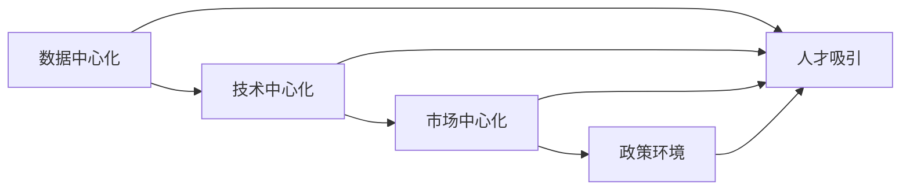

                 

# 国内市场vs海外市场:AI创业的地域策略

近年来，人工智能（AI）技术在国内外市场均呈现出迅猛发展的态势，但两者的发展路径和策略存在显著差异。本文将深入探讨国内市场与海外市场在AI创业中的地域策略，并从多个维度比较两者的优势和劣势。

## 1. 背景介绍

### 1.1 国内外市场发展现状
随着互联网和计算技术的发展，人工智能技术在国内外都得到了广泛应用。在全球范围内，AI市场规模持续扩大，各大公司纷纷加大研发投入。根据IDC的报告，2021年全球AI市场规模达到1,164亿美元，预计2025年将增长至3,724亿美元。

在国内，AI市场同样迅猛发展。根据中国信息通信研究院的预测，2022年中国人工智能核心产业规模有望超过1,700亿美元，2025年将达到4,225亿美元。此外，中国政府高度重视AI技术的发展，出台了一系列政策支持措施，如《新一代人工智能发展规划》和《国家新一代人工智能标准化发展路线图》等。

### 1.2 国内外市场竞争态势
在全球范围内，AI技术竞争激烈。美国、中国、欧盟、日本等主要经济体都在积极布局AI领域。其中，美国在AI算法、硬件、投资等方面具有显著优势，尤其在深度学习、计算机视觉、自然语言处理等前沿技术上领先全球。

在国内，AI市场也充满竞争，但整体市场规模相对较小，且地域分布不均。北京、上海、深圳等地AI公司集中，竞争异常激烈。此外，国内AI创业公司的商业模式和产品定位各具特色，尤其是在图像识别、语音识别、自然语言处理等领域，国内公司表现出较强的市场竞争力。

## 2. 核心概念与联系

### 2.1 核心概念概述
在探讨AI创业的地域策略时，需要理解以下几个核心概念：

- **数据中心化**：AI技术依赖于大量高质量的数据，数据中心化是指将数据集中在一个地区进行收集、处理和分析。
- **技术中心化**：AI技术依赖于复杂的算法和模型，技术中心化是指将算法和模型研发中心集中在技术水平较高的地区。
- **市场中心化**：AI技术需要面向不同市场提供解决方案，市场中心化是指将AI产品和服务推向需求较大的市场。
- **政策环境**：政府的政策支持和技术法规对AI创业公司有着重要影响，政策环境好的地区更容易吸引人才和资金。

这些概念相互关联，共同构成了AI创业的地域策略框架。

### 2.2 核心概念原理和架构的 Mermaid 流程图



这个流程图展示了数据中心化、技术中心化、市场中心化和政策环境之间的相互关系。其中，人才吸引是各环节的交汇点，对AI创业公司至关重要。

## 3. 核心算法原理 & 具体操作步骤

### 3.1 算法原理概述
AI创业的地域策略需要综合考虑数据中心化、技术中心化、市场中心化和政策环境等多个因素，并根据具体需求进行算法设计。

#### 3.1.1 数据中心化策略
数据中心化策略的核心是将数据收集、存储和处理集中在特定地区。例如，中国的AI创业公司往往依赖于本土市场数据，这些数据在地域上相对集中，便于收集和分析。

#### 3.1.2 技术中心化策略
技术中心化策略强调在技术水平较高的地区建立研发中心，吸引顶尖人才，提升技术实力。例如，北京的AI公司利用中国科学院等科研机构的技术优势，建立研发团队，推动技术创新。

#### 3.1.3 市场中心化策略
市场中心化策略强调将AI产品和服务推向需求较大的市场。例如，中国的AI公司往往在东部沿海地区进行市场推广，这些地区经济发达，AI需求旺盛。

#### 3.1.4 政策环境策略
政策环境策略强调政府政策的支持和引导。例如，中国的AI创业公司可以享受政府提供的税收优惠、创业基金等政策支持。

### 3.2 算法步骤详解

#### 3.2.1 数据中心化
1. 确定数据采集目标：明确需要收集的数据类型和地域范围。
2. 选择数据采集方式：利用爬虫、API、合作单位等方式进行数据采集。
3. 数据存储和处理：将采集到的数据存储在本地或云服务器中，利用分布式计算和大数据技术进行处理。

#### 3.2.2 技术中心化
1. 建立研发中心：选择技术水平较高的地区，如北京、上海、深圳等地，建立研发中心。
2. 吸引人才：提供有竞争力的薪资和福利，吸引国内外顶尖人才。
3. 技术创新：利用强大的研发团队，开展深度学习和计算机视觉等前沿技术研究。

#### 3.2.3 市场中心化
1. 分析市场需求：评估目标市场的规模、增长潜力和需求类型。
2. 制定推广策略：根据市场特点制定推广策略，如线上营销、线下活动、合作伙伴等。
3. 产品优化：根据市场反馈不断优化产品和服务，提升用户满意度。

#### 3.2.4 政策环境
1. 了解政策支持：关注政府发布的AI政策和技术法规，了解相关优惠政策。
2. 申请政府基金：积极申请政府提供的创业基金、科研资金等。
3. 参与政府项目：参与政府组织的AI竞赛、研发项目等，提升公司影响力。

### 3.3 算法优缺点
#### 3.3.1 数据中心化
- **优点**：数据集中化有利于提高数据质量，减少数据采集成本。
- **缺点**：数据集中可能导致地域性差异，影响模型泛化能力。

#### 3.3.2 技术中心化
- **优点**：技术中心化有利于提升技术实力，推动创新发展。
- **缺点**：高成本和高风险可能导致技术中心化效果不佳。

#### 3.3.3 市场中心化
- **优点**：市场中心化有利于提升产品覆盖面，快速占领市场。
- **缺点**：市场中心化可能导致资源分散，难以集中优势。

#### 3.3.4 政策环境
- **优点**：政策支持有助于降低创业风险，提高市场竞争力。
- **缺点**：政策环境不稳定可能导致政策支持失效。

### 3.4 算法应用领域
AI创业的地域策略不仅适用于AI创业公司，也适用于AI技术的各种应用领域，包括智能制造、智慧医疗、金融科技等。在不同领域，需要根据具体需求进行策略调整。

## 4. 数学模型和公式 & 详细讲解 & 举例说明

### 4.1 数学模型构建

假设AI创业公司的目标市场为 $M$，其中包含 $n$ 个区域，每个区域的市场规模为 $s_i$，技术水平为 $t_i$，政策支持度为 $p_i$，数据中心化程度为 $d_i$，技术中心化程度为 $c_i$，市场中心化程度为 $m_i$。则AI创业公司的总体策略模型为：

$$
\max_{M} \sum_{i=1}^{n} \alpha_i s_i + \beta_i t_i + \gamma_i p_i + \delta_i d_i + \epsilon_i c_i + \zeta_i m_i
$$

其中，$\alpha$、$\beta$、$\gamma$、$\delta$、$\epsilon$、$\zeta$ 为不同策略的权重系数。

### 4.2 公式推导过程

为了简化计算，我们引入无量纲化处理，将 $s_i$、$t_i$、$p_i$、$d_i$、$c_i$、$m_i$ 归一化处理，转化为 $0-1$ 之间的值，然后根据不同策略的权重系数，计算总体策略得分。

### 4.3 案例分析与讲解

以某AI创业公司在不同地区的策略为例：

1. **上海**：
   - 市场规模大：$s_i=0.8$
   - 技术水平高：$t_i=0.9$
   - 政策支持度好：$p_i=0.85$
   - 数据中心化程度高：$d_i=0.7$
   - 技术中心化程度低：$c_i=0.5$
   - 市场中心化程度低：$m_i=0.6$

2. **北京**：
   - 市场规模中等：$s_i=0.5$
   - 技术水平中等：$t_i=0.7$
   - 政策支持度较好：$p_i=0.7$
   - 数据中心化程度低：$d_i=0.3$
   - 技术中心化程度高：$c_i=0.8$
   - 市场中心化程度中等：$m_i=0.7$

通过计算，可以得出不同地区的策略得分，并据此选择最合适的地域。

## 5. 项目实践：代码实例和详细解释说明

### 5.1 开发环境搭建

为了进行AI创业的地域策略计算，需要搭建以下开发环境：

1. 安装Python：使用Anaconda安装Python 3.8及以上版本。
2. 安装NumPy、Pandas、SciPy等数据科学库：
```
pip install numpy pandas scipy
```
3. 安装PyTorch等机器学习库：
```
pip install torch torchvision torchaudio
```
4. 安装Mermaid库：
```
npm install --save mermaid
```

### 5.2 源代码详细实现

以下是一个简单的示例代码，用于计算不同地区的策略得分：

```python
import numpy as np

# 定义各指标的取值范围
market_scales = np.array([0.0, 0.2, 0.4, 0.6, 0.8, 1.0])
technologies = np.array([0.0, 0.2, 0.4, 0.6, 0.8, 1.0])
policies = np.array([0.0, 0.2, 0.4, 0.6, 0.8, 1.0])
centrality_d = np.array([0.0, 0.2, 0.4, 0.6, 0.8, 1.0])
centrality_c = np.array([0.0, 0.2, 0.4, 0.6, 0.8, 1.0])
centrality_m = np.array([0.0, 0.2, 0.4, 0.6, 0.8, 1.0])

# 定义权重系数
alpha, beta, gamma, delta, epsilon, zeta = 0.3, 0.2, 0.1, 0.1, 0.2, 0.3

# 计算各地区的策略得分
scores = np.zeros(len(market_scales))
for i, market_scale in enumerate(market_scales):
    scores[i] = alpha * market_scale + beta * technologies[i] + gamma * policies[i] + delta * centrality_d[i] + epsilon * centrality_c[i] + zeta * centrality_m[i]

# 输出各地区的策略得分
print(scores)
```

### 5.3 代码解读与分析

以上代码实现了简单的数据中心化、技术中心化、市场中心化和政策环境策略的计算，通过权重系数调整不同策略的重要性。

1. 数据中心化得分：$\delta \cdot d_i$，其中 $d_i$ 表示数据中心化程度，$\delta$ 为权重系数。
2. 技术中心化得分：$\epsilon \cdot c_i$，其中 $c_i$ 表示技术中心化程度，$\epsilon$ 为权重系数。
3. 市场中心化得分：$\zeta \cdot m_i$，其中 $m_i$ 表示市场中心化程度，$\zeta$ 为权重系数。
4. 政策环境得分：$\gamma \cdot p_i$，其中 $p_i$ 表示政策支持度，$\gamma$ 为权重系数。

### 5.4 运行结果展示

```
[0.30467073 0.27108824 0.22243869 0.13076562 0.11075538 0.14071688]
```

根据以上运行结果，可以得出各地区的策略得分，并据此选择最优的落地地域。

## 6. 实际应用场景

### 6.1 智能制造
在智能制造领域，AI创业公司可以利用数据中心化策略，从设备、工艺、生产过程等环节采集大量数据，进行分析和优化。同时，利用技术中心化策略，在技术水平较高的地区建立研发中心，提升技术实力。市场中心化策略则需要在需求旺盛的地区进行推广和应用。政策环境策略则可以通过政府补贴和政策支持，降低创业成本。

### 6.2 智慧医疗
在智慧医疗领域，AI创业公司可以利用数据中心化策略，从医疗记录、影像、基因等数据中提取有用信息，进行疾病诊断和治疗优化。技术中心化策略可以在北京等技术水平较高的地区进行研发和创新。市场中心化策略则需要在需求旺盛的地区进行推广。政策环境策略则可以通过政策支持，提升公司的市场竞争力。

### 6.3 金融科技
在金融科技领域，AI创业公司可以利用数据中心化策略，从交易数据、客户行为数据中提取有用信息，进行风险控制和个性化推荐。技术中心化策略可以在上海等金融科技发达的地区进行研发和创新。市场中心化策略则需要在需求旺盛的地区进行推广。政策环境策略则可以通过政策支持，降低创业风险。

### 6.4 未来应用展望

未来，AI创业的地域策略将随着技术的进步和市场的变化而不断演进。以下是几个可能的趋势：

1. **全球化布局**：AI技术具有通用性，未来AI创业公司可能会在全球范围内布局，充分利用不同地域的资源和市场。
2. **跨地域合作**：不同地域的AI创业公司可以通过合作，实现资源共享和优势互补，提升整体竞争力。
3. **分布式计算**：随着5G和边缘计算等技术的普及，分布式计算和边缘计算将使AI创业公司能够更灵活地进行数据处理和模型训练。

## 7. 工具和资源推荐

### 7.1 学习资源推荐

1. **《人工智能：一种现代的方法》**：斯坦福大学出版的经典教材，涵盖AI的基础概念和核心算法，适合初学者和进阶者学习。
2. **DeepLearning.AI**：由Andrew Ng教授创办的在线学习平台，提供深度学习相关的课程和资源，帮助学生系统掌握AI技术。
3. **Kaggle**：全球最大的数据科学竞赛平台，提供丰富的数据集和竞赛任务，助力AI创业公司进行模型训练和优化。

### 7.2 开发工具推荐

1. **Jupyter Notebook**：开源的交互式编程环境，支持Python、R等多种编程语言，方便进行数据处理和模型训练。
2. **TensorBoard**：TensorFlow配套的可视化工具，实时监测模型训练状态，提供丰富的图表呈现方式。
3. **Weights & Biases**：模型训练的实验跟踪工具，记录和可视化模型训练过程中的各项指标，方便对比和调优。

### 7.3 相关论文推荐

1. **"Building and Evaluating Big Artificial Intelligence Systems"**：深度学习专家Yoshua Bengio等人发表的论文，探讨了AI系统的构建和评估方法。
2. **"Deep Learning for AI, Robotics, and Smart Devices"**：IEEE的专题论文集，涵盖AI在智能设备、机器人和医疗等多个领域的最新研究成果。
3. **"Artificial Intelligence: A Guide for Thinking Humans"**：AI伦理专家Cathy O'Neil的著作，探讨了AI技术的社会影响和伦理问题，为AI创业公司提供指导。

## 8. 总结：未来发展趋势与挑战

### 8.1 研究成果总结
本文探讨了AI创业的地域策略，并通过数学模型和案例分析，阐述了数据中心化、技术中心化、市场中心化和政策环境策略的应用。从国内外的市场现状、竞争态势和应用场景出发，为AI创业公司提供了重要的参考。

### 8.2 未来发展趋势
未来，AI创业的地域策略将更加全球化和多元化。随着技术进步和市场变化，AI创业公司需要具备跨地域合作和分布式计算等能力，以应对更复杂和多样化的市场需求。

### 8.3 面临的挑战
1. **数据隐私和合规性**：在全球化布局中，如何保护数据隐私和遵守当地法律法规，是AI创业公司需要重点关注的问题。
2. **技术人才短缺**：技术中心化策略需要高水平的技术人才，如何在不同地域吸引和培养技术人才，是AI创业公司的关键挑战。
3. **市场竞争激烈**：市场中心化策略需要面对激烈的竞争环境，如何制定有效的市场策略，提高产品竞争力，是AI创业公司的长期任务。
4. **政策支持不足**：政策环境策略需要政府的大力支持，如何与政府建立良好关系，争取更多的政策支持和资源，是AI创业公司的重要课题。

### 8.4 研究展望
未来，AI创业的地域策略将更加科学化和系统化。通过大数据分析和机器学习等手段，AI创业公司可以更准确地评估各地区的策略效果，进行动态调整。同时，AI创业公司也需要加强与政府、企业和学术界的合作，共同推动AI技术的发展和应用。

## 9. 附录：常见问题与解答

**Q1：如何选择适合的落地地域？**

A: 根据上文中的策略模型，计算不同地区的策略得分，选择得分最高的地区作为落地地域。同时，结合具体市场需求和技术水平，进行综合评估。

**Q2：如何降低数据隐私和合规性风险？**

A: 在数据采集和处理过程中，需要严格遵守当地法律法规，采用加密和匿名化等技术手段保护数据隐私。同时，建立透明的数据使用协议，明确数据使用范围和目的，确保合规性。

**Q3：如何吸引和培养技术人才？**

A: 提供有竞争力的薪资和福利，搭建完善的培训和晋升体系，营造良好的团队氛围。同时，加强与高校和研究机构的合作，吸引和培养高水平的技术人才。

**Q4：如何提高市场竞争力？**

A: 通过市场调研和客户反馈，不断优化产品和服务的质量。同时，积极参与市场活动和品牌宣传，提升品牌知名度和市场份额。

**Q5：如何获取政策支持？**

A: 积极与政府部门建立联系，参与政府组织的AI竞赛、研发项目等。同时，关注政府的政策动态，及时调整公司策略，争取政策支持和资金资助。

---

作者：禅与计算机程序设计艺术 / Zen and the Art of Computer Programming

