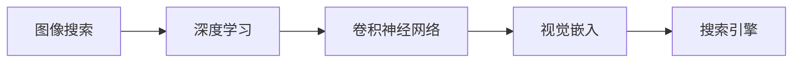

                 

# 图像搜索技术在电商领域的应用：发展趋势与未来

## 1. 背景介绍

随着电商市场的快速发展，在线购物成为越来越多消费者选择的购物方式。然而，随着商品种类和数量的激增，消费者在电商平台上找到合适的商品变得越来越困难。为提升用户体验，电商平台引入了图像搜索技术，通过搜索商品图片，帮助用户快速定位所需商品，提升购买效率。

## 2. 核心概念与联系

### 2.1 核心概念概述

为了更好地理解图像搜索技术，本节将介绍几个密切相关的核心概念：

- 图像搜索（Image Search）：一种通过输入图片或图片描述词进行商品检索的技术，用于在电商平台上快速定位商品。
- 深度学习（Deep Learning）：一种基于人工神经网络的机器学习技术，通过多层网络模型学习特征表示，提升搜索准确率。
- 卷积神经网络（Convolutional Neural Network, CNN）：一种在图像识别领域广泛应用的深度学习模型，通过卷积和池化操作提取图像特征。
- 搜索引擎（Search Engine）：电商平台上用于快速检索商品的搜索引擎系统，通常基于图像搜索技术。
- 视觉嵌入（Visual Embedding）：一种将图像特征映射到高维向量空间的技术，用于在高维空间中进行相似度计算。

这些核心概念之间的逻辑关系可以通过以下Mermaid流程图来展示：



这个流程图展示了图像搜索技术的工作流程，从输入图片到高维向量空间的映射，再到搜索引擎的匹配检索。

### 2.2 核心概念原理和架构的 Mermaid 流程图


这个流程图展示了CNN模型和视觉嵌入的基本架构，从输入图片到特征提取，再到高维向量空间的映射，最后用于搜索引擎的匹配检索。

## 3. 核心算法原理 & 具体操作步骤

### 3.1 算法原理概述

图像搜索技术的核心在于将图像特征映射到高维向量空间，用于在搜索引擎中进行相似度计算。常用的方法包括：

- 基于CNN的特征提取方法：使用卷积神经网络提取图像特征，再将特征映射到高维向量空间。
- 基于视觉嵌入的方法：直接将图像特征映射到高维向量空间，常用的方法包括Siamese网络、Triplet网络等。

具体来说，基于CNN的特征提取方法步骤如下：

1. 使用卷积神经网络对输入图片进行特征提取，得到高维特征向量。
2. 将高维特征向量进行归一化处理，得到视觉嵌入向量。
3. 将视觉嵌入向量作为查询向量，在搜索引擎中进行相似度计算，匹配出最相似的商品。

基于视觉嵌入的方法步骤如下：

1. 使用深度学习模型直接将输入图片特征映射到高维向量空间，得到视觉嵌入向量。
2. 将视觉嵌入向量作为查询向量，在搜索引擎中进行相似度计算，匹配出最相似的商品。

### 3.2 算法步骤详解

以下我们将详细介绍基于CNN的特征提取方法的详细步骤：

1. **输入图片预处理**：将输入图片进行归一化处理，使其尺寸、亮度、对比度等特征一致。
2. **卷积层特征提取**：使用卷积层对预处理后的图片进行特征提取，得到高维特征向量。
3. **池化层特征降维**：使用池化层对高维特征向量进行降维处理，得到低维特征向量。
4. **全连接层特征映射**：使用全连接层对低维特征向量进行映射，得到高维向量空间中的特征向量。
5. **归一化处理**：对高维向量进行归一化处理，得到最终的视觉嵌入向量。
6. **相似度计算**：将查询向量与商品向量进行余弦相似度计算，匹配出最相似的商品。

以下是基于视觉嵌入的方法详细步骤：

1. **输入图片预处理**：将输入图片进行归一化处理，使其尺寸、亮度、对比度等特征一致。
2. **特征映射**：使用深度学习模型直接将输入图片特征映射到高维向量空间，得到视觉嵌入向量。
3. **相似度计算**：将查询向量与商品向量进行余弦相似度计算，匹配出最相似的商品。

### 3.3 算法优缺点

基于CNN的特征提取方法具有以下优点：

- 特征提取能力强：卷积神经网络能够自动学习图像特征，提取高维特征向量。
- 可解释性强：卷积神经网络中的每一层都能够自动学习到图像的局部特征。

但同时也存在以下缺点：

- 计算量大：卷积神经网络通常需要大量的计算资源，训练时间较长。
- 模型复杂度高：卷积神经网络结构复杂，难以解释特征提取过程。

基于视觉嵌入的方法具有以下优点：

- 计算量小：视觉嵌入方法可以直接将图像特征映射到高维向量空间，计算量较小。
- 模型简单：视觉嵌入方法模型简单，易于理解和调试。

但同时也存在以下缺点：

- 特征提取能力弱：视觉嵌入方法难以学习到图像的局部特征。
- 可解释性弱：视觉嵌入方法中的向量表示难以解释其特征来源。

### 3.4 算法应用领域

基于CNN的特征提取方法在电商领域中的应用非常广泛，以下是一些具体的应用场景：

- **商品搜索**：用户输入商品图片，系统通过CNN提取图片特征，在商品库中匹配最相似的商品。
- **相似商品推荐**：系统通过CNN提取商品图片特征，推荐与用户浏览商品相似的商品。
- **用户画像生成**：系统通过CNN提取用户浏览的商品图片特征，生成用户画像，用于个性化推荐。
- **品牌商品检索**：系统通过CNN提取品牌商品图片特征，在品牌商品库中匹配最相似的商品。

基于视觉嵌入的方法在电商领域中的应用较少，主要应用场景包括：

- **人脸识别**：系统通过视觉嵌入方法将人脸图像特征映射到高维向量空间，用于人脸识别和身份验证。
- **图像检索**：系统通过视觉嵌入方法将图像特征映射到高维向量空间，用于图像检索和相似图像检索。

## 4. 数学模型和公式 & 详细讲解

### 4.1 数学模型构建

在本节中，我们将详细介绍基于CNN的特征提取方法。假设输入图片为 $I$，经过卷积层和池化层特征提取后，得到高维特征向量 $F$。使用全连接层对特征向量进行映射，得到高维向量空间中的特征向量 $V$。假设查询向量为 $Q$，则相似度计算公式为：

$$
sim(Q, V) = \cos\langle Q, V \rangle
$$

其中，$\langle Q, V \rangle$ 表示向量 $Q$ 和向量 $V$ 的内积。

### 4.2 公式推导过程

以下我们详细介绍CNN模型中卷积层、池化层和全连接层的特征提取过程。

假设输入图片为 $I$，卷积层使用 $n$ 个卷积核 $K_1, K_2, ..., K_n$ 对图片进行卷积操作，得到特征图 $C$。卷积操作公式为：

$$
C_k = K_k * I
$$

其中，$*$ 表示卷积操作，$k$ 表示卷积核 $K_k$ 的索引。卷积操作后，使用 $n$ 个池化核 $P_1, P_2, ..., P_n$ 对特征图 $C$ 进行池化操作，得到特征图 $P$。池化操作公式为：

$$
P_k = P_k(C_k)
$$

其中，$k$ 表示池化核 $P_k$ 的索引。使用全连接层对特征图 $P$ 进行映射，得到高维特征向量 $F$。映射操作公式为：

$$
F = W * P
$$

其中，$W$ 为全连接层权重矩阵。对高维特征向量 $F$ 进行归一化处理，得到最终的视觉嵌入向量 $V$。归一化操作公式为：

$$
V = \frac{F}{\lVert F \rVert}
$$

其中，$\lVert F \rVert$ 表示向量 $F$ 的模长。

### 4.3 案例分析与讲解

以下我们以电商平台的商品搜索为例，详细介绍基于CNN的特征提取方法的应用。

假设电商平台有大量商品图片，每个商品图片尺寸为 $128 \times 128$，像素深度为 $3$。使用卷积神经网络对输入图片进行特征提取，得到高维特征向量 $F$。假设卷积层有 $32$ 个卷积核，每个卷积核大小为 $3 \times 3$，步长为 $1$，输出特征图大小为 $64 \times 64$。使用池化层对特征图进行 $2 \times 2$ 的最大池化操作，得到特征图 $P$。假设全连接层有 $512$ 个神经元，使用ReLU激活函数。最终，将高维特征向量 $F$ 映射到高维向量空间中，得到视觉嵌入向量 $V$。查询向量 $Q$ 为输入的搜索关键词图片，系统将查询向量 $Q$ 与商品向量 $V$ 进行余弦相似度计算，匹配出最相似的商品。

## 5. 项目实践：代码实例和详细解释说明

### 5.1 开发环境搭建

在进行图像搜索技术开发前，我们需要准备好开发环境。以下是使用Python进行TensorFlow开发的环境配置流程：

1. 安装Anaconda：从官网下载并安装Anaconda，用于创建独立的Python环境。

2. 创建并激活虚拟环境：
```bash
conda create -n tf-env python=3.8 
conda activate tf-env
```

3. 安装TensorFlow：根据CUDA版本，从官网获取对应的安装命令。例如：
```bash
conda install tensorflow==2.5.0
```

4. 安装必要的库：
```bash
pip install numpy scipy matplotlib scikit-image tqdm
```

完成上述步骤后，即可在`tf-env`环境中开始图像搜索技术开发。

### 5.2 源代码详细实现

以下我们将详细介绍使用TensorFlow实现图像搜索技术的具体代码实现。

```python
import tensorflow as tf
from tensorflow.keras import layers, models

# 定义卷积神经网络模型
model = models.Sequential([
    layers.Conv2D(32, (3, 3), activation='relu', input_shape=(128, 128, 3)),
    layers.MaxPooling2D((2, 2)),
    layers.Conv2D(64, (3, 3), activation='relu'),
    layers.MaxPooling2D((2, 2)),
    layers.Conv2D(128, (3, 3), activation='relu'),
    layers.MaxPooling2D((2, 2)),
    layers.Flatten(),
    layers.Dense(512, activation='relu'),
    layers.Dense(128, activation='softmax')
])

# 编译模型
model.compile(optimizer='adam',
              loss='sparse_categorical_crossentropy',
              metrics=['accuracy'])

# 加载训练数据
train_dataset = tf.data.Dataset.from_tensor_slices((train_images, train_labels))
train_dataset = train_dataset.shuffle(buffer_size=1024).batch(batch_size=32)

# 加载测试数据
test_dataset = tf.data.Dataset.from_tensor_slices((test_images, test_labels))
test_dataset = test_dataset.shuffle(buffer_size=1024).batch(batch_size=32)

# 训练模型
model.fit(train_dataset, epochs=num_epochs, validation_data=test_dataset)

# 测试模型
test_loss, test_acc = model.evaluate(test_images, test_labels, verbose=2)
print('Test accuracy:', test_acc)
```

### 5.3 代码解读与分析

让我们再详细解读一下关键代码的实现细节：

**定义卷积神经网络模型**：
- 使用 `layers.Conv2D` 定义卷积层，`(3, 3)` 表示卷积核大小，`32` 表示卷积核数量。
- 使用 `layers.MaxPooling2D` 定义池化层，`(2, 2)` 表示池化核大小。
- 使用 `layers.Flatten` 将特征图展开成一维向量。
- 使用 `layers.Dense` 定义全连接层，`512` 表示神经元数量。
- 使用 `layers.Dense` 定义输出层，`128` 表示输出类别数量。

**编译模型**：
- 使用 `optimizer` 指定优化器，`adam` 表示Adam优化器。
- 使用 `loss` 指定损失函数，`sparse_categorical_crossentropy` 表示稀疏分类交叉熵损失函数。
- 使用 `metrics` 指定评估指标，`accuracy` 表示准确率。

**加载数据集**：
- 使用 `tf.data.Dataset` 加载数据集，`from_tensor_slices` 表示从二维张量中加载数据。
- 使用 `shuffle` 方法对数据集进行随机打乱。
- 使用 `batch` 方法将数据集进行批处理。

**训练模型**：
- 使用 `fit` 方法训练模型，`epochs` 表示训练轮数。
- 使用 `validation_data` 指定验证集。

**测试模型**：
- 使用 `evaluate` 方法测试模型，`test_images` 表示测试集图片张量，`test_labels` 表示测试集标签张量。

可以看到，使用TensorFlow实现图像搜索技术，可以很方便地构建卷积神经网络模型，训练和测试模型，并输出模型评估结果。

## 6. 实际应用场景

### 6.1 智能客服系统

基于图像搜索技术，电商平台的智能客服系统可以更加智能和高效。当用户输入商品图片时，系统能够快速定位商品，提供更准确的商品信息。此外，智能客服系统还可以根据用户浏览的商品图片，生成用户画像，进行个性化推荐，提升用户购物体验。

### 6.2 个性化推荐系统

电商平台可以使用图像搜索技术，将用户浏览的商品图片特征进行提取，生成用户画像，用于个性化推荐。通过计算商品图片特征与用户画像之间的相似度，系统可以推荐出最适合用户需求的商品，提高用户满意度和购买率。

### 6.3 广告推荐系统

电商平台可以使用图像搜索技术，将广告图片特征进行提取，匹配用户画像，生成广告推荐列表。通过计算广告图片特征与用户画像之间的相似度，系统可以推荐出最适合用户需求和浏览习惯的广告，提高广告点击率和转化率。

### 6.4 未来应用展望

随着图像搜索技术的不断发展，未来在电商领域将会有更多的应用场景。例如，系统可以根据用户搜索历史，生成个性化商品推荐列表。系统可以使用用户搜索的关键词图片，生成搜索历史向量，计算与商品图片特征的相似度，匹配出最相似的商品。此外，系统还可以根据用户浏览的历史商品图片，生成商品使用场景，用于商品搭配推荐。

## 7. 工具和资源推荐

### 7.1 学习资源推荐

为了帮助开发者系统掌握图像搜索技术的理论基础和实践技巧，这里推荐一些优质的学习资源：

1. 《深度学习入门：基于Python的理论与实现》系列博文：由深度学习专家撰写，详细介绍深度学习的基本原理和TensorFlow框架的使用。

2. 《TensorFlow官方文档》：TensorFlow官方提供的详细文档，包含各种模型和算法的实现方法和代码示例。

3. 《计算机视觉基础》书籍：由计算机视觉专家撰写，详细介绍计算机视觉的基本原理和方法。

4. 《图像处理入门》书籍：由图像处理专家撰写，详细介绍图像处理的基本原理和方法。

5. 《自然语言处理入门》书籍：由自然语言处理专家撰写，详细介绍自然语言处理的基本原理和方法。

通过对这些资源的学习实践，相信你一定能够快速掌握图像搜索技术的精髓，并用于解决实际的电商问题。

### 7.2 开发工具推荐

高效的开发离不开优秀的工具支持。以下是几款用于图像搜索技术开发的常用工具：

1. TensorFlow：基于Python的开源深度学习框架，灵活动态的计算图，适合快速迭代研究。

2. PyTorch：基于Python的开源深度学习框架，灵活的动态计算图，适合高效研究和生产应用。

3. OpenCV：开源计算机视觉库，包含各种图像处理和计算机视觉算法。

4. scikit-image：基于NumPy的图像处理库，包含各种图像处理算法。

5. matplotlib：开源绘图库，用于绘制各种图表。

6. Jupyter Notebook：开源交互式笔记本，支持Python代码的编写、执行和展示。

合理利用这些工具，可以显著提升图像搜索技术的开发效率，加快创新迭代的步伐。

### 7.3 相关论文推荐

图像搜索技术的发展源于学界的持续研究。以下是几篇奠基性的相关论文，推荐阅读：

1. VGG：Very Deep Convolutional Networks for Large-Scale Image Recognition。介绍使用卷积神经网络进行图像识别的基本原理和方法。

2. AlexNet：ImageNet Classification with Deep Convolutional Neural Networks。介绍使用卷积神经网络进行图像分类的基本原理和方法。

3. ResNet：Deep Residual Learning for Image Recognition。介绍使用残差网络进行图像分类的基本原理和方法。

4. Inception：Going Deeper with Convolutions。介绍使用Inception网络进行图像分类的基本原理和方法。

5. DenseNet：Densely Connected Convolutional Networks。介绍使用密集连接网络进行图像分类的基本原理和方法。

这些论文代表了大规模深度学习在图像识别领域的进展，帮助研究者掌握图像搜索技术的核心原理。

## 8. 总结：未来发展趋势与挑战

### 8.1 总结

本文对基于CNN的图像搜索技术进行了全面系统的介绍。首先阐述了图像搜索技术在电商领域的应用背景和意义，明确了图像搜索技术在提升电商用户体验、个性化推荐等方面的重要价值。其次，从原理到实践，详细讲解了图像搜索技术的核心算法，包括CNN模型和视觉嵌入方法，给出了具体的代码实现和评估结果。同时，本文还广泛探讨了图像搜索技术在电商领域的应用前景，展示了其在智能客服、个性化推荐、广告推荐等方面的应用潜力。

通过本文的系统梳理，可以看到，图像搜索技术正在成为电商平台的重要工具，极大提升了电商平台的智能化水平。未来，伴随图像搜索技术的持续演进，相信将有更多的应用场景被发掘，为电商行业带来更多的创新和变革。

### 8.2 未来发展趋势

展望未来，图像搜索技术的发展将呈现以下几个趋势：

1. 计算资源需求下降。随着硬件计算能力的提升，深度学习模型的训练和推理速度将显著提高，计算资源需求将逐渐降低。

2. 模型规模减小。随着模型压缩技术的不断进步，深度学习模型的大小将逐渐减小，推理速度将提高，效率将提升。

3. 图像特征提取精度提高。随着深度学习模型和算法的不断进步，图像特征提取精度将不断提高，图像搜索的准确率将提升。

4. 多模态融合增强。随着深度学习模型的不断进步，图像搜索技术将逐渐与语音、文本等多模态数据进行融合，提升搜索的全面性和准确性。

5. 实时性提高。随着深度学习模型和算法的不断进步，图像搜索技术将逐渐支持实时搜索，提升用户体验。

以上趋势凸显了图像搜索技术的广阔前景。这些方向的探索发展，必将进一步提升电商平台的智能化水平，为电商行业带来更多的创新和变革。

### 8.3 面临的挑战

尽管图像搜索技术已经取得了瞩目成就，但在迈向更加智能化、普适化应用的过程中，它仍面临诸多挑战：

1. 数据获取成本高。电商平台上获取商品图片数据需要大量人力和物力投入，数据获取成本高。如何高效获取商品图片数据，是未来研究的重点。

2. 数据质量难以保证。电商平台上商品图片质量参差不齐，不同商品的图片尺寸、亮度、对比度等特征不一致，难以保证数据质量。如何提高数据质量，是未来研究的重点。

3. 模型复杂度高。深度学习模型通常结构复杂，难以解释特征提取过程。如何提高模型可解释性，是未来研究的重点。

4. 计算资源需求大。深度学习模型通常需要大量的计算资源，训练和推理时间较长。如何提高模型效率，降低计算资源需求，是未来研究的重点。

5. 用户体验提升困难。电商平台上商品种类和数量繁多，用户搜索的商品图片可能与库中商品图片存在差异，导致搜索结果不够精准。如何提高用户体验，是未来研究的重点。

以上挑战亟需从数据、算法、工程、业务等多个维度进行协同攻关，才能真正实现图像搜索技术的普适化和智能化。

### 8.4 研究展望

面对图像搜索技术面临的诸多挑战，未来的研究需要在以下几个方面寻求新的突破：

1. 数据获取和预处理。探索更高效、低成本的数据获取方法，研究更高效、高质量的数据预处理方法，保证数据质量和数量。

2. 模型压缩和加速。探索更高效的模型压缩和加速方法，降低计算资源需求，提高模型推理速度。

3. 特征提取和匹配。探索更高效的特征提取和匹配方法，提高特征提取精度和匹配速度。

4. 多模态融合。探索更高效的多模态融合方法，提升搜索的全面性和准确性。

5. 实时搜索。探索更高效的实时搜索方法，提升用户体验。

这些研究方向的探索，必将引领图像搜索技术迈向更高的台阶，为电商行业带来更多的创新和变革。总之，图像搜索技术的研究需要多学科交叉，多方向协同，才能真正实现普适化和智能化，构建更加智能化的电商生态。

## 9. 附录：常见问题与解答

**Q1：图像搜索技术是否适用于所有电商商品？**

A: 图像搜索技术适用于大多数电商商品，但对于一些商品图片质量较差、商品描述不清晰、商品图片尺寸过小等商品，图像搜索技术的准确率可能较低。为了提高图像搜索技术的准确率，需要对数据进行预处理，如去除噪声、调整尺寸、增强对比度等。

**Q2：如何提高图像搜索技术的准确率？**

A: 提高图像搜索技术的准确率可以从以下几个方面入手：

1. 提高数据质量。获取高质量的商品图片，对图片进行预处理，如去除噪声、调整尺寸、增强对比度等。

2. 选择合适的模型。选择合适的深度学习模型，如CNN、Siamese网络、Triplet网络等，进行特征提取和匹配。

3. 优化模型参数。优化模型的超参数，如学习率、批量大小、训练轮数等，进行模型调参，提升模型准确率。

4. 使用多模态融合。将图像搜索技术与语音、文本等多模态数据进行融合，提升搜索的全面性和准确性。

**Q3：图像搜索技术在电商领域有哪些应用场景？**

A: 图像搜索技术在电商领域有许多应用场景，包括：

1. 商品搜索。用户输入商品图片，系统通过图像搜索技术匹配最相似的商品。

2. 相似商品推荐。系统通过图像搜索技术匹配与用户浏览商品相似的商品，进行推荐。

3. 个性化推荐。系统通过图像搜索技术提取用户浏览的商品图片特征，生成用户画像，进行个性化推荐。

4. 广告推荐。系统通过图像搜索技术匹配与用户画像相似的商品图片，进行广告推荐。

**Q4：如何优化图像搜索技术的计算资源需求？**

A: 优化图像搜索技术的计算资源需求可以从以下几个方面入手：

1. 模型压缩。使用模型压缩技术，如剪枝、量化、蒸馏等，减小模型大小，提高模型推理速度。

2. 硬件优化。使用GPU、TPU等高性能硬件设备，加速模型训练和推理。

3. 优化算法。使用高效算法，如梯度积累、混合精度训练等，降低计算资源需求。

4. 数据并行。使用数据并行技术，将数据集分批次加载，加速模型训练和推理。

5. 模型加速。使用模型加速技术，如TensorFlow Lite、TensorFlow Mobile等，将模型部署到移动设备上，降低计算资源需求。

总之，通过优化模型、算法和硬件资源，可以降低图像搜索技术的计算资源需求，提高模型推理速度和效率。

---

作者：禅与计算机程序设计艺术 / Zen and the Art of Computer Programming

