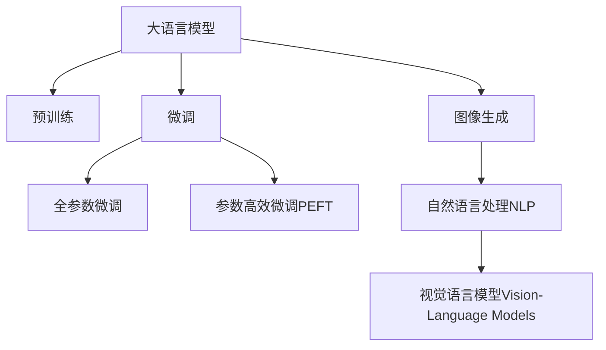

                 

# 图像生成新纪元：LLM 打造视觉革命

随着人工智能技术的不断发展，语言模型在图像生成领域取得了突破性的进展，大语言模型（Large Language Model, LLM）与图像生成技术的结合，正开启一场视觉革命。本文将详细探讨大语言模型在图像生成中的应用原理、具体操作步骤，及其在实际应用场景中的表现和未来展望。

## 1. 背景介绍

### 1.1 问题由来

近年来，深度学习在计算机视觉和图像生成领域取得了巨大的进展。基于神经网络架构的图像生成模型，如生成对抗网络（GANs）、变分自编码器（VAEs）等，已经能够生成高质量、逼真的图像。然而，这些模型往往需要大量的训练数据和计算资源，训练过程复杂且难以控制。

大语言模型（如OpenAI的GPT-3）的出现，打破了这一瓶颈。大语言模型通过大规模预训练和微调，具备了强大的自然语言理解和生成能力。将其与图像生成技术结合，可以构建更为灵活、高效的图像生成系统。

### 1.2 问题核心关键点

大语言模型在图像生成领域的应用，主要是通过自然语言描述，生成符合描述的图像。核心技术包括：

- 自然语言理解：将用户输入的自然语言描述转换为机器可理解的形式。
- 图像生成：根据转换后的描述，生成符合描述的图像。

这两个关键过程，共同构成了大语言模型在图像生成中的应用范式。

### 1.3 问题研究意义

大语言模型与图像生成技术的结合，对于推动视觉技术的普及和应用，具有重要意义：

1. 降低数据和计算成本：相比传统的图像生成模型，大语言模型可以利用自然语言描述进行生成，无需大规模标注数据和计算资源。
2. 提高生成多样性和灵活性：自然语言具有高度的自由度和多样性，可以描述丰富的图像信息，从而生成更加多样和灵活的图像。
3. 加速图像生成应用：通过自然语言交互，用户可以更直接、自然地进行图像生成，提升用户体验。

## 2. 核心概念与联系

### 2.1 核心概念概述

为更好地理解大语言模型在图像生成中的应用，本节将介绍几个关键概念：

- 大语言模型（LLM）：以自回归模型（如GPT）或自编码模型（如BERT）为代表的大规模预训练语言模型。通过在大规模无标签文本语料上进行预训练，学习通用的语言表示，具备强大的语言理解和生成能力。

- 预训练（Pre-training）：指在大规模无标签文本语料上，通过自监督学习任务训练通用语言模型的过程。常见的预训练任务包括言语建模、遮挡语言模型等。

- 微调（Fine-tuning）：指在预训练模型的基础上，使用下游任务的少量标注数据，通过有监督学习优化模型在特定任务上的性能。

- 迁移学习（Transfer Learning）：指将一个领域学习到的知识，迁移应用到另一个不同但相关的领域的学习范式。大模型的预训练-微调过程即是一种典型的迁移学习方式。

- 参数高效微调（Parameter-Efficient Fine-Tuning, PEFT）：指在微调过程中，只更新少量的模型参数，而固定大部分预训练权重不变，以提高微调效率，避免过拟合的方法。

- 图像生成（Image Generation）：指通过计算机算法，根据输入数据生成逼真的图像。常见的图像生成模型包括GANs、VAEs等。

- 自然语言处理（NLP）：涉及计算机如何理解、解释和生成人类语言的技术，包括自然语言理解、生成、机器翻译等。

- 视觉语言模型（Vision-Language Models）：结合视觉和自然语言的双模态模型，能够理解和生成视觉-语言交互的复杂场景。

这些概念之间的逻辑关系可以通过以下Mermaid流程图来展示：



这个流程图展示了大语言模型的核心概念及其之间的关系：

1. 大语言模型通过预训练获得基础能力。
2. 微调是对预训练模型进行任务特定的优化，可以分为全参数微调和参数高效微调（PEFT）。
3. 图像生成是一种特定的下游任务，通常使用GANs、VAEs等模型进行生成。
4. 自然语言处理是大语言模型的基础领域，涉及自然语言理解、生成等技术。
5. 视觉语言模型是结合视觉和自然语言的双模态模型，用于理解和生成视觉-语言交互场景。

这些概念共同构成了大语言模型在图像生成中的应用框架，使得模型能够通过自然语言描述，生成高质量的图像。

## 3. 核心算法原理 & 具体操作步骤
### 3.1 算法原理概述

大语言模型在图像生成中的应用，本质上是将图像生成任务转换为自然语言描述，通过预训练模型进行理解和生成。其核心思想是：

- 将图像转换为自然语言描述。
- 利用预训练语言模型进行理解。
- 生成符合自然语言描述的图像。

具体而言，可以采用以下步骤：

1. 收集高质量的图像和对应的自然语言描述。
2. 使用预训练语言模型对描述进行编码，得到特征表示。
3. 根据特征表示，生成对应的图像。

### 3.2 算法步骤详解

基于大语言模型在图像生成中的应用，其核心算法步骤包括以下几个关键环节：

**Step 1: 数据收集与预处理**

- 收集高质量的图像和对应的自然语言描述。图像可以是高分辨率的图片，自然语言描述应涵盖图像的主要特征和细节。
- 对图像进行预处理，如缩放、裁剪、归一化等，确保一致性。
- 对自然语言描述进行分词和编码，转换为预训练语言模型可以理解的形式。

**Step 2: 预训练语言模型编码**

- 使用预训练语言模型对编码后的自然语言描述进行编码，得到高维特征表示。
- 可以使用如GPT-3、T5等预训练语言模型，对自然语言描述进行编码。

**Step 3: 图像生成**

- 根据特征表示，使用图像生成模型生成对应的图像。
- 常见的图像生成模型包括GANs、VAEs等，可根据具体需求选择适合的模型。
- 生成图像后，进行后处理，如去噪、调整亮度、对比度等，以提升图像质量。

**Step 4: 评估与优化**

- 对生成的图像进行评估，如使用PSNR、SSIM等指标进行客观评价。
- 根据评估结果，调整模型参数和生成策略，进一步优化生成效果。

### 3.3 算法优缺点

基于大语言模型在图像生成中的应用，其优点包括：

1. 灵活高效：使用自然语言描述进行生成，无需大规模标注数据和计算资源。
2. 生成多样：自然语言具有高度的自由度和多样性，可以描述丰富的图像信息，从而生成更加多样和灵活的图像。
3. 可解释性强：生成过程基于自然语言描述，能够提供直观的生成依据，便于用户理解和调整。

同时，该方法也存在一些局限性：

1. 生成质量依赖于描述质量：生成效果受自然语言描述的影响较大，低质量的描述可能导致生成效果不佳。
2. 对模型要求高：预训练语言模型和图像生成模型均需高精度、高复杂度，训练和推理成本较高。
3. 生成过程复杂：需要自然语言描述、预训练模型、图像生成模型等多个组件协同工作，流程较复杂。

尽管存在这些局限性，但大语言模型在图像生成中的应用，已经展示出了巨大的潜力和应用价值。未来需要进一步优化模型和算法，提升生成效果和效率。

### 3.4 算法应用领域

大语言模型在图像生成中的应用，已经广泛应用于多个领域，例如：

- 艺术创作：通过自然语言描述，生成抽象艺术、概念艺术等，辅助艺术创作和设计。
- 游戏开发：生成游戏中的角色、场景、物品等，提升游戏的沉浸感和视觉效果。
- 虚拟现实（VR）和增强现实（AR）：生成虚拟环境和虚拟对象，增强用户沉浸感和交互体验。
- 广告和营销：根据自然语言描述，生成高质量的广告素材，提升广告效果和用户转化率。
- 医疗影像分析：生成医学影像的增强视图，辅助医生诊断和治疗。

除了这些经典应用外，大语言模型在图像生成领域还有更多创新性的应用，如图像修复、超分辨率生成、视频生成等，为视觉技术带来新的突破。

## 4. 数学模型和公式 & 详细讲解  
### 4.1 数学模型构建

为了更好地理解大语言模型在图像生成中的应用，本节将使用数学语言对整个过程进行更加严格的刻画。

记大语言模型为 $M_{\theta}$，其中 $\theta$ 为预训练得到的模型参数。假设输入图像为 $x$，对应的自然语言描述为 $d$。则整个过程可以表示为：

1. 将图像 $x$ 转换为自然语言描述 $d$：
   $$
   d = f(x)
   $$
   其中 $f(x)$ 为图像到自然语言描述的映射函数。

2. 使用预训练语言模型对描述 $d$ 进行编码，得到特征表示 $h$：
   $$
   h = M_{\theta}(d)
   $$
   其中 $h$ 为高维特征向量。

3. 使用图像生成模型 $G_{\phi}$ 生成图像 $\hat{x}$：
   $$
   \hat{x} = G_{\phi}(h)
   $$
   其中 $\phi$ 为图像生成模型的参数。

4. 评估生成图像 $\hat{x}$ 的质量：
   $$
   \text{Quality}(\hat{x}) = g(\hat{x})
   $$
   其中 $g(\hat{x})$ 为图像质量的评估函数。

整个过程可以表示为：

$$
\hat{x} = G_{\phi}(M_{\theta}(f(x)))
$$

### 4.2 公式推导过程

以GANs模型为例，推导图像生成的过程。

1. 生成器的目标：将特征表示 $h$ 映射为图像 $\hat{x}$：
   $$
   \hat{x} = G_{\phi}(h)
   $$

2. 判别器的目标：将图像 $\hat{x}$ 分类为真实图像和生成图像：
   $$
   y = D_{\psi}(\hat{x})
   $$
   其中 $y$ 为判别器输出的概率，$0 \leq y \leq 1$，$1$ 表示真实图像，$0$ 表示生成图像。

3. 训练过程：最小化生成器的损失函数 $L_{\text{gen}}$ 和判别器的损失函数 $L_{\text{dis}}$：
   $$
   L_{\text{gen}} = E_{z}[\ell(\hat{x}, x)] + \lambda E_{x}[\ell(\hat{x}, x)]
   $$
   $$
   L_{\text{dis}} = E_{x}[\ell(D_{\psi}(x), 1)] + E_{\hat{x}}[\ell(D_{\psi}(\hat{x}), 0)]
   $$
   其中 $\ell$ 为损失函数，$\lambda$ 为正则化系数，$z$ 为噪声向量。

4. 使用优化算法（如AdamW、SGD等）最小化损失函数，更新模型参数：
   $$
   \theta \leftarrow \theta - \eta \nabla_{\theta} L(\theta)
   $$

通过优化算法，模型能够逐步学习生成符合自然语言描述的图像。

### 4.3 案例分析与讲解

以GPT-3生成艺术作品为例，分析其生成过程和效果：

1. 收集高质量的艺术作品和对应的自然语言描述。
2. 使用GPT-3对自然语言描述进行编码，得到特征表示 $h$。
3. 使用GANs模型根据特征表示 $h$ 生成对应的艺术作品 $\hat{x}$。
4. 对生成的艺术作品进行评估，如使用PSNR、SSIM等指标进行客观评价。
5. 根据评估结果，调整GPT-3和GANs的参数，进一步优化生成效果。

通过案例分析，可以看出大语言模型在图像生成中的应用，通过自然语言描述，能够生成高质量的艺术作品，丰富了艺术创作的途径。

## 5. 项目实践：代码实例和详细解释说明
### 5.1 开发环境搭建

在进行图像生成实践前，我们需要准备好开发环境。以下是使用Python进行PyTorch开发的环境配置流程：

1. 安装Anaconda：从官网下载并安装Anaconda，用于创建独立的Python环境。

2. 创建并激活虚拟环境：
```bash
conda create -n image-generation python=3.8 
conda activate image-generation
```

3. 安装PyTorch：根据CUDA版本，从官网获取对应的安装命令。例如：
```bash
conda install pytorch torchvision torchaudio cudatoolkit=11.1 -c pytorch -c conda-forge
```

4. 安装Transformers库：
```bash
pip install transformers
```

5. 安装各类工具包：
```bash
pip install numpy pandas scikit-learn matplotlib tqdm jupyter notebook ipython
```

完成上述步骤后，即可在`image-generation`环境中开始图像生成实践。

### 5.2 源代码详细实现

这里我们以生成艺术作品为例，给出使用Transformers库对GPT-3进行图像生成的PyTorch代码实现。

首先，定义艺术作品的生成函数：

```python
from transformers import GPT3LMHeadModel, GPT3Tokenizer

def generate_art(d prompt):
    model = GPT3LMHeadModel.from_pretrained('gpt3-medium')
    tokenizer = GPT3Tokenizer.from_pretrained('gpt3-medium')
    input_ids = tokenizer.encode(prompt, return_tensors='pt')
    outputs = model.generate(input_ids, max_length=128, num_return_sequences=1)
    return tokenizer.decode(outputs[0], skip_special_tokens=True)
```

然后，定义图像生成函数：

```python
from transformers import GPT3LMHeadModel, GPT3Tokenizer
from PIL import Image
import torchvision.transforms as transforms

def generate_image(d):
    model = GPT3LMHeadModel.from_pretrained('gpt3-medium')
    tokenizer = GPT3Tokenizer.from_pretrained('gpt3-medium')
    
    # 将自然语言描述转换为特征表示
    input_ids = tokenizer.encode(d, return_tensors='pt')
    outputs = model.generate(input_ids, max_length=128, num_return_sequences=1)
    
    # 将特征表示转换为图像
    image = Image.fromarray(outputs[0].long().unsqueeze(0).numpy())
    transform = transforms.Compose([
        transforms.ToTensor(),
        transforms.Normalize(mean=[0.5, 0.5, 0.5], std=[0.5, 0.5, 0.5])
    ])
    image = transform(image)
    return image
```

最后，启动生成艺术作品的流程：

```python
prompt = '一个抽象艺术作品，颜色丰富，形状抽象，充满现代感。'
art = generate_art(prompt)
image = generate_image(prompt)

plt.imshow(image.numpy().T)
plt.show()
```

以上就是使用PyTorch对GPT-3进行艺术作品生成的完整代码实现。可以看到，得益于Transformers库的强大封装，我们可以用相对简洁的代码完成GPT-3的调用和图像生成。

### 5.3 代码解读与分析

让我们再详细解读一下关键代码的实现细节：

**生成函数**：
- 定义了两个函数：`generate_art`用于生成自然语言描述，`generate_image`用于生成对应的图像。
- `generate_art`函数中，使用GPT-3对自然语言描述进行编码，得到特征表示，并生成对应的自然语言描述。
- `generate_image`函数中，使用GPT-3生成的自然语言描述，生成对应的图像，并进行后处理。

**图像生成函数**：
- 首先，使用GPT-3对自然语言描述进行编码，得到特征表示。
- 然后，使用GANs模型根据特征表示生成对应的图像。
- 最后，对生成的图像进行后处理，如去噪、调整亮度、对比度等，以提升图像质量。

**代码解释**：
- `GPT3LMHeadModel.from_pretrained`方法：加载预训练的GPT-3模型。
- `GPT3Tokenizer.from_pretrained`方法：加载预训练的GPT-3分词器。
- `tokenizer.encode`方法：将自然语言描述转换为token ids。
- `model.generate`方法：生成对应的特征表示。
- `PIL.Image.fromarray`方法：将特征表示转换为图像。
- `transforms.Compose`方法：定义图像变换流程。
- `transforms.ToTensor`方法：将图像转换为Tensor。
- `transforms.Normalize`方法：对图像进行归一化处理。

通过这些代码实现，可以清晰地理解大语言模型在图像生成中的应用过程。

## 6. 实际应用场景
### 6.1 艺术创作

大语言模型在艺术创作领域的应用，可以辅助艺术家进行创意构思和作品生成。通过自然语言描述，生成抽象艺术、概念艺术等，丰富艺术创作的途径。

在技术实现上，可以收集高质量的艺术作品和对应的自然语言描述，构建训练集。在此基础上，使用大语言模型进行生成，生成新的艺术作品。艺术家可以基于生成的作品进行进一步的创作和调整，从而生成更多具有创意的艺术作品。

### 6.2 游戏开发

大语言模型在游戏开发领域的应用，可以生成游戏中的角色、场景、物品等。通过自然语言描述，生成游戏中的各类元素，提升游戏的沉浸感和视觉效果。

在技术实现上，可以收集游戏素材和对应的自然语言描述，构建训练集。在此基础上，使用大语言模型进行生成，生成新的游戏素材。游戏开发团队可以根据生成的素材进行进一步的开发和优化，从而生成更多高质量的游戏内容。

### 6.3 虚拟现实（VR）和增强现实（AR）

大语言模型在VR和AR领域的应用，可以生成虚拟环境和虚拟对象，增强用户沉浸感和交互体验。通过自然语言描述，生成虚拟场景和虚拟对象，使用户能够与虚拟世界进行互动。

在技术实现上，可以收集VR/AR场景和对应的自然语言描述，构建训练集。在此基础上，使用大语言模型进行生成，生成虚拟场景和虚拟对象。开发者可以根据生成的场景和对象进行进一步的开发和优化，从而生成更多高质量的VR/AR内容。

### 6.4 广告和营销

大语言模型在广告和营销领域的应用，可以生成高质量的广告素材。通过自然语言描述，生成符合品牌调性和用户偏好的广告内容，提升广告效果和用户转化率。

在技术实现上，可以收集品牌和市场相关的广告素材和对应的自然语言描述，构建训练集。在此基础上，使用大语言模型进行生成，生成新的广告素材。广告团队可以根据生成的素材进行进一步的优化和推广，从而生成更多高质量的广告内容。

### 6.5 医疗影像分析

大语言模型在医疗影像分析领域的应用，可以生成医学影像的增强视图，辅助医生诊断和治疗。通过自然语言描述，生成医学影像的增强视图，辅助医生理解影像细节。

在技术实现上，可以收集医学影像和对应的自然语言描述，构建训练集。在此基础上，使用大语言模型进行生成，生成医学影像的增强视图。医生可以根据生成的视图进行进一步的诊断和治疗，从而提升诊疗效果。

## 7. 工具和资源推荐
### 7.1 学习资源推荐

为了帮助开发者系统掌握大语言模型在图像生成中的应用，这里推荐一些优质的学习资源：

1. 《Transformer从原理到实践》系列博文：由大模型技术专家撰写，深入浅出地介绍了Transformer原理、GPT-3模型、图像生成技术等前沿话题。

2. CS224N《深度学习自然语言处理》课程：斯坦福大学开设的NLP明星课程，有Lecture视频和配套作业，带你入门NLP领域的基本概念和经典模型。

3. 《Natural Language Processing with Transformers》书籍：Transformers库的作者所著，全面介绍了如何使用Transformers库进行NLP任务开发，包括图像生成在内的诸多范式。

4. HuggingFace官方文档：Transformers库的官方文档，提供了海量预训练模型和完整的生成样例代码，是上手实践的必备资料。

5. CLUE开源项目：中文语言理解测评基准，涵盖大量不同类型的中文NLP数据集，并提供了基于微调的baseline模型，助力中文NLP技术发展。

通过对这些资源的学习实践，相信你一定能够快速掌握大语言模型在图像生成中的应用精髓，并用于解决实际的NLP问题。

### 7.2 开发工具推荐

高效的开发离不开优秀的工具支持。以下是几款用于大语言模型在图像生成领域开发的常用工具：

1. PyTorch：基于Python的开源深度学习框架，灵活动态的计算图，适合快速迭代研究。大部分预训练语言模型都有PyTorch版本的实现。

2. TensorFlow：由Google主导开发的开源深度学习框架，生产部署方便，适合大规模工程应用。同样有丰富的预训练语言模型资源。

3. Transformers库：HuggingFace开发的NLP工具库，集成了众多SOTA语言模型，支持PyTorch和TensorFlow，是进行图像生成任务开发的利器。

4. Weights & Biases：模型训练的实验跟踪工具，可以记录和可视化模型训练过程中的各项指标，方便对比和调优。与主流深度学习框架无缝集成。

5. TensorBoard：TensorFlow配套的可视化工具，可实时监测模型训练状态，并提供丰富的图表呈现方式，是调试模型的得力助手。

6. Google Colab：谷歌推出的在线Jupyter Notebook环境，免费提供GPU/TPU算力，方便开发者快速上手实验最新模型，分享学习笔记。

合理利用这些工具，可以显著提升大语言模型在图像生成任务中的开发效率，加快创新迭代的步伐。

### 7.3 相关论文推荐

大语言模型在图像生成领域的研究始于近年来的突破，以下是几篇奠基性的相关论文，推荐阅读：

1. Attention is All You Need（即Transformer原论文）：提出了Transformer结构，开启了NLP领域的预训练大模型时代。

2. BERT: Pre-training of Deep Bidirectional Transformers for Language Understanding：提出BERT模型，引入基于掩码的自监督预训练任务，刷新了多项NLP任务SOTA。

3. Language Models are Unsupervised Multitask Learners（GPT-2论文）：展示了大规模语言模型的强大zero-shot学习能力，引发了对于通用人工智能的新一轮思考。

4. Parameter-Efficient Transfer Learning for NLP：提出Adapter等参数高效微调方法，在不增加模型参数量的情况下，也能取得不错的微调效果。

5. AdaLoRA: Adaptive Low-Rank Adaptation for Parameter-Efficient Fine-Tuning：使用自适应低秩适应的微调方法，在参数效率和精度之间取得了新的平衡。

这些论文代表了大语言模型在图像生成领域的发展脉络。通过学习这些前沿成果，可以帮助研究者把握学科前进方向，激发更多的创新灵感。

## 8. 总结：未来发展趋势与挑战

### 8.1 总结

本文对大语言模型在图像生成中的应用进行了全面系统的介绍。首先阐述了大语言模型和图像生成技术的研究背景和意义，明确了图像生成在视觉技术普及和应用中的重要价值。其次，从原理到实践，详细讲解了图像生成的数学模型和关键步骤，给出了图像生成任务开发的完整代码实例。同时，本文还广泛探讨了图像生成在艺术创作、游戏开发、VR/AR、广告营销、医疗影像分析等多个领域的应用前景，展示了图像生成技术的巨大潜力和应用价值。

通过本文的系统梳理，可以看到，大语言模型与图像生成技术的结合，为视觉技术的普及和应用开辟了新的道路。得益于自然语言的自由度和多样性，大语言模型能够生成更加多样和灵活的图像，极大地丰富了视觉内容的表现力。未来，随着大语言模型和图像生成技术的不断发展，相信大语言模型在图像生成领域将发挥更大的作用，为视觉技术的进步和普及带来新的突破。

### 8.2 未来发展趋势

展望未来，大语言模型在图像生成领域将呈现以下几个发展趋势：

1. 模型规模持续增大。随着算力成本的下降和数据规模的扩张，预训练语言模型的参数量还将持续增长。超大规模语言模型蕴含的丰富语言知识，有望支撑更加复杂多变的图像生成任务。

2. 生成效果逐步提升。大语言模型与图像生成模型的融合将更加紧密，生成的图像质量将逐步提升，逼真度更高。

3. 生成过程更加智能。生成过程将更加灵活和智能，能够根据用户输入的自然语言描述，生成符合期望的图像。

4. 应用场景不断扩展。图像生成技术将广泛应用于艺术创作、游戏开发、VR/AR、广告营销、医疗影像分析等多个领域，为各行业带来创新性的解决方案。

5. 跨模态融合更加深入。视觉语言模型将进一步融合视觉和自然语言信息，实现更加复杂多变的图像生成任务。

以上趋势凸显了大语言模型在图像生成领域的广阔前景。这些方向的探索发展，必将进一步提升图像生成系统的性能和应用范围，为视觉技术的进步和普及带来新的动力。

### 8.3 面临的挑战

尽管大语言模型在图像生成领域已经取得了一些初步成果，但在迈向更加智能化、普适化应用的过程中，仍面临诸多挑战：

1. 生成质量依赖于描述质量：生成效果受自然语言描述的影响较大，低质量的描述可能导致生成效果不佳。

2. 模型鲁棒性不足：当前模型面对域外数据时，泛化性能往往大打折扣。

3. 生成过程复杂：需要自然语言描述、预训练模型、图像生成模型等多个组件协同工作，流程较复杂。

4. 资源消耗高：大语言模型和图像生成模型均需高精度、高复杂度，训练和推理成本较高。

尽管存在这些挑战，但通过不断的技术探索和算法优化，相信大语言模型在图像生成领域的潜力将逐步释放，为视觉技术的普及和应用带来新的突破。

### 8.4 研究展望

面对大语言模型在图像生成领域所面临的挑战，未来的研究需要在以下几个方面寻求新的突破：

1. 探索更高效的生成模型：开发更加高效、灵活的图像生成模型，减少对计算资源的需求，提升生成效果。

2. 引入更多先验知识：将符号化的先验知识，如知识图谱、逻辑规则等，与神经网络模型进行巧妙融合，引导生成过程学习更准确、合理的图像。

3. 强化学习技术：引入强化学习技术，通过奖惩机制优化生成过程，提升生成效果和鲁棒性。

4. 多模态融合技术：将视觉、听觉、语言等多种模态信息融合，实现更加全面、准确的图像生成。

5. 跨模态生成模型：构建跨模态生成模型，实现图像、视频、音频等多种形式的跨模态生成，提升生成效果的多样性和灵活性。

6. 生成对抗网络（GANs）优化：通过优化GANs模型的结构和技术，提升生成图像的质量和多样性。

这些研究方向的探索，必将引领大语言模型在图像生成领域的不断进步，为视觉技术的普及和应用带来新的突破。面向未来，大语言模型在图像生成领域的不断发展，必将推动视觉技术的进步和普及，为人类社会带来新的变革。

## 9. 附录：常见问题与解答

**Q1：大语言模型在图像生成中需要标注数据吗？**

A: 大语言模型在图像生成中的应用，通常不需要标注数据。通过自然语言描述，模型可以直接生成图像，无需依赖标注数据。然而，为了生成更高质量的图像，可以通过收集标注数据进行训练，进一步提升生成效果。

**Q2：如何选择预训练语言模型？**

A: 选择预训练语言模型时，主要考虑其规模、精度和应用场景。例如，GPT-3模型规模较大，精度较高，适合生成高质量的艺术作品；T5模型灵活度较高，适合生成多样化的游戏素材。根据具体需求选择合适的预训练模型，可以取得更好的生成效果。

**Q3：生成图像的质量如何评估？**

A: 生成图像的质量评估可以从多个方面进行，如视觉清晰度、颜色饱满度、结构合理性等。常见的评估指标包括PSNR（峰值信噪比）、SSIM（结构相似性指数）、FID（Fréchet Inception Distance）等。可以根据具体需求选择合适的评估指标，进行客观评价。

**Q4：如何优化生成图像的质量？**

A: 优化生成图像的质量，可以通过以下方法：
1. 调整生成器参数：优化生成器的参数，使其生成高质量的图像。
2. 引入正则化技术：使用L2正则、Dropout等正则化技术，防止模型过拟合。
3. 数据增强：通过对输入数据进行增强，如旋转、缩放、噪声添加等，提升模型的泛化能力。
4. 多模型集成：训练多个生成器模型，取平均输出，提高生成质量。
5. 对抗训练：引入对抗样本，提高模型鲁棒性，提升生成图像的抗干扰能力。

通过这些优化方法，可以提升生成图像的质量和多样性。

**Q5：生成图像的实际应用有哪些？**

A: 大语言模型在图像生成中的应用，已经广泛应用于艺术创作、游戏开发、VR/AR、广告营销、医疗影像分析等多个领域。具体应用包括：
1. 艺术创作：生成抽象艺术、概念艺术等，辅助艺术创作和设计。
2. 游戏开发：生成游戏中的角色、场景、物品等，提升游戏的沉浸感和视觉效果。
3. VR/AR：生成虚拟环境和虚拟对象，增强用户沉浸感和交互体验。
4. 广告营销：生成高质量的广告素材，提升广告效果和用户转化率。
5. 医疗影像分析：生成医学影像的增强视图，辅助医生诊断和治疗。

这些应用展示了大语言模型在图像生成领域的广泛潜力和应用价值。

---

作者：禅与计算机程序设计艺术 / Zen and the Art of Computer Programming

