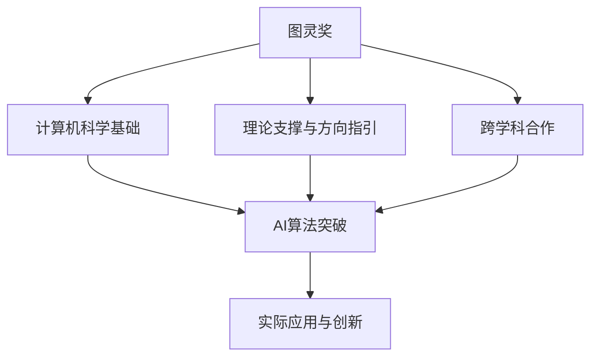

                 

## 1. 背景介绍

图灵奖（Turing Award），全称为ACM图灵奖（ACM Turing Award），被誉为“计算机界的诺贝尔奖”，旨在表彰那些对计算机科学发展做出根本性或革命性贡献的个人。自从1966年设立以来，图灵奖已经成为衡量一位计算机科学家影响力的重要标准。图灵奖得主包括计算机科学的诸多奠基人，如Alan Turing、John von Neumann、Dennis Ritchie、Bjarne Stroustrup、Robert W. Kahn、Brendan Eich、Tim Berners-Lee等。

随着人工智能(AI)技术的飞速发展，越来越多的AI算法取得了突破性的成果，从而受到图灵奖的关注。本文聚焦于图灵奖与AI算法的突破，将从历史和未来两个维度，探讨图灵奖如何影响AI领域，以及AI算法未来可能取得的重大成就。

## 2. 核心概念与联系

### 2.1 核心概念概述

图灵奖与AI算法的突破，本质上是计算机科学与人工智能的深度融合。图灵奖表彰了计算机科学领域的奠基人及其重要贡献，而AI算法突破则是在此基础上，进一步推动了计算机科学的发展。两者之间的联系在于：

- **图灵奖的传承与激励**：图灵奖得主的研究成果不仅奠定了计算机科学的基础，也为后续的AI算法突破提供了理论支撑和方向指引。
- **AI算法的应用与发展**：AI算法的突破为图灵奖提供的理论基础提供了实际应用，推动了计算机科学的实际进步。
- **跨学科合作与创新**：图灵奖的表彰和AI算法的突破，都强调了跨学科合作的重要性，促进了计算机科学与其他科学领域的深度融合。

### 2.2 核心概念原理和架构的 Mermaid 流程图



这个流程图展示了图灵奖与AI算法突破之间的核心概念原理和架构联系：

- 图灵奖为计算机科学提供理论基础和方向指引。
- AI算法突破基于这些基础和指引，推动了计算机科学的实际进步。
- 跨学科合作促进了图灵奖的表彰和AI算法的创新。

## 3. 核心算法原理 & 具体操作步骤

### 3.1 算法原理概述

图灵奖与AI算法的突破，主要体现在以下几个方面：

- **算法设计与优化**：图灵奖得主的工作直接推动了高性能算法的开发，如优化算法、机器学习算法等。
- **系统架构与设计**：图灵奖得主提出的系统架构，为AI算法的分布式、可扩展性等提供了理论依据。
- **数据处理与分析**：图灵奖得主对数据处理和分析技术的研究，为AI算法提供了高效的数据处理工具。

### 3.2 算法步骤详解

1. **理论基础与算法设计**：图灵奖得主的工作提供了基础的理论支撑，指导后续AI算法的设计与优化。
2. **算法实现与验证**：结合理论基础，开发具体的AI算法，并进行实验验证，优化算法性能。
3. **应用落地与扩展**：将优化后的算法应用到实际问题中，并根据实际反馈进一步改进算法。

### 3.3 算法优缺点

- **优点**：
  - 理论支撑，提供算法设计的方向指引。
  - 高效算法，优化算法性能，提高计算效率。
  - 系统架构，支持分布式计算和扩展性。

- **缺点**：
  - 理论复杂，可能难以应用于具体问题。
  - 算法复杂，实现难度大。
  - 依赖大量计算资源，成本高。

### 3.4 算法应用领域

图灵奖与AI算法的突破，涵盖了以下几个应用领域：

- **计算机视觉**：基于深度学习的高性能算法，如图像分类、目标检测、图像分割等。
- **自然语言处理(NLP)**：基于语言模型的文本生成、情感分析、机器翻译等。
- **推荐系统**：基于协同过滤、矩阵分解等算法的个性化推荐。
- **强化学习**：在决策制定、自动控制等领域的应用。
- **数据科学**：基于大数据处理和分析的机器学习算法。

## 4. 数学模型和公式 & 详细讲解 & 举例说明

### 4.1 数学模型构建

图灵奖与AI算法的突破，往往基于复杂的数学模型。例如，深度学习模型可以表示为：

$$
f(x) = \sum_{i=1}^n w_i g_i(x)
$$

其中 $x$ 为输入，$w_i$ 为权重，$g_i(x)$ 为神经元函数。

### 4.2 公式推导过程

以深度学习中的前馈神经网络为例，进行公式推导：

1. 输入层：$x_1, x_2, \dots, x_n$。
2. 隐藏层：$h_1, h_2, \dots, h_m$。
3. 输出层：$y_1, y_2, \dots, y_o$。

前馈过程为：

$$
h_i = g(x_i)
$$

其中 $g$ 为激活函数，如sigmoid、ReLU等。

输出层为：

$$
y_j = f(h_j) = \sum_{i=1}^m w_{ij}g_i(h_j)
$$

其中 $w_{ij}$ 为权重，$g_j$ 为输出函数。

### 4.3 案例分析与讲解

以CNN（卷积神经网络）为例，进行详细讲解：

1. 卷积层：提取图像中的特征。
2. 池化层：减小特征图尺寸，减少计算量。
3. 全连接层：将特征映射到类别概率。

CNN的数学模型为：

$$
f(x) = \sum_{i=1}^n w_i g_i(x)
$$

其中 $x$ 为输入图像，$g_i(x)$ 为卷积核函数，$w_i$ 为权重。

## 5. 项目实践：代码实例和详细解释说明

### 5.1 开发环境搭建

为了进行项目实践，首先需要搭建好开发环境。以下是在Python环境下使用PyTorch进行深度学习开发的流程：

1. 安装Anaconda：从官网下载并安装Anaconda，用于创建独立的Python环境。
2. 创建并激活虚拟环境：
```bash
conda create -n pytorch-env python=3.8 
conda activate pytorch-env
```

3. 安装PyTorch：根据CUDA版本，从官网获取对应的安装命令。例如：
```bash
conda install pytorch torchvision torchaudio cudatoolkit=11.1 -c pytorch -c conda-forge
```

4. 安装TensorFlow：与PyTorch不同，TensorFlow通常需要自行编译安装。
5. 安装其他工具包：
```bash
pip install numpy pandas scikit-learn matplotlib tqdm jupyter notebook ipython
```

### 5.2 源代码详细实现

以下是一个简单的卷积神经网络实现的代码示例：

```python
import torch
import torch.nn as nn
import torch.optim as optim
from torchvision import datasets, transforms

# 定义卷积神经网络
class CNN(nn.Module):
    def __init__(self):
        super(CNN, self).__init__()
        self.conv1 = nn.Conv2d(3, 32, 3)
        self.conv2 = nn.Conv2d(32, 64, 3)
        self.fc1 = nn.Linear(64 * 28 * 28, 128)
        self.fc2 = nn.Linear(128, 10)

    def forward(self, x):
        x = nn.functional.relu(self.conv1(x))
        x = nn.functional.max_pool2d(x, 2)
        x = nn.functional.relu(self.conv2(x))
        x = nn.functional.max_pool2d(x, 2)
        x = x.view(-1, 64 * 28 * 28)
        x = nn.functional.relu(self.fc1(x))
        x = self.fc2(x)
        return nn.functional.log_softmax(x, dim=1)

# 加载数据集
train_dataset = datasets.CIFAR10(root='./data', train=True, download=True, transform=transforms.ToTensor())
test_dataset = datasets.CIFAR10(root='./data', train=False, download=True, transform=transforms.ToTensor())

# 定义模型、优化器和损失函数
model = CNN()
optimizer = optim.Adam(model.parameters(), lr=0.001)
criterion = nn.CrossEntropyLoss()

# 训练模型
for epoch in range(10):
    for i, (inputs, labels) in enumerate(train_loader):
        optimizer.zero_grad()
        outputs = model(inputs)
        loss = criterion(outputs, labels)
        loss.backward()
        optimizer.step()
        print(f'Epoch [{epoch+1}/{10}], Step [{i+1}/{len(train_loader)}], Loss: {loss.item():.4f}')

# 测试模型
correct = 0
total = 0
with torch.no_grad():
    for inputs, labels in test_loader:
        outputs = model(inputs)
        _, predicted = torch.max(outputs.data, 1)
        total += labels.size(0)
        correct += (predicted == labels).sum().item()
print(f'Accuracy of the network on the 10000 test images: {100 * correct / total:.2f}%')
```

### 5.3 代码解读与分析

**CNN类定义**：
- `__init__`方法：初始化卷积层、池化层和全连接层。
- `forward`方法：定义前向传播过程。

**数据集加载**：
- 使用torchvision库加载CIFAR-10数据集，并进行标准化处理。

**模型定义、优化器和损失函数**：
- CNN模型定义，使用Adam优化器，交叉熵损失函数。

**训练模型**：
- 迭代训练模型，输出损失值。

**测试模型**：
- 计算模型在测试集上的准确率。

## 6. 实际应用场景

### 6.1 计算机视觉

计算机视觉是图灵奖与AI算法突破的重要应用领域之一。通过深度学习算法，计算机视觉在图像分类、目标检测、图像分割等方面取得了重大进展。例如，CNN、RNN等模型被广泛应用于图像识别、人脸识别、物体检测等场景。

### 6.2 自然语言处理

自然语言处理(NLP)也是图灵奖与AI算法突破的重要应用领域。基于语言模型的文本生成、情感分析、机器翻译等任务，已经在多个实际应用中取得成功。例如，BERT、GPT等模型在文本生成、问答系统、翻译等方面展示了强大的能力。

### 6.3 推荐系统

推荐系统是图灵奖与AI算法突破的另一个重要应用领域。协同过滤、矩阵分解等算法被广泛应用于电商、新闻、音乐等领域，为个性化推荐提供了强大的支持。

### 6.4 未来应用展望

未来，图灵奖与AI算法突破将进一步推动人工智能技术的发展。以下是对未来应用前景的展望：

- **医疗诊断**：基于深度学习和大数据的医疗诊断系统，能够辅助医生进行疾病诊断，提高诊断准确率。
- **自动驾驶**：通过计算机视觉和强化学习，实现自动驾驶技术，提高交通安全性和效率。
- **金融风控**：基于大数据分析和高性能算法，实现金融风险预测和智能投顾，提升金融服务质量。
- **智能制造**：通过机器学习和计算机视觉技术，实现智能制造和工业自动化，提高生产效率和质量。

## 7. 工具和资源推荐

### 7.1 学习资源推荐

为了帮助开发者系统掌握图灵奖与AI算法的突破，这里推荐一些优质的学习资源：

1. 《深度学习》系列书籍：Ian Goodfellow、Yoshua Bengio、Aaron Courville等作者，系统介绍了深度学习的基本概念和应用。
2. 《机器学习实战》：Peter Harrington著，提供实用的机器学习项目实现案例。
3. 《Python机器学习》：Sebastian Raschka著，详细介绍了机器学习算法和Python实现。
4. CS231n《卷积神经网络》课程：斯坦福大学开设的深度学习课程，系统讲解了卷积神经网络的理论和实践。
5. Stanford NLP课程：斯坦福大学开设的自然语言处理课程，涵盖NLP的基础理论和应用实践。

通过对这些资源的学习实践，相信你一定能够快速掌握图灵奖与AI算法的突破精髓，并用于解决实际的AI问题。

### 7.2 开发工具推荐

高效的开发离不开优秀的工具支持。以下是几款用于图灵奖与AI算法开发的常用工具：

1. PyTorch：基于Python的开源深度学习框架，灵活动态的计算图，适合快速迭代研究。
2. TensorFlow：由Google主导开发的开源深度学习框架，生产部署方便，适合大规模工程应用。
3. JAX：Google开发的基于JIT编译的自动微分库，支持高性能深度学习算法实现。
4. Scikit-learn：基于Python的机器学习库，提供了丰富的机器学习算法和工具。
5. Keras：高层次的深度学习框架，易于使用，适合快速原型开发。

合理利用这些工具，可以显著提升图灵奖与AI算法开发的效率，加快创新迭代的步伐。

### 7.3 相关论文推荐

图灵奖与AI算法的突破源于学界的持续研究。以下是几篇奠基性的相关论文，推荐阅读：

1. Backpropagation Algorithm：Rumelhart、Hinton、Williams等作者，提出了反向传播算法，奠定了深度学习的基础。
2. Convolutional Neural Networks for Images, Videos, and Natural Language：LeCun、Bengio、Hinton等作者，详细介绍了卷积神经网络及其应用。
3. Attention is All You Need：Vaswani等作者，提出了Transformer模型，开启了NLP领域的预训练大模型时代。
4. BERT: Pre-training of Deep Bidirectional Transformers for Language Understanding：Devlin等作者，提出BERT模型，引入基于掩码的自监督预训练任务，刷新了多项NLP任务SOTA。
5. Natural Language Processing with Transformers：Jurafsky、Martin等作者，全面介绍了如何使用Transformers库进行NLP任务开发，包括微调在内的诸多范式。

这些论文代表了大语言模型微调技术的发展脉络。通过学习这些前沿成果，可以帮助研究者把握学科前进方向，激发更多的创新灵感。

## 8. 总结：未来发展趋势与挑战

### 8.1 总结

本文对图灵奖与AI算法的突破进行了全面系统的介绍。首先阐述了图灵奖在计算机科学和AI算法突破中的作用，明确了AI算法突破在推动计算机科学发展方面的重要价值。其次，从原理到实践，详细讲解了图灵奖与AI算法的核心算法设计、具体操作步骤和应用领域，给出了图灵奖与AI算法的代码实例和详细解释。同时，本文还探讨了图灵奖与AI算法的未来发展趋势和面临的挑战，展示了其广阔的应用前景。

通过本文的系统梳理，可以看到，图灵奖与AI算法的突破不仅推动了计算机科学的进步，也为未来AI算法的发展提供了理论指导和实践经验。图灵奖与AI算法的深度融合，将在更多领域带来变革性影响。

### 8.2 未来发展趋势

展望未来，图灵奖与AI算法的突破将呈现以下几个发展趋势：

1. **算法与理论的协同发展**：图灵奖得主的研究成果将继续推动高性能算法的发展，同时算法的研究也将为理论提供更多支持。
2. **跨学科合作与融合**：图灵奖与AI算法的突破将进一步促进计算机科学与其他科学领域的深度融合，推动跨学科创新。
3. **实际应用与产业升级**：更多图灵奖与AI算法的应用将推动各行各业的智能化升级，提升整体效率和质量。
4. **人机协同与智能系统**：图灵奖与AI算法的突破将带来更高效、更可靠的人机协同系统，提升用户体验和系统性能。
5. **隐私与安全**：随着AI算法在各个领域的应用，隐私保护和安全问题将受到更多关注，图灵奖与AI算法的研究也将注重解决这些问题。

### 8.3 面临的挑战

尽管图灵奖与AI算法取得了显著成就，但在迈向更加智能化、普适化应用的过程中，仍面临诸多挑战：

1. **数据与隐私**：大规模数据的使用带来隐私和安全问题，需要开发新的隐私保护技术，同时确保数据使用的合法合规。
2. **算法透明性与可解释性**：AI算法的复杂性和黑盒特性，使得其可解释性和透明性不足，需要研究更多解释性方法，确保算法的可信度和可靠性。
3. **计算资源与效率**：高性能算法的实现需要大量的计算资源，而算法的效率问题也需进一步优化，确保在大规模数据上的快速处理能力。
4. **伦理与社会影响**：AI算法的应用可能带来伦理和社会问题，如就业替代、决策公正性等，需要制定相应的伦理规范和法律法规，确保算法的应用符合社会价值观。

### 8.4 研究展望

未来，图灵奖与AI算法的研究需要从以下几个方面寻求新的突破：

1. **隐私保护技术**：开发新的隐私保护技术，确保数据使用的合法合规，同时保障用户隐私。
2. **可解释性研究**：研究更多可解释性方法，确保算法的透明性和可信度，提高用户信任。
3. **计算资源优化**：优化计算资源的使用，提高算法的效率，确保在大规模数据上的快速处理能力。
4. **伦理与社会影响**：制定相应的伦理规范和法律法规，确保算法的应用符合社会价值观，避免伦理和社会问题。

这些研究方向的探索，必将引领图灵奖与AI算法技术迈向更高的台阶，为构建安全、可靠、可解释、可控的智能系统铺平道路。面向未来，图灵奖与AI算法的研究需要与其他人工智能技术进行更深入的融合，如知识表示、因果推理、强化学习等，多路径协同发力，共同推动自然语言理解和智能交互系统的进步。只有勇于创新、敢于突破，才能不断拓展图灵奖与AI算法的边界，让智能技术更好地造福人类社会。

## 9. 附录：常见问题与解答

**Q1：图灵奖与AI算法突破的典型案例有哪些？**

A: 图灵奖与AI算法突破的典型案例包括：

1. **反向传播算法**：Rumelhart、Hinton、Williams等作者提出的反向传播算法，奠定了深度学习的基础。
2. **卷积神经网络**：LeCun、Bengio、Hinton等作者提出的卷积神经网络，广泛应用于图像分类、目标检测等领域。
3. **Transformer模型**：Vaswani等作者提出的Transformer模型，开启了NLP领域的预训练大模型时代。
4. **BERT模型**：Devlin等作者提出的BERT模型，引入基于掩码的自监督预训练任务，刷新了多项NLP任务SOTA。
5. **GAN生成对抗网络**：Goodfellow等作者提出的生成对抗网络，推动了生成模型和图像生成技术的发展。

**Q2：图灵奖与AI算法突破的未来发展方向是什么？**

A: 图灵奖与AI算法突破的未来发展方向包括：

1. **跨学科融合**：AI算法与生物、物理、化学等领域的融合，推动更多领域的技术突破。
2. **智能系统与自动化**：开发更多智能系统和自动化工具，提升生产效率和生活质量。
3. **隐私保护与伦理**：研究新的隐私保护技术，制定伦理规范，确保AI算法的合法合规和伦理应用。
4. **泛化性与适应性**：开发更多泛化性强、适应性好的算法，提高算法的普适性和鲁棒性。

**Q3：图灵奖与AI算法的突破对计算机科学的影响是什么？**

A: 图灵奖与AI算法的突破对计算机科学的影响包括：

1. **推动理论研究**：图灵奖得主的研究成果为计算机科学的理论研究提供了重要支持。
2. **推动技术进步**：高性能算法的开发为计算机科学的技术进步提供了动力。
3. **推动实际应用**：AI算法在各个领域的广泛应用，提升了计算机科学在实际问题解决中的价值。
4. **推动教育与普及**：图灵奖与AI算法的突破促进了计算机科学的教育和普及，培养更多优秀人才。

通过本文的系统梳理，可以看到，图灵奖与AI算法的突破不仅推动了计算机科学的进步，也为未来AI算法的发展提供了理论指导和实践经验。图灵奖与AI算法的深度融合，将在更多领域带来变革性影响，助力人类社会的智能化升级。

