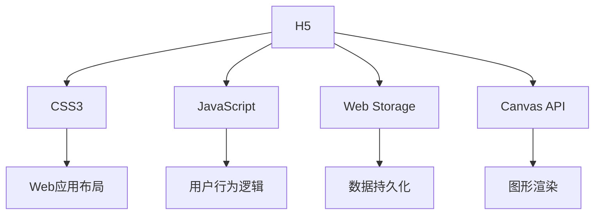

                 

# 基于H5前端开发对自律APP设计与实现

## 1. 背景介绍

### 1.1 问题由来
近年来，随着互联网技术的发展和智能设备的普及，各种类型的应用APP涌现出来，极大地丰富了人们的数字生活。然而，与此同时，用户的信息过载和注意力分散问题也日益凸显，自律和专注力培养成为了一个重要的社会议题。为了帮助用户提高自律性和专注力，大量关于时间管理、学习习惯养成、工作效率提升等方面的应用APP应运而生。

### 1.2 问题核心关键点
本文聚焦于基于H5前端开发设计一款能够帮助用户培养自律习惯的APP。H5（HTML5）作为新兴的前端技术，以其跨平台、可交互、性能优等特点，成为了开发此类APP的首选技术。我们希望通过该APP，帮助用户制定计划、追踪进度、分析数据、提供即时反馈，从而培养良好的自律习惯，提升生活质量和工作效率。

### 1.3 问题研究意义
开发一款基于H5前端技术的自律APP，对于提升用户的自律性和专注力，减轻信息过载压力，具有重要意义：

1. **提高生活质量**：自律APP能够帮助用户管理时间，平衡工作与生活，从而提升整体生活质量。
2. **提升工作效率**：通过自律性培养，用户能够更专注地完成工作任务，减少拖延和分心。
3. **心理调节**：自律APP还能在用户面临压力时提供心理支持，帮助其保持积极向上的心态。
4. **用户隐私保护**：由于采用H5技术，用户数据无需上传到服务器，增强了数据隐私保护。

## 2. 核心概念与联系

### 2.1 核心概念概述

为更好地理解基于H5前端开发的自律APP设计与实现方法，本节将介绍几个关键技术概念：

- **H5（HTML5）**：一种用于构建Web应用的标记语言，支持多媒体、地理位置、本地存储、设备访问等特性，以其跨平台性和良好的性能表现，成为前端开发的首选技术。
- **CSS3**：一种用于Web设计的样式表语言，提供丰富的视觉样式和动画效果，配合H5可以实现优雅的用户界面。
- **JavaScript**：一种用于Web脚本的语言，支持动态交互和逻辑控制，是实现复杂用户行为的核心技术。
- **Web Storage**：一种Web API，用于在客户端存储数据，支持同步和异步访问，增强了APP的数据持久化能力。
- **Canvas API**：一种Web API，支持在HTML5页面中绘制图形，配合JavaScript可以实现复杂交互效果和动态动画。

### 2.2 核心概念原理和架构的 Mermaid 流程图


这个流程图展示了H5前端开发中的核心技术概念及其相互关系：

- **H5** 是基础，提供了丰富的API和标准，使得开发前端应用成为可能。
- **CSS3** 负责实现应用的布局和样式，提供美观的用户界面。
- **JavaScript** 控制应用的动态交互和逻辑，实现复杂的用户行为。
- **Web Storage** 提供数据存储和同步功能，增强应用的数据持久化能力。
- **Canvas API** 用于图形渲染和动态动画效果，提升用户体验。

通过这些技术的组合，可以构建功能丰富、性能优异的自律APP。

## 3. 核心算法原理 & 具体操作步骤
### 3.1 算法原理概述

基于H5前端开发自律APP的核心算法原理，是基于行为数据分析和反馈机制的自律性提升方法。具体步骤如下：

1. **用户行为数据采集**：收集用户每日的工作习惯、时间分配、任务完成情况等数据。
2. **数据分析和统计**：对采集到的行为数据进行分析，生成统计报告，如工作时长、任务完成率、拖延次数等。
3. **自律性评估**：根据数据分析结果，评估用户的自律性水平，标记高自律和低自律的阶段。
4. **反馈机制设计**：设计反馈机制，根据自律性评估结果，及时向用户提供正面或负面的反馈，帮助用户调整行为。

### 3.2 算法步骤详解

**步骤1：用户行为数据采集**
- 使用Web Storage API，存储用户每日的行为数据，如工作时间、任务完成情况、拖延次数等。
- 定期调用API获取最新的数据，进行分析和处理。

**步骤2：数据分析和统计**
- 使用JavaScript编写算法，对行为数据进行统计和分析，计算出用户的工作时长、任务完成率、拖延次数等关键指标。
- 生成图表和报告，直观展示用户的行为模式和自律性水平。

**步骤3：自律性评估**
- 设计自律性评估模型，将用户的行为数据输入模型，得到自律性得分。
- 根据得分，将用户标记为高自律或低自律阶段，并显示相应的状态图标和提示信息。

**步骤4：反馈机制设计**
- 设计正面反馈机制，如奖励标记、鼓励信息、成就徽章等，激励用户保持高自律状态。
- 设计负面反馈机制，如警告提示、任务提醒、心理建议等，帮助用户克服拖延和低自律行为。

### 3.3 算法优缺点

基于H5前端开发的自律APP，具有以下优点：

1. **跨平台性**：H5技术实现了跨设备、跨平台的应用，用户可以在不同设备和操作系统上使用APP。
2. **实时数据同步**：Web Storage API支持数据的实时同步，用户可以在不同设备上查看和更新行为数据。
3. **互动性**：JavaScript和Canvas API提供了丰富的交互功能，能够实现复杂的用户行为逻辑和动态效果。
4. **简单易用**：H5技术的开发门槛较低，不需要编译和打包过程，可以快速迭代和发布APP。

同时，该方法也存在一些局限性：

1. **依赖浏览器环境**：H5技术的性能和兼容性依赖于浏览器的实现，不同浏览器和版本可能会存在差异。
2. **资源限制**：H5技术的渲染和计算能力受限于浏览器的性能，处理大量数据时可能会存在延迟。
3. **安全性问题**：Web Storage API和Canvas API需要考虑用户数据的安全性，防止数据泄露和恶意攻击。

### 3.4 算法应用领域

基于H5前端开发的自律APP，在教育、工作、个人管理等领域具有广泛的应用前景：

1. **在线教育**：通过自律APP，学生可以记录学习时间、完成作业、复习计划等数据，系统根据数据生成学习报告和自律性评估，帮助学生优化学习习惯。
2. **企业培训**：自律APP可以记录员工的工作时间和任务完成情况，系统根据数据生成工作报告和自律性评估，帮助员工提升工作效率和自律性。
3. **个人管理**：自律APP可以帮助个人用户管理时间、设定目标、追踪进度、提供反馈，帮助用户养成良好的生活习惯和工作方式。

## 4. 数学模型和公式 & 详细讲解 & 举例说明

### 4.1 数学模型构建

本节将使用数学语言对自律APP的自律性评估算法进行更加严格的刻画。

设用户每日行为数据为 $D = \{d_1, d_2, ..., d_n\}$，其中 $d_i$ 表示第 $i$ 天的行为数据。用户的工作时长为 $T_i$，任务完成率为 $C_i$，拖延次数为 $L_i$。

定义自律性评估函数 $F(d) = w_1 \times T_i + w_2 \times C_i + w_3 \times L_i$，其中 $w_1, w_2, w_3$ 为自律性评估指标的权重，可以由人工或算法自动设定。

自律性得分 $S$ 为 $S = \frac{1}{n} \sum_{i=1}^n F(d_i)$。

### 4.2 公式推导过程

根据上述公式，自律性评估函数的推导如下：

设自律性评估指标的权重为 $w_1, w_2, w_3$，则自律性得分 $S$ 为：

$$
S = \frac{1}{n} \sum_{i=1}^n (w_1 \times T_i + w_2 \times C_i + w_3 \times L_i)
$$

自律性得分 $S$ 反映了用户在工作时长、任务完成率和拖延次数方面的自律性水平。权重 $w_1, w_2, w_3$ 可以人工设定，也可以根据历史数据自动调整。

### 4.3 案例分析与讲解

以一位学生的自律性评估为例，分析自律APP的计算过程。假设学生每天记录自己的学习时间和完成作业情况，自律APP会根据这些数据计算自律性得分。

设该学生一周的每日行为数据为：

| 日期       | 学习时间（小时） | 完成作业数 | 拖延次数 |
|------------|------------------|------------|----------|
| 星期一     | 2.5              | 3          | 0        |
| 星期二     | 1.5              | 4          | 0        |
| 星期三     | 3                | 5          | 1        |
| 星期四     | 4                | 6          | 0        |
| 星期五     | 3.5              | 5          | 1        |
| 星期六     | 2                | 4          | 0        |
| 星期日     | 1.5              | 3          | 0        |

设自律性评估指标的权重为 $w_1 = 0.5, w_2 = 0.3, w_3 = 0.2$，则自律性得分 $S$ 为：

$$
S = \frac{1}{7} \times (0.5 \times (2.5 + 1.5 + 3 + 4 + 3.5 + 2 + 1.5) + 0.3 \times (3 + 4 + 5 + 6 + 5 + 4 + 3) + 0.2 \times (0 + 0 + 1 + 0 + 1 + 0 + 0)) = 2.95
$$

根据自律性得分 $S$，自律APP可以标记该学生的自律性水平为中等，并提供相应的反馈和建议。

## 5. 项目实践：代码实例和详细解释说明

### 5.1 开发环境搭建

在进行自律APP的开发前，我们需要准备好开发环境。以下是使用HTML5、CSS3和JavaScript进行前端开发的环境配置流程：

1. 安装Node.js：从官网下载并安装Node.js，用于运行npm和Node应用。

2. 创建项目目录：
```bash
mkdir discipline-app
cd discipline-app
```

3. 初始化npm项目：
```bash
npm init -y
```

4. 安装开发依赖：
```bash
npm install express ejs bcryptjs body-parser
```

5. 配置开发服务器：
- 创建一个server.js文件，配置Express框架和EJS模板引擎。
- 编写服务器端代码，处理API请求、数据存储、用户登录等逻辑。

6. 创建前端项目：
- 在项目根目录下创建public目录，存放静态资源。
- 在public目录下创建index.html文件，作为入口页面。

完成上述步骤后，即可在项目目录下启动开发服务器，运行代码。

### 5.2 源代码详细实现

下面以自律APP的首页设计为例，给出使用HTML5、CSS3和JavaScript实现的代码示例。

**index.html代码**：
```html
<!DOCTYPE html>
<html>
<head>
    <meta charset="UTF-8">
    <title>Discipline App</title>
    <link rel="stylesheet" href="style.css">
</head>
<body>
    <div class="container">
        <h1>Welcome to Discipline App</h1>
        <p>Keep track of your daily habits and improve your discipline.</p>
        <a href="/login">Login</a>
    </div>
    <script src="script.js"></script>
</body>
</html>
```

**style.css代码**：
```css
body {
    font-family: Arial, sans-serif;
    margin: 0;
    padding: 0;
    background-color: #f0f0f0;
}

.container {
    width: 80%;
    margin: 0 auto;
    padding: 20px;
    text-align: center;
}

h1 {
    font-size: 36px;
    color: #333;
    margin-bottom: 20px;
}

p {
    font-size: 18px;
    color: #666;
    margin-bottom: 20px;
}

a {
    display: inline-block;
    padding: 10px 20px;
    background-color: #007bff;
    color: #fff;
    text-decoration: none;
    border-radius: 5px;
    margin-top: 20px;
}
```

**script.js代码**：
```javascript
document.addEventListener('DOMContentLoaded', function() {
    // 用户登录逻辑
    var loginButton = document.querySelector('a');
    loginButton.addEventListener('click', function() {
        window.location.href = '/login';
    });
});
```

以上代码实现了自律APP的首页设计，包括欢迎信息、用户登录链接等。

### 5.3 代码解读与分析

**index.html文件**：
- 包含基本HTML结构，设置文档的标题、链接样式表、脚本资源。
- 定义了一个容器div，用于展示欢迎信息和用户登录链接。

**style.css文件**：
- 定义了全局样式，包括字体、边距、背景等。
- 定义了容器的样式，包括宽度、对齐、内边距等。
- 定义了标题和段落的样式，包括字体大小、颜色、内边距等。
- 定义了链接的样式，包括背景、颜色、圆角等。

**script.js文件**：
- 监听DOMContentLoaded事件，即当页面内容和样式加载完成后执行。
- 获取登录链接元素，添加点击事件处理函数，点击后跳转到登录页面。

通过这段代码，我们可以快速搭建自律APP的前端页面，并在浏览器中查看效果。

## 6. 实际应用场景

### 6.1 智能家居

自律APP可以与智能家居设备进行集成，根据用户的自律性评估结果，自动调整家中的环境设置，如灯光亮度、音乐音量、温度等，帮助用户保持高效的工作和生活状态。

### 6.2 远程工作

在远程工作场景中，自律APP可以记录用户的工作时间和任务完成情况，提供实时报告和自律性评估，帮助员工保持高效的工作习惯，提升团队的整体生产力。

### 6.3 学生学习

自律APP可以帮助学生记录学习时间和任务完成情况，生成学习报告和自律性评估，提供学习建议和心理支持，帮助学生优化学习习惯，提升学习成绩。

### 6.4 未来应用展望

随着自律APP技术的不断进步，其在各个行业领域的应用前景将更加广阔。

在智慧城市治理中，自律APP可以用于监测和管理公共设施的使用情况，提升城市管理的自动化和智能化水平，构建更安全、高效的未来城市。

在企业培训中，自律APP可以记录员工的工作时间和任务完成情况，提供实时报告和自律性评估，帮助员工提升工作效率和自律性。

在个人管理中，自律APP可以帮助个人用户管理时间、设定目标、追踪进度、提供反馈，帮助用户养成良好的生活习惯和工作方式。

## 7. 工具和资源推荐

### 7.1 学习资源推荐

为了帮助开发者系统掌握自律APP的技术基础和开发流程，这里推荐一些优质的学习资源：

1. **《Web前端开发指南》**：一本全面介绍HTML5、CSS3和JavaScript的入门书籍，适合初学者快速上手。
2. **Mozilla Developer Network（MDN）**：提供丰富的Web开发文档和API参考，是Web开发者的权威资源。
3. **Codecademy**：提供在线交互式前端开发课程，涵盖HTML5、CSS3和JavaScript的实战技巧。
4. **W3Schools**：提供简洁易懂的Web开发教程，适合快速学习和实践。
5. **YouTube教程**：在YouTube上搜索相关视频教程，学习Web前端开发的最佳实践和技巧。

通过对这些资源的学习实践，相信你一定能够快速掌握自律APP的开发技能，并用于解决实际的自律问题。

### 7.2 开发工具推荐

高效的开发离不开优秀的工具支持。以下是几款用于自律APP开发的常用工具：

1. **Visual Studio Code（VS Code）**：一款轻量级、功能强大的代码编辑器，支持多种语言和插件，是前端开发的首选工具。
2. **Git**：版本控制系统，用于代码的协作和版本管理，是Web开发中不可或缺的工具。
3. **GitHub**：代码托管平台，提供强大的协作和社区支持，方便开发者共享和维护代码。
4. **Postman**：API测试工具，用于模拟API请求和调试，提升开发效率。
5. **Webpack**：前端构建工具，支持模块化、优化和打包，是现代Web开发的标准配置。

合理利用这些工具，可以显著提升自律APP的开发效率，加快创新迭代的步伐。

### 7.3 相关论文推荐

自律APP的设计与实现涉及多个领域的理论和技术，以下是几篇奠基性的相关论文，推荐阅读：

1. **《Web应用设计模式》**：介绍Web应用的常见设计模式和最佳实践，适合了解自律APP的架构和设计思路。
2. **《JavaScript高级程序设计》**：深入讲解JavaScript的语法和编程技巧，是开发自律APP的核心技术指南。
3. **《响应式Web设计》**：介绍响应式Web设计的原理和实现方法，适合理解自律APP的多设备适配和布局。
4. **《Web开发实战》**：通过实际案例讲解Web开发的具体步骤和技巧，适合快速上手自律APP的开发。

这些论文代表了大前端开发的技术前沿，通过学习这些前沿成果，可以帮助研究者把握学科前进方向，激发更多的创新灵感。

## 8. 总结：未来发展趋势与挑战

### 8.1 总结

本文对基于H5前端开发的自律APP进行了全面系统的介绍。首先阐述了自律APP的背景和意义，明确了APP的设计目标和关键技术。其次，从原理到实践，详细讲解了自律性评估和反馈机制的算法原理和具体操作步骤，给出了自律APP的完整代码实例。同时，本文还广泛探讨了自律APP在智慧城市、远程工作、学生学习等多个领域的应用前景，展示了自律APP技术的广阔潜力。最后，本文精选了自律APP技术的各类学习资源和开发工具，力求为开发者提供全方位的技术指引。

通过本文的系统梳理，可以看到，基于H5前端开发的自律APP不仅具有跨平台性、实时数据同步、互动性等优势，还可以帮助用户培养自律性，提升生活质量和工作效率。未来，伴随自律APP技术的不断演进，其在各行各业的应用前景将更加广阔，为数字社会的可持续发展带来新的动力。

### 8.2 未来发展趋势

展望未来，自律APP技术将呈现以下几个发展趋势：

1. **跨平台集成**：自律APP将与其他智能设备和系统进行深度集成，如智能家居、远程工作平台、学习管理系统等，形成完整的自律生态系统。
2. **数据驱动决策**：通过收集和分析用户的自律性数据，生成个性化的行为建议和目标设定，提升自律效果。
3. **多模态交互**：结合语音识别、面部识别、传感器等技术，提供多模态的自律反馈和支持，提升用户体验。
4. **增强现实**：利用增强现实技术，通过AR界面展示自律数据和反馈，增强用户的沉浸感和互动性。
5. **机器学习**：引入机器学习算法，根据用户行为数据自动调整自律性评估指标和反馈机制，提供更加个性化的自律支持。

以上趋势凸显了自律APP技术的未来发展方向，将进一步提升自律APP的智能化和人性化水平，为用户提供更加全面和便捷的服务。

### 8.3 面临的挑战

尽管自律APP技术已经取得了一定的进展，但在迈向更加智能化、普适化应用的过程中，仍面临诸多挑战：

1. **数据隐私和安全**：自律APP需要收集和存储用户的行为数据，如何保护用户隐私和数据安全是一个重要问题。
2. **用户体验设计**：自律APP的交互界面和功能设计需要兼顾简洁易用和功能性，避免过度复杂和冗余。
3. **跨平台兼容性**：不同浏览器和设备的实现差异可能会影响自律APP的性能和用户体验。
4. **性能优化**：自律APP需要处理大量用户数据和实时计算，如何优化性能以提升用户体验，是一个重要的技术挑战。
5. **算法的普适性**：自律性评估和反馈机制需要考虑不同用户的个体差异，如何设计算法以适应多样化的用户需求，是一个难点。

这些挑战需要研究者在技术、设计和用户体验等多个维度进行深入研究和持续优化，才能实现自律APP技术的全面进步。

### 8.4 研究展望

面对自律APP技术面临的挑战，未来的研究需要在以下几个方面寻求新的突破：

1. **数据隐私保护技术**：研究隐私保护算法和加密技术，确保用户数据的安全性。
2. **用户行为模型**：深入研究用户行为规律，设计更加普适和个性化的自律性评估算法。
3. **跨平台一致性**：探索跨平台一致性的实现方法，确保自律APP在不同设备和平台上的统一体验。
4. **性能优化算法**：研究高效的算法和数据结构，提升自律APP的处理能力和响应速度。
5. **多模态交互设计**：探索多模态交互设计的新方法，提升自律APP的用户体验和互动性。

这些研究方向将为自律APP技术的未来发展提供新的思路和技术支持，推动自律APP技术的不断进步。

## 9. 附录：常见问题与解答

**Q1：基于H5前端开发的自律APP如何保证用户数据的安全性？**

A: 基于H5前端开发的自律APP可以通过以下措施保证用户数据的安全性：
1. 使用HTTPS协议，确保数据传输的安全性。
2. 使用Web Storage API进行本地存储，不将数据上传到服务器。
3. 对敏感数据进行加密处理，防止数据泄露。
4. 定期备份数据，防止数据丢失或损坏。

**Q2：如何设计自律APP的用户界面？**

A: 自律APP的用户界面设计需要兼顾简洁易用和功能性，具体设计步骤包括：
1. 研究用户需求和行为，明确界面的核心功能和操作路径。
2. 设计简洁明了的布局和导航，避免界面过度复杂。
3. 使用高对比度和易读的字体，确保界面的可读性。
4. 提供可视化的反馈和提示，帮助用户理解操作结果。
5. 结合用户反馈进行迭代优化，不断提升用户体验。

**Q3：自律APP如何处理大量用户数据？**

A: 自律APP处理大量用户数据时，可以采用以下方法：
1. 优化算法，减少计算量和内存消耗。
2. 采用缓存机制，减少重复计算和数据读取。
3. 使用Web Workers进行后台计算，提升响应速度。
4. 对数据进行分片处理，提高处理效率。

**Q4：自律APP如何实现个性化行为建议？**

A: 自律APP实现个性化行为建议的方法包括：
1. 收集和分析用户的行为数据，生成行为特征向量。
2. 使用机器学习算法，根据行为特征向量生成个性化行为建议。
3. 结合用户的自律性评估结果，生成动态的行为建议。
4. 提供交互式反馈机制，用户可以修改和调整行为建议。

通过这些措施，自律APP可以实现更加个性化的行为建议，帮助用户养成良好的自律习惯。

---

作者：禅与计算机程序设计艺术 / Zen and the Art of Computer Programming

