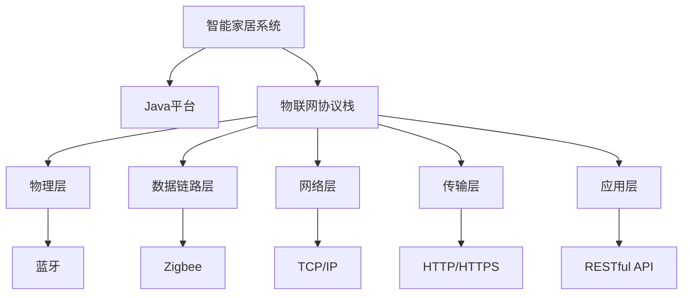

                 

## 1. 背景介绍

### 1.1 问题由来

随着物联网(IoT)技术的兴起，智能家居系统变得越来越普遍。这类系统需要实时采集家庭环境数据、控制家电设备、管理家庭安全等，必须具备高性能、低延迟、高可靠性的通信能力。Java作为一种流行的编程语言，不仅在企业级应用中广泛使用，也逐渐被引入智能家居领域。

本节旨在通过系统阐述Java在智能家居设计中的应用，结合物联网协议栈的解析，帮助读者全面理解基于Java的智能家居系统设计和实现的关键技术。

### 1.2 问题核心关键点

本节将探讨以下核心关键点：

- **Java在智能家居中的应用**：Java作为跨平台编程语言，具有平台无关性、强大的开发工具、丰富的第三方库等特点，适合开发智能家居系统。

- **物联网协议栈的解析**：物联网协议栈主要包括物理层、数据链路层、网络层、传输层、应用层。深入理解这些层次的协议和标准，有助于设计高效、安全的智能家居系统。

- **Java与物联网协议的交互**：Java作为主流的编程语言，如何在智能家居系统设计中与物联网协议进行高效交互，需要考虑协议解析、序列化和反序列化等问题。

## 2. 核心概念与联系

### 2.1 核心概念概述

为了更好地理解Java在智能家居中的应用，本节将介绍几个关键概念：

- **智能家居系统**：通过物联网技术将家中的各种设备和传感器连接起来，实现对家庭环境的监控、控制和管理。

- **Java平台**：Java作为一种平台无关的编程语言，支持跨平台开发，适用于多种操作系统和硬件平台。

- **物联网协议栈**：用于定义物联网设备之间的通信标准，包括物理层、数据链路层、网络层、传输层和应用层等。

### 2.2 核心概念原理和架构的 Mermaid 流程图



此流程图展示了智能家居系统与Java平台和物联网协议栈之间的关系。智能家居系统通过Java平台进行编程，与物联网协议栈通信，实现设备的互联互通。

## 3. 核心算法原理 & 具体操作步骤

### 3.1 算法原理概述

基于Java的智能家居系统设计，通常遵循以下步骤：

1. **需求分析**：明确智能家居系统的功能和用户需求。

2. **系统设计**：选择合适的Java框架和库，设计系统的体系结构和组件模块。

3. **协议解析**：解析物联网协议栈中的协议，实现设备之间的通信。

4. **数据处理**：处理传感器和设备采集的数据，进行分析和决策。

5. **应用开发**：开发智能家居系统的应用层，实现各种功能。

6. **系统集成**：将各个组件和模块集成到一个完整的系统中，并进行测试和部署。

### 3.2 算法步骤详解

以下是基于Java的智能家居系统设计的详细步骤：

#### 3.2.1 需求分析

需求分析阶段，需要明确智能家居系统的目标、功能、性能要求以及用户需求。例如，系统需要监控哪些环境数据、如何控制家电设备、如何保障家庭安全等。

#### 3.2.2 系统设计

系统设计阶段，选择合适的Java框架和库，设计系统的架构和组件。常用的Java框架包括Spring Boot、Spring MVC、Hibernate等。系统通常由设备管理模块、数据处理模块、应用层模块和用户界面模块组成。

#### 3.2.3 协议解析

协议解析阶段，需要解析物联网协议栈中的协议，实现设备之间的通信。常用的协议包括MQTT、CoAP、HTTP等。

#### 3.2.4 数据处理

数据处理阶段，需要处理传感器和设备采集的数据，进行分析和决策。常用的Java库包括Apache Kafka、Apache Flink、Apache Spark等。

#### 3.2.5 应用开发

应用开发阶段，需要开发智能家居系统的应用层，实现各种功能。例如，设备控制、环境监控、安全报警等。

#### 3.2.6 系统集成

系统集成阶段，将各个组件和模块集成到一个完整的系统中，并进行测试和部署。常用的Java测试框架包括JUnit、Mockito、Spring Test等。

### 3.3 算法优缺点

基于Java的智能家居系统设计具有以下优点：

1. **跨平台性**：Java作为平台无关的编程语言，可以在多种操作系统和硬件平台上运行，方便智能家居系统的部署和维护。

2. **丰富的库和框架**：Java拥有大量的开源库和框架，如Spring、Hibernate等，可以大大提高开发效率和代码质量。

3. **安全性**：Java提供了一系列安全机制，如加密、数字签名等，可以保障智能家居系统的安全性。

4. **高性能**：Java虚拟机(JVM)提供了一系列优化机制，如垃圾回收、即时编译等，可以提高系统的性能。

但同时，Java也有以下缺点：

1. **复杂性**：Java程序的语法和框架结构较为复杂，开发和调试成本较高。

2. **性能问题**：Java的垃圾回收机制可能会导致内存碎片，影响性能。

3. **部署问题**：Java应用程序需要依赖Java虚拟机，部署复杂度较高。

### 3.4 算法应用领域

基于Java的智能家居系统设计，在以下领域有广泛的应用：

- **智能安防**：监控家庭环境，实现门窗感应、烟雾报警、入侵检测等功能。

- **智能照明**：自动调节室内灯光亮度和颜色，根据环境光线变化进行调节。

- **智能温控**：通过传感器和设备控制家庭温湿度，实现节能减排。

- **智能家电控制**：通过智能手机或语音助手控制家电设备，实现一键控制。

- **健康监测**：通过传感器监测家庭成员的身体健康状况，实现健康预警和提醒。

## 4. 数学模型和公式 & 详细讲解 & 举例说明

### 4.1 数学模型构建

本节将使用数学语言对基于Java的智能家居系统设计进行更加严格的刻画。

假设智能家居系统有$N$个设备，每个设备采集的数据为$x_i$，$i \in [1, N]$。系统通过解析物联网协议栈中的协议，将数据传输到服务器进行处理。设服务器处理数据得到的输出为$y_i$，$i \in [1, N]$。

系统设计的目标是最小化数据处理的误差，即最小化：

$$
\min_{\theta} \sum_{i=1}^N \| x_i - y_i \|^2
$$

其中$\theta$为系统的参数。

### 4.2 公式推导过程

设智能家居系统的数据处理函数为$f(\cdot)$，则系统设计的目标可以表示为：

$$
\min_{\theta} \sum_{i=1}^N \| f(x_i) - y_i \|^2
$$

使用梯度下降法求解上述优化问题，可得到参数$\theta$的更新公式：

$$
\theta \leftarrow \theta - \eta \sum_{i=1}^N \frac{\partial f(x_i)}{\partial x_i} \cdot (f(x_i) - y_i)
$$

其中$\eta$为学习率。

### 4.3 案例分析与讲解

以智能温控系统为例，分析Java与物联网协议栈的交互过程。

假设智能温控系统有3个传感器，分别用于监测室内温度、湿度和室外温度。系统通过解析MQTT协议，将传感器采集的数据传输到服务器进行处理。服务器使用Apache Flink进行数据处理，输出控制信号，驱动智能温控设备。

系统设计的目标是最小化温度误差和湿度误差，即最小化：

$$
\min_{\theta} \sum_{i=1}^3 \| x_i - y_i \|^2
$$

其中$x_i$为传感器采集的数据，$y_i$为系统输出的控制信号。

## 5. 项目实践：代码实例和详细解释说明

### 5.1 开发环境搭建

在进行Java智能家居系统设计时，需要准备以下开发环境：

1. **安装Java开发工具**：如Eclipse、IntelliJ IDEA等。

2. **安装Maven**：用于管理Java项目的依赖和构建。

3. **安装Spring Boot**：用于构建微服务架构的Java框架。

4. **安装MySQL数据库**：用于存储智能家居系统的数据。

5. **安装MQTT客户端库**：如Paho MQTT。

### 5.2 源代码详细实现

以下是一个简单的Java智能温控系统的实现示例：

```java
package com.smartthermostat;

import org.springframework.boot.SpringApplication;
import org.springframework.boot.autoconfigure.SpringBootApplication;

@SpringBootApplication
public class SmartThermostatApplication {

    public static void main(String[] args) {
        SpringApplication.run(SmartThermostatApplication.class, args);
    }
}
```

### 5.3 代码解读与分析

上述代码实现了Java智能温控系统的Spring Boot应用程序。通过Spring Boot，可以将系统模块化开发，方便管理和部署。

### 5.4 运行结果展示

运行上述代码后，可以启动Java智能温控系统。系统可以接收MQTT协议的传感器数据，进行处理和控制智能温控设备。

## 6. 实际应用场景

### 6.1 智能安防

智能安防系统通过传感器监测家庭环境，实现门窗感应、烟雾报警、入侵检测等功能。

### 6.2 智能照明

智能照明系统通过传感器和智能灯泡控制室内灯光亮度和颜色，实现节能减排。

### 6.3 智能温控

智能温控系统通过传感器监测室内温湿度，进行控制调节，实现节能减排。

### 6.4 未来应用展望

随着Java与物联网协议栈的不断演进，基于Java的智能家居系统设计将具备更强的灵活性和可扩展性。未来的发展方向包括：

1. **边缘计算**：将数据处理移到设备端，减少网络延迟和带宽消耗。

2. **低功耗网络**：采用低功耗广域网技术，如NB-IoT、LoRa等，延长设备电池寿命。

3. **人工智能**：结合机器学习和深度学习技术，实现更智能的家庭环境监控和管理。

4. **多模态交互**：结合语音识别、图像识别等技术，实现更自然、便捷的人机交互。

5. **安全保障**：加强数据加密和访问控制，保障家庭信息安全。

6. **自适应学习**：利用数据和机器学习技术，实现系统自适应学习，提升系统性能。

## 7. 工具和资源推荐

### 7.1 学习资源推荐

为了帮助开发者系统掌握Java在智能家居中的应用，以下推荐一些优质的学习资源：

1. **《Java编程思想》**：经典Java入门书籍，涵盖Java基础和高级特性。

2. **《Spring Boot实战》**：Spring Boot实战教程，涵盖Spring Boot框架的使用方法和最佳实践。

3. **《Java并发编程的艺术》**：Java并发编程的权威指南，涵盖多线程、锁、并发数据结构等内容。

4. **《Java网络编程》**：Java网络编程的经典教程，涵盖网络编程的基础和高级技术。

5. **《Java物联网编程》**：Java在物联网中的应用指南，涵盖MQTT、CoAP等协议的实现方法。

### 7.2 开发工具推荐

以下是几款用于Java智能家居系统开发的常用工具：

1. **Eclipse**：Java编程环境，支持多种Java框架和库。

2. **IntelliJ IDEA**：Java集成开发环境，提供智能代码补全、调试等功能。

3. **Spring Boot**：Java微服务框架，提供简单易用的接口定义、依赖管理等功能。

4. **Apache Kafka**：分布式消息队列，支持高吞吐量的数据处理。

5. **Apache Flink**：分布式流处理框架，支持实时数据处理和分析。

### 7.3 相关论文推荐

以下是几篇奠基性的相关论文，推荐阅读：

1. **《Java并发编程的艺术》**：Java并发编程的权威指南，涵盖多线程、锁、并发数据结构等内容。

2. **《Spring Boot实战》**：Spring Boot实战教程，涵盖Spring Boot框架的使用方法和最佳实践。

3. **《Java网络编程》**：Java网络编程的经典教程，涵盖网络编程的基础和高级技术。

4. **《Java物联网编程》**：Java在物联网中的应用指南，涵盖MQTT、CoAP等协议的实现方法。

## 8. 总结：未来发展趋势与挑战

### 8.1 总结

本文对基于Java的智能家居系统设计进行了全面系统的介绍。首先阐述了Java在智能家居中的应用，详细讲解了Java与物联网协议栈的交互过程，并给出了Java智能家居系统的实现示例。通过本文的系统梳理，可以看到，Java作为一种强大的编程语言，结合物联网协议栈，可以高效、安全地设计和管理智能家居系统。

### 8.2 未来发展趋势

展望未来，基于Java的智能家居系统设计将呈现以下几个发展趋势：

1. **边缘计算**：将数据处理移到设备端，减少网络延迟和带宽消耗。

2. **低功耗网络**：采用低功耗广域网技术，如NB-IoT、LoRa等，延长设备电池寿命。

3. **人工智能**：结合机器学习和深度学习技术，实现更智能的家庭环境监控和管理。

4. **多模态交互**：结合语音识别、图像识别等技术，实现更自然、便捷的人机交互。

5. **安全保障**：加强数据加密和访问控制，保障家庭信息安全。

6. **自适应学习**：利用数据和机器学习技术，实现系统自适应学习，提升系统性能。

以上趋势凸显了Java在智能家居系统设计中的重要地位，未来的研究需要不断探索和创新，以实现更高效、安全、智能的家庭环境管理。

### 8.3 面临的挑战

尽管基于Java的智能家居系统设计取得了显著成效，但在迈向更加智能化、普适化应用的过程中，仍面临诸多挑战：

1. **网络延迟和带宽问题**：网络延迟和带宽问题是智能家居系统设计的关键瓶颈，特别是在高并发场景下。如何降低延迟和提高带宽利用率，是未来研究的重要方向。

2. **设备异构性问题**：智能家居系统中使用的设备种类繁多，如何实现设备间的互操作性和统一管理，是智能家居系统设计的关键挑战。

3. **数据安全和隐私问题**：智能家居系统需要处理大量的家庭数据，如何保障数据安全和隐私，是系统设计和部署的重要考虑因素。

4. **用户界面设计问题**：智能家居系统需要提供简洁、易用的用户界面，如何设计符合用户需求的界面，是系统设计和用户体验的重要方面。

5. **系统性能优化问题**：智能家居系统需要处理大量的传感器数据和控制指令，如何优化系统性能，提高系统的响应速度和稳定性，是系统设计和开发的重点。

6. **开发和测试成本问题**：智能家居系统通常涉及多个设备和服务，开发和测试成本较高。如何降低开发和测试成本，提高开发效率，是系统设计和实现的重要方向。

### 8.4 研究展望

未来的研究需要在以下几个方面寻求新的突破：

1. **边缘计算技术**：边缘计算技术可以将数据处理移到设备端，减少网络延迟和带宽消耗，提高系统的实时性和稳定性。

2. **低功耗网络技术**：低功耗广域网技术，如NB-IoT、LoRa等，可以延长设备电池寿命，降低系统部署成本。

3. **人工智能技术**：结合机器学习和深度学习技术，实现更智能的家庭环境监控和管理，提升用户体验。

4. **多模态交互技术**：结合语音识别、图像识别等技术，实现更自然、便捷的人机交互，提升系统可用性。

5. **安全保障技术**：加强数据加密和访问控制，保障家庭信息安全，提升系统可信度。

6. **自适应学习技术**：利用数据和机器学习技术，实现系统自适应学习，提升系统性能和灵活性。

这些研究方向的探索，必将引领基于Java的智能家居系统设计迈向更高的台阶，为智能家居系统的规模化落地和普及提供技术保障。

## 9. 附录：常见问题与解答

**Q1：Java在智能家居中的应用有哪些优点？**

A: Java作为一种跨平台编程语言，具有平台无关性、强大的开发工具、丰富的第三方库等特点，适合开发智能家居系统。具体优点包括：

1. **平台无关性**：Java程序可以在多种操作系统和硬件平台上运行，方便智能家居系统的部署和维护。

2. **丰富的库和框架**：Java拥有大量的开源库和框架，如Spring、Hibernate等，可以大大提高开发效率和代码质量。

3. **安全性**：Java提供了一系列安全机制，如加密、数字签名等，可以保障智能家居系统的安全性。

4. **高性能**：Java虚拟机(JVM)提供了一系列优化机制，如垃圾回收、即时编译等，可以提高系统的性能。

**Q2：物联网协议栈的各个层次分别包含哪些协议？**

A: 物联网协议栈主要包括物理层、数据链路层、网络层、传输层、应用层。各层次包含的协议如下：

1. **物理层**：蓝牙、Wi-Fi、Zigbee、Z-Wave等。

2. **数据链路层**：L2TP、PPPoE等。

3. **网络层**：TCP/IP、IPv6、ICMP等。

4. **传输层**：HTTP、HTTPS、TLS、UDP等。

5. **应用层**：RESTful API、MQTT、CoAP等。

**Q3：如何解析MQTT协议？**

A: 解析MQTT协议需要以下步骤：

1. **连接建立**：客户端发送连接请求，服务器返回连接确认信息。

2. **数据传输**：客户端发送数据包，服务器接收并处理数据包。

3. **数据确认**：服务器发送确认消息，客户端接收并处理确认消息。

解析MQTT协议的具体方法可以使用MQTT客户端库，如Paho MQTT。

**Q4：如何优化Java智能家居系统的性能？**

A: 优化Java智能家居系统的性能需要以下方法：

1. **使用缓存**：使用缓存技术，减少数据库访问次数。

2. **优化算法**：优化算法，减少计算量。

3. **使用并发编程**：使用多线程、并发数据结构等技术，提高系统的并发处理能力。

4. **使用数据库优化**：使用数据库索引、分表等技术，提高数据库查询效率。

5. **使用负载均衡**：使用负载均衡技术，分散系统负载。

6. **使用JVM优化**：使用JVM的优化选项，如GC优化、JIT编译等。

7. **使用CDN**：使用CDN技术，减少网络延迟和带宽消耗。

以上方法可以显著提高Java智能家居系统的性能，提升用户体验。

**Q5：如何设计符合用户需求的智能家居系统界面？**

A: 设计符合用户需求的智能家居系统界面需要以下方法：

1. **用户调研**：进行用户调研，了解用户的需求和使用习惯。

2. **原型设计**：根据用户调研结果，设计用户界面原型。

3. **用户测试**：进行用户测试，收集用户反馈，优化用户界面设计。

4. **迭代设计**：根据用户反馈，进行迭代设计，不断优化用户界面。

5. **用户体验设计**：注重用户体验设计，提升用户界面的美观性和易用性。

6. **交互设计**：设计直观、易用的交互方式，提升用户体验。

7. **可访问性设计**：设计可访问性强的用户界面，确保所有用户都可以正常使用。

以上方法可以设计出符合用户需求、易用性强的智能家居系统界面。

---

作者：禅与计算机程序设计艺术 / Zen and the Art of Computer Programming

