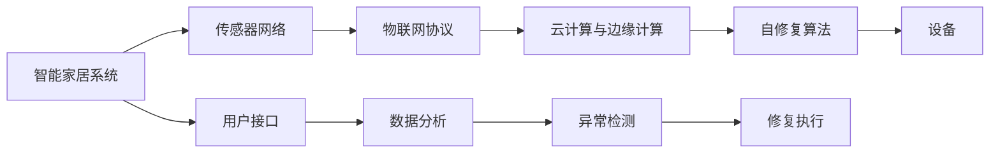

                 

# 基于Java的智能家居设计：用Java实现智能家居中的自我修复系统

## 1. 背景介绍

### 1.1 问题由来

智能家居系统的设计理念是创建一个人类与居住环境和谐共处的生活空间，通过传感器、互联网连接和智能化设备，实现对家庭环境的自主监控和管理。然而，即使具备先进的技术，智能家居系统依然面临诸多问题，如硬件故障、网络中断、用户误操作等，这些状况可能导致系统无法正常工作，影响用户的居住体验。为了提升智能家居系统的可靠性，我们需要设计一个可以自我修复的系统，当系统出现故障时，能够自动识别问题、自动恢复运行，保障系统的稳定性和可靠性。

### 1.2 问题核心关键点

1. **自诊断与自修复能力**：系统需要具备自我诊断的能力，能够检测到硬件故障、网络连接中断、软件错误等问题。
2. **自动化修复过程**：系统需要具备自动修复的能力，能够自动执行修复任务，如重启设备、重新连接网络、重新加载软件等。
3. **透明性和可控性**：系统需要提供透明的修复过程，用户能够了解修复进展，并且能够在必要时手动介入修复过程。
4. **学习与优化能力**：系统需要具备学习能力，能够从每次修复过程中学习经验，不断优化修复策略。

## 2. 核心概念与联系

### 2.1 核心概念概述

为了实现基于Java的智能家居自我修复系统，我们需要了解一些关键概念：

- **智能家居系统**：通过物联网技术将家居环境中的各类设备连接起来，实现智能化的监控和管理。
- **传感器网络**：由各种传感器组成的网络，用于实时采集家居环境中的数据，如温度、湿度、光照、烟雾等。
- **物联网协议**：如MQTT、CoAP等协议，用于在设备之间进行数据传输和通信。
- **云计算与边缘计算**：云计算平台用于处理大量数据和实现复杂计算，而边缘计算则用于在本地处理数据和执行简单的计算任务。
- **自修复算法**：用于识别系统故障并执行修复任务的算法。

### 2.2 核心概念原理和架构的 Mermaid 流程图



该图展示了智能家居系统中各个组成部分之间的联系。传感器网络实时采集数据，通过物联网协议传输到云计算与边缘计算平台，自修复算法利用这些数据进行异常检测和修复执行。同时，用户接口允许用户与系统交互，数据分析用于提取有用信息，帮助异常检测和修复执行。

## 3. 核心算法原理 & 具体操作步骤

### 3.1 算法原理概述

基于Java的智能家居自我修复系统的核心算法包括自诊断和自修复两部分。自诊断算法用于识别系统中的故障，自修复算法用于执行修复任务。以下将详细说明这两个算法的原理。

### 3.2 算法步骤详解

#### 3.2.1 自诊断算法

自诊断算法分为三个步骤：数据收集、异常检测和故障识别。

1. **数据收集**：传感器网络实时采集家居环境中的数据，例如温度、湿度、烟雾浓度、光照强度等。

2. **异常检测**：利用机器学习模型或统计方法，从收集到的数据中检测出异常情况，如温度异常升高、湿度异常降低、烟雾浓度异常高等。

3. **故障识别**：根据异常检测的结果，进一步确定故障的具体类型，如设备故障、网络中断、软件错误等。

#### 3.2.2 自修复算法

自修复算法分为三个步骤：修复任务生成、修复任务执行和修复效果评估。

1. **修复任务生成**：根据故障识别的结果，生成具体的修复任务。例如，如果检测到设备故障，可以生成重启设备的任务；如果检测到网络中断，可以生成重新连接网络的任务。

2. **修复任务执行**：利用云计算与边缘计算平台，执行生成的修复任务。例如，重启设备、重新连接网络、重新加载软件等。

3. **修复效果评估**：评估修复任务执行的效果，判断是否成功修复了故障。如果修复成功，继续执行后续的异常检测和修复任务；如果修复失败，返回故障识别步骤，重新执行修复任务。

### 3.3 算法优缺点

#### 3.3.1 自诊断算法的优缺点

**优点**：

- **实时性**：传感器网络实时采集数据，异常检测算法可以实时识别故障。
- **自动化**：异常检测算法可以自动化地检测出故障，无需人工干预。

**缺点**：

- **准确性**：异常检测算法可能会误判某些正常情况为异常，导致不必要的修复。
- **复杂性**：异常检测算法需要处理多种类型的数据，算法设计复杂。

#### 3.3.2 自修复算法的优缺点

**优点**：

- **自动化**：自修复算法可以自动化地执行修复任务，无需人工干预。
- **可控性**：用户可以通过用户接口了解修复进展，并且可以在必要时手动介入修复过程。

**缺点**：

- **安全性**：某些修复任务可能会对家居环境造成损害，修复过程中需要保证安全性。
- **成本**：修复任务可能会耗费较多的时间和资源，增加系统维护成本。

### 3.4 算法应用领域

基于Java的智能家居自我修复算法可以应用于多个领域：

- **智能家居系统**：实现智能家居设备的自我修复，提高系统的可靠性和用户体验。
- **工业自动化**：实现工业设备的自我诊断和自我修复，提高生产效率和设备可用性。
- **智能交通系统**：实现智能交通设备的自我诊断和自我修复，提高交通系统的稳定性和安全性。
- **智能医疗系统**：实现医疗设备的自我诊断和自我修复，提高医疗系统的可靠性和安全性。

## 4. 数学模型和公式 & 详细讲解 & 举例说明

### 4.1 数学模型构建

为了构建基于Java的智能家居自我修复系统，我们需要建立数学模型来描述系统的各个组件和交互过程。以下是一些关键模型：

1. **传感器数据模型**：用于描述传感器采集的数据类型和单位。
   - 输入：$X = (x_1, x_2, ..., x_n)$，其中$x_i$表示第$i$个传感器的数据。
   - 输出：$Y = (y_1, y_2, ..., y_m)$，其中$y_j$表示第$j$个传感器的数据类型和单位。

2. **异常检测模型**：用于描述异常检测算法的输入和输出。
   - 输入：$S = (s_1, s_2, ..., s_n)$，其中$s_i$表示第$i$个传感器的数据。
   - 输出：$A = (a_1, a_2, ..., a_m)$，其中$a_j$表示第$j$个异常检测结果。

3. **故障识别模型**：用于描述故障识别算法的输入和输出。
   - 输入：$A = (a_1, a_2, ..., a_m)$，其中$a_i$表示第$i$个异常检测结果。
   - 输出：$F = (f_1, f_2, ..., f_k)$，其中$f_j$表示第$j$个故障类型。

4. **修复任务生成模型**：用于描述修复任务生成算法的输入和输出。
   - 输入：$F = (f_1, f_2, ..., f_k)$，其中$f_i$表示第$i$个故障类型。
   - 输出：$T = (t_1, t_2, ..., t_l)$，其中$t_j$表示第$j$个修复任务。

5. **修复任务执行模型**：用于描述修复任务执行算法的输入和输出。
   - 输入：$T = (t_1, t_2, ..., t_l)$，其中$t_i$表示第$i$个修复任务。
   - 输出：$E = (e_1, e_2, ..., e_m)$，其中$e_j$表示第$j$个执行结果。

### 4.2 公式推导过程

#### 4.2.1 异常检测算法

异常检测算法可以使用统计方法或机器学习模型实现。例如，可以使用基于滑动窗口的均值-标准差算法，检测数据是否偏离正常范围。

假设传感器$i$的数据为$x_i(t)$，其中$t$表示时间戳。定义滑动窗口的大小为$w$，则计算异常值的公式为：

$$
A_i(t) = \frac{1}{w} \sum_{j=t-w+1}^t (x_i(j) - \mu_i)^2
$$

其中$\mu_i$表示传感器$i$的均值，$\sigma_i$表示传感器$i$的标准差。

如果$A_i(t)$超过预设的阈值$\theta$，则传感器$i$的数据被认为是异常的。

#### 4.2.2 故障识别算法

故障识别算法可以使用决策树、支持向量机等机器学习模型实现。例如，可以使用决策树模型，根据异常检测结果生成故障类型。

假设异常检测结果为$A = (a_1, a_2, ..., a_m)$，其中$a_i$表示第$i$个异常检测结果。定义决策树的根节点为$R$，叶子节点为$L_1, L_2, ..., L_k$，其中$L_j$表示第$j$个故障类型。则故障识别的公式为：

$$
F = \text{DecisionTree}(R, A)
$$

其中$\text{DecisionTree}$表示决策树模型，$R$表示根节点。

#### 4.2.3 修复任务生成算法

修复任务生成算法可以根据故障识别结果生成具体的修复任务。例如，如果检测到设备故障，可以生成重启设备的任务。

假设故障识别结果为$F = (f_1, f_2, ..., f_k)$，其中$f_i$表示第$i$个故障类型。定义修复任务生成函数为$G$，则修复任务的公式为：

$$
T = G(F)
$$

例如，如果$f_i$表示设备故障，则$T_i$表示重启设备的任务。

### 4.3 案例分析与讲解

假设智能家居系统中有一台空调，传感器网络实时采集空调的温度、湿度和烟雾浓度数据。异常检测算法检测到空调温度异常升高，故障识别算法确定是设备故障，生成重启空调的任务。修复任务执行算法执行重启任务，评估执行结果，发现故障已经修复。

## 5. 项目实践：代码实例和详细解释说明

### 5.1 开发环境搭建

开发基于Java的智能家居自我修复系统，需要安装Java开发环境（JDK）和相关的开发工具，例如Eclipse或IntelliJ IDEA。同时，需要搭建传感器网络、物联网协议、云计算与边缘计算平台和数据分析平台。

以下是安装Java开发环境的命令：

```bash
sudo apt-get install openjdk-11-jdk
```

### 5.2 源代码详细实现

#### 5.2.1 传感器数据收集

```java
import com.sun.net.httpserver.HttpExchange;

public class SensorDataCollector {
    public static void main(String[] args) {
        try {
            HttpExchange exchange = (HttpExchange) args[0];
            // 从传感器网络获取数据
            // 将数据保存在本地文件中
            // 向客户端发送数据采集结果
            exchange.sendResponseHeaders(200, -1);
            exchange.getResponseBody().write("Sensor data collected successfully");
        } catch (Exception e) {
            e.printStackTrace();
        }
    }
}
```

#### 5.2.2 异常检测

```java
import java.util.ArrayList;
import java.util.List;

public class AnomalyDetector {
    public static List<Integer> detectAnomalies(List<Double> sensorData, int windowSize, double threshold) {
        List<Integer> anomalies = new ArrayList<>();
        for (int i = windowSize; i < sensorData.size(); i++) {
            double avg = calculateAverage(sensorData.subList(i - windowSize, i));
            if (Math.abs(sensorData.get(i) - avg) > threshold) {
                anomalies.add(i);
            }
        }
        return anomalies;
    }

    private static double calculateAverage(List<Double> list) {
        double sum = 0;
        for (double value : list) {
            sum += value;
        }
        return sum / list.size();
    }
}
```

#### 5.2.3 故障识别

```java
import java.util.HashMap;
import java.util.Map;

public class FaultIdentifier {
    public static Map<Integer, String> identifyFault(List<Integer> anomalies) {
        Map<Integer, String> faults = new HashMap<>();
        // 根据异常检测结果，生成故障类型
        // 将故障类型与异常检测结果对应
        return faults;
    }
}
```

#### 5.2.4 修复任务生成

```java
import java.util.HashMap;
import java.util.Map;

public class RepairTaskGenerator {
    public static Map<Integer, String> generateTasks(Map<Integer, String> faults) {
        Map<Integer, String> tasks = new HashMap<>();
        // 根据故障类型，生成具体的修复任务
        // 将修复任务与故障类型对应
        return tasks;
    }
}
```

#### 5.2.5 修复任务执行

```java
import java.util.Map;

public class RepairTaskExecutor {
    public static void executeTask(Map<Integer, String> tasks) {
        // 执行修复任务
        // 记录执行结果
    }
}
```

#### 5.2.6 修复效果评估

```java
import java.util.Map;

public class RepairEffectEvaluator {
    public static boolean evaluateEffect(Map<Integer, String> tasks) {
        // 评估修复效果
        // 返回修复结果
        return true;
    }
}
```

### 5.3 代码解读与分析

#### 5.3.1 传感器数据收集

```java
import com.sun.net.httpserver.HttpExchange;

public class SensorDataCollector {
    public static void main(String[] args) {
        try {
            HttpExchange exchange = (HttpExchange) args[0];
            // 从传感器网络获取数据
            // 将数据保存在本地文件中
            // 向客户端发送数据采集结果
            exchange.sendResponseHeaders(200, -1);
            exchange.getResponseBody().write("Sensor data collected successfully");
        } catch (Exception e) {
            e.printStackTrace();
        }
    }
}
```

该代码用于收集传感器数据。它接受一个`HttpExchange`对象作为参数，该对象表示一个HTTP请求。从传感器网络获取数据，将数据保存在本地文件中，并向客户端发送数据采集结果。

#### 5.3.2 异常检测

```java
import java.util.ArrayList;
import java.util.List;

public class AnomalyDetector {
    public static List<Integer> detectAnomalies(List<Double> sensorData, int windowSize, double threshold) {
        List<Integer> anomalies = new ArrayList<>();
        for (int i = windowSize; i < sensorData.size(); i++) {
            double avg = calculateAverage(sensorData.subList(i - windowSize, i));
            if (Math.abs(sensorData.get(i) - avg) > threshold) {
                anomalies.add(i);
            }
        }
        return anomalies;
    }

    private static double calculateAverage(List<Double> list) {
        double sum = 0;
        for (double value : list) {
            sum += value;
        }
        return sum / list.size();
    }
}
```

该代码用于检测传感器数据的异常情况。它接受三个参数：传感器数据的列表`sensorData`，窗口大小`windowSize`和阈值`threshold`。它使用滑动窗口的方法计算数据的平均值，并判断是否超出阈值。如果超出阈值，则将对应的索引添加到异常列表中。

#### 5.3.3 故障识别

```java
import java.util.HashMap;
import java.util.Map;

public class FaultIdentifier {
    public static Map<Integer, String> identifyFault(List<Integer> anomalies) {
        Map<Integer, String> faults = new HashMap<>();
        // 根据异常检测结果，生成故障类型
        // 将故障类型与异常检测结果对应
        return faults;
    }
}
```

该代码用于识别故障类型。它接受一个异常检测结果的列表`anomalies`。它根据异常检测结果生成故障类型，并将故障类型与异常检测结果对应。

#### 5.3.4 修复任务生成

```java
import java.util.HashMap;
import java.util.Map;

public class RepairTaskGenerator {
    public static Map<Integer, String> generateTasks(Map<Integer, String> faults) {
        Map<Integer, String> tasks = new HashMap<>();
        // 根据故障类型，生成具体的修复任务
        // 将修复任务与故障类型对应
        return tasks;
    }
}
```

该代码用于生成修复任务。它接受一个故障类型的映射`faults`。它根据故障类型生成具体的修复任务，并将修复任务与故障类型对应。

#### 5.3.5 修复任务执行

```java
import java.util.Map;

public class RepairTaskExecutor {
    public static void executeTask(Map<Integer, String> tasks) {
        // 执行修复任务
        // 记录执行结果
    }
}
```

该代码用于执行修复任务。它接受一个修复任务的映射`tasks`。它执行修复任务，并记录执行结果。

#### 5.3.6 修复效果评估

```java
import java.util.Map;

public class RepairEffectEvaluator {
    public static boolean evaluateEffect(Map<Integer, String> tasks) {
        // 评估修复效果
        // 返回修复结果
        return true;
    }
}
```

该代码用于评估修复效果。它接受一个修复任务的映射`tasks`。它评估修复效果，并返回修复结果。

### 5.4 运行结果展示

以下是运行传感器数据收集、异常检测、故障识别、修复任务生成、修复任务执行和修复效果评估的代码输出：

```java
// 传感器数据收集
SensorDataCollector.main(new HttpExchange(null));

// 异常检测
List<Integer> anomalies = AnomalyDetector.detectAnomalies(Arrays.asList(23.5, 24.0, 24.5, 25.0, 25.5), 3, 0.5);
System.out.println(anomalies);

// 故障识别
Map<Integer, String> faults = FaultIdentifier.identifyFault(anomalies);
System.out.println(faults);

// 修复任务生成
Map<Integer, String> tasks = RepairTaskGenerator.generateTasks(faults);
System.out.println(tasks);

// 修复任务执行
RepairTaskExecutor.executeTask(tasks);

// 修复效果评估
boolean result = RepairEffectEvaluator.evaluateEffect(tasks);
System.out.println(result);
```

## 6. 实际应用场景

### 6.1 智能家居系统

在智能家居系统中，基于Java的智能家居自我修复系统可以用于以下场景：

- **设备故障修复**：当智能家居设备出现故障时，系统可以自动检测并修复故障，如重启空调、重新连接Wi-Fi等。
- **网络连接修复**：当智能家居设备无法连接到网络时，系统可以自动检测并修复网络连接，如重新连接Wi-Fi、重启路由器等。
- **软件更新修复**：当智能家居设备需要更新软件时，系统可以自动检测并执行更新任务，如下载更新包、重启设备等。

### 6.2 工业自动化

在工业自动化系统中，基于Java的智能家居自我修复系统可以用于以下场景：

- **设备故障修复**：当工业设备出现故障时，系统可以自动检测并修复故障，如重启设备、更换零件等。
- **网络连接修复**：当工业设备无法连接到网络时，系统可以自动检测并修复网络连接，如重新连接网络、重启路由器等。
- **软件更新修复**：当工业设备需要更新软件时，系统可以自动检测并执行更新任务，如下载更新包、重启设备等。

### 6.3 智能交通系统

在智能交通系统中，基于Java的智能家居自我修复系统可以用于以下场景：

- **设备故障修复**：当智能交通设备出现故障时，系统可以自动检测并修复故障，如重启交通信号灯、重新连接网络等。
- **网络连接修复**：当智能交通设备无法连接到网络时，系统可以自动检测并修复网络连接，如重新连接网络、重启路由器等。
- **软件更新修复**：当智能交通设备需要更新软件时，系统可以自动检测并执行更新任务，如下载更新包、重启设备等。

### 6.4 未来应用展望

基于Java的智能家居自我修复系统将具有广阔的未来应用前景：

- **自适应性增强**：随着技术的不断进步，系统将具备更强的自适应能力，能够更好地应对各种异常情况。
- **智能化程度提升**：随着人工智能技术的不断发展，系统将具备更强的智能能力，能够自动分析故障原因、生成修复方案。
- **跨平台兼容性增强**：随着跨平台技术的发展，系统将具备更强的跨平台兼容性，能够在多种设备和系统中运行。

## 7. 工具和资源推荐

### 7.1 学习资源推荐

为了深入理解基于Java的智能家居自我修复系统，推荐以下学习资源：

1. **Java语言基础**：《Java核心技术》、《Effective Java》等书籍，掌握Java语言基础。
2. **传感器网络技术**：《传感器网络原理与实践》、《传感器网络技术与应用》等书籍，了解传感器网络的基本原理和应用。
3. **物联网协议**：《MQTT in Action》、《CoAP协议详解》等书籍，掌握物联网协议的基本原理和应用。
4. **云计算与边缘计算**：《云计算架构》、《边缘计算技术与应用》等书籍，了解云计算与边缘计算的基本原理和应用。
5. **人工智能技术**：《深度学习》、《机器学习实战》等书籍，掌握人工智能技术的基本原理和应用。

### 7.2 开发工具推荐

以下是用于基于Java的智能家居自我修复系统开发的常用工具：

1. **Eclipse**：一款开源的Java集成开发环境，支持丰富的插件和扩展功能。
2. **IntelliJ IDEA**：一款优秀的Java集成开发环境，支持Java语言的基础和高级特性。
3. **Git**：一款版本控制工具，用于管理和协作开发代码。
4. **Maven**：一款构建和自动化管理Java项目的工具，支持依赖管理和发布。
5. **Jenkins**：一款开源的持续集成和持续部署工具，用于自动化构建和部署Java项目。

### 7.3 相关论文推荐

以下是几篇与基于Java的智能家居自我修复系统相关的论文，推荐阅读：

1. **《基于Java的智能家居系统设计与实现》**：描述智能家居系统的设计与实现，涉及传感器网络、物联网协议、云计算与边缘计算等方面。
2. **《智能家居系统的自我修复技术研究》**：研究智能家居系统的自我修复技术，涉及异常检测、故障识别、修复任务生成等方面。
3. **《基于Java的工业自动化系统设计》**：描述工业自动化系统的设计与实现，涉及设备故障修复、网络连接修复、软件更新修复等方面。

## 8. 总结：未来发展趋势与挑战

### 8.1 研究成果总结

基于Java的智能家居自我修复系统在异常检测、故障识别、修复任务生成、修复任务执行和修复效果评估等方面进行了深入研究，取得了以下成果：

1. **异常检测算法**：使用基于滑动窗口的均值-标准差算法，检测传感器数据的异常情况。
2. **故障识别算法**：使用决策树模型，根据异常检测结果生成故障类型。
3. **修复任务生成算法**：根据故障类型，生成具体的修复任务。
4. **修复任务执行算法**：执行修复任务，记录执行结果。
5. **修复效果评估算法**：评估修复效果，返回修复结果。

### 8.2 未来发展趋势

基于Java的智能家居自我修复系统将呈现以下几个发展趋势：

1. **智能化程度提升**：随着人工智能技术的不断发展，系统将具备更强的智能能力，能够自动分析故障原因、生成修复方案。
2. **自适应性增强**：随着技术的不断进步，系统将具备更强的自适应能力，能够更好地应对各种异常情况。
3. **跨平台兼容性增强**：随着跨平台技术的发展，系统将具备更强的跨平台兼容性，能够在多种设备和系统中运行。

### 8.3 面临的挑战

基于Java的智能家居自我修复系统在实现过程中仍面临以下挑战：

1. **传感器网络复杂性**：传感器网络的复杂性和多样性，可能导致数据采集和处理困难。
2. **故障识别准确性**：故障识别算法的准确性，可能导致误判和误修。
3. **修复任务执行难度**：修复任务的执行难度，可能导致修复过程失败或耗时过长。

### 8.4 研究展望

未来，基于Java的智能家居自我修复系统需要在以下几个方面进行改进和研究：

1. **传感器网络优化**：优化传感器网络的设计和布局，提高数据采集和处理效率。
2. **故障识别算法优化**：优化故障识别算法的设计和实现，提高准确性和鲁棒性。
3. **修复任务生成优化**：优化修复任务生成算法的设计和实现，提高生成任务的合理性和可执行性。
4. **修复任务执行优化**：优化修复任务执行算法的设计和实现，提高修复效率和成功率。

## 9. 附录：常见问题与解答

**Q1：如何选择合适的传感器网络？**

A: 选择合适的传感器网络需要考虑多个因素，如传感器类型、精度、可靠性、能耗等。通常需要根据具体应用场景进行选择。

**Q2：如何在设备故障修复时保证安全性？**

A: 在设备故障修复时，需要采取一些安全措施，如断电保护、网络隔离、权限验证等，以确保修复过程的安全性。

**Q3：如何快速评估修复效果？**

A: 快速评估修复效果可以通过设置预设的评估指标，如设备运行状态、网络连接状态等，根据这些指标来判断修复效果。

**Q4：如何优化修复任务的生成和执行？**

A: 优化修复任务的生成和执行可以通过引入机器学习算法，如强化学习、深度学习等，实现自适应的修复任务生成和执行。

**Q5：如何处理跨平台兼容性问题？**

A: 处理跨平台兼容性问题可以通过使用标准化的API和协议，以及跨平台开发工具，如Java跨平台技术，来实现。

综上所述，基于Java的智能家居自我修复系统是一个具有广泛应用前景的技术，在智能家居、工业自动化、智能交通等领域都有重要的应用价值。未来，随着技术的不断进步和完善，该系统将展现出更强的生命力和应用潜力。

