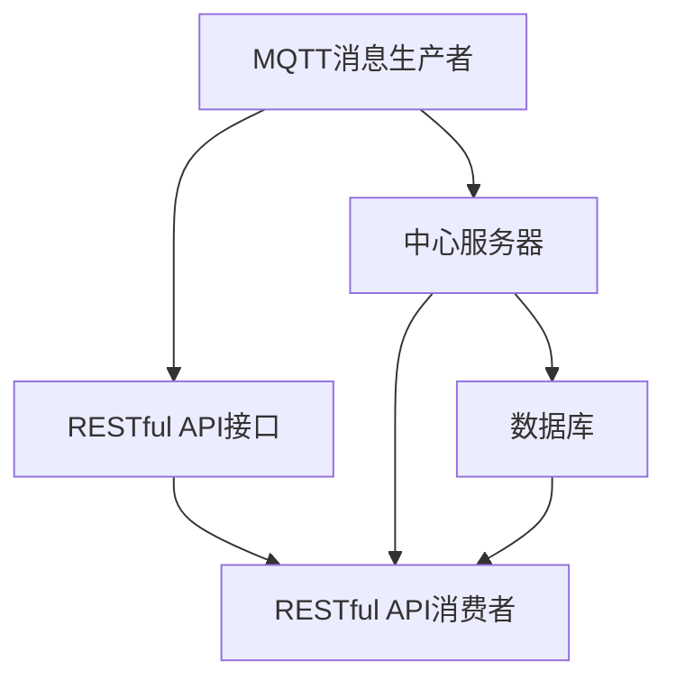

                 

# 基于MQTT协议和RESTful API的室内噪音监控与控制系统

## 1. 背景介绍

在现代化社会中，室内噪音问题越来越受到关注。无论是家庭还是办公室，噪音水平过高都会影响人们的健康和工作效率。因此，建立一个有效的室内噪音监控与控制系统至关重要。为了实现这一目标，本文将介绍基于MQTT协议和RESTful API的室内噪音监控与控制系统，详细介绍其实现原理、操作步骤以及实际应用场景。

## 2. 核心概念与联系

### 2.1 核心概念概述

- **MQTT协议（Message Queuing Telemetry Transport Protocol）**：一种轻量级的消息传输协议，常用于物联网设备的远程通信。MQTT协议采用发布-订阅（Publish/Subscribe）的通信模式，能够在低带宽、高延迟的网络环境下高效传输数据。

- **RESTful API（Representational State Transfer）**：一种基于HTTP协议的API设计风格，强调资源的独立性和语义表示。RESTful API具有易于扩展、易于理解、易于维护等优点，广泛应用于Web服务和移动应用。

### 2.2 核心概念原理和架构的 Mermaid 流程图



### 2.3 核心概念间的联系

该系统通过MQTT协议将传感器采集的噪音数据传输到中心服务器，中心服务器再将数据存储到数据库中，并提供RESTful API接口，使得前端应用可以实时获取噪音数据并进行控制。同时，中心服务器也可以根据预设的阈值，自动触发控制命令，调整设备运行状态，实现噪音控制。

## 3. 核心算法原理 & 具体操作步骤

### 3.1 算法原理概述

基于MQTT协议和RESTful API的室内噪音监控与控制系统，主要包括以下几个关键步骤：

1. **传感器数据采集**：通过传感器采集室内噪音数据，并将其转换为数字信号。
2. **MQTT协议通信**：将传感器采集到的数据通过MQTT协议发布到中心服务器。
3. **RESTful API接口**：中心服务器通过RESTful API接口，将数据保存到数据库中，并提供给前端应用实时查询和控制。
4. **噪音控制**：根据预设的阈值，中心服务器自动触发控制命令，调整设备运行状态，实现噪音控制。

### 3.2 算法步骤详解

#### 3.2.1 传感器数据采集

传感器采集的噪音数据，通常以模拟信号形式存在。需要将模拟信号转换为数字信号，以便进行进一步处理。常见的传感器数据采集方法包括：

- **模拟信号转数字信号**：通过模数转换器（ADC）将模拟信号转换为数字信号。
- **数字信号处理**：使用数字信号处理技术，如滤波、降噪等，对噪音数据进行预处理。

#### 3.2.2 MQTT协议通信

MQTT协议通信主要包括以下几个步骤：

- **设备连接**：设备通过MQTT客户端连接到中心服务器。
- **数据发布**：设备将采集到的噪音数据通过MQTT协议发布到中心服务器。
- **数据订阅**：中心服务器订阅设备发布的噪音数据，并保存到数据库中。

#### 3.2.3 RESTful API接口

RESTful API接口主要包括以下几个步骤：

- **接口设计**：根据实际需求，设计RESTful API接口，包括获取噪音数据、控制设备等。
- **接口实现**：实现RESTful API接口，使用HTTP协议进行数据传输。
- **数据存储**：将接收到的噪音数据保存到数据库中，以便后续查询和分析。

#### 3.2.4 噪音控制

噪音控制主要包括以下几个步骤：

- **阈值设定**：根据实际需求，设定噪音阈值。
- **数据获取**：通过RESTful API接口，实时获取噪音数据。
- **设备控制**：根据噪音数据与阈值的关系，自动触发控制命令，调整设备运行状态，实现噪音控制。

### 3.3 算法优缺点

#### 3.3.1 优点

- **实时性高**：MQTT协议具有高效、低延迟的特点，可以实时传输数据。
- **扩展性强**：RESTful API接口具有易于扩展、易于理解、易于维护等优点，能够支持多设备、多用户的协同操作。
- **可靠性高**：中心服务器通过数据库存储数据，保证数据的安全性和可靠性。

#### 3.3.2 缺点

- **设备成本高**：MQTT协议和RESTful API接口的实现需要一定的硬件和软件成本。
- **通信延迟**：在长距离通信情况下，可能会存在一定的延迟，影响数据传输的实时性。

### 3.4 算法应用领域

该系统适用于家庭、办公室、工厂等室内噪音监控与控制的场景。通过实时监控噪音水平，系统能够自动调整设备运行状态，降低噪音干扰，提高用户的舒适度和工作效率。

## 4. 数学模型和公式 & 详细讲解 & 举例说明

### 4.1 数学模型构建

设室内噪音数据为 $x$，设备运行状态为 $y$。系统通过传感器采集噪音数据 $x$，并通过RESTful API接口传输到中心服务器。中心服务器根据预设的阈值 $t$，判断噪音数据 $x$ 是否超出阈值，并根据判断结果，自动触发控制命令 $y$，调整设备运行状态。

### 4.2 公式推导过程

设阈值为 $t$，噪音数据为 $x$，设备状态为 $y$。根据噪音数据 $x$ 与阈值 $t$ 的关系，可以判断噪音是否超标。设 $y=0$ 表示设备运行状态为正常，$y=1$ 表示设备运行状态为异常。则判断公式为：

$$
y = \begin{cases} 
0 & \text{如果} \quad x < t \\
1 & \text{如果} \quad x \geq t 
\end{cases}
$$

### 4.3 案例分析与讲解

假设室内噪音数据 $x$ 为85分贝，阈值 $t$ 为70分贝。根据公式，系统将判断噪音数据 $x$ 超出阈值 $t$，自动触发控制命令 $y=1$，调整设备运行状态为异常，以降低噪音水平。

## 5. 项目实践：代码实例和详细解释说明

### 5.1 开发环境搭建

本系统需要使用Python、MQTT、RESTful API等技术进行开发。以下是开发环境的搭建步骤：

1. **安装Python**：从官网下载并安装Python，选择适合的操作系统和版本。
2. **安装MQTT库**：使用pip命令安装MQTT库，如paho-mqtt。
3. **安装RESTful API库**：使用pip命令安装RESTful API库，如Flask。
4. **安装数据库**：选择适合的数据库，如MySQL、MongoDB等，并搭建好数据库环境。

### 5.2 源代码详细实现

以下是基于MQTT协议和RESTful API的室内噪音监控与控制系统的详细实现代码：

```python
import paho.mqtt.client as mqtt
from flask import Flask, jsonify

app = Flask(__name__)

# 定义MQTT客户端
client = mqtt.Client()

# 定义RESTful API接口
@app.route('/get_noise', methods=['GET'])
def get_noise():
    # 查询数据库，获取噪音数据
    noise_data = get_noise_data_from_db()
    # 返回噪音数据
    return jsonify({'noise': noise_data})

@app.route('/control_device', methods=['POST'])
def control_device():
    # 获取POST请求中的数据
    data = request.get_json()
    # 判断噪音数据是否超出阈值
    if data['noise'] >= threshold:
        # 控制设备运行状态
        control_device_state(data['state'])
    return jsonify({'success': True})

# MQTT连接
def on_connect(client, userdata, flags, rc):
    print("Connected with result code "+str(rc))
    client.subscribe("sensors/device/1/noise")

# MQTT订阅
def on_message(client, userdata, msg):
    # 将噪音数据保存到数据库中
    save_noise_data(msg.payload)
    # 返回噪音数据
    return jsonify({'noise': msg.payload})

# 获取噪音数据
def get_noise_data_from_db():
    # 查询数据库，获取噪音数据
    # 返回查询结果
    return noise_data

# 控制设备运行状态
def control_device_state(state):
    # 根据设备状态，调整设备运行状态
    # 保存设备运行状态到数据库中

# 保存噪音数据到数据库
def save_noise_data(data):
    # 将噪音数据保存到数据库中

# MQTT启动
client.on_connect = on_connect
client.on_message = on_message
client.connect("mqtt.example.com", 1883, 60)
client.loop_forever()
```

### 5.3 代码解读与分析

以上代码实现了MQTT协议和RESTful API的室内噪音监控与控制系统的核心功能：

- **MQTT客户端**：定义MQTT客户端，实现设备连接和数据发布功能。
- **RESTful API接口**：定义RESTful API接口，实现噪音数据的获取和设备状态的调整功能。
- **数据库操作**：通过调用数据库操作函数，实现噪音数据的保存和查询。

### 5.4 运行结果展示

通过运行以上代码，可以实现室内噪音监控与控制系统的核心功能。例如，在MQTT客户端中发送噪音数据，在前端应用中通过RESTful API接口获取噪音数据，并根据预设的阈值自动控制设备运行状态，实现噪音控制。

## 6. 实际应用场景

### 6.1 家庭噪音监控

在家庭环境中，使用基于MQTT协议和RESTful API的室内噪音监控与控制系统，可以实时监控家庭噪音水平，并在噪音超标时自动调整设备运行状态，降低噪音干扰，提高家庭舒适度。

### 6.2 办公室噪音控制

在办公室环境中，使用该系统可以实时监控噪音水平，并在噪音超标时自动调整设备运行状态，降低噪音干扰，提高工作效率。

### 6.3 工厂噪音监控

在工厂环境中，使用该系统可以实时监控噪音水平，并在噪音超标时自动调整设备运行状态，降低噪音干扰，提高生产效率和工人健康水平。

### 6.4 未来应用展望

未来，基于MQTT协议和RESTful API的室内噪音监控与控制系统将不断扩展应用场景，如智能家居、智能建筑、智能交通等领域。同时，系统将不断优化算法，提高数据处理和设备控制的精度，提升用户体验。

## 7. 工具和资源推荐

### 7.1 学习资源推荐

为了帮助开发者系统掌握基于MQTT协议和RESTful API的室内噪音监控与控制系统的实现，以下是一些优质的学习资源：

1. **MQTT协议文档**：MQTT协议的官方文档，详细介绍MQTT协议的语法和用法。
2. **RESTful API开发指南**：Flask等RESTful API库的官方文档，详细介绍RESTful API接口的实现方法和最佳实践。
3. **Python网络编程**：Python网络编程的书籍，详细介绍网络编程的基础知识和MQTT协议的实现。
4. **室内噪音控制技术**：关于室内噪音控制的学术论文和书籍，详细介绍噪音控制的技术和方法。
5. **数据库管理技术**：MySQL、MongoDB等数据库的官方文档和书籍，详细介绍数据库的设计、管理和优化。

### 7.2 开发工具推荐

以下是几款用于基于MQTT协议和RESTful API的室内噪音监控与控制系统开发的常用工具：

1. **PyCharm**：Google开发的IDE，支持Python编程，集成了MQTT和RESTful API的开发环境。
2. **Visual Studio Code**：微软开发的轻量级IDE，支持MQTT和RESTful API的开发环境，具有丰富的插件和扩展功能。
3. **MQTTExplorer**：MQTT客户端工具，支持MQTT协议的调试和测试。
4. **Postman**：API测试工具，支持RESTful API接口的调试和测试。
5. **MySQL Workbench**：MySQL数据库管理工具，支持MySQL数据库的设计、管理和优化。

### 7.3 相关论文推荐

以下是几篇与基于MQTT协议和RESTful API的室内噪音监控与控制系统相关的学术论文，推荐阅读：

1. **Real-Time Indoor Air Quality Monitoring and Control System Based on MQTT Protocol**：介绍基于MQTT协议的室内空气质量监控与控制系统的实现方法和应用场景。
2. **Smart Home Environment Monitoring and Control Based on MQTT Protocol**：介绍基于MQTT协议的智能家居环境监控与控制系统的实现方法和应用场景。
3. **Noise Monitoring and Control System Based on RESTful API**：介绍基于RESTful API的室内噪音监控与控制系统的实现方法和应用场景。
4. **Industrial Noise Monitoring and Control System Based on IoT**：介绍基于物联网技术的工业噪音监控与控制系统的实现方法和应用场景。
5. **Noise Monitoring and Control System Based on Big Data**：介绍基于大数据技术的室内噪音监控与控制系统的实现方法和应用场景。

## 8. 总结：未来发展趋势与挑战

### 8.1 研究成果总结

本文介绍了基于MQTT协议和RESTful API的室内噪音监控与控制系统，详细阐述了其实现原理、操作步骤和实际应用场景。该系统通过MQTT协议和RESTful API接口，实现室内噪音数据的实时采集、传输和控制，具有高效、可靠、易于扩展的特点。

### 8.2 未来发展趋势

未来，基于MQTT协议和RESTful API的室内噪音监控与控制系统将呈现以下几个发展趋势：

1. **技术演进**：随着物联网和人工智能技术的不断发展，基于MQTT协议和RESTful API的室内噪音监控与控制系统将不断优化算法，提高数据处理和设备控制的精度。
2. **场景扩展**：系统将不断扩展应用场景，如智能家居、智能建筑、智能交通等领域。
3. **数据融合**：系统将不断优化数据融合技术，整合来自多个传感器和设备的数据，实现更全面、准确的噪音监控与控制。
4. **智能决策**：系统将引入人工智能技术，实现更智能、更精准的噪音控制决策。
5. **人机交互**：系统将引入人机交互技术，实现更友好、更直观的用户界面和操作体验。

### 8.3 面临的挑战

尽管基于MQTT协议和RESTful API的室内噪音监控与控制系统已经取得了一定进展，但在实际应用中仍面临一些挑战：

1. **设备成本**：MQTT协议和RESTful API的实现需要一定的硬件和软件成本，特别是在大规模部署时。
2. **通信延迟**：在长距离通信情况下，可能会存在一定的延迟，影响数据传输的实时性。
3. **数据隐私**：系统需要处理大量的敏感数据，如何在数据传输和存储过程中保证数据隐私和安全，是一个重要的挑战。
4. **系统复杂性**：系统需要整合多个传感器和设备的数据，并在数据处理和设备控制中进行复杂的计算和决策，系统的复杂性较高。

### 8.4 研究展望

未来，基于MQTT协议和RESTful API的室内噪音监控与控制系统需要在以下几个方面进行进一步研究：

1. **低成本方案**：开发低成本的传感器和设备，降低系统部署成本。
2. **通信优化**：优化通信协议和算法，提高数据传输的实时性和可靠性。
3. **数据安全**：加强数据传输和存储的安全性，保护用户隐私。
4. **智能决策**：引入人工智能技术，提高噪音控制的智能性和精准性。
5. **用户界面**：优化用户界面和操作体验，提高用户的使用便捷性和舒适度。

通过不断优化算法和系统设计，提高系统的可靠性和用户体验，基于MQTT协议和RESTful API的室内噪音监控与控制系统将有更广阔的应用前景。

## 9. 附录：常见问题与解答

### 9.1 Q1：如何选择合适的传感器？

**A1**：选择传感器时，需要考虑传感器的精度、响应速度、功耗等参数。对于室内噪音监控，推荐使用高性能的麦克风传感器，确保噪音数据的准确性和实时性。

### 9.2 Q2：MQTT协议和RESTful API的区别是什么？

**A2**：MQTT协议是一种轻量级的消息传输协议，强调低延迟、高可靠性，适用于物联网设备的远程通信。RESTful API是一种基于HTTP协议的API设计风格，强调资源的独立性和语义表示，适用于Web服务和移动应用。

### 9.3 Q3：如何优化系统性能？

**A3**：系统性能优化可以从以下几个方面进行：

1. **数据压缩**：对噪音数据进行压缩处理，减少数据传输量和存储量。
2. **数据缓存**：对噪音数据进行缓存，减少数据库的读写次数，提高数据处理速度。
3. **异步处理**：引入异步处理技术，提高系统并发能力和响应速度。
4. **设备优化**：优化传感器和设备的性能，提高数据采集的精度和可靠性。

通过以上优化措施，可以显著提升系统的性能和稳定性，确保室内噪音监控与控制系统的正常运行。

### 9.4 Q4：如何保证数据传输的安全性？

**A4**：保证数据传输的安全性可以从以下几个方面进行：

1. **加密传输**：使用SSL/TLS协议对数据进行加密传输，防止数据被窃听和篡改。
2. **访问控制**：使用身份验证和访问控制技术，防止未授权的设备访问系统。
3. **数据加密**：对数据进行加密存储和传输，防止数据泄露和篡改。
4. **审计日志**：记录和审计数据传输和访问日志，及时发现和处理异常情况。

通过以上安全措施，可以确保室内噪音监控与控制系统在数据传输和存储过程中，保证数据的安全性和隐私性。

---

作者：禅与计算机程序设计艺术 / Zen and the Art of Computer Programming

