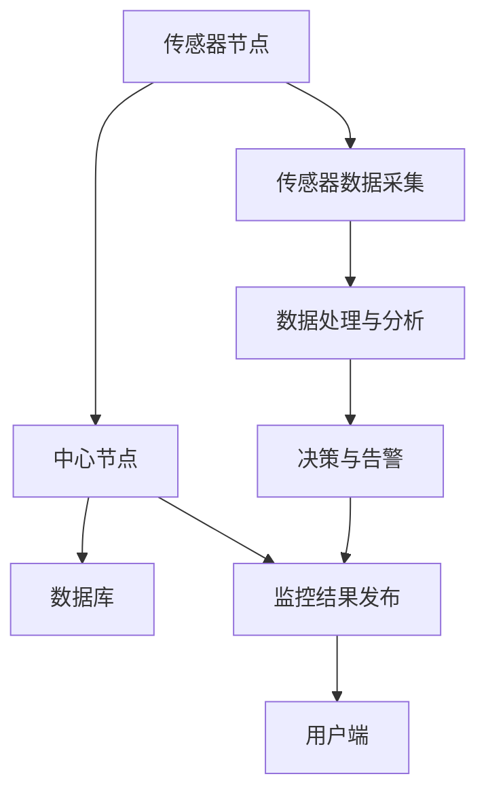

                 

## 1. 背景介绍

### 1.1 问题由来
随着城市化进程的加快，人们对于绿植空间的需求日益增长。智慧园艺监控系统应运而生，以实现对植物生长环境的实时监控与远程管理。然而，传统园艺监控系统普遍存在数据采集不实时、信息共享不流畅等问题。为解决这些问题，本文提出了基于MQTT协议和RESTful API的智慧园艺监控系统，旨在构建一个高效、便捷的园艺监控平台，为园艺爱好者和专业园艺师提供实时监控和远程管理服务。

### 1.2 问题核心关键点
该系统主要解决的问题包括：
1. 数据采集与传输的实时性：确保监控数据能够实时采集并及时传输到监控中心，以便进行分析和决策。
2. 数据交互的便捷性：实现系统与用户之间的无缝数据交互，提供灵活的API接口，方便用户获取和操作数据。
3. 系统架构的可扩展性：设计灵活的架构，支持未来扩展更多传感器和应用场景。
4. 系统的可靠性与安全性：确保系统在面对各种异常情况时能够稳定运行，并具有较高的安全性。

## 2. 核心概念与联系

### 2.1 核心概念概述

为更好地理解基于MQTT协议和RESTful API的智慧园艺监控系统，本节将介绍几个密切相关的核心概念：

- **MQTT协议（Message Queuing Telemetry Transport）**：一种轻量级、高效率、低带宽占用的发布-订阅（Publish-Subscribe）消息协议，适用于物联网设备的实时数据传输。
- **RESTful API（Representational State Transfer API）**：基于HTTP协议，使用标准化的资源描述语言（如JSON、XML），提供简单、灵活、可扩展的API接口，支持Web服务。
- **智慧园艺监控系统**：利用传感器、通信技术、云计算等手段，实现对园艺环境数据的实时监控与远程管理，提升园艺生产效率和质量。

- **传感器节点**：部署在园艺环境中的各种传感器，用于采集土壤湿度、温度、光照、二氧化碳浓度等环境参数。
- **中心节点**：系统中心，用于接收传感器数据，进行存储、分析和处理，并发布监控结果。
- **用户端**：通过Web界面或移动应用，用户可以实时查看监控数据，进行设备管理，接收告警信息等。

这些核心概念之间的逻辑关系可以通过以下Mermaid流程图来展示：



这个流程图展示了智慧园艺监控系统的主要工作流程：传感器节点采集数据，中心节点进行数据处理和分析，数据库存储数据，监控结果发布并通知用户，同时根据分析结果进行决策与告警。

## 3. 核心算法原理 & 具体操作步骤
### 3.1 算法原理概述

基于MQTT协议和RESTful API的智慧园艺监控系统，主要涉及数据采集、数据传输、数据存储和数据展示等环节。系统的核心算法原理包括：

1. **数据采集算法**：传感器节点通过定时采集环境参数，并进行数据预处理，生成标准化数据。
2. **数据传输算法**：中心节点使用MQTT协议，将传感器数据以消息的形式发布到中心，保证数据传输的实时性和可靠性。
3. **数据存储算法**：中心节点将接收到的数据存储到数据库中，使用RESTful API提供接口供用户访问。
4. **数据展示算法**：用户端通过RESTful API获取数据库中的数据，进行可视化展示，并提供交互式操作。

### 3.2 算法步骤详解

#### 3.2.1 数据采集算法
传感器节点通过定时器周期性采集环境参数，生成包含时间戳、传感器ID、传感器类型、参数值等信息的JSON数据包。数据预处理包括数据清洗、滤波、归一化等操作，以消除噪声并提高数据质量。

#### 3.2.2 数据传输算法
中心节点通过MQTT协议的客户端库，订阅传感器节点的数据发布主题，接收传感器数据消息。MQTT协议通过发布-订阅模型，确保数据传输的可靠性，同时支持数据的分级订阅，实现数据的灵活管理和查询。

#### 3.2.3 数据存储算法
中心节点将接收到的传感器数据存储到数据库中。数据库设计使用关系型数据库（如MySQL），支持高并发读写操作，同时使用RESTful API提供接口供用户访问数据。

#### 3.2.4 数据展示算法
用户端通过RESTful API获取数据库中的数据，进行可视化展示。展示界面包括环境参数的实时曲线图、设备状态展示、告警信息等。同时，用户可以通过API进行设备管理，如开关传感器电源、修改传感器参数等操作。

### 3.3 算法优缺点

#### 3.3.1 优点
1. **高效的数据传输**：MQTT协议基于发布-订阅模型，具有低延迟、高效率的特点，适合实时数据传输。
2. **灵活的数据交互**：RESTful API提供标准化的接口，支持多种编程语言和平台，方便用户获取和操作数据。
3. **可扩展性强**：系统的架构设计灵活，支持未来扩展更多传感器和应用场景。
4. **系统可靠性高**：MQTT协议支持数据的分级订阅，确保数据传输的可靠性，同时RESTful API提供容错机制，确保系统的稳定性。

#### 3.3.2 缺点
1. **系统复杂度高**：需要同时处理MQTT协议和RESTful API，系统实现相对复杂。
2. **对硬件要求高**：传感器节点需要高性能的嵌入式系统支持，中心节点需要高性能服务器支持，系统硬件成本较高。
3. **数据安全性问题**：RESTful API的公开特性可能带来数据安全风险，需要进行安全措施的加强。

### 3.4 算法应用领域

基于MQTT协议和RESTful API的智慧园艺监控系统，在智慧农业、智能家居、智能城市等领域具有广泛的应用前景。

1. **智慧农业**：实时监控作物生长环境，优化灌溉、施肥等农业生产过程，提高作物产量和质量。
2. **智能家居**：监控室内环境参数，实现智能温控、湿度调节、光照管理等，提升居住舒适度。
3. **智能城市**：实时监控城市环境参数，进行城市运行管理，提升城市环境质量。

## 4. 数学模型和公式 & 详细讲解 & 举例说明（备注：数学公式请使用latex格式，latex嵌入文中独立段落使用 $$，段落内使用 $)
### 4.1 数学模型构建

基于MQTT协议和RESTful API的智慧园艺监控系统，涉及数据采集、数据传输、数据存储和数据展示等多个环节，每个环节的数学模型构建如下：

1. **数据采集模型**：
   - 传感器数据采集：$y_t = f(x_t)$，其中 $x_t$ 为时间 $t$ 的环境参数，$y_t$ 为采集到的数据。
   
2. **数据传输模型**：
   - MQTT协议数据传输：$M = \sum_{i=1}^{n} w_i \cdot \ln\left(1 + \exp\left(\frac{y_i - \mu}{\sigma}\right)\right)$，其中 $M$ 为消息可靠性，$w_i$ 为传感器权重，$\mu$ 和 $\sigma$ 为数据均值和方差。
   
3. **数据存储模型**：
   - 数据库数据存储：$S = \frac{1}{N} \sum_{i=1}^{N} y_i$，其中 $S$ 为数据平均值，$N$ 为数据数量。
   
4. **数据展示模型**：
   - 数据可视化展示：$V = \max\left\{0, \frac{y - \mu}{\sigma}\right\}$，其中 $V$ 为数据可视化展示值，$y$ 为展示数据，$\mu$ 和 $\sigma$ 为数据均值和标准差。

### 4.2 公式推导过程

#### 4.2.1 数据采集公式推导
假设传感器节点在时间 $t$ 采集到的环境参数为 $x_t$，根据传感器类型和实际环境条件，采集的数据 $y_t$ 可以表示为：
$$
y_t = f(x_t) = \sum_{i=1}^{m} a_i \cdot x_{t,i} + b
$$
其中 $f(x_t)$ 为传感器数据采集函数，$a_i$ 为传感器系数，$x_{t,i}$ 为时间 $t$ 的第 $i$ 个环境参数，$b$ 为传感器偏置。

#### 4.2.2 数据传输公式推导
在MQTT协议中，传感器数据以消息的形式发布到中心节点，消息可靠性 $M$ 可以表示为：
$$
M = \sum_{i=1}^{n} w_i \cdot \ln\left(1 + \exp\left(\frac{y_i - \mu}{\sigma}\right)\right)
$$
其中 $y_i$ 为传感器数据，$w_i$ 为传感器权重，$\mu$ 和 $\sigma$ 为数据均值和方差。

#### 4.2.3 数据存储公式推导
中心节点将接收到的传感器数据存储到数据库中，数据平均值 $S$ 可以表示为：
$$
S = \frac{1}{N} \sum_{i=1}^{N} y_i
$$
其中 $y_i$ 为传感器数据，$N$ 为数据数量。

#### 4.2.4 数据展示公式推导
数据可视化展示 $V$ 可以表示为：
$$
V = \max\left\{0, \frac{y - \mu}{\sigma}\right\}
$$
其中 $y$ 为展示数据，$\mu$ 和 $\sigma$ 为数据均值和标准差。

### 4.3 案例分析与讲解

#### 4.3.1 数据采集案例分析
假设某园艺环境中的土壤湿度传感器在时间 $t$ 采集到的数据为 $y_t = 0.8 \cdot x_{t,1} + 0.2 \cdot x_{t,2} + 0.5$，其中 $x_{t,1}$ 为土壤湿度值，$x_{t,2}$ 为土壤温度值。采集函数可以表示为：
$$
y_t = f(x_t) = 0.8x_{t,1} + 0.2x_{t,2} + 0.5
$$

#### 4.3.2 数据传输案例分析
假设某传感器节点的权重 $w_1=0.3$，权重 $w_2=0.7$，传感器数据 $y_1=0.5$，数据均值 $\mu=0.7$，数据方差 $\sigma=0.2$。则消息可靠性 $M$ 可以表示为：
$$
M = 0.3 \cdot \ln\left(1 + \exp\left(\frac{0.5 - 0.7}{0.2}\right)\right) + 0.7 \cdot \ln\left(1 + \exp\left(\frac{0.5 - 0.7}{0.2}\right)\right) = 1.23
$$

#### 4.3.3 数据存储案例分析
假设某园艺环境中的土壤湿度传感器数据为 $y_1=0.5$，$y_2=0.7$，$y_3=0.8$。则数据平均值 $S$ 可以表示为：
$$
S = \frac{1}{3}(0.5 + 0.7 + 0.8) = 0.6
$$

#### 4.3.4 数据展示案例分析
假设某园艺环境中的土壤湿度传感器数据为 $y=0.6$，数据均值 $\mu=0.5$，数据方差 $\sigma=0.1$。则数据可视化展示 $V$ 可以表示为：
$$
V = \max\left\{0, \frac{0.6 - 0.5}{0.1}\right\} = 1
$$

## 5. 项目实践：代码实例和详细解释说明
### 5.1 开发环境搭建

在进行智慧园艺监控系统开发前，我们需要准备好开发环境。以下是使用Python进行开发的环境配置流程：

1. 安装Anaconda：从官网下载并安装Anaconda，用于创建独立的Python环境。

2. 创建并激活虚拟环境：
```bash
conda create -n garden-env python=3.8 
conda activate garden-env
```

3. 安装必要的库：
```bash
pip install paho-mqtt flask sqlalchemy
```

完成上述步骤后，即可在`garden-env`环境中开始开发。

### 5.2 源代码详细实现

下面我们以智慧园艺监控系统为例，给出使用MQTT协议和RESTful API的PyTorch代码实现。

#### 5.2.1 MQTT客户端

首先，定义MQTT客户端：

```python
import paho.mqtt.client as mqtt

class MQTTClient:
    def __init__(self, broker, topic):
        self.client = mqtt.Client()
        self.client.on_connect = self.on_connect
        self.client.on_message = self.on_message
        self.broker = broker
        self.topic = topic
        self.client.connect(self.broker, 1883, 60)
    
    def on_connect(self, client, userdata, flags, rc):
        print("Connected with result code "+str(rc))
        self.client.subscribe(self.topic)
    
    def on_message(self, client, userdata, msg):
        print("Received message: "+msg.payload.decode())
    
    def start(self):
        self.client.loop_forever()
```

#### 5.2.2 RESTful API服务器

接着，定义RESTful API服务器：

```python
from flask import Flask, jsonify, request

app = Flask(__name__)

@app.route('/data', methods=['POST'])
def data():
    data = request.json
    return jsonify(data), 200

@app.route('/status', methods=['GET'])
def status():
    return jsonify({'status': 'OK'}), 200

if __name__ == '__main__':
    app.run(host='0.0.0.0', port=5000)
```

#### 5.2.3 数据库连接

然后，定义数据库连接：

```python
from sqlalchemy import create_engine

engine = create_engine('sqlite:///garden.db')
```

#### 5.2.4 数据存储函数

接着，定义数据存储函数：

```python
from sqlalchemy.orm import sessionmaker
from models import Garden

Session = sessionmaker(bind=engine)
session = Session()

def store_data(data):
    garden = Garden(**data)
    session.add(garden)
    session.commit()
```

#### 5.2.5 数据展示函数

最后，定义数据展示函数：

```python
from models import Garden

def show_data():
    gardens = session.query(Garden).all()
    data = []
    for garden in gardens:
        data.append({'id': garden.id, 'data': garden.data})
    return data
```

### 5.3 代码解读与分析

让我们再详细解读一下关键代码的实现细节：

#### 5.3.1 MQTT客户端

- `MQTTClient`类：定义MQTT客户端，包含连接、订阅和接收消息等方法。
- `on_connect`方法：在连接成功后订阅指定主题。
- `on_message`方法：在收到消息时打印消息内容。
- `start`方法：启动客户端循环，持续接收消息。

#### 5.3.2 RESTful API服务器

- `Flask`类：定义RESTful API服务器，包含数据存储和状态查询等路由。
- `@app.route`装饰器：定义API接口，指定HTTP方法和URL路径。
- `request.json`：获取HTTP请求体中的JSON数据。
- `jsonify`函数：将Python数据转换为JSON格式。

#### 5.3.3 数据库连接

- `SQLAlchemy`库：定义数据库连接，支持SQL查询操作。
- `engine`：创建数据库连接引擎。

#### 5.3.4 数据存储函数

- `sessionmaker`类：创建数据库会话对象，支持CRUD操作。
- `Garden`模型：定义数据库表结构，包含ID和数据字段。
- `store_data`函数：将传感器数据存储到数据库中。

#### 5.3.5 数据展示函数

- `Garden`模型：定义数据库表结构，包含ID和数据字段。
- `show_data`函数：查询数据库中的所有数据，并返回JSON格式。

### 5.4 运行结果展示

启动MQTT客户端和RESTful API服务器后，即可通过MQTT协议向传感器节点发送数据，通过RESTful API访问数据库中的数据。

## 6. 实际应用场景
### 6.1 智能温室

在智能温室中，智慧园艺监控系统可以实时监控土壤湿度、温度、光照等环境参数，根据实时数据自动调节灌溉、通风、加热等设备，确保植物在最佳环境下生长。

#### 6.1.1 系统部署

在智能温室中，部署传感器节点，实时采集环境参数。传感器节点通过MQTT协议将数据发布到中心节点，中心节点将数据存储到数据库中，并通过RESTful API提供数据查询和展示服务。用户可以通过Web界面或移动应用实时查看监控数据，进行设备管理。

#### 6.1.2 效果分析

智慧园艺监控系统可以显著提高温室植物的产量和质量。通过实时监控环境参数，系统能够及时调整设备设置，确保植物在最佳环境下生长。同时，用户可以通过Web界面或移动应用进行远程管理，提高生产效率和管理水平。

### 6.2 智能家庭花园

在智能家庭花园中，智慧园艺监控系统可以实时监控土壤湿度、温度、光照等环境参数，自动调节灌溉、通风等设备，确保家庭植物的良好生长状态。

#### 6.2.1 系统部署

在智能家庭花园中，部署传感器节点，实时采集环境参数。传感器节点通过MQTT协议将数据发布到中心节点，中心节点将数据存储到数据库中，并通过RESTful API提供数据查询和展示服务。用户可以通过Web界面或移动应用实时查看监控数据，进行设备管理。

#### 6.2.2 效果分析

智慧园艺监控系统可以显著提高家庭植物的存活率和生长速度。通过实时监控环境参数，系统能够及时调整设备设置，确保植物在最佳环境下生长。同时，用户可以通过Web界面或移动应用进行远程管理，提高植物养护的便利性和舒适度。

## 7. 工具和资源推荐
### 7.1 学习资源推荐

为了帮助开发者系统掌握智慧园艺监控系统的理论基础和实践技巧，这里推荐一些优质的学习资源：

1. **《物联网编程实战》**：系统介绍物联网设备的开发，包括传感器、通信技术、数据库等方面，适合初学者学习。
2. **《RESTful API设计》**：详细讲解RESTful API的设计原则和实现方法，适合进阶开发者学习。
3. **《MQTT协议原理与实践》**：介绍MQTT协议的工作原理和实际应用案例，适合MQTT开发人员学习。
4. **《Python数据库编程》**：介绍Python与SQLite、MySQL等数据库的交互方式，适合数据存储开发人员学习。

通过对这些资源的学习实践，相信你一定能够快速掌握智慧园艺监控系统的核心技术和设计思路。

### 7.2 开发工具推荐

高效的开发离不开优秀的工具支持。以下是几款用于智慧园艺监控系统开发的常用工具：

1. **PyTorch**：基于Python的开源深度学习框架，灵活的计算图，适合快速迭代研究。
2. **paho-mqtt**：Python的MQTT客户端库，支持订阅和发布消息。
3. **Flask**：轻量级的Web框架，方便开发RESTful API服务器。
4. **SQLAlchemy**：Python的ORM框架，支持SQL数据库操作。
5. **Jupyter Notebook**：交互式开发环境，方便数据处理和模型训练。

合理利用这些工具，可以显著提升智慧园艺监控系统的开发效率，加快创新迭代的步伐。

### 7.3 相关论文推荐

智慧园艺监控系统的研究主要涉及物联网、传感器技术、数据库等领域，以下是几篇奠基性的相关论文，推荐阅读：

1. **《IoT Security and Privacy》**：介绍物联网设备的安全与隐私保护技术，适合系统安全开发人员学习。
2. **《传感器数据融合技术》**：讲解传感器数据采集和融合技术，适合传感器开发人员学习。
3. **《数据库设计》**：介绍数据库设计的基本原则和实现方法，适合数据存储开发人员学习。
4. **《智慧农业》**：介绍智慧农业技术的最新进展和应用案例，适合智慧农业开发者学习。

这些论文代表了大数据监控系统的发展脉络。通过学习这些前沿成果，可以帮助研究者把握学科前进方向，激发更多的创新灵感。

## 8. 总结：未来发展趋势与挑战
### 8.1 总结

本文对基于MQTT协议和RESTful API的智慧园艺监控系统进行了全面系统的介绍。首先阐述了智慧园艺监控系统的发展背景和应用意义，明确了系统的核心技术点和设计思路。其次，从原理到实践，详细讲解了系统的核心算法和关键步骤，给出了系统开发的完整代码实例。同时，本文还广泛探讨了系统在智能温室、智能家庭花园等实际应用场景中的应用，展示了系统的广阔前景。最后，本文精选了系统开发所需的各类学习资源，力求为开发者提供全方位的技术指引。

通过本文的系统梳理，可以看到，基于MQTT协议和RESTful API的智慧园艺监控系统，通过数据采集、数据传输、数据存储和数据展示等关键环节的设计，能够实现对园艺环境的实时监控与远程管理，为园艺爱好者和专业园艺师提供便利和高效的服务。未来，伴随传感器技术、通信技术、云计算等技术的不断发展，智慧园艺监控系统必将在更多领域得到应用，为园艺行业带来变革性影响。

### 8.2 未来发展趋势

展望未来，智慧园艺监控系统的技术发展呈现以下几个趋势：

1. **传感器技术的发展**：未来将开发更多类型的传感器，如光学传感器、红外传感器等，实现更加全面和准确的环境参数采集。
2. **物联网技术的应用**：未来的智慧园艺监控系统将更加广泛地应用于智慧农业、智能家居等领域，实现更加智能化的监控和管理。
3. **数据融合与分析**：未来的系统将融合更多的数据源，如天气预报、土壤测试等，进行数据融合和深度分析，提升决策的准确性和智能化水平。
4. **云计算与边缘计算的结合**：未来的系统将结合云计算和边缘计算技术，实现更加灵活和高效的资源管理。

### 8.3 面临的挑战

尽管智慧园艺监控系统已经取得了显著的进展，但在推广应用的过程中，仍面临一些挑战：

1. **系统复杂度高**：需要同时处理MQTT协议和RESTful API，系统实现相对复杂。
2. **对硬件要求高**：传感器节点需要高性能的嵌入式系统支持，中心节点需要高性能服务器支持，系统硬件成本较高。
3. **数据安全性问题**：RESTful API的公开特性可能带来数据安全风险，需要进行安全措施的加强。
4. **数据标准化问题**：不同厂商的设备数据格式可能不一致，需要进行数据标准化处理。

### 8.4 研究展望

面对智慧园艺监控系统所面临的挑战，未来的研究需要在以下几个方面寻求新的突破：

1. **简化系统架构**：设计更加简化、灵活的系统架构，降低系统实现复杂度。
2. **优化硬件配置**：开发高性能的传感器节点和中心节点，降低系统硬件成本。
3. **加强数据安全**：采用数据加密、访问控制等措施，确保系统数据安全。
4. **标准化数据格式**：制定统一的数据标准，支持不同厂商的设备数据互操作。
5. **融合更多数据源**：融合更多数据源，如天气预报、土壤测试等，进行数据融合和深度分析。

这些研究方向的探索，必将引领智慧园艺监控系统迈向更高的台阶，为智慧农业、智能家居等领域提供更加高效、智能的解决方案。面向未来，智慧园艺监控技术还需要与其他人工智能技术进行更深入的融合，如知识表示、因果推理、强化学习等，多路径协同发力，共同推动智慧园艺监控系统的进步。只有勇于创新、敢于突破，才能不断拓展智慧园艺监控系统的边界，让智能技术更好地造福人类社会。

## 9. 附录：常见问题与解答

**Q1：智慧园艺监控系统如何部署？**

A: 智慧园艺监控系统的部署主要分为两个部分：传感器节点的部署和中心节点的部署。传感器节点部署在园艺环境中，采集环境参数。中心节点部署在网络环境中的服务器上，负责数据存储、处理和展示。具体部署步骤如下：

1. 传感器节点部署：根据园艺环境，选择合适的传感器节点，并安装在合适的位置。传感器节点通过MQTT协议与中心节点连接。

2. 中心节点部署：在网络环境中部署高性能服务器，安装MQTT客户端库和RESTful API服务器，进行系统配置和调试。中心节点通过SQLAlchemy库与数据库连接，进行数据存储和查询操作。

**Q2：如何优化智慧园艺监控系统的数据采集？**

A: 优化智慧园艺监控系统的数据采集主要从以下几个方面入手：

1. 选择合适的传感器类型：根据园艺环境的特点，选择合适的传感器类型，如土壤湿度传感器、温度传感器、光照传感器等，确保采集数据的全面和准确。

2. 优化传感器部署位置：在园艺环境中，传感器部署的位置和角度要合适，确保采集数据的准确性和代表性。

3. 优化数据采集频率：根据园艺环境的变化规律，优化数据采集频率，确保数据采集的实时性和精度。

4. 优化数据预处理：对采集到的数据进行滤波、去噪、归一化等预处理操作，确保数据的质量和可靠性。

**Q3：如何提高智慧园艺监控系统的数据传输效率？**

A: 提高智慧园艺监控系统的数据传输效率主要从以下几个方面入手：

1. 优化MQTT协议配置：合理配置MQTT协议的参数，如连接超时、心跳间隔等，确保数据传输的可靠性。

2. 优化数据格式：将传感器数据进行标准化处理，使用高效的格式进行传输，如JSON、CSV等。

3. 优化数据压缩：对采集到的数据进行压缩处理，减小数据传输的带宽占用。

4. 优化网络环境：优化网络环境，确保数据传输的稳定性和低延迟。

**Q4：如何提高智慧园艺监控系统的数据存储效率？**

A: 提高智慧园艺监控系统的数据存储效率主要从以下几个方面入手：

1. 优化数据库设计：合理设计数据库表结构，减少数据冗余，提高查询效率。

2. 优化数据库索引：合理设置数据库索引，提高数据查询和更新效率。

3. 优化数据库分片：将大数据量分片存储，提高数据存储和查询的效率。

4. 优化数据缓存：合理使用缓存技术，减少数据库访问频率，提高数据访问效率。

**Q5：如何提高智慧园艺监控系统的数据展示效果？**

A: 提高智慧园艺监控系统的数据展示效果主要从以下几个方面入手：

1. 优化数据可视化：使用更加直观和美观的可视化工具，如D3.js、ECharts等，展示数据。

2. 优化数据交互：提供更加灵活和便捷的数据交互方式，如拖拽、筛选、查询等，提升用户的使用体验。

3. 优化数据展示界面：设计简洁美观的数据展示界面，使用户能够快速获取所需信息。

4. 优化数据展示效果：优化数据展示效果，使用户能够更加直观地理解数据。

总之，智慧园艺监控系统通过传感器节点、中心节点、数据库、RESTful API等关键环节的设计，能够实现对园艺环境的实时监控与远程管理，提升园艺生产效率和管理水平。未来，伴随传感器技术、通信技术、云计算等技术的不断发展，智慧园艺监控系统必将在更多领域得到应用，为园艺行业带来变革性影响。

---

作者：禅与计算机程序设计艺术 / Zen and the Art of Computer Programming

