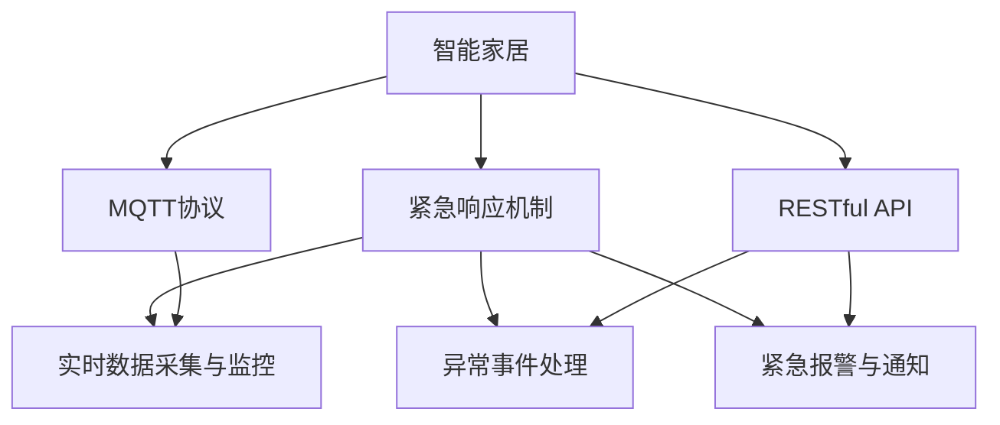

                 

# 基于MQTT协议和RESTful API的智能家居紧急响应机制

## 1. 背景介绍

### 1.1 问题由来

智能家居作为一种现代科技与居家生活的融合产物，通过物联网技术将各种智能设备和家家居用品联接起来，实现远程控制、自动控制、家庭安防、环境监测等功能。然而，在智能家居系统中，设备的稳定性和安全性显得尤为重要，一旦设备出现问题，如何及时、准确地进行处理，避免次生问题，是智能家居领域的重要课题。

当前，智能家居系统主要依赖单一设备的数据监测与控制，系统对异常事件的响应通常基于本地设备的信息，无法实时动态地评估整个系统的状态。一旦某个设备出现故障，整个系统很可能面临瘫痪的风险，造成严重的安全隐患和经济损失。

因此，基于MQTT协议和RESTful API的紧急响应机制成为智能家居系统优化与升级的重要方向。通过集成MQTT消息队列和RESTful API接口，系统可以实时获取设备的运行数据，动态评估系统状态，及时发现并处理紧急事件，从而确保整个系统的稳定性和安全性。

### 1.2 问题核心关键点

本文章的核心问题是基于MQTT协议和RESTful API的智能家居紧急响应机制，通过在智能家居系统中引入MQTT消息队列和RESTful API接口，实现以下功能：

1. 实时数据采集与监控：通过MQTT协议实现设备的实时数据采集与监控，确保系统能够及时获取设备的运行状态。
2. 异常事件处理：当设备出现异常时，系统能够迅速响应，进行处理，避免次生问题发生。
3. 紧急报警与通知：系统能够及时发出报警信息，并通过多种渠道（如短信、邮件、APP推送等）通知相关人员，快速解决问题。

## 2. 核心概念与联系

### 2.1 核心概念概述

为更好地理解基于MQTT协议和RESTful API的智能家居紧急响应机制，本节将介绍几个密切相关的核心概念：

- **MQTT协议（Message Queuing Telemetry Transport）**：一种轻量级、基于发布/订阅模式的通信协议，常用于物联网设备和云服务之间的数据传输。
- **RESTful API（Representational State Transfer）**：一种基于HTTP协议的轻量级、无状态通信架构，用于构建分布式、高性能的Web服务。
- **智能家居（Smart Home）**：通过物联网技术将各种智能设备和家居用品联接起来，实现远程控制、自动控制、家庭安防、环境监测等功能，提升居家生活质量。
- **紧急响应机制（Emergency Response Mechanism）**：通过实时数据采集与监控、异常事件处理和紧急报警与通知等手段，确保智能家居系统的稳定性和安全性。

这些核心概念之间的逻辑关系可以通过以下Mermaid流程图来展示：



这个流程图展示了智能家居系统中各个模块之间的逻辑关系：

1. 智能家居系统通过MQTT协议获取设备的实时数据，再通过RESTful API发送到服务器进行监控。
2. 当设备出现异常时，系统通过RESTful API发送报警信息，并进行异常事件处理。
3. 系统能够通过多种渠道（如短信、邮件、APP推送等）将紧急信息通知相关人员，快速解决问题。

这些核心概念共同构成了智能家居系统的紧急响应机制，使其能够在各种情况下快速、有效地保障系统的稳定性和安全性。

## 3. 核心算法原理 & 具体操作步骤
### 3.1 算法原理概述

基于MQTT协议和RESTful API的智能家居紧急响应机制，本质上是一个基于事件驱动的实时数据处理与响应系统。其核心思想是：通过MQTT协议实现设备数据的实时采集与传输，利用RESTful API将数据上传到服务器进行实时监控和异常事件处理，从而实现对紧急事件的快速响应。

具体流程如下：

1. 设备通过MQTT协议将实时数据传输到消息队列。
2. 消息队列接收到数据后，通过RESTful API发送到服务器进行监控和处理。
3. 服务器根据数据变化进行异常事件判断，触发相应的处理逻辑。
4. 服务器通过RESTful API将报警信息发送到相关人员，并记录紧急事件处理日志。

### 3.2 算法步骤详解

基于MQTT协议和RESTful API的紧急响应机制一般包括以下几个关键步骤：

**Step 1: 设备接入与数据采集**

设备通过MQTT协议接入智能家居系统，将实时数据（如温度、湿度、烟雾浓度等）发送到消息队列。消息队列作为数据的临时存储和缓冲，确保数据传输的稳定性和可靠性。

**Step 2: 数据传输与监控**

消息队列接收到设备数据后，通过RESTful API发送到服务器进行监控。服务器将数据存储到数据库中，利用数据监控算法实时评估系统的运行状态。

**Step 3: 异常事件判断与处理**

当系统检测到异常事件（如温度过高、烟雾浓度异常等）时，服务器根据预设的阈值和逻辑进行判断，并触发相应的处理逻辑。处理逻辑包括发送报警信息、执行本地设备控制命令等。

**Step 4: 报警信息发送与通知**

服务器通过RESTful API将报警信息发送到相关人员，并使用多种通知方式（如短信、邮件、APP推送等）确保信息的及时传递。同时，服务器记录紧急事件处理日志，便于后续分析和改进。

**Step 5: 处理结果反馈与优化**

紧急事件处理结束后，服务器反馈处理结果到消息队列，通过RESTful API将结果告知系统管理员，以便进行后续优化和改进。

### 3.3 算法优缺点

基于MQTT协议和RESTful API的紧急响应机制具有以下优点：

1. 实时性好。通过MQTT协议实现数据的实时传输，保证系统的响应速度。
2. 可靠性高。消息队列和RESTful API的高可靠性设计，保证了数据传输的稳定性和可靠性。
3. 可扩展性强。RESTful API的设计，使得系统易于扩展，支持多种设备和数据源的接入。
4. 灵活性高。系统的设计支持多种报警方式，可以根据需求进行选择。

同时，该机制也存在一定的局限性：

1. 系统对网络环境依赖较大。网络不稳定可能导致数据传输和处理延迟。
2. 数据处理复杂。系统需要实时监控和处理海量数据，对服务器性能要求较高。
3. 安全风险。数据传输和存储过程中，可能面临网络攻击和数据泄露的风险。

尽管存在这些局限性，但就目前而言，基于MQTT协议和RESTful API的紧急响应机制仍是最主流的设计方案。未来相关研究的重点在于如何进一步提升系统的实时性、可靠性和安全性，同时兼顾扩展性和灵活性。

### 3.4 算法应用领域

基于MQTT协议和RESTful API的紧急响应机制，已经在智能家居系统中得到了广泛的应用，如：

- 设备状态监控：通过MQTT协议实时采集设备状态数据，进行动态监控。
- 异常事件处理：当设备出现异常时，系统能够迅速响应，进行处理，避免次生问题发生。
- 紧急报警与通知：系统能够及时发出报警信息，并通过多种渠道（如短信、邮件、APP推送等）通知相关人员，快速解决问题。

除了上述这些经典应用外，紧急响应机制还被创新性地应用到更多场景中，如智能交通系统、智慧医疗、工业安全等，为物联网应用带来了全新的突破。随着MQTT协议和RESTful API技术的不断发展，相信基于这些技术的紧急响应机制将会在更多领域得到应用，为物联网系统的稳定性和安全性保驾护航。

## 4. 数学模型和公式 & 详细讲解  
### 4.1 数学模型构建

本节将使用数学语言对基于MQTT协议和RESTful API的智能家居紧急响应机制进行更加严格的刻画。

假设设备通过MQTT协议实时传输数据到消息队列，数据为时间序列 $(x_t)$，表示设备在时间 $t$ 的运行状态。服务器通过RESTful API接收数据，进行实时监控，判断是否存在异常事件 $E_t$。

定义数据采集时间间隔为 $\Delta t$，则数据序列为 $\{x_t\}_{t=1}^N$。服务器通过阈值检测算法，判断数据 $x_t$ 是否超过预设的异常阈值 $\theta$，即：

$$
E_t = \begin{cases}
1, & |x_t - \mu| > \theta \\
0, & |x_t - \mu| \leq \theta
\end{cases}
$$

其中，$\mu$ 为设备运行状态的均值。

当检测到异常事件 $E_t=1$ 时，服务器通过RESTful API发送报警信息，并进行异常事件处理。服务器记录报警信息和处理结果，形成报警日志。

### 4.2 公式推导过程

以上为基于MQTT协议和RESTful API的紧急响应机制的数学模型构建。

### 4.3 案例分析与讲解

假设某智能家居系统通过MQTT协议实时采集设备的温度数据。当设备温度超过预设阈值时，系统立即触发报警，并通过RESTful API发送短信通知相关人员。同时，系统自动启动设备降温模式，避免设备过热导致故障。

具体实现步骤如下：

1. 设备通过MQTT协议将温度数据 $x_t$ 发送到消息队列。
2. 消息队列接收到数据后，通过RESTful API发送到服务器进行监控。
3. 服务器检测到温度数据 $x_t$ 超过阈值 $\theta$，触发报警机制，发送短信通知人员。
4. 系统自动启动设备降温模式，进行紧急处理。
5. 服务器记录报警信息并生成日志。

## 5. 项目实践：代码实例和详细解释说明
### 5.1 开发环境搭建

在进行项目实践前，我们需要准备好开发环境。以下是使用Python进行MQTT和RESTful API开发的环境配置流程：

1. 安装Anaconda：从官网下载并安装Anaconda，用于创建独立的Python环境。

2. 创建并激活虚拟环境：
```bash
conda create -n mqtt-env python=3.8 
conda activate mqtt-env
```

3. 安装MQTT和RESTful API库：
```bash
pip install paho-mqtt flask
```

4. 安装各类工具包：
```bash
pip install numpy pandas scikit-learn matplotlib tqdm jupyter notebook ipython
```

完成上述步骤后，即可在`mqtt-env`环境中开始项目实践。

### 5.2 源代码详细实现

下面是使用Python实现基于MQTT协议和RESTful API的智能家居紧急响应机制的完整代码实现。

首先，定义MQTT和RESTful API的服务器端代码：

```python
import paho.mqtt.client as mqtt
from flask import Flask, request, jsonify

app = Flask(__name__)

# MQTT broker信息
broker = "mqtt.eclipse.org"
port = 1883

# RESTful API接收报警信息
@app.route('/alert', methods=['POST'])
def alert():
    data = request.get_json()
    temperature = data['temperature']
    if temperature > 40:
        # 触发报警机制，发送短信通知人员
        send_sms('设备温度过高，已启动降温模式')
        # 进行异常事件处理，启动设备降温模式
        execute_device_cooling()
    # 记录报警信息并生成日志
    log_alert(data)
    return jsonify({'status': 'success'})

# MQTT订阅器
def on_connect(client, userdata, flags, rc):
    client.subscribe('temperature')
    print("Connected to MQTT broker")

# MQTT接收器
def on_message(client, userdata, msg):
    temperature = msg.payload.decode('utf-8')
    print(f"Received temperature data: {temperature}")
    # 将温度数据发送到RESTful API
    send_api_data(temperature)

client = mqtt.Client(on_connect=on_connect, on_message=on_message)
client.connect(broker, port, 60)
client.loop_forever()

```

接下来，定义MQTT和RESTful API的客户端代码：

```python
import paho.mqtt.client as mqtt
import requests

# MQTT broker信息
broker = "mqtt.eclipse.org"
port = 1883

# 定义MQTT客户端
client = mqtt.Client()
client.connect(broker, port, 60)

# 定义RESTful API客户端
api_url = "http://localhost:5000/alert"

# 将温度数据发送到RESTful API
def send_api_data(temperature):
    data = {"temperature": temperature}
    response = requests.post(api_url, json=data)
    print(response.status_code, response.json())

# 发送短信通知
def send_sms(message):
    # 实现短信发送代码
    pass

# 执行设备降温模式
def execute_device_cooling():
    # 实现设备降温代码
    pass

# 记录报警信息并生成日志
def log_alert(data):
    # 实现日志记录代码
    pass
```

最后，启动MQTT和RESTful API服务：

```bash
python api.py
```

启动MQTT客户端：

```bash
python client.py
```

如此，便完成了基于MQTT协议和RESTful API的智能家居紧急响应机制的代码实现。

### 5.3 代码解读与分析

让我们再详细解读一下关键代码的实现细节：

**on_connect和on_message函数**：
- `on_connect`函数：在连接MQTT broker时触发，可以进行订阅等初始化操作。
- `on_message`函数：在接收到MQTT消息时触发，将消息内容解码为字符串并发送到RESTful API。

**send_api_data函数**：
- 将温度数据作为JSON格式发送到RESTful API，用于数据监控和报警处理。

**send_sms函数**：
- 发送短信通知相关人员，作为报警信息的一种传递方式。

**execute_device_cooling函数**：
- 执行设备降温模式，对异常事件进行快速处理。

**log_alert函数**：
- 记录报警信息和处理日志，便于后续分析和优化。

可以看到，通过MQTT协议和RESTful API的结合，系统能够实时获取设备的运行状态，进行异常事件的快速处理，从而确保智能家居系统的稳定性和安全性。

## 6. 实际应用场景

### 6.1 智能家居系统

基于MQTT协议和RESTful API的紧急响应机制，可以广泛应用于智能家居系统的构建。传统智能家居系统往往依赖单一设备的数据监测与控制，系统对异常事件的响应通常基于本地设备的信息，无法实时动态地评估整个系统的状态。通过引入MQTT消息队列和RESTful API接口，系统可以实时获取设备的运行数据，动态评估系统状态，及时发现并处理紧急事件，从而确保整个系统的稳定性和安全性。

### 6.2 智慧医疗

在智慧医疗领域，基于MQTT协议和RESTful API的紧急响应机制同样具有重要应用。医疗设备通过MQTT协议实时传输数据到服务器，服务器通过RESTful API实现数据的实时监控和异常事件处理。当设备出现异常时，系统能够迅速响应，并进行紧急处理，保障病人的安全。

### 6.3 智能交通系统

在智能交通系统中，MQTT协议和RESTful API同样是不可或缺的关键技术。交通监控设备通过MQTT协议实时传输数据到服务器，服务器通过RESTful API实现数据的实时监控和异常事件处理。当交通设备出现故障时，系统能够迅速响应，并进行紧急处理，确保交通系统的稳定运行。

### 6.4 未来应用展望

随着MQTT协议和RESTful API技术的不断发展，基于这些技术的紧急响应机制将会在更多领域得到应用，为物联网系统的稳定性和安全性保驾护航。

在智慧医疗领域，基于MQTT协议和RESTful API的紧急响应机制，可以实现对医疗设备状态的实时监控和异常事件处理，保障病人的安全。

在智能交通系统中，通过MQTT协议和RESTful API的结合，可以实现对交通设备状态的实时监控和异常事件处理，确保交通系统的稳定运行。

在智慧城市治理中，通过MQTT协议和RESTful API的结合，可以实现对城市设施状态的实时监控和异常事件处理，提高城市管理的自动化和智能化水平。

此外，在企业生产、社会治理、文娱传媒等众多领域，基于MQTT协议和RESTful API的紧急响应机制也将不断涌现，为物联网系统的稳定性和安全性带来新的突破。相信随着技术的日益成熟，这些技术的结合将使得智能系统更加智能化、普适化。

## 7. 工具和资源推荐

### 7.1 学习资源推荐

为了帮助开发者系统掌握MQTT协议和RESTful API的理论基础和实践技巧，这里推荐一些优质的学习资源：

1. **《MQTT协议实战》**：由MQTT专家撰写，深入浅出地介绍了MQTT协议的原理、应用和开发实践。
2. **《RESTful API设计指南》**：详细介绍了RESTful API的设计原则、开发技巧和最佳实践，帮助开发者构建高效、可扩展的Web服务。
3. **《MQTT与RESTful API集成实战》**：涵盖MQTT协议和RESTful API集成的详细案例，帮助开发者实现高效、可靠的数据传输和处理。
4. **《Python MQTT和RESTful API开发》**：提供了Python代码实现MQTT和RESTful API开发的具体示例，帮助开发者快速上手。
5. **HiveMQ和Mosquitto官方文档**：详细介绍了MQTT协议的实现原理和应用场景，提供丰富的示例代码。

通过对这些资源的学习实践，相信你一定能够快速掌握MQTT协议和RESTful API的理论基础和实践技巧，并用于解决实际的物联网问题。

### 7.2 开发工具推荐

高效的开发离不开优秀的工具支持。以下是几款用于MQTT和RESTful API开发常用的工具：

1. **paho-mqtt**：Python库，支持MQTT协议的客户端和服务器端开发。
2. **Flask**：轻量级Web框架，支持RESTful API的快速开发。
3. **HiveMQ**：开源的MQTT消息中间件，提供丰富的消息存储和处理功能。
4. **Mosquitto**：开源的MQTT消息中间件，提供高性能的消息队列和订阅功能。
5. **Postman**：API测试和开发工具，支持RESTful API的调试和测试。

合理利用这些工具，可以显著提升MQTT协议和RESTful API的开发效率，加快创新迭代的步伐。

### 7.3 相关论文推荐

MQTT协议和RESTful API的发展源于学界的持续研究。以下是几篇奠基性的相关论文，推荐阅读：

1. **《The MQTT Protocol: A Protocol for Lightweight Messaging and Telemetry over the Internet of Things》**：介绍MQTT协议的原理、应用和开发实践，是MQTT协议领域的经典论文。
2. **《RESTful Web Services》**：详细介绍了RESTful API的设计原则、开发技巧和最佳实践，是RESTful API领域的经典论文。
3. **《A Survey on Real-time IoT Data Management Technologies》**：综述了物联网领域的实时数据管理技术，包括MQTT协议和RESTful API的应用。
4. **《Smart Home IoT: Architectures, Protocols and Technologies》**：综述了智能家居领域的技术架构、通信协议和应用场景，涵盖了MQTT协议和RESTful API的应用。
5. **《IoT Message Brokers: Architectures and Protocols for Message-Oriented Communication》**：综述了物联网消息中间件的技术架构和通信协议，包括MQTT协议和RESTful API的应用。

这些论文代表了大规模物联网系统中MQTT协议和RESTful API的发展脉络。通过学习这些前沿成果，可以帮助研究者把握学科前进方向，激发更多的创新灵感。

## 8. 总结：未来发展趋势与挑战

### 8.1 总结

本文对基于MQTT协议和RESTful API的智能家居紧急响应机制进行了全面系统的介绍。首先阐述了MQTT协议和RESTful API的研究背景和意义，明确了其在大规模物联网系统中的应用价值。其次，从原理到实践，详细讲解了基于MQTT协议和RESTful API的紧急响应机制的数学原理和关键步骤，给出了系统开发的具体代码实现。同时，本文还广泛探讨了该机制在智能家居、智慧医疗、智能交通等多个行业领域的应用前景，展示了其在物联网应用中的巨大潜力。此外，本文精选了MQTT协议和RESTful API的学习资源，力求为读者提供全方位的技术指引。

通过本文的系统梳理，可以看到，基于MQTT协议和RESTful API的紧急响应机制正在成为物联网系统优化与升级的重要方向，极大地提升了大规模物联网系统的稳定性和安全性。未来，伴随MQTT协议和RESTful API技术的不断发展，基于这些技术的紧急响应机制必将在更多领域得到应用，为物联网系统的稳定性和安全性保驾护航。

### 8.2 未来发展趋势

展望未来，基于MQTT协议和RESTful API的紧急响应机制将呈现以下几个发展趋势：

1. 实时性进一步提升。随着MQTT协议和RESTful API技术的不断发展，系统响应速度将进一步提升，确保数据传输和处理的实时性。
2. 可靠性进一步增强。通过引入数据校验、消息重传等机制，提高系统的可靠性和稳定性。
3. 安全性进一步加强。系统将引入身份认证、数据加密等安全机制，保障数据传输和处理的安全性。
4. 扩展性进一步提升。通过模块化设计和微服务架构，系统易于扩展，支持更多设备和数据源的接入。
5. 自动化进一步提高。通过引入自动化算法和AI技术，实现异常事件的自动识别和处理。

以上趋势凸显了基于MQTT协议和RESTful API的紧急响应机制的发展方向。这些方向的探索发展，必将进一步提升系统的实时性、可靠性和安全性，为物联网系统的稳定性和安全性保驾护航。

### 8.3 面临的挑战

尽管基于MQTT协议和RESTful API的紧急响应机制已经取得了瞩目成就，但在迈向更加智能化、普适化应用的过程中，它仍面临着诸多挑战：

1. 系统对网络环境依赖较大。网络不稳定可能导致数据传输和处理延迟。
2. 数据处理复杂。系统需要实时监控和处理海量数据，对服务器性能要求较高。
3. 安全风险。数据传输和存储过程中，可能面临网络攻击和数据泄露的风险。

尽管存在这些挑战，但就目前而言，基于MQTT协议和RESTful API的紧急响应机制仍是最主流的设计方案。未来相关研究的重点在于如何进一步提升系统的实时性、可靠性和安全性，同时兼顾扩展性和灵活性。

### 8.4 研究展望

面对基于MQTT协议和RESTful API的紧急响应机制所面临的挑战，未来的研究需要在以下几个方面寻求新的突破：

1. 探索无阻塞传输机制。通过引入多线程、异步IO等技术，提升系统的实时性。
2. 研究数据校验与重传机制。引入数据校验和消息重传机制，提高系统的可靠性。
3. 融合安全机制。引入身份认证、数据加密等安全机制，保障数据传输和处理的安全性。
4. 引入自动化算法。通过引入自动化算法和AI技术，实现异常事件的自动识别和处理。
5. 探索分布式架构。通过引入分布式架构，提高系统的扩展性和可靠性。

这些研究方向的探索，必将引领基于MQTT协议和RESTful API的紧急响应机制走向更高的台阶，为物联网系统的稳定性和安全性保驾护航。

## 9. 附录：常见问题与解答

**Q1：基于MQTT协议和RESTful API的紧急响应机制是否适用于所有物联网设备？**

A: 基于MQTT协议和RESTful API的紧急响应机制，适用于大多数物联网设备。MQTT协议的轻量级和低延迟特性，使得系统能够实时获取设备的运行状态。RESTful API的设计，使得系统易于扩展，支持多种设备和数据源的接入。

**Q2：系统对网络环境依赖较大，如何解决网络延迟问题？**

A: 网络延迟问题可以通过多种方式解决：
1. 引入多线程和异步IO，提高系统的实时性。
2. 引入消息重传机制，保障数据传输的可靠性。
3. 引入数据缓存和冗余机制，降低网络延迟的影响。

**Q3：数据处理复杂，如何提高系统的实时性？**

A: 提高系统的实时性可以通过以下方式：
1. 引入数据压缩和编码技术，减小数据传输量。
2. 引入数据缓存和冗余机制，降低数据传输和处理的延迟。
3. 引入分布式计算架构，提升数据处理的效率。

**Q4：安全风险较大，如何保障数据传输和处理的安全性？**

A: 保障数据传输和处理的安全性可以通过以下方式：
1. 引入身份认证和访问控制机制，保障数据的访问安全性。
2. 引入数据加密和解密技术，保障数据的传输安全性。
3. 引入数据校验和重传机制，保障数据的完整性和可靠性。

**Q5：系统扩展性较低，如何提高系统的可扩展性？**

A: 提高系统的可扩展性可以通过以下方式：
1. 引入模块化设计和微服务架构，使系统易于扩展。
2. 引入分布式计算架构，提高系统的处理能力。
3. 引入负载均衡和故障转移机制，提升系统的稳定性。

通过以上措施，可以解决系统在实时性、可靠性、安全性、扩展性等方面的问题，使基于MQTT协议和RESTful API的紧急响应机制能够更好地应用于实际物联网系统，提升系统的稳定性和安全性。

---

作者：禅与计算机程序设计艺术 / Zen and the Art of Computer Programming

