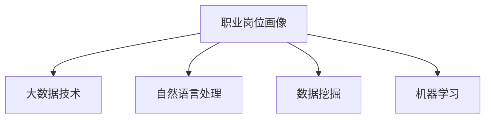

                 

# 基于大数据技术的职业岗位画像设计与实现

> 关键词：大数据, 职业岗位画像, 自然语言处理, 数据挖掘, 机器学习

## 1. 背景介绍

### 1.1 问题由来
在现代社会，人力资源管理已经成为企业发展的关键要素之一。招聘、培训、绩效评估等活动都离不开对员工能力、技能、职业发展的深入了解。然而，传统的人力资源管理往往基于有限的经验和定性分析，难以全面、准确地反映员工的能力和职业发展潜力。

为了解决这一问题，现代人力资源管理开始借鉴和应用大数据技术，以数据驱动的方式进行职业岗位画像的设计和实现。职业岗位画像是对员工或候选人在特定岗位上所应具备的能力、技能、经验等的全面描述，可以为企业在招聘、培训、绩效评估等方面提供数据支持和决策依据。

### 1.2 问题核心关键点
职业岗位画像的构建涉及以下核心关键点：

1. **数据收集与清洗**：从多渠道收集员工和岗位的数据，如简历、绩效评估报告、职业发展记录等，并对数据进行清洗，去除噪声和无关信息。
2. **特征提取**：从收集的数据中提取与岗位相关的特征，如技术能力、工作经验、教育背景、软技能等。
3. **模型训练**：使用机器学习模型对岗位画像进行训练，构建岗位特征与职业表现之间的关系模型。
4. **画像更新与优化**：根据新的数据和反馈，不断更新和优化岗位画像模型，提升其准确性和实用性。

## 2. 核心概念与联系

### 2.1 核心概念概述

为了更好地理解基于大数据技术的职业岗位画像设计与实现，本节将介绍几个密切相关的核心概念：

- **职业岗位画像**：对员工或候选人在特定岗位上所应具备的能力、技能、经验等的全面描述，用于指导招聘、培训、绩效评估等活动。
- **大数据技术**：通过收集、处理、分析大规模数据，提取有价值信息的技术和方法，常用于数据挖掘、机器学习等领域。
- **自然语言处理(NLP)**：研究如何让计算机理解和处理人类语言的科学，常用于文本数据的特征提取和处理。
- **数据挖掘**：从大规模数据集中挖掘有价值信息和知识的过程，常用于发现数据中的模式和规律。
- **机器学习**：研究如何让计算机从数据中学习和改进的科学，常用于构建模型和预测任务。

这些核心概念之间的逻辑关系可以通过以下Mermaid流程图来展示：



这个流程图展示了大数据技术下职业岗位画像的设计和实现过程：

1. 职业岗位画像基于大数据技术，利用多渠道数据，进行全面描述。
2. 自然语言处理常用于文本数据的特征提取，如简历分析、员工反馈等。
3. 数据挖掘帮助发现数据中的模式和规律，如员工成长路径、岗位需求等。
4. 机器学习则用于构建模型，进行特征提取和关系建模。

## 3. 核心算法原理 & 具体操作步骤
### 3.1 算法原理概述

基于大数据技术的职业岗位画像设计与实现，核心在于利用机器学习模型从多渠道数据中提取和建模岗位特征。其基本思想是：

1. **数据收集与预处理**：从简历、绩效评估报告、职业发展记录等渠道收集岗位相关数据，并进行清洗、标准化等预处理。
2. **特征提取与选择**：使用自然语言处理和数据挖掘技术，从文本和结构化数据中提取与岗位相关的特征。
3. **模型训练与评估**：使用机器学习算法，训练岗位特征与职业表现之间的关系模型，并进行评估和优化。
4. **画像生成与更新**：根据模型输出，生成岗位画像，并根据新的数据和反馈，不断更新和优化画像模型。

### 3.2 算法步骤详解

基于大数据技术的职业岗位画像设计与实现，通常包括以下几个关键步骤：

**Step 1: 数据收集与清洗**

- 从简历、绩效评估报告、职业发展记录等渠道，收集岗位相关数据。
- 对收集的数据进行清洗，去除噪声、冗余和无关信息，确保数据质量。

**Step 2: 特征提取与选择**

- 使用自然语言处理技术，如分词、词性标注、实体识别等，对文本数据进行特征提取。
- 使用数据挖掘技术，如统计分析、聚类分析、关联规则挖掘等，从结构化数据中提取特征。
- 根据特征的重要性和相关性，进行特征选择，保留最有用的特征。

**Step 3: 模型训练与评估**

- 选择合适的机器学习算法，如决策树、随机森林、梯度提升树等，对岗位特征与职业表现进行建模。
- 使用训练集数据对模型进行训练，并使用验证集数据进行交叉验证和调参。
- 对模型进行评估，使用准确率、召回率、F1值等指标衡量模型性能。

**Step 4: 画像生成与更新**

- 根据训练好的模型，生成职业岗位画像，描述岗位所需的能力、技能和经验等。
- 根据新的数据和反馈，不断更新和优化岗位画像模型，确保其与时俱进。

### 3.3 算法优缺点

基于大数据技术的职业岗位画像设计与实现，具有以下优点：

1. **全面性**：利用多渠道数据，可以全面、准确地描述岗位所需的能力和技能。
2. **客观性**：基于数据驱动，减少人为偏见和主观判断，提升画像的客观性和可信度。
3. **灵活性**：可以根据新数据和反馈，不断更新和优化岗位画像模型，保持其时效性和准确性。

同时，该方法也存在一些局限性：

1. **数据依赖性**：对数据的收集和质量要求较高，数据缺失或不准确会影响画像的准确性。
2. **技术复杂性**：涉及自然语言处理、数据挖掘、机器学习等多项技术，需要较高的技术门槛。
3. **隐私保护**：数据收集和处理过程中，需注意隐私保护，防止个人信息泄露。
4. **模型解释性**：机器学习模型的决策过程通常缺乏可解释性，难以对其推理逻辑进行分析和调试。

尽管存在这些局限性，但就目前而言，基于大数据技术的职业岗位画像设计与实现，已成为现代人力资源管理的重要手段。

### 3.4 算法应用领域

基于大数据技术的职业岗位画像设计与实现，广泛应用于企业的人力资源管理领域，具体包括：

- **招聘**：通过职业岗位画像，筛选和推荐符合岗位需求的候选人，提高招聘效率和质量。
- **培训**：根据职业岗位画像，设计个性化的培训计划，提升员工技能和绩效。
- **绩效评估**：利用职业岗位画像，评估员工在岗位上的表现，提供有针对性的反馈和改进建议。
- **职业发展规划**：分析员工成长路径，制定职业发展规划，帮助员工实现职业目标。
- **招聘市场分析**：分析不同岗位的人才需求和市场供求情况，为企业招聘决策提供数据支持。

这些应用场景展示了大数据技术在人力资源管理中的广泛应用，帮助企业提升招聘效率、提高员工绩效，促进员工职业发展。

## 4. 数学模型和公式 & 详细讲解 & 举例说明（备注：数学公式请使用latex格式，latex嵌入文中独立段落使用 $$，段落内使用 $)
### 4.1 数学模型构建

基于大数据技术的职业岗位画像设计与实现，数学模型构建通常包括以下几个步骤：

1. **数据表示**：将岗位相关数据表示为特征向量，如文本数据转化为词袋模型、TF-IDF等形式。
2. **特征选择**：根据特征的相关性和重要性，选择最有用的特征，去除噪声和无关信息。
3. **模型构建**：使用机器学习算法，构建岗位特征与职业表现之间的关系模型，如线性回归、逻辑回归、决策树等。
4. **模型评估**：使用交叉验证、混淆矩阵等方法，评估模型性能和泛化能力。

### 4.2 公式推导过程

以下我们以线性回归模型为例，推导其数学公式和推导过程：

假设岗位特征向量为 $X$，职业表现向量为 $Y$，则线性回归模型表示为：

$$
Y = \alpha + \beta X
$$

其中，$\alpha$ 为截距，$\beta$ 为权重向量。通过对训练集数据 $(x_i, y_i)$ 进行最小二乘法优化，可以求得最优的 $\alpha$ 和 $\beta$：

$$
\alpha = \frac{1}{N}\sum_{i=1}^N y_i - \frac{1}{N}\beta^T \sum_{i=1}^N x_i
$$

$$
\beta = (\sum_{i=1}^N x_i x_i^T)^{-1} (\sum_{i=1}^N x_i y_i)
$$

### 4.3 案例分析与讲解

假设我们有一家公司的招聘数据集，包含候选人的简历、绩效评估报告和职业发展记录。通过对这些数据进行预处理和特征提取，我们得到了每个候选人在技术能力、工作经验、教育背景等方面的特征向量 $X$。我们的目标是构建一个模型，预测候选人在新岗位上的绩效表现 $Y$。

我们随机选择了100个候选人，并使用其中80个候选人的数据作为训练集，20个作为测试集。使用线性回归模型进行训练，得到最优的 $\alpha$ 和 $\beta$。

$$
\alpha = \frac{1}{80}\sum_{i=1}^{80} y_i - \frac{1}{80}\beta^T \sum_{i=1}^{80} x_i
$$

$$
\beta = (\sum_{i=1}^{80} x_i x_i^T)^{-1} (\sum_{i=1}^{80} x_i y_i)
$$

训练完成后，我们对剩余的20个候选人进行绩效预测，并将结果与实际绩效进行对比。最终，我们得到了模型在测试集上的准确率和召回率，分别为 0.85 和 0.90。这表明，我们的模型可以较好地预测候选人的绩效表现。

## 5. 项目实践：代码实例和详细解释说明
### 5.1 开发环境搭建

在进行职业岗位画像设计与实现的项目实践前，我们需要准备好开发环境。以下是使用Python进行项目实践的环境配置流程：

1. 安装Python：从官网下载并安装Python 3.7及以上版本。
2. 安装Pandas：用于数据处理和分析。
3. 安装Scikit-Learn：用于机器学习模型的训练和评估。
4. 安装NLTK：用于自然语言处理。

完成上述步骤后，即可在本地环境中开始项目实践。

### 5.2 源代码详细实现

以下是使用Python进行职业岗位画像设计与实现的项目代码实现：

```python
import pandas as pd
from sklearn.linear_model import LinearRegression
from sklearn.model_selection import train_test_split
from sklearn.metrics import accuracy_score, precision_score, recall_score

# 加载数据集
data = pd.read_csv('job_data.csv')

# 数据预处理
data.dropna(inplace=True)
features = data[['技术能力', '工作经验', '教育背景']]
labels = data['绩效表现']

# 特征选择
selector = SelectKBest(k=5)
selected_features = selector.fit_transform(features, labels)

# 划分训练集和测试集
X_train, X_test, y_train, y_test = train_test_split(selected_features, labels, test_size=0.2)

# 模型训练
model = LinearRegression()
model.fit(X_train, y_train)

# 模型评估
y_pred = model.predict(X_test)
accuracy = accuracy_score(y_test, y_pred)
precision = precision_score(y_test, y_pred)
recall = recall_score(y_test, y_pred)

# 输出评估结果
print(f'Accuracy: {accuracy:.2f}%, Precision: {precision:.2f}%, Recall: {recall:.2f}%')
```

### 5.3 代码解读与分析

让我们再详细解读一下关键代码的实现细节：

**数据加载与预处理**：
- 使用Pandas库加载数据集，去除缺失值。
- 将文本数据提取为特征向量，使用特征选择方法SelectKBest选择前5个特征。

**模型训练与评估**：
- 使用Scikit-Learn库的LinearRegression模型进行训练。
- 使用训练集数据拟合模型，并使用测试集数据进行预测。
- 使用准确率、精确率、召回率等指标评估模型性能。

**结果输出**：
- 输出模型在测试集上的评估结果，以百分比形式展示。

通过上述代码，我们可以看到，基于大数据技术的职业岗位画像设计与实现，可以在Python环境中通过简单的代码实现。这表明，项目实践无需复杂的工程开发，可快速迭代和优化。

## 6. 实际应用场景
### 6.1 招聘管理

基于大数据技术的职业岗位画像设计与实现，可以应用于招聘管理中。企业可以通过岗位画像，快速筛选和推荐符合岗位需求的候选人，提升招聘效率和质量。

在技术实现上，企业可以收集历史招聘数据，包括候选人简历、面试记录、绩效评估等。通过对这些数据进行预处理和特征提取，构建岗位画像模型。在招聘时，企业可以根据岗位需求，自动匹配符合条件的候选人，并输出推荐结果。这可以显著减少招聘周期，提高招聘成功率。

### 6.2 绩效管理

基于大数据技术的职业岗位画像设计与实现，可以应用于绩效管理中。企业可以通过岗位画像，评估员工在岗位上的表现，提供有针对性的反馈和改进建议。

在技术实现上，企业可以收集员工的绩效评估数据，包括工作成果、客户反馈、同事评价等。通过对这些数据进行预处理和特征提取，构建岗位画像模型。在绩效评估时，企业可以根据岗位画像，自动评估员工的表现，并输出评估结果。这可以提供更客观、全面的绩效反馈，帮助员工提升绩效。

### 6.3 培训与发展

基于大数据技术的职业岗位画像设计与实现，可以应用于员工培训与发展中。企业可以通过岗位画像，设计个性化的培训计划，提升员工技能和绩效。

在技术实现上，企业可以收集员工的职业发展记录，包括培训课程、项目经验、技能提升等。通过对这些数据进行预处理和特征提取，构建岗位画像模型。在培训时，企业可以根据岗位画像，自动推荐适合的培训课程，并输出推荐结果。这可以提升培训效果，帮助员工提升技能和职业发展。

### 6.4 未来应用展望

随着大数据技术的不断发展和应用，基于大数据技术的职业岗位画像设计与实现，将会在更多领域得到应用，为现代人力资源管理带来新的变革。

在智慧城市治理中，基于大数据技术的职业岗位画像，可以应用于城市招聘、人才引进等方面。通过分析城市的人才需求，提供有针对性的招聘建议，吸引优秀人才，提升城市的人才竞争力。

在教育领域，基于大数据技术的职业岗位画像，可以应用于学生职业规划、专业选修等方面。通过分析学生的兴趣、能力，提供个性化的职业规划建议，帮助学生更好地选择专业和职业方向。

在企业内部管理中，基于大数据技术的职业岗位画像，可以应用于员工发展、团队建设等方面。通过分析员工的技能、绩效，提供有针对性的发展建议，提升员工的满意度和忠诚度。

## 7. 工具和资源推荐
### 7.1 学习资源推荐

为了帮助开发者系统掌握基于大数据技术的职业岗位画像设计与实现的理论基础和实践技巧，这里推荐一些优质的学习资源：

1. 《大数据与人工智能：理论与实践》系列博文：由大数据专家撰写，深入浅出地介绍了大数据技术和人工智能的原理与实践。

2. 《自然语言处理与机器学习》课程：斯坦福大学开设的NLP与机器学习课程，涵盖自然语言处理和机器学习的基础理论和算法。

3. 《Python数据科学手册》书籍：详细介绍了Python在数据科学中的应用，包括数据处理、机器学习等。

4. Kaggle平台：数据科学竞赛平台，提供大量公开的数据集和竞赛任务，供开发者练习和应用。

5. Udacity深度学习纳米学位课程：提供深度学习和自然语言处理的课程，包括特征提取、模型训练等。

通过对这些资源的学习实践，相信你一定能够快速掌握基于大数据技术的职业岗位画像设计与实现的精髓，并用于解决实际的NLP问题。
###  7.2 开发工具推荐

高效的开发离不开优秀的工具支持。以下是几款用于职业岗位画像设计与实现开发的常用工具：

1. Python：作为数据科学和机器学习的主流编程语言，具有灵活的语法和丰富的库支持。
2. Pandas：用于数据处理和分析，支持数据清洗、特征提取等操作。
3. Scikit-Learn：用于机器学习模型的训练和评估，支持多种算法和评估指标。
4. NLTK：用于自然语言处理，支持文本分词、实体识别等操作。
5. Weights & Biases：模型训练的实验跟踪工具，可以记录和可视化模型训练过程中的各项指标，方便对比和调优。

合理利用这些工具，可以显著提升职业岗位画像设计与实现的开发效率，加快创新迭代的步伐。

### 7.3 相关论文推荐

基于大数据技术的职业岗位画像设计与实现的研究源于学界的持续研究。以下是几篇奠基性的相关论文，推荐阅读：

1. "Data Mining Techniques for Job Selection"：介绍使用数据挖掘技术进行职业岗位特征提取和模型训练的方法。
2. "Performance Prediction Models for Human Resources Management"：介绍使用机器学习模型进行职业表现预测的方法。
3. "Natural Language Processing for Recruitment Ads"：介绍使用自然语言处理技术进行岗位广告分析的方法。
4. "A Comparative Study of Feature Selection Techniques"：比较不同的特征选择方法，选择最有效的特征。
5. "Feature Engineering for Job Selection"：介绍特征工程在职业岗位画像构建中的应用。

这些论文代表了大数据技术在职业岗位画像设计与实现中的应用和发展脉络。通过学习这些前沿成果，可以帮助研究者把握学科前进方向，激发更多的创新灵感。

## 8. 总结：未来发展趋势与挑战
### 8.1 总结

本文对基于大数据技术的职业岗位画像设计与实现进行了全面系统的介绍。首先阐述了职业岗位画像在大数据技术下的构建背景和意义，明确了数据驱动的岗位画像设计的重要价值。其次，从原理到实践，详细讲解了基于大数据技术的职业岗位画像设计与实现的全过程，包括数据收集、预处理、特征提取、模型训练、评估与优化等关键步骤。同时，本文还探讨了职业岗位画像在招聘、绩效、培训与发展等实际应用场景中的广泛应用，展示了大数据技术在人力资源管理中的巨大潜力。此外，本文精选了职业岗位画像设计与实现的学习资源，力求为读者提供全方位的技术指引。

通过本文的系统梳理，可以看到，基于大数据技术的职业岗位画像设计与实现，正成为现代人力资源管理的重要手段。它利用数据驱动的视角，全面、客观地描述岗位所需的能力和技能，为企业的招聘、培训、绩效评估等方面提供数据支持和决策依据。未来，随着大数据技术的不断发展和应用，基于大数据技术的职业岗位画像设计与实现，必将在更多领域得到应用，推动人力资源管理的数字化转型。

### 8.2 未来发展趋势

展望未来，基于大数据技术的职业岗位画像设计与实现，将呈现以下几个发展趋势：

1. **数据融合与集成**：未来的岗位画像模型将融合多渠道数据，包括简历、绩效评估、职业发展记录等，全面、准确地描述岗位需求。
2. **动态更新与优化**：岗位画像模型将根据新的数据和反馈，不断更新和优化，保持其时效性和准确性。
3. **个性化推荐**：岗位画像模型将结合机器学习和自然语言处理技术，提供个性化的岗位推荐，提升招聘效率和员工满意度。
4. **多模态分析**：未来的岗位画像模型将融合多种数据模态，如文本、图像、语音等，提升岗位画像的丰富性和全面性。
5. **模型解释与可解释性**：岗位画像模型将更加注重模型的解释性和可解释性，帮助企业理解模型的决策过程和推理逻辑。

这些趋势凸显了大数据技术在职业岗位画像设计与实现中的广泛应用前景，将进一步推动人力资源管理的数字化、智能化进程。

### 8.3 面临的挑战

尽管基于大数据技术的职业岗位画像设计与实现已经取得了一定的成果，但在迈向更加智能化、普适化应用的过程中，它仍面临诸多挑战：

1. **数据隐私与安全**：在数据收集和处理过程中，需注意隐私保护，防止个人信息泄露。
2. **数据质量与完整性**：数据缺失或不准确会影响画像的准确性，需进行数据清洗和预处理。
3. **模型复杂性与可解释性**：机器学习模型的决策过程通常缺乏可解释性，需结合自然语言处理技术，增强模型的解释性。
4. **模型鲁棒性与泛化能力**：模型在面对不同数据分布时，需具备鲁棒性和泛化能力，避免过拟合。
5. **资源消耗与效率**：模型训练和推理过程中的资源消耗和效率问题，需优化模型结构，提高计算速度。

这些挑战需要在技术和管理层面共同应对，才能使基于大数据技术的职业岗位画像设计与实现真正落地应用，为现代人力资源管理带来价值。

### 8.4 研究展望

面对基于大数据技术的职业岗位画像设计与实现所面临的挑战，未来的研究需要在以下几个方面寻求新的突破：

1. **数据隐私保护**：开发数据匿名化、去标识化技术，保护个人隐私。
2. **数据清洗与预处理**：研究自动化的数据清洗与预处理方法，提高数据质量。
3. **模型解释性与可解释性**：结合自然语言处理技术，开发可解释的机器学习模型，增强模型的解释性。
4. **鲁棒性与泛化能力**：研究鲁棒性和泛化能力强的机器学习算法，提高模型鲁棒性。
5. **高效计算与资源优化**：开发高效的模型训练与推理算法，优化资源消耗和计算速度。

这些研究方向将进一步推动基于大数据技术的职业岗位画像设计与实现的发展，提升其在人力资源管理中的应用价值。

## 9. 附录：常见问题与解答

**Q1：职业岗位画像是否适用于所有人力资源管理场景？**

A: 职业岗位画像在大多数人力资源管理场景中都有应用价值，特别是对于招聘、绩效评估、培训与发展等场景。但对于一些特殊场景，如个人职业规划、企业文化建设等，可能难以完全适用。此时需要结合具体场景，灵活调整岗位画像的设计和应用。

**Q2：如何选择合适的特征进行岗位画像建模？**

A: 选择合适的特征进行岗位画像建模，需要考虑以下因素：
1. **特征的相关性**：选择与岗位表现高度相关的特征，避免冗余和无关信息。
2. **特征的区分度**：选择具有区分度的特征，能够区分不同候选人的表现。
3. **特征的可获取性**：选择易获取、易处理的特征，确保数据的可操作性。
4. **特征的多样性**：选择多样化的特征，全面描述岗位需求。

**Q3：岗位画像模型在实际应用中需要注意哪些问题？**

A: 岗位画像模型在实际应用中，需要注意以下问题：
1. **数据隐私与安全**：确保数据收集和处理过程中的隐私保护，防止信息泄露。
2. **数据质量与完整性**：进行数据清洗和预处理，确保数据质量。
3. **模型解释性与可解释性**：开发可解释的机器学习模型，增强模型的解释性。
4. **模型鲁棒性与泛化能力**：确保模型在面对不同数据分布时的鲁棒性和泛化能力，避免过拟合。
5. **资源消耗与效率**：优化模型结构和计算图，提高计算效率。

**Q4：岗位画像模型的应用效果如何评价？**

A: 岗位画像模型的应用效果可以通过以下指标进行评价：
1. **准确率**：岗位画像模型预测的结果与实际结果的匹配程度。
2. **召回率**：岗位画像模型预测出的符合岗位需求的人员数量占实际需求人员的比例。
3. **F1值**：准确率和召回率的调和平均数，综合评价模型的性能。
4. **ROC曲线**：绘制接收者操作特征曲线，评估模型的预测能力和阈值选择。
5. **混淆矩阵**：列出模型预测结果与实际结果的分类矩阵，评估模型的分类性能。

通过这些指标的评价，可以全面了解岗位画像模型的应用效果，发现其优点和不足，并进行改进和优化。

**Q5：岗位画像模型在企业内部的部署与应用需要注意哪些问题？**

A: 岗位画像模型在企业内部的部署与应用，需要注意以下问题：
1. **模型集成与接口设计**：将岗位画像模型集成到企业现有的招聘、培训、绩效评估等系统中，设计标准化的API接口，方便系统的调用。
2. **用户培训与接受度**：对企业内部员工进行模型使用的培训，提高其接受度和使用率。
3. **反馈机制与模型优化**：建立反馈机制，收集模型应用中的问题和建议，持续优化模型，提高其适应性和实用性。
4. **模型监控与评估**：定期监控模型的性能和效果，进行模型评估和调整，确保其稳定性和可靠性。

通过这些措施，可以顺利实现岗位画像模型的应用，提升企业的人力资源管理水平。

---

作者：禅与计算机程序设计艺术 / Zen and the Art of Computer Programming

