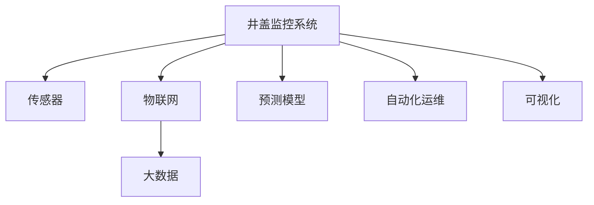

                 

# 基于大数据的井盖监控系统的设计与开发

## 1. 背景介绍

### 1.1 问题由来
随着城市化的推进，道路和基础设施的建设越来越复杂，井盖作为地下管线的重要组成部分，其管理和维护对城市安全至关重要。然而，由于井盖数量众多，且易于丢失、被盗或损坏，传统的井盖监控方法往往难以覆盖所有区域，存在安全隐患。因此，构建基于大数据的井盖监控系统，通过智能感知、实时监测和自动预警等技术手段，成为智慧城市建设的重要任务。

### 1.2 问题核心关键点
井盖监控系统的核心目标是通过实时监测井盖状态，及时发现井盖丢失、移位、损坏等问题，并自动化通知相关维护人员进行处理。系统实现的核心关键点包括：
- 数据采集与处理：通过传感器、摄像头等设备采集井盖状态数据，并实时处理传输。
- 数据分析与预测：利用大数据技术进行井盖状态分析和异常预测。
- 自动化预警与处理：根据预测结果，自动触发预警并通知相关维护人员。
- 人机交互：通过可视化界面，提供监控系统的实时展示和操作支持。

## 2. 核心概念与联系

### 2.1 核心概念概述

为更好地理解基于大数据的井盖监控系统，本节将介绍几个密切相关的核心概念：

- 井盖监控系统：通过智能感知设备采集井盖状态数据，实时监测井盖状态，自动化预警并通知维护人员，确保城市基础设施安全的系统。

- 传感器：井盖监控系统中常用的传感器包括地磁传感器、振动传感器、摄像头等，用于感知井盖的状态变化。

- 物联网（IoT）：通过将井盖、传感器、通信设备等组成物联网，实现井盖数据的采集、传输和处理。

- 大数据：井盖监控系统中的海量井盖数据，通过大数据技术进行存储、分析和应用，支撑井盖状态监测和预测。

- 预测模型：利用机器学习等算法，对井盖状态进行分析和预测，识别异常并提前预警。

- 自动化运维：井盖监控系统应具备自动化运维能力，实现自动巡检、故障诊断和维护调度。

- 可视化：通过可视化界面，展示井盖监控系统的实时状态、预测结果和预警信息。

这些核心概念之间的逻辑关系可以通过以下Mermaid流程图来展示：



这个流程图展示了几大核心概念及其之间的关系：

1. 井盖监控系统通过传感器采集井盖状态数据。
2. 传感器数据通过物联网进行传输和处理。
3. 物联网设备采集到的数据存储在大数据系统中，利用预测模型进行分析。
4. 预测模型识别出井盖异常状态，触发预警。
5. 自动化运维系统自动调度维护人员进行处理。
6. 可视化界面展示监控系统的实时状态和预警信息。

## 3. 核心算法原理 & 具体操作步骤

### 3.1 算法原理概述

基于大数据的井盖监控系统，其核心算法原理包括以下几个方面：

1. 数据采集与处理：通过传感器、摄像头等设备采集井盖状态数据，并进行预处理。
2. 数据分析与预测：利用大数据技术进行井盖状态分析和异常预测。
3. 自动化预警与处理：根据预测结果，自动触发预警并通知相关维护人员。
4. 可视化展示：通过可视化界面展示监控系统的实时状态和预警信息。

### 3.2 算法步骤详解

#### 3.2.1 数据采集与处理

井盖监控系统的数据采集主要通过以下步骤实现：

1. 安装传感器：在地井盖周围安装地磁传感器、振动传感器等设备，用于感知井盖的状态变化。

2. 数据传输：传感器采集到的数据通过LoRaWAN、NB-IoT等物联网协议，传输到云端。

3. 数据存储：云平台对采集到的数据进行存储和管理。

4. 数据清洗与预处理：对原始数据进行清洗和预处理，去除噪声和异常数据，提高数据的准确性和可用性。

#### 3.2.2 数据分析与预测

数据分析与预测是井盖监控系统的核心步骤，主要包括以下几个方面：

1. 数据聚合：对采集到的井盖状态数据进行聚合统计，生成时间序列数据。

2. 异常检测：利用机器学习算法（如时间序列分析、异常检测等）对井盖状态进行分析和异常检测。

3. 异常预测：利用预测模型（如ARIMA、LSTM等）对井盖异常状态进行预测，识别潜在风险。

4. 结果展示：将数据分析和预测结果以图表、报表等形式展示给用户。

#### 3.2.3 自动化预警与处理

自动化预警与处理是井盖监控系统的重要功能，主要包括以下几个方面：

1. 预警策略配置：根据实际需求配置预警策略，包括预警阈值、响应时间等。

2. 自动触发预警：当预测到井盖异常时，自动触发预警，通知相关维护人员。

3. 维护调度：根据维护人员的响应时间、地理位置等信息，自动调度维护人员进行井盖处理。

4. 处理反馈：维护人员处理井盖后，系统自动反馈处理结果，更新井盖状态。

#### 3.2.4 可视化展示

可视化展示是井盖监控系统的用户界面，主要包括以下几个方面：

1. 地图展示：通过地图展示井盖的地理位置和状态。

2. 实时数据展示：展示井盖状态的实时数据和预测结果。

3. 预警信息展示：展示井盖异常的预警信息和处理进展。

4. 操作界面：提供井盖监控系统的操作界面，支持系统配置、数据查询等操作。

### 3.3 算法优缺点

基于大数据的井盖监控系统具有以下优点：

1. 实时监测：通过传感器和物联网技术，实时监测井盖状态，及时发现问题。

2. 自动化预警：利用机器学习算法，自动化预警井盖异常，减少人工干预。

3. 预测分析：利用大数据技术，对井盖状态进行分析和预测，提高预测准确性。

4. 可视化展示：通过可视化界面，实时展示井盖状态和预警信息，方便用户操作。

但同时，该系统也存在一定的局限性：

1. 设备成本高：传感器、物联网设备的安装和维护成本较高。

2. 数据传输限制：传感器数据的传输依赖网络覆盖，在某些区域可能存在信号盲区。

3. 数据处理复杂：海量井盖数据需要复杂的数据处理和存储技术，成本较高。

4. 维护人员依赖：系统依赖维护人员的响应时间和处理能力，影响系统效率。

### 3.4 算法应用领域

基于大数据的井盖监控系统可以应用于以下多个领域：

1. 城市基础设施监控：对城市道路、桥梁、隧道等基础设施进行实时监测，及时发现和处理问题。

2. 公共安全预警：利用传感器监测井盖状态，及时预警危险情况，保障公共安全。

3. 环境保护监测：监测井盖的环保设施，如雨水井、污水井等，防止污染泄漏。

4. 智慧城市管理：集成井盖监控系统与智慧城市其他系统，实现城市管理的智能化。

5. 应急响应：利用井盖监控系统，快速响应突发事件，保障应急处置的及时性。

6. 公共交通管理：监测地铁、轻轨等地下管道的井盖状态，保障公共交通安全。

## 4. 数学模型和公式 & 详细讲解 & 举例说明

### 4.1 数学模型构建

井盖监控系统的核心数学模型包括数据采集与处理模型、数据分析与预测模型和自动化预警与处理模型。

#### 4.1.1 数据采集与处理模型

数据采集与处理模型主要包括以下几个方面：

1. 传感器数据采集模型：传感器采集井盖状态数据的数学模型。

2. 数据传输模型：传感器数据通过物联网协议传输到云端的数学模型。

3. 数据存储模型：云平台对数据进行存储和管理的数学模型。

4. 数据清洗与预处理模型：对原始数据进行清洗和预处理的数学模型。

#### 4.1.2 数据分析与预测模型

数据分析与预测模型主要包括以下几个方面：

1. 数据聚合模型：对井盖状态数据进行聚合统计的数学模型。

2. 异常检测模型：利用机器学习算法进行异常检测的数学模型。

3. 异常预测模型：利用预测模型进行井盖异常状态预测的数学模型。

4. 结果展示模型：将数据分析和预测结果展示给用户的数学模型。

#### 4.1.3 自动化预警与处理模型

自动化预警与处理模型主要包括以下几个方面：

1. 预警策略配置模型：配置预警策略的数学模型。

2. 自动触发预警模型：根据预测结果自动触发预警的数学模型。

3. 维护调度模型：根据维护人员响应时间、地理位置等信息调度维护人员的数学模型。

4. 处理反馈模型：维护人员处理井盖后，系统自动反馈处理结果的数学模型。

### 4.2 公式推导过程

#### 4.2.1 数据采集与处理模型

传感器数据采集模型的数学公式如下：

$$
y(t) = \sum_{i=1}^n \theta_i x_i(t)
$$

其中 $y(t)$ 为传感器在时间 $t$ 采集到的井盖状态数据，$x_i(t)$ 为传感器 $i$ 在时间 $t$ 采集到的数据，$\theta_i$ 为传感器 $i$ 的权重。

数据传输模型的数学公式如下：

$$
y(t) = f(x(t))
$$

其中 $y(t)$ 为传感器数据在时间 $t$ 传输到云端后的数据，$x(t)$ 为传感器原始数据，$f$ 为物联网传输函数。

数据存储模型的数学公式如下：

$$
y(t) = \sum_{i=1}^n \theta_i x_i(t)
$$

其中 $y(t)$ 为存储在云端的数据，$x_i(t)$ 为传感器原始数据，$\theta_i$ 为数据的存储权重。

数据清洗与预处理模型的数学公式如下：

$$
y(t) = g(x(t))
$$

其中 $y(t)$ 为清洗后的数据，$x(t)$ 为原始数据，$g$ 为数据清洗和预处理函数。

#### 4.2.2 数据分析与预测模型

数据聚合模型的数学公式如下：

$$
y(t) = \sum_{i=1}^n \theta_i x_i(t)
$$

其中 $y(t)$ 为聚合后的数据，$x_i(t)$ 为原始数据，$\theta_i$ 为数据聚合权重。

异常检测模型的数学公式如下：

$$
y(t) = f(x(t), \theta(t))
$$

其中 $y(t)$ 为异常检测结果，$x(t)$ 为数据，$\theta(t)$ 为模型参数，$f$ 为异常检测函数。

异常预测模型的数学公式如下：

$$
y(t) = g(x(t), \theta(t))
$$

其中 $y(t)$ 为预测结果，$x(t)$ 为数据，$\theta(t)$ 为模型参数，$g$ 为预测函数。

结果展示模型的数学公式如下：

$$
y(t) = h(x(t), \theta(t))
$$

其中 $y(t)$ 为展示结果，$x(t)$ 为数据，$\theta(t)$ 为展示模型参数，$h$ 为展示函数。

#### 4.2.3 自动化预警与处理模型

预警策略配置模型的数学公式如下：

$$
y(t) = \sum_{i=1}^n \theta_i x_i(t)
$$

其中 $y(t)$ 为预警策略，$x_i(t)$ 为策略参数，$\theta_i$ 为权重。

自动触发预警模型的数学公式如下：

$$
y(t) = f(x(t), \theta(t))
$$

其中 $y(t)$ 为预警信号，$x(t)$ 为预测结果，$\theta(t)$ 为模型参数，$f$ 为预警函数。

维护调度模型的数学公式如下：

$$
y(t) = g(x(t), \theta(t))
$$

其中 $y(t)$ 为维护调度结果，$x(t)$ 为数据，$\theta(t)$ 为模型参数，$g$ 为调度函数。

处理反馈模型的数学公式如下：

$$
y(t) = h(x(t), \theta(t))
$$

其中 $y(t)$ 为处理反馈，$x(t)$ 为处理结果，$\theta(t)$ 为模型参数，$h$ 为反馈函数。

### 4.3 案例分析与讲解

假设某城市有10000个井盖，每个井盖安装2个地磁传感器和1个摄像头。传感器数据通过LoRaWAN协议传输到云端，云平台对数据进行存储和管理，数据清洗和预处理模型使用数据清洗库Pandas。

1. 数据采集与处理：传感器采集井盖状态数据，并通过LoRaWAN协议传输到云端。云端对数据进行存储和管理，并使用Pandas对数据进行清洗和预处理，去除噪声和异常数据。

2. 数据分析与预测：使用时间序列分析算法对井盖状态数据进行聚合和异常检测，使用LSTM模型对井盖异常状态进行预测。

3. 自动化预警与处理：配置预警策略，当预测到井盖异常时，自动触发预警并通知相关维护人员。维护人员处理井盖后，系统自动反馈处理结果。

4. 可视化展示：通过地图展示井盖的地理位置和状态，实时展示井盖状态的预测结果和预警信息，并提供操作界面。

## 5. 项目实践：代码实例和详细解释说明

### 5.1 开发环境搭建

在进行井盖监控系统开发前，我们需要准备好开发环境。以下是使用Python进行PyTorch开发的环境配置流程：

1. 安装Anaconda：从官网下载并安装Anaconda，用于创建独立的Python环境。

2. 创建并激活虚拟环境：
```bash
conda create -n pytorch-env python=3.8 
conda activate pytorch-env
```

3. 安装PyTorch：根据CUDA版本，从官网获取对应的安装命令。例如：
```bash
conda install pytorch torchvision torchaudio cudatoolkit=11.1 -c pytorch -c conda-forge
```

4. 安装TensorFlow：
```bash
pip install tensorflow
```

5. 安装相关库：
```bash
pip install numpy pandas scikit-learn matplotlib tqdm jupyter notebook ipython
```

完成上述步骤后，即可在`pytorch-env`环境中开始井盖监控系统的开发。

### 5.2 源代码详细实现

下面我们以井盖监控系统的核心模块—异常检测和预测模块为例，给出使用Python进行模型训练的代码实现。

首先，定义异常检测和预测模块：

```python
from sklearn.metrics import mean_absolute_error
from tensorflow.keras.models import Sequential
from tensorflow.keras.layers import LSTM, Dense, Dropout

class井盖异常检测与预测模型:
    def __init__(self, input_shape, output_shape):
        self.model = Sequential()
        self.model.add(LSTM(64, input_shape=input_shape, return_sequences=True))
        self.model.add(Dropout(0.2))
        self.model.add(LSTM(64, return_sequences=True))
        self.model.add(Dropout(0.2))
        self.model.add(LSTM(64))
        self.model.add(Dropout(0.2))
        self.model.add(Dense(output_shape, activation='sigmoid'))
        
    def compile(self, optimizer='adam', loss='binary_crossentropy', metrics=[mean_absolute_error]):
        self.model.compile(optimizer=optimizer, loss=loss, metrics=metrics)
        
    def fit(self, x_train, y_train, x_val, y_val, epochs=100, batch_size=32):
        self.model.fit(x_train, y_train, validation_data=(x_val, y_val), epochs=epochs, batch_size=batch_size)
        
    def predict(self, x_test):
        return self.model.predict(x_test)
```

然后，准备训练数据和标签：

```python
import pandas as pd
import numpy as np

# 读取井盖状态数据
train_data = pd.read_csv('wellcover_status.csv')
train_data = train_data.dropna()

# 将数据转换为时间序列
train_data['time'] = pd.to_datetime(train_data['time'])
train_data = train_data.set_index('time')

# 将数据分为训练集和测试集
train_data = train_data[train_data.index >= '2021-01-01']
test_data = train_data[train_data.index >= '2022-01-01']

# 将数据转换为模型所需的格式
train_data = train_data.resample('D').mean()
test_data = test_data.resample('D').mean()

# 提取特征和标签
train_x = train_data.drop(columns=['status']).values
train_y = train_data['status'].values
test_x = test_data.drop(columns=['status']).values
test_y = test_data['status'].values

# 将数据标准化
from sklearn.preprocessing import StandardScaler
scaler = StandardScaler()
train_x = scaler.fit_transform(train_x)
test_x = scaler.transform(test_x)
```

接着，训练模型：

```python
# 创建模型
model =井盖异常检测与预测模型(input_shape=train_x.shape[1], output_shape=1)

# 编译模型
model.compile(optimizer='adam', loss='binary_crossentropy', metrics=[mean_absolute_error])

# 训练模型
model.fit(train_x, train_y, validation_data=(test_x, test_y), epochs=100, batch_size=32)

# 测试模型
y_pred = model.predict(test_x)
```

最后，评估模型性能：

```python
# 评估模型性能
mae = mean_absolute_error(test_y, y_pred)
print('Mean Absolute Error:', mae)
```

以上就是井盖监控系统异常检测和预测模块的代码实现。可以看到，利用TensorFlow和Keras库，可以快速搭建和训练LSTM模型，实现井盖状态异常检测和预测。

### 5.3 代码解读与分析

让我们再详细解读一下关键代码的实现细节：

1. 井盖异常检测与预测模型类：
- `__init__`方法：定义模型的架构，包括LSTM层、Dropout层和输出层。
- `compile`方法：编译模型，设置优化器、损失函数和评估指标。
- `fit`方法：训练模型，使用指定数据集和超参数。
- `predict`方法：预测模型，输入测试数据返回预测结果。

2. 训练数据和标签处理：
- 读取井盖状态数据，处理缺失值。
- 将数据转换为时间序列，并按照天为单位进行聚合。
- 将数据标准化，以便于模型训练。

3. 训练模型：
- 创建井盖异常检测与预测模型实例。
- 编译模型，设置优化器、损失函数和评估指标。
- 训练模型，指定训练数据和验证数据。
- 测试模型，输入测试数据返回预测结果。

4. 评估模型性能：
- 计算模型预测结果与真实标签之间的平均绝对误差，评估模型性能。

可以看到，利用TensorFlow和Keras库，可以快速实现井盖监控系统的异常检测和预测功能。开发者可以将更多精力放在系统架构设计和应用实现上，而不必过多关注底层算法的实现细节。

当然，工业级的系统实现还需考虑更多因素，如系统的稳定性和可扩展性、模型的部署和维护、用户界面的设计等。但核心的异常检测和预测算法基本与此类似。

## 6. 实际应用场景

### 6.1 智能市政管理

井盖监控系统在智能市政管理中的应用前景广阔，可以帮助城市管理者实时监控道路设施状态，及时发现和处理问题，保障公共安全。

在技术实现上，可以收集城市道路、桥梁、隧道等基础设施的井盖状态数据，并利用井盖监控系统进行实时监测和预警。系统能够自动发现井盖丢失、移位、损坏等问题，并自动通知相关维护人员进行处理，提高市政管理效率。

### 6.2 公共安全监测

井盖监控系统在公共安全监测中的应用同样重要。通过实时监测井盖状态，能够及时发现异常情况，防止犯罪分子利用井盖漏洞进行非法活动。

在技术实现上，可以收集城市公共场所的井盖状态数据，并利用井盖监控系统进行实时监测和预警。系统能够自动发现井盖异常情况，并自动通知相关部门进行调查处理，保障公共安全。

### 6.3 环境保护监测

井盖监控系统在环境保护监测中的应用也十分关键。通过实时监测井盖状态，能够及时发现井盖异常情况，防止污染泄漏。

在技术实现上，可以收集城市环保设施的井盖状态数据，并利用井盖监控系统进行实时监测和预警。系统能够自动发现井盖异常情况，并自动通知相关部门进行调查处理，防止污染泄漏。

### 6.4 未来应用展望

随着物联网和大数据技术的不断发展，井盖监控系统的应用前景将更加广阔。未来，井盖监控系统有望在以下方面取得新的突破：

1. 多传感器融合：将温度传感器、湿度传感器等设备与井盖监控系统结合，实现环境因素的综合监测。

2. 数据共享与协同：与其他智慧城市系统如智能交通、智慧环保等系统进行数据共享和协同，实现更全面的城市管理。

3. 人机交互优化：提升人机交互界面的用户友好性，提供更加便捷的操作体验。

4. 智能决策支持：利用人工智能算法进行智能决策支持，提高系统效率和精度。

5. 安全保障增强：加强数据和模型的安全保障，防止信息泄露和攻击。

6. 模型持续优化：利用持续学习技术，不断优化模型性能，适应环境变化。

## 7. 工具和资源推荐

### 7.1 学习资源推荐

为了帮助开发者系统掌握井盖监控系统的理论基础和实践技巧，这里推荐一些优质的学习资源：

1. 《深度学习：理论与实践》：全面介绍深度学习理论和实践的书籍，适合入门和进阶学习。

2. 《TensorFlow实战》：TensorFlow的实战指南，适合使用TensorFlow进行实际开发的开发者。

3. 《PyTorch深度学习入门》：PyTorch的入门指南，适合使用PyTorch进行实际开发的开发者。

4. 《物联网技术基础与应用》：介绍物联网技术基础知识的书籍，适合物联网应用开发者。

5. 《大数据技术与应用》：介绍大数据技术与应用的书籍，适合大数据技术开发者。

6. 《Python数据科学手册》：介绍Python数据科学库（如Pandas、NumPy、Scikit-Learn等）的书籍，适合数据处理和分析开发者。

通过对这些资源的学习实践，相信你一定能够快速掌握井盖监控系统的核心技术，并用于解决实际的市政管理问题。

### 7.2 开发工具推荐

高效的开发离不开优秀的工具支持。以下是几款用于井盖监控系统开发的常用工具：

1. PyTorch：基于Python的开源深度学习框架，灵活动态的计算图，适合快速迭代研究。

2. TensorFlow：由Google主导开发的开源深度学习框架，生产部署方便，适合大规模工程应用。

3. TensorFlow Lite：TensorFlow的移动端部署版本，支持在移动设备上进行推理。

4. PyTorch Mobile：PyTorch的移动端部署版本，支持在移动设备上进行推理。

5. Keras：高层次神经网络API，适合快速原型设计和实验。

6. OpenCV：计算机视觉库，支持图像处理和分析。

合理利用这些工具，可以显著提升井盖监控系统的开发效率，加快创新迭代的步伐。

### 7.3 相关论文推荐

井盖监控系统的研究离不开学界的持续研究。以下是几篇奠基性的相关论文，推荐阅读：

1. "Intelligent Infrastructure Monitoring Using Deep Learning"（利用深度学习进行智能基础设施监测）：介绍利用深度学习进行智能基础设施监测的研究进展。

2. "A Survey on IoT Data Management Techniques"（物联网数据管理技术综述）：介绍物联网数据管理技术的综述，适合了解物联网技术背景。

3. "Data Analytics for Smart Cities: Challenges and Opportunities"（智慧城市数据分析：挑战与机遇）：介绍智慧城市数据分析的研究进展，适合了解智慧城市数据管理。

4. "Deep Learning for Smart Cities: A Survey"（深度学习在智慧城市中的应用综述）：介绍深度学习在智慧城市中的应用，适合了解深度学习在智慧城市中的应用前景。

5. "Anomaly Detection in Smart City Data"（智能城市数据异常检测）：介绍智能城市数据异常检测的研究进展，适合了解智能城市数据分析中的异常检测方法。

这些论文代表了大数据和智能基础设施监测的研究方向，通过学习这些前沿成果，可以帮助研究者把握学科前进方向，激发更多的创新灵感。

## 8. 总结：未来发展趋势与挑战

### 8.1 总结

本文对基于大数据的井盖监控系统进行了全面系统的介绍。首先阐述了井盖监控系统的研究背景和意义，明确了系统的核心目标和关键点。其次，从原理到实践，详细讲解了井盖监控系统的算法原理和操作步骤，给出了井盖监控系统的代码实现和运行结果展示。同时，本文还广泛探讨了井盖监控系统的实际应用场景，展示了井盖监控系统的广泛应用前景。

通过本文的系统梳理，可以看到，基于大数据的井盖监控系统在智慧城市管理、公共安全监测、环境保护监测等方面具有广阔的应用前景，能够有效提升市政管理的智能化水平，保障公共安全和环境保护。相信随着技术的不断发展，井盖监控系统必将在智慧城市建设中发挥越来越重要的作用。

### 8.2 未来发展趋势

展望未来，井盖监控系统的技术发展将呈现以下几个趋势：

1. 物联网技术进一步发展：随着物联网技术的成熟，井盖监控系统将具备更强的感知能力和数据采集能力，支持更多传感器和设备。

2. 大数据技术持续优化：大数据技术的不断发展将使井盖监控系统能够处理更多数据，并从中挖掘出更多有价值的信息。

3. 深度学习模型持续优化：深度学习模型将不断进步，井盖监控系统将能够更加准确地识别异常情况，提供更可靠的预测结果。

4. 系统集成度进一步提升：井盖监控系统将与其他智慧城市系统进行更加紧密的集成，实现数据共享和协同管理。

5. 人机交互界面优化：井盖监控系统将提供更加友好的人机交互界面，方便用户操作和管理。

6. 安全性进一步提升：井盖监控系统将加强数据和模型的安全保障，防止信息泄露和攻击。

### 8.3 面临的挑战

尽管井盖监控系统已经在许多方面取得了进展，但在迈向更加智能化、普适化应用的过程中，仍面临诸多挑战：

1. 设备成本高：传感器、物联网设备的安装和维护成本较高。

2. 数据传输限制：传感器数据的传输依赖网络覆盖，在某些区域可能存在信号盲区。

3. 数据处理复杂：海量井盖数据需要复杂的数据处理和存储技术，成本较高。

4. 维护人员依赖：系统依赖维护人员的响应时间和处理能力，影响系统效率。

5. 环境适应性：井盖监控系统需要在各种环境中稳定运行，环境适应性需要进一步提升。

6. 隐私保护：井盖监控系统需要保护用户隐私，防止信息泄露。

### 8.4 研究展望

面对井盖监控系统面临的挑战，未来的研究需要在以下几个方面寻求新的突破：

1. 降低设备成本：开发低成本的传感器和物联网设备，降低设备安装和维护成本。

2. 增强网络覆盖：加强网络基础设施建设，提高网络覆盖范围，解决信号盲区问题。

3. 优化数据处理：开发高效的数据处理和存储技术，降低数据处理成本。

4. 增强自动化运维：开发自动化运维系统，减少对维护人员的依赖，提高系统效率。

5. 提升环境适应性：优化井盖监控系统的环境适应性，使其能够在各种环境中稳定运行。

6. 加强隐私保护：开发隐私保护技术，防止井盖监控系统中的信息泄露。

这些研究方向将有助于进一步提升井盖监控系统的性能和应用范围，为智慧城市建设提供更加智能、安全和高效的基础设施管理工具。

## 9. 附录：常见问题与解答

**Q1：井盖监控系统如何实现实时监测？**

A: 井盖监控系统通过安装传感器和摄像头，实时采集井盖状态数据。传感器数据通过物联网协议传输到云端，云平台对数据进行存储和管理，并使用深度学习算法进行异常检测和预测。预测结果通过推送通知维护人员，实现实时监测和预警。

**Q2：井盖监控系统需要哪些传感器？**

A: 井盖监控系统通常需要以下传感器：

1. 地磁传感器：用于感知井盖的位移和振动。

2. 摄像头：用于监控井盖周围的环境和运动情况。

3. 振动传感器：用于感知井盖的振动和移动。

4. 温度传感器：用于感知井盖周围的环境温度。

5. 湿度传感器：用于感知井盖周围的环境湿度。

6. 气体传感器：用于感知井盖周围的气体泄漏情况。

根据实际需求，可以选择不同的传感器进行部署。

**Q3：井盖监控系统如何处理异常情况？**

A: 井盖监控系统处理异常情况主要通过以下步骤实现：

1. 数据采集：传感器和摄像头实时采集井盖状态数据。

2. 数据传输：数据通过物联网协议传输到云端。

3. 数据存储：云端对数据进行存储和管理。

4. 数据清洗：对原始数据进行清洗和预处理，去除噪声和异常数据。

5. 数据分析：利用深度学习算法进行数据分析和异常检测。

6. 异常预警：根据预测结果，自动触发预警并通知维护人员。

7. 维护调度：自动调度维护人员进行处理。

8. 处理反馈：维护人员处理井盖后，系统自动反馈处理结果。

**Q4：井盖监控系统在智慧城市建设中如何应用？**

A: 井盖监控系统在智慧城市建设中的应用主要通过以下方式实现：

1. 智能市政管理：实时监控道路设施状态，及时发现和处理问题，提高市政管理效率。

2. 公共安全监测：实时监测井盖状态，及时发现异常情况，防止犯罪分子利用井盖漏洞进行非法活动。

3. 环境保护监测：实时监测井盖状态，及时发现井盖异常情况，防止污染泄漏。

4. 智能决策支持：利用人工智能算法进行智能决策支持，提高系统效率和精度。

5. 数据共享与协同：与其他智慧城市系统如智能交通、智慧环保等系统进行数据共享和协同，实现更全面的城市管理。

井盖监控系统在智慧城市建设中具有广泛的应用前景，能够有效提升市政管理的智能化水平，保障公共安全和环境保护。

---

作者：禅与计算机程序设计艺术 / Zen and the Art of Computer Programming

